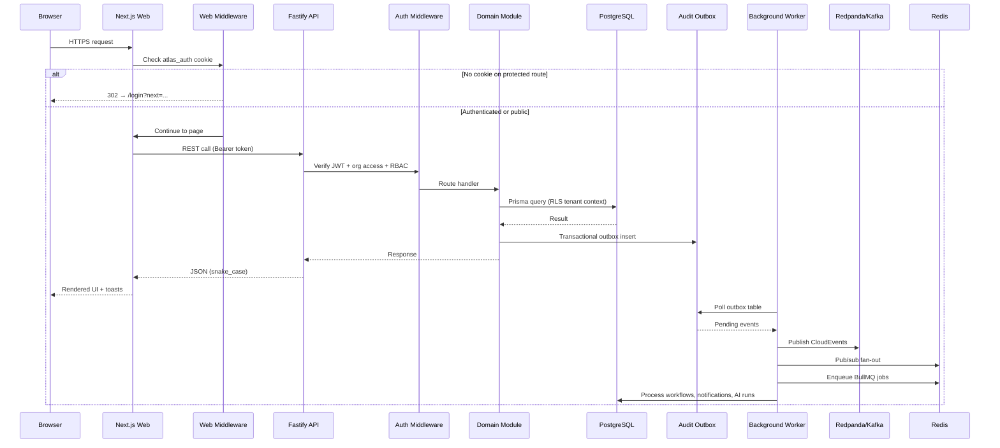
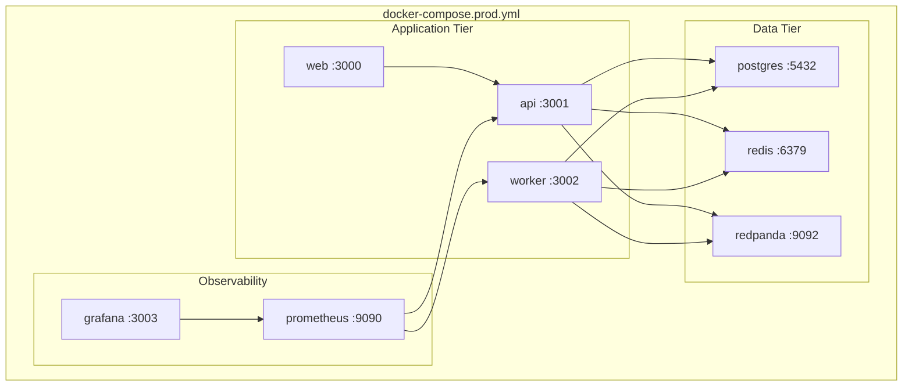
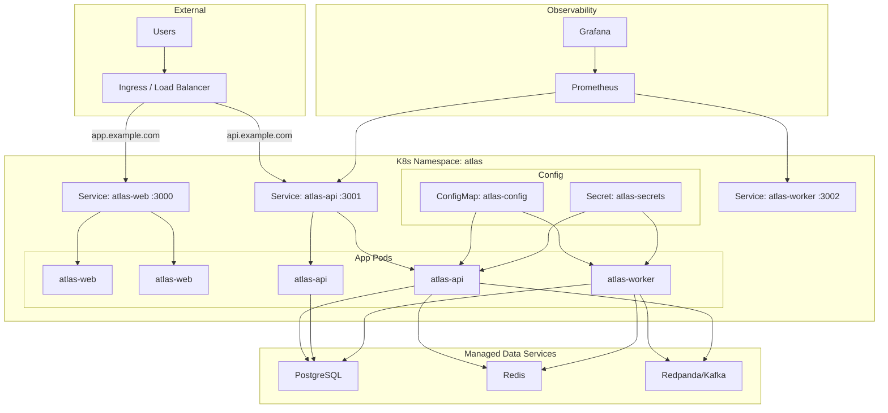

# Atlas BOS — Final Architecture (v1.0)

**Version:** 1.0.0  
**Last updated:** 2026-06-30

This document describes the production architecture of Atlas BOS as implemented in the v1.0 release.

---

## System Overview

Atlas BOS is a multi-tenant business operating system delivered as a TypeScript monorepo. Three runtime processes serve user traffic and background work:

| Process | Package | Role |
|---------|---------|------|
| **API** | `@atlas/api` | Fastify REST API — synchronous request handling, auth, RBAC, domain modules |
| **Web** | `@atlas/web` | Next.js 15 App Router — authenticated UI, middleware auth gating |
| **Worker** | `@atlas/worker` | Background processors — outbox publishing, workflows, automation, AI, notifications |

Shared infrastructure:

| Service | Purpose |
|---------|---------|
| **PostgreSQL 16** (pgvector) | Primary datastore — 9 schemas, 133 Prisma models, RLS |
| **Redis 7** | BullMQ job queues, pub/sub fan-out, cron deduplication |
| **Redpanda/Kafka** | Durable event log — CloudEvents 1.0 domain events |
| **Prometheus + Grafana** | Metrics collection and dashboards |

---

## Monorepo Structure

```
atlas-bos/
├── apps/
│   ├── api/                    # Fastify HTTP server
│   │   └── src/
│   │       ├── app.ts          # Plugin registration, health routes, module wiring
│   │       ├── di/container.ts # Dependency injection
│   │       └── middleware/     # Auth, RBAC, request logging
│   ├── web/                    # Next.js frontend
│   │   └── src/
│   │       ├── middleware.ts   # Cookie auth gate
│   │       ├── app/            # App Router pages
│   │       ├── components/     # Shell, onboarding, notification bell
│   │       └── lib/            # API client, auth helpers
│   ├── worker/                 # Background job host
│   │   └── src/
│   │       ├── main.ts         # Bootstrap, graceful shutdown
│   │       ├── health.ts       # /health, /ready, /metrics
│   │       └── workers/        # 6 processor implementations
│   ├── integration-tests/      # Cross-service test suites
│   ├── e2e-tests/              # Playwright smoke tests
│   └── performance-tests/        # Benchmarks
├── packages/
│   ├── shared-kernel/          # Branded IDs, domain errors, value objects
│   ├── platform/               # JWT, logging, metrics, HTTP problem details
│   ├── database/               # Prisma schema, SQL migrations, tenant extension
│   ├── ui/                     # React design system (Button, Card, Toast, etc.)
│   ├── event-bus/              # Kafka + Redis CloudEvents
│   ├── queue/                  # BullMQ queues + DLQ
│   └── modules/
│       ├── tenant-identity/    # Auth, orgs, workspaces, teams, RBAC
│       ├── notifications/      # In-app + email notifications
│       ├── storage/            # File/folder management
│       ├── audit/              # Audit log + transactional outbox
│       ├── workflow/           # Workflow engine + approvals
│       ├── automation/         # Rule engine + cron triggers
│       ├── ai/                 # Agent definitions + runs
│       ├── ai-memory/          # Knowledge base + hybrid search
│       ├── crm/                # Accounts, contacts, deals
│       ├── finance/            # Chart of accounts, journal entries
│       └── projects/           # Projects + tasks
├── infra/
│   ├── docker/                 # Dockerfile.api, Dockerfile.worker, Dockerfile.web
│   ├── k8s/                    # Namespace, deployments, services, ingress, HPA
│   ├── prometheus/             # Scrape targets
│   └── grafana/                # Dashboard provisioning
├── prisma/                     # Root Prisma schema reference
├── packages/database/db/migrations/  # V001–V012 Flyway SQL
├── docker-compose.yml          # Dev infrastructure only
└── docker-compose.prod.yml     # Full production stack
```

### Build Orchestration

- **Package manager:** pnpm 9 workspaces (`apps/*`, `packages/*`, `packages/modules/*`)
- **Task runner:** Turbo 2 — `build`, `dev`, `test`, `lint`, `typecheck` with dependency graph
- **Node:** ≥ 20.0.0

---

## Request Flow



### Authentication Flow

1. User submits credentials on `/login` → `POST /v1/auth/login`
2. If MFA required → redirect to `/login/mfa` → `POST /v1/auth/mfa/verify`
3. Access token stored; `atlas_auth` cookie set for middleware
4. API requests include `Authorization: Bearer <token>`
5. Auth middleware validates JWT, checks org membership, resolves RBAC permission

### Health & Readiness

| Endpoint | Service | Port | Purpose |
|----------|---------|------|---------|
| `GET /health` | API | 3001 | Liveness |
| `GET /ready` | API | 3001 | Database connectivity |
| `GET /metrics` | API | 3001 | Prometheus scrape |
| `GET /health` | Worker | 3002 | Liveness |
| `GET /ready` | Worker | 3002 | Database connectivity |
| `GET /metrics` | Worker | 3002 | Prometheus scrape |

---

## Module Boundaries

Each domain module follows hexagonal architecture:

```
packages/modules/<name>/
├── src/
│   ├── domain/         # Entities, value objects, domain services
│   ├── application/    # Use cases, command/query handlers
│   ├── infrastructure/ # Prisma repositories, external adapters
│   └── api/            # Fastify route registration (register*Routes)
```

### Module Dependency Rules

| Layer | May depend on |
|-------|---------------|
| `apps/api` | All modules, `platform`, `database`, `shared-kernel` |
| `apps/worker` | Modules needed by workers, `event-bus`, `queue`, `platform`, `database` |
| `apps/web` | `@atlas/ui` only (API via HTTP client) |
| `packages/modules/*` | `shared-kernel`, `platform`, `database` |
| `packages/platform` | `shared-kernel` |
| `packages/shared-kernel` | Nothing (pure domain primitives) |

Modules **must not** import from other modules directly. Cross-module communication uses:

- **Domain events** (outbox → Kafka → consumers)
- **BullMQ job queues** (async work delegation)
- **Shared database** (separate schemas, no cross-schema FKs between domains)

### Database Schemas

| PostgreSQL Schema | Module | Migration |
|-------------------|--------|-----------|
| `atlas_core` | tenant-identity | V001, V002 |
| `notifications` | notifications | V003 |
| `storage` | storage | V004 |
| `atlas_audit` | audit | V005 |
| `automation` | workflow, automation | V006, V007 |
| `ai_agents` | ai | V008 |
| `customer` | crm | V009 |
| `ledger` | finance | V010 |
| `projects` | projects | V011 |
| `ai_agents` (memory) | ai-memory | V012 |

### API Route Prefixes

All organization-scoped routes follow:

```
/v1/organizations/:organizationId/<resource>
```

Auth routes are global:

```
/v1/auth/{register,login,refresh,logout,mfa/verify}
/v1/workspaces, /v1/organizations, /v1/users/me
```

---

## Worker Architecture

The worker process hosts six processors:

| Worker | Trigger | Responsibility |
|--------|---------|----------------|
| Outbox Publisher | DB poll (`OUTBOX_POLL_INTERVAL_MS`) | Read `atlas_audit.outbox` → publish to Kafka + Redis |
| Workflow Runtime | BullMQ `default` queue | Advance workflow instances, process approval steps |
| Automation Matcher | Kafka consumer | Match domain events to automation rules |
| AI Executor | BullMQ `ai` queue | Execute agent runs (stub executor in v1.0) |
| Notification Delivery | BullMQ `email` queue | Deliver in-app and email notifications |
| Scheduled Jobs | Interval timer | Evaluate cron triggers, execute due rules |

### Queue Catalog

| Queue | Attempts | Timeout | Use Case |
|-------|----------|---------|----------|
| `critical` | 7 | 60s | Payments, webhooks |
| `default` | 5 | 120s | General async work |
| `bulk` | 3 | 1h | Batch imports/exports |
| `scheduled` | 5 | 5m | Cron-style jobs |
| `email` | 7 | 30s | Notification delivery |
| `ai` | 3 | 5m | Agent run execution |
| `webhook` | 7 | 35s | Outbound webhook delivery |

Failed jobs exceeding max attempts are archived to DLQ for operator replay.

---

## Deployment Topology

### Docker Compose (Production)

`docker-compose.prod.yml` deploys a single-host stack:



### Kubernetes

`infra/k8s/` provides production manifests for the `atlas` namespace:

| Resource | Replicas | Notes |
|----------|----------|-------|
| `atlas-api` Deployment | 2 | HPA via `hpa-api.yaml`, probes on `/health` and `/ready` |
| `atlas-worker` Deployment | 1 | Prometheus annotations on port 3002 |
| `atlas-web` Deployment | 2 | Next.js standalone, probes on `/` |
| `atlas-ingress` | — | nginx ingress, TLS, routes `api.example.com` and `app.example.com` |



External data services (Postgres, Redis, Kafka) are expected to be managed services or separate Helm charts in production — the K8s manifests reference them via `ConfigMap` connection strings.

### Security Boundaries

- **Network:** Postgres, Redis, Redpanda not exposed publicly; TLS at ingress
- **Auth:** JWT with org-scoped RBAC; RLS on all tenant queries
- **Containers:** Non-root UID 1001, read-only root filesystem, all capabilities dropped
- **Headers:** Helmet (CSP, HSTS, CORP, COOP) in production API mode
- **Rate limit:** 200 requests/minute per authenticated user or IP

---

## Event-Driven Integration

Domain events follow CloudEvents 1.0:

```typescript
// Event type → Kafka topic
customer.contact.created.v1 → atlas.customer.contact.created.v1
```

Flow:

1. Module writes business data + outbox row in a single transaction
2. Outbox publisher worker polls and publishes to Kafka
3. Redis pub/sub provides low-latency local fan-out
4. Automation matcher consumes events and triggers rules
5. Failed consumer messages route to DLQ topics

---

## Testing Strategy

| Layer | Tool | Command |
|-------|------|---------|
| Unit | Vitest | `pnpm test` |
| Integration | Vitest + live probes | `pnpm test:integration` |
| E2E | Playwright | `pnpm test:e2e` |
| Performance | Vitest benchmarks | `pnpm test:performance` |
| Full validation | Sequential runner | `pnpm validate` |
| Env check | Node script | `pnpm env:validate` |

CI runs all layers on every push/PR via `.github/workflows/ci.yml`.

---

## Related Documentation

- [docs/architecture/INDEX.md](docs/architecture/INDEX.md) — Phase 1–5 design documents
- [docs/implementation/phase-6/README.md](docs/implementation/phase-6/README.md) — Platform foundations
- [docs/implementation/phase-7-production/README.md](docs/implementation/phase-7-production/README.md) — Production infrastructure
- [docs/DEPLOYMENT.md](docs/DEPLOYMENT.md) — Deployment procedures
- [PRODUCTION_CHECKLIST.md](PRODUCTION_CHECKLIST.md) — Pre-deploy checklist
- [infra/docs/SECURITY.md](infra/docs/SECURITY.md) — Security hardening guide