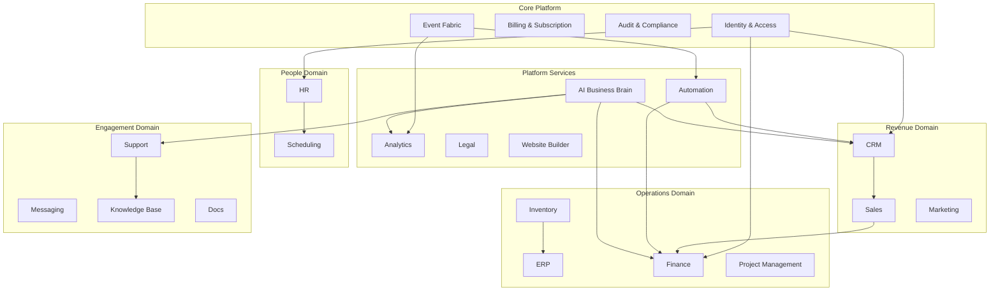
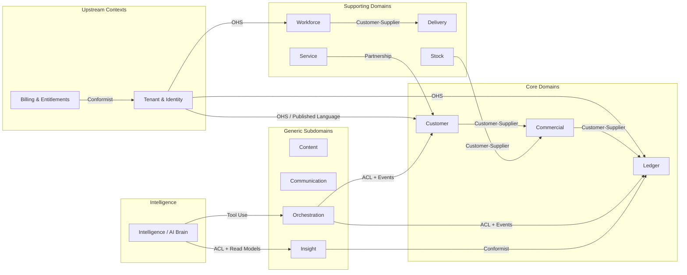
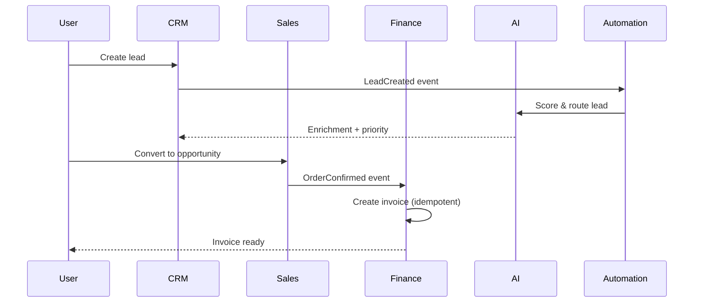
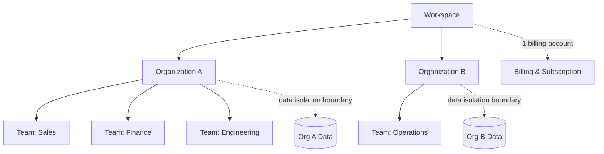
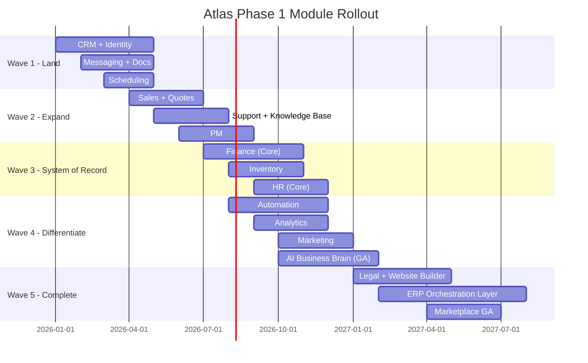

# Atlas Business Architecture — Phase 1

## Purpose

This document defines the business architecture for **Atlas**, a unified Business Operating System (BOS) SaaS platform designed to replace dozens of fragmented point solutions with a single, coherent operating environment. It establishes the business domains, bounded contexts, value streams, monetization model, multi-tenancy hierarchy, compliance posture, and go-to-market module rollout strategy that all downstream technical architecture documents must align with.

## Scope

**In scope:**

- Business domain decomposition and module catalog
- Bounded contexts and strategic context mapping
- Value streams and primary user personas
- Monetization and packaging strategy
- Multi-tenancy business model (workspace → organization → team)
- Compliance and regulatory requirements
- Phased go-to-market module rollout

**Out of scope:**

- Software implementation patterns (see [02-software-architecture.md](./02-software-architecture.md))
- Infrastructure topology (see [03-infrastructure-architecture.md](./03-infrastructure-architecture.md))
- AI orchestration and inference architecture (see [04-ai-architecture.md](./04-ai-architecture.md))
- Detailed data models, API contracts, and UI specifications

## Context

Atlas targets organizations from solo founders and SMBs to global enterprises. The platform must support millions of organizations, hundreds of millions of users, and billions of API requests annually while remaining commercially viable, legally compliant, and strategically extensible.

The business architecture follows Domain-Driven Design (DDD) principles: each business capability is modeled as a bounded context with explicit upstream/downstream relationships, published language, and anti-corruption boundaries where legacy or external systems integrate.

Atlas is not a collection of loosely coupled apps bolted together. It is an **operating system for business** where CRM, ERP, Finance, HR, and adjacent capabilities share a common identity model, event fabric, and AI reasoning layer—the "business brain" that understands cross-domain context.

---

## Business Domain Catalog

Atlas Phase 1 organizes capabilities into seventeen primary business modules. Each module maps to one or more bounded contexts and participates in one or more value streams.

| Module | Primary Bounded Context | Core Value Proposition |
|--------|------------------------|------------------------|
| **CRM** | Customer Relationship | Unified customer 360°, pipeline, account hierarchy |
| **Sales** | Revenue Operations | Quotes, orders, commissions, forecasting |
| **ERP** | Enterprise Resource Planning | Core business operations orchestration |
| **Finance** | Financial Management | GL, AP/AR, budgeting, multi-currency |
| **HR** | Human Capital | Employees, org chart, payroll integration |
| **PM** | Project Management | Tasks, milestones, resource allocation |
| **Support** | Customer Service | Tickets, SLAs, omnichannel case management |
| **Docs** | Document Management | Versioned files, permissions, collaboration |
| **Messaging** | Internal Communications | Channels, DMs, notifications |
| **Marketing** | Campaign Management | Email, automation, attribution |
| **Inventory** | Supply Chain | Stock, warehouses, reorder logic |
| **Legal** | Contract & Compliance | Templates, e-sign, obligation tracking |
| **Analytics** | Business Intelligence | Dashboards, reports, embedded insights |
| **Website Builder** | Digital Presence | Sites, forms, CMS tied to CRM |
| **Scheduling** | Time & Calendar | Appointments, resource booking |
| **Knowledge Base** | Self-Service Content | Articles, search, deflection metrics |
| **Automation** | Workflow Engine | Cross-module triggers, approvals, bots |

### Module Interdependencies (Conceptual)

---

## Bounded Contexts and Context Map

A **bounded context** is the linguistic and operational boundary within which a domain model is unambiguous. Atlas Phase 1 defines the following primary bounded contexts and their strategic relationships.

### Primary Bounded Contexts

1. **Tenant & Identity** — Workspaces, organizations, teams, users, roles, SSO, API keys
2. **Billing & Entitlements** — Subscriptions, usage metering, feature flags, marketplace revenue share
3. **Customer** — Accounts, contacts, leads, opportunities (CRM nucleus)
4. **Commercial** — Quotes, orders, contracts, pricing rules (Sales nucleus)
5. **Ledger** — Chart of accounts, journal entries, fiscal periods (Finance nucleus)
6. **Workforce** — Employees, positions, compensation bands (HR nucleus)
7. **Delivery** — Projects, tasks, time entries (PM nucleus)
8. **Service** — Cases, SLAs, queues (Support nucleus)
9. **Content** — Documents, folders, retention policies (Docs nucleus)
10. **Communication** — Channels, messages, presence (Messaging nucleus)
11. **Campaign** — Audiences, sends, conversions (Marketing nucleus)
12. **Stock** — SKUs, locations, movements (Inventory nucleus)
13. **Obligation** — Agreements, clauses, renewals (Legal nucleus)
14. **Insight** — Metrics, dimensions, semantic layer (Analytics nucleus)
15. **Presence** — Sites, pages, domains (Website Builder nucleus)
16. **Calendar** — Events, availability, bookings (Scheduling nucleus)
17. **Knowledge** — Articles, taxonomy, feedback (Knowledge Base nucleus)
18. **Orchestration** — Workflows, triggers, actions (Automation nucleus)
19. **Intelligence** — Embeddings, reasoning, tool execution (AI nucleus — see [04-ai-architecture.md](./04-ai-architecture.md))

### Context Map (Strategic Relationships)

**Relationship types used:**

| Symbol | DDD Pattern | Atlas Application |
|--------|-------------|-------------------|
| OHS | Open Host Service | Tenant & Identity exposes stable APIs/events to all modules |
| PL | Published Language | Shared event schemas, tenant IDs, money types in shared kernel |
| CS | Customer-Supplier | Downstream context defines integration contract (e.g., Sales → Finance) |
| Conformist | Conformist | Analytics conforms to Ledger's fiscal definitions |
| ACL | Anti-Corruption Layer | Automation and AI translate foreign module concepts at boundaries |
| Partnership | Partnership | Support ↔ Customer co-evolve case-to-account linking |

---

## Value Streams

Value streams describe end-to-end flows that deliver measurable business outcomes. Atlas Phase 1 prioritizes five foundational streams.

### VS-1: Acquire & Convert

**Trigger:** Marketing campaign or inbound lead  
**Flow:** Marketing → CRM (lead) → Sales (opportunity) → Commercial (quote) → Ledger (invoice)  
**Outcome:** Revenue recognized, customer record enriched  
**KPIs:** Lead-to-opportunity rate, quote-to-cash cycle time, CAC

### VS-2: Deliver & Bill

**Trigger:** Closed-won opportunity or signed contract  
**Flow:** Commercial (order) → Delivery (project) → Scheduling (resources) → Ledger (billing)  
**Outcome:** Deliverable completed, revenue invoiced  
**KPIs:** On-time delivery %, utilization, DSO

### VS-3: Serve & Retain

**Trigger:** Customer issue or proactive outreach  
**Flow:** Support (case) → Knowledge Base (deflection) → CRM (health score) → Marketing (nurture)  
**Outcome:** Issue resolved, churn risk reduced  
**KPIs:** CSAT, first-contact resolution, NRR

### VS-4: Operate & Comply

**Trigger:** Period close, audit, or regulatory filing  
**Flow:** Workforce (payroll) → Ledger (accruals) → Legal (obligations) → Insight (reports)  
**Outcome:** Compliant financial statements, audit trail intact  
**KPIs:** Close cycle days, audit findings, policy adherence

### VS-5: Automate & Decide

**Trigger:** Business event or user intent  
**Flow:** Orchestration (workflow) → Intelligence (reasoning) → Module actions (tool use) → Insight (feedback)  
**Outcome:** Automated decision or human-approved action with full traceability  
**KPIs:** Automation coverage, AI action accuracy, human override rate

---

## User Personas

### P1: SMB Owner / Founder

- **Goals:** Run entire business from one platform; minimize tool sprawl and cost
- **Modules used:** CRM, Sales, Finance (light), Invoicing, Scheduling, Website Builder, Analytics (basic)
- **Pain points:** Context switching, duplicate data entry, no unified view of cash and pipeline
- **Atlas value:** Single login, AI assistant that answers "How's my business doing?" across domains

### P2: Enterprise Administrator

- **Goals:** Govern security, compliance, integrations, and org-wide policies
- **Modules used:** Tenant & Identity, Billing, Audit, all modules (admin lens)
- **Pain points:** Shadow IT, inconsistent permissions, regional data residency
- **Atlas value:** Centralized SSO, SCIM, audit logs, data residency controls, enterprise entitlements

### P3: Employee (General)

- **Goals:** Complete daily tasks without learning fifteen different UIs
- **Modules used:** Messaging, Docs, PM, Scheduling, HR (self-service)
- **Pain points:** Notification overload, unclear priorities
- **Atlas value:** Unified inbox, AI task prioritization, consistent UX patterns

### P4: Accountant / Controller

- **Goals:** Accurate books, fast close, audit-ready trails
- **Modules used:** Finance, Ledger, Legal, Analytics, Inventory (costing)
- **Pain points:** Manual reconciliations, multi-entity consolidation, FX complexity
- **Atlas value:** Event-sourced audit trail, multi-currency native, AI anomaly detection

### P5: Sales Representative

- **Goals:** Hit quota, manage pipeline, minimize admin work
- **Modules used:** CRM, Sales, Messaging, Scheduling, Marketing (sequences)
- **Pain points:** CRM hygiene, stale data, slow quote turnaround
- **Atlas value:** AI-drafted follow-ups, unified customer timeline, mobile-first pipeline

### P6: Support Agent

- **Goals:** Resolve cases fast with full customer context
- **Modules used:** Support, Knowledge Base, CRM, Messaging
- **Pain points:** Swivel-chair between systems, missing history
- **Atlas value:** Customer 360° sidebar, AI-suggested responses, deflection analytics

---

## Monetization Strategy

Atlas employs a **hybrid monetization model** combining subscription tiers, usage-based metering, and a third-party marketplace.

### Subscription Tiers

| Tier | Target Segment | Included Modules (Phase 1) | Seat Model |
|------|----------------|---------------------------|------------|
| **Starter** | Solo / micro SMB | CRM (basic), Invoicing, Docs, Messaging, Scheduling | Per workspace, 3 seats |
| **Growth** | SMB | + Sales, Finance (basic), PM, Support, Marketing, Analytics | Per seat, min 5 |
| **Business** | Mid-market | + Full Finance, HR, Inventory, Automation, Legal | Per seat + modules |
| **Enterprise** | Large org | All modules, SSO/SCIM, data residency, dedicated support | Custom contract |

### Usage-Based Components

Metered dimensions billed above tier allowances:

- **API calls** — Beyond tier quota (per 10K requests)
- **Storage** — Docs + attachments (per GB/month)
- **AI inference** — Tokens and tool invocations (see [04-ai-architecture.md](./04-ai-architecture.md))
- **Automation runs** — Workflow executions beyond allowance
- **Email/SMS sends** — Marketing and transactional at pass-through + margin
- **Advanced Analytics** — Custom report compute minutes

### Marketplace Revenue

- Third-party integrations, industry templates, and vertical apps published to Atlas Marketplace
- Revenue share: **70% partner / 30% Atlas** on net subscription; usage-based pass-through per partner agreement
- Certification program for security and API compliance

### Packaging Principles

1. **Land with CRM + core productivity** — Lowest friction entry
2. **Expand via module activation** — Self-serve upgrade paths with 14-day trials per module
3. **Enterprise custom bundles** — ELA with committed spend discounts
4. **No punitive lock-in** — Data export and API access included at Growth tier and above

---

## Multi-Tenancy Business Model

Atlas implements a three-level tenancy hierarchy that maps to how businesses actually organize.

### Hierarchy Definitions

| Level | Business Meaning | Examples |
|-------|------------------|----------|
| **Workspace** | Commercial and billing root; may represent a holding company, agency, or individual business | "Acme Holdings Workspace" |
| **Organization** | Legally or operationally distinct entity within a workspace | "Acme US Inc.", "Acme EU GmbH" |
| **Team** | Functional group with scoped permissions within an organization | "Sales EMEA", "Finance Shared Services" |

### Business Rules

- A user may belong to multiple organizations within one workspace (and across workspaces with invitation)
- Billing attaches to **workspace**; usage aggregates across organizations unless enterprise deal specifies org-level chargeback
- **Data residency** is configured at organization level (enterprise tier)
- **Feature entitlements** can be workspace-wide or org-specific (add-on modules)
- Cross-organization reporting requires explicit workspace-level permission and audit logging

### Tenant Isolation Posture (Business View)

- Organization data is logically isolated; cross-org access is a privileged, audited operation
- Workspace admins manage identity federation and global policies
- Team leads manage module-specific roles within their scope

*Technical isolation mechanisms are defined in [02-software-architecture.md](./02-software-architecture.md) and [03-infrastructure-architecture.md](./03-infrastructure-architecture.md).*

---

## Compliance Requirements

Atlas must be **compliance-ready at launch** and **certification-driven at scale**.

### SOC 2 Type II

- **Scope:** Security, Availability, Confidentiality (Processing Integrity and Privacy optional add-on)
- **Controls:** Access management, change management, incident response, vendor management, encryption, logging
- **Business requirement:** Enterprise tier contracts require SOC 2 report within 12 months of GA

### GDPR

- **Lawful basis** documented per data processing activity
- **Data subject rights:** Access, rectification, erasure, portability, restriction — SLA 30 days
- **DPA** standard for all EU customers; sub-processor list maintained
- **Data residency:** EU organizations may require EU-only processing (organization-level setting)
- **AI-specific:** No training on customer data without explicit opt-in; RAG retrieval scoped to tenant

### HIPAA-Ready

- Atlas is **not HIPAA-certified by default** in Phase 1
- **HIPAA-ready architecture:** BAA available for Enterprise Healthcare vertical; PHI segmentation, enhanced audit, dedicated encryption keys
- Modules touching PHI (Scheduling with health context, HR benefits) require HIPAA addendum

### Additional Frameworks (Roadmap)

| Framework | Phase | Trigger |
|-----------|-------|---------|
| ISO 27001 | Phase 2 | EU enterprise demand |
| PCI DSS | Phase 1 (Finance) | Payment card handling via certified processor (Stripe/Adyen) — Atlas scope minimized |
| FedRAMP | Phase 3+ | US public sector |
| CCPA/CPRA | Phase 1 | California consumers — aligned with GDPR tooling |

### Audit & Retention (Business Policy)

- Financial records: 7+ years (jurisdiction-dependent)
- Audit logs: 1 year hot, 7 years cold (enterprise configurable)
- Right-to-erasure: Coordinated cross-module erasure workflow with legal hold exceptions

---

## Go-to-Market Module Rollout Strategy

Phase 1 GTM follows a **wedge-and-expand** strategy: land with high-frequency, high-pain modules; expand into system-of-record domains; activate AI as differentiation once data density exists.

### Rollout Waves

### Wave Rationale

| Wave | Modules | Strategic Rationale |
|------|---------|---------------------|
| **1 — Land** | CRM, Messaging, Docs, Scheduling | Daily active use; replaces Slack/Drive/Calendly fragments; builds user habit |
| **2 — Expand** | Sales, Support, KB, PM | Revenue and delivery workflows; increases switching cost positively |
| **3 — System of Record** | Finance, Inventory, HR | Deep entrenchment; highest migration friction = highest retention |
| **4 — Differentiate** | Automation, Analytics, Marketing, AI | Cross-module data enables AI brain; automation drives usage-based revenue |
| **5 — Complete** | Legal, Website, ERP, Marketplace | Full BOS promise; partner ecosystem scale |

### Vertical Accelerators (Parallel Track)

- **Professional Services** — PM + Scheduling + Finance (T&M billing) bundle
- **E-commerce / D2C** — Inventory + Sales + Marketing + Website Builder bundle
- **Healthcare Admin** — Scheduling + HR + Support (HIPAA addendum)
- **Agencies** — Multi-org workspace + CRM + PM + white-label Website Builder

### Success Metrics per Wave

- **Activation rate:** % of signups completing first value action within 7 days
- **Module attach rate:** % of workspaces activating ≥2 modules by day 30
- **Net revenue retention:** Target 110%+ by Wave 3
- **AI engagement:** % of weekly active users invoking AI actions by Wave 4 GA

---

## Alternatives Considered

### Alternative A: Best-of-Breed Integration Hub (iPaaS Model)

**Description:** Position Atlas as integration middleware connecting existing SaaS tools rather than replacing them.

**Rejected because:** Commoditizes value, inherits fragmentation UX, weak data model unity, AI brain cannot reason across opaque silos. Contradicts core BOS thesis.

### Alternative B: ERP-First (Finance-Led Wedge)

**Description:** Lead with full GL and expand outward.

**Rejected because:** Long sales cycles, high implementation burden for SMB wedge, slower daily active use. Finance-first remains Wave 3 for retention, not acquisition.

### Alternative C: Flat All-Modules Launch

**Description:** Ship all 17 modules simultaneously at GA.

**Rejected because:** Engineering blast radius, diluted GTM messaging, quality risk across contexts. Modular monolith supports parallel development but phased GTM reduces operational risk.

### Alternative D: Per-Module Standalone Products

**Description:** Separate brands per module (Atlas CRM, Atlas Finance, etc.).

**Rejected because:** Fragments brand, duplicates go-to-market cost, undermines unified AI and identity story. Modules are **packaging units**, not separate products.

---

## Consequences

### Positive

- **Clear domain boundaries** enable modular monolith development with clean extraction paths ([02-software-architecture.md](./02-software-architecture.md))
- **Workspace → org → team** model matches agency, holding company, and enterprise structures without custom deals
- **Wedge-and-expand GTM** balances time-to-revenue with long-term platform depth
- **Hybrid monetization** captures SMB simplicity (tiered) and enterprise value (usage + ELA)
- **Compliance roadmap** de-risks enterprise sales without over-building Phase 1

### Negative

- **Context map complexity** requires disciplined integration contracts; risk of shared-kernel bloat if boundaries erode
- **Multi-level tenancy** increases permission matrix complexity for UX and engineering
- **Phased rollout** may disappoint prospects expecting full ERP on day one — messaging discipline required
- **HIPAA-ready vs certified gap** may lose healthcare deals until BAA program matures
- **Marketplace cold-start** — partner ecosystem lags module completeness in Wave 5

---

## Open Questions

| ID | Question | Owner | Target Resolution |
|----|----------|-------|-------------------|
| BQ-01 | Should **team** be a billing/chargeback unit for enterprise, or purely RBAC? | Product + Finance | Q3 2026 |
| BQ-02 | Minimum viable **ERP orchestration** scope for Wave 5 — which cross-module transactions are in? | Domain Architecture | Q4 2026 |
| BQ-03 | **Freemium** tier for CRM-only — yes/no and seat limits? | GTM + Product | Q2 2026 |
| BQ-04 | **Data residency** regions at launch: EU + US only, or include APAC? | Legal + Infra | Q2 2026 |
| BQ-05 | Marketplace **revenue share** 70/30 — competitive validation needed? | Partnerships | Q3 2026 |
| BQ-06 | **AI actions** that mutate financial records — which require mandatory human approval by tier? | Product + Compliance | Q3 2026 |
| BQ-07 | Vertical bundles vs horizontal tiers as primary GTM motion for mid-market? | Marketing | Q2 2026 |

---

## Cross-References

| Document | Relationship |
|----------|--------------|
| [02-software-architecture.md](./02-software-architecture.md) | Implements bounded contexts as modules; tenancy model in application layer |
| [03-infrastructure-architecture.md](./03-infrastructure-architecture.md) | Data residency, multi-region deployment, compliance controls |
| [04-ai-architecture.md](./04-ai-architecture.md) | Intelligence bounded context; AI monetization metering; cross-module reasoning |
| *Atlas Domain Glossary* (planned) | Ubiquitous language per bounded context |
| *Atlas API Strategy* (planned) | Published language for integration events |
| *Atlas Security & Compliance Program* (planned) | SOC 2 control matrix, GDPR DPIA templates |

---

*Document owner: Chief Software Architect · Review cadence: Quarterly or on major GTM pivot*