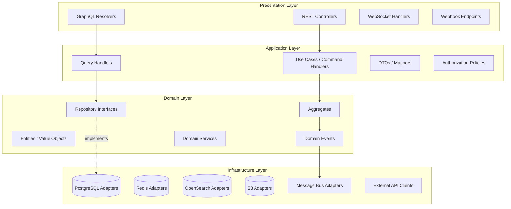
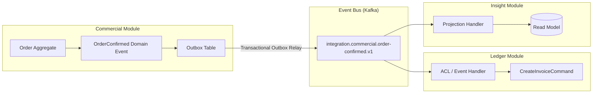
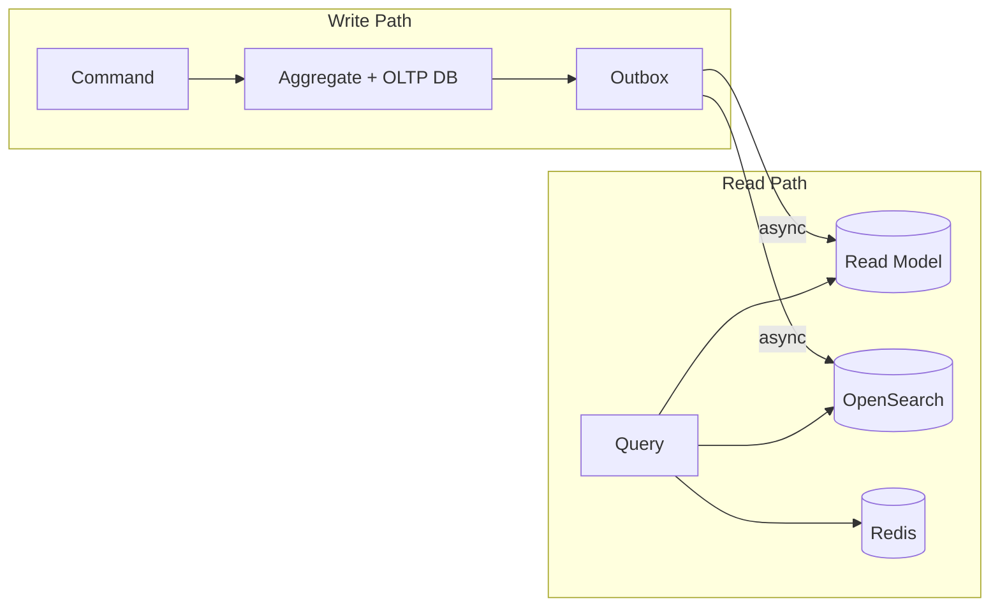
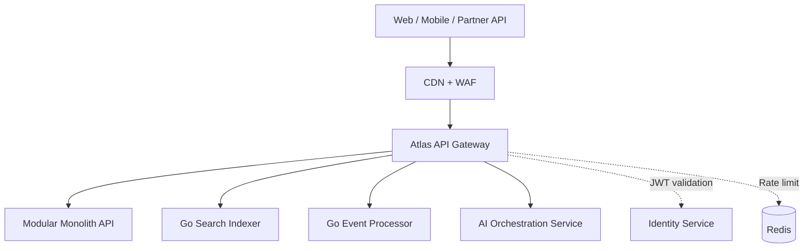
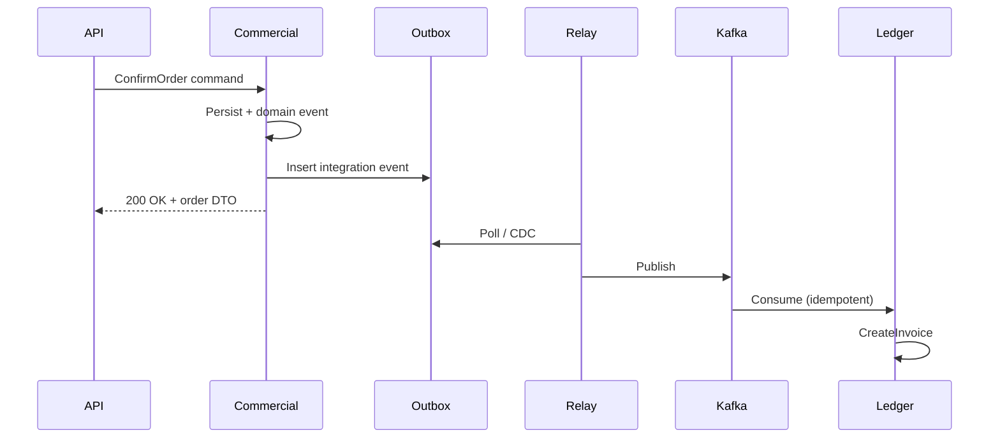
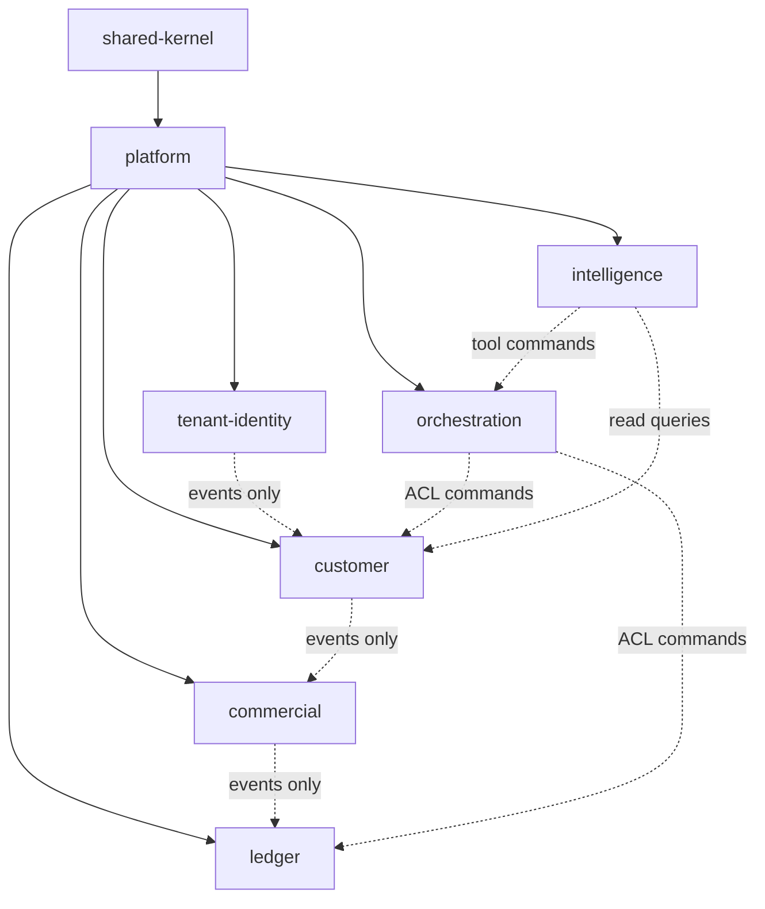
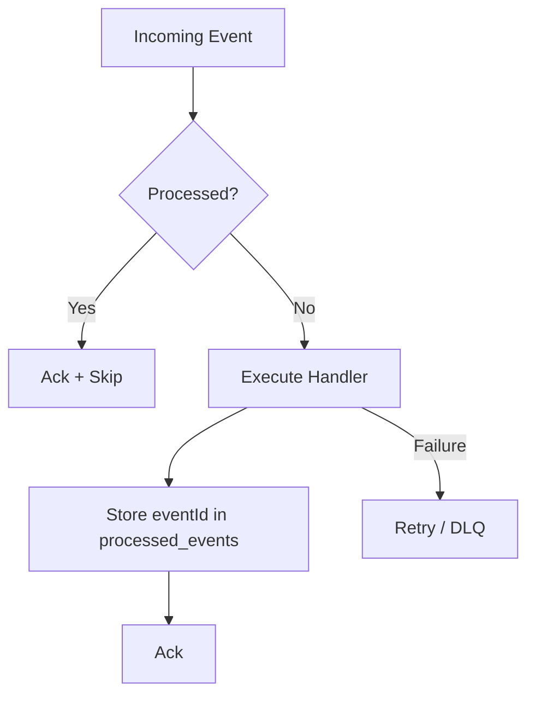
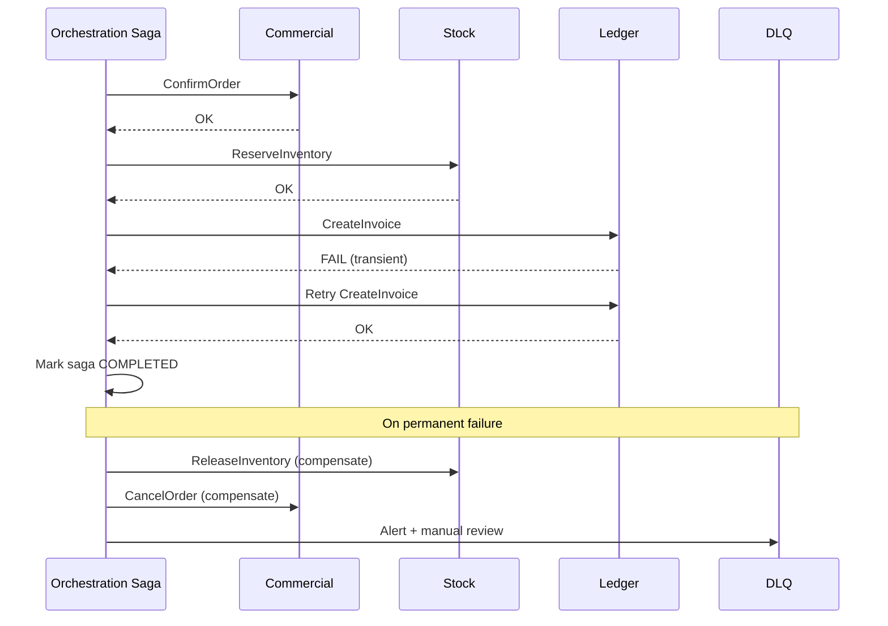

# Atlas Software Architecture — Phase 1

## Purpose

This document defines the software architecture for Atlas Phase 1: structural patterns, module boundaries, communication models, and cross-cutting concerns that enable a **modular monolith first, microservice-ready** platform capable of scaling to millions of organizations and billions of API requests.

It translates the business bounded contexts defined in [01-business-architecture.md](./01-business-architecture.md) into implementable software structure using Clean Architecture, Domain-Driven Design (DDD), CQRS, and event-driven integration.

## Scope

**In scope:**

- Layered architecture (presentation, application, domain, infrastructure)
- Bounded context module structure within the monolith
- Domain events and integration events
- CQRS read/write separation
- API gateway and service communication patterns
- Shared kernel vs anti-corruption layers
- Module dependency rules
- Error handling, idempotency, and saga patterns

**Out of scope:**

- Business domain definitions and GTM (see [01-business-architecture.md](./01-business-architecture.md))
- Cloud infrastructure, Kubernetes, networking (see [03-infrastructure-architecture.md](./03-infrastructure-architecture.md))
- LLM orchestration, RAG, AI guardrails (see [04-ai-architecture.md](./04-ai-architecture.md))
- Detailed schema definitions and OpenAPI specifications

## Context

Atlas engineering adopts:

- **TypeScript** as the primary backend language (Node.js runtime)
- **Go** for performance-critical services (event processors, search indexing, high-throughput workers) extracted when justified
- **PostgreSQL** for OLTP, **Redis** for cache/sessions, **OpenSearch** for full-text and analytics queries, **S3** for object storage
- **Next.js** for the web frontend
- **Kafka** (primary) with **NATS** for low-latency internal fan-out where appropriate

Phase 1 delivers a **modular monolith**: logically separate bounded context modules deployed as a single deployable unit, with strict compile-time and runtime boundaries. Extraction to microservices occurs at bounded context boundaries when independent scaling, deployment cadence, or fault isolation demands it.

---

## Architectural Principles

| Principle | Implementation |
|-----------|----------------|
| **Dependency Rule** | Source code dependencies point inward; domain has zero infrastructure imports |
| **Explicit Boundaries** | No direct cross-module repository access; integration via application services, events, or queries |
| **API-First** | All capabilities exposed via versioned REST/GraphQL; UI is a client |
| **Event-First Integration** | State changes publish domain events; cross-context reactions use integration events |
| **CQRS Where Justified** | Complex reads and reporting use dedicated read models; writes stay on OLTP aggregates |
| **Idempotent by Default** | All mutating APIs and event handlers accept idempotency keys |
| **Fail Closed** | Authorization and validation errors reject requests; no partial trust |

---

## Layered Architecture

Each bounded context module follows **Clean Architecture** with four layers:



### Layer Responsibilities

**Presentation** — HTTP/GraphQL translation, input validation (structural), authentication token extraction, response serialization. No business logic.

**Application** — Orchestrates use cases; loads aggregates; enforces authorization policies; dispatches commands and queries; manages transactions and unit-of-work; publishes integration events after successful commit.

**Domain** — Pure business logic: invariants, aggregate behavior, domain events, specifications. Framework-agnostic TypeScript. Go equivalents for extracted services follow hexagonal ports/adapters.

**Infrastructure** — Implements repository interfaces, message publishers, third-party adapters. All technology-specific code lives here.

---

## Modular Monolith Structure

Repository layout follows **vertical slice by bounded context**:

```
atlas-bos/
├── apps/
│   ├── api/                    # Main API process (modular monolith)
│   ├── web/                    # Next.js frontend
│   ├── worker/                 # Async event consumers
│   └── gateway/                # API gateway (BFF + routing)
├── packages/
│   ├── shared-kernel/          # TenantId, Money, Email, EventEnvelope
│   ├── platform/               # Auth, logging, tracing, idempotency
│   └── modules/
│       ├── tenant-identity/
│       ├── customer/           # CRM bounded context
│       ├── commercial/         # Sales
│       ├── ledger/             # Finance
│       ├── workforce/          # HR
│       ├── delivery/           # PM
│       ├── service/            # Support
│       ├── content/            # Docs
│       ├── communication/      # Messaging
│       ├── campaign/           # Marketing
│       ├── stock/              # Inventory
│       ├── obligation/         # Legal
│       ├── insight/            # Analytics
│       ├── presence/           # Website Builder
│       ├── calendar/           # Scheduling
│       ├── knowledge/          # Knowledge Base
│       ├── orchestration/      # Automation
│       └── intelligence/       # AI (orchestration client)
└── services/                   # Extracted Go services (Phase 1.5+)
    ├── search-indexer/
    └── event-processor/
```

Each module contains:

```
modules/customer/
├── domain/
│   ├── aggregates/
│   ├── events/
│   ├── repositories/       # interfaces only
│   └── services/
├── application/
│   ├── commands/
│   ├── queries/
│   └── handlers/
├── infrastructure/
│   ├── persistence/
│   ├── messaging/
│   └── search/
├── presentation/
│   ├── rest/
│   └── graphql/
└── module.ts               # Public API surface (facade)
```

### Module Public API (Facade)

Modules expose a **narrow facade** — other modules may only import from `module.ts`:

```typescript
// modules/customer/module.ts — illustrative
export { CreateLeadCommand, CreateLeadHandler } from './application/commands';
export { CustomerQueryService } from './application/queries';
export type { CustomerId, LeadCreatedEvent } from './domain';
// NO exports from infrastructure/
```

---

## Event-Driven Architecture

Atlas distinguishes **domain events** (intra-module) from **integration events** (inter-module).



### Domain Events

- Raised **inside** an aggregate when state changes
- Handled **within the same transaction** for in-module side effects (e.g., update read model projection synchronously for critical paths)
- Never serialized to external schemas directly

### Integration Events

- **Past-tense, immutable facts** published after commit via transactional outbox
- Versioned schema registry (Avro/JSON Schema)
- Naming: `{context}.{aggregate}.{action}.v{major}` — e.g., `commercial.order.confirmed.v1`
- Payload includes: `eventId`, `occurredAt`, `tenantId`, `organizationId`, `correlationId`, `causationId`, `payload`

### Event Catalog (Phase 1 Core)

| Integration Event | Publisher | Subscribers |
|-------------------|-----------|-------------|
| `tenant.organization.created.v1` | Tenant & Identity | Billing, All modules (provisioning) |
| `customer.lead.created.v1` | Customer | Orchestration, Intelligence |
| `commercial.order.confirmed.v1` | Commercial | Ledger, Stock, Delivery |
| `ledger.invoice.posted.v1` | Ledger | Insight, Orchestration |
| `service.case.resolved.v1` | Service | Customer (health), Insight |
| `workforce.employee.hired.v1` | Workforce | Tenant & Identity, Calendar |

### Delivery Guarantees

- **At-least-once** delivery from outbox relay
- Consumers **must be idempotent** (see Idempotency section)
- Dead-letter queues with exponential backoff and alerting
- Ordering: per-`aggregateId` partition key preserves causal order for single aggregate

---

## CQRS Pattern Application

CQRS separates **command models** (writes) from **query models** (reads). Atlas applies pragmatic CQRS—not dogmatic separation everywhere.



### When CQRS Applies

| Scenario | Approach |
|----------|----------|
| Simple CRUD entity | Single model, direct repository read |
| Aggregate with invariants | Command side only; optional sync projection |
| Dashboard / search / analytics | Dedicated read model + OpenSearch |
| Cross-module reporting (Insight) | Event-sourced projections, no cross-module SQL joins |
| AI context retrieval | Read models + vector store (see [04-ai-architecture.md](./04-ai-architecture.md)) |

### Read Model Consistency

- **Strong consistency** for reads immediately following own writes: return from command response DTO or read-your-writes from primary DB
- **Eventual consistency** for cross-module views: UI shows staleness indicators where >2s lag possible
- Projection versioning: blue/green projections for schema migrations

---

## API Gateway Pattern

The **Atlas Gateway** is a dedicated service (BFF-capable) sitting in front of the modular monolith and future extracted services.



### Gateway Responsibilities

- TLS termination (at edge), request routing, API versioning (`/v1/`, `/v2/`)
- Authentication (JWT/OAuth2 validation), tenant context injection (`X-Atlas-Tenant-Id`, `X-Atlas-Org-Id`)
- Rate limiting and quota enforcement per workspace tier
- Request/response logging, correlation ID propagation
- GraphQL federation entry point (future)
- WebSocket upgrade for Messaging and real-time notifications

### API Styles

| Style | Use Case |
|-------|----------|
| **REST** | CRUD resources, partner integrations, webhooks |
| **GraphQL** | Web app composite queries, mobile bandwidth optimization |
| **WebSocket** | Real-time messaging, live notifications |
| **gRPC** | Internal service-to-service (extracted Go services) |

---

## Service Communication

### Synchronous (Request-Response)

- **REST/GraphQL** for client-to-server and gateway-to-monolith
- **gRPC** for internal high-performance calls (gateway → Go workers)
- **Timeouts:** 3s default client, 10s internal; circuit breakers via service mesh
- **No synchronous cross-module calls** inside monolith except via module facades (in-process); prefer events for non-critical paths

### Asynchronous (Event-Driven)

- **Kafka** for integration events, audit stream, analytics pipeline
- **NATS** for low-latency pub/sub (presence, typing indicators, cache invalidation fan-out)
- **Transactional outbox** in PostgreSQL per module schema



---

## Shared Kernel vs Anti-Corruption Layers

### Shared Kernel (`packages/shared-kernel`)

Minimal shared types and utilities — **resist growth**:

| Type | Purpose |
|------|---------|
| `TenantId`, `OrganizationId`, `TeamId`, `UserId` | Strongly-typed IDs |
| `Money`, `Currency`, `DateRange` | Financial and temporal primitives |
| `EmailAddress`, `PhoneNumber` | Validated value objects |
| `EventEnvelope<T>` | Standard integration event wrapper |
| `Result<T, E>` | Railway-oriented error type |
| `Ulid`, `Timestamp` | Identity and time |

**Rules:** Changes require architecture review. No business logic. No module-specific concepts.

### Anti-Corruption Layers (ACL)

Required when:

- Consuming another module's integration events
- Integrating external systems (Stripe, Salesforce, QuickBooks)
- AI tool handlers translating natural language to domain commands

ACL structure:

```
modules/ledger/infrastructure/acl/
├── commercial-order-handler.ts    # Maps OrderConfirmed → CreateInvoiceCommand
├── external-quickbooks/
│   ├── mapper.ts
│   └── client.ts
```

ACL handlers **never** leak foreign models into domain layer.

---

## Module Dependency Rules



### Dependency Matrix

| Rule | Description |
|------|-------------|
| **R1** | Modules may depend on `shared-kernel` and `platform` only |
| **R2** | No module imports another module's `domain/` or `infrastructure/` |
| **R3** | Cross-module write: integration event → ACL handler → command |
| **R4** | Cross-module read: module facade query service OR read model API (Insight) |
| **R5** | `tenant-identity` is upstream; no business module imports it except via platform auth |
| **R6** | `orchestration` and `intelligence` use ACL exclusively for mutations |
| **R7** | Circular dependencies forbidden — enforced by dependency-cruiser CI check |

---

## Error Handling Strategy

### Error Taxonomy

| Category | HTTP | Retry | Example |
|----------|------|-------|---------|
| `ValidationError` | 400 | No | Invalid email format |
| `UnauthorizedError` | 401 | No | Missing/expired token |
| `ForbiddenError` | 403 | No | Insufficient role |
| `NotFoundError` | 404 | No | Lead ID unknown |
| `ConflictError` | 409 | No | Duplicate idempotency conflict |
| `DomainInvariantError` | 422 | No | Cannot confirm cancelled order |
| `RateLimitError` | 429 | Yes (backoff) | Quota exceeded |
| `TransientInfrastructureError` | 503 | Yes | DB connection timeout |
| `InternalError` | 500 | No | Unhandled exception |

### Standard Error Response

```json
{
  "error": {
    "code": "DOMAIN_INVARIANT_VIOLATION",
    "message": "Cannot confirm order in status CANCELLED",
    "details": [{ "field": "status", "reason": "INVALID_TRANSITION" }],
    "correlationId": "01JABC...",
    "documentationUrl": "https://docs.atlas.dev/errors/DOMAIN_INVARIANT_VIOLATION"
  }
}
```

### Cross-Cutting Concerns

- **Structured logging** with correlation ID, tenant ID, user ID on every log line
- **OpenTelemetry** traces span gateway → use case → repository → message publish
- **Error masking** in production: 500 responses never leak stack traces
- **Domain errors** are intentional and logged at WARN; infrastructure at ERROR

---

## Idempotency Patterns

All mutating REST endpoints and event consumers support idempotency.

### HTTP Idempotency

- Client sends `Idempotency-Key: {uuid}` header
- Gateway stores request fingerprint in Redis (TTL 24h)
- Duplicate requests return cached response with `X-Idempotent-Replayed: true`

### Event Consumer Idempotency



- `processed_events` table: `(consumer_group, event_id)` unique constraint
- Handlers designed for **natural idempotency** where possible (e.g., `UPSERT` invoice by `orderId`)
- Sagas track step completion by `sagaId` + `stepName`

### Database Idempotency

- Unique constraints on business keys (`organization_id + external_ref`)
- Optimistic concurrency via `version` column on aggregates

---

## Saga / Orchestration for Distributed Transactions

Atlas avoids two-phase commit. Multi-step business transactions use the **Orchestrated Saga** pattern via the Orchestration module.

### Saga Example: Quote-to-Cash



### Saga State Machine

- Persisted in `orchestration.saga_instances` with steps, status, compensation stack
- Each step invokes module commands via ACL (in-process Phase 1; gRPC when extracted)
- **Compensating transactions** are domain-defined (not automatic DB rollback)
- Human-in-the-loop steps for high-risk actions (Finance postings above threshold — see [04-ai-architecture.md](./04-ai-architecture.md))

### Choreography vs Orchestration

| Pattern | When Used |
|---------|-----------|
| **Choreography** | Simple 1:1 reactions (LeadCreated → score in Intelligence) |
| **Orchestration** | Multi-step with compensation (Quote-to-Cash, employee offboarding) |

---

## Frontend Architecture (Summary)

Next.js app in `apps/web`:

- **App Router**, React Server Components for initial load
- **TanStack Query** for client-side cache and optimistic updates
- **Module-aligned feature folders** mirroring backend bounded contexts
- **Design system** package (`@atlas/ui`) — shared components, tokens
- **Real-time** via WebSocket connection to gateway, tenant-scoped channels

*Detailed frontend architecture document planned for Phase 1.5.*

---

## Alternatives Considered

### Alternative A: Pure Microservices from Day One

**Rejected:** Operational overhead premature at current scale; distributed tracing, deployment coordination, and data consistency complexity slow Phase 1 delivery. Modular monolith preserves extraction optionality.

### Alternative B: Single Shared Database, No Module Schemas

**Rejected:** Boundary erosion, accidental cross-module joins, impossible extraction. Phase 1 uses **schema-per-module** in single PostgreSQL cluster.

### Alternative C: Full Event Sourcing on All Aggregates

**Rejected:** Complexity and storage cost unjustified for all entities. Event sourcing applied to Ledger and Audit; other modules use domain events + OLTP state.

### Alternative D: GraphQL-Only API

**Rejected:** Partner integrations and webhook ecosystems expect REST. Dual exposure with GraphQL for web, REST for integrations.

### Alternative E: Shared ORM Models Across Modules

**Rejected:** Violates bounded context isolation. Each module owns its persistence schema and mappers.

---

## Consequences

### Positive

- **Clean extraction path** — modules with facades, events, and schemas map 1:1 to future services
- **Testability** — domain layer unit tests without database; contract tests on integration events
- **Team scalability** — teams can own bounded context folders with minimal merge conflicts
- **AI-ready** — event stream and read models provide rich context for Intelligence module
- **Resilience** — outbox, idempotency, and sagas handle at-least-once delivery realities

### Negative

- **Eventual consistency UX** — cross-module views require careful UI design
- **Schema-per-module** — migration coordination across shared PostgreSQL instance
- **Facade discipline** — developers may circumvent with direct imports without lint enforcement
- **Saga complexity** — compensation logic is business-specific and error-prone to implement
- **Dual API surface** — REST + GraphQL maintenance burden

---

## Open Questions

| ID | Question | Owner | Target |
|----|----------|-------|--------|
| SQ-01 | **Kafka vs NATS** as primary bus — single vendor or hybrid long-term? | Platform | Q2 2026 |
| SQ-02 | **GraphQL federation** timeline — Phase 1 gateway proxy or Phase 2? | API Team | Q3 2026 |
| SQ-03 | First **Go extraction** candidate: search-indexer or event-relay? | Platform | Q2 2026 |
| SQ-04 | **CDC (Debezium)** vs polling outbox relay for event publication? | Platform | Q2 2026 |
| SQ-05 | Module **database isolation** — separate PostgreSQL databases vs schemas per module? | DBA + Arch | Q3 2026 |
| SQ-06 | Standard **saga timeout** and escalation policy per business flow? | Domain | Q3 2026 |
| SQ-07 | **API versioning** deprecation policy — minimum 12-month sunset? | API Team | Q2 2026 |

---

## Cross-References

| Document | Relationship |
|----------|--------------|
| [01-business-architecture.md](./01-business-architecture.md) | Bounded contexts, value streams, tenancy model |
| [03-infrastructure-architecture.md](./03-infrastructure-architecture.md) | Deployment, PostgreSQL, Kafka, K8s runtime |
| [04-ai-architecture.md](./04-ai-architecture.md) | Intelligence module, tool-use commands, RAG read paths |
| *Atlas Integration Event Catalog* (planned) | Full event schemas |
| *Atlas API Design Guidelines* (planned) | REST/GraphQL conventions |
| *Atlas Module Extraction Playbook* (planned) | Microservice cutover procedure |

---

*Document owner: Chief Software Architect · Review cadence: Quarterly or on major structural change*