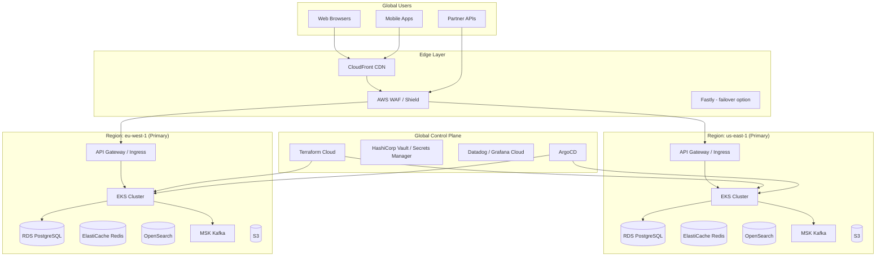
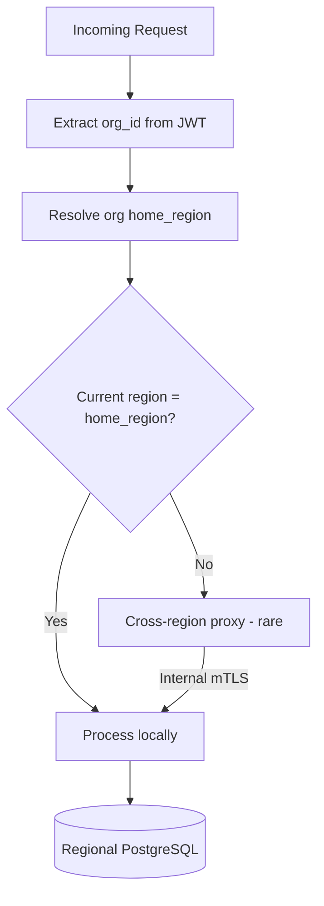
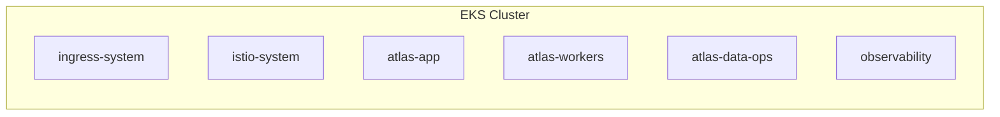
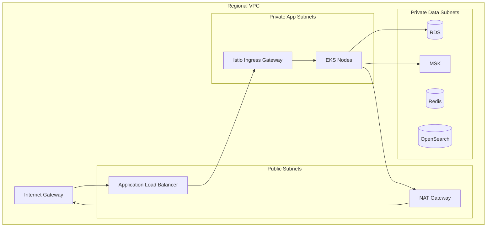
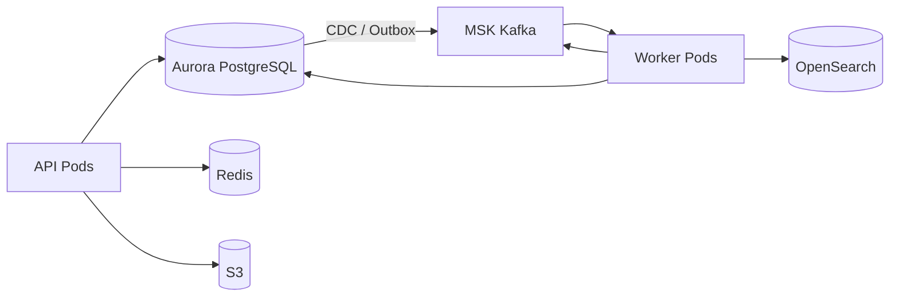
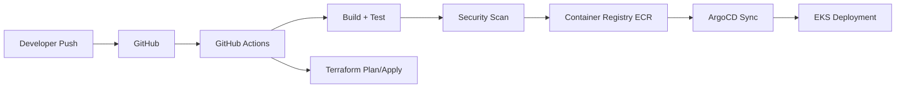

# Atlas Infrastructure Architecture — Phase 1

## Purpose

This document defines the cloud infrastructure architecture for Atlas Phase 1: how the platform is deployed, networked, secured, observed, and operated at global scale. It supports the business requirements in [01-business-architecture.md](./01-business-architecture.md) (multi-region data residency, millions of tenants) and the software patterns in [02-software-architecture.md](./02-software-architecture.md) (modular monolith, event bus, polyglot services).

## Scope

**In scope:**

- Multi-region active-active deployment with regional data residency
- Kubernetes on AWS/GCP (EKS/GKE)
- CDN, WAF, DDoS protection
- Network topology (VPC, subnets, service mesh)
- Data store placement, replication, and backup
- Secrets management
- CI/CD pipeline architecture
- Environment strategy
- Cost optimization
- Infrastructure as Code (Terraform/Pulumi)

**Out of scope:**

- Application code structure and module boundaries
- AI inference infrastructure details (see [04-ai-architecture.md](./04-ai-architecture.md) — cross-referenced where overlapping)
- Detailed runbooks and on-call procedures
- Vendor contract negotiations

## Context

Atlas targets **billions of API requests annually** across **millions of organizations** with **hundreds of millions of users**. Infrastructure must be:

- **Multi-region active-active** for latency and availability
- **Data residency compliant** (GDPR EU, future APAC) at organization granularity
- **Horizontally scalable** with clear scaling units per tier
- **Cost-efficient** at SMB scale while supporting enterprise isolation
- **GitOps-driven** with full IaC coverage

**Primary cloud strategy:** AWS as primary (EKS, RDS, MSK, CloudFront) with **GCP as secondary** option for specific regions or AI workloads (GKE, Cloud SQL). Phase 1 standardizes on **AWS us-east-1 + eu-west-1** with abstraction layers preventing vendor lock-in on application code.

---

## High-Level Infrastructure Overview



---

## Multi-Region Deployment Strategy

### Active-Active Regional Model

Atlas deploys **symmetric regional stacks** in each active region. User traffic routes to the nearest healthy region via geo-DNS (Route 53 latency-based routing with health checks).

| Aspect | Strategy |
|--------|----------|
| **Compute** | Active-active; stateless workloads in each region |
| **OLTP Data** | **Regional residency** — organization data pinned to home region |
| **Object Storage** | Regional S3 buckets; cross-region replication only for platform assets |
| **Search** | Regional OpenSearch clusters; indices scoped to regional data |
| **Events** | Regional Kafka clusters; global events replicated selectively via MirrorMaker 2 |
| **Cache** | Regional Redis; no cross-region cache sharing |
| **Control Plane** | Global (IaC, secrets, CI/CD, observability) |

### Data Residency Routing



- Organization `home_region` set at provisioning (immutable for Enterprise without migration workflow)
- **99%+ of requests** served in-home-region after initial routing
- Cross-region proxy for admin/reporting with explicit audit (Enterprise feature)
- GDPR: EU organizations **must** have `home_region = eu-west-1` (or future EU regions)

### Regional Failure

- R53 health checks fail unhealthy region → traffic shifts
- Organizations pinned to failed region: **read-only degradation** or **controlled failover** per DR playbook (Enterprise RPO/RTO in contract)
- RPO target: **< 1 minute** (sync replication for critical metadata); RTO target: **< 15 minutes** for regional failover

### Future Regions (Roadmap)

| Region | Cloud | Trigger |
|--------|-------|---------|
| ap-southeast-1 | AWS | APAC customer concentration |
| ca-central-1 | AWS | Data residency (Canada) |
| me-south-1 | AWS | GCC enterprise |

---

## Kubernetes Architecture

### Cluster Topology

**One EKS cluster per region per environment** (not one global cluster).

```
Production:
  us-east-1-prod-eks
  eu-west-1-prod-eks

Staging:
  us-east-1-staging-eks  (scaled-down mirror)

Development:
  us-east-1-dev-eks      (shared, namespace-isolated)
```

### Node Pools

| Node Pool | Instance Type | Workload |
|-----------|---------------|----------|
| `system` | m6i.large | Istio, CoreDNS, monitoring agents |
| `api-general` | m6i.xlarge – 2xlarge | Modular monolith API, gateway |
| `api-highmem` | r6i.xlarge | Batch exports, report generation |
| `worker` | m6i.large – xlarge | Kafka consumers, outbox relay |
| `go-compute` | c6i.2xlarge | Go search indexer, event processor |
| `gpu-optional` | g5.xlarge | Embedding batch jobs (see [04-ai-architecture.md](./04-ai-architecture.md)) |

- **Karpenter** for node autoscaling (preferred over Cluster Autoscaler)
- **Spot instances** for worker and batch pools (70% spot / 30% on-demand minimum)
- **Pod Disruption Budgets** on all critical deployments (minAvailable: 2 for API)

### Namespace Strategy



| Namespace | Contents |
|-----------|----------|
| `atlas-app` | gateway, api (monolith), web SSR pods |
| `atlas-workers` | outbox relay, projection consumers, saga workers |
| `atlas-go` | Go microservices (search-indexer, etc.) |
| `atlas-ai` | AI orchestration service, embedding workers |
| `istio-system` | Service mesh control plane |
| `observability` | OTel collectors, Fluent Bit |

### Workload Deployment Pattern

```yaml
# Illustrative deployment characteristics
api:
  replicas: min 3, HPA max 50 (CPU 60%, custom: request_rate)
  resources: requests 1CPU/2Gi, limits 2CPU/4Gi
  probes: /health/live, /health/ready
  topologySpreadConstraints: across AZs
  serviceAccount: IRSA-bound per workload
```

---

## CDN, WAF, and DDoS Protection

### CDN (CloudFront Primary)

| Asset Type | CDN Behavior |
|------------|--------------|
| Static web (Next.js) | Edge cached, stale-while-revalidate |
| Public marketing sites (Website Builder) | Per-tenant cache keys, custom domains via CF |
| API responses | **No caching** except GET /public/* and health |
| File downloads (Docs) | Signed URLs, S3 origin, range requests |

- **Fastly** evaluated as secondary CDN for Website Builder custom domains requiring advanced edge logic
- **Origin shield** enabled in primary region per CDN distribution

### WAF Rules (AWS WAF)

- OWASP Core Rule Set (managed)
- Rate limiting: 2000 req/5min per IP (adjustable per route)
- Geo-blocking: optional per workspace (Enterprise)
- Bot control: AWS Bot Control managed rule group
- Custom rules: block known bad user agents, SQLi patterns on query strings

### DDoS Protection

- **AWS Shield Standard** on all resources (automatic)
- **Shield Advanced** on production (DDoS response team, cost protection)
- API gateway rate limiting + Redis token bucket per workspace (tier-based)
- Kafka and internal services **not internet-exposed** (private subnets only)

---

## Network Topology

### VPC Design (Per Region)

```
VPC CIDR: 10.0.0.0/16 (us-east-1), 10.1.0.0/16 (eu-west-1)

├── public-subnets (3 AZs)     10.0.1.0/24, 10.0.2.0/24, 10.0.3.0/24
│   └── NAT Gateway (1 per AZ), ALB, CloudFront origins
├── private-app-subnets (3 AZs) 10.0.11.0/24, ...
│   └── EKS worker nodes, application pods
├── private-data-subnets (3 AZs) 10.0.21.0/24, ...
│   └── RDS, ElastiCache, OpenSearch, MSK
└── private-mgmt-subnets       10.0.31.0/24, ...
    └── Bastion (SSM only), CI runners (optional)
```



### Inter-Region Connectivity

- **AWS Transit Gateway** peering between regional VPCs
- **mTLS** for cross-region service calls (regional proxy path)
- **No direct database cross-region connections** — application-layer replication only

### Service Mesh (Istio)

Phase 1 adopts **Istio** for:

- mTLS everywhere (STRICT mode in prod)
- Traffic management: retries, timeouts, circuit breaking
- Observability: distributed tracing propagation
- Authorization policies: workload identity (SPIFFE)

**Linkerd** evaluated as lighter alternative; Istio chosen for enterprise policy maturity and multi-cluster roadmap.

### Network Policies

- Kubernetes NetworkPolicy: deny-all default, explicit allow per namespace
- Data subnets: security groups allow only `atlas-app` and `atlas-workers` SGs
- Egress restricted: allowlist for external APIs (Stripe, email providers, LLM endpoints)

---

## Data Stores: Placement and Replication

### PostgreSQL (RDS Aurora PostgreSQL 15+)

| Cluster | Purpose | Topology |
|---------|---------|----------|
| `atlas-oltp-{region}` | Module schemas (OLTP) | Aurora multi-AZ, 1 writer + 2 readers |
| `atlas-platform-{region}` | Identity, billing, audit | Separate cluster for blast radius |

**Schema-per-module** within OLTP cluster (see [02-software-architecture.md](./02-software-architecture.md)).

- **Connection pooling:** PgBouncer sidecar / RDS Proxy
- **Read replicas:** Application read models route analytics queries to reader endpoints
- **Backups:** Continuous backup, 35-day retention, cross-region snapshot copy (encrypted)
- **Encryption:** AES-256 at rest (KMS CMK per region); TLS 1.3 in transit

### Redis (ElastiCache)

| Cluster | Use |
|---------|-----|
| `session-{region}` | User sessions, JWT blocklist |
| `cache-{region}` | Query cache, idempotency keys |
| `rate-limit-{region}` | Gateway rate limiting |

- Redis 7 cluster mode enabled for cache/rate-limit
- No persistence required for cache; AOF for rate-limit (acceptable rebuild)

### OpenSearch

- 3-data-node minimum per region (r6g.large.search)
- Index per module projection + unified search index
- ILM policies: hot (7d) → warm (30d) → cold (365d)
- Cross-cluster search **not used** for tenant data (regional only)

### S3

| Bucket | Content | Policy |
|--------|---------|--------|
| `atlas-docs-{region}` | Customer documents | SSE-KMS, versioning, lifecycle to Glacier |
| `atlas-assets-{region}` | Website builder assets | Public read via CloudFront OAC |
| `atlas-backups-{region}` | DB snapshots export | Cross-region replication to DR bucket |
| `atlas-ml-{region}` | Embedding artifacts | See [04-ai-architecture.md](./04-ai-architecture.md) |

### Kafka (MSK)

- 3-broker minimum per region (kafka.m5.large)
- Topics partitioned by `{organizationId}` for ordering
- Retention: 7 days default; audit topics 90 days
- **MirrorMaker 2** for platform-global topics only (`tenant.organization.created`, billing events)

### Data Flow Summary



---

## Secrets Management

### Tiered Secrets Strategy

| Tier | Store | Examples |
|------|-------|----------|
| **Platform secrets** | HashiCorp Vault (HA cluster) | DB master creds, Kafka ACLs, inter-region mTLS CAs |
| **Application secrets** | AWS Secrets Manager | Stripe keys, SendGrid, per-tenant OAuth app secrets |
| **Runtime config** | Kubernetes Secrets + External Secrets Operator | Synced from Vault/SM, rotated automatically |
| **Tenant secrets** | Encrypted in PostgreSQL (Vault transit) | Customer API keys, integration credentials |

### Key Management

- **AWS KMS CMK** per region per data classification
- **Envelope encryption** for tenant secrets
- **IRSA (IAM Roles for Service Accounts)** — no static cloud credentials in pods
- **Rotation:** 90-day automatic for platform secrets; on-compromise immediate via Vault

### Access Control

- Vault policies: least privilege per workload identity
- Secrets Manager resource policies: restrict to specific IAM roles
- **No secrets in Terraform state** — references only; dynamic secrets where possible
- CI/CD: short-lived OIDC tokens to AWS (no long-lived CI keys)

---

## CI/CD Pipeline Architecture



### Pipeline Stages

| Stage | Tools | Gates |
|-------|-------|-------|
| **Lint & Unit Test** | ESLint, Vitest, Go test | 100% pass, coverage ≥ 80% domain |
| **Integration Test** | Testcontainers (PG, Redis, Kafka) | Pass |
| **SAST** | CodeQL, Semgrep | No critical findings |
| **Dependency Scan** | Snyk, Dependabot | No critical CVEs |
| **Container Build** | Docker BuildKit, multi-stage | SBOM generated (Syft) |
| **Image Scan** | Trivy, ECR scanning | No critical CVEs |
| **IaC Plan** | Terraform Cloud | Peer review required for prod |
| **Deploy Staging** | ArgoCD auto-sync | Smoke tests |
| **Deploy Prod** | ArgoCD manual promote | Canary analysis |

### Deployment Strategy

- **Canary deployments** via Istio (5% → 25% → 100% over 30 min)
- **Feature flags** (LaunchDarkly or open-source Flagsmith) decouple deploy from release
- **Database migrations:** golang-migrate / Flyway, backward-compatible expand-contract pattern
- **Rollback:** ArgoCD rollback + Istio traffic shift; migrations must be reversible

### GitOps

- **ArgoCD** watches `deploy/` manifests in Git
- Environment overlays: Kustomize base + `overlays/{dev,staging,prod}`
- **Terraform Cloud** for infrastructure; separate state per region per environment

---

## Environment Strategy

| Environment | Purpose | Infrastructure | Data |
|-------------|---------|----------------|------|
| **Local** | Developer workstation | Docker Compose (PG, Redis, Kafka, LocalStack) | Synthetic seed |
| **Dev** | Integration, feature branches | Shared EKS namespace per team | Anonymized subset |
| **Staging** | Pre-prod validation | Full regional mirror (single region, 30% scale) | Production-like anonymized |
| **Sandbox** | Partner API experimentation | Isolated EKS, separate DB | Auto-reset weekly |
| **Production** | Live customers | Multi-region active-active | Real |

### Environment Isolation

- Separate AWS accounts per environment (AWS Organizations SCPs)
- **Production account** has no direct human access — break-glass via PAM only
- Staging receives production-anonymized data via automated pipeline (monthly refresh)

### Sandbox specifics

- Per-partner or per-developer API keys
- Rate limits enforced aggressively
- Webhook replay tooling for integration testing

---

## Cost Optimization Strategy

Atlas must remain economically viable from SMB Starter tier through Enterprise scale.

### Compute

| Tactic | Expected Savings |
|--------|------------------|
| Spot instances for workers/batch | 60–70% vs on-demand |
| Karpenter right-sizing | 15–25% reduction in over-provisioned nodes |
| HPA aggressive scale-down (non-prod) | 50% dev/staging compute |
| Graviton (ARM) migration for stateless API | 20% after validation |

### Data

| Tactic | Application |
|--------|-------------|
| S3 Intelligent-Tiering + lifecycle | Docs, backups |
| OpenSearch ILM to cold storage | Old search indices |
| RDS reader autoscaling | Scale readers only during report windows |
| Kafka retention tuning | Non-audit topics 7d not 30d |

### Network

- CloudFront reduces origin egress (40%+ on static assets)
- VPC endpoints for S3, DynamoDB (if used) — avoid NAT charges
- Compress API responses (gzip/brotli) — reduce egress and improve latency

### Multi-Tenancy Efficiency

- **Shared infrastructure** for Starter/Growth (logical isolation)
- **Noisy neighbor mitigation** via rate limits and resource quotas, not premature dedicated infra
- **Enterprise dedicated clusters** priced at premium (cost pass-through + margin)

### FinOps Practice

- **Kubecost** or CloudHealth for per-namespace cost allocation
- Monthly cost review per bounded context team
- Budget alerts at 80%/100% threshold per environment
- Unit economics tracked: **cost per active organization**, **cost per 1M API calls**

### Phase 1 Cost Targets (Illustrative)

| Scale | Monthly Infra Budget Target |
|-------|----------------------------|
| 0–10K orgs | $15K–$40K |
| 10K–100K orgs | $150K–$400K |
| 100K–1M orgs | $1.5M–$4M (efficiency curve) |

---

## Infrastructure as Code

### Terraform (Primary)

```
infrastructure/
├── modules/
│   ├── vpc/
│   ├── eks/
│   ├── rds-aurora/
│   ├── elasticache/
│   ├── msk/
│   ├── opensearch/
│   ├── s3-bucket/
│   ├── cloudfront/
│   ├── waf/
│   └── iam-irsa/
├── environments/
│   ├── dev/us-east-1/
│   ├── staging/us-east-1/
│   └── prod/
│       ├── us-east-1/
│       └── eu-west-1/
└── global/
    ├── route53/
    ├── iam/
    └── terraform-cloud/
```

### Pulumi (Selective)

- **Pulumi** for complex dynamic provisioning (per-tenant sandbox environments, Website Builder custom domain automation)
- TypeScript Pulumi aligns with primary engineering language

### IaC Principles

- **No click-ops** in production
- Module versioning tagged (semver)
- Drift detection weekly via Terraform Cloud
- Policy as Code: Sentinel or OPA Conftest (require encryption, deny public S3)

---

## Observability and Operations

### Three Pillars

| Pillar | Stack |
|--------|-------|
| **Metrics** | Prometheus (AMP) + Grafana Cloud |
| **Logs** | Fluent Bit → CloudWatch → S3 archive / Datadog |
| **Traces** | OpenTelemetry → Tempo / Datadog APM |

### SLOs (Phase 1)

| Service | SLI | SLO |
|---------|-----|-----|
| API (read) | Availability + latency p99 < 500ms | 99.9% monthly |
| API (write) | Availability + latency p99 < 1s | 99.9% monthly |
| WebSocket (Messaging) | Connection success | 99.5% monthly |
| Background projections | Lag < 30s p99 | 99% monthly |

### Incident Management

- PagerDuty integration on SLO burn rate alerts
- Status page (Atlassian Statuspage or Instatus)
- Post-incident reviews mandatory for SEV1/SEV2

*Detailed runbooks are out of scope for this document.*

---

## Security Infrastructure Summary

| Control | Implementation |
|---------|----------------|
| Encryption at rest | KMS CMK all data stores |
| Encryption in transit | TLS 1.3 everywhere, Istio mTLS internal |
| Identity (workload) | IRSA, SPIFFE via Istio |
| Identity (human) | SSO via Okta, no prod console access |
| Vulnerability management | Continuous scanning, 30-day critical patch SLA |
| Compliance evidence | AWS Config, CloudTrail, immutable audit S3 |
| Penetration testing | Annual third-party + continuous bug bounty |

*Aligns with SOC 2 requirements in [01-business-architecture.md](./01-business-architecture.md).*

---

## Alternatives Considered

### Alternative A: Single-Region Multi-AZ Only (Phase 1)

**Rejected:** Latency unacceptable for EU/APAC; GDPR data residency requires EU region at enterprise launch. Multi-region from start avoids painful migration.

### Alternative B: Serverless-First (Lambda + Aurora Serverless)

**Rejected:** Cold start and duration limits problematic for long-running sagas, WebSockets, and Kafka consumers. EKS provides uniform runtime for monolith + workers + Go services.

### Alternative C: Self-Managed Kubernetes on EC2

**Rejected:** Operational burden of control plane management. EKS/GKE managed control planes reduce toil.

### Alternative D: CockroachDB Global Distribution

**Evaluated, deferred:** Simplifies multi-region writes but increases cost and team learning curve. PostgreSQL regional pinning meets Phase 1 residency requirements; revisit for global OLTP at 10M+ org scale.

### Alternative E: Vault-Only Secrets (No Secrets Manager)

**Rejected:** AWS-native integrations (RDS rotation) simpler with Secrets Manager; Vault retained for dynamic secrets and PKI.

---

## Consequences

### Positive

- **Active-active regions** deliver low latency and HA aligned with enterprise contracts
- **Regional data pinning** satisfies GDPR without per-tenant database sprawl
- **GitOps + IaC** enable reproducible environments and audit trail for SOC 2
- **Istio mTLS** provides zero-trust internal network without application changes
- **FinOps practices** prevent cost spiral at SMB-heavy user mix

### Negative

- **Multi-region operational complexity** — duplicated stacks, MirrorMaker ops, cross-region debugging harder
- **Regional pinning** complicates global admin dashboards (cross-region aggregation latency)
- **Istio overhead** — resource cost and team expertise required
- **MSK cost** significant at lower scale — may use managed Kafka alternative or single-region Kafka in dev
- **Terraform + Pulumi split** — two IaC mental models

---

## Open Questions

| ID | Question | Owner | Target |
|----|----------|-------|--------|
| IQ-01 | **AWS-only** Phase 1 or dual-cloud (GCP for AI)? | Platform | Q2 2026 |
| IQ-02 | **Istio vs Linkerd** — pilot both in staging? | Platform | Q2 2026 |
| IQ-03 | Separate **Aurora cluster per module** at what org scale threshold? | DBA | Q4 2026 |
| IQ-04 | **MSK Serverless** vs provisioned for Phase 1 cost? | Platform | Q2 2026 |
| IQ-05 | **Enterprise dedicated cluster** provisioning — Terraform module or Pulumi? | Platform | Q3 2026 |
| IQ-06 | **Backup cross-region** — sync snapshots or async acceptable for RPO? | DBA + Legal | Q2 2026 |
| IQ-07 | Observability vendor: **Datadog unified** vs OSS stack (Grafana Cloud)? | SRE | Q2 2026 |

---

## Cross-References

| Document | Relationship |
|----------|--------------|
| [01-business-architecture.md](./01-business-architecture.md) | Data residency, compliance, multi-tenancy hierarchy |
| [02-software-architecture.md](./02-software-architecture.md) | Runtime workloads, outbox, module schemas, service mesh consumers |
| [04-ai-architecture.md](./04-ai-architecture.md) | AI orchestration pods, GPU pools, embedding storage, LLM egress |
| *Atlas DR Playbook* (planned) | Regional failover procedures |
| *Atlas SLO Catalog* (planned) | Per-service error budgets |
| *Atlas Terraform Module Registry* (planned) | Module documentation |

---

*Document owner: Chief Software Architect · Review cadence: Quarterly or on major infra change*