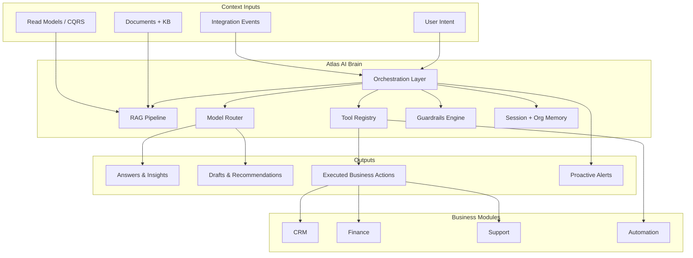
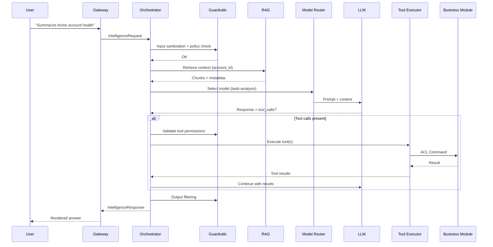
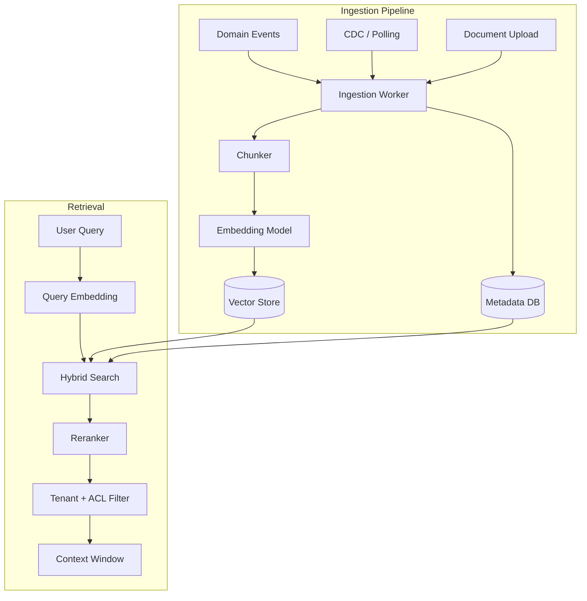
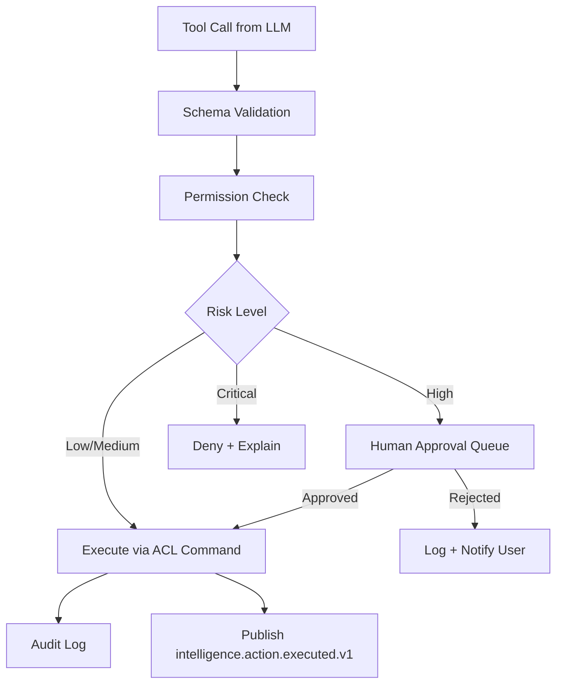
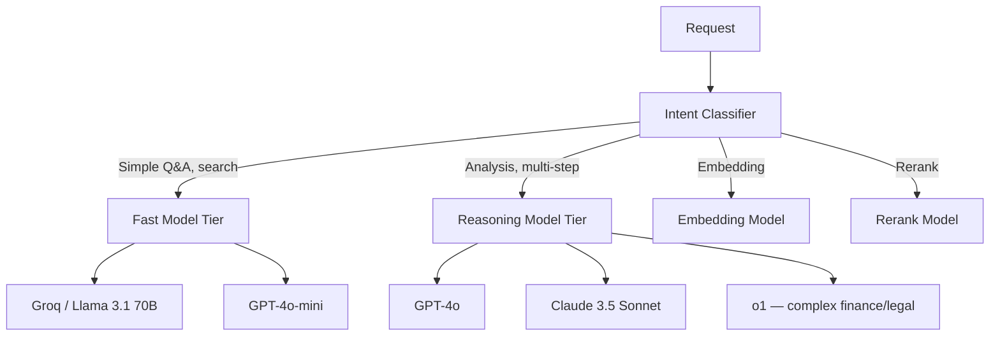
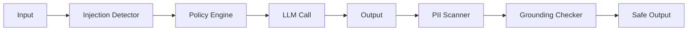
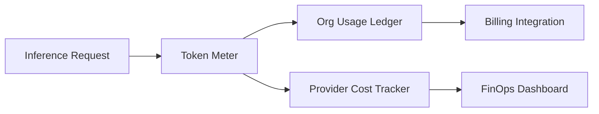
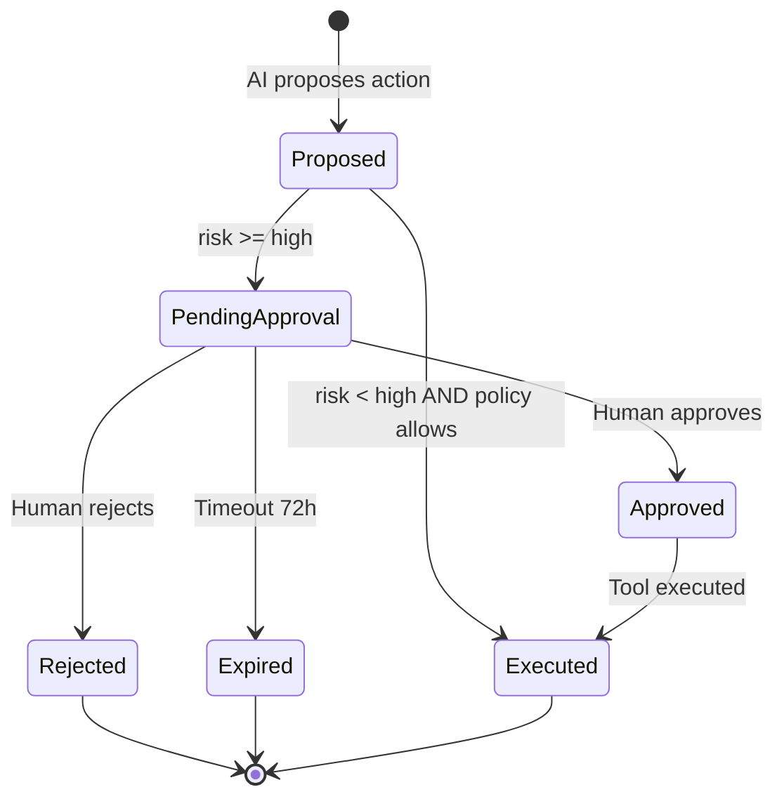
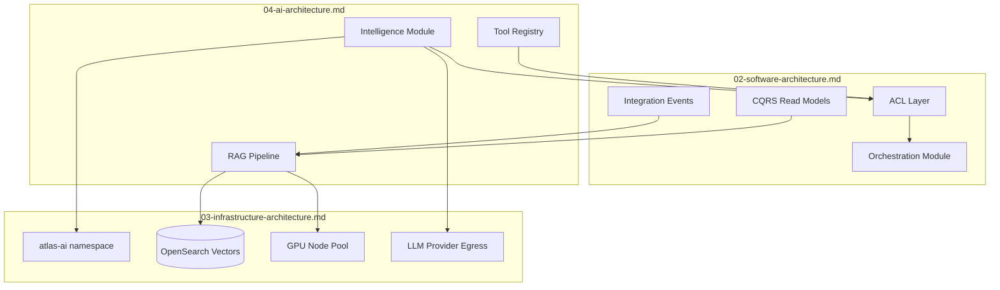

# Atlas AI Architecture — Phase 1

## Purpose

This document defines the artificial intelligence architecture for Atlas: how AI functions as the **business brain** of the platform—not a peripheral chatbot—reasoning across CRM, Finance, HR, Support, and all other business domains to understand context, recommend actions, and execute authorized operations on behalf of users.

It aligns with the Intelligence bounded context in [01-business-architecture.md](./01-business-architecture.md), integrates with software patterns in [02-software-architecture.md](./02-software-architecture.md), and specifies infrastructure requirements complementing [03-infrastructure-architecture.md](./03-infrastructure-architecture.md).

## Scope

**In scope:**

- AI as business brain — conceptual model and capabilities
- LLM orchestration layer
- RAG (Retrieval-Augmented Generation) pipeline
- Tool-use / function calling for business actions
- Model routing (fast vs reasoning models)
- Embedding strategy
- AI safety and guardrails
- Cost management for inference
- Human-in-the-loop workflows
- AI observability

**Out of scope:**

- Specific model vendor contracts and pricing negotiations
- ML training pipeline for custom model fine-tuning (Phase 2+)
- Computer vision / document OCR architecture (integration points noted)
- Detailed prompt library and evaluation datasets

## Context

Atlas differentiates from competitors by embedding AI at the **platform layer**, not as a bolt-on feature per module. The AI brain:

- **Reads** unified business context via event streams and read models
- **Reasons** over cross-domain data (e.g., "This customer's support cases correlate with overdue invoices")
- **Acts** through governed tool invocations (create task, draft email, flag anomaly, propose journal entry)
- **Learns** from feedback loops (explicit user ratings, implicit acceptance/rejection of suggestions)

**Design constraints:**

- **Tenant isolation absolute** — no cross-organization retrieval or inference
- **No training on customer data** without explicit enterprise opt-in
- **Human-in-the-loop** for high-impact mutations (financial postings, bulk deletes, external communications)
- **Cost proportional to tier** — AI usage metered per [01-business-architecture.md](./01-business-architecture.md)

---

## AI as Business Brain

### Conceptual Model



### Capability Tiers

| Tier | Capability | Example |
|------|------------|---------|
| **L0 — Retrieve** | Semantic search across tenant data | "Find contracts mentioning renewal clause" |
| **L1 — Analyze** | Cross-domain reasoning | "Why did churn spike in Q2 for enterprise accounts?" |
| **L2 — Recommend** | Suggested actions with rationale | "Offer 10% discount — similar accounts converted" |
| **L3 — Draft** | Generate content for human approval | Draft support reply, invoice memo, job posting |
| **L4 — Execute** | Autonomous tool invocation (governed) | Create follow-up task, update lead score, schedule meeting |
| **L5 — Automate** | Trigger workflows from inferred intent | Escalate case when sentiment + SLA risk detected |

Phase 1 GA targets **L0–L4** with L5 for predefined automation templates. Full L5 autonomy is tier- and policy-gated.

### AI Surfaces

- **Universal Copilot** — persistent UI panel across all modules
- **Inline suggestions** — context-aware chips in CRM, Support, Finance forms
- **Proactive feed** — AI-generated alerts in unified inbox
- **API** — `/v1/intelligence/*` for partner and automation consumption
- **Background agents** — scheduled analysis jobs (anomaly detection, pipeline health)

---

## LLM Orchestration Layer

The **Intelligence Orchestration Service** is the central runtime coordinating all AI requests.



### Orchestrator Components

| Component | Responsibility |
|-----------|--------------|
| **Request Parser** | Intent classification, entity extraction, module routing |
| **Context Assembler** | Gathers RAG results, recent events, user permissions, org settings |
| **Prompt Composer** | Template selection, dynamic context injection, token budgeting |
| **Model Router** | Selects model tier based on task complexity and latency SLO |
| **Tool Planner** | Maps LLM tool_calls to registered handlers; multi-step planning |
| **Guardrails Engine** | Pre/post filtering, PII handling, policy enforcement |
| **Response Formatter** | Citations, confidence scores, action cards for UI |
| **Telemetry Emitter** | Traces, token counts, latency, quality signals |

### Runtime Architecture

- **Language:** TypeScript (NestJS-style service) in `atlas-ai` K8s namespace
- **State:** Redis for session context (TTL 24h); PostgreSQL for audit log and feedback
- **Queue:** Kafka topic `intelligence.requests` for async/background jobs
- **Concurrency:** Worker pool with per-tenant fair queuing (prevent noisy neighbor)

### Prompt Management

- Prompts stored in **versioned registry** (Git-backed, deployed via ConfigMap)
- Templates per task type: `summarize`, `draft_email`, `analyze_pipeline`, `explain_anomaly`
- **No prompt injection from user content** — user input in designated XML-tagged sections with sanitization

---

## RAG Pipeline Architecture

RAG grounds LLM responses in **tenant-specific factual data**, reducing hallucination and enabling citations.



### Data Sources Indexed

| Source | Trigger | Chunk Strategy |
|--------|---------|----------------|
| CRM accounts, contacts, notes | `customer.*` events | 512-token chunks, overlap 64 |
| Support cases, threads | `service.*` events | Per-message + case summary |
| Documents (Docs module) | S3 upload + versioning | Paragraph + heading-aware |
| Knowledge Base articles | `knowledge.*` events | Section-based |
| Finance records (read model) | Projection updates | Aggregated summaries only — no raw GL line detail in vectors |
| Contracts (Legal) | `obligation.*` events | Clause-level chunks |

### Vector Store

- **Primary:** OpenSearch k-NN (aligns with existing regional clusters — [03-infrastructure-architecture.md](./03-infrastructure-architecture.md))
- **Alternative evaluated:** Pinecone, pgvector — OpenSearch chosen for operational consolidation
- **Index naming:** `vectors-{region}-{org_id_hash}` or shared index with `organization_id` filter field
- **Embedding dimensions:** 1536 (OpenAI text-embedding-3-small) or 1024 (Cohere embed-v3) — abstracted via embedding provider interface

### Hybrid Search

1. **Dense retrieval** — vector similarity top-k (k=20)
2. **Sparse retrieval** — BM25 on same corpus
3. **Fusion** — reciprocal rank fusion (RRF)
4. **Rerank** — cross-encoder reranker (Cohere rerank-v3 or local mini model) top-5
5. **ACL filter** — user can only retrieve chunks from modules they have read access to

### Freshness

| Data Type | Target Index Lag |
|-----------|------------------|
| Messaging, Support | < 30 seconds |
| CRM, Docs | < 2 minutes |
| Finance summaries | < 5 minutes |
| Legal contracts | < 5 minutes |

Stale index acknowledged in UI: "Data as of {timestamp}"

### Citations

Every grounded response includes:

```json
{
  "citations": [
    {
      "sourceType": "support_case",
      "sourceId": "case_01JABC",
      "title": "Acme — billing dispute",
      "excerpt": "...",
      "url": "/support/cases/01JABC",
      "confidence": 0.92
    }
  ]
}
```

---

## Tool-Use / Function Calling

AI **acts** on the business through a governed **Tool Registry** — typed functions mapped to module commands via ACL (see [02-software-architecture.md](./02-software-architecture.md)).

### Tool Registry Structure

```typescript
// Illustrative tool definition
{
  name: "crm_create_follow_up_task",
  description: "Create a follow-up task on a CRM lead or opportunity",
  parameters: { leadId: "string", dueDate: "date", notes: "string" },
  module: "customer",
  command: "CreateFollowUpTaskCommand",
  riskLevel: "medium",
  requiredPermissions: ["crm:tasks:write"],
  idempotencyKeyFrom: ["leadId", "dueDate"]
}
```

### Tool Categories (Phase 1)

| Category | Tools | Risk Level |
|----------|-------|------------|
| **Read** | `search_accounts`, `get_pipeline_summary`, `get_case_history` | Low |
| **Draft** | `draft_email`, `draft_quote_summary`, `draft_kb_article` | Low |
| **Create** | `create_task`, `create_note`, `schedule_meeting` | Medium |
| **Update** | `update_lead_status`, `assign_case`, `add_tag` | Medium |
| **Financial** | `create_draft_invoice`, `propose_journal_entry` | High |
| **Destructive** | `bulk_delete_leads`, `cancel_order` | Critical — blocked from L4 |

### Execution Flow



### Tool Design Principles

1. **Idempotent** — every tool accepts or derives idempotency key
2. **Narrow** — prefer many specific tools over few parameterized mega-tools
3. **Auditable** — full prompt, tool call, result, and actor stored
4. **Reversible where possible** — compensation hints in tool response
5. **No raw SQL** — tools map to application commands only

---

## Model Routing

Atlas routes requests to **appropriate models** balancing quality, latency, and cost.



### Model Tiers

| Tier | Models (Phase 1) | Latency Target | Use Cases |
|------|------------------|----------------|-----------|
| **Fast** | GPT-4o-mini, Llama 3.1 70B (Groq) | < 2s p95 | Search answers, simple drafts, classification |
| **Standard** | GPT-4o, Claude 3.5 Sonnet | < 8s p95 | Analysis, multi-tool plans, complex drafts |
| **Reasoning** | o1, Claude 3.5 Opus | < 30s p95 | Financial anomaly explanation, contract clause analysis |
| **Embedding** | text-embedding-3-small | < 500ms | RAG ingestion and query |
| **Rerank** | rerank-english-v3.0 | < 300ms | Top-k refinement |

### Routing Rules

1. **Default fast** — upgrade to standard only when classifier confidence < 0.7 or user enables "deep analysis"
2. **Reasoning tier** — Finance and Legal modules default to standard minimum; reasoning on explicit user request
3. **Fallback chain** — primary provider timeout → secondary provider → graceful degradation message
4. **Provider abstraction** — `ModelProvider` interface; no provider-specific code in orchestrator
5. **Data residency** — EU orgs route to EU-hosted endpoints (Azure OpenAI EU, Anthropic EU when available)

### Private / Future Models

- **Phase 2:** Evaluate self-hosted Llama 3.1 405B on `gpu-optional` node pool for cost at scale
- **Phase 2:** Domain-specific fine-tunes on anonymized aggregate patterns (never per-tenant without opt-in)

---

## Embedding Strategy

### Embedding Pipeline

| Stage | Detail |
|-------|--------|
| **Extract** | Event consumer or document webhook delivers normalized text |
| **Normalize** | Strip HTML, redact PII markers (SSN patterns), truncate |
| **Chunk** | Module-specific chunker (see RAG section) |
| **Embed** | Batch requests (max 100 chunks) to embedding provider |
| **Store** | Upsert to OpenSearch with metadata: `org_id`, `module`, `entity_type`, `entity_id`, `acl_roles[]`, `content_hash` |
| **Dedup** | Skip if `content_hash` unchanged |

### Multi-Language

- Atlas is **multi-language** (see [01-business-architecture.md](./01-business-architecture.md))
- Use **multilingual embedding model** (Cohere embed-multilingual-v3 or OpenAI text-embedding-3-large)
- Query language detected; retrieval cross-lingual where model supports

### Embedding Freshness vs Cost

- **Incremental updates** on events (not full re-index)
- **Nightly reconciliation** job compares source checksums vs index
- **Full re-embed** on model version upgrade (blue/green index migration)

### Tenant Isolation in Embeddings

- Every vector document includes `organization_id` as **mandatory filter**
- Index-level isolation for Enterprise dedicated deployments
- Embedding API calls tagged with `organization_id` for cost allocation

---

## AI Safety and Guardrails

### Threat Model

| Threat | Mitigation |
|--------|------------|
| **Prompt injection** | Input sanitization, structured prompts, tool allowlist, output validation |
| **Cross-tenant data leak** | Mandatory org filter on retrieval; request context binding |
| **Unauthorized actions** | Permission check per tool; risk-tier gating |
| **PII exfiltration** | Output PII scanner; redact in logs |
| **Harmful content** | Provider safety filters + custom blocklist |
| **Model hallucination** | RAG grounding required for factual claims; citation enforcement |
| **Excessive agency** | Human-in-the-loop for high/critical risk tools |

### Guardrails Engine



**Input controls:**

- Detect instruction override patterns ("ignore previous instructions")
- Strip system prompt leakage attempts
- Rate limit per user for AI endpoints

**Output controls:**

- PII regex + NER scanner; mask before display and log storage
- **Grounding checker:** factual claims must cite retrieved chunk or be qualified as inference
- Financial amounts require source citation from Ledger read model

**Policy engine rules (examples):**

| Rule ID | Condition | Action |
|---------|-----------|--------|
| POL-01 | `riskLevel >= high` AND `auto_execute` | Require HITL approval |
| POL-02 | `module = ledger` AND `amount > $10,000` | Require HITL + dual approval (Enterprise) |
| POL-03 | `output contains PII` AND `destination = external_email` | Block + warn |
| POL-04 | `tier = starter` AND `monthly_ai_tokens > quota` | Soft block + upgrade prompt |

### Audit Trail

Every AI interaction logged:

```
intelligence_audit_log:
  id, organization_id, user_id, session_id, timestamp
  request_type, model_used, tokens_in, tokens_out
  tools_invoked[], tool_results[], hitl_status
  retrieval_chunk_ids[], citations[]
  user_feedback (thumbs, correction text)
  retention: 2 years (configurable Enterprise)
```

---

## Cost Management for AI Inference

AI inference is a **significant COGS line** — managed through metering, routing, and quotas per [01-business-architecture.md](./01-business-architecture.md).

### Cost Allocation



### Tier Quotas (Monthly)

| Tier | Included AI Tokens | Overage Price |
|------|-------------------|---------------|
| Starter | 100K tokens | $0.02 / 1K tokens |
| Growth | 1M tokens | $0.015 / 1K tokens |
| Business | 10M tokens | $0.01 / 1K tokens |
| Enterprise | Custom | Negotiated |

*Tokens normalized to GPT-4o-mini equivalent using cost-weighting formula.*

### Cost Optimization Tactics

| Tactic | Savings |
|--------|---------|
| Fast model default | 80% of requests at 1/10th cost |
| Prompt caching (provider-native) | 50% on repeated system prompts |
| RAG context compression | Summarize chunks before injection; target < 4K context tokens |
| Embedding batching | Batch size 100 reduces API overhead 40% |
| Cache frequent queries | Redis cache for identical org+query hash (TTL 1h, invalidation on entity update) |
| Background job off-peak | Schedule non-urgent analysis for lower-cost windows |

### Budget Controls

- Workspace admin sets **monthly AI budget cap** (optional)
- 80% threshold warning notification
- 100% cap: degrade to retrieval-only (L0) or block with admin override

### Unit Economics Monitoring

Track and alert:

- **Cost per AI-active user per month**
- **Cost per tool execution by type**
- **Token efficiency:** output value proxy (user acceptance rate / tokens)

---

## Human-in-the-Loop Workflows

HITL ensures human judgment for consequential AI actions.



### Approval Queue UX

- Unified **AI Actions Inbox** for managers/admins
- Shows: original user request, AI rationale, tool parameters, affected entities, diff preview
- Actions: Approve, Reject (with reason), Edit & Approve
- Mobile push for time-sensitive approvals (SLA-related)

### Approval Policies (Configurable)

| Policy | Default | Enterprise |
|--------|---------|------------|
| Financial postings | Always HITL | Configurable threshold |
| External emails | HITL | HITL with template allowlist option |
| Bulk operations (>10 records) | HITL | Configurable |
| CRM task creation | Auto-execute | Auto-execute |

### Feedback Loop

- Rejection reasons fed into **quality metrics** (not immediate fine-tuning)
- Monthly review of rejection patterns drives prompt and tool improvements
- Explicit thumbs up/down on all L1+ responses

### Escalation

- Unresolved HITL items > 24h → escalate to workspace admin
- AI must never retry rejected actions without new user intent

---

## AI Observability

### Metrics

| Metric | Type | Alert Threshold |
|--------|------|-----------------|
| `intelligence.request.latency` | Histogram p50/p95/p99 | p99 > 30s |
| `intelligence.tokens.total` | Counter by org, model | Budget burn rate |
| `intelligence.tool.success_rate` | Gauge by tool | < 95% |
| `intelligence.rag.retrieval_latency` | Histogram | p95 > 1s |
| `intelligence.rag.chunks_retrieved` | Histogram | Avg < 1 (quality issue) |
| `intelligence.guardrail.blocked` | Counter by rule | Spike > 3x baseline |
| `intelligence.hitl.approval_rate` | Gauge | < 50% (UX issue) |
| `intelligence.user.feedback.negative` | Counter | > 15% daily |

### Tracing

- OpenTelemetry span per orchestration step: `parse`, `retrieve`, `route`, `llm_call`, `tool_exec`, `guardrail`
- Correlation with business `correlationId` from gateway
- LLM traces include: model, tokens, prompt hash (not raw prompt in prod logs — stored encrypted in audit)

### Evaluation Pipeline (Continuous)

| Eval Type | Frequency | Method |
|-----------|-----------|--------|
| **Retrieval accuracy** | Weekly | Golden dataset per module (100 queries) |
| **Tool selection accuracy** | Weekly | Simulated multi-turn scenarios |
| **Grounding fidelity** | Daily | Automated citation verification |
| **Regression on model upgrade** | Per deploy | A/B against previous model version |
| **Safety red team** | Monthly | Injection, jailbreak, exfiltration attempts |

### Dashboards

- **Operations:** latency, error rates, provider health
- **Product:** adoption, feature usage by module, feedback scores
- **FinOps:** cost by org, model, tool; quota utilization
- **Safety:** guardrail triggers, HITL queue depth, blocked actions

---

## Integration with Platform Architecture



### Intelligence Module Placement

- Lives in `packages/modules/intelligence/` per modular monolith structure
- Extracted to standalone `atlas-ai` service when inference load exceeds 30% of API cluster capacity (Phase 1.5 trigger)

---

## Alternatives Considered

### Alternative A: Per-Module AI Chatbots

**Rejected:** Fragments context; each module's AI lacks Finance + Support cross-view. Contradicts business brain thesis.

### Alternative B: RAG-Only (No Tool Use)

**Rejected:** Retrieval alone cannot act; reduces AI to search UI. Tool use required for L4 differentiation.

### Alternative C: Single Model (GPT-4o) for All Requests

**Rejected:** Cost prohibitive at scale; latency poor for simple queries. Model routing essential.

### Alternative D: pgvector in PostgreSQL for Vectors

**Rejected for Phase 1:** OpenSearch already deployed for full-text; k-NN consolidation reduces ops. Revisit if OpenSearch k-NN performance insufficient at 100M+ vectors.

### Alternative E: Fully Autonomous L5 by Default

**Rejected:** Trust, compliance, and error cost too high. HITL and risk tiers required for enterprise adoption.

### Alternative F: Fine-Tune per Tenant

**Rejected for Phase 1:** Operational complexity, cost, and data isolation risk. RAG + prompting sufficient; enterprise opt-in fine-tune evaluated Phase 2.

---

## Consequences

### Positive

- **Unified business brain** creates defensible moat vs point-solution AI features
- **Tool registry + ACL** ensures AI actions respect same invariants as human users
- **Model routing** controls cost while preserving quality for complex tasks
- **RAG with citations** builds user trust and supports compliance audits
- **HITL** enables enterprise adoption of AI automation without reckless agency

### Negative

- **Complexity** — orchestrator, RAG, tools, guardrails, observability is substantial engineering surface
- **Latency** — multi-step tool plans may exceed user patience; requires streaming UX
- **Cost unpredictability** — viral AI feature adoption can spike COGS; quota enforcement may frustrate users
- **Provider dependency** — outage at OpenAI/Anthropic degrades platform intelligence
- **Evaluation burden** — continuous eval pipeline requires dedicated investment
- **Cross-module ACL maintenance** — every new module command needs corresponding tool definition

---

## Open Questions

| ID | Question | Owner | Target |
|----|----------|-------|--------|
| AQ-01 | **Primary LLM provider** — OpenAI vs Anthropic vs multi-provider day one? | AI Platform | Q2 2026 |
| AQ-02 | **OpenSearch k-NN** performance at 50M vectors — load test when? | AI + Infra | Q3 2026 |
| AQ-03 | **Proactive agents** (background L5) — which 3 use cases for GA? | Product | Q3 2026 |
| AQ-04 | Enterprise **opt-in training** scope and legal framework? | Legal + AI | Q4 2026 |
| AQ-05 | **Voice input** for copilot — Phase 1 or 2? | Product | Q3 2026 |
| AQ-06 | OCR for document ingestion — build vs AWS Textract integration? | AI Platform | Q3 2026 |
| AQ-07 | **AI action audit** retention alignment with SOC 2 and GDPR erasure — conflict resolution? | Compliance | Q2 2026 |
| AQ-08 | Self-hosted model **cost breakeven** vs API — modeling needed? | FinOps | Q4 2026 |

---

## Cross-References

| Document | Relationship |
|----------|--------------|
| [01-business-architecture.md](./01-business-architecture.md) | Intelligence bounded context, AI monetization, personas, compliance |
| [02-software-architecture.md](./02-software-architecture.md) | ACL, CQRS read models, event catalog, orchestration sagas |
| [03-infrastructure-architecture.md](./03-infrastructure-architecture.md) | atlas-ai namespace, GPU nodes, OpenSearch, egress, regional AI routing |
| *Atlas Tool Registry Catalog* (planned) | Complete tool definitions per module |
| *Atlas Prompt Library* (planned) | Versioned prompt templates |
| *Atlas AI Evaluation Datasets* (planned) | Golden sets per module |
| *Atlas AI Safety Red Team Playbook* (planned) | Adversarial testing procedures |

---

*Document owner: Chief Software Architect · Review cadence: Quarterly or on major AI capability launch*