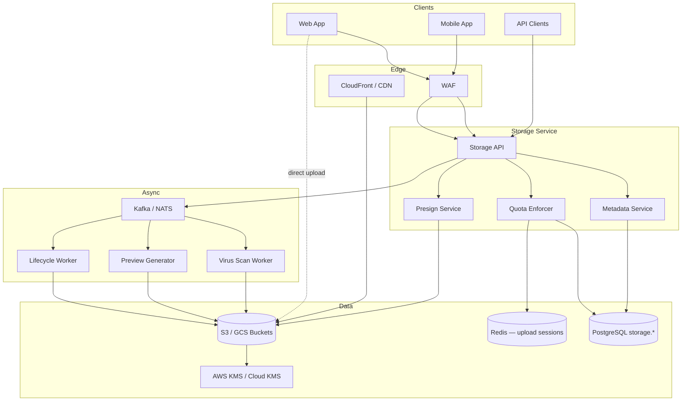
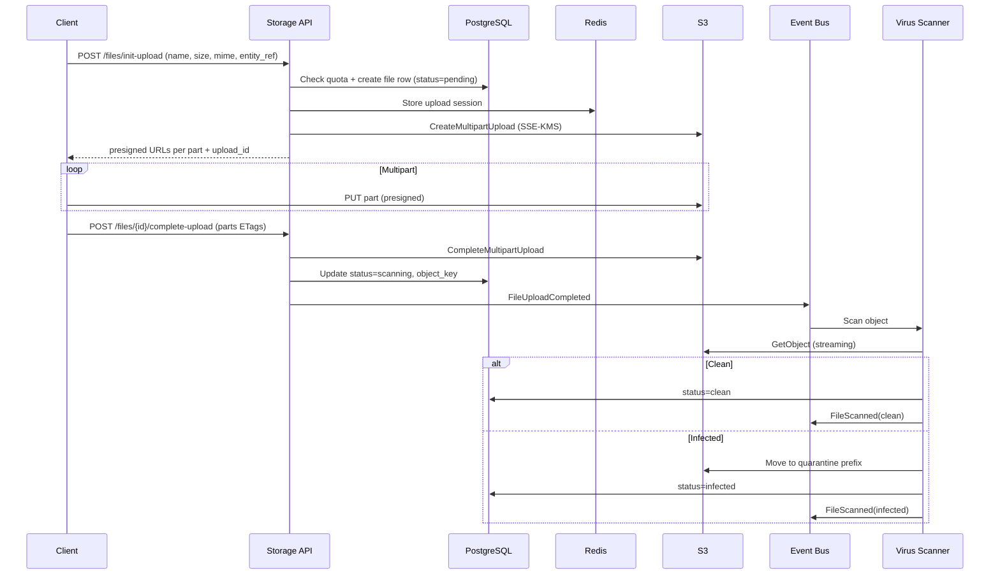
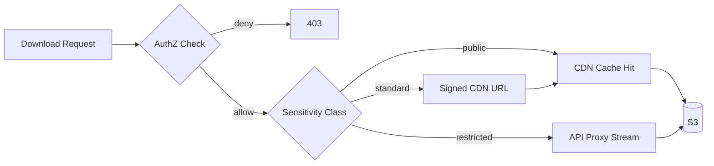
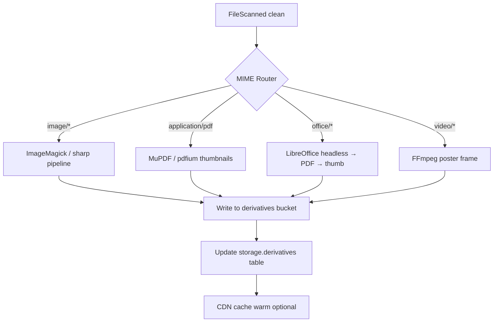
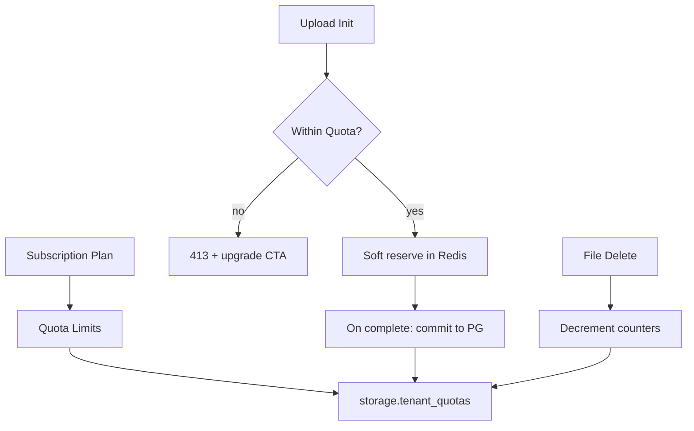

# Storage Architecture

## Purpose

Define the production architecture for Atlas BOS object storage: how binary assets (documents, attachments, exports, media, backups, integration payloads) are stored, secured, delivered, governed, and linked to business entities across millions of tenants at global scale.

This document establishes:

- Separation of **blob storage** (S3-compatible object store) from **file metadata** (PostgreSQL)
- Security controls including encryption at rest, virus scanning, and tenant isolation
- Delivery patterns via CDN and presigned URLs
- Operational policies for versioning, lifecycle, quotas, and disaster recovery alignment

## Scope

### In Scope

| Area | Coverage |
|------|----------|
| Object storage | AWS S3 primary; GCP Cloud Storage secondary via S3-compatible abstraction |
| Metadata | PostgreSQL `storage` schema; attachment polymorphic links to domain entities |
| Upload/download | Direct-to-S3 multipart upload, presigned URLs, server-mediated flows |
| Delivery | CloudFront / Cloud CDN, signed URLs, cache invalidation |
| Security | SSE-KMS, tenant-scoped KMS keys, ClamAV scanning, content-type validation |
| Governance | Per-tenant quotas, retention, legal hold, audit trail |
| Previews | Async thumbnail/PDF preview generation pipeline |
| Versioning | Object versioning, metadata version graph, soft delete |

### Out of Scope

- Full-text indexing of file contents (see [14-search.md](14-search.md))
- Email/message attachment ingestion UX (see [13-messaging.md](13-messaging.md))
- Backup/DR runbooks (see [25-disaster-recovery.md](25-disaster-recovery.md))
- Database row storage and BLOB columns (prohibited except ephemeral staging)

## Context

Atlas modules produce and consume files across CRM, ERP, HR, Documents, Support, Messaging, and Integrations. Storing blobs in PostgreSQL would break scale targets (billions of objects, multi-TB tenants). A dedicated object storage tier with rich metadata in PostgreSQL is the industry-standard pattern (Notion, Linear, Stripe, Shopify).

### Platform Constraints

```
┌──────────────────────────────────────────────────────────────────────────┐
│                         Atlas Storage Context                            │
├──────────────────────────────────────────────────────────────────────────┤
│  Tenancy        │ org_id on every metadata row; bucket prefix isolation │
│  AuthZ          │ ReBAC + object ACL derived from linked entity perms   │
│  Events         │ Kafka/NATS: FileUploaded, FileScanned, FileDeleted    │
│  Compliance     │ GDPR erasure, HIPAA BAA option, SOC 2 CC6/CC7         │
│  Multi-cloud    │ Abstraction layer; primary AWS, DR on GCP             │
└──────────────────────────────────────────────────────────────────────────┘
```

### Key Requirements

| Requirement | Target |
|-------------|--------|
| Durability | 99.999999999% (11 nines) via provider + cross-region replication |
| Upload latency (p95) | < 200ms to initiate presigned multipart session |
| Download via CDN (p95) | < 100ms TTFB for cached objects < 10MB |
| Scan SLA | 95% of uploads scanned within 60s |
| Tenant isolation | Zero cross-tenant object key collision or ACL leakage |
| Max object size | 5 TB (multipart); default soft limit 500 MB per upload without approval |

## Detailed Design

### High-Level Architecture



### Storage Topology

#### Bucket Strategy

| Bucket | Purpose | Versioning | Replication |
|--------|---------|------------|-------------|
| `atlas-prod-assets-{region}` | User uploads, attachments | Enabled | CRR to DR region |
| `atlas-prod-derivatives-{region}` | Thumbnails, previews, transcoded media | Enabled | CRR |
| `atlas-prod-exports-{region}` | Report/export artifacts (TTL) | Disabled | None (ephemeral) |
| `atlas-prod-integration-staging-{region}` | Connector inbound payloads | Disabled | None; 7-day lifecycle |
| `atlas-prod-system-{region}` | Platform templates, static assets | Enabled | Global |

#### Object Key Layout

```
s3://atlas-prod-assets-us-east-1/
  org/{org_id}/
    env/{environment}/          # prod | sandbox
    files/{file_id}/
      v/{version_number}/
        {content_hash}.{ext}
    quarantine/{file_id}/       # pre-scan staging
    trash/{file_id}/              # soft-deleted; lifecycle purge
```

**Design rationale:** `org_id` prefix enables IAM bucket policies with `s3:prefix` conditions. `file_id` is a UUIDv7 (time-sortable). Content-addressed `content_hash` deduplicates identical bytes within a version lineage.

### Metadata Model (PostgreSQL)

```sql
-- Conceptual schema (Phase 3 will fully normalize)

storage.files (
  id              UUID PRIMARY KEY,           -- UUIDv7
  org_id          UUID NOT NULL,
  bucket          TEXT NOT NULL,
  object_key      TEXT NOT NULL,
  content_hash    BYTEA NOT NULL,             -- SHA-256
  size_bytes      BIGINT NOT NULL,
  mime_type       TEXT NOT NULL,
  original_name   TEXT NOT NULL,
  status          TEXT NOT NULL,              -- pending | scanning | clean | infected | quarantined | deleted
  encryption_key_id TEXT NOT NULL,            -- KMS key ARN / version
  version_number  INT NOT NULL DEFAULT 1,
  is_latest       BOOLEAN NOT NULL DEFAULT true,
  parent_file_id  UUID,                       -- version chain
  created_by      UUID NOT NULL,
  created_at      TIMESTAMPTZ NOT NULL,
  deleted_at      TIMESTAMPTZ,
  retention_until TIMESTAMPTZ,
  legal_hold      BOOLEAN NOT NULL DEFAULT false
)

storage.attachments (
  id              UUID PRIMARY KEY,
  org_id          UUID NOT NULL,
  file_id         UUID NOT NULL REFERENCES storage.files(id),
  entity_type     TEXT NOT NULL,              -- invoice | contact | ticket | project | ...
  entity_id       UUID NOT NULL,
  attachment_role TEXT NOT NULL,              -- primary | supporting | signature | export
  display_order   INT,
  created_at      TIMESTAMPTZ NOT NULL,
  UNIQUE (org_id, file_id, entity_type, entity_id, attachment_role)
)

storage.upload_sessions (
  id              UUID PRIMARY KEY,
  org_id          UUID NOT NULL,
  file_id         UUID NOT NULL,
  multipart_upload_id TEXT,
  parts_completed JSONB,
  expires_at      TIMESTAMPTZ NOT NULL,
  max_size_bytes  BIGINT NOT NULL
)

storage.tenant_quotas (
  org_id          UUID PRIMARY KEY,
  max_storage_bytes BIGINT NOT NULL,
  max_file_count  BIGINT NOT NULL,
  max_single_upload_bytes BIGINT NOT NULL,
  used_storage_bytes BIGINT NOT NULL DEFAULT 0,
  used_file_count BIGINT NOT NULL DEFAULT 0,
  updated_at      TIMESTAMPTZ NOT NULL
)
```

Row-Level Security (RLS) enforces `org_id = current_setting('app.org_id')` on all tables.

### Upload Flow



#### Upload Validation Rules

| Check | When | Action on Failure |
|-------|------|-------------------|
| MIME sniffing vs declared type | Complete upload | Reject; status `rejected` |
| Magic byte validation | Complete upload | Reject executable masquerading |
| Extension blocklist | Init upload | `.exe`, `.bat`, `.scr`, etc. |
| Quota | Init upload | `413 QuotaExceeded` |
| AuthZ on entity | Init upload | `403` if user cannot attach to entity |

### Download & CDN Delivery

#### Delivery Modes

| Mode | Use Case | Mechanism |
|------|----------|-----------|
| Public CDN | Marketing assets, published knowledge base attachments | CloudFront with OAC; long TTL |
| Signed CDN URL | Authenticated user download | CloudFront signed URL/cookie; 15 min TTL |
| Presigned S3 URL | Large exports, API integrations | S3 presigned GET; 1–60 min TTL |
| Proxy stream | Highly sensitive (HR, legal) | Storage API streams bytes; no CDN |



#### Cache Headers

```
Cache-Control: private, max-age=3600
ETag: "{content_hash}"
X-Atlas-File-Id: {file_id}
X-Atlas-Org-Id: {org_id}   # stripped at edge for external responses
```

Invalidation triggered on: version supersede, permission revocation on entity, explicit purge API.

### Encryption at Rest (SSE-KMS)

| Layer | Implementation |
|-------|----------------|
| Object encryption | SSE-KMS with per-tenant CMK (enterprise) or shared CMK with encryption context `org_id` (standard) |
| Key hierarchy | Platform master → tenant CMK → per-object data keys (S3-managed) |
| Encryption context | `{ "org_id": "...", "file_id": "...", "environment": "prod" }` |
| Key rotation | Annual automatic CMK rotation; re-encryption not required for S3 SSE |
| Enterprise isolation | Dedicated CMK + optional dedicated bucket prefix IAM boundary |

**HIPAA-ready tenants:** Dedicated CMK, no shared CDN cache for restricted class, access logged to immutable audit store.

### Virus Scanning

| Component | Detail |
|-----------|--------|
| Engine | ClamAV (self-hosted workers) + optional cloud AV API for zero-day |
| Trigger | `FileUploadCompleted` event |
| Streaming | Scan from S3 without full download to disk; max 2GB in-memory window then spill |
| Infected handling | Move to `quarantine/` prefix; notify security + uploader; block attachment link activation |
| Retry | 3 attempts exponential backoff; DLQ after failure; file remains `scanning` with SLA alert |
| Bypass | None in production; sandbox orgs may opt into scan-after-access with admin ack |

### Versioning

**Object store:** S3 versioning enabled on asset buckets. Deletes create delete markers; lifecycle rules purge non-current versions after retention window.

**Metadata:** `parent_file_id` chain with `is_latest` flag. UI shows version history; restore creates new version copying S3 object reference or re-upload.

| Operation | Behavior |
|-----------|----------|
| New upload to same logical doc | New `files` row, increment version, prior `is_latest=false` |
| Restore v3 as current | Copy S3 version to new key OR retarget `is_latest` if content unchanged |
| Delete | Soft delete metadata; S3 delete marker; 30-day trash retention |

### Lifecycle Policies

| Policy | Rule | Action |
|--------|------|--------|
| Trash purge | `trash/` prefix, age > 30 days | Delete object + hard-delete metadata |
| Export TTL | `exports/` bucket, age > 7 days | Delete |
| Integration staging | `integration-staging/`, age > 7 days | Delete |
| Incomplete multipart | age > 7 days | AbortMultipartUpload (daily job) |
| Non-current versions | age > 90 days (configurable per org) | Transition to Glacier IR then delete |
| Orphan scan | metadata without attachment > 24h | Quarantine then delete |

Lifecycle worker consumes `FileDeleted`, `OrgOffboarded`, and scheduled cron events.

### Document Preview Generation



| Derivative | Sizes | Format |
|------------|-------|--------|
| Thumbnail | 64, 256, 512 px | WebP + JPEG fallback |
| Preview | max 2048 px | WebP / PNG |
| PDF preview | First 10 pages | PDF + per-page PNG |
| Status | `pending | ready | failed` | Retry 3x |

### Attachment Linking to Business Entities

Attachments use a **polymorphic association** pattern:

```
entity_type + entity_id → domain module validates existence
attachment_role → semantic meaning (invoice_pdf, contract_signed, profile_photo)
```

**Authorization flow:**

1. Resolve linked entity via domain service
2. Evaluate ReBAC: `user:alice` `can_view` `entity:invoice:123`
3. Grant download if `can_view`; grant upload if `can_edit` on entity
4. Cache authz decision in Redis 60s; invalidate on `PermissionChanged` event

**Cross-module rules:**

| Entity | Max attachments | Size limit override |
|--------|-----------------|---------------------|
| Contact profile photo | 1 primary | 5 MB |
| Invoice | 50 | 25 MB each |
| Support ticket | 100 | 50 MB each |
| Project workspace | Plan quota | Plan quota |

Domain modules emit `AttachmentLinked` / `AttachmentUnlinked` events for search indexing and audit.

### Quota Management



| Tier | Storage | Files | Max single upload |
|------|---------|-------|-------------------|
| Starter | 10 GB | 10,000 | 50 MB |
| Business | 500 GB | 500,000 | 500 MB |
| Enterprise | Custom | Custom | 5 GB (configurable) |

**Enforcement:** Atomic `UPDATE tenant_quotas SET used_storage_bytes = used_storage_bytes + $1 WHERE org_id = $2 AND used_storage_bytes + $1 <= max_storage_bytes RETURNING *`. Redis holds short-lived reservations to prevent race overshoot.

**Alerts:** 80%, 90%, 100% thresholds → notification + in-app banner (see [10-notifications.md](10-notifications.md)).

### Event Catalog

| Event | Payload Highlights | Consumers |
|-------|-------------------|-----------|
| `storage.file.upload_initiated` | file_id, org_id, size | Audit, metrics |
| `storage.file.upload_completed` | file_id, object_key | Virus scan, preview |
| `storage.file.scanned` | file_id, result | Notifications, domain modules |
| `storage.file.deleted` | file_id, hard_delete_at | Search, lifecycle, audit |
| `storage.quota.threshold_crossed` | org_id, percent | Notifications, billing |
| `storage.derivative.ready` | file_id, derivative_type | UI real-time update |

### Observability

| Metric | Type | Alert Threshold |
|--------|------|-----------------|
| `storage_upload_init_latency_ms` | Histogram p95 | > 500ms |
| `storage_scan_duration_ms` | Histogram p95 | > 120s |
| `storage_infected_files_total` | Counter | > 0 (security paging) |
| `storage_quota_rejections_total` | Counter by org | anomaly detection |
| `storage_s3_error_rate` | Rate | > 0.1% |
| `storage_cdn_cache_hit_ratio` | Gauge | < 85% |

Structured logs include `org_id`, `file_id`, `trace_id`; never log presigned URL secrets or KMS plaintext.

### Multi-Cloud Abstraction

```typescript
// Conceptual interface (Phase 5 API contract)
interface ObjectStore {
  createMultipartUpload(params: MultipartParams): Promise<MultipartSession>;
  presignPartUpload(session: MultipartSession, partNumber: number): Promise<PresignedUrl>;
  completeMultipartUpload(session: MultipartSession, parts: PartETag[]): Promise<ObjectRef>;
  getObject(ref: ObjectRef, range?: ByteRange): AsyncIterable<Uint8Array>;
  copyObject(src: ObjectRef, dest: ObjectRef): Promise<void>;
  deleteObject(ref: ObjectRef): Promise<void>;
  headObject(ref: ObjectRef): Promise<ObjectMetadata>;
}
```

Implementations: `AwsS3Store`, `GcpInteropStore` (S3-compatible HMAC). Feature flags per region select provider. Metadata always records `bucket`, `object_key`, `provider`.

### API Surface (Preview)

| Endpoint | Method | Description |
|----------|--------|-------------|
| `/v1/files/init-upload` | POST | Reserve quota, return presigned multipart |
| `/v1/files/{id}/complete-upload` | POST | Finalize upload, trigger scan |
| `/v1/files/{id}` | GET | Metadata + download URL |
| `/v1/files/{id}/download` | GET | Redirect to signed CDN URL |
| `/v1/files/{id}/versions` | GET | Version history |
| `/v1/files/{id}` | DELETE | Soft delete |
| `/v1/attachments` | POST | Link file to entity |
| `/v1/attachments` | GET | List by entity |
| `/v1/org/storage/quota` | GET | Usage vs limits |

## Alternatives Considered

### ADR-0042: Database BLOB Storage

**Rejected.** PostgreSQL BYTEA or large object storage does not meet durability, CDN integration, or cost targets at billions of objects. Would bloat backups and violate read/write path separation.

### ADR-0043: Per-Tenant Buckets

**Rejected for standard tiers.** Millions of buckets exceed AWS soft limits and complicate operations. Prefix isolation with IAM conditions scales better. **Accepted for enterprise dedicated** isolation add-on.

### ADR-0044: Client-Side Encryption Only

**Rejected as sole mechanism.** Prevents server-side preview, virus scan, and search extraction. Offered as **optional layer** for E2E encrypted document vault (enterprise).

### ADR-0045: Scan-Before-Store

**Rejected.** Would block upload throughput and increase data transfer costs. **Accepted pattern:** store in staging prefix → scan → promote to `files/` prefix on clean result.

### CDN vs Direct S3 Only

**CDN selected** for user-facing downloads. Direct S3 presigned for machine-to-machine and exports > 1GB where CDN timeout risk exists.

## Consequences

### Positive

- Clear separation enables independent scaling of metadata queries and blob I/O
- Direct-to-S3 uploads minimize Atlas API as bandwidth bottleneck
- Tenant quota enforcement protects platform economics and noisy-neighbor isolation
- Event-driven scan/preview pipelines scale horizontally
- SSE-KMS with encryption context supports compliance audits

### Negative / Trade-offs

- **Eventual consistency** between upload complete and `clean` status requires UI states ("Processing…")
- **Multipart complexity** increases client SDK burden; mobile must implement retry per part
- **ClamAV fleet** requires operational ownership vs managed AV SaaS cost
- **Cross-region replication** increases storage cost ~2x for asset buckets
- **Polymorphic attachments** require domain module cooperation; no orphan attachments allowed

### Risks & Mitigations

| Risk | Mitigation |
|------|------------|
| Presigned URL leakage | Short TTL, single-use option, IP binding (enterprise) |
| Quota race conditions | Redis reservation + atomic PG commit |
| KMS throttling | Request quota increase; caching data key where applicable |
| CDN cache poisoning | OAC, signed URLs, no user-controlled Cache-Control |
| Supply-chain malware | Scan + block macros in office docs optional policy |

## Open Questions

| ID | Question | Owner | Target Date |
|----|----------|-------|-------------|
| OQ-09-01 | Dedicated bucket vs prefix for regulated tenants — cost model? | Platform + Finance | Q3 2026 |
| OQ-09-02 | Customer-managed KMS (BYOK) — Phase 1 or enterprise Phase 2? | Security | Q3 2026 |
| OQ-09-03 | Global deduplication across orgs (hash-based) — legal/privacy implications? | Legal + Platform | Q4 2026 |
| OQ-09-04 | Video transcoding pipeline scope — in storage or separate media service? | Media WG | Q3 2026 |
| OQ-09-05 | Immutable WORM storage for SEC 17a-4 customers? | Compliance | Q4 2026 |
| OQ-09-06 | Max attachment count per entity — global cap vs per-module? | Product | Q3 2026 |

---

## References

- [05-database-architecture.md](05-database-architecture.md) — RLS, UUIDv7, migration strategy
- [08-authorization.md](08-authorization.md) — ReBAC evaluation for entity-linked files
- [10-notifications.md](10-notifications.md) — Quota and scan failure notifications
- [14-search.md](14-search.md) — Attachment metadata indexing
- [21-security.md](21-security.md) — Threat model, incident response
- AWS S3 Security Best Practices, OWASP File Upload Cheat Sheet