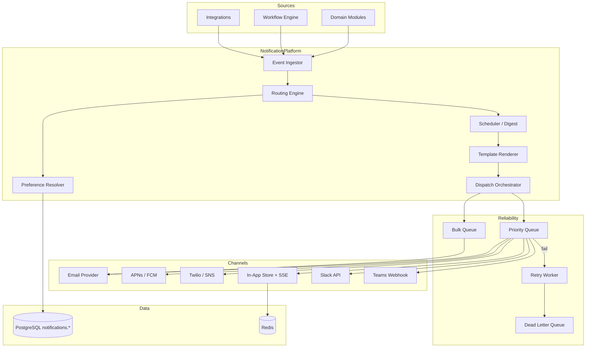
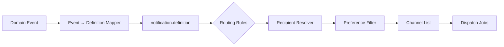
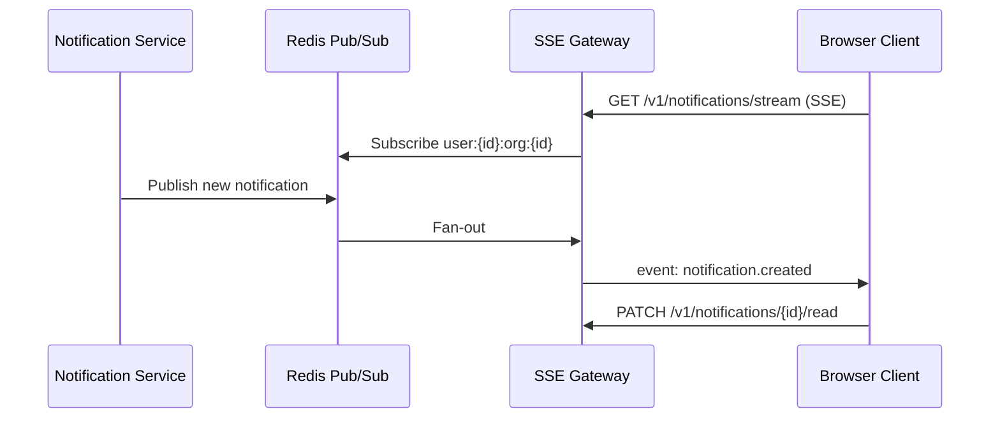
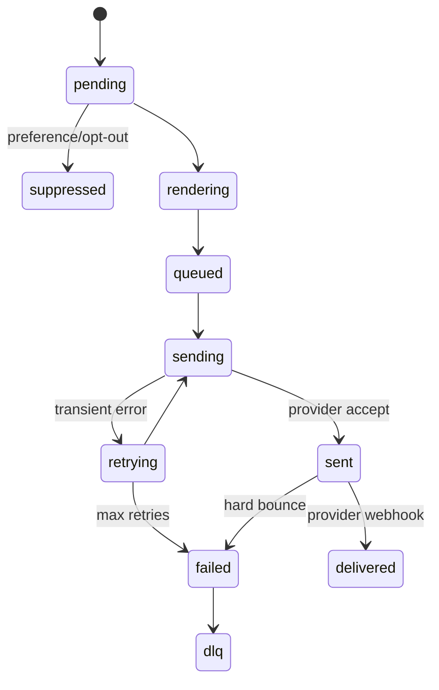

# Notifications Architecture

## Purpose

Define how Atlas BOS delivers timely, relevant, compliant notifications across all channels — without becoming a spam engine. The notification platform translates **domain events** and **user-facing activity** into personalized, preference-respecting messages delivered via email, push, SMS, in-app, Slack, and Microsoft Teams.

Goals:

- **Reliability:** At-least-once delivery with idempotent consumers; critical alerts never silently dropped
- **Respect:** User and org preferences, quiet hours, channel caps, lawful unsubscribe
- **Scale:** Hundreds of millions of recipients; billions of notifications/month
- **Observability:** End-to-end tracing from trigger → template render → provider → delivery/open/click

## Scope

### In Scope

| Area | Coverage |
|------|----------|
| Channels | Email, mobile push (APNs/FCM), SMS, in-app, Slack, Microsoft Teams |
| Preferences | Per-user, per-org defaults, per-notification-type matrix |
| Templates | Versioned templates with i18n, variable substitution, MJML/HTML |
| Routing | Rules engine mapping events → notification definitions → channels |
| Delivery | Queue-based dispatch, retries, DLQ, provider abstraction |
| Batching | Digest modes (hourly, daily, weekly) |
| Real-time in-app | SSE primary; WebSocket fallback for bidirectional features |
| Compliance | CAN-SPAM, GDPR, TCPA, one-click unsubscribe, audit trail |

### Out of Scope

- Marketing campaign automation (see [16-automation-engine.md](16-automation-engine.md))
- Internal team chat messages (see [13-messaging.md](13-messaging.md))
- Email mailbox hosting / full MTA operation (inbound parse covered in messaging doc)

## Context

Atlas modules emit hundreds of notification-worthy events: invoice overdue, deal stage change, task assigned, mention in comment, integration failure, payment succeeded. A centralized notification service prevents each module from integrating SendGrid, Twilio, and Slack independently — duplicating preference logic, compliance gaps, and inconsistent UX.

### Notification Taxonomy

```
┌─────────────────────────────────────────────────────────────────┐
│                    Notification Classes                          │
├─────────────────┬───────────────────────────────────────────────┤
│ Transactional   │ Password reset, payment receipt, legal notices │
│ Operational     │ Task assigned, approval required, @mention     │
│ Digest          │ Daily task summary, weekly pipeline report     │
│ Alert           │ Integration down, quota exceeded, security     │
│ Marketing       │ Product updates (opt-in only, separate stream) │
└─────────────────┴───────────────────────────────────────────────┘
```

### Integration Points

| System | Relationship |
|--------|--------------|
| Kafka/NATS | Inbound: domain events; Outbound: `NotificationDelivered`, `NotificationFailed` |
| PostgreSQL | Preferences, templates, delivery log, suppressions |
| Redis | Rate limits, digest buffers, SSE connection registry |
| Auth | User identity, locale, timezone |
| AuthZ | Who may notify whom (e.g., manager → report) |

## Detailed Design

### High-Level Architecture



### Core Data Model

```sql
notifications.definitions (
  id                TEXT PRIMARY KEY,         -- e.g. 'invoice.overdue'
  category          TEXT NOT NULL,            -- transactional | operational | digest | alert
  default_channels  TEXT[] NOT NULL,
  priority          INT NOT NULL,             -- 1=critical, 5=low
  digest_eligible   BOOLEAN NOT NULL,
  user_configurable BOOLEAN NOT NULL,
  legal_basis       TEXT,                     -- contract | legitimate_interest | consent
  created_at        TIMESTAMPTZ NOT NULL
)

notifications.user_preferences (
  user_id           UUID NOT NULL,
  org_id            UUID NOT NULL,
  definition_id     TEXT NOT NULL REFERENCES notifications.definitions(id),
  channel           TEXT NOT NULL,            -- email | push | sms | in_app | slack | teams
  enabled           BOOLEAN NOT NULL,
  digest_mode       TEXT,                     -- instant | hourly | daily | weekly | null
  PRIMARY KEY (user_id, org_id, definition_id, channel)
)

notifications.org_defaults (
  org_id            UUID NOT NULL,
  definition_id     TEXT NOT NULL,
  channel_overrides JSONB,                    -- force-enable alerts, disable marketing
  quiet_hours       JSONB,                    -- { start, end, timezone, channels[] }
  PRIMARY KEY (org_id, definition_id)
)

notifications.templates (
  id                UUID PRIMARY KEY,
  definition_id     TEXT NOT NULL,
  channel           TEXT NOT NULL,
  locale            TEXT NOT NULL,            -- BCP 47: en-US, de-DE
  version           INT NOT NULL,
  subject_template  TEXT,                     -- email/slack
  body_template     TEXT NOT NULL,            -- Handlebars / Liquid
  mjml_source       TEXT,                     -- email rich layout
  status            TEXT NOT NULL,            -- draft | active | deprecated
  UNIQUE (definition_id, channel, locale, version)
)

notifications.deliveries (
  id                UUID PRIMARY KEY,
  org_id            UUID NOT NULL,
  user_id           UUID NOT NULL,
  definition_id     TEXT NOT NULL,
  channel           TEXT NOT NULL,
  idempotency_key   TEXT NOT NULL UNIQUE,
  status            TEXT NOT NULL,            -- pending | sent | delivered | failed | suppressed
  provider_id       TEXT,
  provider_response JSONB,
  rendered_snapshot JSONB,                    -- immutable audit of what was sent
  created_at        TIMESTAMPTZ NOT NULL,
  sent_at           TIMESTAMPTZ,
  opened_at         TIMESTAMPTZ,
  clicked_at        TIMESTAMPTZ
)

notifications.suppressions (
  id                UUID PRIMARY KEY,
  scope             TEXT NOT NULL,            -- email | phone | user_id
  value             TEXT NOT NULL,
  reason            TEXT NOT NULL,            -- unsubscribe | bounce | complaint | admin
  created_at        TIMESTAMPTZ NOT NULL,
  UNIQUE (scope, value)
)
```

### Routing Rules Engine

Notifications are triggered by **notification intents** — either explicit API calls or mapped domain events.



#### Routing Rule Schema (YAML stored in DB)

```yaml
definition_id: task.assigned
triggers:
  - event_type: tasks.task.assigned
conditions:
  - field: payload.assignee_id
    operator: ne
    value: payload.actor_id          # don't notify self-assign
recipient_resolver:
  type: direct
  user_id_field: payload.assignee_id
channels:
  - channel: in_app
    priority: 1
  - channel: push
    priority: 2
    condition: user.has_mobile_device
  - channel: email
    priority: 3
    digest_eligible: true
rate_limit:
  per_user_per_hour: 30
  per_definition_per_day: 10
```

#### Recipient Resolution Types

| Type | Description | Example |
|------|-------------|---------|
| `direct` | Single user from payload field | Task assignee |
| `role` | All users with role in org | `billing_admin` for payment failure |
| `watchers` | Entity subscription list | Deal followers |
| `mention` | Parsed @user references | Comment mention |
| `escalation` | Time-based chain | Unread alert → manager after 4h |

### Template System & i18n

| Layer | Implementation |
|-------|----------------|
| Engine | Liquid templates (logic-less, sandboxed) |
| Email layout | MJML → responsive HTML; plain-text auto-generated |
| Variables | Typed schema per definition; validated before render |
| Locale resolution | `user.locale` → `org.default_locale` → `en-US` |
| Pluralization | ICU MessageFormat for count strings |
| Versioning | Active template per (definition, channel, locale); rollback supported |

**Example variables schema:**

```json
{
  "task.title": { "type": "string", "maxLength": 200 },
  "task.due_date": { "type": "date", "format": "localized" },
  "actor.name": { "type": "string" },
  "deep_link": { "type": "url", "required": true }
}
```

Rendered output stored in `deliveries.rendered_snapshot` for regulatory retention (7 years transactional).

### Channel Implementations

#### Email

| Aspect | Detail |
|--------|--------|
| Provider | SendGrid / AWS SES (multi-provider failover) |
| From address | `{org_slug}@notify.atlas.app` or custom domain (DKIM/SPF/DMARC verified) |
| Bounce handling | Webhook → auto-suppression + admin alert |
| Attachments | Linked via presigned URLs, not attached bytes (except receipts < 1MB) |
| List-Unsubscribe | RFC 8058 one-click header on marketing; transactional exempt |

#### Push (Mobile)

| Aspect | Detail |
|--------|--------|
| Providers | APNs (iOS), FCM (Android) |
| Device registry | `notifications.push_devices` with token rotation |
| Payload | Collapse key per thread; silent push for background sync only |
| Rich push | Image URL from CDN; action buttons for approve/reject |

#### SMS

| Aspect | Detail |
|--------|--------|
| Provider | Twilio primary; AWS SNS fallback |
| Consent | TCPA: explicit opt-in stored with timestamp + IP |
| Content | No marketing via SMS without double opt-in |
| Segments | Track multi-segment billing per org |

#### In-App (Real-Time)



| Feature | Implementation |
|---------|----------------|
| Transport | SSE primary (HTTP/2, auto-reconnect) |
| WebSocket | Available for typing/read-receipt parity with messaging |
| Connection registry | Redis: `sse:connections:{user_id}` with heartbeat |
| Fallback | Poll `GET /v1/notifications?since=cursor` every 60s |
| Badge count | Redis counter + PG reconciliation |

#### Slack / Microsoft Teams

| Aspect | Detail |
|--------|--------|
| Connection | OAuth per org workspace (see [11-integrations.md](11-integrations.md)) |
| Delivery | Slack `chat.postMessage`; Teams Incoming Webhook or Bot Framework |
| Threading | Group related notifications into thread by entity |
| Interactive | Block Kit / Adaptive Cards for approve buttons → callback to Atlas API |

### Delivery Guarantees & Retry

| Priority | Queue | Max Retries | Backoff | DLQ |
|----------|-------|-------------|---------|-----|
| Critical (P1) | `notifications.priority` | 8 | 5s → 1h | Yes + PagerDuty |
| Standard (P2–P3) | `notifications.standard` | 5 | 30s → 30m | Yes |
| Bulk/Digest (P4–P5) | `notifications.bulk` | 3 | 5m → 2h | Yes |

**Idempotency:** Every dispatch carries `idempotency_key = hash(definition_id, user_id, channel, source_event_id)`. Duplicate inserts return existing delivery row.

**Suppression checks (in order):**

1. Global suppression list (bounce/complaint)
2. User preference disabled
3. Org quiet hours (defer to queue with `deliver_after`)
4. Rate limit exceeded (defer or drop with metric `notification_rate_limited`)
5. Legal/marketing consent missing



### Digest & Batching

| Digest Type | Buffer Key | Flush Trigger |
|-------------|------------|---------------|
| Hourly | `digest:{user}:{hour}` | Cron + min 1 item |
| Daily | `digest:{user}:{date}` | User timezone 8am |
| Weekly | `digest:{user}:{week}` | Monday 8am local |

Digest aggregator:

1. Collect pending in-app/email-eligible notifications with `digest_mode != instant`
2. Merge by definition group (e.g., "5 tasks assigned to you")
3. Render `digest.daily` template with item array
4. Single delivery record with `digest_batch_id`

**Critical alerts bypass digest** (`digest_eligible=false` on definition).

### Unsubscribe & Compliance

| Regulation | Implementation |
|------------|----------------|
| CAN-SPAM | Physical address in footer; honor unsubscribe within 10 days |
| GDPR | Lawful basis recorded; marketing requires consent; export/delete includes delivery log |
| TCPA | SMS opt-in/out keywords; STOP → global phone suppression |
| CASL | Implied vs express consent flags per channel |

**Unsubscribe token:** Signed JWT `{ user_id, org_id, definition_id?, channel, exp }` — one-click without login.

**Audit:** All preference changes written to `audit.events` with actor, IP, user-agent.

### Notification API (Preview)

| Endpoint | Method | Description |
|----------|--------|-------------|
| `/v1/notifications` | GET | List in-app notifications (paginated) |
| `/v1/notifications/stream` | GET | SSE stream |
| `/v1/notifications/{id}/read` | PATCH | Mark read |
| `/v1/notifications/read-all` | POST | Bulk read |
| `/v1/notification-preferences` | GET/PUT | User preferences |
| `/v1/notification-preferences/org-defaults` | GET/PUT | Admin org defaults |
| `/v1/notifications/send` | POST | Internal: explicit send (service auth) |
| `/v1/unsubscribe` | GET/POST | Public unsubscribe handler |

### Observability & Analytics

| Metric | Purpose |
|--------|---------|
| `notification_dispatch_latency_ms` | Trigger → provider accept |
| `notification_delivery_rate` | By channel, definition |
| `notification_open_rate` | Email/push engagement |
| `notification_suppressed_total` | Preference vs bounce breakdown |
| `notification_dlq_depth` | Operational alert > 1000 |
| `sse_active_connections` | Capacity planning |

**Tracing:** OpenTelemetry span links from domain event `trace_id` through render and provider HTTP call.

### Security

| Threat | Control |
|--------|---------|
| Template injection | Liquid sandbox; no arbitrary code |
| SSRF in webhooks | Allowlist provider endpoints only |
| Enumeration via unsubscribe | Generic success message |
| Slack token theft | Encrypted at rest; scoped OAuth; rotate on disconnect |
| SMS pumping | Per-org SMS budget cap + anomaly detection |

## Alternatives Considered

### ADR-0050: Per-Module Notification Logic

**Rejected.** Duplicates provider integrations, inconsistent preference UX, compliance gaps. Central service mandatory.

### ADR-0051: WebSocket-Only for In-App

**Rejected.** SSE simpler for unidirectional push; survives corporate proxies better. WebSocket offered as opt-in for advanced clients.

### ADR-0052: Firebase as Sole Push Layer

**Rejected for iOS quality.** FCM alone adds latency vs native APNs. Dual-provider abstraction accepted.

### ADR-0053: Exactly-Once Delivery

**Rejected as global guarantee.** Providers offer at-least-once; idempotency keys + dedup on read achieve effective exactly-once UX.

### Third-Party Notification Platforms (Courier, Knock)

**Deferred.** Build core for control and cost at scale; evaluate overlay for rapid connector expansion in Phase 2.

## Consequences

### Positive

- Unified preference UX across all Atlas modules
- Compliance enforced once, audited centrally
- Provider failover and retry logic not replicated per team
- Digest mode reduces notification fatigue and email costs
- Real-time in-app via SSE scales with stateless gateway + Redis pub/sub

### Negative / Trade-offs

- **Central bottleneck risk** — mitigated by partitioned queues and horizontal dispatch workers
- **Routing rule complexity** — requires tooling and testing framework for rule changes
- **Template change latency** — i18n review process may slow marketing campaigns
- **Event schema coupling** — domain events must include fields needed for recipient resolution
- **SSE connection count** — millions of concurrent connections require dedicated gateway tier

### Operational Requirements

- 24/7 on-call for DLQ depth and provider outage
- Template preview/staging environment before production activation
- Quarterly compliance review of marketing consent flows

## Open Questions

| ID | Question | Owner | Target Date |
|----|----------|-------|-------------|
| OQ-10-01 | In-app notification retention period — 90d vs unlimited? | Product + Legal | Q3 2026 |
| OQ-10-02 | WhatsApp Business channel — Phase 1 or Phase 2? | Product | Q4 2026 |
| OQ-10-03 | Per-org custom SMTP relay for enterprise? | Platform | Q3 2026 |
| OQ-10-04 | AI-generated notification copy — guardrails and approval? | AI + Legal | Q4 2026 |
| OQ-10-05 | Cross-org notifications (portal users, external collaborators)? | AuthZ WG | Q3 2026 |
| OQ-10-06 | Notification sound/vibration preferences per device? | Mobile WG | Q3 2026 |

---

## References

- [06-api-architecture.md](06-api-architecture.md) — SSE conventions, idempotency headers
- [11-integrations.md](11-integrations.md) — Slack/Teams OAuth connections
- [13-messaging.md](13-messaging.md) — Overlap boundaries with chat
- [16-automation-engine.md](16-automation-engine.md) — Campaign automation
- CAN-SPAM Act, GDPR Art. 6/7, TCPA, RFC 8058