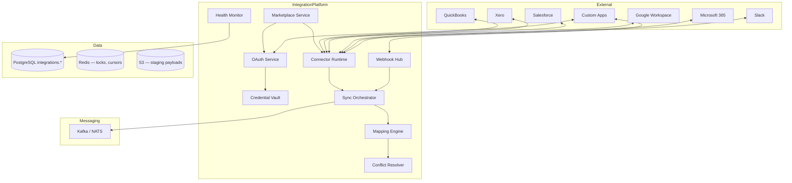
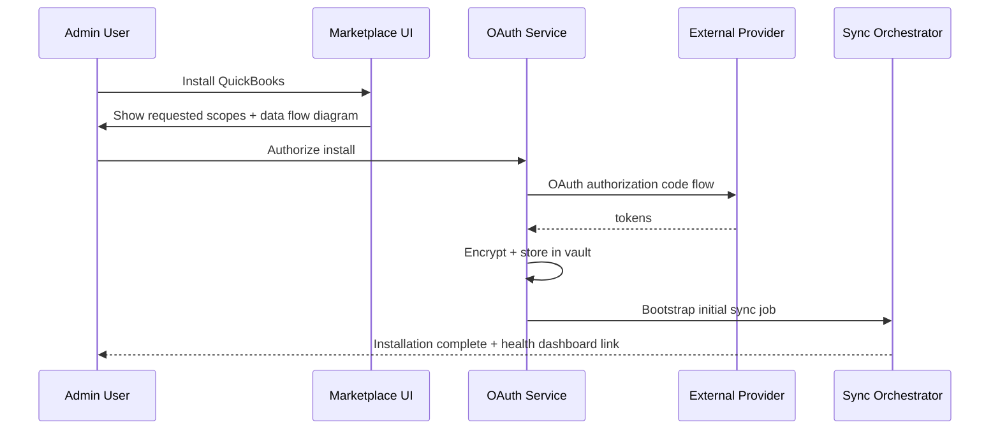
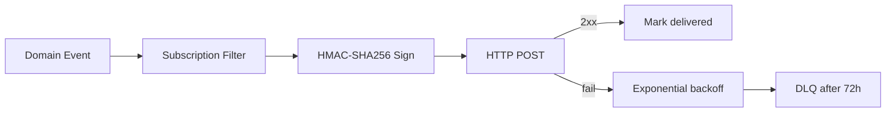
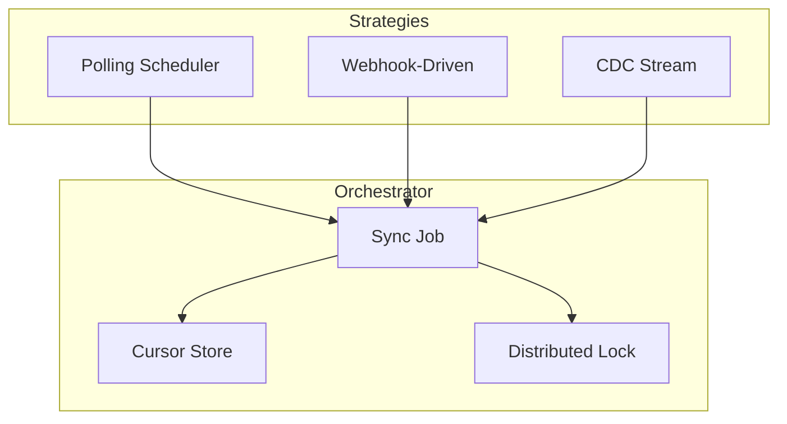

# Integrations Architecture

## Purpose

Define how Atlas BOS connects to external systems — accounting, CRM, productivity suites, communication tools, and custom applications — through a unified **Integration Platform** comprising a marketplace, OAuth application framework, webhook infrastructure, pre-built connectors, and robust sync engines.

The platform must enable:

- **Discoverability:** Curated marketplace with install flows and permission transparency
- **Security:** Least-privilege OAuth scopes, encrypted credential vault, webhook signature verification
- **Reliability:** Observable sync health, conflict resolution, and self-healing retries
- **Extensibility:** Third-party developers can build Atlas apps without forking core

## Scope

### In Scope

| Area | Coverage |
|------|----------|
| Marketplace | Catalog, install/uninstall, pricing tiers, reviews (Phase 2 UI) |
| OAuth framework | Atlas as IdP + Atlas as OAuth client to third parties |
| Webhooks | Outbound (Atlas → subscriber) and inbound (provider → Atlas) |
| Pre-built connectors | QuickBooks, Xero, Salesforce, Google Workspace, Microsoft 365, Slack |
| Sync strategies | Polling, webhooks, CDC (Change Data Capture) |
| Data mapping | Field mapping DSL, transformation pipelines |
| Conflict resolution | Last-write-wins, source-of-truth rules, manual queue |
| Health monitoring | Connection status, lag metrics, error dashboards |

### Out of Scope

- Building every possible SaaS connector (marketplace enables partners)
- ETL data warehouse pipelines (separate analytics ingestion)
- Payment provider internals (see [12-payments.md](12-payments.md))
- Full iPaaS visual workflow designer (see [16-automation-engine.md](16-automation-engine.md))

## Context

Businesses run Atlas alongside entrenched systems during migration and indefinitely for specialized tools. Without a first-class integration layer, customers revert to Zapier glue, CSV exports, and shadow IT — breaking the "single operating system" vision.

### Stakeholder Needs

| Stakeholder | Need |
|-------------|------|
| SMB user | One-click QuickBooks sync; no YAML |
| Enterprise admin | SSO, audit, data residency, revoke-all |
| Developer partner | OAuth apps, sandbox, webhooks, rate limits |
| Atlas modules | Publish domain events; consume external data via Integration API |
| Operations | Per-connector SLOs, incident runbooks |

### Platform Position

```
┌────────────────────────────────────────────────────────────────────┐
│                         Atlas Core Modules                          │
│   CRM │ ERP │ HR │ Projects │ Support │ Documents │ Messaging      │
└───────────────────────────────┬────────────────────────────────────┘
                                │ Domain Events + Integration API
┌───────────────────────────────▼────────────────────────────────────┐
│                    Integration Platform Layer                       │
│  Marketplace │ OAuth │ Credential Vault │ Sync Engine │ Webhooks   │
└───────────────────────────────┬────────────────────────────────────┘
                                │
        ┌───────────────────────┼───────────────────────┐
        ▼                       ▼                       ▼
   QuickBooks/Xero         Salesforce              Google/M365/Slack
```

## Detailed Design

### High-Level Architecture



### Integration Marketplace

#### Catalog Model

```sql
integrations.apps (
  id              UUID PRIMARY KEY,
  slug            TEXT UNIQUE NOT NULL,       -- quickbooks, salesforce
  publisher_id    UUID NOT NULL,              -- atlas | partner org
  name            TEXT NOT NULL,
  description     TEXT,
  categories      TEXT[] NOT NULL,
  logo_url        TEXT,
  install_count   BIGINT DEFAULT 0,
  status          TEXT NOT NULL,              -- draft | published | deprecated
  pricing_model   TEXT NOT NULL,              -- free | included | paid_add_on
  created_at      TIMESTAMPTZ NOT NULL
)

integrations.app_versions (
  id              UUID PRIMARY KEY,
  app_id          UUID NOT NULL REFERENCES integrations.apps(id),
  version         TEXT NOT NULL,
  manifest        JSONB NOT NULL,             -- scopes, webhooks, sync entities
  min_atlas_version TEXT,
  status          TEXT NOT NULL,
  UNIQUE (app_id, version)
)

integrations.installations (
  id              UUID PRIMARY KEY,
  org_id          UUID NOT NULL,
  app_id          UUID NOT NULL,
  app_version_id  UUID NOT NULL,
  status          TEXT NOT NULL,              -- active | paused | error | uninstalled
  config          JSONB NOT NULL,             -- user mappings, sync direction
  installed_by    UUID NOT NULL,
  installed_at    TIMESTAMPTZ NOT NULL,
  UNIQUE (org_id, app_id)
)
```

#### Install Flow



### OAuth Application Framework

Atlas operates in **two OAuth roles:**

| Role | Purpose |
|------|---------|
| **OAuth Client** | Atlas connects to QuickBooks, Salesforce, etc. |
| **OAuth Provider** | Third-party apps access Atlas API on behalf of users |

#### Atlas as OAuth Provider

| Component | Standard |
|-----------|----------|
| Protocol | OAuth 2.1 + PKCE mandatory for public clients |
| Tokens | JWT access tokens (15 min) + refresh tokens (rotating) |
| Scopes | Fine-grained: `contacts:read`, `invoices:write`, `webhooks:manage` |
| Consent | Per-org admin approval for org-wide apps; per-user for personal |
| Dynamic registration | Disabled in prod; partner portal for app registration |

```yaml
# Example third-party app manifest
app:
  name: "Acme Analytics"
  redirect_uris:
    - https://app.acme.com/oauth/callback
  scopes:
    - contacts:read
    - deals:read
    - events:subscribe
  webhooks:
    - event: deal.stage_changed
      url: https://app.acme.com/hooks/atlas
```

#### Atlas as OAuth Client (Connector Auth)

| Pattern | Connectors |
|---------|------------|
| Authorization Code + PKCE | Salesforce, Xero, QuickBooks Online, Google, Microsoft |
| Bot Token / App Token | Slack (workspace install) |
| Service Account | Google Workspace domain-wide delegation (enterprise) |

**Token refresh:** Background worker refreshes tokens at 80% TTL; on failure → installation `status=error` + notification.

### Credential Vault

| Requirement | Implementation |
|-------------|----------------|
| Encryption | AES-256-GCM envelope encryption; master key in KMS |
| Access | Connector runtime service account only; break-glass audit |
| Storage | `integrations.credentials` — ciphertext + metadata never plaintext |
| Rotation | Support token rotation without reinstall |
| Deletion | Uninstall wipes credentials within 24h (GDPR) |

```
credential_id → KMS.Decrypt → ephemeral memory → HTTP call → zeroize
```

### Webhook Subscriptions

#### Outbound (Atlas → Subscribers)



| Field | Detail |
|-------|--------|
| Signature header | `X-Atlas-Signature: t={ts},v1={hmac}` |
| Payload | CloudEvents 1.0 envelope |
| Retry | 8 attempts over 72 hours |
| Idempotency | `event_id` in payload; subscribers must dedupe |

```json
{
  "specversion": "1.0",
  "id": "550e8400-e29b-41d4-a716-446655440000",
  "source": "atlas://crm/deals",
  "type": "atlas.deal.stage_changed",
  "time": "2026-06-30T12:00:00Z",
  "datacontenttype": "application/json",
  "data": {
    "org_id": "...",
    "deal_id": "...",
    "from_stage": "qualified",
    "to_stage": "proposal"
  }
}
```

#### Inbound (Providers → Atlas)

| Provider | Verification |
|----------|--------------|
| Stripe | Signing secret (payments module) |
| Salesforce | HMAC on outbound message |
| Slack | Signing secret + timestamp tolerance |
| QuickBooks | Intuit webhook verifier token |
| Generic | Per-installation shared secret |

Webhook ingress → API Gateway → `WebhookHub` → normalize to internal event → Sync Orchestrator.

### Pre-Built Connectors

| Connector | Primary Entities | Default Direction | Auth |
|-----------|------------------|-------------------|------|
| **QuickBooks Online** | Customers, Invoices, Payments, Items, Accounts | Bi-directional | OAuth 2.0 |
| **Xero** | Contacts, Invoices, Bills, Bank Transactions | Bi-directional | OAuth 2.0 |
| **Salesforce** | Accounts, Contacts, Opportunities, Leads | Bi-directional | OAuth 2.0 |
| **Google Workspace** | Calendar, Contacts, Drive files (metadata) | Inbound + actions | OAuth 2.0 / SA |
| **Microsoft 365** | Calendar, Contacts, OneDrive metadata, Teams | Inbound + actions | OAuth 2.0 |
| **Slack** | Channels, users, messages (notifications) | Outbound + inbound events | OAuth bot scope |

Each connector is a **plugin** implementing:

```typescript
interface ConnectorPlugin {
  id: string;
  supportedEntities: EntityType[];
  authorize(ctx: InstallContext): Promise<CredentialHandle>;
  fetchDelta(ctx: SyncContext, cursor: Cursor): Promise<DeltaBatch>;
  pushChanges(ctx: SyncContext, records: AtlasRecord[]): Promise<PushResult>;
  handleWebhook(ctx: InstallContext, payload: unknown): Promise<WebhookAction>;
  healthCheck(ctx: InstallContext): Promise<HealthStatus>;
}
```

### Sync Strategies



| Strategy | When Used | Cursor | Lag Target |
|----------|-----------|--------|------------|
| **Polling** | No webhook support; fallback | `updated_since` timestamp / page token | < 15 min |
| **Webhooks** | Real-time capable providers | Event sequence + reconciliation poll | < 1 min |
| **CDC** | Salesforce Streaming API, DB connectors (future) | Replay ID / LSN | < 30 sec |

#### Sync Job Lifecycle

```
scheduled/triggered → acquire lock(installation_id, entity_type)
  → fetch delta → map → conflict resolve → apply to Atlas
  → emit integration.sync.completed → release lock
```

**Distributed lock:** Redis `SET integration:lock:{installation}:{entity} NX EX 3600` prevents concurrent syncs.

#### Initial Sync (Bootstrap)

1. Full export paginated from external system
2. Stage raw payloads in S3 (`integration-staging` bucket)
3. Transform in batches of 500 records
4. Progress UI: `% complete, ETA, errors`
5. Switch to incremental mode on completion

### Data Mapping

#### Mapping Configuration

```yaml
installation_id: ...
entity: contact
direction: bidirectional
external_type: Customer          # QuickBooks
field_mappings:
  - atlas: first_name
    external: GivenName
    transform: trim
  - atlas: email
    external: PrimaryEmailAddr.Address
    transform: lowercase
  - atlas: external_ids.quickbooks
    external: Id
    transform: passthrough
filters:
  - external: Active
    operator: eq
    value: true
sync_mode: incremental
conflict_policy: atlas_wins_except_fields  # see conflict section
```

#### Transformation Pipeline

```
Raw External Record
  → Schema validation
  → Field mapping (Mapping Engine)
  → Type coercion + enum lookup tables
  → Atlas canonical model
  → Domain module validator
  → Persist + emit integration.record.synced
```

**Lookup tables:** Org-configurable maps (e.g., Salesforce `StageName` → Atlas `deal_stage` enum).

### Conflict Resolution

| Policy | Description | Use Case |
|--------|-------------|----------|
| `atlas_wins` | Atlas version pushed to external on next sync | Atlas as system of record |
| `external_wins` | External overwrites Atlas | Migration import phase |
| `last_write_wins` | Compare `updated_at` with clock skew tolerance ±5s | Contacts |
| `field_level` | Per-field source of truth | Invoice amount from QB; notes from Atlas |
| `manual_queue` | Conflicts → `integrations.conflicts` for user resolution | Opportunities |

```sql
integrations.conflicts (
  id              UUID PRIMARY KEY,
  installation_id UUID NOT NULL,
  entity_type     TEXT NOT NULL,
  atlas_record_id UUID,
  external_id     TEXT,
  atlas_snapshot  JSONB NOT NULL,
  external_snapshot JSONB NOT NULL,
  conflicting_fields TEXT[] NOT NULL,
  status          TEXT NOT NULL,            -- open | resolved_atlas | resolved_external | merged
  created_at      TIMESTAMPTZ NOT NULL,
  resolved_by     UUID,
  resolved_at     TIMESTAMPTZ
)
```

**Merge UI:** Side-by-side diff; user picks per field; resolution template saved for future auto-resolve.

### Integration Health Monitoring

```mermaid
flowchart TB
    HC[Health Check Cron] --> PROBE[Connector healthCheck()]
    PROBE --> STATUS[Update installation health]
    SYNC[Sync Jobs] --> METRICS[Emit lag + error metrics]
    METRICS --> DASH[Health Dashboard]
    STATUS --> DASH
    DASH --> ALERT[PagerDuty / Notifications]
```

| Health State | Criteria | User Action |
|--------------|----------|-------------|
| `healthy` | Last sync < SLA; token valid; error rate < 1% | None |
| `degraded` | Lag 2× SLA or error rate 1–10% | Banner + email admin |
| `unhealthy` | Auth failure or lag > 24h | Pause sync; require reconnect |
| `disconnected` | User revoked OAuth | Re-authorize CTA |

| Metric | Alert |
|--------|-------|
| `integration_sync_lag_seconds` | p95 > SLA per connector |
| `integration_auth_refresh_failures` | > 0 in 1h |
| `integration_conflict_queue_depth` | > 100 per org |
| `integration_webhook_delivery_fail_rate` | > 5% |

### Rate Limiting & Fair Use

| Layer | Limit |
|-------|-------|
| Per installation | Provider API quota respect + Atlas scheduler throttle |
| Per org | 10 concurrent sync jobs default |
| Per connector global | Token bucket to prevent Atlas IP ban |
| Third-party Atlas API | Standard API rate limits apply |

### Security & Compliance

| Control | Detail |
|---------|---------|
| Scope minimization | Install UI shows exact data accessed |
| Admin audit | All install/uninstall/mapping changes logged |
| Data residency | EU installations route through EU connector workers |
| SOC 2 | Change management for connector code deployments |
| Secret scanning | CI blocks credentials in connector plugins |

### Event Catalog

| Event | Consumers |
|-------|-----------|
| `integration.installation.created` | Billing, audit |
| `integration.sync.started` | Metrics |
| `integration.sync.completed` | Health, notifications |
| `integration.sync.failed` | Alerts, retry scheduler |
| `integration.conflict.opened` | In-app notification |
| `integration.credential.expired` | Admin alert |

## Alternatives Considered

### ADR-0060: Zapier as Primary Integration Layer

**Rejected for core connectors.** Adds cost, latency, and data leaves Atlas trust boundary. Zapier export offered as **marketplace app** for long-tail.

### ADR-0061: Point-to-Point Module Integrations

**Rejected.** Each module calling QuickBooks independently creates mapping drift and credential sprawl.

### ADR-0062: Real-Time Only (No Polling)

**Rejected.** Many accounting APIs lack reliable webhooks; polling fallback mandatory.

### ADR-0063: External Wins Default Conflict Policy

**Rejected.** Atlas as BOS must default to Atlas-sovereign with explicit migration modes.

### iPaaS Acquisition (Workato, Tray.io)

**Deferred.** Build unified platform first; evaluate for enterprise segment if build velocity insufficient.

## Consequences

### Positive

- Single credential and mapping management reduces security surface
- Marketplace enables partner ecosystem and recurring revenue
- Normalized sync engine accelerates new connector development
- Health dashboard reduces support tickets for "sync broken"
- CloudEvents webhook standard improves developer experience

### Negative / Trade-offs

- **Connector maintenance burden** — external APIs change; dedicated team required
- **Mapping UI complexity** — non-technical users need templates and wizards
- **Conflict resolution UX** — manual queue can grow if policies misconfigured
- **Latency** — bi-directional sync never true real-time for all entities
- **Staging storage costs** — bootstrap syncs generate large S3 footprint

### Dependencies Created

- Domain modules must expose stable canonical models for sync
- Credential vault becomes critical path — DR priority tier 1
- Legal review per connector Data Processing Agreement

## Open Questions

| ID | Question | Owner | Target Date |
|----|----------|-------|-------------|
| OQ-11-01 | Partner revenue share model for paid marketplace apps? | Business | Q3 2026 |
| OQ-11-02 | HubSpot connector — Phase 1 or fast-follow? | Product | Q3 2026 |
| OQ-11-03 | Two-way calendar sync conflict — meeting ownership rules? | Product | Q3 2026 |
| OQ-11-04 | Salesforce CPQ / custom objects — generic sync framework? | Integrations | Q4 2026 |
| OQ-11-05 | Customer-hosted connector agents for on-prem ERP? | Enterprise | Q4 2026 |
| OQ-11-06 | GraphQL subscription vs webhook for Atlas OAuth apps? | API WG | Q3 2026 |

---

## References

- [06-api-architecture.md](06-api-architecture.md) — OAuth provider, rate limits, CloudEvents
- [07-authentication.md](07-authentication.md) — User/org identity for consent
- [09-storage.md](09-storage.md) — Integration staging bucket
- [10-notifications.md](10-notifications.md) — Sync failure alerts
- [12-payments.md](12-payments.md) — Stripe webhook overlap boundary
- [16-automation-engine.md](16-automation-engine.md) — User-defined automation vs connectors
- OAuth 2.1, CloudEvents 1.0, QuickBooks/Xero/Salesforce API documentation