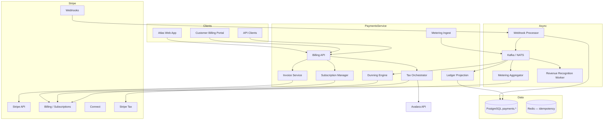
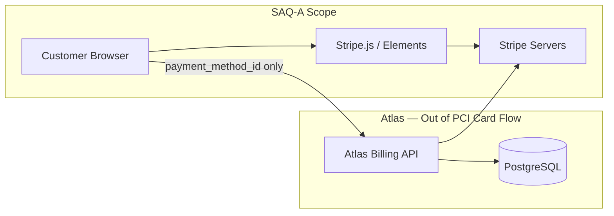
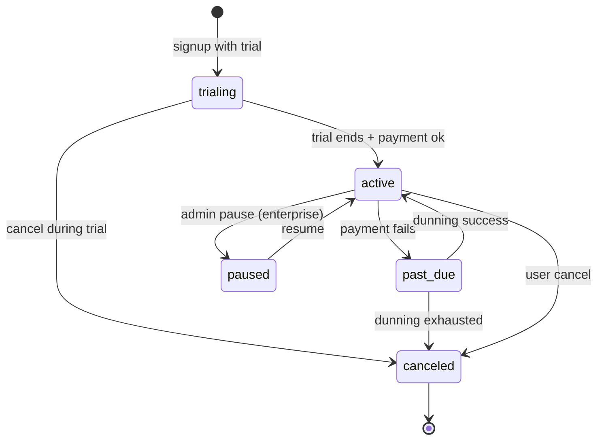
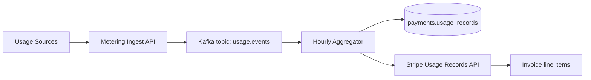
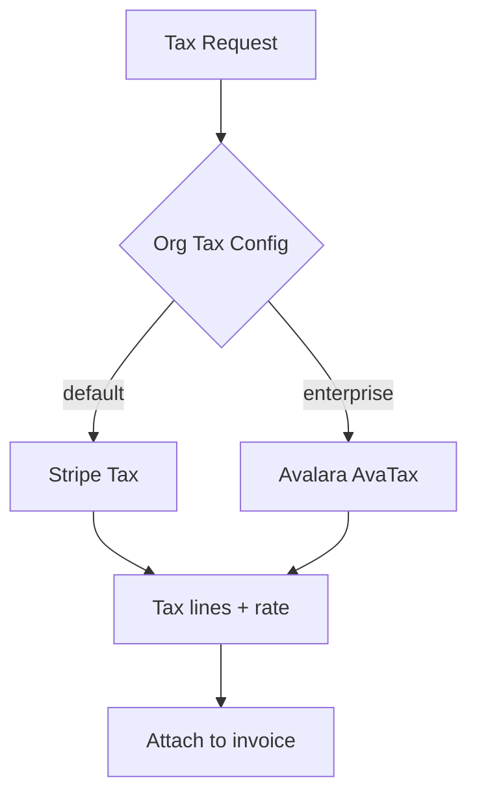
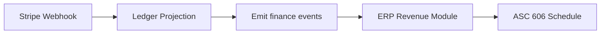

# Payments Architecture

## Purpose

Define how Atlas BOS handles money: **subscription billing** for Atlas platform access, **payment processing** for tenant commerce (invoicing customers, collecting payments), and **usage-based metering** — all built on Stripe as the primary payment service provider (PSP) while minimizing PCI scope and supporting global multi-currency operations.

This document covers:

- Stripe integration patterns (Connect, Billing, Invoicing, Tax)
- Subscription lifecycle, plan changes, proration
- Usage metering pipeline and aggregation
- Tax calculation, dunning, refunds
- Revenue recognition hooks for finance modules
- PCI DSS scope minimization strategy

## Scope

### In Scope

| Area | Coverage |
|------|----------|
| Platform billing | Atlas SaaS subscriptions (tenant pays Atlas) |
| Tenant commerce | Tenant invoices *their* customers via Atlas Invoicing module |
| PSP | Stripe (primary); abstraction for future PSPs |
| Payment methods | Cards, ACH, SEPA, wallets (Apple/Google Pay) |
| Subscriptions | Plans, trials, upgrades, cancellations, proration |
| Metering | API calls, storage, seats, AI tokens |
| Tax | Stripe Tax default; Avalara for enterprise complex nexus |
| Dunning | Failed payment retry + grace periods |
| Refunds | Full/partial via Stripe; ledger sync |
| Multi-currency | Presentment + settlement currency handling |
| Compliance | PCI SAQ-A, SCA/3DS, PSD2 |

### Out of Scope

- General ledger / full ERP accounting (ERP module consumes hooks)
- Payroll disbursements
- Cryptocurrency payments
- Atlas marketplace revenue share disbursement (Phase 2 finance)

## Context

Atlas operates two distinct payment planes:

```
┌─────────────────────────────────────────────────────────────────────┐
│  Plane A: Platform Billing (Atlas ← Tenant Organization)            │
│  Subscriptions, usage overages, add-ons, Atlas invoices             │
├─────────────────────────────────────────────────────────────────────┤
│  Plane B: Tenant Commerce (Tenant ← Tenant's Customers)             │
│  Optional Stripe Connect; tenant branded invoices & payments        │
└─────────────────────────────────────────────────────────────────────┘
```

### Regulatory & Compliance Landscape

| Requirement | Approach |
|-------------|----------|
| PCI DSS | SAQ-A: Stripe Elements/Checkout; no card data touches Atlas servers |
| SCA (EU) | Stripe 3DS2 automatic; exemption handling for MIT |
| Sales tax / VAT | Stripe Tax; Avalara override for enterprise |
| Revenue recognition | ASC 606 hooks → ERP module |
| SOC 2 | Change control on payment service; audit all money mutations |

### Scale Targets

| Dimension | Target |
|-----------|--------|
| Platform subscriptions | Millions of orgs |
| Payment volume (tenant commerce) | $100B+ cumulative GMV lifetime |
| Webhook throughput | 50k events/min peak |
| Metering events | 1B+ usage records/month |

## Detailed Design

### High-Level Architecture



### Stripe Integration Model

#### Account Structure

| Stripe Object | Atlas Mapping |
|---------------|---------------|
| Stripe Account (platform) | Atlas platform merchant |
| Stripe Customer | `org_id` for Plane A; `contact_id` for Plane B |
| Stripe Subscription | `payments.subscriptions` |
| Stripe Price / Product | `payments.plans` catalog |
| Connect Account | Tenant's connected account for Plane B |
| PaymentIntent | One-time charges, invoice payments |

#### API Interaction Principles

| Principle | Implementation |
|-----------|----------------|
| Idempotency | `Idempotency-Key` header on all mutating Stripe calls |
| Webhook as source of truth | API response initiates; webhook confirms final state |
| Outbox pattern | Local DB transaction + `payments.outbox` → async Stripe call |
| Version pinning | Stripe API version locked per deployment; upgrade playbook |

### PCI Scope Minimization



| Rule | Enforcement |
|------|-------------|
| No PAN/CVC storage | Prohibited in code review + DLP scanning |
| No PAN in logs | Structured logging redaction rules |
| Token only | Atlas stores `pm_xxx`, `cus_xxx`, `sub_xxx` Stripe IDs |
| Checkout | Stripe Checkout or Payment Element embedded |
| Connect | Connected accounts; Atlas never touches tenant customer PAN |

**Annual:** SAQ-A attestation, ASV scan on Atlas infrastructure (not card flow).

### Platform Billing (Plane A)

#### Subscription Plans

```sql
payments.plans (
  id              UUID PRIMARY KEY,
  stripe_product_id TEXT NOT NULL,
  stripe_price_id   TEXT NOT NULL,
  code            TEXT UNIQUE NOT NULL,       -- starter_monthly
  name            TEXT NOT NULL,
  tier            TEXT NOT NULL,              -- starter | business | enterprise
  billing_interval TEXT NOT NULL,             -- month | year
  base_amount_cents BIGINT NOT NULL,
  currency        TEXT NOT NULL DEFAULT 'usd',
  included_seats  INT NOT NULL,
  metadata        JSONB,
  active          BOOLEAN NOT NULL
)

payments.subscriptions (
  id              UUID PRIMARY KEY,
  org_id          UUID NOT NULL UNIQUE,
  stripe_subscription_id TEXT UNIQUE,
  stripe_customer_id TEXT NOT NULL,
  plan_id         UUID NOT NULL REFERENCES payments.plans(id),
  status          TEXT NOT NULL,              -- trialing | active | past_due | canceled | paused
  current_period_start TIMESTAMPTZ,
  current_period_end TIMESTAMPTZ,
  trial_end       TIMESTAMPTZ,
  cancel_at_period_end BOOLEAN NOT NULL,
  created_at      TIMESTAMPTZ NOT NULL
)
```

#### Subscription Lifecycle



| Operation | Stripe API | Atlas Behavior |
|-----------|------------|----------------|
| Create | `subscriptions.create` | 14-day trial default; entitlements activated |
| Upgrade | `subscriptions.update` + proration | Immediate feature unlock |
| Downgrade | `subscriptions.update` at period end | Schedule change; notify user |
| Cancel | `cancel_at_period_end` or immediate | Entitlement wind-down per policy |
| Reactivate | New subscription if within 30d | Restore data from soft-delete |

### Usage-Based Metering



#### Metered Dimensions

| Dimension | Event Source | Aggregation | Stripe Meter |
|-----------|--------------|-------------|--------------|
| Seats | HR / IAM active users | Max daily active | `seat_usage` |
| Storage | Storage quota service | GB-hours | `storage_gb_hours` |
| API calls | API Gateway | Count per org | `api_requests` |
| AI tokens | AI Agent System | Token count | `ai_tokens` |
| SMS sent | Notifications | Count | `sms_segments` |

```json
{
  "org_id": "org_abc",
  "meter": "api_requests",
  "quantity": 1,
  "timestamp": "2026-06-30T12:00:00Z",
  "idempotency_key": "req_xyz"
}
```

**Aggregation window:** Hourly rollups; Stripe submission daily for previous day (configurable). Late events within 72h backfill window.

### Tenant Commerce (Plane B) — Stripe Connect

| Model | Use Case |
|-------|----------|
| **Connect Express** | SMB tenants; Stripe-hosted onboarding |
| **Connect Custom** | Enterprise white-label; Atlas hosts onboarding UI |

```
Tenant creates invoice in Atlas ERP
  → Invoice Service creates Stripe Invoice on connected account
  → Customer pays via hosted invoice page
  → Application fee (optional platform fee) to Atlas
  → Webhook → Atlas marks invoice paid
```

**Funds flow:** Direct charge on connected account; Atlas `application_fee_amount` for marketplace take rate (future).

### Invoicing

| Invoice Type | Owner | Delivery |
|--------------|-------|----------|
| Atlas platform invoice | Plane A | Email + billing portal |
| Tenant customer invoice | Plane B | Email + PDF + payment link |

**PDF generation:** Atlas renders branded PDF → storage service; Stripe hosts payment page.

**Invoice states:** `draft → open → paid | void | uncollectible`

### Multi-Currency

| Concept | Handling |
|---------|----------|
| Presentment | Customer sees local currency where supported |
| Settlement | Org `default_currency` in Stripe Customer |
| FX | Stripe-converted amounts; Atlas stores `amount_cents` + `currency` + `exchange_rate` snapshot |
| Reporting | ERP module normalizes to org reporting currency (daily ECB/Stripe rates) |

**Locked exchange rate** on invoice issuance; payments must match invoice currency or Stripe handles conversion with disclosure.

### Tax Calculation



| Scenario | Provider |
|----------|----------|
| Atlas platform subscriptions | Stripe Tax (Atlas nexus registration) |
| US tenant invoices | Stripe Tax on Connect or Avalara if configured |
| EU VAT B2B reverse charge | VAT ID validation (VIES) + zero-rate |
| Digital services MOSS | Stripe Tax automatic |

**Tax IDs:** `org.tax_ids` table; validated at checkout; stored on Stripe Customer.

### Dunning

| Stage | Timing | Action |
|-------|--------|--------|
| 1 | Payment fail (day 0) | Stripe Smart Retries + email notification |
| 2 | Day 3 | Second email; in-app banner |
| 3 | Day 7 | `past_due`; restrict non-critical features |
| 4 | Day 14 | Final notice; read-only mode |
| 5 | Day 30 | Cancel subscription; data retention per policy |

```sql
payments.dunning_attempts (
  id              UUID PRIMARY KEY,
  subscription_id UUID NOT NULL,
  attempt_number  INT NOT NULL,
  stripe_invoice_id TEXT,
  status          TEXT NOT NULL,
  next_retry_at   TIMESTAMPTZ,
  created_at      TIMESTAMPTZ NOT NULL
)
```

**Smart Retries:** Stripe Billing automatic; Atlas overlays grace entitlements decoupled from Stripe retry schedule.

### Payment Methods

| Method | Plane A | Plane B | Notes |
|--------|---------|---------|-------|
| Card | ✓ | ✓ | 3DS when required |
| ACH Direct Debit | ✓ | ✓ | US only; micro-deposit verification |
| SEPA | ✓ | ✓ | EU; mandate collection |
| Apple/Google Pay | ✓ | ✓ | Via Stripe Payment Element |
| Wire (enterprise) | Manual | Manual | Invoice `open`; manual mark paid |

**Default PM:** First successful payment method; updatable in billing portal via Stripe Customer Portal (embedded).

### Refunds

| Type | Flow |
|------|------|
| Full refund | `refunds.create` on PaymentIntent; credit note in Atlas |
| Partial | Amount specified; invoice line adjustment |
| Subscription | Prorated credit via Stripe Credit Notes |

**Policy:** Refund permission requires `billing:refund` role; > $1000 needs manager approval (workflow engine).

**Ledger:** `payments.transactions` append-only; refund never deletes original row.

### Revenue Recognition Hooks



| Event | Finance Event | Data |
|-------|---------------|------|
| `invoice.paid` | `finance.revenue.recognized` | Amount, period, product code |
| `invoice.finalized` | `finance.deferred_revenue.created` | For annual subscriptions |
| `credit_note.created` | `finance.revenue.adjusted` | Contra revenue |
| Daily job | `finance.deferred_revenue.amortized` | 1/365 × annual prepay |

**Performance obligation mapping:** Plan metadata includes `asc606_category`, `recognition_pattern` (`ratable`, `point_in_time`).

### Webhook Processing

| Stripe Event | Handler |
|--------------|---------|
| `customer.subscription.updated` | Sync subscription status |
| `invoice.paid` | Activate entitlements, send receipt |
| `invoice.payment_failed` | Trigger dunning stage 1 |
| `payment_intent.succeeded` | Mark invoice paid (Plane B) |
| `charge.refunded` | Update transaction, notify |
| `customer.subscription.deleted` | Deprovision per policy |

**Security:** Verify `Stripe-Signature`; tolerance 300s; store raw payload in `payments.webhook_events` before processing.

**Idempotency:** `stripe_event_id` unique constraint; replay-safe handlers.

### Entitlements Integration

Subscription status drives feature flags:

```
active/trialing → full plan entitlements
past_due → grace entitlements (configurable)
canceled → read-only + export window 90d
```

Entitlement service subscribes to `payments.subscription.status_changed` on Kafka.

### API Surface (Preview)

| Endpoint | Description |
|----------|-------------|
| `POST /v1/billing/checkout-session` | Start subscription checkout |
| `GET /v1/billing/subscription` | Current plan + usage |
| `POST /v1/billing/subscription/change-plan` | Upgrade/downgrade |
| `GET /v1/billing/invoices` | Platform invoice history |
| `POST /v1/billing/portal-session` | Stripe Customer Portal |
| `POST /v1/commerce/invoices` | Tenant creates customer invoice |
| `POST /v1/commerce/invoices/{id}/send` | Send + payment link |
| `POST /v1/metering/usage` | Internal usage ingest |
| `POST /v1/billing/refunds` | Initiate refund (authz) |

### Observability

| Metric | Alert |
|--------|-------|
| `payment_webhook_lag_seconds` | > 60s |
| `payment_dunning_active_orgs` | Anomaly +20% week-over-week |
| `payment_stripe_api_error_rate` | > 0.5% |
| `metering_event_drop_rate` | > 0.01% |
| `payment_revenue_daily` | Business dashboard (not paged) |

## Alternatives Considered

### ADR-0070: Multi-PSP at Launch

**Rejected.** Stripe covers global cards, subscriptions, Connect, tax. Abstraction layer built; second PSP (Adyen) evaluated at $1B GMV.

### ADR-0071: Self-Hosted Billing Engine

**Rejected.** PCI, SCA, global tax, and dunning complexity prohibitive. Stripe Billing is industry standard.

### ADR-0072: Avalara-Only Tax

**Rejected for SMB.** Avalara enterprise upsell; Stripe Tax default reduces onboarding friction.

### ADR-0073: Store Card Tokens in Atlas Vault

**Rejected.** Violates PCI scope minimization. Stripe Customer PM only.

### Usage Billing via Custom Invoices Only

**Rejected.** Stripe metered billing integrates with subscription lifecycle and proration natively.

## Consequences

### Positive

- SAQ-A PCI scope dramatically reduces audit burden
- Stripe Connect enables tenant commerce without Atlas money transmitter status
- Event-driven ledger projection keeps finance module decoupled
- Metering pipeline scales independently on Kafka
- Stripe Tax accelerates global launch

### Negative / Trade-offs

- **Stripe dependency** — outage impacts all billing; status page monitoring + graceful degradation
- **Webhook complexity** — ordering, retries, idempotency require disciplined engineering
- **Connect fees** — tenant commerce economics include Stripe fees; pricing must account
- **Metering lag** — hourly aggregation means usage overages not real-time on invoice
- **Multi-plane mental model** — support and docs must clearly separate Plane A vs B

### Financial Controls

- Dual approval for production Stripe API key rotation
- Daily reconciliation job: Stripe balance transactions ↔ `payments.transactions`
- Monthly finance sign-off on revenue recognition export

## Open Questions

| ID | Question | Owner | Target Date |
|----|----------|-------|-------------|
| OQ-12-01 | Atlas as merchant of record for tenant commerce? | Legal + Finance | Q3 2026 |
| OQ-12-02 | Annual contract invoicing outside Stripe for enterprise? | Finance | Q3 2026 |
| OQ-12-03 | Crypto/stablecoin payments — any demand? | Product | Q4 2026 |
| OQ-12-04 | Usage metering real-time vs daily for AI tokens billing UX? | Product + Eng | Q3 2026 |
| OQ-12-05 | Purchase orders / net-30 for enterprise without Stripe Invoice? | Finance | Q4 2026 |
| OQ-12-06 | Stripe Treasury for Atlas Connect payouts? | Finance | Q4 2026 |

---

## References

- [05-database-architecture.md](05-database-architecture.md) — Ledger tables, immutability
- [08-authorization.md](08-authorization.md) — `billing:*` permissions
- [10-notifications.md](10-notifications.md) — Dunning emails, receipt delivery
- [11-integrations.md](11-integrations.md) — Stripe webhook ingress boundary
- [15-workflow-engine.md](15-workflow-engine.md) — Refund approval workflows
- PCI DSS SAQ-A, ASC 606, PSD2 SCA, Stripe API documentation