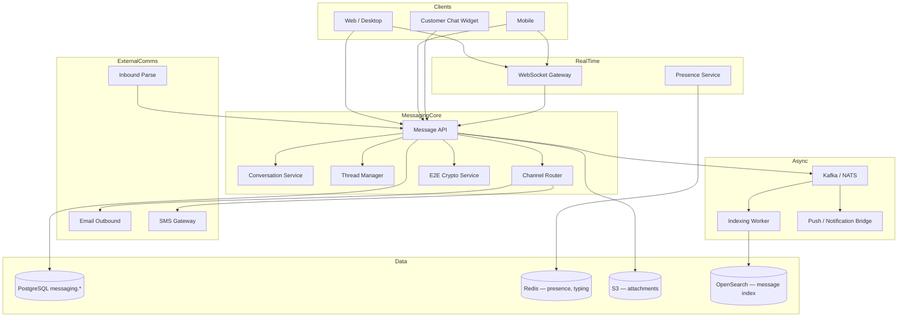
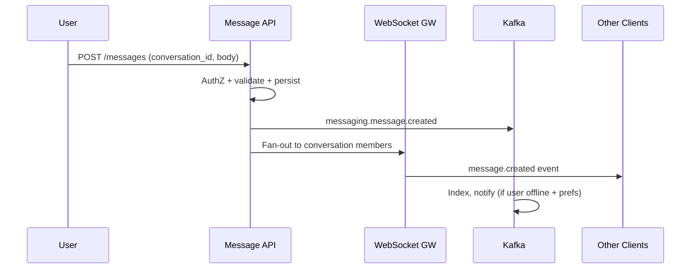
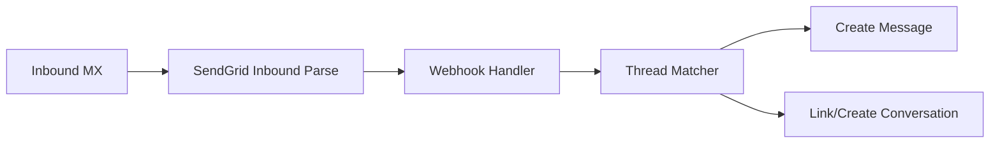
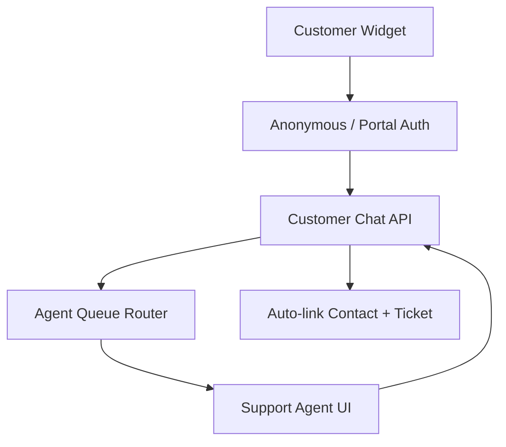
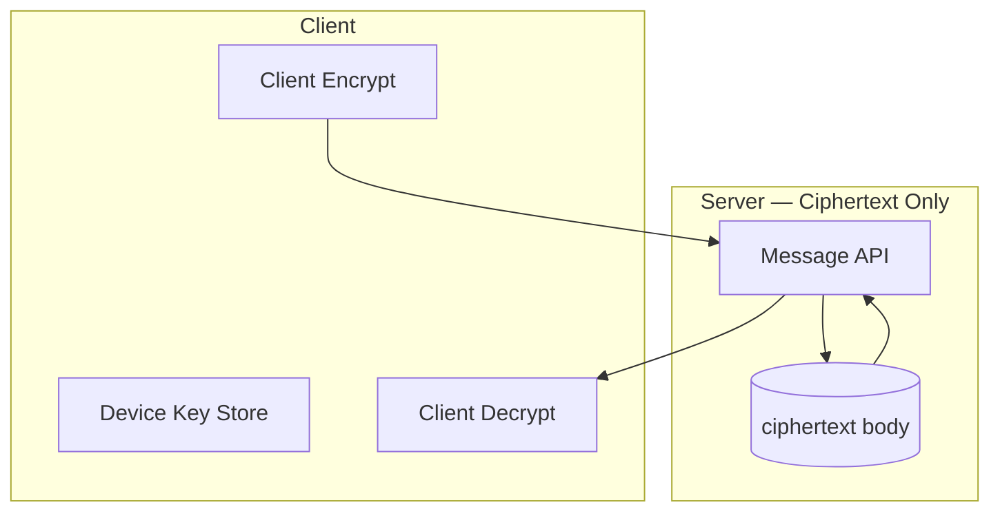

# Messaging Architecture

## Purpose

Define the unified messaging platform for Atlas BOS: **internal team collaboration** (channels, DMs, threads), **external communications** (email, SMS, customer-facing chat), and **contextual threading** linked to CRM and operational entities — enabling the AI business brain to reason over conversations with the same authority as structured data.

Design goals:

- **Unified inbox:** Users see team chat, customer emails, and SMS in coherent views filtered by context
- **Entity-linked context:** Every conversation can anchor to contacts, deals, tickets, projects
- **Real-time UX:** Sub-second delivery, typing indicators, read receipts
- **Security tiering:** Standard TLS + E2E encryption for designated sensitive channels
- **Searchability:** Permission-aware full-text search (see [14-search.md](14-search.md))

## Scope

### In Scope

| Area | Coverage |
|------|----------|
| Internal messaging | Public/private channels, DMs, group DMs, threads |
| Email | Send via Atlas; receive via inbound parse; threading |
| SMS | Outbound via notification providers; inbound webhook |
| Customer chat | Widget, portal chat, agent assignment |
| Entity linking | Polymorphic `conversation.entity_ref` |
| E2E encryption | Sensitive channels (legal, HR, executive) |
| Real-time | WebSocket gateway, presence, typing, read receipts |
| Message search | Index pipeline integration |
| Attachments | Via storage service |

### Out of Scope

- Video/voice calls (future Meetings module)
- Full MTA infrastructure (relay via SendGrid/SES)
- Social media DMs (integrations marketplace)
- Notification-only toasts (see [10-notifications.md](10-notifications.md))

## Context

Atlas replaces Slack + Intercom + shared inbox tools. Fragmented messaging prevents AI from answering "what did we promise this customer?" The messaging service is a **first-class domain** with its own aggregates, not a thin wrapper over third-party chat.

### Message Classes

```
┌────────────────────────────────────────────────────────────────────┐
│                     Atlas Messaging Planes                          │
├──────────────────┬─────────────────────────────────────────────────┤
│ Internal         │ Team channels, DMs — org members only           │
│ External         │ Email/SMS/chat with customers, vendors, partners│
│ System           │ Bot messages, workflow posts — automated        │
│ Encrypted        │ E2E channels — server-blind ciphertext        │
└──────────────────┴─────────────────────────────────────────────────┘
```

### Differentiation from Notifications

| Aspect | Messaging | Notifications |
|--------|-----------|---------------|
| Direction | Bi-directional conversations | Primarily outbound alerts |
| Persistence | Thread history, searchable | Delivery log + in-app feed |
| User intent | User composes messages | System triggers delivery |
| Transport | WebSocket + email/SMS | Email/push/SMS/in-app |

## Detailed Design

### High-Level Architecture



### Conversation Model

```sql
messaging.conversations (
  id              UUID PRIMARY KEY,
  org_id          UUID NOT NULL,
  type            TEXT NOT NULL,              -- channel | dm | group_dm | email_thread | sms_thread | customer_chat
  name            TEXT,                       -- channel name; null for DM
  visibility      TEXT NOT NULL,              -- public | private | direct | external
  encryption_mode TEXT NOT NULL DEFAULT 'none', -- none | e2e
  entity_type     TEXT,                       -- contact | deal | ticket | project
  entity_id       UUID,
  metadata        JSONB,                      -- email subject, external thread ids
  created_by      UUID NOT NULL,
  created_at      TIMESTAMPTZ NOT NULL,
  archived_at     TIMESTAMPTZ
)

messaging.conversation_members (
  conversation_id UUID NOT NULL,
  participant_type TEXT NOT NULL,             -- user | contact | bot | external_email
  participant_id  UUID NOT NULL,
  role            TEXT NOT NULL,              -- owner | member | guest | agent
  joined_at       TIMESTAMPTZ NOT NULL,
  last_read_at    TIMESTAMPTZ,
  notification_level TEXT NOT NULL,           -- all | mentions | mute
  PRIMARY KEY (conversation_id, participant_type, participant_id)
)

messaging.messages (
  id              UUID PRIMARY KEY,
  org_id          UUID NOT NULL,
  conversation_id UUID NOT NULL,
  parent_message_id UUID,                     -- thread parent; null = top-level
  sender_type     TEXT NOT NULL,
  sender_id       UUID NOT NULL,
  body_format     TEXT NOT NULL,              -- plain | markdown | rich | ciphertext
  body            TEXT NOT NULL,              -- encrypted payload if e2e
  body_preview    TEXT,                       -- server-generated for e2e (optional client hint)
  attachments     UUID[],                     -- storage.file ids
  metadata        JSONB,                      -- email headers, sms sid
  edited_at       TIMESTAMPTZ,
  deleted_at      TIMESTAMPTZ,
  created_at      TIMESTAMPTZ NOT NULL
)

messaging.message_receipts (
  message_id      UUID NOT NULL,
  participant_type TEXT NOT NULL,
  participant_id  UUID NOT NULL,
  delivered_at    TIMESTAMPTZ,
  read_at         TIMESTAMPTZ,
  PRIMARY KEY (message_id, participant_type, participant_id)
)
```

### Internal Team Messaging

#### Channel Types

| Type | Visibility | Discovery |
|------|------------|-----------|
| Public channel | All org members | Browse + join |
| Private channel | Invited members | Invite only |
| DM | 2 participants | Start by user picker |
| Group DM | 3–9 participants | Same as DM |

#### Threading Model

```
Conversation (channel)
  ├── Message A (top-level)
  │     ├── Reply A1 (thread)
  │     └── Reply A2 (thread)
  └── Message B (top-level)
```

- `parent_message_id` set → reply in thread
- Thread depth max 1 (no nested threads) — Slack/Teams pattern
- Thread replies increment `reply_count` on parent (denormalized)



### Real-Time Layer

| Feature | Implementation |
|---------|----------------|
| Transport | WebSocket (RFC 6455); sticky sessions via load balancer |
| Protocol | JSON events: `message.created`, `typing.start`, `receipt.read` |
| Presence | Redis `presence:{org_id}:{user_id}` TTL 90s; heartbeat every 30s |
| Typing | Redis `typing:{conversation_id}` with 5s TTL; debounced broadcast |
| Reconnection | Client resumes from `last_message_id`; gap fill via REST |
| Scale | 1M concurrent connections per region; horizontal gateway pods |

**SSE fallback:** Read-only message stream for restrictive networks (no typing/receipts).

### Read Receipts & Delivery States

| State | Meaning | When |
|-------|---------|------|
| `sent` | Persisted in DB | Always |
| `delivered` | Recipient client ACK | WebSocket recv |
| `read` | User viewed | Scroll into view / thread open |

**Privacy:** Org setting to disable read receipts for DMs.

### Email Integration

#### Outbound

```
User composes in Atlas UI (linked to contact/deal)
  → Message API creates message row (type=email_thread)
  → Email Outbound renders MIME (HTML + plain)
  → SendGrid/SES with Message-ID header
  → Store external_message_id for threading
```

| Header | Purpose |
|--------|---------|
| `Message-ID` | `<{uuid}@mail.atlas.app>` |
| `In-Reply-To` | Parent email Message-ID |
| `References` | Full thread chain |
| `X-Atlas-Conversation-Id` | Internal routing |

#### Inbound



**Thread matching order:**

1. `In-Reply-To` / `References` → existing `external_message_id`
2. `X-Atlas-Conversation-Id` header
3. Plus-address `reply+{conversation_id}@org.atlas.app`
4. No match → new `email_thread` conversation; AI suggests entity link

**Spam/phishing:** SPF/DKIM/DMARC validation; quarantine suspicious; never auto-execute links.

### SMS

| Direction | Path |
|-----------|------|
| Outbound | Message API → SMS Gateway (Twilio) → `metadata.twilio_sid` |
| Inbound | Twilio webhook → normalize phone → find/create `sms_thread` with contact |

**Consent:** SMS only to contacts with `sms_opt_in=true` (TCPA).

**Segment limits:** 1600 chars max; auto-split with segment count in metadata.

### Customer-Facing Chat



| Feature | Detail |
|---------|--------|
| Widget | JS snippet; org-branded; pre-chat form |
| Identity | Anonymous session → portal login → contact merge |
| Routing | Round-robin, skills-based, business hours |
| Ticket creation | Auto-create support ticket on first message |
| SLA | First response timer; breach → notification |

### Entity Linking (CRM Integration)

```yaml
conversation:
  id: conv_123
  entity_ref:
    type: deal
    id: deal_456
  linked_by: user_789
  linked_at: 2026-06-30T12:00:00Z
```

| Rule | Behavior |
|------|----------|
| Manual link | User attaches conversation to entity |
| Auto link | Inbound email matches contact email → suggest deal |
| Unlink | Preserves messages; removes entity_ref |
| AuthZ | Must `can_view` entity to link; conversation inherits entity visibility boost |
| AI context | Agent queries include linked entity data |

**Timeline view:** CRM entity page shows unified activity feed: messages + notes + tasks.

### End-to-End Encryption (Sensitive Channels)



| Aspect | Implementation |
|--------|----------------|
| Protocol | Signal Protocol (Double Ratchet) via libsignal |
| Key distribution | X3DH key agreement; pre-keys uploaded to server (public only) |
| Channel flag | `encryption_mode=e2e` immutable after first message |
| Server role | Route ciphertext; store public keys; **cannot decrypt** |
| Search | Client-side index or metadata-only server search (title, timestamps) |
| Multi-device | Per-device keys; sender encrypts for each recipient device |
| Recovery | No server recovery; org admin can disable channel, not read history |

**Trade-off:** E2E channels excluded from AI training and server-side full-text search unless user opts into encrypted search proxy (future).

### Message Search

Server indexes `body` for non-E2E messages:

```
messaging.message.created → Indexing Worker → OpenSearch messaging index
```

Permission filter: user must be `conversation_member` at index time and query time (see [14-search.md](14-search.md)).

| Search Feature | Support |
|----------------|---------|
| Full-text | ✓ non-E2E |
| Filters | conversation, sender, date, has:attachment, entity:deal:123 |
| Highlights | Snippet with match offsets |

### Attachments

1. Client uploads via storage service (presigned)
2. Message references `attachments: [file_id, ...]`
3. Virus scan gate before message send (block if infected)
4. Inline images: markdown `` resolved at render

### Bots & System Messages

| Bot Type | Capabilities |
|----------|--------------|
| Workflow bot | Post status updates; no read of E2E |
| AI agent bot | `@atlas` mentions; tool use on non-E2E channels |
| Integration bot | Slack-style incoming webhook (scoped) |

Bots are `participant_type=bot` with explicit OAuth scopes.

### Notification Bridge

Message created → check member `notification_level` + presence:

- Offline + not muted → [10-notifications.md](10-notifications.md) `message.mention` or `message.dm`
- `@channel` / `@here` → expanded recipient set with rate limit

**No duplicate:** In-app notification deep-links to conversation; not a second copy of body.

### API Surface (Preview)

| Endpoint | Description |
|----------|-------------|
| `GET/POST /v1/conversations` | List/create conversations |
| `GET/POST /v1/conversations/{id}/messages` | Message history / send |
| `GET /v1/conversations/{id}/thread/{parent_id}` | Thread replies |
| `WS /v1/messaging/connect` | Real-time events |
| `POST /v1/conversations/{id}/link` | Link entity |
| `POST /v1/conversations/{id}/read` | Update last_read_at |
| `GET /v1/messaging/search` | Search messages |
| `POST /v1/e2e/keys` | Upload pre-keys |
| `POST /v1/customer-chat/sessions` | Widget session start |

### Observability

| Metric | Target |
|--------|--------|
| `messaging_message_delivery_latency_ms` | p95 < 500ms internal |
| `messaging_ws_connections_active` | Capacity dashboard |
| `messaging_email_inbound_lag_seconds` | p95 < 30s |
| `messaging_e2e_key_upload_failures` | Alert > 0 |

### Data Retention

| Conversation Type | Default Retention |
|-------------------|-------------------|
| Internal channels | Indefinite (org configurable) |
| Customer chat | 7 years (configurable) |
| SMS | 3 years |
| E2E | Until manual delete; no server backup of plaintext |

GDPR erasure: delete messages + anonymize sender in external threads where legal allows.

## Alternatives Considered

### ADR-0080: Embed Slack/Teams as Primary Internal Chat

**Rejected.** External dependency breaks AI context, search unity, and entity linking. Slack/Teams remain **integration targets** for notifications.

### ADR-0081: Matrix Protocol for E2E

**Deferred.** Signal Protocol better mobile SDK support; Matrix evaluated for federated chat (enterprise).

### ADR-0082: Server-Side Search on E2E Channels

**Rejected by default.** Violates E2E promise. Client-side search optional.

### ADR-0083: Separate Microservice per Channel Type

**Rejected.** Shared conversation model reduces duplication; single Message API with type discriminator.

### XMPP/MQTT for Real-Time

**Rejected.** WebSocket + Redis pub/sub standard for browser SaaS; simpler ops.

## Consequences

### Positive

- Unified conversation model spans internal and external comms
- Entity linking makes messaging actionable within CRM/workflows
- E2E tier satisfies legal/HR without burdening all channels
- Event-driven indexing enables global search
- WebSocket gateway scales independently

### Negative / Trade-offs

- **Email deliverability** — Atlas must manage domain reputation, SPF/DKIM
- **E2E limitations** — no server-side AI on encrypted content
- **Operational complexity** — inbound parse + thread matching edge cases
- **WebSocket state** — sticky sessions complicate K8s autoscaling
- **Customer chat** requires 24/7 agent queue infrastructure for enterprise SLAs

## Open Questions

| ID | Question | Owner | Target Date |
|----|----------|-------|-------------|
| OQ-13-01 | Federated chat with external Slack/Teams users — scope? | Product | Q4 2026 |
| OQ-13-02 | Voice message support — storage + transcription? | Mobile WG | Q4 2026 |
| OQ-13-03 | WhatsApp Business API as messaging channel? | Product | Q4 2026 |
| OQ-13-04 | Max channel membership count — 10k vs unlimited? | Platform | Q3 2026 |
| OQ-13-05 | AI auto-reply in customer chat — guardrails? | AI + Support | Q3 2026 |
| OQ-13-06 | Message export for legal hold — E2E channels? | Legal | Q4 2026 |

---

## References

- [09-storage.md](09-storage.md) — Message attachments
- [10-notifications.md](10-notifications.md) — Mention/digest notifications
- [14-search.md](14-search.md) — Permission-aware message indexing
- [17-ai-agent-system.md](17-ai-agent-system.md) — `@atlas` bot integration
- Signal Protocol specification, RFC 5322 (email threading)