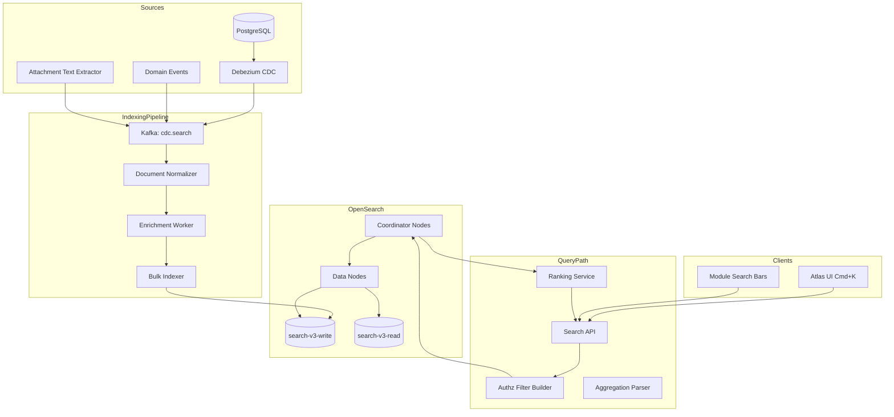
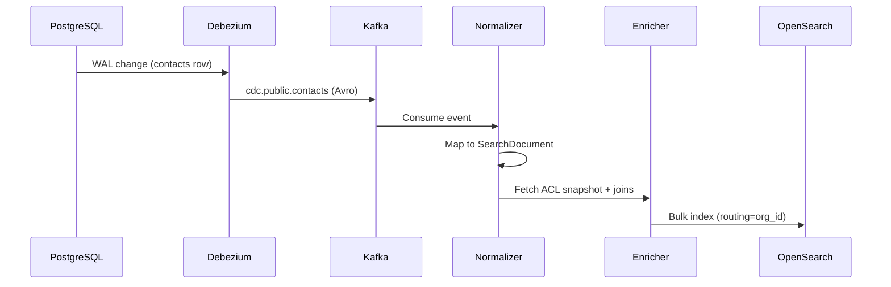
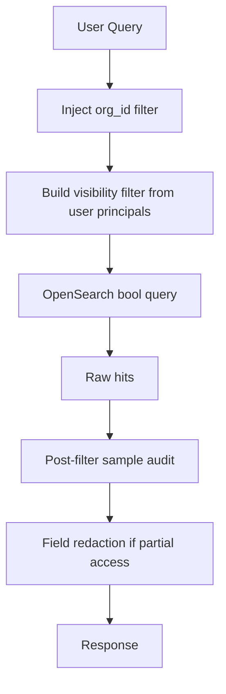
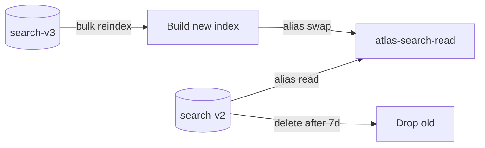

# Search Architecture

## Purpose

Define how Atlas BOS delivers fast, relevant, **permission-aware** search across all business modules — contacts, deals, invoices, documents, messages, tasks, and more — using OpenSearch as the primary search engine with a CDC-driven indexing pipeline from PostgreSQL.

Users expect a single search bar that finds anything they are allowed to see. The search platform must:

- Return results in **< 200ms p95** for typical queries
- Enforce **authorization at query time** (never leak titles/snippets from forbidden records)
- Support **full-text**, **faceted filtering**, **autocomplete**, and **analytics**
- Scale to **billions of documents** across millions of tenants

## Scope

### In Scope

| Area | Coverage |
|------|----------|
| Search engine | OpenSearch cluster architecture |
| Indexing | CDC from PostgreSQL via Debezium/Kafka |
| Document model | Unified search document schema per entity type |
| Global search | Cross-module unified index + blended ranking |
| Permission filter | Authz bitmap / query-time filter injection |
| Facets | Module, type, date, status, owner, tags |
| Autocomplete | Edge n-gram + context suggestions |
| Analytics | Query logs, zero-result rate, click-through |
| Reindexing | Blue/green indices, versioned mappings |
| Attachments | Text extraction pipeline (metadata + content) |

### Out of Scope

- Vector/semantic search (see [04-ai-architecture.md](04-ai-architecture.md), [18-memory-system.md](18-memory-system.md))
- SQL analytics warehouse queries
- External web search (Google)

## Context

PostgreSQL handles transactional queries but cannot meet global fuzzy search at billions of rows. OpenSearch provides inverted indexes, analyzers, aggregations, and horizontal scaling — the proven pattern (Elasticsearch at Shopify, Notion, GitHub).

### Search User Journeys

```
┌────────────────────────────────────────────────────────────────────┐
│  Cmd+K Global Search  │  Module-filtered search  │  List filters   │
│  "acme invoice"       │  CRM → Contacts          │  Faceted browse │
│  Autocomplete         │  Support → Tickets       │  Saved searches │
└────────────────────────────────────────────────────────────────────┘
```

### Tenancy & Security Imperative

A single misconfigured query exposing `org_id=A` data to `org_id=B` user is a company-ending breach. Search must implement **defense in depth:**

1. `org_id` mandatory filter (from JWT, never client-supplied)
2. Permission filter from authz service
3. Index-time visibility metadata (not sole protection)
4. Field-level redaction for partial access

## Detailed Design

### High-Level Architecture



### OpenSearch Cluster Architecture

#### Topology (Per Region)

| Node Role | Count (prod baseline) | Instance | Responsibility |
|-----------|----------------------|----------|----------------|
| Coordinator | 3 | r6g.xlarge | Query routing, aggregations merge |
| Data (hot) | 6+ | r6g.2xlarge | Primary shards, recent data |
| Data (warm) | 3+ | r6g.xlarge | Older than 90d (optional ILM) |
| Ingest | 2 | c6g.xlarge | Ingest pipelines (PII redact) |
| Master-eligible | 3 | c6g.large | Cluster state (dedicated masters at scale) |

**Shard strategy:**

| Index Pattern | Shards | Replicas | Rationale |
|---------------|--------|----------|-----------|
| `atlas-search-{org_hash}-{version}` | 1 primary per 50GB target | 1 | Tenant isolation option (enterprise) |
| `atlas-search-global-{version}` | 30 primaries | 1 | Standard multi-tenant (org_id routing) |

**Routing key:** `org_id` ensures co-location; queries always include `routing=org_id`.

```json
PUT /atlas-search-global-v3/_settings
{
  "index": {
    "number_of_shards": 30,
    "number_of_replicas": 1,
    "routing_partition_size": 1,
    "refresh_interval": "1s"
  }
}
```

#### Multi-Tenancy Model

| Tier | Index Layout |
|------|--------------|
| Standard | Shared global index; `org_id` keyword field mandatory filter |
| Enterprise | Dedicated index per org `atlas-search-org-{org_id}-v3` |
| Regulated | Dedicated cluster + CMK encryption |

### Unified Search Document Schema

```json
{
  "id": "contact:550e8400-e29b-41d4-a716-446655440000",
  "org_id": "org_abc",
  "entity_type": "contact",
  "module": "crm",
  "title": "Acme Corporation",
  "body": "Primary vendor for Q3 supplies. Contact: jane@acme.com",
  "body_suggest": {
    "input": ["Acme Corporation", "Acme"],
    "weight": 10
  },
  "status": "active",
  "owner_id": "user_123",
  "tags": ["vendor", "priority"],
  "entity_id": "550e8400-e29b-41d4-a716-446655440000",
  "created_at": "2026-01-15T10:00:00Z",
  "updated_at": "2026-06-30T08:00:00Z",
  "visibility": {
    "type": "restricted",
    "allowed_principals": ["user:123", "team:sales", "role:crm_viewer"]
  },
  "acl_version": 42,
  "highlights_fields": ["title", "body", "email"],
  "facets": {
    "industry": "manufacturing",
    "region": "us-west"
  },
  "attachment_text": null
}
```

**Document ID:** `{entity_type}:{entity_id}` — idempotent upserts.

### Indexing Pipeline (CDC)



#### CDC Configuration

| Setting | Value |
|---------|-------|
| Connector | Debezium PostgreSQL |
| Publication | `atlas_search_publication` (selected tables) |
| Topic naming | `cdc.atlas.{schema}.{table}` |
| Serialization | Avro + Schema Registry |
| Ordering | Partition by `org_id` + `entity_id` |

#### Indexed Tables (Representative)

| Schema.Table | Entity Type | Title Field | Body Fields |
|--------------|-------------|-------------|-------------|
| `crm.contacts` | contact | `display_name` | email, phone, notes |
| `crm.deals` | deal | `name` | description, stage |
| `erp.invoices` | invoice | `invoice_number` | line_items_summary, notes |
| `support.tickets` | ticket | `subject` | description, comments |
| `projects.tasks` | task | `title` | description |
| `messaging.messages` | message | truncated body | body (non-E2E only) |
| `storage.files` | file | `original_name` | extracted_text, mime_type |

**Deletes:** CDC tombstone (`deleted_at` set) → delete document from index.

**Updates:** Debounce 500ms per `entity_id` in enricher to collapse rapid edits.

### Enrichment Worker

Responsibilities not captured in single-table CDC:

| Enrichment | Source |
|------------|--------|
| ACL principals | Authz service `GET /internal/acl/{entity}` |
| Related text | Join comments, attachment OCR text |
| Facet fields | Denormalized from lookup tables |
| `body_suggest` | Title n-grams for autocomplete |

**ACL caching:** Redis `acl:{entity_type}:{entity_id}` TTL 300s; invalidate on `authz.permission.changed` event.

### Permission-Aware Search



#### Query-Time Filter (mandatory)

```json
{
  "bool": {
    "filter": [
      { "term": { "org_id": "{{jwt.org_id}}" }},
      {
        "bool": {
          "should": [
            { "term": { "visibility.type": "org_wide" }},
            { "terms": { "visibility.allowed_principals": ["{{user_principals}}"] }}
          ],
          "minimum_should_match": 1
        }
      }
    ],
    "must": [
      {
        "multi_match": {
          "query": "{{user_query}}",
          "fields": ["title^3", "body", "attachment_text"],
          "type": "best_fields",
          "fuzziness": "AUTO"
        }
      }
    ]
  }
}
```

**`user_principals`:** `user:{id}`, `team:{id}...`, `role:{id}...` from authz session cache.

**Security rule:** Search API rejects requests without server-side `org_id` injection; client-supplied org filters ignored.

#### Index-Time vs Query-Time AuthZ

| Approach | Pros | Cons | Atlas Choice |
|----------|------|------|--------------|
| Index-time only | Fast queries | Stale ACL → leakage risk | **Not sufficient alone** |
| Query-time only | Always fresh | Complex queries, slower | Combined |
| **Hybrid** | Fast + secure | Reindex on ACL bulk change | **Selected** |

On bulk permission change (role reassignment): emit `search.acl.reindex` for affected entities.

### Full-Text Search & Analyzers

| Field | Analyzer | Notes |
|-------|----------|-------|
| `title` | `atlas_title` (standard + asciifolding) | Case-insensitive |
| `body` | `atlas_body` (english stemmer + stop) | Per-locale analyzers (de, fr, es) |
| `email` | `uax_url_email` tokenizer | Exact email match |
| `attachment_text` | `atlas_body` | From Tika extraction |

**Multi-language:** `body_{locale}` fields with `copy_to` fallback to `body`.

### Faceted Search

| Facet | Field | UI |
|-------|-------|-----|
| Module | `module` | Sidebar checkbox |
| Entity type | `entity_type` | Chips |
| Status | `status` | Dropdown |
| Owner | `owner_id` | User picker |
| Date range | `updated_at` | Presets + custom |
| Tags | `tags` | Tag cloud |

Aggregations use `terms` with `size: 50`; cardinality for counts.

**Module-scoped search:** Pre-filter `module:crm` before aggregation to reduce noise.

### Global Search & Ranking

```mermaid
flowchart LR
    Q[Query "acme"] --> PAR[Parse intent]
    PAR --> MULTI[Multi-index query]
    MULTI --> BLEND[Blending ranker]
    BLEND --> TOP[Top 20 results]
```

#### Ranking Signals (Learning-to-rank ready)

| Signal | Weight | Source |
|--------|--------|--------|
| Text relevance | BM25 base | OpenSearch score |
| Recency | `updated_at` decay | Function score |
| Entity importance | `weight` field | CRM deal amount, ticket priority |
| User affinity | Personalization | Recent views, owner match boost |
| Click history | CTR per doc | Search analytics |

**Default blend (Phase 1):** `score = bm25 * 1.0 + recency_boost + entity_weight`

### Autocomplete

| Type | Index | Trigger |
|------|-------|---------|
| Entity suggest | `body_suggest` completion field | Cmd+K, 2+ chars |
| Recent searches | Redis per user | Empty state |
| Command mode | Static registry | Prefix `>` |

```json
{
  "suggest": {
    "entity-suggest": {
      "prefix": "acm",
      "completion": {
        "field": "body_suggest",
        "size": 10,
        "contexts": {
          "org_id": ["org_abc"]
        }
      }
    }
  }
}
```

**Latency target:** p95 < 50ms for autocomplete (cached coordinator paths).

### Attachment Text Extraction

```
storage.file.scanned(clean) → Text Extract Worker
  → Apache Tika (PDF, DOCX, XLSX)
  → OCR for images (Tesseract / cloud OCR enterprise)
  → Index attachment_text on file document + parent entity
```

| File Type | Max Extract Size | Timeout |
|-----------|------------------|---------|
| PDF | 50 MB / 500 pages | 120s |
| Office | 25 MB | 60s |
| Image OCR | 10 MB | 30s |

Extracted text stored in search index only; not duplicated in PostgreSQL.

### Search API (Preview)

| Endpoint | Description |
|----------|-------------|
| `GET /v1/search` | Global search with facets |
| `GET /v1/search/{module}` | Module-scoped search |
| `GET /v1/search/suggest` | Autocomplete |
| `POST /v1/search/advanced` | Structured query DSL (power users) |
| `GET /v1/search/recent` | User recent searches |
| `POST /v1/search/click` | Analytics click event |

**Response shape:**

```json
{
  "hits": [
    {
      "id": "deal:...",
      "entity_type": "deal",
      "module": "crm",
      "title": "Acme Q3 Renewal",
      "snippet": "...renewal <em>Acme</em> contract...",
      "url": "/crm/deals/...",
      "score": 12.4,
      "updated_at": "2026-06-30T08:00:00Z"
    }
  ],
  "facets": {
    "module": [{ "key": "crm", "count": 42 }]
  },
  "took_ms": 34,
  "cursor": "..."
}
```

### Search Analytics

```sql
search.query_logs (
  id              UUID PRIMARY KEY,
  org_id          UUID NOT NULL,
  user_id         UUID NOT NULL,
  query_text      TEXT NOT NULL,
  query_hash      TEXT NOT NULL,              -- SHA-256 for dedup
  module_filter   TEXT,
  result_count    INT NOT NULL,
  latency_ms      INT NOT NULL,
  clicked_doc_id  TEXT,
  created_at      TIMESTAMPTZ NOT NULL
)
```

| Metric | Use |
|--------|-----|
| Zero-result rate | Index gaps, synonym tuning |
| Click-through rate | Ranking quality |
| Query latency p95 | Capacity |
| Top queries | Product insights |

**Privacy:** Query logs retained 90d; no logging of E2E message content (excluded from index).

### Reindexing Strategy



| Trigger | Strategy |
|---------|----------|
| Mapping change | Blue/green new version suffix |
| Analyzer update | Full reindex |
| ACL model change | Targeted entity reindex |
| Corruption | Per-org reindex (enterprise) |

**Zero-downtime:** Aliases `atlas-search-read` and `atlas-search-write` atomically swapped.

**Backfill job:** Spark/parallel bulk from PostgreSQL snapshot + CDC offset checkpoint.

### Operational Concerns

| Concern | Mitigation |
|---------|------------|
| Hot shards | `org_id` routing; rebalance if enterprise org > 50GB |
| CDC lag | Monitor `cdc_lag_seconds` > 60s alert |
| Index size | ILM: warm tier > 90d; forcemerge weekly off-peak |
| Cluster yellow | Unassigned shard alert; auto reroute |
| PII in index | Ingest pipeline redact SSN patterns; field allowlists |

### Disaster Recovery

- Cross-cluster replication (CCS) to DR region for search read failover
- RPO 15 min via snapshot to S3 every 15 min
- Degraded mode: PostgreSQL `ILIKE` fallback for critical modules (feature flag)

## Alternatives Considered

### ADR-0090: PostgreSQL Full-Text Search Only

**Rejected.** Cannot scale to billions of documents; lacks faceting performance and fuzzy match quality at global scale.

### ADR-0091: Algolia/Typesense SaaS

**Rejected for core.** Cost at billions of records prohibitive; permission model too custom. Evaluate for marketing site search only.

### ADR-0092: Per-Module Separate Indices Only

**Rejected.** Global Cmd+K requires unified index or federated query with poor ranking. Unified index with `module` facet selected.

### ADR-0093: AuthZ Post-Filter Only (No Index ACL)

**Rejected.** Fetching 1000 hits to filter 990 creates leakage via timing and wastes compute. Query-time ACL mandatory.

### Logstash vs Custom Indexer

**Custom Kafka consumers selected.** Rich domain normalization; Debezium already in event pipeline.

## Consequences

### Positive

- Sub-second search across all modules from single bar
- Permission-aware design prevents cross-tenant and ACL leakage
- CDC keeps index fresh without dual-write anti-pattern
- Facets enable browse UX without separate reporting queries
- Blue/green reindexing enables safe mapping evolution

### Negative / Trade-offs

- **Operational burden** — OpenSearch cluster requires dedicated SRE expertise
- **CDC complexity** — Schema migrations must coordinate with connectors
- **ACL staleness window** — Up to 300s cache TTL; mitigated by query-time filter
- **Index storage cost** — ~30-50% of PostgreSQL text data size
- **E2E messages excluded** — Global search gap in encrypted channels

### Capacity Planning

| Scale | Documents | Cluster Size |
|-------|-----------|--------------|
| Year 1 | 500M | 6 data nodes hot |
| Year 3 | 5B | 30 data nodes + warm tier |
| Year 5 | 20B | Sharded by org_hash + dedicated enterprise |

## Open Questions

| ID | Question | Owner | Target Date |
|----|----------|-------|-------------|
| OQ-14-01 | Learning-to-rank model — when to introduce ML ranker? | Search WG | Q4 2026 |
| OQ-14-02 | Semantic/vector hybrid search merge with keyword? | AI + Search | Q4 2026 |
| OQ-14-03 | Cross-org search for partner portals? | AuthZ | Q4 2026 |
| OQ-14-04 | Real-time index refresh_interval 1s vs 5s cost trade-off? | Platform | Q3 2026 |
| OQ-14-05 | Customer-facing search (help center) shared cluster? | Product | Q3 2026 |
| OQ-14-06 | Synonym dictionary curation — per-org custom synonyms? | Product | Q3 2026 |

---

## References

- [05-database-architecture.md](05-database-architecture.md) — CDC publication tables, RLS
- [08-authorization.md](08-authorization.md) — Principal model, ACL evaluation
- [09-storage.md](09-storage.md) — Attachment extraction triggers
- [13-messaging.md](13-messaging.md) — E2E exclusion from index
- [04-ai-architecture.md](04-ai-architecture.md) — Future semantic search
- OpenSearch documentation, Debezium PostgreSQL connector, BM25 / LTR guides