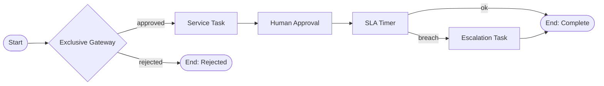
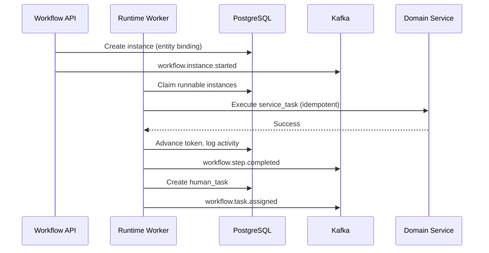

# Workflow Engine

## Purpose

Define the architecture for Atlas's **Workflow Engine** — the durable, auditable orchestration layer that coordinates multi-step business processes across humans, systems, and AI agents. The engine provides BPMN-inspired visual design, state-machine execution semantics, SLA enforcement, versioning, and compensation/rollback for long-running processes tied to business entities (invoices, projects, employees, deals, etc.).

## Scope

### In Scope

- Workflow definition model (BPMN-inspired DSL + visual builder contract)
- Workflow instance lifecycle and state machine execution
- Human task steps (approval, review, data entry) with assignment and escalation
- SLA timers, deadlines, and breach handling
- Workflow versioning, migration, and deprecation
- Compensation and saga-style rollback
- Entity binding (workflow instances linked to domain entities)
- Event integration (Kafka domain events as triggers and signals)
- API surface for designer, runtime, and observability
- Multi-tenant isolation, authorization, and audit

### Out of Scope

- Simple trigger-action rules (see [16-automation-engine.md](16-automation-engine.md))
- AI agent planning loops (see [17-ai-agent-system.md](17-ai-agent-system.md))
- UI pixel-level specification (Phase 4)
- Concrete database DDL (Phase 3)

---

## Context

Atlas replaces dozens of disconnected SaaS tools with a unified Business Operating System. Business processes — onboarding employees, approving expenses, closing deals, fulfilling orders — span multiple modules and actors. Without a first-class workflow engine:

- Business logic fragments across services and cron jobs
- Human-in-the-loop steps lack SLA visibility and escalation
- Long-running processes cannot survive restarts or partial failures
- Audit trails for "who approved what, when" are incomplete

The Workflow Engine sits between **domain services** (CRM, Finance, HR, etc.) and **automation/AI layers**, providing durable orchestration with explicit state.

### Platform Integration

| System | Integration |
|--------|-------------|
| PostgreSQL | Workflow definitions, instances, task inbox, SLA state |
| Kafka | `workflow.*` events; consume domain events as signals |
| Authorization (ARCH-08) | Step-level permissions, assignee resolution |
| Notifications (ARCH-10) | Task assignments, SLA breach alerts |
| AI Agent System (ARCH-17) | Agent steps as first-class node types |
| Automation Engine (ARCH-16) | Lightweight rules vs. durable workflows boundary |

### Position in Atlas

```
┌──────────────────────────────────────────────────────────────────────┐
│                     Visual Workflow Builder (UI)                      │
└───────────────────────────────┬──────────────────────────────────────┘
                                │ REST/GraphQL
┌───────────────────────────────▼──────────────────────────────────────┐
│                      Workflow Definition Service                        │
│  (versioning, validation, publish, deprecation)                       │
└───────────────────────────────┬──────────────────────────────────────┘
                                │
┌───────────────────────────────▼──────────────────────────────────────┐
│                      Workflow Runtime Engine                            │
│  State machine │ Timers │ Human tasks │ Compensation │ Entity binding  │
└───────┬─────────────────┬──────────────────────┬─────────────────────┘
        │                 │                      │
   PostgreSQL          Kafka                 Domain Services
   (instances)      (events/signals)        (CRM, Finance, HR, ...)
```

---

## Detailed Design

### 1. Conceptual Model

| Concept | Description |
|---------|-------------|
| **Workflow Definition** | Immutable versioned blueprint: nodes, edges, guards, SLA policies |
| **Workflow Instance** | Runtime execution of a definition version for a specific context |
| **Node** | Atomic unit of work: task, gateway, timer, service call, sub-workflow |
| **Token** | Execution pointer; parallel gateways create multiple tokens |
| **Human Task** | Assignable work item with form, due date, and outcome |
| **Signal** | External event that advances or correlates an instance |
| **Entity Binding** | Link instance to `entity_type` + `entity_id` (e.g., `invoice:inv_123`) |
| **Compensation** | Declarative undo handler invoked on rollback or failure |

### 2. BPMN-Inspired Node Types



| Node Type | Semantics | Persistence |
|-----------|-----------|-------------|
| `start_event` | Instance creation; may bind entity | Instance row created |
| `end_event` | Terminal state; emit `workflow.completed` | Instance finalized |
| `exclusive_gateway` | XOR branch on expression | Token routing only |
| `parallel_gateway` | AND split/join | Multiple tokens; join barrier |
| `inclusive_gateway` | OR join (one or more paths) | Token accounting |
| `human_task` | Assignee inbox item | Task row + notification |
| `service_task` | Idempotent call to domain API or internal handler | Activity log + outbox |
| `agent_task` | Delegates to AI Agent System | Agent run correlation ID |
| `timer_event` | Delay or deadline (SLA) | Durable timer in DB + scheduler |
| `sub_workflow` | Child instance with parent correlation | Parent-child link |
| `compensation_handler` | Invoked on rollback path | Compensation log |

### 3. Workflow Definition Schema (Logical)

```yaml
workflow_definition:
  id: wf_expense_approval
  tenant_id: org_abc          # null = platform template
  name: Expense Approval
  version: 3
  status: published           # draft | published | deprecated
  entity_types: [expense]
  nodes:
    - id: start
      type: start_event
    - id: manager_review
      type: human_task
      config:
        assignment:
          strategy: role        # user | role | expression | round_robin
          value: manager
        form_schema_ref: expense_review_v2
        outcomes: [approve, reject, request_info]
        sla:
          duration: P2D
          on_breach: escalate_to_role
          escalate_to: finance_director
    - id: finance_approval
      type: human_task
      config:
        assignment:
          strategy: role
          value: finance_approver
        guard: "context.amount > 1000"
    - id: post_approval
      type: service_task
      config:
        handler: finance.post_expense
        idempotency_key: "${instance.id}:post_approval"
        compensation_handler: finance.reverse_expense
  edges:
    - from: start
      to: manager_review
    - from: manager_review
      to: finance_approval
      condition: "outcome == 'approve' && context.amount > 1000"
    - from: manager_review
      to: post_approval
      condition: "outcome == 'approve' && context.amount <= 1000"
  variables:
    - name: amount
      type: decimal
      source: entity.amount
  metadata:
    category: finance
    icon: receipt
```

### 4. State Machine Execution

Each **workflow instance** maintains a canonical state:

```
CREATED → RUNNING → {WAITING (human/timer) | EXECUTING (service)} → COMPLETED
                  ↘ SUSPENDED (admin) ↗
                  ↘ FAILED → COMPENSATING → COMPENSATED | FAILED_TERMINAL
                  ↘ CANCELLED
```

**Execution guarantees:**

- **At-least-once** delivery of internal step triggers; handlers must be **idempotent**
- **Exactly-once** state transitions per `(instance_id, node_id, transition_id)` via optimistic locking
- **Durable timers** stored in PostgreSQL; worker claims due timers with `FOR UPDATE SKIP LOCKED`
- **No lost work** on pod crash: instance state is source of truth, not in-memory



### 5. Human Approval Steps

Human tasks are first-class inbox items, not email-only side effects.

| Capability | Design |
|------------|--------|
| Assignment | User, role, group, expression (`{{entity.owner.manager}}`), dynamic from entity |
| Delegation | Temporary delegate with audit trail |
| Outcomes | Configurable buttons driving gateway conditions |
| Forms | JSON Schema forms; pre-filled from entity + instance variables |
| Comments | Required on reject; optional attachments via Storage (ARCH-09) |
| Bulk actions | Admin-only; rate-limited; per-task authorization re-check |
| Mobile | Push notification + deep link to task |

**Authorization:** Completing a task requires `workflow:task:complete` on the instance's entity scope plus membership in assignee pool. Escalation does not bypass ABAC policies on underlying entity mutations.

### 6. SLA Timers

| Timer Type | Use Case | Implementation |
|------------|----------|----------------|
| `duration` | "Respond within 2 business days" | `fire_at` computed with business calendar |
| `deadline` | Fixed datetime | Absolute timestamp |
| `cycle` | Recurring reminders | Cron-like with max iterations |
| `escalation` | On breach, reassign or auto-action | Linked handler node |

SLA state is queryable: `on_track`, `at_risk` (80% elapsed), `breached`. Metrics exported to Prometheus (ARCH-19). Breach emits `workflow.sla.breached` for automation hooks.

**Business calendars:** Per-tenant holiday schedules; timezone-aware per assignee or entity.

### 7. Workflow Versioning

| Rule | Behavior |
|------|----------|
| Published versions are immutable | Edits create new draft version |
| Running instances | Pinned to start version unless migrated |
| New instances | Use latest `published` unless explicitly pinned |
| Deprecation | `deprecated` versions reject new instances; running continue |
| Migration | Admin-triggered; maps node IDs; may require human re-approval |

```yaml
version_policy:
  default: latest_published
  allowed_pins: [2, 3]        # tenant may pin for compliance
  migration:
    from: 2
    to: 3
    node_mapping:
      manager_review: manager_review_v2
    strategy: in_place | fork_new_instance
```

### 8. Compensation and Rollback

Atlas uses **saga orchestration** with explicit compensation handlers, not distributed 2PC.

**Trigger conditions:**

- Instance cancelled after partial completion
- Service task failure after retries exhausted (if policy = compensate)
- Admin-initiated rollback
- AI agent step rejected by human reviewer (ARCH-17)

**Compensation execution:**

1. Walk completed steps in reverse topological order
2. Invoke `compensation_handler` for each (idempotent)
3. Record `compensation_status` per step: `pending`, `completed`, `skipped`, `failed`
4. Terminal state: `COMPENSATED` or `FAILED_TERMINAL` (manual intervention)

Compensation handlers must be **side-effect safe**: repeated invocation produces no duplicate reversals (use idempotency keys tied to `instance_id:step_id`).

### 9. Entity Binding

Every instance optionally binds to one or more business entities:

```json
{
  "instance_id": "wfi_8f3a2b",
  "bindings": [
    {
      "entity_type": "expense",
      "entity_id": "exp_991",
      "relationship": "primary"
    },
    {
      "entity_type": "employee",
      "entity_id": "emp_442",
      "relationship": "subject"
    }
  ]
}
```

**Benefits:**

- Entity detail pages show active/completed workflows
- Authorization inherits entity-level policies
- Search indexes workflow status on entity
- Domain events (`expense.submitted`) auto-start workflows via correlation rules

**Correlation rules** (configured per definition):

```yaml
auto_start:
  trigger_event: expense.submitted
  filter: "event.payload.amount > 0"
  entity_binding:
    primary: "{{event.payload.expense_id}}"
```

### 10. Visual Builder Architecture

The visual builder is a **client-side graph editor** backed by the definition schema.

| Layer | Responsibility |
|-------|----------------|
| Canvas | React Flow (or equivalent); nodes/edges map 1:1 to schema |
| Validation | Real-time: unreachable nodes, missing end events, cyclic timers |
| Simulation | Dry-run with mock context (no side effects) |
| Publish pipeline | Draft → validate → peer review (optional) → publish |
| Templates | Platform library + tenant clones |

**Designer ↔ Runtime contract:** The canvas serializes to the canonical YAML/JSON schema; runtime never parses visual coordinates.

### 11. Service Architecture

```
┌─────────────────────┐     ┌─────────────────────┐
│ workflow-definition │     │  workflow-runtime   │
│      -api           │     │      -workers       │
│  (CRUD, publish)    │     │  (execution loop)   │
└──────────┬──────────┘     └──────────┬──────────┘
           │                           │
           └───────────┬───────────────┘
                       │
              ┌────────▼────────┐
              │   workflow-db    │
              │  (PostgreSQL)    │
              └─────────────────┘
```

| Component | Replicas | Notes |
|-----------|----------|-------|
| `workflow-definition-api` | 3+ | Stateless; cache published defs in Redis |
| `workflow-runtime-worker` | HPA 5–50 | Partitioned by `tenant_id` hash |
| `workflow-timer-scheduler` | 2 (leader-elected) | Claims due timers |
| `workflow-task-api` | 3+ | Human inbox CRUD |

**Kafka topics:**

| Topic | Producer | Consumers |
|-------|----------|-----------|
| `workflow.instance.started` | Runtime | Search, Analytics, Notifications |
| `workflow.instance.completed` | Runtime | Automation, Domain projections |
| `workflow.task.assigned` | Runtime | Notifications, Mobile push |
| `workflow.sla.breached` | Timer scheduler | Automation, PagerDuty |
| `workflow.step.failed` | Runtime | Monitoring, DLQ review |

### 12. API Surface (Summary)

| Endpoint | Method | Description |
|----------|--------|-------------|
| `/v1/workflows/definitions` | CRUD | Definition management |
| `/v1/workflows/definitions/{id}/publish` | POST | Publish version |
| `/v1/workflows/instances` | POST | Start instance (manual or API) |
| `/v1/workflows/instances/{id}` | GET | Status, variables, activity log |
| `/v1/workflows/instances/{id}/cancel` | POST | Cancel with optional compensation |
| `/v1/workflows/tasks` | GET | Inbox (filtered by assignee) |
| `/v1/workflows/tasks/{id}/complete` | POST | Submit outcome + form data |
| `/v1/workflows/instances/{id}/signals` | POST | Correlate external event |

All APIs require tenant context (`X-Atlas-Tenant-Id`) and enforce ARCH-08 policies.

### 13. Data Model (Logical Tables)

| Table | Key Columns |
|-------|-------------|
| `workflow_definitions` | `id`, `tenant_id`, `version`, `status`, `schema_json` |
| `workflow_instances` | `id`, `definition_id`, `version`, `state`, `variables_json`, `started_at` |
| `workflow_instance_entities` | `instance_id`, `entity_type`, `entity_id`, `relationship` |
| `workflow_tokens` | `instance_id`, `node_id`, `status` |
| `workflow_human_tasks` | `id`, `instance_id`, `assignee`, `due_at`, `outcome`, `form_data` |
| `workflow_timers` | `id`, `instance_id`, `fire_at`, `type`, `status` |
| `workflow_activity_log` | Append-only: step transitions, inputs/outputs (redacted) |
| `workflow_compensations` | `instance_id`, `step_id`, `status`, `attempts` |

Indexes: `(tenant_id, state)`, `(entity_type, entity_id)`, `(assignee, status, due_at)`, `(fire_at) WHERE status = 'pending'`.

### 14. Security and Compliance

- Tenant isolation: row-level `tenant_id` on all tables; cross-tenant queries forbidden
- PII in form data encrypted at rest (ARCH-21); redacted in activity logs
- Immutable activity log for SOC 2 audit
- Admin actions (cancel, migrate, reassign) require elevated role + reason code
- Export of workflow history for GDPR data subject requests

### 15. Observability

| Metric | Type | Labels |
|--------|------|--------|
| `workflow_instances_active` | Gauge | `tenant_id`, `definition_id` |
| `workflow_step_duration_seconds` | Histogram | `node_type`, `definition_id` |
| `workflow_sla_breaches_total` | Counter | `definition_id` |
| `workflow_compensation_failures_total` | Counter | `definition_id` |

Structured logs include `workflow_instance_id`, `correlation_id`, `entity_type`, `entity_id` (ARCH-20).

### 16. Failure Modes

| Failure | Mitigation |
|---------|------------|
| Service task timeout | Retry with exponential backoff; circuit breaker per handler |
| Duplicate event delivery | Idempotency keys on all handlers |
| Timer scheduler crash | Timers durable in DB; at-least-once fire (handlers idempotent) |
| Stuck instance | Reaper job detects `EXECUTING` > threshold; alert + auto-retry |
| Compensation partial failure | Manual intervention queue; block instance terminal state |

---

## Alternatives Considered

### Alternative 1: Embed Orchestration in Each Domain Service

**Description:** Each module (Finance, HR) implements its own state machines.

**Rejected because:** Fragmented inbox, inconsistent SLA handling, no cross-module visibility, duplicated timer/approval infrastructure.

### Alternative 2: Third-Party BPMN Engine (Camunda, Temporal)

**Description:** Adopt Camunda 8 or Temporal for all orchestration.

**Evaluation:**

| Criterion | Camunda | Temporal | Custom Atlas Engine |
|-----------|---------|----------|---------------------|
| Multi-tenant SaaS fit | Moderate | Good | Excellent |
| Entity binding | Custom | Custom | Native |
| AI agent steps | Custom | Custom | Native |
| Operational cost | High | Moderate | Controlled |
| BPMN visual designer | Excellent | None (code-first) | Custom (BPMN-inspired) |

**Decision:** Build a **custom engine** optimized for Atlas entity model, AI steps, and multi-tenant SaaS. Borrow BPMN *concepts* (gateways, events) without full BPMN 2.0 XML compliance in Phase 1. Evaluate Temporal for internal activity workers if custom runtime complexity grows.

### Alternative 3: Full BPMN 2.0 XML Compliance

**Rejected for Phase 1:** High complexity, limited ROI; import/export to BPMN XML deferred to enterprise integrations.

---

## Consequences

### Positive

- Unified orchestration for human + system + AI steps
- Durable, auditable business processes with clear SLA accountability
- Entity-centric UX: workflows visible on invoices, deals, employees
- Compensation enables safe long-running financial operations
- Versioning supports regulated industries requiring process change control

### Negative

- Custom engine development and operational burden
- Learning curve for workflow designers vs. simple automations
- Timer and worker infrastructure adds baseline cost at low tenant count
- Migration between versions can be complex for in-flight instances

### Risks and Mitigations

| Risk | Mitigation |
|------|------------|
| Engine becomes bottleneck | Horizontal workers; partition by tenant; async service tasks |
| Over-use for simple rules | Clear boundary with Automation Engine; lint rules in designer |
| Compensation handler gaps | Publish checklist; block publish if financial steps lack compensation |

---

## Open Questions

| ID | Question | Owner | Target |
|----|----------|-------|--------|
| OQ-15-01 | Should we adopt Temporal for activity execution under a thin Atlas workflow API? | Platform Eng | Phase 2 ADR |
| OQ-15-02 | Maximum parallel token count per instance (prevent runaway fan-out)? | Workflow Team | 500 default? |
| OQ-15-03 | BPMN XML import for enterprise migration — Phase 1 or Phase 2? | Product | Phase 2 |
| OQ-15-04 | Cross-tenant workflow templates (marketplace) — licensing model? | Product/Legal | Phase 2 |
| OQ-15-05 | Default business calendar source: tenant settings or per-workflow? | UX | Phase 4 |

---

## References

- ARCH-02 Software Architecture
- ARCH-05 Database Architecture
- ARCH-06 API Architecture
- ARCH-08 Authorization
- ARCH-16 Automation Engine
- ARCH-17 AI Agent System
- OMG BPMN 2.0 (conceptual reference only)