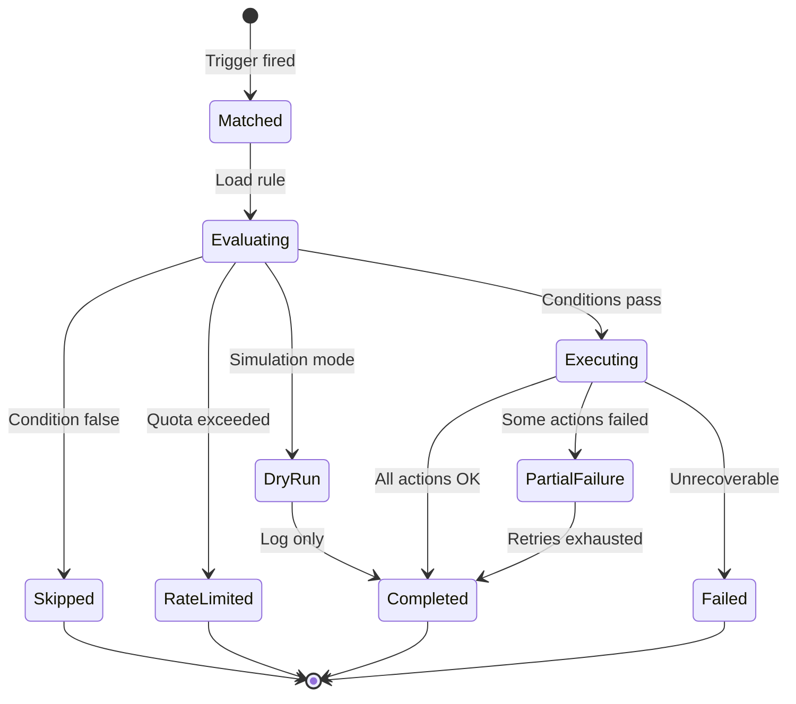

# Automation Engine

## Purpose

Define the architecture for Atlas's **Automation Engine** — the high-velocity, no-code layer that executes **trigger → condition → action** rules in response to events, schedules, and webhooks. The engine complements the Workflow Engine (ARCH-15) by handling lightweight, stateless (or short-lived) automations: notifications, field updates, tag assignments, webhook calls, and AI micro-tasks — without the overhead of full workflow instances.

## Scope

### In Scope

- Trigger-action rule model (IFTTT semantics)
- Event-driven triggers (Kafka domain/integration events)
- Scheduled automations (cron, interval, one-shot)
- No-code automation builder UI contract
- Pre-built automation templates (library + marketplace-ready)
- Rate limits and concurrency controls per tenant/rule
- Dry-run / simulation mode
- Automation audit log (immutable, queryable)
- Multi-tenant isolation and authorization
- Integration with AI agents for single-shot actions

### Out of Scope

- Multi-step human approval processes (ARCH-15)
- Complex compensation sagas (ARCH-15)
- Full agent orchestration loops (ARCH-17)
- External iPaaS replacement for bi-directional sync (ARCH-11)

---

## Context

Atlas generates billions of domain events monthly. Tenants need self-service automation without engineering support — analogous to Zapier/IFTTT inside the platform, but with native access to all business entities and AI.

### Boundary: Automation vs. Workflow

| Dimension | Automation Engine | Workflow Engine |
|-----------|-------------------|-----------------|
| Duration | Seconds to minutes | Hours to months |
| State | Rule execution record | Durable instance + tokens |
| Human steps | Rare (single notification) | Core capability |
| Compensation | None (forward actions) | Saga rollback |
| Complexity | 1 trigger → N actions | Graphs, gateways, sub-flows |
| Use case | "When deal won, notify Slack" | "Employee onboarding over 30 days" |

**Routing rule:** If definition contains human task nodes or SLA > 24h → Workflow Engine. Otherwise → Automation Engine. Designer suggests migration when complexity threshold exceeded.

### Platform Position

```
                    ┌─────────────────────┐
  Domain Events ───►│   Kafka Event Bus   │
  Webhooks      ───►│                     │
  Schedules     ───►└──────────┬──────────┘
                               │
                    ┌──────────▼──────────┐
                    │  Automation Engine  │
                    │  ┌────────────────┐ │
                    │  │ Trigger Matcher│ │
                    │  │ Rule Evaluator │ │
                    │  │ Action Executor│ │
                    │  │ Rate Limiter   │ │
                    │  │ Audit Logger   │ │
                    │  └────────────────┘ │
                    └──────────┬──────────┘
                               │
         ┌─────────────────────┼─────────────────────┐
         ▼                     ▼                     ▼
   Domain APIs           Notifications          External Webhooks
   (field updates)       (ARCH-10)              (ARCH-11)
```

---

## Detailed Design

### 1. Rule Model

```yaml
automation_rule:
  id: auto_deal_won_notify
  tenant_id: org_abc
  name: Notify team when deal won
  status: enabled              # enabled | disabled | draft
  version: 2
  trigger:
    type: event
    event_type: crm.deal.stage_changed
    filter:
      expression: "payload.new_stage == 'won'"
  conditions:
    - expression: "payload.amount >= 10000"
      description: High-value deals only
  actions:
    - type: send_notification
      config:
        channel: in_app
        template: deal_won_high_value
        recipients:
          strategy: role
          value: sales_leadership
    - type: update_entity
      config:
        entity_type: deal
        entity_id: "{{trigger.payload.deal_id}}"
        fields:
          priority: high
    - type: invoke_agent
      config:
        agent_role: analyst
        task: summarize_deal_history
        budget_cents: 50
  settings:
    rate_limit:
      max_executions_per_hour: 100
      max_executions_per_day: 1000
    concurrency: 5
    retry_policy:
      max_attempts: 3
      backoff: exponential
    dry_run_available: true
  metadata:
    template_id: tpl_deal_won_v1
    tags: [crm, sales]
```

### 2. Trigger Types

| Trigger Type | Source | Example |
|--------------|--------|---------|
| `event` | Kafka domain/integration event | `invoice.paid` |
| `schedule` | Cron or interval | `0 9 * * 1` Monday 9am |
| `webhook` | Inbound HTTP with HMAC | External form submission |
| `manual` | API/UI button | "Run now" with payload |
| `composite` | Multiple triggers OR-ed | Event OR schedule |
| `record_change` | DB CDC-style (internal) | Field `status` changed |

**Event matching:** Rules indexed by `(tenant_id, event_type)` in Redis for O(1) lookup. Conditions evaluated after trigger match.

### 3. Condition Language

Atlas Expression Language (AEL) — sandboxed, deterministic, no network I/O:

```
payload.amount > 1000 &&
entity.owner.department == 'sales' &&
!entity.tags.contains('exclude-automation')
```

| Property | Constraint |
|----------|------------|
| Execution timeout | 50ms |
| Memory | 16MB sandbox |
| Functions | Whitelist: string, math, date, collection |
| External calls | Forbidden in conditions |

### 4. Action Types

| Action Type | Description | Idempotency |
|-------------|-------------|-------------|
| `update_entity` | Patch domain entity via internal API | `rule_id:execution_id:action_idx` |
| `create_entity` | Create record | Same |
| `send_notification` | Email, in-app, SMS, push (ARCH-10) | Dedupe window configurable |
| `send_webhook` | Outbound HTTP POST | Retry with signing |
| `start_workflow` | Spawn workflow instance (ARCH-15) | Explicit idempotency key |
| `invoke_agent` | Single agent task (ARCH-17) | Budget-enforced |
| `delay` | Sleep N seconds (max 300) | Scheduled continuation |
| `branch` | Conditional sub-actions | Nested execution |
| `set_variable` | Mutate execution context | Local only |
| `log_audit` | Custom audit entry | Append-only |

**Action pipeline:** Sequential by default; `parallel` block for independent actions with fan-out limit of 10.

### 5. Execution Lifecycle



Each execution produces an **automation execution record**:

```json
{
  "execution_id": "aex_7c21",
  "rule_id": "auto_deal_won_notify",
  "rule_version": 2,
  "trigger_type": "event",
  "trigger_payload_hash": "sha256:abc...",
  "status": "completed",
  "dry_run": false,
  "started_at": "2026-06-30T14:00:00Z",
  "completed_at": "2026-06-30T14:00:02Z",
  "action_results": [
    {"action_idx": 0, "type": "send_notification", "status": "success", "duration_ms": 120},
    {"action_idx": 1, "type": "update_entity", "status": "success", "duration_ms": 45}
  ],
  "correlation_id": "corr_99fa"
}
```

### 6. Event-Driven Architecture

```
Kafka Topic: crm.deal.stage_changed
        │
        ▼
┌───────────────────┐
│ automation-trigger│  Consumer group: automation-triggers
│     -consumer     │  Partition by tenant_id
└─────────┬─────────┘
          │ enqueue
          ▼
┌───────────────────┐
│  Redis Stream /   │  Per-tenant fair queue
│  Internal Queue   │
└─────────┬─────────┘
          │
          ▼
┌───────────────────┐
│ automation-executor│  Worker pool (HPA)
│     -workers      │
└───────────────────┘
```

**Ordering:** Per-entity serialization optional (`serialize_by: entity_id`) to prevent race on same record.

**Dead letter:** Failed executions after retries → `automation.dlq` topic + admin UI for replay.

### 7. Scheduled Automations

| Schedule Type | Example | Storage |
|---------------|---------|---------|
| Cron | `0 0 * * *` daily midnight | `automation_schedules` table |
| Interval | Every 15 minutes | `next_run_at` column |
| One-shot | `2026-07-01T09:00:00Z` | Single fire then disable |

Scheduler service (leader-elected, 2 replicas) claims due schedules with `FOR UPDATE SKIP LOCKED`, publishes synthetic `automation.schedule.fired` events.

**Timezone:** Per-rule `timezone` field; default tenant timezone.

### 8. No-Code Automation Builder

| UI Component | Backend Contract |
|--------------|------------------|
| Trigger picker | Catalog of event types with schema preview |
| Condition builder | Visual AEL builder + raw expression mode |
| Action picker | Typed forms per action; OAuth for webhooks |
| Test panel | Dry-run with sample payload |
| Version history | Diff view; rollback to prior version |
| Enable toggle | Soft disable without delete |

**Validation on save:**

- Trigger schema compatibility
- Action permissions check (user saving rule must hold entitlements for all actions)
- Rate limit sanity (warn if < 10/hour on high-volume events)
- Circular dependency detection (`update_entity` → same event loop)

### 9. Pre-Built Templates

```
┌─────────────────────────────────────────┐
│         Automation Template Library      │
├─────────────────────────────────────────┤
│ Platform Templates (tenant_id = null)   │
│  - New lead assignment                  │
│  - Invoice overdue reminder             │
│  - Project deadline warning             │
│  - Employee birthday greeting           │
├─────────────────────────────────────────┤
│ Tenant Templates (cloned + customized)  │
├─────────────────────────────────────────┤
│ Marketplace (Phase 2+)                  │
└─────────────────────────────────────────┘
```

Template install flow:

1. Clone definition with new `id`
2. Map template variables (e.g., `{{SELECT_ROLE}}`)
3. Run permission preflight
4. Enable in `draft` for review

### 10. Rate Limits

| Limit Scope | Default | Configurable |
|-------------|---------|--------------|
| Per rule / hour | 1,000 | Yes (tenant admin) |
| Per rule / day | 10,000 | Yes |
| Per tenant / hour | 50,000 | Platform tier |
| Per action type / tenant | Varies | Webhook: 500/hr |
| Global platform | Circuit breaker | Ops only |

**Implementation:** Redis sliding window counters (`INCR` + TTL). On breach: execution → `rate_limited`, audit log entry, optional notify tenant admin. No silent drops.

**Burst allowance:** Token bucket with 2× hourly burst for 5 minutes (configurable per plan).

### 11. Dry-Run Mode

| Mode | Behavior |
|------|----------|
| `dry_run: true` on rule | All executions simulated until disabled |
| `POST /automations/{id}/test` | One-shot dry-run |
| Builder test panel | Uses historical or synthetic payload |

Dry-run executes conditions and **validates** actions (schema, permissions, budget) without side effects. Returns predicted action plan + warnings.

```json
{
  "dry_run": true,
  "would_execute": true,
  "actions": [
    {"type": "send_notification", "validated": true, "simulated_recipients": ["user_1", "user_2"]},
    {"type": "invoke_agent", "validated": true, "estimated_cost_cents": 12}
  ],
  "warnings": ["Webhook URL returns 404 in connectivity check"]
}
```

### 12. Automation Audit Log

Separate from general application logs (ARCH-20). Immutable append-only store optimized for compliance queries.

| Field | Description |
|-------|-------------|
| `audit_id` | Unique |
| `tenant_id` | Isolation |
| `rule_id`, `rule_version` | Which rule |
| `execution_id` | Link to execution record |
| `actor_type` | `system`, `user`, `api_key` |
| `actor_id` | Who enabled/triggered |
| `action` | `executed`, `skipped`, `rate_limited`, `failed`, `enabled`, `disabled` |
| `entity_refs` | Affected entities |
| `payload_summary` | Redacted trigger summary |
| `timestamp` | UTC |

Retention: 7 years for enterprise tier; configurable per compliance pack. Export API for auditors.

Storage: PostgreSQL partition by month + archive to S3 after 90 days (hot/cold tiers).

### 13. Service Architecture

| Service | Responsibility | Scaling |
|---------|----------------|---------|
| `automation-api` | CRUD rules, templates, audit queries | 3+ replicas |
| `automation-trigger-consumer` | Kafka → match rules → enqueue | HPA on lag |
| `automation-executor` | Execute action pipeline | HPA 10–100 |
| `automation-scheduler` | Cron/interval firing | 2 (leader-elected) |

All services run on Kubernetes (ARCH-03); secrets from Vault (ARCH-21).

### 14. API Surface (Summary)

| Endpoint | Method | Description |
|----------|--------|-------------|
| `/v1/automations` | CRUD | Rule management |
| `/v1/automations/{id}/enable` | POST | Enable rule |
| `/v1/automations/{id}/disable` | POST | Disable rule |
| `/v1/automations/{id}/test` | POST | Dry-run execution |
| `/v1/automations/executions` | GET | Execution history |
| `/v1/automations/audit` | GET | Audit log (filtered) |
| `/v1/automations/templates` | GET | Template library |
| `/v1/automations/templates/{id}/install` | POST | Install template |

### 15. Security

- Rule creation requires `automation:manage` permission
- Actions execute under **rule owner** service identity with scoped delegation token
- Sensitive actions (webhook to external URL, bulk update) require additional `automation:advanced` permission
- Webhook URLs validated against SSRF blocklist (no RFC1918, no metadata IPs)
- Tenant cannot automate cross-tenant data access (enforced at API layer)
- PII in execution logs redacted per ARCH-20

### 16. Observability

| Metric | Labels |
|--------|--------|
| `automation_executions_total` | `status`, `tenant_id`, `rule_id` |
| `automation_execution_duration_seconds` | `rule_id` |
| `automation_rate_limited_total` | `tenant_id` |
| `automation_action_failures_total` | `action_type` |
| `automation_trigger_lag_seconds` | `event_type` |

Alerts: DLQ depth > 100, P99 execution > 30s, rate limit spike (possible loop).

---

## Alternatives Considered

### Alternative 1: Use Workflow Engine for All Automations

**Rejected:** Workflow instances carry storage and operational overhead unsuitable for high-volume simple rules (e.g., 10K field updates/day).

### Alternative 2: External iPaaS (Zapier, Make) as Primary

**Rejected:** Latency, data residency, cost at scale, and inability to deeply integrate AI agents and entity authorization.

**Hybrid:** ARCH-11 supports outbound Zapier *as an action type* for edge integrations.

### Alternative 3: Serverless Functions (Lambda) per Tenant Rule

**Rejected:** Cold start latency, difficult no-code UX, supply chain complexity. Reserved for future "advanced code step" enterprise feature.

### Alternative 4: Single Shared Rule Interpreter in API Gateway

**Rejected:** Couples automation to gateway release cycle; limits execution time and action richness.

---

## Consequences

### Positive

- Tenants self-serve 80% of integration/orchestration needs without code
- Sub-second reaction to business events
- Templates accelerate time-to-value
- Dry-run and audit log build trust and support compliance
- Clear upgrade path to Workflow Engine when complexity grows

### Negative

- Expression language maintenance burden
- Risk of automation loops if misconfigured
- Rate limiting may frustrate power users on bulk operations
- Template quality requires ongoing curation

### Risks and Mitigations

| Risk | Mitigation |
|------|------------|
| Infinite loops (A triggers B triggers A) | Loop detection graph; max chain depth 5 |
| Webhook SSRF | URL validation; egress proxy |
| Runaway AI agent costs | Per-rule budget caps; invoke_agent requires explicit budget |
| Event storm | Rate limits + circuit breaker per tenant |

---

## Open Questions

| ID | Question | Owner | Target |
|----|----------|-------|--------|
| OQ-16-01 | Maximum actions per rule (default 20)? | Platform | 20 |
| OQ-16-02 | Allow JavaScript "code action" for enterprise tier? | Product/Security | Phase 2 ADR |
| OQ-16-03 | Shared vs. dedicated executor pools for enterprise tenants? | Infra | Phase 2 |
| OQ-16-04 | Template marketplace revenue share model? | Business | Phase 2 |
| OQ-16-05 | Real-time vs. batch aggregation for `record_change` triggers? | Eng | 5s debounce default? |

---

## References

- ARCH-02 Software Architecture
- ARCH-06 API Architecture
- ARCH-08 Authorization
- ARCH-11 Integrations
- ARCH-15 Workflow Engine
- ARCH-17 AI Agent System
- ARCH-20 Logging