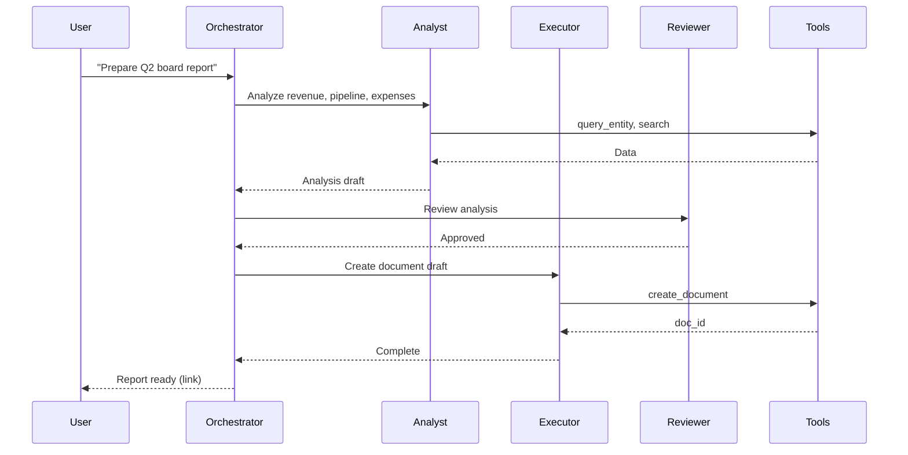

# AI Agent System

## Purpose

Define the architecture for Atlas's **AI Agent System** — the multi-agent orchestration layer that acts as the **business brain** of the platform. Agents do not merely chat; they **plan**, **execute** business actions via tools, **review** outcomes, and collaborate with humans under strict authorization, budget, and observability constraints.

## Scope

### In Scope

- Multi-agent orchestration patterns (sequential, parallel, hierarchical)
- Agent roles: Analyst, Executor, Reviewer (+ extensible registry)
- Tool registry and invocation framework
- Agent memory integration (ARCH-18)
- Planning loops (ReAct-style with guardrails)
- Human approval gates
- Permission model scoped to user authorization (ARCH-08)
- Agent observability (traces, metrics, cost attribution)
- Cost budgets per agent run and per tenant
- Integration with Workflow (ARCH-15) and Automation (ARCH-16) engines

### Out of Scope

- Model training and fine-tuning infrastructure
- Memory storage implementation details (ARCH-18)
- UI chat interface specification (Phase 4)
- Specific LLM vendor contracts

---

## Context

Atlas's AI is the **business brain** — it understands customers, projects, invoices, inventory, cash flow, and can **act** on that understanding. A monolithic chatbot cannot safely execute financial transactions or HR actions. The Agent System decomposes intelligence into **role-bound agents** with **tool access**, **memory**, and **human oversight**.

### Design Principles

1. **Agency with accountability** — Every action is attributable, auditable, and reversible where possible
2. **Least privilege** — Agents inherit user permissions; never exceed invoker's entitlements
3. **Budget-enforced** — Token/compute costs capped per run
4. **Human-in-the-loop by default** for irreversible or high-risk actions
5. **Observable** — Full trace from prompt → tool call → outcome

### Platform Position

```
┌─────────────────────────────────────────────────────────────────┐
│                        User / Workflow / Automation              │
└────────────────────────────┬────────────────────────────────────┘
                             │
┌────────────────────────────▼────────────────────────────────────┐
│                     Agent Orchestrator                             │
│  ┌──────────┐  ┌──────────┐  ┌──────────┐  ┌──────────────────┐  │
│  │ Planner  │  │ Analyst  │  │ Executor │  │ Reviewer         │  │
│  │  Agent   │  │  Agent   │  │  Agent   │  │  Agent           │  │
│  └────┬─────┘  └────┬─────┘  └────┬─────┘  └────────┬─────────┘  │
│       └─────────────┴─────────────┴─────────────────┘             │
│                             │                                      │
│                    ┌────────▼────────┐                            │
│                    │   Tool Registry  │                            │
│                    └────────┬────────┘                            │
└─────────────────────────────┼─────────────────────────────────────┘
                              │
        ┌─────────────────────┼─────────────────────┐
        ▼                     ▼                     ▼
   Domain APIs           Memory System          LLM Gateway
   (CRM, Finance)        (ARCH-18)              (multi-provider)
```

---

## Detailed Design

### 1. Agent Roles

| Role | Responsibility | Typical Tools | Autonomy |
|------|----------------|---------------|----------|
| **Analyst** | Gather context, summarize, recommend | `search`, `query_entity`, `read_document`, `memory_recall` | Read-only |
| **Executor** | Perform approved actions | `update_entity`, `create_invoice`, `send_email`, `start_workflow` | Write (gated) |
| **Reviewer** | Validate Executor output; compliance check | `read_entity`, `audit_log`, `policy_check` | Read + veto |
| **Planner** | Decompose goals into sub-tasks; assign agents | `spawn_agent`, `memory_store` | Orchestration only |

Roles are configured via **Agent Profiles**:

```yaml
agent_profile:
  id: finance_executor_v2
  role: executor
  model: claude-sonnet-4
  system_prompt_ref: prompts/finance_executor_v2
  tools:
    - invoice.create
    - invoice.send
    - payment.record
  constraints:
    max_tool_calls: 20
    max_run_duration_seconds: 300
    require_reviewer_for:
      - invoice.send
      - payment.record
  memory:
    short_term: session
    long_term: tenant_semantic
    episodic: read_write
```

### 2. Multi-Agent Orchestration

#### Pattern A: Sequential Pipeline

```
User Request → Analyst → Reviewer (optional) → Executor → Reviewer → Response
```

#### Pattern B: Parallel Fan-Out

```
Planner → [Analyst₁, Analyst₂, Analyst₃] → Planner (synthesize) → Executor
```

#### Pattern C: Hierarchical (Manager-Worker)

```
Manager Agent
  ├── Worker: CRM Analyst
  ├── Worker: Finance Analyst
  └── Worker: Executor (on approval)
```



**Orchestrator state machine:**

```
INIT → PLANNING → EXECUTING → REVIEW_PENDING → COMPLETED
                 ↘ AWAITING_HUMAN → EXECUTING
                 ↘ BUDGET_EXCEEDED → TERMINATED
                 ↘ FAILED → TERMINATED
```

### 3. Tool Registry

Central catalog of invocable capabilities. Tools are **typed**, **versioned**, and **permission-scoped**.

```yaml
tool:
  id: invoice.create
  version: 1
  category: finance
  risk_level: high          # low | medium | high | critical
  input_schema: json_schema_ref
  output_schema: json_schema_ref
  handler:
    type: internal_api
    endpoint: finance-api/v1/invoices
    method: POST
  permissions_required:
    - finance:invoice:create
  idempotency: required
  rate_limit: 60/minute/tenant
```

| Tool Category | Examples |
|---------------|----------|
| Read | `entity.get`, `search.query`, `document.read`, `report.generate` |
| Write | `entity.update`, `invoice.create`, `task.create` |
| Communicate | `email.send`, `notification.send`, `slack.post` |
| Orchestrate | `workflow.start`, `automation.trigger`, `agent.spawn` |
| Memory | `memory.recall`, `memory.store`, `memory.forget` |
| Meta | `approval.request`, `budget.check`, `policy.evaluate` |

**Tool invocation flow:**

1. Agent emits tool call (structured JSON)
2. Orchestrator validates against schema
3. Authorization check: `effective_permissions = user_permissions ∩ agent_profile.tools`
4. Risk check: high/critical → human approval queue if not pre-approved
5. Idempotency key generated
6. Handler executes; result truncated if exceeds context budget
7. Log to episodic memory + observability

### 4. Planning Loops

Agents use a **bounded ReAct loop**:

```
THINK → ACT (tool) → OBSERVE → THINK → ... → FINISH
```

| Guardrail | Value |
|-----------|-------|
| Max iterations | 25 (configurable per profile) |
| Max consecutive failures | 3 → escalate to human |
| Loop detection | Same tool+args 3× → abort |
| Context window management | Summarize old turns; retrieve via memory |
| Timeout | Hard kill at `max_run_duration_seconds` |

**Planner output schema:**

```json
{
  "goal": "Reduce overdue invoices by 10%",
  "steps": [
    {"id": 1, "agent": "analyst", "task": "List overdue invoices > 30 days"},
    {"id": 2, "agent": "executor", "task": "Send reminder emails", "depends_on": [1], "approval": "required"}
  ],
  "estimated_cost_cents": 45
}
```

### 5. Human Approval Gates

| Gate Type | Trigger |
|-----------|---------|
| `risk_level >= high` | Tool policy |
| `amount > threshold` | Tenant config |
| `first_time_tool` | User never approved this tool for agent |
| `reviewer_reject` | Reviewer agent flags issue |
| `user_setting` | User enables "approve all writes" |

```yaml
approval_request:
  id: apr_8821
  agent_run_id: arun_441
  tool: payment.record
  arguments_redacted: {...}
  reason: "Record $15,000 payment for invoice inv_991"
  requested_at: 2026-06-30T14:00:00Z
  expires_at: 2026-06-30T14:30:00Z
  status: pending
```

Notifications via ARCH-10; approval UI shows diff preview (before/after entity state). Timeout → `expired` → agent run terminates or retries with alternative plan.

### 6. Authorization Model

**Core rule:** Agents never possess superuser capabilities. Effective permissions:

```
effective_perms = invoker_perms ∩ agent_profile_tools ∩ tenant_ai_policy
```

| Invoker | Permission Inheritance |
|---------|------------------------|
| Interactive user | User's RBAC + ABAC session |
| Workflow step | Workflow service identity delegated to step assignee or system role |
| Automation rule | Rule owner's permissions (scoped subset) |
| Scheduled agent | Dedicated service account per tenant with explicit allowlist |

**Delegation token:** Short-lived JWT embedding `sub`, `tenant_id`, `perms[]`, `agent_run_id`, `max_risk_level`.

Audit: every tool call logs `invoker_id`, `agent_run_id`, `permission_check_result`.

### 7. Agent Memory Integration

See ARCH-18 for storage. Agent System consumes:

| Memory Type | Agent Use |
|-------------|-----------|
| Short-term | Current conversation/run context |
| Long-term (semantic) | Business knowledge retrieval (RAG) |
| Episodic | Past action outcomes ("last time we emailed this client, they complained") |
| Semantic facts | Org structure, policies, preferences |

Orchestrator injects memory into system prompt via `memory.recall` tool with privacy filters (tenant boundary strict).

### 8. Cost Budgets

| Budget Scope | Default | Enforcement |
|--------------|---------|-------------|
| Per agent run | $0.50 (50 cents) | Hard stop |
| Per user / day | $5.00 | Soft warn at 80%, hard at 100% |
| Per tenant / month | Plan-based | Ops alert at 90% |
| Per tool call | Model-dependent | Pre-flight estimate |

**Cost accounting:**

```json
{
  "agent_run_id": "arun_441",
  "cost_breakdown": {
    "llm_input_tokens": 12500,
    "llm_output_tokens": 3200,
    "llm_cost_cents": 38,
    "tool_invocation_cost_cents": 2,
    "embedding_cost_cents": 1,
    "total_cents": 41
  },
  "budget_cents": 50,
  "remaining_cents": 9
}
```

LLM Gateway routes to cost-optimized model per task complexity (Analyst may use smaller model than Planner).

### 9. LLM Gateway

Abstraction over multiple providers (Anthropic, OpenAI, Azure, self-hosted).

| Capability | Description |
|------------|-------------|
| Provider routing | Failover, latency-based, cost-based |
| Prompt caching | System prompts + tool defs cached |
| Structured output | JSON mode for tool calls |
| PII scrubbing | Pre-send redaction (ARCH-21) |
| Content filtering | Policy violations → block |

No tenant data used for model training (contractual + technical isolation).

### 10. Service Architecture

| Service | Responsibility |
|---------|----------------|
| `agent-orchestrator` | Run state machine, agent coordination |
| `agent-api` | Start runs, approvals, status |
| `tool-gateway` | Tool validation, authz, execution |
| `llm-gateway` | Provider abstraction |
| `agent-worker` | Async long-running runs |

```
┌─────────────┐    ┌─────────────────┐    ┌─────────────┐
│  agent-api  │───►│ agent-orchestrator│───►│ agent-worker│
└─────────────┘    └────────┬────────┘    └─────────────┘
                            │
              ┌─────────────┼─────────────┐
              ▼             ▼             ▼
        tool-gateway   llm-gateway   Memory (ARCH-18)
```

**Kafka topics:**

| Topic | Purpose |
|-------|---------|
| `agent.run.started` | Analytics, billing |
| `agent.run.completed` | Workflow resume signals |
| `agent.approval.requested` | Notifications |
| `agent.tool.invoked` | Audit, observability |
| `agent.budget.exceeded` | Alerts |

Runs stored in PostgreSQL; ephemeral conversation in Redis (TTL 24h).

### 11. Observability

| Signal | Implementation |
|--------|----------------|
| Traces | OpenTelemetry: span per agent iteration, tool call child span |
| Metrics | `agent_runs_total`, `agent_tool_latency`, `agent_cost_cents`, `agent_approval_wait_seconds` |
| Logs | Structured JSON with `agent_run_id`, redacted prompts |
| Dashboards | Per-tenant cost, tool heatmap, failure rates (ARCH-19) |
| Evals | Offline golden sets for regression (ARCH-24) |

**Debug mode (admin):** Full prompt/tool trace for single run with PII access logged.

### 12. API Surface (Summary)

| Endpoint | Method | Description |
|----------|--------|-------------|
| `/v1/agents/runs` | POST | Start agent run |
| `/v1/agents/runs/{id}` | GET | Status, steps, cost |
| `/v1/agents/runs/{id}/cancel` | POST | Cancel run |
| `/v1/agents/approvals` | GET | Pending approvals |
| `/v1/agents/approvals/{id}` | POST | Approve/reject |
| `/v1/agents/profiles` | GET | List agent profiles |
| `/v1/agents/tools` | GET | Tool catalog (filtered by perms) |

### 13. Failure Handling

| Failure | Response |
|---------|----------|
| Tool timeout | Retry 2×; then escalate to human |
| LLM rate limit | Backoff; switch provider |
| Authorization denied | Agent explains limitation to user |
| Reviewer reject | Re-plan with feedback |
| Budget exceeded | Graceful termination with partial results |

---

## Alternatives Considered

### Alternative 1: Single Monolithic Chatbot with Function Calling

**Rejected:** No separation of concerns; difficult to enforce read-only analysis before writes; poor audit granularity.

### Alternative 2: Fully Autonomous Agents (No Human Gates)

**Rejected:** Unacceptable risk for financial/HR/legal actions; regulatory exposure.

### Alternative 3: External Agent Framework (LangGraph, AutoGPT) as Runtime

**Evaluation:** LangGraph suitable as library; avoid vendor lock-in to hosted agent platforms.

**Decision:** Build Atlas Orchestrator with **LangGraph-inspired patterns** internally; evaluate adopting LangGraph library in Phase 2 ADR.

### Alternative 4: One LLM Call per User Request (No Agents)

**Rejected:** Insufficient for multi-step business operations spanning modules.

---

## Consequences

### Positive

- AI can safely **act** on business data, not just answer questions
- Role separation enables compliance-friendly workflows
- Budget controls prevent cost runaway
- Tool registry creates extensible platform for third-party capabilities
- Deep integration with Workflow and Automation

### Negative

- Operational complexity (orchestrator, gateway, approvals)
- Latency higher than single-shot chat
- Model/provider dependency and cost variability
- User education needed for approval flows

### Risks and Mitigations

| Risk | Mitigation |
|------|------------|
| Prompt injection via entity data | Input sanitization; tool argument validation |
| Agent overreach | Least privilege; reviewer role; audit |
| Hallucinated tool args | JSON schema validation; dry-run for high-risk |
| Cost explosion | Per-run budgets; model routing |

---

## Open Questions

| ID | Question | Owner | Target |
|----|----------|-------|--------|
| OQ-17-01 | Adopt LangGraph vs. custom orchestrator? | AI Platform | Phase 2 ADR |
| OQ-17-02 | Default reviewer: always-on or opt-in per tenant? | Product | Opt-in default |
| OQ-17-03 | Allow tenants to upload custom agent profiles (prompt injection risk)? | Security | Enterprise only + scan |
| OQ-17-04 | Multi-modal agents (document images) in Phase 1? | Product | Phase 2 |
| OQ-17-05 | Agent-to-agent communication bus vs. orchestrator-only? | Eng | Orchestrator-only Phase 1 |

---

## References

- ARCH-04 AI Architecture
- ARCH-08 Authorization
- ARCH-15 Workflow Engine
- ARCH-16 Automation Engine
- ARCH-18 Memory System
- ARCH-19 Monitoring
- ARCH-21 Security