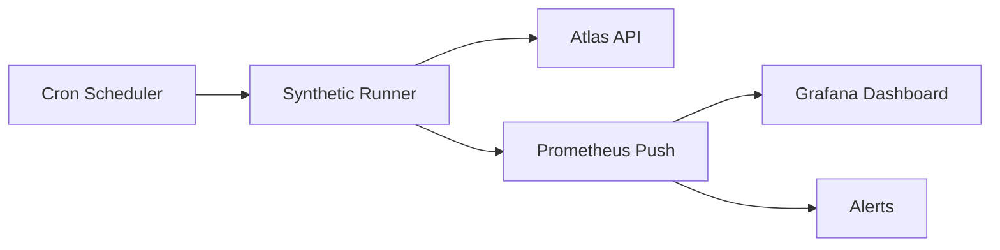

# Monitoring

## Purpose

Define the architecture for Atlas's **Monitoring and Observability** stack — the unified system for measuring platform health, tenant experience, service performance, and AI operations. Monitoring enables data-driven incident response, capacity planning, and SLA accountability through **SLIs/SLOs**, **distributed tracing**, **alerting**, and a hierarchical **dashboard** model.

## Scope

### In Scope

- Metrics collection (Prometheus)
- Visualization (Grafana)
- Distributed tracing (OpenTelemetry → Jaeger/Tempo)
- SLI/SLO definitions and error budgets
- Alerting (PagerDuty integration)
- Uptime monitoring (synthetic + real user metrics)
- Synthetic checks (probes, canaries)
- Dashboard hierarchy (platform / tenant / service)
- AI and workflow-specific observability

### Out of Scope

- Log aggregation (ARCH-20)
- Security SIEM (ARCH-21)
- Business intelligence / analytics warehouse
- Customer-facing status page implementation details (Phase 2)

---

## Context

Atlas targets **99.99% availability** (52 minutes downtime/year) across millions of tenants and billions of API requests. Without cohesive observability:

- Incidents are detected by customers first
- Root cause analysis spans hours across microservices
- Tenant-specific degradation is invisible at platform level
- SLO breaches lack error budget context for release decisions

Monitoring is a **first-class platform capability**, not an afterthought per service.

### Observability Pillars

```
┌─────────────────────────────────────────────────────────────────┐
│                    Atlas Observability Plane                     │
├──────────────┬──────────────┬──────────────┬──────────────────┤
│   Metrics    │    Traces    │    Logs      │    Profiles      │
│  Prometheus  │ OTel/Jaeger  │  Loki (20)   │  Pyroscope (P2)  │
├──────────────┴──────────────┴──────────────┴──────────────────┤
│              Grafana (unified visualization)                      │
├─────────────────────────────────────────────────────────────────┤
│   Alertmanager → PagerDuty │ Status Page │ SLO Error Budgets   │
└─────────────────────────────────────────────────────────────────┘
```

---

## Detailed Design

### 1. Metrics Architecture (Prometheus)

#### Collection Model

| Pattern | Use Case |
|---------|----------|
| Pull (scrape) | Kubernetes pods expose `/metrics` |
| Pushgateway | Short-lived batch jobs |
| Recording rules | Pre-aggregate expensive queries |
| Federation | Cross-region metric aggregation (hub) |

```
┌─────────────┐    scrape    ┌─────────────────┐
│ App Pods    │◄────────────│ Prometheus      │
│ (sidecar ok)│             │ (per region)    │
└─────────────┘             └────────┬────────┘
                                     │ remote_write
                            ┌────────▼────────┐
                            │ Thanos / Mimir    │
                            │ (long-term store) │
                            └─────────────────┘
```

**Cardinality controls:**

- `tenant_id` label on tenant-scoped metrics uses **hashing** for high-volume series (`tenant_id_hash`)
- Dedicated high-cardinality metrics → separate tenant analytics pipeline (not Prometheus)
- Relabel drops: strip `pod` after aggregation where appropriate
- Max labels per metric: 8

#### Standard Metric Categories

| Category | Examples |
|----------|----------|
| RED (services) | `http_requests_total`, `http_request_duration_seconds`, `http_requests_errors_total` |
| USE (resources) | `container_cpu_usage`, `container_memory_usage`, `disk_io` |
| Business | `invoices_created_total`, `workflows_completed_total` |
| AI | `agent_run_cost_cents`, `llm_tokens_total` |
| Queue | `kafka_consumer_lag`, `automation_dlq_depth` |

#### Metric Naming Convention

```
atlas_<subsystem>_<metric>_<unit>

Examples:
atlas_api_http_requests_total
atlas_workflow_step_duration_seconds
atlas_agent_cost_cents_total
```

All services use OpenTelemetry SDK with Prometheus exporter for consistency.

### 2. Distributed Tracing (OpenTelemetry)

#### Trace Propagation

| Header | Standard |
|--------|----------|
| `traceparent` | W3C Trace Context |
| `tracestate` | Vendor-specific hints |
| `X-Atlas-Correlation-Id` | Business correlation (links to logs) |

```
User Request
    │
    ▼
API Gateway ──► Auth Service ──► Domain Service ──► PostgreSQL
    │                │                  │
    └────────────────┴──────────────────┴──► Kafka Producer
                                                    │
                                                    ▼
                                              Automation Worker
```

**Sampling strategy:**

| Environment | Strategy |
|-------------|----------|
| Production | Tail-based sampling: 100% errors, 10% success, 100% slow (>2s) |
| Staging | 50% head-based |
| Development | 100% |

**Collector pipeline:**

```
App (OTel SDK) → OTel Collector (DaemonSet) → Tempo/Jaeger
                                            → Metrics (span metrics)
```

#### Span Requirements

Every span includes:

- `service.name`, `service.version`
- `tenant_id` (when available)
- `user_id` (hashed)
- `http.route` or `rpc.method`
- `error.type` on failures

AI agent spans add: `agent_run_id`, `agent_role`, `tool.name`, `llm.model`.

### 3. SLI/SLO Definitions

#### Platform-Level SLOs

| SLI | Definition | SLO Target | Window |
|-----|------------|------------|--------|
| API Availability | Successful (non-5xx) requests / total | 99.99% | 30d rolling |
| API Latency | Requests < 500ms P99 | 99% | 30d rolling |
| Webhook Delivery | Delivered within 60s | 99.9% | 30d |
| Workflow Completion | Instances complete without manual intervention | 99.5% | 30d |
| Agent Success | Runs complete without `FAILED` | 98% | 30d |
| Data Durability | Zero unrecoverable data loss events | 100% | 90d |

#### Error Budget Policy

```
Error Budget Remaining > 50%  → Normal releases
Error Budget 25-50%           → Caution; no risky deploys
Error Budget < 25%            → Freeze non-critical releases
Error Budget Exhausted        → All hands incident posture; feature freeze
```

Error budgets computed in Grafana via recording rules; exposed to CI/CD (ARCH-22) as deploy gate.

#### Per-Tenant SLIs (Enterprise)

Enterprise tenants receive **dedicated SLO dashboards**:

- API availability filtered by `tenant_id`
- P95 latency for their traffic
- Workflow SLA compliance rate
- Support ticket correlation (Phase 2)

### 4. Alerting (PagerDuty)

#### Alert Routing

```
Prometheus Alertmanager
        │
        ├── severity: critical → PagerDuty (24/7)
        ├── severity: warning  → Slack #atlas-alerts
        └── severity: info     → Ticket queue (non-urgent)
```

| Severity | Response Time | Example |
|----------|---------------|---------|
| P1 Critical | 15 min | API availability < 99.9% (1h window) |
| P2 High | 1 hour | Kafka lag > 100K for 30 min |
| P3 Medium | 4 hours | Disk 85% on database primary |
| P4 Low | Next business day | Certificate expires in 30 days |

#### Alert Design Rules

- Every alert has `runbook_url` annotation
- No paging on single-pod restarts (use `for: 5m` dampening)
- Composite alerts for cascading failures (avoid alert storms)
- Tenant-specific alerts route to tenant CSM for enterprise (optional integration)

**Example alert:**

```yaml
groups:
  - name: atlas.api
    rules:
      - alert: APIAvailabilityBreach
        expr: |
          1 - (
            sum(rate(atlas_api_http_requests_total{status!~"5.."}[5m]))
            / sum(rate(atlas_api_http_requests_total[5m]))
          ) > 0.001
        for: 5m
        labels:
          severity: critical
        annotations:
          summary: API error rate exceeds SLO threshold
          runbook_url: https://runbooks.atlas.internal/api-availability
```

### 5. Uptime Monitoring

#### Layers

| Layer | Method | Frequency |
|-------|--------|-----------|
| External | Global probes (Checkly/Datadog) | 1 min |
| Internal | Kubernetes liveness/readiness | Continuous |
| Dependency | Synthetic transactions | 5 min |
| Real User | RUM (Phase 2) | Continuous |

**External probes:**

- `GET /health/live` — process alive
- `GET /health/ready` — dependencies OK
- `POST /v1/auth/token` (synthetic user) — full auth path
- GraphQL introspection query — API gateway health

**Multi-region:** Probes from US, EU, APAC; alert on regional degradation.

### 6. Synthetic Checks

| Check | Steps | Success Criteria |
|-------|-------|------------------|
| `canary-login` | Login → fetch profile | 200, < 1s |
| `canary-create-contact` | Create → read → delete CRM contact | Entity lifecycle OK |
| `canary-workflow` | Start test workflow → complete | State = COMPLETED |
| `canary-agent` | Run read-only agent query | Response < 10s, cost < $0.01 |
| `canary-payment` | Stripe test mode charge | Webhook received |

Synthetic checks run from dedicated `synthetic-runner` namespace; isolated test tenant per region.



### 7. Dashboard Hierarchy

#### Level 1: Platform Overview (NOC)

- Global request rate, error rate, latency heatmap
- Regional health matrix
- Active incidents
- Error budget burn rate (all SLOs)
- Kafka lag, DB connections, K8s node health

#### Level 2: Service Dashboards

One dashboard per service (auto-generated from catalog):

- `api-gateway`, `auth-service`, `workflow-runtime`, `agent-orchestrator`, etc.
- RED metrics, dependency latency, deployment annotations

#### Level 3: Domain Dashboards

- CRM, Finance, HR module aggregates
- Business KPIs tied to technical metrics

#### Level 4: Tenant Dashboards (Admin / Enterprise)

- Per-tenant API usage, error rates, active users
- Workflow SLA compliance
- Agent cost attribution
- Automation execution volume

**Access control:**

| Dashboard Level | Audience |
|-----------------|----------|
| Platform | SRE, Platform Eng |
| Service | Service owners |
| Domain | Product + Eng leads |
| Tenant | Tenant admin (own data only) |

Grafana folders enforce RBAC; tenant dashboards use variable `tenant_id` with permission check.

### 8. AI & Workflow Observability

| Panel | Metrics |
|-------|---------|
| Agent cost by tenant | `sum(atlas_agent_cost_cents) by (tenant_id)` |
| Tool failure heatmap | `atlas_agent_tool_errors_total` |
| Workflow SLA breaches | `atlas_workflow_sla_breaches_total` |
| LLM provider latency | `atlas_llm_request_duration_seconds` |
| Automation DLQ | `atlas_automation_dlq_depth` |

Trace exemplars link Grafana metrics → Jaeger traces (click P99 bar → trace).

### 9. Infrastructure Monitoring

| Component | Tool |
|-----------|------|
| Kubernetes | kube-prometheus-stack |
| PostgreSQL | postgres_exporter + pg_stat_statements |
| Kafka | kafka_exporter, burrow for lag |
| Redis | redis_exporter |
| Ingress | nginx ingress metrics |

Managed services (RDS, Confluent) provide native metrics via cloud exporter.

### 10. Service Architecture

| Component | Deployment |
|-----------|------------|
| Prometheus | HA pair per region |
| Alertmanager | HA pair, global routing |
| Grafana | 3 replicas, PostgreSQL backend |
| OTel Collector | DaemonSet per node |
| Tempo | Distributed, S3 backend |
| Thanos | Query + Store for global view |

All deployed via GitOps (ARCH-22) in `observability` namespace.

### 11. On-Call and Incident Integration

- PagerDuty schedules per service team
- Incident auto-create from P1 alerts
- Slack war room channel auto-provisioned
- Post-incident: trace IDs and dashboard snapshots attached
- Link to ARCH-25 disaster recovery runbooks

### 12. Cost Observability

| Metric | Purpose |
|--------|---------|
| `atlas_infra_cost_daily_usd` | Cloud spend tracking |
| `atlas_llm_cost_by_tenant` | AI margin analysis |
| Cost per API request | Efficiency regression detection |

---

## Alternatives Considered

### Alternative 1: Datadog All-in-One

**Evaluation:** Excellent UX, high cost at Atlas scale (billions of spans).

**Decision:** OSS stack (Prometheus/Grafana/OTel) for core; evaluate Datadog for RUM/synthetics if OSS gaps emerge.

### Alternative 2: Logs as Primary Debug Tool

**Rejected:** Metrics and traces required for SLO management and latency analysis at scale.

### Alternative 3: Per-Service Monitoring Silos

**Rejected:** Prevents platform-wide SLO view and consistent instrumentation.

### Alternative 4: 100% Trace Sampling

**Rejected:** Prohibitive storage cost; tail-based sampling optimal.

---

## Consequences

### Positive

- SLO-driven engineering culture with error budgets
- Fast incident detection and root cause via traces
- Tenant-visible health for enterprise contracts
- AI cost visibility prevents margin erosion
- Consistent instrumentation across all services

### Negative

- Operational overhead for Prometheus/Thanos at scale
- Cardinality management requires ongoing discipline
- Dashboard sprawl without governance
- Initial instrumentation effort for all services

### Risks and Mitigations

| Risk | Mitigation |
|------|------------|
| Cardinality explosion | Label policies; lint in CI |
| Alert fatigue | Regular alert review; SLO-based paging only |
| Trace storage cost | Aggressive retention tiers (7d hot, 30d cold) |
| Dashboard access leak | Grafana RBAC + tenant variable guards |

---

## Open Questions

| ID | Question | Owner | Target |
|----|----------|-------|--------|
| OQ-19-01 | Mimir vs. Thanos for long-term metrics? | SRE | Phase 2 ADR |
| OQ-19-02 | Customer-facing status page: self-hosted or Statuspage.io? | Product | Phase 2 |
| OQ-19-03 | RUM implementation vendor? | Frontend | Phase 2 |
| OQ-19-04 | Per-tenant alerting for enterprise — included or add-on? | Product | Phase 2 |
| OQ-19-05 | Continuous profiling (Pyroscope) in Phase 1? | SRE | Phase 2 |

---

## References

- ARCH-03 Infrastructure Architecture
- ARCH-17 AI Agent System
- ARCH-20 Logging
- ARCH-22 Deployment
- ARCH-23 Scaling
- ARCH-25 Disaster Recovery
- Google SRE Workbook (SLO methodology)