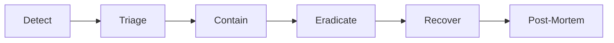

# Security

## Purpose

Define the **Security Architecture** for Atlas — the comprehensive framework protecting millions of tenants, hundreds of millions of users, and sensitive business data across a globally distributed, AI-powered Business Operating System. Security is not a module; it is a **cross-cutting property** enforced through defense in depth, zero trust principles, and continuous verification.

## Scope

### In Scope

- Threat model (STRIDE-based)
- Defense in depth layers
- OWASP Top 10 mitigations
- Encryption in transit and at rest
- Secrets management and rotation
- Vulnerability scanning (SAST/DAST/SCA)
- Penetration testing cadence
- Bug bounty program
- Incident response playbook
- Supply chain security (SBOM, provenance)
- Compliance alignment (SOC 2, GDPR, HIPAA-ready)
- AI-specific security (prompt injection, agent overreach)

### Out of Scope

- Detailed auth flows (ARCH-07)
- RBAC/ABAC policy model (ARCH-08)
- Network topology details (ARCH-03)
- Implementation of specific security tools

---

## Context

Atlas consolidates CRM, finance, HR, documents, messaging, and AI into one platform — making it a **high-value target** containing credentials, financial records, PII, and intellectual property. A breach affects entire businesses, not single applications.

### Security Principles

1. **Zero Trust** — Never trust, always verify; least privilege everywhere
2. **Defense in Depth** — Multiple independent control layers
3. **Secure by Default** — Safe defaults; opt-in for riskier features
4. **Shift Left** — Security in design, CI, and code review
5. **Assume Breach** — Detect, contain, recover; minimize blast radius
6. **Transparency** — Auditable actions; responsible disclosure

### Trust Boundaries

```
┌─────────────────────────────────────────────────────────────────┐
│                        Internet (Untrusted)                      │
└────────────────────────────┬────────────────────────────────────┘
                             │ TLS 1.3, WAF, DDoS
┌────────────────────────────▼────────────────────────────────────┐
│                     Edge / API Gateway (DMZ)                     │
└────────────────────────────┬────────────────────────────────────┘
                             │ mTLS internal
┌────────────────────────────▼────────────────────────────────────┐
│                   Application Tier (Services)                      │
│              Tenant isolation │ AuthZ │ Input validation          │
└────────────────────────────┬────────────────────────────────────┘
                             │ Encrypted connections
┌────────────────────────────▼────────────────────────────────────┐
│                      Data Tier (Trusted)                         │
│         PostgreSQL │ Redis │ S3 │ Kafka │ Vector DB              │
└─────────────────────────────────────────────────────────────────┘
```

---

## Detailed Design

### 1. Threat Model (STRIDE)

| Threat | Category | Atlas Assets | Mitigations |
|--------|----------|--------------|-------------|
| Spoofing user/tenant | S | Sessions, API keys | MFA, JWT validation, tenant context enforcement |
| Tampering with data | T | Entities, workflows | Integrity hashes, audit logs, immutable audit store |
| Repudiation | R | Financial transactions | Audit log with hash chain, non-repudiation |
| Information disclosure | I | PII, business data | Encryption, ABAC, PII redaction, tenant isolation |
| Denial of service | D | API, workflows | Rate limiting, WAF, HPA, circuit breakers |
| Elevation of privilege | E | Admin, cross-tenant | RBAC/ABAC, no shared service accounts, break-glass |

#### Threat Actors

| Actor | Capability | Motivation |
|-------|------------|------------|
| External attacker | Network, application exploits | Data theft, ransomware |
| Malicious tenant | Valid account, API access | Cross-tenant access, resource abuse |
| Malicious insider | Employee credentials | Data exfiltration |
| Supply chain | Compromised dependency | Backdoor, cryptomining |
| AI adversary | Prompt injection via data | Unauthorized actions via agents |

#### AI-Specific Threats

| Threat | Vector | Mitigation |
|--------|--------|------------|
| Prompt injection | Malicious content in CRM notes | Input sanitization; tool arg validation |
| Agent overreach | Agent exceeds user permissions | Permission intersection (ARCH-17) |
| Memory poisoning | False facts injected | Provenance, review queue (ARCH-18) |
| Model extraction | Excessive API probing | Rate limits, output filtering |
| Training data leak | Tenant data in prompts to provider | Zero-retention contracts, PII scrubbing |

### 2. Defense in Depth

```
Layer 1: Perimeter        WAF, DDoS protection, geo-blocking (optional)
Layer 2: Network          VPC isolation, security groups, mTLS mesh
Layer 3: Identity         MFA, SSO, session management (ARCH-07)
Layer 4: Authorization    RBAC + ABAC (ARCH-08)
Layer 5: Application      Input validation, output encoding, CSRF tokens
Layer 6: Data             Encryption, row-level security, field-level encryption
Layer 7: Monitoring       SIEM, anomaly detection, audit logs (ARCH-19/20)
Layer 8: Process          SDLC, reviews, training, incident response
```

Each layer fails independently; no single control is sole protection.

### 3. OWASP Top 10 Mitigations (2021)

| # | Risk | Atlas Mitigation |
|---|------|------------------|
| A01 | Broken Access Control | Centralized AuthZ (ARCH-08); deny-by-default; tenant_id on every query; integration tests per endpoint |
| A02 | Cryptographic Failures | TLS 1.3 minimum; AES-256 at rest; no custom crypto; KMS-managed keys |
| A03 | Injection | Parameterized queries; ORM; input validation; AEL sandbox (no SQL in expressions) |
| A04 | Insecure Design | Threat modeling in design phase; security review gate |
| A05 | Security Misconfiguration | Hardened K8s baselines; CIS benchmarks; automated config scanning |
| A06 | Vulnerable Components | SCA in CI; Dependabot; SBOM; 48h critical patch SLA |
| A07 | Auth Failures | MFA for admin; secure session cookies; brute force lockout |
| A08 | Data Integrity Failures | Signed webhooks; CI/CD provenance; audit hash chain |
| A09 | Logging Failures | Structured logging (ARCH-20); security event alerts |
| A10 | SSRF | URL allowlist for webhooks; block RFC1918/metadata IPs; egress proxy |

### 4. Encryption

#### In Transit

| Connection | Protocol |
|------------|----------|
| Client → Edge | TLS 1.3 (1.2 minimum legacy clients) |
| Service → Service | mTLS via service mesh (Istio/Linkerd) |
| Service → Database | TLS with cert verification |
| Service → Kafka | TLS + SASL |
| Service → S3 | HTTPS (TLS 1.2+) |

**Certificate management:** cert-manager with Let's Encrypt internal CA; 90-day rotation automated.

#### At Rest

| Data Store | Encryption |
|------------|------------|
| PostgreSQL | AES-256 (TDE or volume encryption) |
| S3 | SSE-KMS per tenant key (enterprise) |
| Redis | Encrypted volumes |
| Backups | Encrypted with separate KMS key |
| Logs (cold) | SSE-S3 |

#### Field-Level Encryption

Sensitive fields encrypted application-side before storage:

| Field Type | Method |
|------------|--------|
| SSN, tax IDs | AES-256-GCM with per-tenant DEK |
| Bank account numbers | Tokenization via payment vault |
| API keys (integrations) | Envelope encryption |
| Health data (HIPAA) | Dedicated key hierarchy |

DEKs wrapped by tenant-specific KMS keys; platform cannot decrypt enterprise BYOK data.

### 5. Secrets Management

| Secret Type | Store | Rotation |
|-------------|-------|----------|
| Database credentials | HashiCorp Vault | 30 days |
| API keys (internal) | Vault dynamic secrets | Per-use or 24h |
| Third-party OAuth | Vault | On compromise + 90 days |
| TLS certificates | cert-manager | 90 days |
| Encryption keys | Cloud KMS | Annual + on incident |
| CI/CD tokens | GitHub OIDC → Vault | Short-lived |

**Rules:**

- No secrets in code, env files, or Kubernetes manifests (Sealed Secrets / External Secrets Operator)
- Secret access audited in Vault
- Emergency rotation runbook tested quarterly

### 6. Vulnerability Scanning

| Scan Type | Tool Class | Frequency | Gate |
|-----------|------------|-----------|------|
| SAST | Semgrep, CodeQL | Every PR | Block critical |
| SCA | Snyk, Dependabot | Every PR + daily | Block critical CVE |
| Container scan | Trivy | Every image build | Block critical |
| DAST | OWASP ZAP (staging) | Weekly | Track remediation |
| IaC scan | Checkov, tfsec | Every PR | Block high |
| Secret scan | Gitleaks, TruffleHog | Every commit | Block |

**Remediation SLAs:**

| Severity | Fix Timeline |
|----------|--------------|
| Critical (CVSS 9+) | 48 hours |
| High (7-8.9) | 7 days |
| Medium | 30 days |
| Low | 90 days |

### 7. Penetration Testing

| Type | Frequency | Scope |
|------|-----------|-------|
| External pentest | Annual | Production-like staging |
| Internal pentest | Annual | Internal services, admin |
| Red team exercise | Biennial | Full organization |
| AI/agent pentest | Annual | Prompt injection, tool abuse |
| Post-major-release | Ad hoc | Changed attack surface |

Deliverables: executive summary, technical findings, retest verification. Results inform threat model updates.

### 8. Bug Bounty

| Phase | Timeline | Platform |
|-------|----------|----------|
| Private beta | Month 6 post-launch | HackerOne (invite) |
| Public program | Month 12 | HackerOne public |

**Scope:** `*.atlas.com` production; staging excluded.  
**Out of scope:** Social engineering, physical, DoS, other tenants' data.  
**Rewards:** $100–$25,000 based on severity; bonus for novel AI attacks.

Safe harbor policy for good-faith researchers.

### 9. Incident Response Playbook

#### Severity Levels

| Level | Definition | Response |
|-------|------------|----------|
| SEV1 | Active breach, data exfiltration, full outage | All hands, CEO notified within 1h |
| SEV2 | Confirmed vulnerability exploited, partial outage | Security + SRE, 4h updates |
| SEV3 | Suspicious activity, contained | Security team investigation |
| SEV4 | Policy violation, scan finding | Ticket queue |

#### Response Phases



| Phase | Actions |
|-------|---------|
| Detect | SIEM alerts, anomaly detection, user report, bug bounty |
| Triage | Classify severity; assign IC; preserve evidence |
| Contain | Isolate affected systems; revoke credentials; block IPs |
| Eradicate | Patch vulnerability; remove malware; rotate secrets |
| Recover | Restore from clean backups; verify integrity; monitor |
| Learn | Blameless post-mortem; update runbooks; regulatory notification if required |

#### Communication Plan

| Audience | SEV1 Timeline | Channel |
|----------|---------------|---------|
| Internal leadership | 1 hour | Phone + Slack war room |
| Affected tenants | 24 hours (GDPR: 72h) | Email + status page |
| Regulators | Per jurisdiction | Legal coordination |
| Public | As needed | Status page + blog |

**Incident Commander:** Rotating on-call security lead; runbooks in `runbooks.atlas.internal`.

### 10. Supply Chain Security

#### SBOM (Software Bill of Materials)

- Generated per container image (Syft/CycloneDX)
- Stored in artifact registry alongside image
- Tenant enterprise export available on request

#### Build Provenance

- SLSA Level 3 target
- Signed commits required
- GitHub Actions OIDC → cloud deploy (no long-lived keys)
- Cosign image signing; admission controller verifies signatures

#### Dependency Policy

| Rule | Enforcement |
|------|-------------|
| Approved license list | CI check |
| No unmaintained deps (>2y no release) | SCA warning |
| Pin versions in lockfiles | Required |
| Vendor security review for critical deps | Manual for crypto, auth libs |

#### Third-Party Integrations (ARCH-11)

- OAuth scopes minimized
- Webhook signature verification
- Integration security review before marketplace listing

### 11. Tenant Isolation

| Layer | Mechanism |
|-------|-----------|
| Data | `tenant_id` on all rows; RLS in PostgreSQL |
| Compute | Namespace per enterprise tier (optional dedicated) |
| Network | Network policies; no cross-namespace traffic |
| Cache | Key prefix `tenant:{id}:` |
| Search | Filtered indices per tenant |
| AI Memory | Partitioned vector indexes (ARCH-18) |
| Encryption | Per-tenant KMS keys (enterprise) |

**Noisy neighbor:** Rate limits per tenant; fair queuing; abuse detection.

### 12. Compliance

| Framework | Status | Key Controls |
|-----------|--------|--------------|
| SOC 2 Type II | Target Year 1 | Access control, audit, encryption, monitoring |
| GDPR | Required | Data subject rights, erasure, DPA, breach notification |
| HIPAA | Ready architecture | BAA, field encryption, access logging |
| ISO 27001 | Target Year 2 | ISMS alignment |
| PCI DSS | Scope reduction | Stripe tokenization; no card storage |

### 13. Security in SDLC

```
Design → Threat Model → Code → SAST/SCA → Review → Deploy → DAST → Monitor
         ↑                                                    ↓
         └──────────── Post-incident updates ←────────────────┘
```

| Gate | Requirement |
|------|-------------|
| Design | Threat model for new features |
| PR | Security review for auth/crypto/tenant changes |
| Deploy | Signed images, policy checks |
| Prod | Continuous monitoring, pentest findings tracked |

### 14. Break-Glass Access

Emergency access to production data:

1. Two-person approval (security + VP Eng)
2. Time-limited (4 hours)
3. Full audit trail
4. Post-access review within 24 hours

Used only for SEV1/SEV2 incidents or critical customer escalations.

---

## Alternatives Considered

### Alternative 1: Perimeter-Only Security (Firewall + VPN)

**Rejected:** Insufficient for multi-tenant SaaS; insider and application-layer threats dominate.

### Alternative 2: Security as Optional Enterprise Add-On

**Rejected:** Base platform must be secure for all tiers; compliance is table stakes.

### Alternative 3: Third-Party Security Platform Only (no internal SIEM)

**Rejected:** Need custom detection for tenant isolation and AI-specific threats.

### Alternative 4: Store All Secrets in Kubernetes Secrets

**Rejected:** etcd encryption alone insufficient; no rotation, no audit.

---

## Consequences

### Positive

- Enterprise customers can trust Atlas with sensitive business data
- Regulatory readiness accelerates sales cycles
- AI actions are bounded and auditable
- Supply chain visibility reduces dependency risk
- Incident response minimizes damage and recovery time

### Negative

- Security controls add latency (authz checks, encryption overhead)
- Operational overhead for scanning, rotation, drills
- Bug bounty and pentest costs
- Developer friction from security gates (mitigated by automation)

### Risks and Mitigations

| Risk | Mitigation |
|------|------------|
| Zero-day in dependency | SBOM + rapid patch process; WAF virtual patches |
| Insider threat | Least privilege; audit; anomaly detection |
| AI prompt injection | Multi-layer validation; human gates for writes |
| Compliance audit failure | Continuous control monitoring; mock audits |

---

## Open Questions

| ID | Question | Owner | Target |
|----|----------|-------|--------|
| OQ-21-01 | Service mesh: Istio vs. Linkerd vs. Cilium? | Platform | Phase 2 ADR |
| OQ-21-02 | BYOK encryption for all enterprise or premium tier only? | Product | Premium+ |
| OQ-21-03 | FedRAMP timeline and scope? | Compliance | Year 3+ |
| OQ-21-04 | SIEM vendor: Splunk vs. Elastic Security vs. Chronicle? | Security | Phase 2 |
| OQ-21-05 | Customer-managed keys for audit logs? | Legal/Product | Enterprise |

---

## References

- ARCH-03 Infrastructure Architecture
- ARCH-07 Authentication
- ARCH-08 Authorization
- ARCH-17 AI Agent System
- ARCH-20 Logging
- ARCH-22 Deployment
- ARCH-25 Disaster Recovery
- OWASP ASVS Level 2 (target)
- NIST Cybersecurity Framework