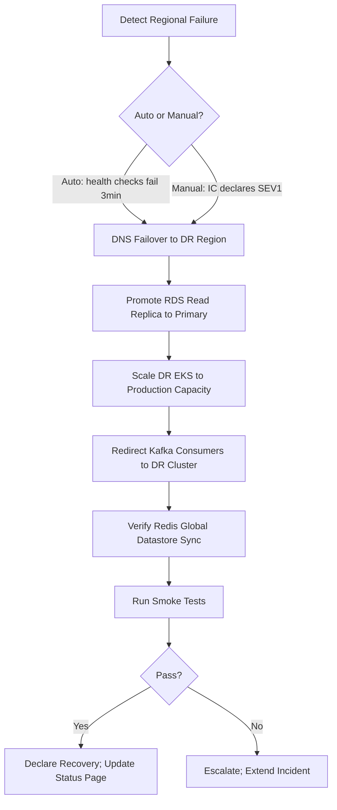

# Disaster Recovery

## Purpose

Define the architecture for **Disaster Recovery (DR) and Business Continuity** at Atlas — the strategies, procedures, and infrastructure ensuring the platform can withstand regional outages, data corruption, cyberattacks, and catastrophic failures while meeting **99.99% availability SLA** commitments with defined **RPO/RTO** targets, tested runbooks, and clear incident communication.

## Scope

### In Scope

- RPO/RTO targets aligned with 99.99% SLA
- Backup schedules and retention
- Cross-region failover architecture
- DR runbooks and automation
- DR drill cadence and success criteria
- Data corruption detection and recovery
- Incident severity levels and escalation
- Communication plan (internal, customer, regulatory)
- Cyber incident recovery (ransomware, breach)
- Dependency failure scenarios

### Out of Scope

- Day-to-day monitoring and alerting (ARCH-19)
- Security incident forensics detail (ARCH-21)
- Insurance and legal liability
- Customer-specific DR add-ons (enterprise contracts)

---

## Context

Atlas targets **99.99% uptime** — approximately **52 minutes of downtime per year**. A single-region deployment cannot meet this against AZ failures, regional outages, or operator error. DR architecture must:

- Recover from regional failure within RTO
- Limit data loss to RPO
- Be tested regularly (untested DR is no DR)
- Integrate with incident response (ARCH-21)
- Communicate transparently during disasters

### Availability Math

```
99.99% annual uptime = 52.6 minutes downtime/year
                     = 4.38 minutes downtime/month

DR architecture must ensure regional failover + data recovery fit within budget
```

---

## Detailed Design

### 1. RPO/RTO Targets

| Tier | Scope | RPO | RTO | Availability |
|------|-------|-----|-----|--------------|
| **Platform (default)** | All production services | 5 min | 30 min | 99.99% |
| **Critical path** | Auth, API gateway, core CRUD | 1 min | 15 min | 99.995% |
| **Data plane** | PostgreSQL, Kafka | 5 min | 30 min | 99.99% |
| **AI/Async** | Agents, automation, workflows | 15 min | 60 min | 99.9% |
| **Analytics** | Reports, dashboards | 1 hour | 4 hours | 99.5% |
| **Enterprise dedicated** | Single-tenant stack | 1 min | 15 min | 99.995% (contractual) |

#### Definitions

| Term | Definition |
|------|------------|
| **RPO** (Recovery Point Objective) | Maximum acceptable data loss measured in time |
| **RTO** (Recovery Time Objective) | Maximum acceptable service unavailability |
| **MTTR** (Mean Time to Recover) | Average actual recovery time (target < RTO) |
| **MTPD** (Maximum Tolerable Period of Disruption) | Business impact threshold (4 hours platform-wide) |

### 2. DR Architecture Overview

```
┌─────────────────────────────────────────────────────────────────────────┐
│                         Global Traffic Manager                           │
│                    (Route 53 / Cloudflare Load Balancer)                 │
└────────────────────────────┬───────────────────────┬──────────────────────┘
                             │ Active               │ Standby
              ┌──────────────▼──────────┐  ┌───────▼──────────────────┐
              │   Region: us-east-1     │  │   Region: us-west-2       │
              │   (Primary)             │  │   (DR Standby)            │
              ├─────────────────────────┤  ├───────────────────────────┤
              │ EKS Cluster (active)    │  │ EKS Cluster (warm standby)│
              │ RDS Primary             │  │ RDS Cross-Region Replica  │
              │ Kafka Cluster           │  │ Kafka MirrorMaker 2       │
              │ Redis Cluster           │  │ Redis Global Datastore    │
              │ S3 (primary)            │  │ S3 Cross-Region Replication │
              └─────────────────────────┘  └───────────────────────────┘
```

#### DR Modes

| Mode | Description | Cost | RTO |
|------|-------------|------|-----|
| **Backup-Restore** | S3/Glacier backups only | Low | Hours |
| **Pilot Light** | Minimal standby (DB replica, AMIs) | Medium | 1-2 hours |
| **Warm Standby** | Scaled-down full stack | Medium-High | 30 min |
| **Hot Standby** | Full capacity, no traffic | High | 15 min |
| **Active-Active** | Multi-region serving traffic | Highest | Near-zero |

**Atlas Phase 1:** **Warm Standby** for us-east-1/us-west-2; **Active-Active** for API gateway and static assets via CDN.

### 3. Backup Schedules

| Data Store | Backup Method | Frequency | Retention | Encryption |
|------------|---------------|-----------|-----------|------------|
| PostgreSQL | Automated snapshots + WAL archiving | Continuous WAL; snapshot every 5 min | 35 days hot; 1 year cold | KMS |
| PostgreSQL | Logical dump (pg_dump) | Daily | 90 days | KMS |
| Kafka | Mirror to DR region | Continuous | 7 days (DR cluster) | TLS |
| Redis | RDB snapshots + AOF | Every 15 min | 7 days | At-rest encryption |
| S3 (documents) | Versioning + CRR | Real-time replication | Indefinite (versioned) | SSE-KMS |
| Elasticsearch | Snapshot to S3 | Hourly | 30 days | SSE-KMS |
| Vector embeddings | pg_dump + S3 export | Daily | 30 days | KMS |
| Audit logs | S3 Object Lock (WORM) | Real-time stream | 7 years | SSE-KMS |
| Kubernetes etcd | Velero backup | Every 6 hours | 30 days | Encrypted |
| Vault secrets | Integrated storage backup | Hourly | 90 days | Shamir + auto-unseal |

#### Backup Verification

| Check | Frequency | Method |
|-------|-----------|--------|
| Restore test (PostgreSQL) | Weekly | Restore to isolated instance; run integrity queries |
| Restore test (S3) | Monthly | Random object retrieval + checksum |
| Full DR restore | Quarterly | DR drill (see Section 6) |
| Backup monitoring | Continuous | Alert on missed backup job |

```sql
-- Weekly backup verification query
SELECT count(*) FROM invoices WHERE tenant_id = 'dr_test_tenant';
-- Compare against known seed count
```

### 4. Cross-Region Failover

#### Failover Triggers

| Trigger | Type | Action |
|---------|------|--------|
| Regional AWS outage | Automatic | DNS failover after health check failure (3 min) |
| Database primary failure | Automatic | RDS Multi-AZ failover (< 60s); cross-region manual if AZ+region |
| Kafka cluster failure | Manual/Auto | Promote DR cluster; redirect consumers |
| SEV1 declared by IC | Manual | Execute regional failover runbook |
| Data corruption detected | Manual | Point-in-time recovery (PITR); no auto-failover |

#### Failover Procedure (Regional)



| Step | Owner | Target Duration |
|------|-------|-----------------|
| Detection | Automated monitoring | 0–3 min |
| IC declaration | On-call SRE | 5 min |
| DNS failover | Automated (Route 53) | 1–5 min (TTL) |
| DB promotion | Runbook automation | 10–15 min |
| Scale DR compute | HPA + pre-provisioned | 10 min |
| Smoke tests | Automated | 5 min |
| **Total RTO** | | **< 30 min** |

#### Failback Procedure

After primary region recovery:

1. Verify primary region health (all AZs)
2. Re-establish replication (primary ← DR)
3. Sync delta data (compare timestamps)
4. Gradual traffic shift (10% → 50% → 100%)
5. Monitor SLOs for 24 hours
6. Demote DR to standby

### 5. Component-Specific DR

#### PostgreSQL

| Capability | Implementation |
|------------|----------------|
| Multi-AZ | Automatic failover within region (< 60s) |
| Cross-region replica | Async replication to DR region |
| PITR | WAL archiving to S3; restore to any second within 35 days |
| Corruption recovery | PITR to pre-corruption timestamp |
| Connection handling | PgBouncer detects failover; reconnect |

#### Kafka

| Capability | Implementation |
|------------|----------------|
| Multi-AZ | 3 brokers across AZs |
| Cross-region | MirrorMaker 2 (active → DR) |
| Failover | Redirect consumers to DR cluster |
| Message guarantee | At-least-once; consumers idempotent |

#### Redis

| Capability | Implementation |
|------------|----------------|
| Cluster mode | 3+ shards, multi-AZ |
| Global Datastore | Cross-region replication (sub-second) |
| Failover | Automatic promotion |

#### Kubernetes

| Capability | Implementation |
|------------|----------------|
| Multi-AZ node pools | Spread across 3 AZs |
| Velero | Cluster resource backup |
| DR cluster | Pre-provisioned; GitOps sync (ARCH-22) |
| Workload recovery | ArgoCD auto-sync from Git |

### 6. DR Drills

**Principle:** Untested DR is wishful thinking.

| Drill Type | Frequency | Scope | Success Criteria |
|------------|-----------|-------|------------------|
| Tabletop | Quarterly | Leadership + IC team | Runbook walkthrough; gaps identified |
| Component restore | Monthly | Rotate: DB, S3, Kafka, Redis | RTO met per component |
| Regional failover (staging) | Quarterly | Full stack in staging | RTO < 30 min; data integrity verified |
| Regional failover (production) | Annual | Controlled prod failover (maintenance window) | RTO < 30 min; zero data loss |
| Cyber recovery | Semi-annual | Ransomware simulation | Clean restore from immutable backups |
| Communication drill | Semi-annual | Status page + customer comms | Notifications within SLA |

#### Drill Documentation

Each drill produces:

- Execution timeline (actual vs. target RTO)
- Issues encountered
- Runbook updates required
- Go/no-go for production failover capability

### 7. Data Corruption Recovery

| Scenario | Detection | Recovery |
|----------|-----------|----------|
| Application bug writes bad data | Anomaly detection; user report | PITR to pre-bug; selective row restore |
| Admin error (bulk delete) | Audit log alert | Soft-delete recovery or PITR |
| Database corruption | Checksum verification; query errors | Restore from snapshot |
| Ransomware encryption | File integrity monitoring; access anomalies | Restore from WORM backups; rebuild from clean images |
| Kafka message corruption | Consumer deserialization failures | Replay from last known good offset |

#### Point-in-Time Recovery Procedure

```
1. Identify corruption timestamp (T_corrupt) from audit logs
2. Calculate safe restore point: T_safe = T_corrupt - 5 minutes
3. Provision isolated recovery instance
4. Restore PostgreSQL to T_safe
5. Export affected tenant data
6. Validate data integrity (checksums, row counts)
7. Import to production (per-tenant, not full restore)
8. Replay Kafka events from T_safe to T_corrupt (if needed)
9. Verify application state
10. Document incident; update monitoring rules
```

**Selective restore** preferred over full platform restore to minimize disruption.

### 8. Incident Severity Levels

| Level | Definition | Examples | Response |
|-------|------------|----------|----------|
| **SEV1** | Platform down or data loss risk | Regional outage; DB corruption; security breach | All hands; IC within 15 min; CEO notify 1h |
| **SEV2** | Major degradation; workaround exists | Single service down; Kafka lag critical; partial region | IC within 30 min; hourly updates |
| **SEV3** | Minor degradation | Elevated error rate; non-critical service down | Team lead owns; daily updates |
| **SEV4** | Low impact | Cosmetic; non-urgent bug | Ticket queue |

#### Incident Commander Responsibilities

- Declare severity and assemble team
- Coordinate technical response
- Authorize failover decisions
- Manage communication (internal + external)
- Ensure post-mortem scheduled

### 9. Communication Plan

#### Internal Communication

| Severity | Channel | Update Frequency |
|----------|---------|----------------|
| SEV1 | Slack #incident-war-room + bridge | Every 30 min |
| SEV2 | Slack #incident-war-room | Every 1 hour |
| SEV3 | Slack #incidents | Every 4 hours |
| SEV4 | Jira ticket | Daily |

#### External Communication

| Audience | SEV1 Timeline | Channel |
|----------|---------------|---------|
| Status page | 15 minutes | status.atlas.com |
| Affected tenants (email) | 1 hour | Transactional email |
| All tenants (if platform-wide) | 2 hours | Email + in-app banner |
| Enterprise CSMs | 30 minutes | Direct phone/Slack |
| Regulators (GDPR breach) | 72 hours | Legal coordination |

#### Status Page Tiers

| Status | Meaning |
|--------|---------|
| Operational | All systems normal |
| Degraded Performance | Elevated latency/errors |
| Partial Outage | Some features unavailable |
| Major Outage | Platform largely unavailable |
| Maintenance | Planned work |

**Template messages** pre-approved by Legal/Comms; IC fills in specifics.

### 10. Cyber Disaster Recovery

| Scenario | Recovery Strategy |
|----------|-------------------|
| Ransomware | Restore from immutable (WORM) backups; rebuild K8s from signed images; rotate all secrets |
| Data breach | Isolate affected systems; preserve forensic evidence; restore from pre-breach backup if integrity compromised |
| DDoS | Cloudflare/AWS Shield; scale edge; no data recovery needed |
| Supply chain compromise | Roll back to last signed image; SBOM audit (ARCH-21) |
| Insider data deletion | Audit log reconstruction; backup restore |

**Immutable backups:** S3 Object Lock (Compliance mode); 35-day minimum retention; separate AWS account for backup storage.

### 11. Dependency Failure Scenarios

| Dependency | Impact | Mitigation |
|------------|--------|------------|
| AWS region outage | Full regional failure | Cross-region failover |
| Stripe outage | Payments blocked | Queue payments; status banner |
| LLM provider outage | AI agents degraded | Multi-provider failover (ARCH-17) |
| Auth provider (Okta) outage | SSO login blocked | Fallback to Atlas native auth |
| DNS provider outage | Total unreachability | Secondary DNS provider |
| PagerDuty outage | Alert delivery fails | Secondary: Opsgenie + Slack |

### 12. DR Runbooks

| Runbook ID | Title | RTO Target |
|------------|-------|------------|
| DR-001 | Regional failover (us-east-1 → us-west-2) | 30 min |
| DR-002 | PostgreSQL PITR recovery | 60 min |
| DR-003 | Kafka cluster recovery | 45 min |
| DR-004 | Redis cluster failover | 15 min |
| DR-005 | Kubernetes cluster rebuild | 60 min |
| DR-006 | S3 data recovery | 30 min |
| DR-007 | Ransomware recovery | 4 hours |
| DR-008 | Data corruption selective restore | 2 hours |
| DR-009 | Failback to primary region | 2 hours |
| DR-010 | Communication activation | 15 min |

Runbooks stored in `runbooks.atlas.internal`; version-controlled; tested in drills.

#### Runbook Automation

| Step | Automation Level |
|------|------------------|
| Health check failure detection | Fully automated |
| DNS failover | Fully automated |
| DB replica promotion | Semi-automated (one-click + confirm) |
| EKS scale-up | Automated (HPA + pre-warm) |
| Smoke tests | Fully automated |
| Customer notification | Semi-automated (IC approves message) |

### 13. Enterprise DR Options

| Option | RPO | RTO | Premium |
|--------|-----|-----|---------|
| Standard (included) | 5 min | 30 min | — |
| Enhanced | 1 min | 15 min | Dedicated replica |
| Dedicated region | 0 (sync) | 15 min | Full isolated stack |
| Custom runbook | Contractual | Contractual | Professional services |

### 14. DR Observability

| Metric | Alert |
|--------|-------|
| Replication lag (cross-region) | > 30s → warning; > 5min → critical |
| Backup job success | Failure → critical |
| Last successful DR drill | > 100 days → warning |
| RTO budget remaining | Tracked per incident |
| Immutable backup age | > 24h without new backup → critical |

Dashboard: DR readiness score (0–100) based on replication health, backup status, last drill, runbook freshness.

---

## Alternatives Considered

### Alternative 1: Backup-Only (No Standby Infrastructure)

**Rejected:** RTO of hours unacceptable for 99.99% SLA.

### Alternative 2: Active-Active All Services Day One

**Rejected:** Cost and complexity (conflict resolution, data sovereignty) prohibitive for Phase 1.

**Hybrid:** Active-active for stateless; warm standby for data plane.

### Alternative 3: Single Region Multi-AZ Only

**Rejected:** Regional outage (AWS us-east-1 historical precedents) would cause multi-hour outage.

### Alternative 4: Manual Failover Only

**Rejected:** Human reaction too slow for 30-min RTO; automation required for DNS and health routing.

### Alternative 5: No DR Drills

**Rejected:** Industry standard (SOC 2, ISO 27001) requires tested BC/DR.

---

## Consequences

### Positive

- 99.99% availability achievable against regional failures
- Defined RPO/RTO sets customer expectations
- Tested runbooks reduce panic during real incidents
- Immutable backups protect against ransomware
- Communication plan maintains trust during outages

### Negative

- Warm standby ~40% additional infrastructure cost for DR region
- Cross-region replication complexity and lag monitoring
- Annual production failover drill causes planned disruption
- Runbook maintenance burden

### Risks and Mitigations

| Risk | Mitigation |
|------|------------|
| Replication lag exceeds RPO | Monitor lag; alert; sync replication for critical data |
| Failover causes split-brain | DNS-based traffic management; manual failback |
| Untested runbooks stale | Quarterly drills; runbook review on every incident |
| Backup corruption undetected | Weekly restore verification |
| Communication delay erodes trust | Pre-approved templates; automated status page |

---

## Open Questions

| ID | Question | Owner | Target |
|----|----------|-------|--------|
| OQ-25-01 | Third DR region (EU) active-active timeline? | Infra | Year 2 |
| OQ-25-02 | Sync vs. async replication for enterprise tier? | Data Platform | Async default; sync option |
| OQ-25-03 | Customer self-service PITR for enterprise? | Product | Phase 2 |
| OQ-25-04 | Insurance (cyber) coverage requirements for DR investment? | Finance/Legal | Phase 2 |
| OQ-25-05 | Automated failover without IC approval for regional outage? | SRE | Yes after 3 drills success |

---

## References

- ARCH-03 Infrastructure Architecture
- ARCH-05 Database Architecture
- ARCH-19 Monitoring
- ARCH-20 Logging
- ARCH-21 Security
- ARCH-22 Deployment
- ARCH-23 Scaling
- AWS Well-Architected Framework (Reliability Pillar)
- ISO 22301 (Business Continuity)