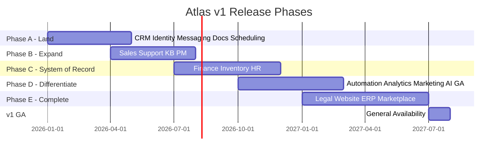

# Atlas Product Requirements Document — Phase 2

## Document Control

| Field | Value |
|-------|-------|
| **Product** | Atlas Business Operating System (BOS) |
| **Version** | 1.0 (v1 GA scope) |
| **Status** | Draft — Phase 2 Documentation |
| **Audience** | Product, Engineering, Design, GTM, Compliance |
| **Prerequisites** | Phase 1 Business & Software Architecture |

---

## 1. Executive Summary

Atlas is a unified **Business Operating System (BOS)** that replaces the fragmented SaaS stack—CRM, ERP, accounting, project management, HR, support, documents, messaging, marketing, legal, analytics, scheduling, knowledge base, website builder, automation, and AI—with a single coherent platform where every module shares identity, data, events, and an AI business brain.

**The core thesis:** Businesses today operate across fifteen to thirty disconnected tools. Data is duplicated, context is lost at every handoff, and AI assistants cannot reason across silos. Atlas eliminates tool sprawl by providing one operating environment where a founder, sales rep, accountant, or support agent works from a unified customer timeline, financial picture, and task queue—augmented by AI that understands and acts on cross-domain business context.

**Phase 2 PRD scope** defines *what* Atlas v1 delivers for customers: feature requirements per module, measurable goals, release phasing aligned with go-to-market waves from [01-business-architecture.md](../phase-1/01-business-architecture.md), and explicit boundaries for v1. This document does not prescribe implementation details—that is covered in [02-system-design.md](./02-system-design.md) and Phase 1 architecture documents.

**v1 target customers:** Solo founders and SMBs (Starter/Growth tiers) as the acquisition wedge; mid-market organizations (Business tier) as expansion; enterprise (Enterprise tier) with SSO, data residency, and compliance add-ons as the retention anchor.

**Differentiation:** Unlike integration hubs (Zapier, Make) or ERP-first suites (NetSuite, SAP), Atlas is **born unified**—one data model, one event fabric, one AI brain. Unlike productivity suites (Notion, Monday), Atlas is **system-of-record capable** for revenue, finance, and operations.

**Investment horizon:** v1 GA targets Q4 2027 with phased module rollout beginning Q1 2026. Success is measured by activation, module attach rate, net revenue retention (NRR), and AI engagement—not feature count alone.

---

## 2. Problem Statement and Market Opportunity

### 2.1 The Problem

Modern businesses face a **tool fragmentation crisis**:

| Pain Point | Business Impact | Current Workaround |
|------------|-----------------|-------------------|
| **Context switching** | 2–4 hours/week lost per employee navigating apps | Browser tab overload, manual copy-paste |
| **Duplicate data entry** | CRM, invoicing, and PM systems disagree on customer names, amounts, dates | Spreadsheet reconciliation, "source of truth" debates |
| **No unified customer view** | Sales closes deals support cannot see; finance invoices accounts sales never updated | Weekly cross-functional meetings, Slack threads |
| **AI limited to one app** | Copilots in CRM cannot see overdue invoices or open support cases | Multiple AI subscriptions with no cross-domain reasoning |
| **Integration tax** | iPaaS connectors break; schema drift; $500–$5K/month integration spend for mid-market | Dedicated ops engineer or consultant |
| **Compliance fragmentation** | Audit trails scattered across vendors; GDPR erasure requires 12+ vendor tickets | Manual compliance spreadsheets |

**Jobs-to-be-done failure:** When a founder asks *"How is my business doing?"* they cannot get a single answer without exporting CSVs from five systems. When a support agent opens a case, they cannot see the customer's payment status, active projects, or contract renewal date without switching tools.

### 2.2 Market Opportunity

| Segment | TAM Indicator | Atlas Wedge |
|---------|---------------|-------------|
| **Global SMB SaaS spend** | $300B+ annually (CRM, productivity, finance tools) | Replace 5–8 point solutions with one platform |
| **Mid-market operations software** | $80B+ (ERP, PSA, vertical SaaS) | Modular expansion from CRM wedge |
| **AI-native business software** | Emerging category; 40%+ YoY growth in AI-assisted workflows | Platform-layer AI brain vs. per-app copilots |
| **Agency / multi-entity** | 2M+ agencies globally managing client orgs | Workspace → organization → team model |

**Competitive whitespace:** No incumbent offers CRM + Finance + PM + Support + AI in a single tenant-isolated platform with event-driven cross-module automation at SMB price points. Salesforce is enterprise-heavy and module-expensive. HubSpot lacks system-of-record finance. QuickBooks lacks CRM depth. Notion/Monday lack financial and compliance rigor.

**Timing:** LLM capability now enables a true business brain; multi-tenant SaaS patterns are mature; buyers are fatigued by SaaS sprawl post-2020 remote-work tool explosion.

---

## 3. Product Vision and Goals

### 3.1 Vision Statement

> **Atlas is the operating system for business**—one platform where every team works, every record connects, and AI understands the whole company well enough to recommend and execute the next right action.

### 3.2 Strategic Goals (12-Month Post-GA)

| Goal | Description |
|------|-------------|
| **G1 — Unified daily use** | ≥60% of weekly active users interact with ≥3 modules per session |
| **G2 — System of record** | ≥40% of Growth+ workspaces use Atlas as primary CRM *and* invoicing source |
| **G3 — AI differentiation** | ≥35% of weekly active users invoke ≥1 AI action per week |
| **G4 — Expansion revenue** | Net revenue retention ≥110% at 18 months post-GA |
| **G5 — Enterprise readiness** | SOC 2 Type II certified; ≥10 enterprise logos with SSO + data residency |

### 3.3 Objectives and Key Results (OKRs) — Year 1

#### OKR 1: Land and Activate

| Key Result | Target | Measurement |
|------------|--------|-------------|
| KR1.1 | 70% of signups complete first value action within 7 days | Activation funnel |
| KR1.2 | 50% of workspaces activate ≥2 modules by day 30 | Module attach rate |
| KR1.3 | Median time-to-first-invoice < 24 hours (Growth tier) | Onboarding telemetry |

#### OKR 2: Deliver Cross-Module Value

| Key Result | Target | Measurement |
|------------|--------|-------------|
| KR2.1 | Quote-to-cash median cycle time < 5 days (in-platform) | Value stream VS-1 |
| KR2.2 | Customer 360° sidebar loads cross-module context in < 2s P95 | Performance monitoring |
| KR2.3 | ≥25% of support cases resolved with KB deflection | VS-3 metrics |

#### OKR 3: AI Business Brain

| Key Result | Target | Measurement |
|------------|--------|-------------|
| KR3.1 | AI action acceptance rate ≥70% for L2–L3 (recommend/draft) | Feedback signals |
| KR3.2 | AI-executed actions (L4) with zero unauthorized mutations | Security audit |
| KR3.3 | Human override rate < 15% for approved automation templates | Agent observability |

#### OKR 4: Platform Reliability and Trust

| Key Result | Target | Measurement |
|------------|--------|-------------|
| KR4.1 | 99.95% API availability (monthly) | SLO dashboards |
| KR4.2 | Zero cross-tenant data leakage incidents | Security incidents |
| KR4.3 | GDPR erasure requests completed within 30 days (100%) | Compliance SLA |

---

## 4. User Personas and Jobs-to-Be-Done

### 4.1 Persona Summary

| ID | Persona | Primary Tier | Core Modules |
|----|---------|--------------|--------------|
| P1 | SMB Owner / Founder | Starter, Growth | CRM, Sales, Finance (light), Scheduling, Website, Analytics |
| P2 | Enterprise Administrator | Enterprise | Identity, Billing, Audit, all modules (admin) |
| P3 | General Employee | All tiers | Messaging, Docs, PM, Scheduling, HR self-service |
| P4 | Accountant / Controller | Business, Enterprise | Finance, Legal, Analytics, Inventory |
| P5 | Sales Representative | Growth, Business | CRM, Sales, Messaging, Scheduling, Marketing |
| P6 | Support Agent | Growth, Business | Support, KB, CRM, Messaging |

### 4.2 Jobs-to-Be-Done by Persona

#### P1: SMB Owner / Founder

| Job | Situation | Desired Outcome | Atlas Feature |
|-----|-----------|-----------------|---------------|
| **J1.1** | Morning check-in | Know pipeline, cash, and tasks in one view | Unified dashboard + AI summary |
| **J1.2** | New lead arrives | Capture, qualify, and schedule follow-up without three apps | CRM lead + Scheduling + AI routing |
| **J1.3** | Close a deal | Send quote and invoice from same customer record | Sales → Finance quote-to-cash |
| **J1.4** | Publish web presence | Launch landing page tied to lead capture | Website Builder + CRM forms |

#### P2: Enterprise Administrator

| Job | Situation | Desired Outcome | Atlas Feature |
|-----|-----------|-----------------|---------------|
| **J2.1** | Onboard 500 users | Provision via SCIM, assign org/team roles | SSO/SCIM + RBAC |
| **J2.2** | Audit access | Prove who accessed what financial record when | Immutable audit log |
| **J2.3** | EU subsidiary compliance | Keep EU org data in EU region | Organization-level data residency |

#### P3: General Employee

| Job | Situation | Desired Outcome | Atlas Feature |
|-----|-----------|-----------------|---------------|
| **J3.1** | Start workday | See prioritized tasks across PM, messages, calendar | Unified inbox + AI prioritization |
| **J3.2** | Collaborate on document | Co-edit with version history and permissions | Docs module |
| **J3.3** | Request time off | Submit and track approval without HR portal hunt | HR self-service + workflow |

#### P4: Accountant / Controller

| Job | Situation | Desired Outcome | Atlas Feature |
|-----|-----------|-----------------|---------------|
| **J4.1** | Month-end close | Reconcile AR/AP and post accruals with audit trail | Finance GL + event-sourced ledger |
| **J4.2** | Multi-currency invoice | Bill in EUR, report in USD with correct FX | Multi-currency native |
| **J4.3** | Detect anomaly | Flag unusual journal entry before posting | AI anomaly detection |

#### P5: Sales Representative

| Job | Situation | Desired Outcome | Atlas Feature |
|-----|-----------|-----------------|---------------|
| **J5.1** | Manage pipeline | Update deals mobile-first with minimal admin | CRM pipeline + mobile |
| **J5.2** | Send quote fast | Generate quote from opportunity in < 5 minutes | Sales quotes + templates |
| **J5.3** | Follow up at scale | AI-drafted emails personalized to account history | AI draft + CRM timeline |

#### P6: Support Agent

| Job | Situation | Desired Outcome | Atlas Feature |
|-----|-----------|-----------------|---------------|
| **J6.1** | Open case | See full customer history without leaving ticket | Customer 360° sidebar |
| **J6.2** | Resolve quickly | Suggested KB articles and reply drafts | AI deflection + draft |
| **J6.3** | Escalate billing issue | Link case to invoice and account owner | Cross-module linking |

---

## 5. Feature Requirements by Module

Requirements use **MoSCoW** priority within each release wave. **Must** = blocking for wave GA; **Should** = expected but deferrable; **Could** = nice-to-have; **Won't** = explicitly deferred (see Section 9).

**Cross-cutting requirements (all modules):**
- Multi-tenant isolation at organization level
- Role-based access control per module action
- Audit log for all mutations
- REST API + GraphQL read paths for web UI
- Full-text search integration
- AI copilot context injection where applicable
- Mobile-responsive web UI (native mobile apps out of v1 scope)
- Export (CSV/JSON) at Growth tier and above

---

### 5.1 CRM (Customer Relationship Management)

**Bounded context:** Customer  
**Release wave:** Wave 1 (Land)

| ID | Requirement | Priority | Acceptance Criteria |
|----|-------------|----------|---------------------|
| CRM-001 | Account and contact management | Must | CRUD accounts/contacts with hierarchy (parent account), duplicate detection on email |
| CRM-002 | Lead capture and conversion | Must | Lead → contact → opportunity conversion preserves history |
| CRM-003 | Opportunity pipeline | Must | Kanban and list views; customizable stages; weighted forecast |
| CRM-004 | Activity timeline | Must | Calls, emails, meetings, notes on account/contact; unified chronological feed |
| CRM-005 | Customer 360° view | Must | Sidebar aggregates CRM, Sales, Support, Finance summary (eventual consistency ≤5s) |
| CRM-006 | Lead scoring | Should | Rule-based scoring in Wave 1; AI scoring in Wave 4 |
| CRM-007 | Custom fields | Must | ≥20 custom field types per entity; validation rules |
| CRM-008 | Import/export | Must | CSV import with mapping; duplicate handling |
| CRM-009 | Segmentation and lists | Should | Static and dynamic lists based on field criteria |
| CRM-010 | Account health score | Could | Composite score from support, payment, engagement (Wave 4) |

---

### 5.2 Sales (Revenue Operations)

**Bounded context:** Commercial  
**Release wave:** Wave 2 (Expand)

| ID | Requirement | Priority | Acceptance Criteria |
|----|-------------|----------|---------------------|
| SAL-001 | Product and price book | Must | Products, price lists, volume discounts |
| SAL-002 | Quote generation | Must | PDF quote from opportunity; approval workflow optional |
| SAL-003 | Quote to order conversion | Must | One-click convert; line items preserved |
| SAL-004 | Order management | Must | Order lifecycle: draft → confirmed → fulfilled → cancelled |
| SAL-005 | Sales forecasting | Should | Pipeline-weighted and commit categories |
| SAL-006 | Commission tracking | Could | Basic commission rules (Wave 4) |
| SAL-007 | CPQ (configure-price-quote) | Won't | v1 — simple quotes only |
| SAL-008 | E-signature on quotes | Should | Integration with Legal module or DocuSign |
| SAL-009 | Recurring revenue / subscriptions | Should | Link orders to billing schedules |

---

### 5.3 Finance (Financial Management)

**Bounded context:** Ledger  
**Release wave:** Wave 3 (System of Record)

| ID | Requirement | Priority | Acceptance Criteria |
|----|-------------|----------|---------------------|
| FIN-001 | Chart of accounts | Must | Multi-level COA; industry templates |
| FIN-002 | Accounts receivable | Must | Invoices, credit notes, payment recording |
| FIN-003 | Accounts payable | Must | Bills, vendor management, payment runs |
| FIN-004 | General ledger and journal entries | Must | Double-entry; balanced constraint enforced |
| FIN-005 | Multi-currency | Must | Transaction currency + base currency; daily FX rates |
| FIN-006 | Invoice from order | Must | Idempotent invoice creation on `order.confirmed` event |
| FIN-007 | Payment gateway integration | Must | Stripe primary; record payments against invoices |
| FIN-008 | Financial reporting | Must | P&L, balance sheet, AR aging; export PDF/CSV |
| FIN-009 | Budgeting | Should | Department budgets with variance alerts |
| FIN-010 | Bank reconciliation | Should | CSV import + matching rules |
| FIN-011 | Multi-entity consolidation | Could | Enterprise add-on (Wave 5) |
| FIN-012 | Tax engine (global) | Won't | v1 — manual tax lines; US/EU templates only |

---

### 5.4 HR (Human Capital)

**Bounded context:** Workforce  
**Release wave:** Wave 3

| ID | Requirement | Priority | Acceptance Criteria |
|----|-------------|----------|---------------------|
| HR-001 | Employee records | Must | Profile, position, manager, start date |
| HR-002 | Org chart | Must | Interactive hierarchy; drag-drop reporting lines |
| HR-003 | Time-off requests | Must | Accrual policies; approval workflow |
| HR-004 | Onboarding checklist | Should | Template tasks on `employee.hired` event |
| HR-005 | Payroll integration | Should | Export to Gusto/ADP; not native payroll in v1 |
| HR-006 | Performance reviews | Could | Wave 5 |
| HR-007 | Benefits administration | Won't | v1 |
| HR-008 | HIPAA-scoped fields | Should | Enterprise healthcare add-on; field-level encryption |

---

### 5.5 PM (Project Management)

**Bounded context:** Delivery  
**Release wave:** Wave 2

| ID | Requirement | Priority | Acceptance Criteria |
|----|-------------|----------|---------------------|
| PM-001 | Projects and tasks | Must | Projects with milestones; tasks with assignees, due dates |
| PM-002 | Board and list views | Must | Kanban, list, timeline (Gantt basic) |
| PM-003 | Time tracking | Should | Time entries billable flag; export to Finance |
| PM-004 | Resource allocation | Should | View workload by person across projects |
| PM-005 | Project templates | Should | Industry templates (professional services) |
| PM-006 | Dependencies | Should | Finish-to-start task dependencies |
| PM-007 | Critical path / advanced PM | Could | Wave 5 |
| PM-008 | Link project to opportunity/order | Must | Revenue attribution to project |

---

### 5.6 Support (Customer Service)

**Bounded context:** Service  
**Release wave:** Wave 2

| ID | Requirement | Priority | Acceptance Criteria |
|----|-------------|----------|---------------------|
| SUP-001 | Case/ticket management | Must | Create, assign, prioritize, resolve cases |
| SUP-002 | SLA policies | Must | First response and resolution targets; breach alerts |
| SUP-003 | Queues and routing | Must | Round-robin and skill-based routing |
| SUP-004 | Omnichannel intake | Should | Email, web form, in-app; chat in Wave 4 |
| SUP-005 | Customer 360° in case view | Must | CRM account, orders, invoices visible in sidebar |
| SUP-006 | Canned responses | Must | Macros with variable substitution |
| SUP-007 | CSAT surveys | Should | Post-resolution survey; NPS optional |
| SUP-008 | AI suggested replies | Should | Wave 4 — draft with human approval |

---

### 5.7 Docs (Document Management)

**Bounded context:** Content  
**Release wave:** Wave 1

| ID | Requirement | Priority | Acceptance Criteria |
|----|-------------|----------|---------------------|
| DOC-001 | File upload and storage | Must | S3-backed; 100MB single file default |
| DOC-002 | Folder hierarchy | Must | Nested folders; org-scoped permissions |
| DOC-003 | Version history | Must | Major versions; restore previous |
| DOC-004 | Real-time co-editing | Should | For markdown/rich text docs (not binary) |
| DOC-005 | Link to CRM/PM entities | Must | Attach docs to accounts, projects, cases |
| DOC-006 | Retention policies | Should | Auto-archive after configurable period |
| DOC-007 | OCR / AI summarization | Could | Wave 4 |
| DOC-008 | DMS legal hold | Should | Enterprise — freeze docs under litigation hold |

---

### 5.8 Messaging (Internal Communications)

**Bounded context:** Communication  
**Release wave:** Wave 1

| ID | Requirement | Priority | Acceptance Criteria |
|----|-------------|----------|---------------------|
| MSG-001 | Channels and DMs | Must | Public/private channels; 1:1 and group DMs |
| MSG-002 | Real-time delivery | Must | WebSocket; <500ms P95 delivery in-region |
| MSG-003 | Threading | Must | Thread replies; unread counts |
| MSG-004 | File sharing in messages | Must | Inline previews for images/PDF |
| MSG-005 | @mentions and notifications | Must | Push to unified notification center |
| MSG-006 | Search messages | Must | Full-text via OpenSearch |
| MSG-007 | Integrations / bots | Should | Incoming webhooks; bot framework Wave 4 |
| MSG-008 | External guest access | Could | Wave 5 — client channels |

---

### 5.9 Marketing (Campaign Management)

**Bounded context:** Campaign  
**Release wave:** Wave 4

| ID | Requirement | Priority | Acceptance Criteria |
|----|-------------|----------|---------------------|
| MKT-001 | Email campaigns | Must | Drag-drop editor; send to CRM segments |
| MKT-002 | Audience segmentation | Must | Dynamic segments from CRM fields |
| MKT-003 | Campaign analytics | Must | Open/click rates; conversion attribution to opportunities |
| MKT-004 | Marketing automation sequences | Should | Multi-step drips triggered by CRM events |
| MKT-005 | Landing page integration | Should | Website Builder forms → CRM leads |
| MKT-006 | SMS campaigns | Could | Twilio integration |
| MKT-007 | Ad platform sync | Won't | v1 |

---

### 5.10 Inventory (Supply Chain)

**Bounded context:** Stock  
**Release wave:** Wave 3

| ID | Requirement | Priority | Acceptance Criteria |
|----|-------------|----------|---------------------|
| INV-001 | SKU and product catalog | Must | SKU, barcode, unit of measure |
| INV-002 | Warehouse locations | Must | Multi-location stock levels |
| INV-003 | Stock movements | Must | Receive, transfer, adjust with audit |
| INV-004 | Reservation on order confirm | Must | Reserve inventory; release on cancel |
| INV-005 | Reorder points | Should | Low-stock alerts; PO suggestions |
| INV-006 | Costing (FIFO average) | Should | COGS posting to Finance on shipment |
| INV-007 | Manufacturing / BOM | Won't | v1 |
| INV-008 | Serial/lot tracking | Could | Enterprise |

---

### 5.11 Legal (Contract & Compliance)

**Bounded context:** Obligation  
**Release wave:** Wave 5

| ID | Requirement | Priority | Acceptance Criteria |
|----|-------------|----------|---------------------|
| LEG-001 | Contract templates | Must | Merge fields from CRM/HR entities |
| LEG-002 | E-signature | Must | Native or DocuSign; audit trail |
| LEG-003 | Obligation tracking | Must | Renewal dates, notice periods; alerts |
| LEG-004 | Clause library | Should | Searchable clause repository |
| LEG-005 | Contract linked to account/order | Must | 360° visibility |
| LEG-006 | AI contract review | Could | Wave 5+ — risk flagging |
| LEG-007 | Full CLM lifecycle | Won't | v1 — template + sign + track only |

---

### 5.12 Analytics (Business Intelligence)

**Bounded context:** Insight  
**Release wave:** Wave 4

| ID | Requirement | Priority | Acceptance Criteria |
|----|-------------|----------|---------------------|
| ANA-001 | Prebuilt dashboards | Must | Sales, finance, support, HR starter dashboards |
| ANA-002 | Custom reports | Must | Drag-drop dimensions/metrics; save and share |
| ANA-003 | Semantic layer | Must | Conformed dimensions (customer, product, time) |
| ANA-004 | Scheduled report delivery | Should | Email PDF/CSV on schedule |
| ANA-005 | Embedded analytics API | Could | Partner embed |
| ANA-006 | Real-time dashboards | Should | <30s data freshness for key metrics |
| ANA-007 | Data warehouse export | Won't | v1 — BigQuery/Snowflake sync deferred |

---

### 5.13 Website Builder (Digital Presence)

**Bounded context:** Presence  
**Release wave:** Wave 5

| ID | Requirement | Priority | Acceptance Criteria |
|----|-------------|----------|---------------------|
| WEB-001 | Page builder | Must | Drag-drop sections; responsive preview |
| WEB-002 | Custom domains | Must | SSL auto-provision; DNS instructions |
| WEB-003 | Forms → CRM leads | Must | Form submission creates lead with attribution |
| WEB-004 | Templates | Must | ≥10 industry templates |
| WEB-005 | Blog / CMS | Should | Basic blog posts |
| WEB-006 | E-commerce checkout | Won't | v1 — use Sales + external checkout |
| WEB-007 | A/B testing | Could | Wave 5+ |

---

### 5.14 Scheduling (Time & Calendar)

**Bounded context:** Calendar  
**Release wave:** Wave 1

| ID | Requirement | Priority | Acceptance Criteria |
|----|-------------|----------|---------------------|
| SCH-001 | Personal and team calendars | Must | Day/week/month views |
| SCH-002 | Booking links | Must | Public booking page; CRM lead capture optional |
| SCH-003 | Google/Microsoft sync | Must | Two-way sync OAuth |
| SCH-004 | Resource booking | Should | Rooms, equipment |
| SCH-005 | Round-robin team scheduling | Should | Distribute bookings across team |
| SCH-006 | Payment on booking | Could | Stripe deposit for services |
| SCH-007 | Group scheduling (find time) | Could | Wave 4 |

---

### 5.15 Knowledge Base (Self-Service Content)

**Bounded context:** Knowledge  
**Release wave:** Wave 2

| ID | Requirement | Priority | Acceptance Criteria |
|----|-------------|----------|---------------------|
| KB-001 | Article authoring | Must | Rich text, categories, tags |
| KB-002 | Public help center | Must | Branded subdomain; SEO-friendly URLs |
| KB-003 | Search | Must | Full-text + semantic (Wave 4) |
| KB-004 | Article feedback | Must | Helpful/not helpful; deflection tracking |
| KB-005 | Link from support cases | Must | Suggested articles in case sidebar |
| KB-006 | Multi-language articles | Should | i18n content variants |
| KB-007 | Community forums | Won't | v1 |

---

### 5.16 Automation (Workflow Engine)

**Bounded context:** Orchestration  
**Release wave:** Wave 4

| ID | Requirement | Priority | Acceptance Criteria |
|----|-------------|----------|---------------------|
| AUT-001 | Visual workflow builder | Must | Triggers, conditions, actions across modules |
| AUT-002 | Event triggers | Must | Subscribe to integration events (e.g., `lead.created`) |
| AUT-003 | Approval steps | Must | Human approval with timeout and escalation |
| AUT-004 | Prebuilt templates | Must | ≥20 templates (onboarding, quote approval, case escalation) |
| AUT-005 | Error handling and retry | Must | Failed step retry; DLQ visibility |
| AUT-006 | Webhook actions | Should | Outbound HTTP with signing |
| AUT-007 | Custom code steps | Could | Sandboxed JS — Wave 5 |
| AUT-008 | Cross-org workflows | Won't | v1 |

---

### 5.17 AI (Business Brain / Intelligence)

**Bounded context:** Intelligence  
**Release wave:** Wave 4 (GA)

| ID | Requirement | Priority | Acceptance Criteria |
|----|-------------|----------|---------------------|
| AI-001 | Universal copilot | Must | Persistent panel; module-aware context |
| AI-002 | Semantic search (L0) | Must | Cross-module search with citations |
| AI-003 | Analysis and insights (L1) | Must | "Summarize account health" with data grounding |
| AI-004 | Recommendations (L2) | Must | Suggested next actions with rationale |
| AI-005 | Drafts (L3) | Must | Email, reply, memo drafts; human edit before send |
| AI-006 | Governed execution (L4) | Must | Tool use via ACL; permission-inherited from user |
| AI-007 | Human-in-the-loop | Must | Mandatory approval for financial postings > threshold |
| AI-008 | Proactive alerts | Should | Background agents for anomaly, SLA risk |
| AI-009 | Tenant isolation | Must | Zero cross-tenant retrieval; audit every inference |
| AI-010 | Usage metering | Must | Token/tool billing per tier allowance |
| AI-011 | No training on customer data | Must | Default opt-out; enterprise opt-in only |
| AI-012 | Full autonomy (L5) | Could | Policy-gated; Enterprise |

---

## 6. Non-Functional Requirements

### 6.1 Performance

| NFR ID | Requirement | Target |
|--------|-------------|--------|
| PERF-001 | API read latency (P95) | < 200ms in-region, excluding reports |
| PERF-002 | API write latency (P95) | < 500ms |
| PERF-003 | Web app LCP | < 2.5s on 4G |
| PERF-004 | Search query (P95) | < 300ms |
| PERF-005 | Real-time message delivery (P95) | < 500ms |
| PERF-006 | Customer 360° composite load (P95) | < 2s |
| PERF-007 | AI copilot first token (P95) | < 3s streaming |
| PERF-008 | Report generation (standard) | < 30s for ≤100K rows |

### 6.2 Security

| NFR ID | Requirement | Target |
|--------|-------------|--------|
| SEC-001 | Encryption at rest | AES-256 all data stores |
| SEC-002 | Encryption in transit | TLS 1.3 minimum |
| SEC-003 | Authentication | OAuth2/OIDC; MFA for Business+ |
| SEC-004 | Authorization | RBAC + ABAC policies; fail closed |
| SEC-005 | Tenant isolation | RLS + application enforcement; annual pen test |
| SEC-006 | Secrets management | Vault/Secrets Manager; no secrets in code |
| SEC-007 | Audit logging | 100% mutation coverage; tamper-evident |
| SEC-008 | Vulnerability SLA | Critical patched within 72 hours |

### 6.3 Scalability

| NFR ID | Requirement | Target |
|--------|-------------|--------|
| SCL-001 | Organizations | 1M+ without architecture change |
| SCL-002 | Concurrent users per org | 10,000+ |
| SCL-003 | API throughput | 50K RPS aggregate per region at scale |
| SCL-004 | Event processing | 100K events/sec peak (Kafka) |
| SCL-005 | Storage per workspace | 10TB+ (tiered) |
| SCL-006 | Horizontal scaling | Stateless API/workers; Karpenter autoscale |

### 6.4 Availability and Reliability

| NFR ID | Requirement | Target |
|--------|-------------|--------|
| AVL-001 | API availability | 99.95% monthly (Business+); 99.9% Starter |
| AVL-002 | RPO (regional) | < 1 minute critical metadata |
| AVL-003 | RTO (regional failover) | < 15 minutes |
| AVL-004 | Backup frequency | Continuous WAL; daily snapshots |
| AVL-005 | Idempotency | All mutating APIs and event consumers |

### 6.5 Accessibility

| NFR ID | Requirement | Target |
|--------|-------------|--------|
| A11Y-001 | WCAG compliance | WCAG 2.1 Level AA for web UI |
| A11Y-002 | Keyboard navigation | Full keyboard operability |
| A11Y-003 | Screen reader | ARIA labels on interactive components |
| A11Y-004 | Color contrast | 4.5:1 minimum text |
| A11Y-005 | Motion | Respect `prefers-reduced-motion` |

### 6.6 Internationalization (i18n)

| NFR ID | Requirement | Target |
|--------|-------------|--------|
| I18N-001 | UI languages at GA | English, Spanish, French, German, Portuguese |
| I18N-002 | Locale formatting | Dates, numbers, currency per user locale |
| I18N-003 | RTL support | Arabic/Hebrew roadmap post-GA |
| I18N-004 | Content translation | User-generated content not auto-translated v1 |
| I18N-005 | Multi-currency | Finance module native; display currency per user |

### 6.7 Operability

| NFR ID | Requirement | Target |
|--------|-------------|--------|
| OPS-001 | Observability | OpenTelemetry traces; structured logs; RED metrics |
| OPS-002 | Feature flags | Per-workspace and per-org toggles |
| OPS-003 | Zero-downtime deploys | Rolling updates; migration expand-contract |
| OPS-004 | Runbooks | All P1 services documented |

---

## 7. Success Metrics and KPIs

### 7.1 North Star Metric

**Weekly Active Modules per User (WAMU):** Average count of distinct modules used per weekly active user. Target: **≥2.5** by 12 months post-GA.

### 7.2 Acquisition Metrics

| Metric | Definition | Target (12 mo) |
|--------|------------|----------------|
| Signup → Activation (7d) | % completing first value action | 70% |
| CAC payback | Months to recover CAC | < 18 months |
| Free/trial → Paid conversion | % converting after 14-day trial | 25% |

### 7.3 Engagement Metrics

| Metric | Definition | Target (12 mo) |
|--------|------------|----------------|
| DAU/MAU | Daily active / monthly active ratio | ≥0.35 |
| Module attach (30d) | % workspaces with ≥2 modules | 50% |
| Session depth | Modules per session | ≥2.0 median |

### 7.4 Revenue Metrics

| Metric | Definition | Target (12 mo) |
|--------|------------|----------------|
| MRR growth | Month-over-month | 15% early stage |
| NRR | Net revenue retention | 110% |
| Expansion MRR | Upsell + cross-sell | 40% of new MRR |
| AI usage revenue | Metered AI overage | 10% of total MRR |

### 7.5 Product Quality Metrics

| Metric | Definition | Target |
|--------|------------|--------|
| NPS | Net Promoter Score | ≥40 |
| Support CSAT | Post-ticket satisfaction | ≥4.2/5 |
| P1 incident rate | Sev-1 per month | < 2 |
| API error rate | 5xx / total requests | < 0.1% |

### 7.6 AI-Specific KPIs

| Metric | Definition | Target |
|--------|------------|--------|
| AI WAU % | Users with ≥1 AI action/week | 35% |
| Suggestion acceptance | L2/L3 accepted without edit | 70% |
| Unauthorized action rate | AI mutations without permission | 0 |
| Copilot latency P95 | First token | < 3s |

---

## 8. Release Phases (Aligned with GTM)

Release phases map directly to GTM waves in [01-business-architecture.md](../phase-1/01-business-architecture.md). Each phase has a **product milestone** and **commercial milestone**.

### Phase A — Land (Q1–Q2 2026)

**Modules:** CRM, Identity, Messaging, Docs, Scheduling  
**Commercial:** Starter tier GA; Growth early access  
**Milestone criteria:**
- 1,000 beta workspaces
- Activation rate ≥50%
- Daily messaging + CRM use in ≥40% of active workspaces

### Phase B — Expand (Q2–Q3 2026)

**Modules:** Sales, Support, Knowledge Base, PM  
**Commercial:** Growth tier GA  
**Milestone criteria:**
- Quote-to-cash flow operational end-to-end
- Module attach ≥35% at day 30
- First paying customers ≥500

### Phase C — System of Record (Q3–Q4 2026)

**Modules:** Finance, Inventory, HR  
**Commercial:** Business tier launch  
**Milestone criteria:**
- Double-entry ledger audited by external firm
- Stripe payment integration live
- NRR ≥100% on early cohort

### Phase D — Differentiate (Q4 2026–Q1 2027)

**Modules:** Automation, Analytics, Marketing, AI Business Brain GA  
**Commercial:** AI usage metering live; automation overage billing  
**Milestone criteria:**
- AI WAU ≥25% in beta
- ≥20 automation templates shipped
- SOC 2 Type II audit initiated

### Phase E — Complete (Q1–Q2 2027)

**Modules:** Legal, Website Builder, ERP orchestration layer, Marketplace  
**Commercial:** Enterprise tier GA; marketplace partner onboarding  
**Milestone criteria:**
- Full 17-module catalog available
- ≥5 marketplace integrations certified
- Enterprise pilot customers ≥3

### v1 General Availability (Q3 2027)

**Gate criteria (all must pass):**
- All Phase A–E modules at production quality bar
- 99.95% availability demonstrated over 90 days (staging→prod)
- SOC 2 Type II report issued
- Security pen test with zero critical findings
- Documentation Phases 3–5 complete per MASTER_INSTRUCTIONS
- GDPR erasure workflow end-to-end tested

---

## 9. Out of Scope for v1

The following are **explicitly excluded** from Atlas v1 GA to protect quality and focus:

| Category | Out of Scope Item | Rationale | Future Phase |
|----------|-------------------|-----------|--------------|
| **Platform** | Native iOS/Android apps | Web-responsive first; PWA acceptable | v1.5 |
| **Platform** | Offline-first mode | Complexity; limited SMB demand | v2 |
| **Platform** | Self-hosted / on-prem | Cloud SaaS focus | Enterprise roadmap |
| **Finance** | Full global tax engine | Regulatory complexity | v1.5 per region |
| **Finance** | Native payroll processing | Partner integrations sufficient | v2 |
| **Finance** | Multi-entity consolidation | Enterprise-only; defer | v1.5 Enterprise |
| **Sales** | Full CPQ with rules engine | Simple quotes adequate for wedge | v1.5 |
| **Inventory** | Manufacturing BOM/MRP | Vertical-specific | v2 |
| **Marketing** | Ad platform integrations | Not core differentiation | v1.5 |
| **Website** | E-commerce checkout | Use Sales + Stripe externally | v1.5 |
| **Legal** | Full CLM redlining | Template + sign sufficient | v2 |
| **Analytics** | External DW sync (Snowflake) | Export CSV adequate v1 | v1.5 |
| **AI** | Custom model fine-tuning | RAG + prompts sufficient | v2 |
| **AI** | Computer vision / OCR native | Third-party integration | v1.5 |
| **Automation** | Custom code (arbitrary JS) | Security sandbox complexity | v1.5 |
| **Integrations** | Bi-directional Salesforce sync | Competitive; complex | v1.5 partner |
| **Compliance** | HIPAA certification default | HIPAA-ready only | Enterprise add-on |
| **Compliance** | FedRAMP | US public sector | v3 |
| **Marketplace** | Revenue share payouts automation | Manual partner payouts v1 | v1.5 |

---

## 10. Assumptions and Dependencies

### 10.1 Assumptions

| ID | Assumption | Impact if Wrong |
|----|------------|-----------------|
| A-01 | SMB buyers will consolidate tools if migration path is clear | Slower adoption; need stronger import tools |
| A-02 | AI differentiation drives willingness to pay 20%+ premium | Price pressure; AI becomes table stakes only |
| A-03 | Modular monolith supports 1M orgs without full microservices split | Premature extraction cost; performance rework |
| A-04 | Stripe covers 80%+ payment needs for target markets | Regional payment gaps |
| A-05 | LLM API costs decline 20% annually | Margin pressure on AI metering |
| A-06 | Engineering team scales to 80+ by Phase C | Timeline slip on Waves 3–5 |
| A-07 | EU + US regions sufficient for GA | APAC deals delayed |
| A-08 | Customers accept eventual consistency (≤5s) for cross-module views | UX rework for strong consistency |

### 10.2 Dependencies

| ID | Dependency | Owner | Required By |
|----|------------|-------|-------------|
| D-01 | Phase 1 architecture approval | Architecture | Implementation start |
| D-02 | Phase 3 database design complete | Data Team | Phase A implementation |
| D-03 | Phase 4 UI specification | Design | Phase A implementation |
| D-04 | Phase 5 API contracts | API Team | Phase A implementation |
| D-05 | AWS EKS + RDS production accounts | DevOps | Phase A |
| D-06 | Stripe Atlas partnership / Connect | Partnerships | Phase C |
| D-07 | LLM provider agreements (OpenAI, Anthropic) | Legal | Phase D |
| D-08 | SOC 2 auditor engagement | Compliance | Phase D |
| D-09 | Google/Microsoft OAuth calendar APIs | Integrations | Phase A |
| D-10 | OpenSearch managed cluster | DevOps | Phase A |
| D-11 | Kafka MSK cluster | DevOps | Phase A |
| D-12 | Design system (@atlas/ui) | Design | Phase A |

---

## 11. Risks and Mitigations

| Risk ID | Risk | Likelihood | Impact | Mitigation |
|---------|------|------------|--------|------------|
| R-01 | **Scope creep** across 17 modules delays GA | High | High | Strict wave gates; MoSCoW per phase; Won't list enforced |
| R-02 | **Cross-module data consistency** bugs erode trust | Medium | High | Event-driven integration tests; CQRS staleness indicators; saga compensation |
| R-03 | **AI hallucination** causes business harm | Medium | Critical | RAG grounding; citations; human-in-the-loop for mutations; read-only analyst agents |
| R-04 | **Tenant data leakage** | Low | Critical | RLS + app middleware; annual pen test; bug bounty |
| R-05 | **Finance module correctness** failures | Medium | Critical | Double-entry invariants; external audit; staged rollout |
| R-06 | **Migration friction** from incumbent CRM | High | Medium | CSV import; dedicated onboarding; concierge for Business+ |
| R-07 | **LLM cost overrun** vs. pricing model | Medium | Medium | Model routing (fast/cheap vs reasoning); per-tenant budgets; caching |
| R-08 | **Kafka/infra operational complexity** | Medium | Medium | Managed MSK; runbooks; start with modular monolith simplicity |
| R-09 | **Enterprise deals demand out-of-scope features** | High | Medium | Enterprise add-on track; professional services; clear roadmap communication |
| R-10 | **Competitor response** (HubSpot/Salesforce bundling) | Medium | Medium | AI-native differentiation; faster iteration; SMB pricing |
| R-11 | **Regulatory change** (AI Act, GDPR) | Medium | Medium | Compliance workstream; legal review per AI feature |
| R-12 | **Key person / hiring risk** | Medium | High | Documentation-first culture; modular ownership |

---

## 12. Appendix

### 12.1 Glossary

| Term | Definition |
|------|------------|
| **Workspace** | Top-level billing and identity container |
| **Organization** | Data isolation boundary within workspace |
| **Team** | RBAC scope within organization |
| **Bounded context** | DDD module boundary with own ubiquitous language |
| **Integration event** | Immutable cross-module fact published after commit |
| **AI capability tier** | L0–L5 scale from retrieve to automate |

### 12.2 Cross-References

| Document | Relationship |
|----------|--------------|
| [01-business-architecture.md](../phase-1/01-business-architecture.md) | GTM waves, personas, monetization |
| [02-software-architecture.md](../phase-1/02-software-architecture.md) | Module boundaries, events |
| [04-ai-architecture.md](../phase-1/04-ai-architecture.md) | AI capability tiers, guardrails |
| [02-system-design.md](./02-system-design.md) | Technical design for PRD requirements |
| [MASTER_INSTRUCTIONS.md](../../MASTER_INSTRUCTIONS.md) | Documentation phase gates |

### 12.3 Document History

| Version | Date | Author | Changes |
|---------|------|--------|---------|
| 1.0.0 | 2026-06-30 | Product & Architecture | Initial Phase 2 PRD |

---

*Document owner: Head of Product · Review cadence: Monthly during active development; quarterly post-GA*