# Atlas System Design — Phase 2

## Document Control

| Field | Value |
|-------|-------|
| **Product** | Atlas Business Operating System |
| **Version** | 1.0 |
| **Status** | Draft — Phase 2 Documentation |
| **Audience** | Engineering, DevOps, Security, SRE |
| **Prerequisites** | Phase 1 Architecture, [01-prd.md](./01-prd.md) |

---

## 1. Purpose and Scope

This document translates the product requirements in [01-prd.md](./01-prd.md) into a **concrete system design**: component topology, interaction patterns, data flows, critical-path sequences, technology choices, integration boundaries, failure handling, and capacity planning.

It extends Phase 1 architecture documents with implementation-oriented detail sufficient for engineering teams to begin Phase 3–5 documentation (database, UI, API contracts) without ambiguity.

**In scope:**
- High-level and component-level architecture
- Data flow and sequence diagrams for four critical flows
- Technology stack with rationale
- Internal and external integration points
- Failure modes, recovery strategies, and SLO impact
- Capacity estimates for v1 scale targets

**Out of scope:**
- Per-table schemas (Phase 3)
- OpenAPI operation definitions (Phase 5)
- UI wireframes (Phase 4)
- Runbook step-by-step procedures (Phase 2 deployment strategy doc)

---

## 2. Design Principles

| Principle | System Design Implication |
|-----------|---------------------------|
| **Modular monolith first** | Single deployable API with strict module boundaries; extract Go services only when metrics justify |
| **API-first** | Gateway routes to REST/GraphQL; UI is a client |
| **Event-first integration** | Cross-module writes via transactional outbox + Kafka |
| **Tenant isolation absolute** | `tenant_id` + RLS on every path; regional data pinning |
| **Fail closed** | AuthZ denial default; no partial mutations |
| **Idempotent by default** | HTTP idempotency keys; event consumer deduplication |
| **Observable** | OpenTelemetry everywhere; correlation ID propagation |
| **AI as platform service** | Intelligence namespace; tool calls via ACL to modules |

---

## 3. High-Level System Architecture

Atlas v1 deploys as a **multi-region active-active** SaaS platform on AWS, with symmetric regional stacks and organization-level data residency.

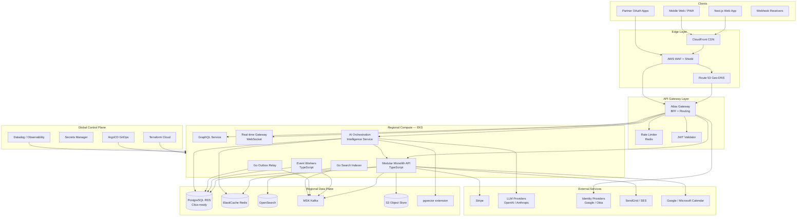

### 3.1 Regional Topology

Each active region (`us-east-1`, `eu-west-1`) contains a **full stack**: gateway, compute, OLTP, cache, search, events, and object storage. Organizations are pinned to a `home_region` at provisioning; 99%+ of requests execute locally.

| Layer | Components | Notes |
|-------|------------|-------|
| **Edge** | CloudFront, WAF, Shield | Static assets, DDoS protection |
| **Ingress** | AWS ALB + Istio service mesh | mTLS internal; JWT at gateway |
| **Application** | API monolith, workers, AI, Go services | Karpenter autoscaling |
| **Data** | RDS PostgreSQL, ElastiCache, OpenSearch, MSK, S3 | No cross-region OLTP |
| **Observability** | Datadog agents, OTel collectors | Global dashboards |

---

## 4. Component Architecture

### 4.1 Component Catalog

| Component | Technology | Responsibility | Scaling Unit |
|-----------|------------|----------------|--------------|
| **Atlas Gateway** | Node.js / Kong | Routing, auth, rate limits, correlation IDs | Horizontal pods |
| **Modular Monolith API** | TypeScript (NestJS-style) | All bounded context modules | Horizontal pods |
| **GraphQL Service** | Apollo Server | Composite queries for web | Horizontal pods |
| **Real-time Gateway** | WebSocket (Socket.io/ws) | Messaging, notifications, presence | Sticky sessions + Redis pub/sub |
| **Worker Fleet** | TypeScript | Event consumers, projections, webhooks | Kafka consumer groups |
| **Outbox Relay** | Go | Poll/CDC outbox → Kafka | Single leader per shard |
| **Search Indexer** | Go | Events → OpenSearch documents | Partition by tenant hash |
| **AI Orchestration** | TypeScript | LLM routing, RAG, tools, guardrails | Per-tenant fair queue |
| **Web App** | Next.js 15 App Router | SSR + client UI | CDN + Vercel-style or EKS |
| **Platform Package** | TypeScript | Auth, logging, idempotency, tracing | Library |
| **Shared Kernel** | TypeScript | IDs, Money, EventEnvelope | Library |

### 4.2 Modular Monolith Internal Structure

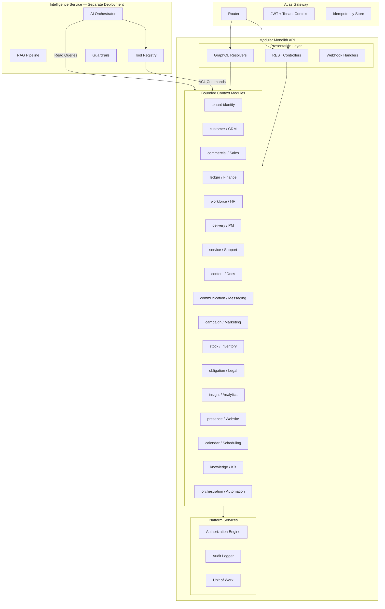

### 4.3 Component Interaction — Request Path

```mermaid
sequenceDiagram
    participant C as Client
    participant CDN as CloudFront
    participant GW as Gateway
    participant API as Monolith API
    participant AUTHZ as AuthZ Engine
    participant MOD as Domain Module
    participant PG as PostgreSQL
    participant OB as Outbox
    participant K as Kafka

    C->>CDN: HTTPS Request
    CDN->>GW: Forward API call
    GW->>GW: Validate JWT, extract tenant/org
    GW->>GW: Check rate limit (Redis)
    GW->>GW: Idempotency check (if mutating)
    GW->>API: Request + X-Atlas-Tenant-Id
    API->>AUTHZ: Evaluate policy
    AUTHZ-->>API: Allow / Deny
    API->>MOD: Execute use case
    MOD->>PG: BEGIN; SET LOCAL app.tenant_id
    MOD->>PG: Persist aggregate + outbox
    MOD->>PG: COMMIT
    API-->>GW: Response DTO
    GW-->>C: JSON response

    Note over OB,K: Async path
    OB->>K: Relay publishes event
```

---

## 5. Data Flow Diagrams

### 5.1 Write Path — Command to Event

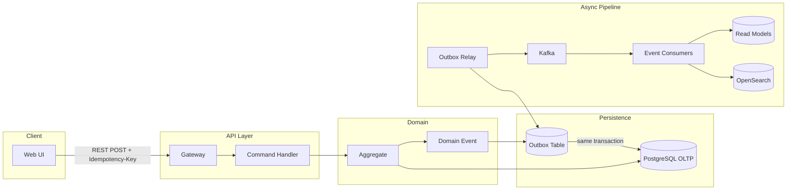

### 5.2 Read Path — Query with CQRS

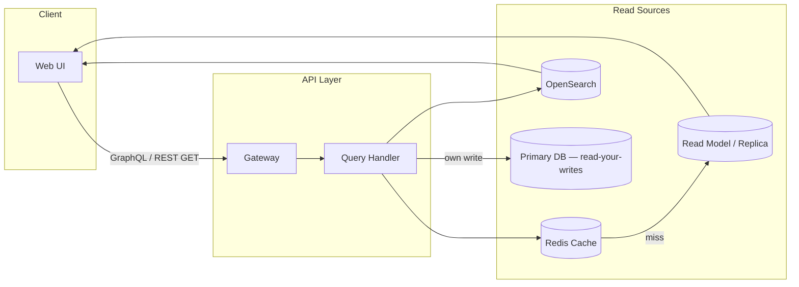

### 5.3 Cross-Module Integration Flow

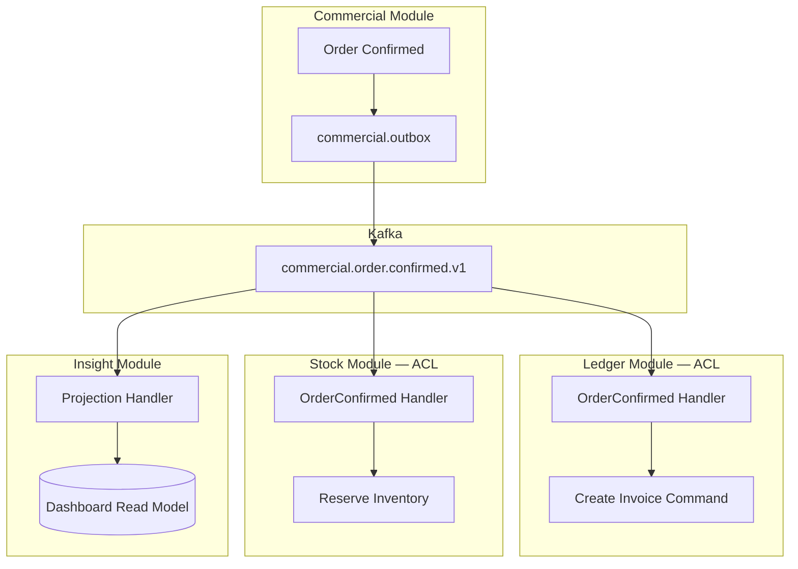

### 5.4 AI Context and Action Flow

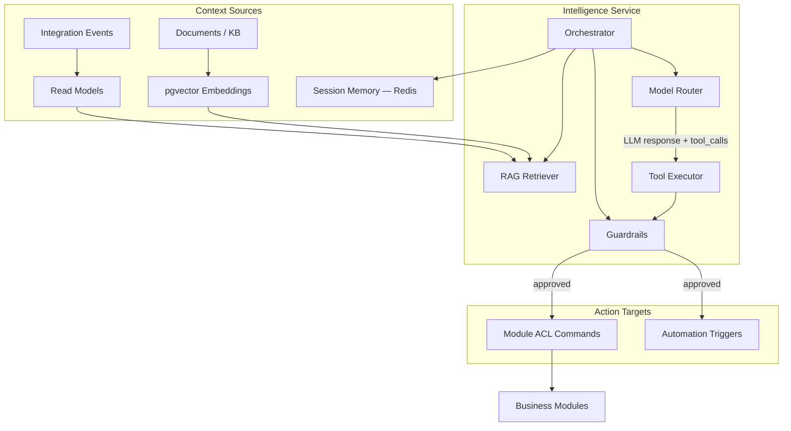

---

## 6. Sequence Diagrams — Critical Flows

### 6.1 User Signup and Organization Provisioning

**Trigger:** New user registers via email or SSO.  
**Outcome:** Workspace, organization, default team, trial entitlements, and module scaffolding created.

```mermaid
sequenceDiagram
    participant U as User
    participant WEB as Next.js Web
    participant GW as Gateway
    participant TI as Tenant-Identity Module
    participant BE as Billing Module
    participant PG as PostgreSQL
    participant K as Kafka
    participant PROV as Provisioning Workers
    participant EMAIL as SendGrid

    U->>WEB: Submit signup form
    WEB->>GW: POST /v1/auth/register
    GW->>TI: RegisterUser command
    TI->>PG: Create user (pending verification)
    TI->>PG: Create workspace + org + default team
    TI->>PG: Outbox: tenant.organization.created.v1
    TI->>PG: COMMIT
    TI-->>GW: 201 Created + verification pending
    GW-->>WEB: Response
    WEB-->>U: Verify email prompt

    TI->>EMAIL: Send verification email

    U->>WEB: Click verification link
    WEB->>GW: POST /v1/auth/verify
    GW->>TI: VerifyEmail command
    TI->>PG: Activate user; assign Owner role
    TI->>PG: Outbox: tenant.user.verified.v1
    TI->>PG: COMMIT

    K->>BE: Consume organization.created
    BE->>PG: Create subscription (trial)
    BE->>PG: Set entitlements (Starter modules)

    K->>PROV: Consume organization.created
    PROV->>PG: Seed CRM pipeline stages
    PROV->>PG: Seed default doc folders
    PROV->>PG: Seed calendar settings

    BE-->>K: billing.subscription.created.v1
    TI-->>U: Redirect to onboarding wizard
```

**Design notes:**
- Workspace and organization created atomically in Tenant-Identity module
- Downstream provisioning is **eventual** via Kafka consumers (idempotent by `organizationId`)
- SSO signup follows identical flow with `identity_provider` metadata and optional org discovery
- `home_region` assigned from signup geo + compliance selection; immutable without enterprise migration

---

### 6.2 Create Invoice (Order-to-Cash)

**Trigger:** Sales rep confirms order.  
**Outcome:** Invoice created in Ledger, payment link generated, customer timeline updated.

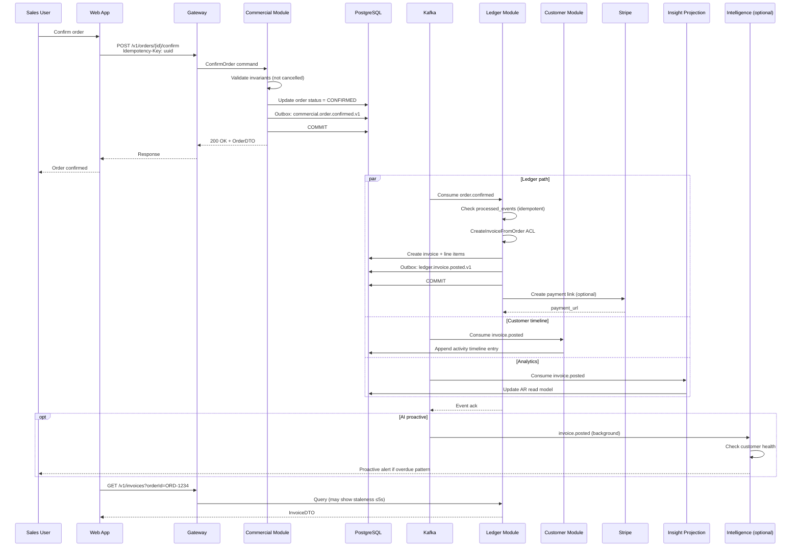

**Design notes:**
- Invoice creation is **idempotent** on `orderId` — duplicate events produce same invoice
- Commercial returns immediately; invoice appears within 5s (eventual consistency SLO)
- Payment link creation is async; failures retry with exponential backoff
- Amounts use `Money` value object; FX rates snapshotted at invoice time

---

### 6.3 AI Agent Action

**Trigger:** User asks copilot to "Create a follow-up task for Acme Corp next Tuesday."  
**Outcome:** Agent plans, validates permissions, executes tool, returns confirmation with audit trail.

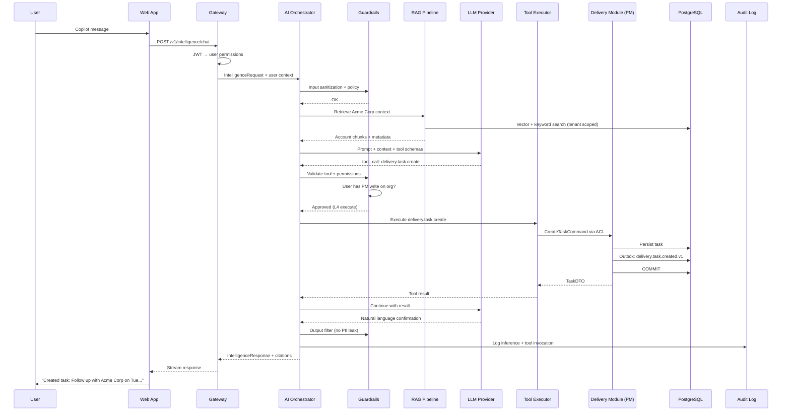

**High-risk variant (human-in-the-loop):**

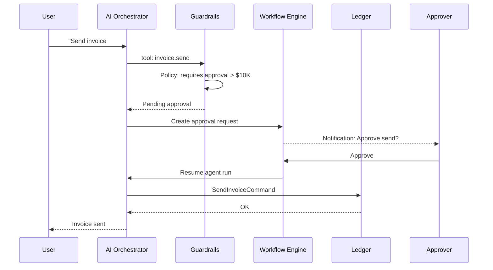

---

### 6.4 Workflow Approval

**Trigger:** Automation workflow reaches approval step (e.g., quote > $50K).  
**Outcome:** Approver notified, decision recorded, workflow resumes or compensates.

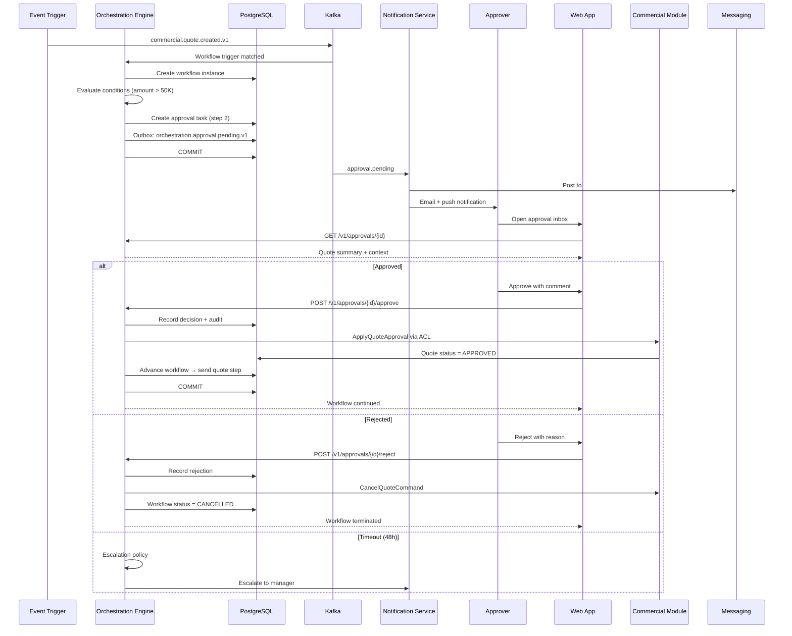

---

## 7. Technology Stack Decisions

### 7.1 Stack Summary

| Layer | Technology | Rationale |
|-------|------------|-----------|
| **Frontend** | Next.js 15, React, TypeScript | SSR/RSC performance; ecosystem; App Router |
| **UI State** | TanStack Query | Cache, optimistic updates, stale-while-revalidate |
| **Design System** | `@atlas/ui` (Radix + Tailwind) | Accessible primitives; consistent tokens |
| **API Gateway** | Kong on EKS (or AWS API GW v2) | Plugin ecosystem: rate limit, JWT, logging |
| **Backend** | TypeScript, Node.js 22 LTS | Team velocity; shared types with frontend |
| **Performance services** | Go 1.22+ | Search indexer, outbox relay — CPU efficiency |
| **OLTP Database** | PostgreSQL 16 (RDS) | ACID, RLS, JSON, pgvector, mature ops |
| **Connection pool** | PgBouncer | Transaction pooling; prevent connection exhaustion |
| **Cache** | Redis 7 (ElastiCache) | Sessions, idempotency, rate limits, pub/sub |
| **Search** | OpenSearch 2.x | Full-text, aggregations, ISM policies |
| **Vector** | pgvector (Phase 1); optional Pinecone at scale | Colocate embeddings with tenant data |
| **Event bus** | Apache Kafka (MSK) | Durable log; replay; stream processing |
| **Low-latency pub/sub** | NATS (optional) | Typing indicators, presence fan-out |
| **Object storage** | AWS S3 | Documents, attachments, exports |
| **Container orchestration** | EKS + Karpenter | Autoscaling; industry standard |
| **Service mesh** | Istio | mTLS, circuit breakers, traffic management |
| **IaC** | Terraform Cloud | Declarative infra; drift detection |
| **GitOps** | ArgoCD | Declarative K8s deployments |
| **CI/CD** | GitHub Actions | Test, build, deploy pipelines |
| **Observability** | OpenTelemetry + Datadog | Traces, metrics, logs unified |
| **Secrets** | AWS Secrets Manager + External Secrets Operator | Rotation; no plaintext in K8s |
| **LLM** | OpenAI + Anthropic (multi-provider) | Model routing; vendor redundancy |
| **Payments** | Stripe | Global coverage; PCI scope minimization |
| **Email** | SendGrid / AWS SES | Transactional + marketing sends |
| **Schema registry** | AWS Glue / Confluent (eval) | Event schema evolution |

### 7.2 Key Architectural Decisions (ADR Summary)

| Decision | Choice | Alternatives Rejected | Rationale |
|----------|--------|----------------------|-----------|
| ADR-001 | Modular monolith | Microservices day one | Ops simplicity; faster Phase A delivery |
| ADR-002 | PostgreSQL schema-per-module | DB per service | Extraction path without connection sprawl |
| ADR-003 | Kafka + transactional outbox | Dual-write to bus | Consistency; proven pattern |
| ADR-004 | REST + GraphQL hybrid | GraphQL-only | Partner REST expectations |
| ADR-005 | Row-level security | App-only isolation | Defense in depth |
| ADR-006 | TypeScript primary | Go/Rust primary | DX; hiring pool; shared types |
| ADR-007 | JWT + gateway validation | Session cookies only | Mobile/partner friendly |
| ADR-008 | Citus-ready sharding | Manual sharding later | `tenant_id` hash from day one |
| ADR-009 | AI as separate K8s deployment | In-process LLM calls | Independent scaling, GPU nodes |
| ADR-010 | AWS primary cloud | GCP-only | MSK, RDS maturity; enterprise sales |

### 7.3 Module-to-Technology Mapping

| Module | Primary Store | Search Index | Events Published | External Integrations |
|--------|---------------|--------------|------------------|----------------------|
| CRM | PostgreSQL `customer.*` | OpenSearch `customers` | `customer.*` | — |
| Sales | PostgreSQL `commercial.*` | OpenSearch `orders` | `commercial.*` | DocuSign |
| Finance | PostgreSQL `ledger.*` | OpenSearch `invoices` | `ledger.*` | Stripe, QuickBooks export |
| HR | PostgreSQL `workforce.*` | OpenSearch `employees` | `workforce.*` | Gusto, ADP |
| PM | PostgreSQL `delivery.*` | OpenSearch `tasks` | `delivery.*` | — |
| Support | PostgreSQL `service.*` | OpenSearch `cases` | `service.*` | Email inbound |
| Docs | PostgreSQL + S3 | OpenSearch `documents` | `content.*` | — |
| Messaging | PostgreSQL + Redis | OpenSearch `messages` | `communication.*` | — |
| Marketing | PostgreSQL | OpenSearch `campaigns` | `campaign.*` | SendGrid |
| Inventory | PostgreSQL `stock.*` | OpenSearch `skus` | `stock.*` | — |
| Legal | PostgreSQL + S3 | OpenSearch `contracts` | `obligation.*` | DocuSign |
| Analytics | PostgreSQL read models | OpenSearch aggregates | — (consumer) | — |
| Website | PostgreSQL + S3 + CDN | OpenSearch `pages` | `presence.*` | — |
| Scheduling | PostgreSQL | — | `calendar.*` | Google, Microsoft |
| KB | PostgreSQL | OpenSearch `articles` | `knowledge.*` | — |
| Automation | PostgreSQL `orchestration.*` | — | `orchestration.*` | Outbound webhooks |
| AI | PostgreSQL + pgvector | Vector index | `intelligence.*` | OpenAI, Anthropic |

---

## 8. Integration Points

### 8.1 Integration Architecture

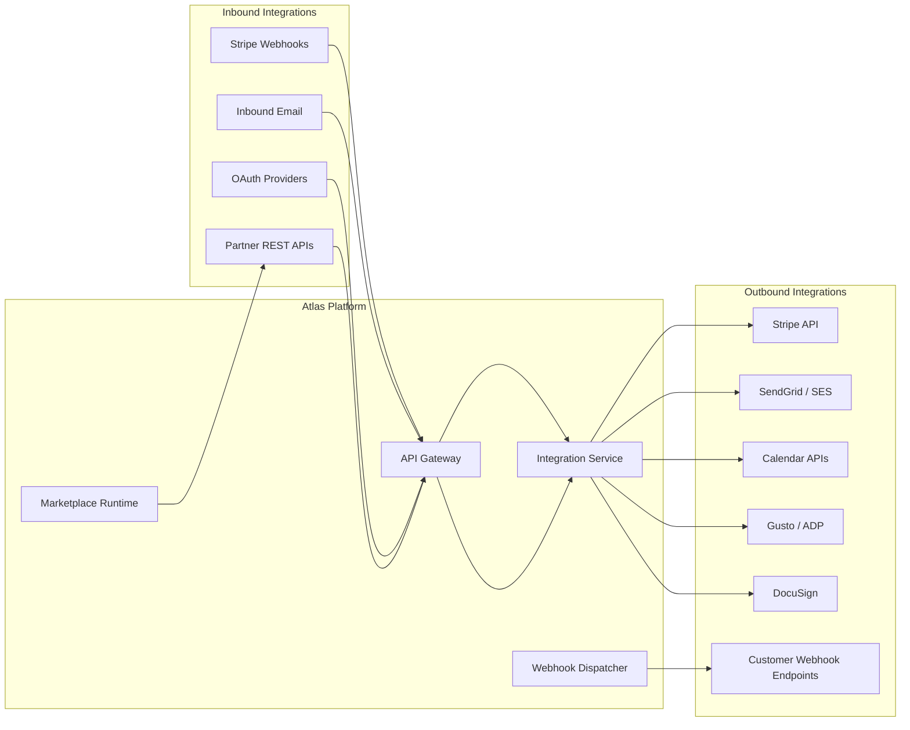

### 8.2 External Integration Catalog

| Integration | Direction | Protocol | Auth | Module | v1 Scope |
|-------------|-----------|----------|------|--------|----------|
| **Stripe** | Bi-directional | REST + Webhooks | API key + webhook signing | Finance | Payments, subscriptions |
| **Google Calendar** | Bi-directional | REST + OAuth2 | OAuth2 | Scheduling | Two-way sync |
| **Microsoft 365 Calendar** | Bi-directional | Graph API | OAuth2 | Scheduling | Two-way sync |
| **SendGrid / SES** | Outbound | REST / SMTP | API key | Messaging, Marketing | Transactional email |
| **Inbound email** | Inbound | SES → S3 → Lambda | — | Support | Case creation |
| **Google / Okta SSO** | Inbound | OIDC | OAuth2/OIDC | Identity | SSO Business+ |
| **SCIM 2.0** | Inbound | REST | Bearer token | Identity | Enterprise provisioning |
| **DocuSign** | Bi-directional | REST + Webhooks | OAuth2 | Legal, Sales | E-sign |
| **Gusto / ADP** | Outbound | REST | OAuth2 | HR | Payroll export |
| **OpenAI / Anthropic** | Outbound | REST | API key | AI | LLM inference |
| **Customer webhooks** | Outbound | HTTPS POST | HMAC signature | Platform | Event notifications |
| **QuickBooks** | Outbound | REST | OAuth2 | Finance | Could — export only |

### 8.3 Marketplace Integration Model (Wave 5)

- Partners publish OAuth apps with scoped permissions
- Atlas Marketplace hosts certified integrations
- Revenue share 70/30 per business architecture
- Certification: security review, API compliance, SLA attestation

### 8.4 Webhook Delivery Architecture

| Aspect | Design |
|--------|--------|
| **Signing** | HMAC-SHA256 with per-endpoint secret |
| **Retry** | Exponential backoff: 1m, 5m, 30m, 2h, 24h (max 5 attempts) |
| **DLQ** | Failed deliveries queryable in admin UI |
| **Idempotency** | `eventId` in payload; documented for receivers |
| **Payload** | CloudEvents 1.0 envelope |

---

## 9. Failure Modes and Recovery

### 9.1 Failure Mode Analysis

| Component | Failure Mode | Detection | User Impact | Recovery | RTO |
|-----------|--------------|-----------|-------------|----------|-----|
| **Gateway** | Pod crash | K8s health check, 5xx rate | API unavailable | Auto-restart; PDB min 2 | < 1 min |
| **API monolith** | DB connection pool exhausted | Pool metrics alert | Slow/errors | Scale pods; PgBouncer tuning | < 5 min |
| **PostgreSQL primary** | Instance failure | RDS Multi-AZ failover | Brief write outage | Automatic failover | < 2 min |
| **PostgreSQL** | Replica lag > 30s | Replication lag metric | Stale reads | Route reads to primary; fix replica | < 15 min |
| **Redis** | Node failure | Cluster health | Rate limit/idempotency degraded | ElastiCache failover | < 1 min |
| **Kafka broker** | Broker down | MSK health | Event delay | MSK auto-recovery | < 5 min |
| **Outbox relay** | Relay stalled | Outbox age alert | Cross-module delay grows | Restart relay; catch-up | < 10 min |
| **Event consumer** | Poison message | DLQ depth | One workflow stuck | Skip to DLQ; manual fix | Case-by-case |
| **OpenSearch** | Cluster yellow/red | Cluster health API | Search degraded | Restore replica; reindex | < 30 min |
| **AI service** | LLM provider outage | Error rate circuit breaker | Copilot unavailable | Fallback provider; graceful message | < 5 min |
| **Stripe** | API outage | Webhook + API errors | Payments blocked | Queue; retry; status page | Provider-dependent |
| **Regional** | Full region loss | R53 health checks | Org in region offline | DR failover playbook | < 15 min |
| **Cross-region proxy** | Latency spike | p99 > 2s | Slow for misrouted orgs | Fix routing; cache home_region | < 30 min |

### 9.2 Cascading Failure Prevention

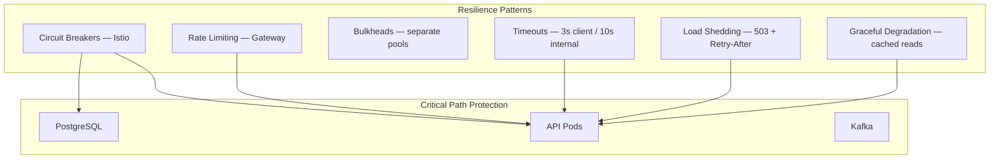

| Pattern | Implementation |
|---------|----------------|
| **Circuit breaker** | Istio outlier detection; 5 consecutive 5xx → eject 30s |
| **Bulkhead** | Separate connection pools for reads vs writes; AI fair-queue per tenant |
| **Timeout budget** | Gateway 30s max; internal chain ≤ 10s |
| **Load shedding** | Return 503 when queue depth > threshold; prioritize auth and reads |
| **Graceful degradation** | Customer 360° shows partial data with staleness badge if Insight lagging |
| **Chaos engineering** | Quarterly game days: pod kill, AZ failure, Kafka pause |

### 9.3 Disaster Recovery Summary

| Scenario | RPO | RTO | Mechanism |
|----------|-----|-----|-----------|
| AZ failure | < 1 min | < 2 min | Multi-AZ RDS, EKS across AZs |
| Regional failure | < 1 min (metadata) | < 15 min | Route 53 failover; Enterprise DR |
| Data corruption | Point-in-time | < 4 hours | WAL replay to timestamp |
| Kafka data loss | 0 (replicated) | < 30 min | MSK 3x replication; topic rebuild from outbox |
| Complete tenant restore | Last backup | < 8 hours | Per-tenant export/import tooling |

*Full procedures: [25-disaster-recovery.md](../phase-1/25-disaster-recovery.md)*

### 9.4 Event Processing Recovery

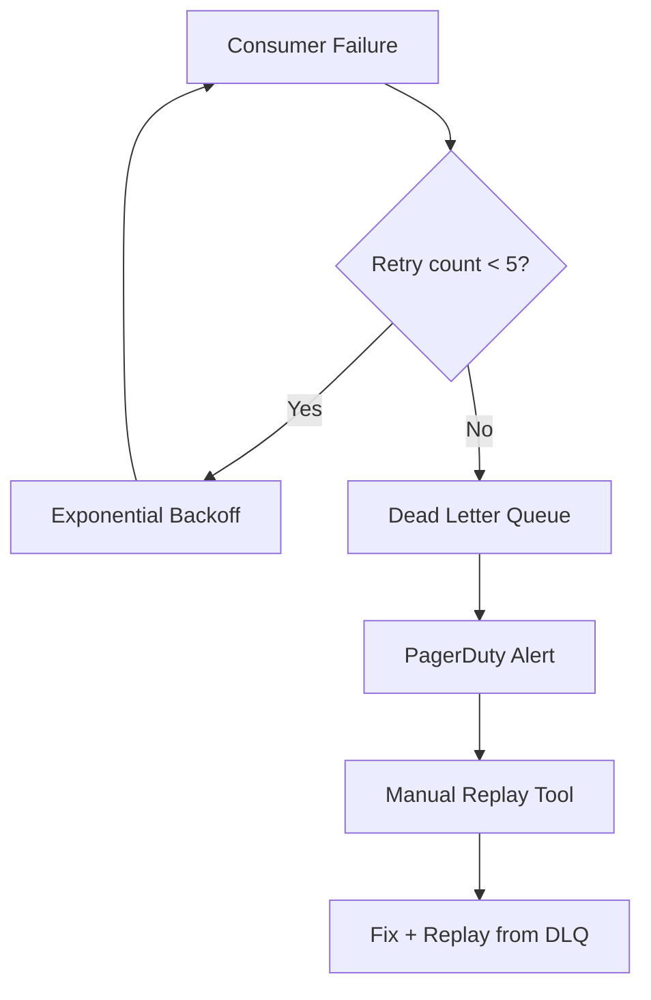

---

## 10. Capacity Estimates

### 10.1 Scale Targets (v1 Design Point — 18 Months Post-GA)

| Dimension | Target | Design Headroom (3x) |
|-----------|--------|----------------------|
| Registered organizations | 500,000 | 1,500,000 |
| Monthly active organizations | 100,000 | 300,000 |
| Total users | 5,000,000 | 15,000,000 |
| Monthly active users | 1,000,000 | 3,000,000 |
| Peak API RPS (global) | 25,000 | 75,000 |
| Peak API RPS (per region) | 15,000 | 45,000 |
| Kafka events/day | 500 million | 1.5 billion |
| PostgreSQL storage | 50 TB | 150 TB |
| S3 storage | 200 TB | 600 TB |
| OpenSearch documents | 2 billion | 6 billion |
| AI requests/day | 2 million | 6 million |

### 10.2 Per-Region Compute Sizing (Steady State — 100K MAU)

| Workload | Pods (min-max) | CPU req/limit | Memory req/limit |
|----------|----------------|---------------|------------------|
| Gateway | 4–20 | 500m / 2 | 512Mi / 2Gi |
| API monolith | 8–40 | 1 / 4 | 2Gi / 8Gi |
| GraphQL | 2–10 | 500m / 2 | 1Gi / 4Gi |
| Real-time | 4–16 | 500m / 2 | 1Gi / 4Gi |
| Workers | 6–30 | 500m / 2 | 1Gi / 4Gi |
| AI Orchestration | 4–20 | 1 / 4 | 2Gi / 8Gi |
| Go indexer | 2–8 | 1 / 4 | 1Gi / 4Gi |
| Go outbox relay | 2 (HA) | 500m / 2 | 512Mi / 2Gi |

**EKS node estimate:** 40–80 m6i.xlarge equivalent at steady state per region; Karpenter scales to 200+ nodes at peak.

### 10.3 Data Store Sizing

| Store | Steady State | Peak | Notes |
|-------|--------------|------|-------|
| **RDS PostgreSQL** | db.r6g.2xlarge Multi-AZ | db.r6g.4xlarge + 2 read replicas | ~5TB per region; Citus at 500K orgs |
| **ElastiCache Redis** | cache.r6g.large cluster (3 shards) | 6 shards | ~50GB working set |
| **OpenSearch** | 3 data nodes r6g.large.search | 6 nodes | 2TB index per region |
| **MSK Kafka** | 3 brokers kafka.m5.large | 6 brokers | 7-day retention; tiered storage |
| **S3** | 50TB per region | 200TB | Lifecycle to Glacier at 90d for exports |

### 10.4 Per-Tenant Resource Budgets (Noisy Neighbor Prevention)

| Tier | API rate limit | Storage | AI tokens/month | Automation runs/month |
|------|----------------|---------|-----------------|----------------------|
| Starter | 100 req/min | 5 GB | 50K | 500 |
| Growth | 500 req/min | 50 GB | 500K | 5,000 |
| Business | 2,000 req/min | 500 GB | 2M | 25,000 |
| Enterprise | Custom | Custom | Custom | Custom |

Fair-queue in AI service ensures no single tenant exceeds 10% of regional AI capacity without enterprise SLA.

### 10.5 Traffic Model Assumptions

| Assumption | Value | Basis |
|------------|-------|-------|
| Peak hour multiplier | 3x average | B2B business hours |
| Read/write ratio | 80/20 | Typical SaaS |
| Cross-module event fan-out | 2.5 consumers/event | Integration catalog |
| Average API payload | 4 KB | Measured at beta |
| WebSocket connections per region | 50,000 | 5% of MAU concurrent |
| Search queries per DAU | 8 | CRM + messaging search |

### 10.6 Growth Triggers for Architecture Evolution

| Trigger | Threshold | Action |
|---------|-----------|--------|
| API p95 latency | > 300ms sustained | Extract hottest module to service |
| PostgreSQL CPU | > 70% sustained | Add read replicas; Citus shard |
| Kafka consumer lag | > 60s sustained | Scale consumer pods; optimize handlers |
| OpenSearch query latency | > 500ms P95 | Add nodes; index splitting |
| AI queue wait | > 5s P95 | Add GPU nodes; model caching |
| Org count | > 300K | Citus distribution active |

---

## 11. Security Architecture Summary

| Layer | Control |
|-------|---------|
| **Edge** | WAF OWASP rules; bot detection; geo-blocking optional |
| **Gateway** | JWT validation; mTLS to upstream; rate limiting |
| **Application** | RBAC + ABAC; input validation; CSRF for cookie paths |
| **Data** | RLS; encryption at rest (KMS); column-level encryption for PHI |
| **Events** | Schema validation; no PII in topic keys |
| **AI** | Tenant-scoped retrieval; output filtering; audit all tool calls |
| **Supply chain** | SBOM; dependency scanning; signed container images |

*Full detail: [21-security.md](../phase-1/21-security.md), Phase 2 [13-security-strategy.md](./13-security-strategy.md)*

---

## 12. Deployment and Environment Model

| Environment | Purpose | Scale | Data |
|-------------|---------|-------|------|
| **dev** | Feature development | 10% prod | Synthetic |
| **staging** | Pre-prod validation | 30% prod | Anonymized prod snapshot |
| **prod** | Customer traffic | 100% | Live |

- **GitOps:** ArgoCD syncs from `main` (staging) and `release/*` (prod)
- **Feature flags:** LaunchDarkly or open-source equivalent per workspace
- **Migrations:** Flyway expand-contract; backward-compatible events
- **Blue/green:** API deployments; projection versioning for read models

---

## 13. Observability and SLOs

### 13.1 Service Level Objectives

| Service | SLI | SLO (Business+) |
|---------|-----|-----------------|
| API availability | Successful requests / total | 99.95% |
| API read latency | P95 < 200ms | 99% of monthly minutes |
| API write latency | P95 < 500ms | 99% of monthly minutes |
| Event processing lag | p99 lag < 10s | 99.5% |
| Search availability | Successful queries | 99.9% |
| AI copilot availability | Successful completions | 99.5% |
| WebSocket delivery | P95 < 500ms | 99% |

### 13.2 Key Dashboards

- **Golden signals** per service (latency, traffic, errors, saturation)
- **Tenant health** — top error producers, rate limit hits
- **Event pipeline** — outbox age, consumer lag, DLQ depth
- **Business metrics** — signups, activations, module usage (product analytics)
- **AI observability** — tokens, cost, tool success rate, guardrail blocks
- **Cost dashboard** — AWS spend by namespace; unit economics per tenant

---

## 14. Cross-References and Open Questions

### 14.1 Related Documents

| Document | Content |
|----------|---------|
| [01-prd.md](./01-prd.md) | Feature requirements driving this design |
| [02-software-architecture.md](../phase-1/02-software-architecture.md) | Module boundaries, events, CQRS |
| [03-infrastructure-architecture.md](../phase-1/03-infrastructure-architecture.md) | K8s, multi-region, networking |
| [05-database-architecture.md](../phase-1/05-database-architecture.md) | RLS, sharding, outbox |
| [06-api-architecture.md](../phase-1/06-api-architecture.md) | REST/GraphQL conventions |
| [04-ai-architecture.md](../phase-1/04-ai-architecture.md) | RAG, guardrails, model routing |
| [17-ai-agent-system.md](../phase-1/17-ai-agent-system.md) | Multi-agent orchestration |

### 14.2 Open Questions

| ID | Question | Owner | Target |
|----|----------|-------|--------|
| SDQ-01 | GraphQL federation in gateway vs standalone service? | API Team | Q3 2026 |
| SDQ-02 | CDC (Debezium) vs polling outbox relay as primary? | Platform | Q2 2026 |
| SDQ-03 | First Go extraction: search-indexer or outbox relay? | Platform | Q2 2026 |
| SDQ-04 | pgvector vs dedicated vector DB at 1M orgs? | AI + Data | Q4 2026 |
| SDQ-05 | NATS adoption for presence or Redis pub/sub sufficient? | Platform | Q3 2026 |
| SDQ-06 | Citus activation timeline vs vertical scaling ceiling? | DBA | Q4 2026 |

### 14.3 Document History

| Version | Date | Author | Changes |
|---------|------|--------|---------|
| 1.0.0 | 2026-06-30 | Platform Architecture | Initial Phase 2 system design |

---

*Document owner: Chief Software Architect · Review cadence: Quarterly or on major structural change*