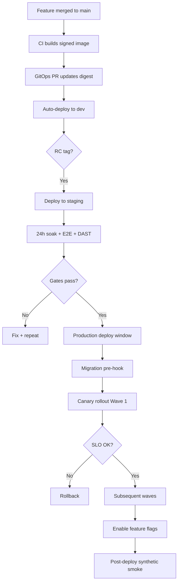

# Deployment Strategy — Phase 2

## Executive Summary

Atlas BOS Phase 2 operationalizes the deployment architecture defined in [ARCH-22](../phase-1/22-deployment.md) into a **governed, measurable release program** capable of shipping hundreds of microservices to global Kubernetes clusters without compromising the **99.99% availability** SLO. This strategy establishes GitOps as the sole path to production, defines environment promotion and release cadence, mandates progressive delivery (canary default, blue-green for major cutovers), and coordinates database migrations with application rollouts.

**Key outcomes:**

| Outcome | Target |
|---------|--------|
| Rollback time (stateless services) | < 5 minutes |
| Production deploy success rate | ≥ 99.5% |
| Mean time from merge to production | < 4 hours (standard change) |
| Migration failure rate | < 0.1% |
| Feature flag kill-switch activation | < 30 seconds |
| Deploy-related incident rate | < 2% of releases |

Phase 2 moves Atlas from architecture-approved patterns to **enforced operational practice** with CI gates, error-budget integration, and maturity milestones from Level 1 (manual GitOps) through Level 4 (fully automated progressive delivery with per-tenant rings).

---

## Principles

1. **GitOps is law** — Production state is declared in Git (`atlas-gitops`); no imperative `kubectl apply` except documented break-glass.
2. **Immutable artifacts** — Same container digest promoted dev → staging → production; tags are pointers, not rebuilds.
3. **Progressive exposure** — Canary is default for production; blue-green for instant-cutover scenarios; never 100% immediate for critical paths.
4. **Decouple deploy from release** — Feature flags control user-visible behavior; deployment ships code, flags control activation.
5. **Schema and code coordination** — Expand-contract migrations are mandatory; backward compatibility required for canary windows.
6. **Error budget governs velocity** — When SLO error budget is exhausted, non-critical releases freeze (see [STRAT-11](11-monitoring-strategy.md)).
7. **Blast radius minimization** — Multi-region wave rollouts; per-service independence; tenant rings for enterprise.
8. **Auditability** — Every production change traceable to Git commit, PR, approver, and deployment annotation.

---

## Implementation Approach

### 1. GitOps Foundation

#### Repository Model

```
atlas-gitops/
├── apps/                         # ArgoCD Application manifests
│   ├── base/
│   └── overlays/
├── environments/
│   ├── dev/
│   ├── staging/
│   └── production/
│       ├── us-east-1/
│       ├── us-west-2/
│       ├── eu-west-1/
│       └── ap-southeast-1/
├── charts/                       # Helm charts (service templates)
├── policies/                     # OPA/Gatekeeper constraints
└── migrations/                   # Migration job manifests (per service)
```

| Component | Responsibility |
|-----------|----------------|
| Application repos | Source code, Dockerfile, migration scripts |
| CI pipelines | Build, test, scan, sign, open GitOps PR |
| `atlas-gitops` | Desired state: image digests, replicas, config |
| ArgoCD | Reconcile cluster state to Git |
| External Secrets Operator | Sync secrets from Vault |

#### Sync Policies by Environment

| Environment | Auto-Sync | Self-Heal | Manual Approval |
|-------------|-----------|-----------|-----------------|
| Dev | Yes | Yes | No |
| Staging | Yes | Yes | No (tag-gated) |
| Production | Yes (post-PR merge) | Configurable | PR + optional ArgoCD sync |
| Production (hotfix) | Yes | Yes | IC + Security notification |

#### Drift Management

- ArgoCD drift detection runs continuously; drift alerts route to `#atlas-platform-alerts`.
- Unauthorized manual changes trigger self-heal within 5 minutes (production) or immediate alert (enterprise dedicated clusters).
- Monthly drift audit report for compliance.

### 2. Environment Strategy

#### Environment Topology

| Environment | Purpose | Data | Topology Parity | Refresh |
|-------------|---------|------|-----------------|---------|
| **Local** | Developer iteration | Docker fixtures | N/A | On demand |
| **Dev** | Integration, feature branches | Synthetic | 10% prod scale | Continuous |
| **Staging** | Pre-prod validation, DAST, load tests | Anonymized prod snapshot | 20% prod scale | Weekly |
| **Production** | Customer traffic | Live | Full multi-region | N/A |
| **Sandbox** | Partner/integration testing | Isolated synthetic | 5% prod scale | Monthly |
| **Enterprise Dedicated** | Contractual isolation | Customer-controlled | Per contract | Per agreement |

#### Promotion Pipeline

```
┌─────────┐    merge     ┌─────────┐    rc tag    ┌─────────┐   approve +    ┌────────────┐
│   PR    │─────────────►│   Dev   │──────────────►│ Staging │───window──────►│ Production │
│  (CI)   │   auto       │  auto   │    auto       │  auto   │   + gates      │  waves     │
└─────────┘              └─────────┘               └─────────┘                └────────────┘
```

#### Environment Configuration Matrix

| Property | Dev | Staging | Production |
|----------|-----|---------|------------|
| Kubernetes | EKS (single region) | EKS (2 regions) | EKS (6+ regions) |
| PostgreSQL | RDS (small) | RDS (prod-class, scaled) | RDS Multi-AZ + replicas |
| Kafka | MSK (3 brokers) | MSK (prod topology) | MSK (multi-AZ) |
| Feature flags | Unleash (dev project) | LaunchDarkly test | LaunchDarkly prod |
| LLM keys | Mock / test keys | Provider test tier | Production keys |
| Observability | Reduced retention | Full stack | Full stack + long-term |

**Parity rule:** Staging must run the same Helm chart versions and feature-flag SDK versions as production; only scale and data differ.

### 3. Release Cadence

#### Standard Cadence

| Release Type | Frequency | Scope | Approval |
|--------------|-----------|-------|----------|
| **Continuous** (dev) | Every merge to `main` | All services (independent) | None |
| **Release Candidate** | Weekly (Thursday) | Tagged `v*.*.*-rc.*` | Automated to staging |
| **Production Standard** | 2–3× per week | Services with passing gates | 1 eng lead + SRE |
| **Production Hotfix** | As needed | Single service / critical fix | IC + Security |
| **Platform Bundle** | Monthly | Cross-cutting infra, shared libs | Architecture review |

#### Deployment Windows

| Environment | Window | Restrictions |
|-------------|--------|--------------|
| Dev | 24/7 | None |
| Staging | 24/7 | None |
| Production | Tue–Thu 10:00–16:00 UTC | Default window |
| Production (hotfix) | Anytime | SEV1/SEV2 only |
| Blackout | Major holidays, fiscal quarter-end (days 28–31) | No prod deploys |
| Enterprise maintenance | Per customer SLA | Coordinated 72h notice |

#### Change Classification

| Class | Definition | Process |
|-------|------------|---------|
| **Standard** | Automated GitOps within window; backward-compatible | CI + GitOps PR |
| **Normal** | New feature, schema expand | PR + 1 approval + staging soak 24h |
| **Significant** | Cross-service, new region, major migration | CAB review + staged rollout |
| **Emergency** | Active incident mitigation | IC approval; retrospective within 48h |

### 4. Progressive Delivery

#### Canary (Default)

**When:** All production critical services (API gateway, auth, domain services, workflow runtime, agent orchestrator).

**Traffic progression:**

```
Step 0: Deploy canary (0% traffic) → smoke tests
Step 1: 5% traffic → pause 30m → SLO analysis
Step 2: 25% traffic → pause 30m → SLO analysis
Step 3: 50% traffic → pause 30m → SLO analysis
Step 4: 100% traffic → promote canary to stable
```

**Automated analysis thresholds (Argo Rollouts + Prometheus):**

| Metric | Pass | Fail (auto-rollback) |
|--------|------|----------------------|
| Error rate (canary vs stable) | < 0.1% delta | > 0.5% delta |
| P99 latency | < 1.2× stable | > 1.5× stable |
| Error budget burn | < 2× baseline | > 5× baseline |

#### Blue-Green

**When:**

- Major version upgrades requiring instant rollback capability
- Ingress/routing layer changes
- Services where canary traffic splitting is impractical (batch processors with external callbacks)

**Procedure:**

1. Deploy green environment (0% traffic)
2. Run full smoke suite against green internal endpoint
3. Switch ingress selector (atomic)
4. Monitor SLOs for 15 minutes
5. Retain blue for 24h (instant rollback) then decommission

#### Multi-Region Wave Rollout

```
Wave 1: us-east-1 (canary region) — full canary progression
   │ SLO OK 2h
Wave 2: us-west-2 + eu-west-1 (parallel)
   │ SLO OK 2h
Wave 3: ap-southeast-1 + remaining regions
```

Each wave is independent; a failure in Wave 2 does not auto-rollback Wave 1.

#### Enterprise Tenant Rings (Phase 2 M3+)

| Ring | Tenants | Timing |
|------|---------|--------|
| Ring 0 | Internal dogfood | Day 0 |
| Ring 1 | Beta program (opt-in) | Day 1 |
| Ring 2 | Standard SaaS (10% random) | Day 2 |
| Ring 3 | Standard SaaS (100%) | Day 3–5 |
| Ring 4 | Enterprise dedicated | Customer-agreed window |

Controlled via feature flags (`deploy_ring`) and LaunchDarkly percentage rollouts.

### 5. Rollback Strategy

#### Rollback Triggers

| Trigger | Action | Owner |
|---------|--------|-------|
| Canary analysis failure | Argo Rollouts auto-revert traffic | Automated |
| Smoke test failure post-deploy | Block promotion; revert GitOps commit | CI/CD |
| P1 alert within 15m of deploy | Runbook recommends rollback; IC decides | SRE |
| Error budget burn > 5× during deploy | Auto-pause rollout | Automated |

#### Rollback Methods

| Scenario | Method | SLA |
|----------|--------|-----|
| Bad application code | Revert GitOps image digest PR | < 5 min |
| Bad configuration | Git revert in `atlas-gitops` | < 5 min |
| Bad feature flag | Disable flag in LaunchDarkly | < 30 sec |
| Bad migration (forward-fix preferred) | Run forward-fix migration; rollback app | < 30 min |
| Emergency override | Pin known-good digest via break-glass | < 2 min |

#### Rollback Decision Matrix

```
IF error_rate > 0.5% AND correlated_with_deploy
  AND forward_fix_eta > 15_minutes
  THEN rollback_application
ELSE IF migration_in_progress AND migration_failed
  THEN pause_rollout + assess_forward_fix
ELSE IF feature_flag_correlated
  THEN disable_flag_first
```

### 6. Feature Flags

Decouple **code deployment** from **feature activation** per ARCH-22.

#### Provider Strategy

| Provider | Role | Fallback |
|----------|------|----------|
| LaunchDarkly | Primary (prod, staging) | Server-side SDK with local cache |
| Unleash | Self-hosted fallback; air-gapped enterprise | Default-safe offline mode |

#### Flag Lifecycle

| Type | Max Lifetime | Owner | Removal Requirement |
|------|--------------|-------|---------------------|
| Release | 90 days | Feature team | Part of Definition of Done |
| Ops | Permanent | SRE | Annual review |
| Experiment | 60 days | Product | Documented outcome |
| Permission | Permanent | Product/Security | Quarterly audit |
| Kill switch | Permanent | SRE | Tested quarterly |

#### Flag Governance

- All flags registered in `atlas-feature-flags` catalog (Git-backed metadata).
- CI lint: fail build on stale release flags (> 90 days).
- Default variation must be **safe** (feature off, maintenance off).
- Server-side evaluation for security-sensitive flags; client-side for UI-only.

#### Deploy + Flag Coordination

```
1. Deploy code with flag OFF (dark launch)
2. Enable flag for Ring 0 (internal)
3. Progressive flag rollout mirrors canary traffic
4. Remove flag after 100% stable for 14 days
```

### 7. Database Migration Coordination

Migrations are **first-class release artifacts**, not afterthoughts.

#### Expand-Contract Pattern (Mandatory for Production)

| Phase | Migration | Application | Deploy Gate |
|-------|-----------|-------------|-------------|
| **Expand** | Add nullable column/index | Old code ignores new schema | Auto |
| **Deploy** | — | New code writes to both old and new | Canary |
| **Migrate** | Backfill job (async) | Reads from both | Monitor lag |
| **Contract** | Remove deprecated column | New code only | Separate release |

#### Migration Pipeline

```
┌──────────────────────────────────────────────────────────────────┐
│                     Migration Pipeline                            │
├──────────────────────────────────────────────────────────────────┤
│ 1. CI: Run up/down against ephemeral Testcontainers DB           │
│ 2. CI: Validate backward compatibility (N-1 app version)           │
│ 3. Staging: Helm pre-upgrade hook executes migration Job         │
│ 4. Staging: Soak 24h with integration + E2E suites               │
│ 5. Prod: Migration Job (pre-hook) → App canary rollout           │
│ 6. Prod: Post-deploy verify schema version metric                │
└──────────────────────────────────────────────────────────────────┘
```

#### Migration Rules

| Rule | Rationale |
|------|-----------|
| No destructive DDL in single deploy | Canary requires N-1 compatibility |
| Lock timeout 5s with exponential backoff | Prevent deploy-blocking locks |
| Long-running DDL via online schema change (pg_repack, gh-ost) | Minimize table locks |
| Migration version pinned to app version | Prevent schema drift |
| Rollback scripts tested in CI | Forward-fix preferred but prepared |

#### Cross-Region Migration Coordination

- Global services: migrations run in **primary region first**, then replicas (read-only safe).
- Region-local databases: migrations run per-region during that region's deploy wave.
- Schema version metric (`atlas_db_schema_version`) exposed on `/health/ready`.

### 8. Smoke Tests and Deployment Gates

#### Pre-Traffic Smoke Suite

| Test | Scope | Timeout | Failure Action |
|------|-------|---------|----------------|
| `/health/ready` | All services | 10s | Block promotion |
| Auth token issuance | Critical path | 30s | Block promotion |
| CRUD smoke (test tenant) | Per domain service | 60s | Block promotion |
| Workflow instance lifecycle | Workflow engine | 120s | Block promotion |
| Kafka produce/consume | Event pipeline | 30s | Block promotion |
| Migration version check | Database | 15s | Block promotion |

#### Deployment Gate Checklist

| Gate | Stage | Blocking |
|------|-------|----------|
| Unit tests pass | CI | Yes |
| Integration tests pass | CI | Yes |
| Coverage ≥ 80% | CI | Yes |
| SAST/SCA no critical | CI | Yes |
| Container signed (Cosign) | CI | Yes |
| Error budget > 25% | Pre-prod deploy | Yes |
| Staging soak 24h (significant changes) | Pre-prod | Yes |
| E2E smoke pass | Pre-traffic switch | Yes |
| Canary analysis pass | During rollout | Yes |
| DAST (weekly baseline) | Staging | No (track) |

---

## Tooling

| Category | Tool | Purpose |
|----------|------|---------|
| GitOps | ArgoCD | Declarative deploy reconciliation |
| Progressive delivery | Argo Rollouts | Canary/blue-green orchestration |
| Traffic management | Istio / NGINX Ingress | Traffic splitting |
| CI/CD | GitHub Actions | Build, test, GitOps PR automation |
| Container registry | ECR / Harbor | Immutable artifact storage |
| Image signing | Cosign | Supply chain integrity |
| Secrets | Vault + External Secrets Operator | Secret sync to clusters |
| Feature flags | LaunchDarkly (+ Unleash fallback) | Release decoupling |
| Policy | OPA Gatekeeper | Cluster admission policies |
| Migrations | Flyway / golang-migrate / Prisma | Versioned schema changes |
| Deployment annotations | Grafana | Deploy correlation on dashboards |
| Change management | Jira / Linear | CAB tickets for significant changes |

---

## Processes

### Standard Release Process



### Hotfix Process

1. Branch from production tag (`hotfix/*`)
2. Minimal fix + targeted tests
3. Expedited CI (skip non-affected services)
4. IC approval + Security notification
5. Deploy single service with abbreviated canary (5% → 100% in 15m)
6. Retrospective within 48 hours

### Post-Deploy Verification

| Timeframe | Activity |
|-----------|----------|
| 0–15 min | Smoke tests, canary metrics, error rate |
| 15–60 min | SLO dashboard review, log anomaly scan |
| 1–24h | Business metric spot-check, support ticket watch |
| 24–72h | Release retrospective (if significant) |

### Deploy Freeze Process

Triggered when error budget < 25% (see STRAT-11):

1. SRE announces freeze in `#atlas-releases`
2. Only hotfixes and security patches permitted
3. Freeze lifts when budget recovers above 50% for 24h

---

## Metrics

### Deployment Health KPIs

| Metric | Target | Measurement |
|--------|--------|-------------|
| Deploy frequency (per service) | ≥ 2/week | ArgoCD sync events |
| Lead time for changes | < 4h (p50) | Merge → prod sync timestamp |
| Change failure rate | < 5% | Rollbacks / total deploys |
| Mean time to restore (deploy-related) | < 15 min | Incident timestamps |
| Rollback execution time | < 5 min (p95) | Rollout abort → stable traffic |
| Migration success rate | ≥ 99.9% | Migration job outcomes |
| Smoke test pass rate | 100% | CI smoke results |
| Stale feature flags | < 5% of total | Flag catalog audit |
| GitOps drift incidents | 0/month | ArgoCD drift alerts |

### Operational Metrics

| Metric | Alert Threshold |
|--------|-----------------|
| `argocd_app_sync_total{status="failed"}` | > 3 in 1h |
| `rollout_phase{phase="Degraded"}` | Any critical service |
| `deployment_duration_seconds` | p95 > 2h |
| `schema_migration_duration_seconds` | > 300s |
| `feature_flag_evaluation_errors` | > 0.1% |

### Reporting

| Report | Audience | Frequency |
|--------|----------|-----------|
| DORA metrics dashboard | Engineering leadership | Weekly |
| Deploy calendar | All engineering | Weekly |
| Change failure post-mortems | SRE + service owners | Per incident |
| Migration audit | Data platform | Monthly |
| Feature flag hygiene | Product + Engineering | Monthly |

---

## Responsibilities (RACI)

| Activity | Engineering | SRE/Platform | Security | Product | Data Platform | IC (Incident) |
|----------|:-----------:|:------------:|:--------:|:-------:|:-------------:|:---------------:|
| GitOps repo changes | R | A | C | I | C | I |
| CI pipeline gates | R | A | C | I | I | I |
| Canary/rollout config | C | R/A | I | I | I | C |
| Production deploy approval | R | A | C | C | C | C |
| Hotfix deploy | R | A | C | I | C | A |
| Feature flag management | R | C | C | A | I | C |
| Migration authoring | R | C | I | I | A | I |
| Migration prod execution | C | R | I | I | A | C |
| Rollback decision | C | R | I | I | C | A |
| Deploy freeze enforcement | I | R/A | C | C | I | A |
| Deployment windows | I | R/A | C | C | I | C |
| Enterprise ring coordination | C | R | I | A | I | I |
| Post-deploy verification | R | A | I | I | C | I |
| CAB significant changes | C | R | A | A | C | C |

**Legend:** R = Responsible, A = Accountable, C = Consulted, I = Informed

---

## Maturity Roadmap

### Level 1 — Foundational GitOps (M1–M2)

| Capability | Status |
|------------|--------|
| ArgoCD deployed dev + staging | Required |
| CI builds and pushes signed images | Required |
| GitOps PR automation for dev | Required |
| Manual production deploys via GitOps PR | Required |
| Basic smoke tests in CI | Required |
| Feature flags for 3 pilot features | Required |

**Exit criteria:** 10 services deployed via GitOps; zero manual kubectl prod deploys for 30 days.

### Level 2 — Progressive Delivery (M3–M4)

| Capability | Status |
|------------|--------|
| Argo Rollouts canary for top 10 services | Required |
| Automated canary analysis (Prometheus) | Required |
| Auto-rollback on analysis failure | Required |
| Migration pre-hooks in Helm | Required |
| Staging soak gate (24h) | Required |
| Error budget deploy freeze integration | Required |
| LaunchDarkly production rollout | Required |

**Exit criteria:** 50% of prod deploys use canary; change failure rate < 8%.

### Level 3 — Multi-Region Orchestration (M5–M8)

| Capability | Status |
|------------|--------|
| Wave-based multi-region rollout | Required |
| Blue-green for designated services | Required |
| Enterprise tenant rings | Required |
| Per-region independent rollback | Required |
| Deployment annotations on all dashboards | Required |
| Migration cross-region coordination | Required |
| DORA metrics reporting automated | Required |

**Exit criteria:** All production services on canary or blue-green; MTTR deploy-related < 15 min.

### Level 4 — Optimized Continuous Delivery (M9–M12)

| Capability | Status |
|------------|--------|
| Per-tenant deploy rings (enterprise) | Target |
| Auto-rollback on P1 without human approval | Target |
| ML-based deploy risk scoring | Evaluate |
| Zero-downtime migrations at scale | Target |
| Feature flag auto-cleanup in CI | Required |
| Self-service deploy for standard changes | Target |
| Cross-service dependency deploy ordering | Required |

**Exit criteria:** DORA elite tier (deploy freq daily+, lead time < 1h, CFR < 5%, MTTR < 15m).

---

## Risks and Mitigations

| Risk | Impact | Mitigation |
|------|--------|------------|
| GitOps repo compromise | Full prod takeover | Branch protection, signed commits, OPA policies, MFA |
| Migration failure mid-deploy | Extended outage | Pre-hook validation; backward-compatible only; tested rollback |
| Feature flag provider outage | Stuck state / wrong defaults | Unleash fallback; safe defaults; SDK caching |
| Regional deploy drift | Inconsistent behavior | ArgoCD ApplicationSet; per-region health checks |
| Canary analysis false positive | Unnecessary rollback | Tune thresholds; manual override; multi-signal analysis |
| Flag proliferation | Tech debt, confusion | 90-day lifetime; CI lint; monthly audit |

---

## Open Questions

| ID | Question | Owner | Target |
|----|----------|-------|--------|
| OQ-STRAT-10-01 | Argo Rollouts vs Flagger as standard? | Platform | M2 (Argo Rollouts) |
| OQ-STRAT-10-02 | Auto-rollback on P1 without IC approval? | SRE | M4 |
| OQ-STRAT-10-03 | LaunchDarkly cost at scale — Unleash primary? | Eng/Finance | M6 |
| OQ-STRAT-10-04 | Per-tenant deploy rings — self-service portal? | Product | M8 |
| OQ-STRAT-10-05 | Spinnaker evaluation for multi-cloud? | Platform | Year 2 |

---

## References

- [ARCH-22 Deployment](../phase-1/22-deployment.md)
- [ARCH-03 Infrastructure Architecture](../phase-1/03-infrastructure-architecture.md)
- [ARCH-05 Database Architecture](../phase-1/05-database-architecture.md)
- [ARCH-19 Monitoring](../phase-1/19-monitoring.md)
- [ARCH-24 Testing](../phase-1/24-testing.md)
- [ARCH-25 Disaster Recovery](../phase-1/25-disaster-recovery.md)
- [STRAT-11 Monitoring Strategy](11-monitoring-strategy.md)
- [STRAT-12 Testing Strategy](12-testing-strategy.md)

---

*Document owner: Platform Engineering · Review cadence: Quarterly or on major process change*