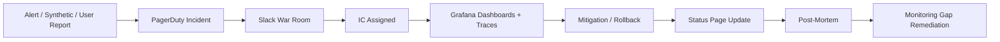

# Monitoring Strategy — Phase 2

## Executive Summary

Atlas BOS Phase 2 transforms the observability architecture in [ARCH-19](../phase-1/19-monitoring.md) into an **operational monitoring program** that makes reliability measurable, actionable, and accountable. With a **99.99% availability** target (52 minutes downtime per year), monitoring is not optional instrumentation—it is the **governance mechanism** for release velocity, incident response, and customer trust.

This strategy defines SLI/SLO targets with error budgets, a tiered alerting model integrated with PagerDuty on-call, a dashboard hierarchy for platform through tenant views, and explicit integration with incident response and deployment gates (STRAT-10). Phase 2 establishes monitoring maturity from basic uptime checks through AI-native observability and customer-facing SLO transparency.

**Key outcomes:**

| Outcome | Target |
|---------|--------|
| Mean time to detect (MTTD) — P1 | < 5 minutes |
| Mean time to acknowledge (MTTA) — P1 | < 15 minutes |
| Alert precision (actionable alerts) | ≥ 85% |
| SLO coverage (critical services) | 100% |
| On-call burnout index | < 2 pages/week/engineer |
| Post-incident monitoring gaps closed | 100% within 30 days |

---

## Principles

1. **SLOs drive decisions** — Error budgets govern deploy velocity; monitoring exists to measure SLOs, not vanity metrics.
2. **Alert on symptoms, investigate with causes** — Page humans on user-impacting conditions, not single-pod restarts.
3. **Every alert has a runbook** — No alert ships without `runbook_url` and owner.
4. **Cardinality discipline** — High-cardinality labels (raw `tenant_id`) forbidden in Prometheus; use hashing or dedicated pipelines.
5. **Unified correlation** — Metrics, traces, and logs linked via `correlation_id`, `trace_id`, and `deployment_id`.
6. **Tenant-aware observability** — Enterprise customers see their SLOs; platform sees aggregate health.
7. **Monitoring as code** — Dashboards, alerts, and SLO rules in Git; reviewed via PR.
8. **Continuous improvement** — Every incident produces monitoring gap analysis; alert reviews quarterly.

---

## Implementation Approach

### 1. Observability Stack

#### Architecture

```
┌─────────────────────────────────────────────────────────────────┐
│                    Atlas Observability Plane                     │
├──────────────┬──────────────┬──────────────┬──────────────────┤
│   Metrics    │    Traces    │    Logs      │    Profiles      │
│  Prometheus  │ OTel/Tempo   │  Loki        │  Pyroscope (P2)  │
├──────────────┴──────────────┴──────────────┴──────────────────┤
│              Grafana (unified visualization)                      │
├─────────────────────────────────────────────────────────────────┤
│ Alertmanager → PagerDuty │ Slack │ Status Page │ Error Budgets │
└─────────────────────────────────────────────────────────────────┘
```

#### Instrumentation Standard

All services MUST emit:

| Signal | Standard |
|--------|----------|
| Metrics | OpenTelemetry SDK → Prometheus exporter |
| Traces | W3C `traceparent`; OTel Collector DaemonSet |
| Logs | Structured JSON (ARCH-20); `correlation_id` on every line |
| Health | `/health/live`, `/health/ready` with dependency checks |

**Metric naming:** `atlas_<subsystem>_<metric>_<unit>` (e.g., `atlas_api_http_requests_total`).

### 2. SLI/SLO Framework

#### Platform-Level SLOs

| SLI | Definition | SLO Target | Window | Error Budget |
|-----|------------|------------|--------|--------------|
| **API Availability** | Non-5xx responses / total requests | 99.99% | 30d rolling | 4.32 min/month |
| **API Latency** | Requests completing < 500ms (P99) | 99% | 30d rolling | 7.2 h/month |
| **Webhook Delivery** | Delivered within 60s SLA | 99.9% | 30d | 43.2 min/month |
| **Workflow Completion** | Instances complete without manual intervention | 99.5% | 30d | 3.6 h/month |
| **Agent Success** | Runs complete without `FAILED` status | 98% | 30d | 14.4 h/month |
| **Data Durability** | Zero unrecoverable data loss | 100% | 90d | 0 |
| **Search Freshness** | Indexed within 2 min of source update | 99% | 30d | 7.2 h/month |

#### Service-Tier SLOs

| Tier | Services | Availability SLO | Latency SLO (P99) |
|------|----------|-------------------|-------------------|
| **Tier 0 — Critical** | API gateway, auth, payments | 99.99% | < 300ms |
| **Tier 1 — Core** | CRM, finance, workflow runtime | 99.95% | < 500ms |
| **Tier 2 — Standard** | HR, inventory, notifications | 99.9% | < 800ms |
| **Tier 3 — Async** | Embeddings, reports, exports | 99.5% (job success) | < 30s (P95 job) |
| **Tier AI** | Agent orchestrator, RAG pipeline | 98% (success) | < 30s (P99 interactive) |

#### SLI Implementation

```promql
# API Availability SLI (30d rolling)
sum(rate(atlas_api_http_requests_total{status!~"5.."}[30d]))
/
sum(rate(atlas_api_http_requests_total[30d]))

# API Latency SLI
histogram_quantile(0.99,
  sum(rate(atlas_api_http_request_duration_seconds_bucket[30d])) by (le)
) < 0.5
```

#### Error Budget Policy

| Budget Remaining | Release Policy | Monitoring Action |
|------------------|----------------|-------------------|
| > 50% | Normal velocity | Standard alerting |
| 25–50% | Caution; no risky deploys | Weekly SRE review |
| < 25% | **Deploy freeze** (STRAT-10) | Daily burn rate review |
| Exhausted (0%) | Feature freeze; incident posture | Executive escalation |

Error budgets exposed via:

- Grafana SLO dashboards
- CI/CD deploy gate API (`/internal/slo/budget`)
- `#atlas-slo` Slack channel (daily burn summary)

#### Per-Tenant SLOs (Enterprise)

Enterprise contracts may include dedicated SLO dashboards:

| SLI | Enterprise Option |
|-----|-------------------|
| API availability | Filtered by `tenant_id_hash` |
| P95 latency | Per-tenant percentile |
| Workflow SLA compliance | Custom workflow SLA tracking |
| Support correlation | Ticket volume vs error rate overlay |

Delivered via Grafana tenant folder with RBAC; raw `tenant_id` never in global Prometheus.

### 3. Alerting Strategy

#### Severity Tiers

| Tier | Name | Response Time | Channel | Example |
|------|------|---------------|---------|---------|
| **P1** | Critical | 15 min acknowledge | PagerDuty (24/7) | API availability breach (1h window) |
| **P2** | High | 1 hour | PagerDuty (business hours) + Slack | Kafka lag > 100K for 30 min |
| **P3** | Medium | 4 hours | Slack `#atlas-alerts` | Disk 85% on DB primary |
| **P4** | Low | Next business day | Ticket queue | Certificate expires in 30 days |
| **P5** | Info | None (dashboard only) | Grafana annotation | Deploy completed |

#### Alert Routing

```
Prometheus Alertmanager
        │
        ├── severity=critical + service=tier0 → PagerDuty (immediate)
        ├── severity=critical + service=tier1 → PagerDuty (escalation 30m)
        ├── severity=warning → Slack #atlas-alerts
        ├── severity=info → Ticket (Jira)
        └── tenant=enterprise_* → Optional CSM webhook
```

#### Alert Design Rules

| Rule | Rationale |
|------|-----------|
| `for: 5m` minimum on infra alerts | Prevent single-pod noise |
| Composite alerts for cascading failures | Avoid alert storms |
| SLO-based burn rate alerts | Page before budget exhausted |
| Every alert has `runbook_url`, `service`, `owner` | Accountability |
| No paging on non-customer-impacting conditions | On-call sustainability |
| Deploy-correlated alerts include `deployment_id` | Faster triage |

#### SLO Burn Rate Alerts (Multi-Window)

| Alert | Fast Burn (1h) | Slow Burn (6h) |
|-------|----------------|----------------|
| API Availability | 14.4× budget burn | 6× budget burn |
| API Latency | 10× budget burn | 4× budget burn |

```yaml
# Example: API availability fast burn
- alert: APIAvailabilityBudgetBurnFast
  expr: |
    (
      1 - sum(rate(atlas_api_http_requests_total{status!~"5.."}[1h]))
          / sum(rate(atlas_api_http_requests_total[1h]))
    ) > (1 - 0.9999) * 14.4
  for: 2m
  labels:
    severity: critical
  annotations:
    summary: API error budget burning 14.4× normal rate
    runbook_url: https://runbooks.atlas.internal/slo/api-availability
```

#### Alert Volume Targets

| Metric | Target |
|--------|--------|
| P1 alerts per week (platform) | < 5 |
| P1 false positive rate | < 10% |
| Alerts per on-call shift | < 3 pages |
| Mean alerts per incident | 2–4 (composite) |

### 4. On-Call Program

#### Structure

| Rotation | Coverage | Team Size | Escalation |
|----------|----------|-----------|------------|
| **Platform Primary** | 24/7 | 8 engineers | → Platform Lead (15m) → VP Eng (30m) |
| **Platform Secondary** | 24/7 | 8 engineers | Backup for primary |
| **Service Team** | Business hours + best-effort | Per team | → Team lead |
| **Security** | 24/7 (SEV1/2 only) | 4 engineers | → CISO |
| **AI Platform** | Business hours | 4 engineers | → AI lead |

#### On-Call Expectations

| Activity | Requirement |
|----------|-------------|
| Acknowledge P1 | < 15 minutes |
| Engage (laptop open) | < 30 minutes |
| Status update | Every 30 minutes during P1 |
| Handoff | Documented in incident channel |
| Post-incident | Timeline + monitoring gaps within 48h |

#### On-Call Health

| Metric | Threshold | Action |
|--------|-----------|--------|
| Pages per engineer per week | > 3 | Alert review; add dampening |
| After-hours pages | > 2/week team | Root cause: fix noisy alert |
| Escalation rate | > 20% | Training; runbook improvement |
| On-call tenure without break | > 2 consecutive weeks | Mandatory swap |

#### Tooling

- **PagerDuty** — Schedules, escalation policies, incident timeline
- **Slack** — `#incident-YYYYMMDD-{slug}` auto-provisioned
- **Zoom** — War room bridge (persistent URL)
- **Grafana Incident** — Dashboard snapshots attached to incidents
- **Statuspage.io** — Customer-facing status (Phase 2 M4)

### 5. Dashboard Strategy

#### Hierarchy

```
Level 0: Executive (monthly)
    └── Business KPIs, SLO summary, incident count, error budget

Level 1: Platform / NOC (24/7)
    └── Global health, regional matrix, active incidents, burn rates

Level 2: Service (per service owner)
    └── RED metrics, dependencies, deployment annotations

Level 3: Domain (product + eng leads)
    └── CRM, Finance, HR aggregates, business metrics

Level 4: Tenant (admin / enterprise)
    └── Per-tenant usage, errors, workflow SLA, agent costs
```

#### Required Dashboard Panels (Service Level)

| Panel | Metrics |
|-------|---------|
| Request rate | `rate(atlas_*_http_requests_total[5m])` |
| Error rate | 5xx / total |
| Latency heatmap | P50, P95, P99 |
| Saturation | CPU, memory, connections |
| Dependencies | Upstream/downstream latency + errors |
| Deployments | Annotations from ArgoCD |
| SLO status | Current SLI vs target, budget remaining |
| Traces | Exemplar links to Tempo |

#### Dashboard-as-Code

- All dashboards stored in `atlas-gitops/observability/dashboards/`
- Grafana provisioning via ConfigMap
- PR review required for Tier 0/1 dashboard changes
- Auto-generated service dashboards from service catalog

#### AI & Workflow Dashboards

| Dashboard | Key Panels |
|-----------|------------|
| Agent Operations | Cost by tenant, tool failure heatmap, latency |
| RAG Pipeline | Retrieval latency, chunks retrieved, index lag |
| Workflow Engine | SLA breaches, runnable instances, step duration |
| Automation | DLQ depth, execution rate, failure reasons |
| LLM Providers | Per-provider latency, error rate, token throughput |

### 6. Synthetic Monitoring

#### External Probes (Checkly / Datadog)

| Check | Frequency | Regions | Alert Tier |
|-------|-----------|---------|------------|
| `GET /health/live` | 1 min | US, EU, APAC | P2 |
| `GET /health/ready` | 1 min | US, EU, APAC | P1 |
| Auth token flow | 5 min | US, EU | P1 |
| CRM CRUD canary | 5 min | US | P2 |
| Workflow completion | 15 min | US | P2 |
| Agent read-only query | 15 min | US | P3 |

#### Internal Synthetic Runner

Dedicated `synthetic-runner` namespace; isolated test tenant per region. Results pushed to Prometheus via Pushgateway.

### 7. Incident Response Integration

#### Detection → Response Flow



#### Monitoring Integration Points

| Incident Phase | Monitoring Support |
|----------------|-------------------|
| **Detect** | SLO burn alerts, synthetic failures, anomaly detection |
| **Triage** | Platform dashboard, service dashboard, trace search |
| **Mitigate** | Deploy annotations, rollback metrics, feature flag status |
| **Communicate** | Status page fed by synthetic + SLO data |
| **Resolve** | SLO recovery confirmation before incident close |
| **Learn** | Post-mortem monitoring gaps tracked in Jira |

#### Incident Severity ↔ Monitoring

| SEV | Customer Impact | Monitoring Response |
|-----|-----------------|---------------------|
| SEV1 | Full outage or data breach | All hands; 1-min dashboard refresh; exec bridge |
| SEV2 | Partial outage, degraded SLO | Primary + secondary on-call; 5-min updates |
| SEV3 | Minor degradation, no SLO breach | Business hours response; ticket |
| SEV4 | Latent issue, no current impact | Backlog |

#### Post-Incident Monitoring Requirements

Every post-mortem MUST answer:

1. Why did monitoring not detect sooner? (MTTD gap)
2. Which alerts fired? Were they actionable?
3. What new alerts/dashboards are needed?
4. Were runbooks accurate?

Remediation tickets due within 30 days; tracked in `#atlas-slo` weekly review.

### 8. Deploy and Release Integration

| Integration | Mechanism |
|-------------|-----------|
| Deploy freeze | Error budget < 25% blocks CI gate |
| Canary analysis | Prometheus queries in Argo Rollouts |
| Post-deploy verification | Synthetic smoke + SLO dashboard |
| Deploy annotations | ArgoCD → Grafana vertical lines |
| Change correlation | `deployment_id` in logs and traces |

---

## Tooling

| Category | Tool | Purpose |
|----------|------|---------|
| Metrics | Prometheus + Thanos/Mimir | Collection, long-term storage |
| Visualization | Grafana | Dashboards, SLO, incidents |
| Tracing | OpenTelemetry + Tempo | Distributed traces |
| Logging | Loki | Log aggregation (ARCH-20) |
| Alerting | Alertmanager + PagerDuty | Alert routing, on-call |
| Synthetics | Checkly | External uptime probes |
| Profiling | Pyroscope (Phase 2) | Continuous profiling |
| Status page | Statuspage.io | Customer communication |
| Monitoring as code | Grafana Foundation SDK / Jsonnet | Dashboard versioning |
| Anomaly detection | Prometheus + ML (M9+) | Baseline deviation |

---

## Processes

### SLO Review Process

| Activity | Frequency | Participants |
|----------|-----------|--------------|
| Error budget review | Weekly | SRE + Eng leads |
| SLO target review | Quarterly | SRE + Product + Leadership |
| Alert audit | Quarterly | SRE + Service owners |
| On-call retrospective | Monthly | Platform team |
| Dashboard cleanup | Quarterly | SRE |
| Runbook validation | Semi-annual | Service owners |

### New Service Onboarding

1. Service registered in catalog with tier assignment
2. OpenTelemetry instrumentation verified
3. SLO defined (or inherited from tier defaults)
4. Dashboard auto-generated and reviewed
5. Alerts created with runbooks
6. On-call routing configured
7. Synthetic check added (if Tier 0/1)

### Alert Lifecycle

```
Proposed → PR Review → Staged (7d observation) → Active → Quarterly Review → Deprecated
```

New P1 alerts require 7-day staging in `#atlas-alerts-staging` before PagerDuty routing.

---

## Metrics

### Program KPIs

| Metric | Target | Owner |
|--------|--------|-------|
| MTTD (P1) | < 5 min | SRE |
| MTTA (P1) | < 15 min | SRE |
| MTTR (P1) | < 60 min | SRE + Service teams |
| SLO compliance (platform) | ≥ 99% of months | SRE |
| Alert precision | ≥ 85% | SRE |
| Runbook coverage | 100% of P1/P2 | Service owners |
| Instrumentation coverage | 100% Tier 0/1 | Engineering |
| Post-mortem monitoring gaps closed | 100% in 30d | SRE |
| Dashboard freshness | < 1 min lag | Platform |
| On-call pages per engineer per week | < 3 | SRE |

### Observability Health Metrics

| Metric | Alert |
|--------|-------|
| `prometheus_tsdb_head_series` | Growth > 20% week-over-week |
| `otel_collector_dropped_spans` | > 0.1% |
| `loki_ingestion_rate` | Drop > 50% |
| `grafana_alerting_rule_evaluations_failed` | > 0 |
| `synthetic_check_success` | < 99.9% (any Tier 0 check) |

---

## Responsibilities (RACI)

| Activity | SRE/Platform | Engineering | Security | Product | Leadership | CSM |
|----------|:------------:|:-----------:|:--------:|:-------:|:----------:|:---:|
| SLO definition | R/A | C | I | C | I | I |
| Alert creation | R/A | C | C | I | I | I |
| Runbook authoring | C | R/A | C | I | I | I |
| On-call rotation | R/A | C | C | I | I | I |
| Dashboard Tier 0/1 | R/A | C | I | C | I | I |
| Dashboard Tier 2/3 | C | R/A | I | C | I | I |
| Tenant dashboards | C | C | C | R | I | A |
| Incident command | R/A | C | C | I | I | I |
| Post-mortem | R | R | C | I | I | I |
| Monitoring gap remediation | A | R | I | I | I | I |
| Status page comms | C | I | C | R/A | I | C |
| Synthetic check ownership | R/A | C | I | I | I | I |
| Error budget deploy freeze | R/A | I | I | C | I | I |
| Enterprise SLO reporting | C | I | I | C | I | R/A |

**Legend:** R = Responsible, A = Accountable, C = Consulted, I = Informed

---

## Maturity Roadmap

### Level 1 — Basic Observability (M1–M2)

| Capability | Required |
|------------|----------|
| Prometheus + Grafana deployed (dev, staging) | ✓ |
| Standard RED metrics on all services | ✓ |
| Platform overview dashboard | ✓ |
| PagerDuty integration (manual config) | ✓ |
| `/health` endpoints on all services | ✓ |
| Basic P1/P2 alert set (10 alerts) | ✓ |

**Exit criteria:** MTTD < 15 min for staging outages; all Tier 0 services instrumented.

### Level 2 — SLO-Driven Operations (M3–M4)

| Capability | Required |
|------------|----------|
| SLO dashboards with error budgets | ✓ |
| Burn rate alerts | ✓ |
| Error budget deploy freeze (CI integration) | ✓ |
| Distributed tracing (Tempo) production | ✓ |
| Synthetic external probes (3 regions) | ✓ |
| On-call rotations formalized | ✓ |
| Runbooks for all P1 alerts | ✓ |
| Deploy annotations on dashboards | ✓ |

**Exit criteria:** SLO compliance ≥ 95% for 3 consecutive months; alert precision ≥ 75%.

### Level 3 — Proactive & Tenant-Aware (M5–M8)

| Capability | Required |
|------------|----------|
| Per-service SLOs with tier defaults | ✓ |
| Enterprise tenant SLO dashboards | ✓ |
| Status page customer integration | ✓ |
| AI/workflow specialized dashboards | ✓ |
| Monitoring-as-code (all dashboards in Git) | ✓ |
| Quarterly alert audit process | ✓ |
| RUM (real user monitoring) pilot | ✓ |
| Anomaly detection on key SLIs | Evaluate |

**Exit criteria:** MTTD < 5 min; MTTA < 15 min; on-call pages < 3/week/engineer.

### Level 4 — Observability Excellence (M9–M12)

| Capability | Target |
|------------|--------|
| Per-tenant alerting (enterprise add-on) | ✓ |
| Continuous profiling (Pyroscope) | ✓ |
| ML-based anomaly detection | ✓ |
| Customer-facing SLO API | ✓ |
| Auto-generated runbooks (AI-assisted) | Evaluate |
| Predictive capacity alerts | ✓ |
| Cross-region SLO federation | ✓ |
| Observability cost attribution per team | ✓ |

**Exit criteria:** Alert precision ≥ 85%; zero undetected SEV1 for 6 months; SLO compliance ≥ 99%.

---

## Risks and Mitigations

| Risk | Mitigation |
|------|------------|
| Cardinality explosion | Label policies; CI lint; `tenant_id_hash` |
| Alert fatigue | Quarterly audit; SLO-based paging; composite alerts |
| Dashboard sprawl | Hierarchy governance; auto-generation; quarterly cleanup |
| Trace storage cost | Tail-based sampling; tiered retention |
| On-call burnout | Page budget; alert review; secondary rotation |
| Monitoring gaps after incidents | Mandatory post-mortem action items; 30-day SLA |

---

## Open Questions

| ID | Question | Owner | Target |
|----|----------|-------|--------|
| OQ-STRAT-11-01 | Mimir vs Thanos for long-term metrics? | SRE | M3 ADR |
| OQ-STRAT-11-02 | Status page: self-hosted vs Statuspage.io? | Product | M4 |
| OQ-STRAT-11-03 | RUM vendor selection? | Frontend | M6 |
| OQ-STRAT-11-04 | Per-tenant alerting: included or add-on? | Product | M5 |
| OQ-STRAT-11-05 | Pyroscope rollout scope? | SRE | M8 |

---

## References

- [ARCH-19 Monitoring](../phase-1/19-monitoring.md)
- [ARCH-20 Logging](../phase-1/20-logging.md)
- [ARCH-22 Deployment](../phase-1/22-deployment.md)
- [ARCH-23 Scaling](../phase-1/23-scaling.md)
- [ARCH-25 Disaster Recovery](../phase-1/25-disaster-recovery.md)
- [STRAT-10 Deployment Strategy](10-deployment-strategy.md)
- [STRAT-15 Performance Strategy](15-performance-strategy.md)
- Google SRE Workbook (SLO methodology)

---

*Document owner: Site Reliability Engineering · Review cadence: Quarterly*