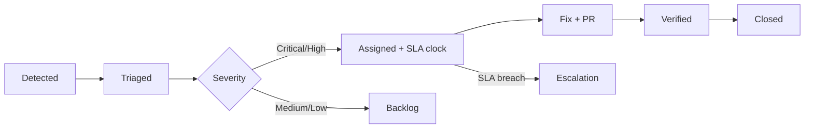

# Security Strategy — Phase 2

## Executive Summary

Atlas BOS Phase 2 operationalizes the security architecture in [ARCH-21](../phase-1/21-security.md) into a **continuous security program** appropriate for a global Business Operating System handling financial records, PII, HR data, and AI-mediated business actions for millions of tenants. Security is not a gate at the end of development—it is embedded in design, CI/CD, operations, and culture.

This strategy defines the Secure SDLC, threat modeling cadence, vulnerability management SLAs, compliance roadmap (SOC 2, GDPR, HIPAA-ready), access control governance, and data classification framework. Phase 2 matures from baseline automated scanning through enterprise-grade compliance certification, AI red teaming, and zero-trust operational maturity.

**Key outcomes:**

| Outcome | Target |
|---------|--------|
| Critical vulnerability MTTR | < 48 hours |
| High vulnerability MTTR | < 7 days |
| SOC 2 Type II | Year 1 certification |
| Security training completion | 100% engineering annually |
| Penetration test critical findings | 0 open > 30 days |
| AI red team coverage | 100% agent tools annually |
| Security incident MTTR (SEV1) | < 4 hours containment |

---

## Principles

1. **Zero trust** — Never trust, always verify; least privilege everywhere.
2. **Defense in depth** — Multiple independent control layers; no single point of failure.
3. **Secure by default** — Safe defaults; risky features require explicit opt-in.
4. **Shift left** — Security in design, threat modeling, CI, and code review.
5. **Assume breach** — Detect, contain, recover; minimize blast radius.
6. **Transparency** — Auditable actions; responsible disclosure; customer trust.
7. **Tenant isolation is sacred** — Cross-tenant access is the highest-severity failure mode.
8. **AI actions are bounded** — Agents inherit user permissions; never exceed entitlements.

---

## Implementation Approach

### 1. Secure SDLC

#### Lifecycle Integration

```
┌─────────┐   ┌─────────────┐   ┌──────────┐   ┌──────────┐   ┌────────┐   ┌──────────┐
│ Design  │──►│Threat Model │──►│ Develop  │──►│ CI Scan  │──►│ Review │──►│ Deploy   │
└─────────┘   └─────────────┘   └──────────┘   └──────────┘   └────────┘   └────┬─────┘
     ▲                                                                              │
     │         ┌─────────────┐   ┌──────────┐   ┌──────────┐                        │
     └─────────│Post-Incident│◄──│ Monitor  │◄──│  DAST    │◄───────────────────────┘
               │   Update    │   │  SIEM    │   │          │
               └─────────────┘   └──────────┘   └──────────┘
```

#### SDLC Security Gates

| Phase | Gate | Requirement | Blocking |
|-------|------|-------------|----------|
| **Design** | Threat model | STRIDE analysis for new features | Significant features |
| **Design** | Security review | Auth/crypto/tenant changes | Yes |
| **Develop** | SAST | Semgrep, CodeQL | Critical findings |
| **Develop** | SCA | Snyk, Dependabot | Critical CVE |
| **Develop** | Secret scan | Gitleaks | Any secret |
| **Develop** | IaC scan | Checkov, tfsec | High findings |
| **Review** | Security code review | AuthZ, crypto, input validation | Required reviewers |
| **CI** | Container scan | Trivy | Critical |
| **CI** | SBOM generation | Syft/CycloneDX | Required |
| **CI** | Image signing | Cosign | Required |
| **Pre-prod** | DAST | OWASP ZAP | Track critical |
| **Pre-prod** | Pen test remediation | No open critical | Significant releases |
| **Prod** | Admission policy | Signed images only | Yes |
| **Prod** | Continuous monitoring | SIEM, anomaly detection | Ongoing |

#### Security Review Triggers

Automatic security review required when PR touches:

- Authentication / authorization logic
- Cryptography (encryption, hashing, tokens)
- Tenant isolation (RLS, queries, cache keys)
- External integrations (webhooks, OAuth)
- AI agent tools or guardrails
- Admin / break-glass functionality
- Data export / deletion (GDPR)
- Infrastructure security (network policies, IAM)

#### Secure Coding Standards

| Domain | Standard |
|--------|----------|
| Input validation | Validate at API boundary; allowlist over denylist |
| SQL | Parameterized queries only; no string concatenation |
| Output encoding | Context-appropriate encoding (HTML, JSON, URL) |
| Authentication | MFA for admin; secure session cookies; brute force lockout |
| Authorization | Deny-by-default; `tenant_id` on every data query |
| Secrets | Vault only; never in code, env files, or K8s Secrets |
| Logging | No PII/secrets in logs; structured security events |
| Dependencies | Pin versions; approved license list |
| AI prompts | User input in designated sections; no prompt injection vectors |

### 2. Threat Modeling

#### Methodology

- **Framework:** STRIDE per component
- **Tool:** Microsoft Threat Modeling Tool or Miro templates
- **Storage:** `docs/security/threat-models/{feature-id}.md`
- **Review:** Security team + feature team + architect

#### Threat Modeling Cadence

| Trigger | Scope | Deadline |
|---------|-------|----------|
| New feature (significant) | Feature-specific | Before development starts |
| New service | Service boundary | Before first deploy |
| New integration (marketplace) | Integration surface | Before listing |
| AI agent tool addition | Tool + permission model | Before tool registration |
| Architecture change | Affected components | Before implementation |
| Annual refresh | All Tier 0/1 services | Q1 each year |
| Post-incident | Affected area | Within 30 days of SEV1/2 |

#### STRIDE Coverage Matrix

| Threat | Category | Atlas Assets | Primary Controls |
|--------|----------|--------------|------------------|
| Spoofing | S | Sessions, API keys | MFA, JWT validation, tenant context |
| Tampering | T | Entities, workflows | Audit logs, integrity hashes |
| Repudiation | R | Financial transactions | Hash chain audit log |
| Information disclosure | I | PII, business data | Encryption, ABAC, tenant isolation |
| Denial of service | D | API, workflows | Rate limiting, WAF, HPA |
| Elevation of privilege | E | Admin, cross-tenant | RBAC/ABAC, break-glass audit |

#### AI-Specific Threat Model (Annual)

| Threat | Vector | Mitigation | Test |
|--------|--------|------------|------|
| Prompt injection | Malicious CRM notes | Input sanitization; tool arg validation | Red team monthly |
| Agent overreach | Exceeds user permissions | Permission intersection | AuthZ matrix per tool |
| Memory poisoning | False facts injected | Provenance, review queue | Eval suite |
| Model extraction | API probing | Rate limits, output filtering | Pentest annual |
| Training data leak | Tenant data in prompts | Zero-retention contracts, PII scrub | Vendor audit |

#### Threat Model Deliverables

Each threat model document includes:

1. Data flow diagram with trust boundaries
2. Asset inventory
3. STRIDE analysis per component
4. Risk rating (likelihood × impact)
5. Mitigations mapped to controls
6. Residual risk acceptance (with approver)
7. Test plan for mitigations

### 3. Vulnerability Management

#### Scanning Program

| Scan Type | Tool | Frequency | Gate |
|-----------|------|-----------|------|
| SAST | Semgrep, CodeQL | Every PR | Block critical |
| SCA | Snyk, Dependabot | Every PR + daily | Block critical CVE |
| Container scan | Trivy | Every image build | Block critical |
| DAST | OWASP ZAP | Weekly (staging) | Track |
| IaC scan | Checkov, tfsec | Every PR | Block high |
| Secret scan | Gitleaks, TruffleHog | Every commit | Block |
| Runtime | Falco (K8s) | Continuous | Alert |
| Cloud config | AWS Config, Prowler | Daily | Track |

#### Remediation SLAs

| Severity | CVSS | Fix Timeline | Escalation |
|----------|------|--------------|------------|
| **Critical** | 9.0–10.0 | 48 hours | CISO + IC if exploited |
| **High** | 7.0–8.9 | 7 days | Security lead |
| **Medium** | 4.0–6.9 | 30 days | Team backlog |
| **Low** | 0.1–3.9 | 90 days | Team backlog |
| **Info** | 0 | Best effort | — |

#### Vulnerability Workflow



#### Exception Process

| Requirement | Detail |
|-------------|--------|
| Approval | Security lead + risk owner |
| Documentation | Risk acceptance form |
| Compensating controls | Required for critical/high |
| Expiration | Max 90 days; re-review required |
| Tracking | Vulnerability register |

#### Dependency Policy

| Rule | Enforcement |
|------|-------------|
| Approved license list | CI check (MIT, Apache, BSD, etc.) |
| No unmaintained deps (> 2 years) | SCA warning → block |
| Pin versions in lockfiles | Required |
| Critical dep security review | Manual for crypto, auth libs |
| SBOM per image | Generated and stored |

### 4. Compliance Roadmap

#### Framework Timeline

| Framework | Target | Phase 2 Milestone | Key Controls |
|-----------|--------|-------------------|--------------|
| **SOC 2 Type I** | Month 9 | M9 readiness assessment | Access, audit, encryption, monitoring |
| **SOC 2 Type II** | Month 15 | M15 certification | 6-month control operation evidence |
| **GDPR** | Day 1 | Ongoing | DSR, erasure, DPA, breach notification |
| **HIPAA-ready** | Month 12 | M12 architecture validation | BAA, field encryption, access logging |
| **ISO 27001** | Year 2 | Planning M10 | ISMS alignment |
| **PCI DSS** | Ongoing | Scope reduction | Stripe tokenization; no card storage |
| **FedRAMP** | Year 3+ | Evaluate | Future government segment |

#### SOC 2 Control Mapping

| Trust Principle | Atlas Controls |
|-----------------|----------------|
| Security | WAF, MFA, encryption, vulnerability management |
| Availability | SLO monitoring, DR (ARCH-25), incident response |
| Processing integrity | Audit logs, workflow validation, reconciliation |
| Confidentiality | Encryption, access control, data classification |
| Privacy | GDPR DSR, consent, retention policies |

#### GDPR Operational Requirements

| Requirement | Implementation |
|-------------|----------------|
| Data Subject Access Request (DSAR) | Self-service portal + 30-day SLA |
| Right to erasure | Cascading delete pipeline; audit |
| Data Processing Agreement | Standard DPA; enterprise custom |
| Breach notification | 72h to regulator; 24h to tenants (SEV1) |
| Data residency | EU tenant data in EU region |
| Lawful basis tracking | Consent registry per processing activity |

#### Compliance Evidence Collection

| Evidence | Source | Retention |
|----------|--------|-----------|
| Access reviews | Quarterly IAM audit | 3 years |
| Vulnerability scans | Snyk, Trivy reports | 1 year |
| Pen test reports | Third-party vendor | 3 years |
| Incident post-mortems | Jira + Confluence | 3 years |
| Change management | GitOps PR history | 3 years |
| Training records | LMS | 3 years |
| Control testing | Automated + manual | Per SOC 2 period |

### 5. Access Control

#### Identity and Access Management

| Principle | Implementation |
|-----------|----------------|
| Least privilege | Role-based minimum permissions |
| Separation of duties | Dual approval for financial, break-glass |
| MFA | Required for admin, production access |
| SSO | SAML/OIDC for enterprise customers |
| Session management | 24h max; idle timeout 30 min |
| Service accounts | No shared accounts; Vault dynamic secrets |

#### Access Tiers

| Tier | Scope | MFA | Approval | Audit |
|------|-------|-----|----------|-------|
| **Developer** | Dev, staging | Yes | Manager | Standard |
| **SRE** | All non-prod + prod (read) | Yes | SRE lead | Enhanced |
| **Production write** | Prod deploy, config | Yes | SRE lead + Security | Full |
| **Break-glass** | Prod data access | Yes | 2-person (Security + VP Eng) | Full + 24h review |
| **Customer admin** | Tenant configuration | Yes (enterprise) | Customer | Customer-visible |

#### Access Review Cadence

| Scope | Frequency | Owner |
|-------|-----------|-------|
| Employee access (all systems) | Quarterly | Security + Managers |
| Production access | Monthly | SRE + Security |
| Service accounts | Quarterly | Platform |
| Customer admin roles | Customer-managed | Customer |
| Break-glass grants | Per-use + 24h review | Security |

#### Break-Glass Procedure

1. Two-person approval (Security + VP Engineering)
2. Time-limited (4 hours maximum)
3. Full audit trail (who, what, when, why)
4. Post-access review within 24 hours
5. Used only for SEV1/SEV2 or critical customer escalation

### 6. Data Classification

#### Classification Levels

| Level | Label | Description | Examples |
|-------|-------|-------------|----------|
| **L1 — Public** | `PUBLIC` | Approved for public release | Marketing, docs, status page |
| **L2 — Internal** | `INTERNAL` | Internal use only | Runbooks, architecture docs |
| **L3 — Confidential** | `CONFIDENTIAL` | Business-sensitive | CRM data, invoices, contracts |
| **L4 — Restricted** | `RESTRICTED` | Regulated/sensitive PII | SSN, health data, bank accounts |
| **L5 — Critical** | `CRITICAL` | Highest protection | Encryption keys, Vault secrets, admin creds |

#### Handling Requirements

| Level | Encryption (Rest) | Encryption (Transit) | Access | Logging | Retention |
|-------|-------------------|---------------------|--------|---------|-----------|
| L1 Public | Optional | TLS | Any | Standard | Indefinite |
| L2 Internal | AES-256 | TLS | Employees | Standard | 3 years |
| L3 Confidential | AES-256 | TLS 1.3 | Role-based | Enhanced | Per policy |
| L4 Restricted | Field-level AES-256-GCM | TLS 1.3 | Need-to-know | Full audit | Per regulation |
| L5 Critical | HSM/KMS | mTLS | Break-glass only | Immutable audit | Minimal |

#### Data Labeling

| Context | Label Method |
|---------|--------------|
| Database columns | `data_classification` metadata in schema registry |
| API responses | Sensitive fields masked by default |
| Logs | PII redaction per classification |
| S3 objects | Tags: `Classification=L3` |
| Documents | Metadata + DLP scanning |
| AI context | Classification filter in RAG retrieval |

#### Tenant Isolation by Classification

| Layer | Mechanism |
|-------|-----------|
| Data | `tenant_id` on all rows; RLS in PostgreSQL |
| Compute | Namespace per enterprise tier (optional dedicated) |
| Network | Network policies; no cross-namespace traffic |
| Cache | Key prefix `tenant:{id}:` |
| Search | Filtered indices per tenant |
| AI vectors | Partitioned indexes; org_id mandatory filter |
| Encryption | Per-tenant KMS keys (enterprise BYOK) |

### 7. Penetration Testing & Bug Bounty

#### Penetration Testing Cadence

| Type | Frequency | Scope | Vendor |
|------|-----------|-------|--------|
| External pentest | Annual | Production-like staging | Third-party |
| Internal pentest | Annual | Internal services, admin | Third-party |
| Red team exercise | Biennial | Full organization | Third-party |
| AI/agent pentest | Annual | Prompt injection, tool abuse | Specialized vendor |
| Post-major-release | Ad hoc | Changed attack surface | Third-party |

#### Bug Bounty Program

| Phase | Timeline | Platform |
|-------|----------|----------|
| Private beta | Month 6 post-launch | HackerOne (invite) |
| Public program | Month 12 | HackerOne public |

**Scope:** `*.atlas.com` production  
**Out of scope:** Social engineering, physical, DoS, other tenants' data  
**Rewards:** $100–$25,000 based on severity; bonus for novel AI attacks

### 8. Incident Response

#### Severity Levels

| Level | Definition | Response | Notification |
|-------|------------|----------|----------------|
| SEV1 | Active breach, data exfiltration, full outage | All hands; CEO < 1h | Tenants < 24h |
| SEV2 | Confirmed exploit, partial outage | Security + SRE; 4h updates | Tenants if data affected |
| SEV3 | Suspicious activity, contained | Security investigation | Internal |
| SEV4 | Policy violation, scan finding | Ticket queue | Internal |

#### Response Integration

- SIEM alerts → PagerDuty (SEV1/2)
- Incident Commander from security on-call rotation
- Runbooks: `runbooks.atlas.internal/security/`
- Regulatory notification: Legal coordination (GDPR 72h)
- Post-mortem within 5 business days (SEV1/2)

### 9. Supply Chain Security

| Control | Implementation |
|---------|--------------|
| SBOM | Syft/CycloneDX per image |
| Provenance | SLSA Level 3 target |
| Signed commits | Required on main |
| OIDC deploy | GitHub Actions → cloud (no long-lived keys) |
| Image signing | Cosign; admission controller verification |
| Dependency policy | License, maintenance, pinning |

---

## Tooling

| Category | Tool | Purpose |
|----------|------|---------|
| SAST | Semgrep, CodeQL | Static code analysis |
| SCA | Snyk, Dependabot | Dependency vulnerabilities |
| DAST | OWASP ZAP | Dynamic application scanning |
| Secret scan | Gitleaks, TruffleHog | Credential detection |
| Container scan | Trivy | Image vulnerabilities |
| IaC scan | Checkov, tfsec | Infrastructure misconfigurations |
| Runtime | Falco | K8s threat detection |
| SIEM | Elastic Security / Splunk | Log correlation, alerting |
| Secrets | HashiCorp Vault | Secret management |
| IAM | Okta / AWS IAM | Identity management |
| SBOM | Syft | Software bill of materials |
| Signing | Cosign | Image/signature verification |
| Threat modeling | MS TMT, Miro | Design-phase analysis |
| Bug bounty | HackerOne | External researcher program |
| Training | KnowBe4 / custom LMS | Security awareness |

---

## Processes

### Security Review Process

1. PR tagged with `security-review` label (auto or manual)
2. Security engineer assigned within 24h
3. Review checklist: auth, input validation, tenant isolation, secrets, logging
4. Approval required before merge (significant changes)
5. Security findings tracked in Jira

### Quarterly Security Cadence

| Activity | Quarter |
|----------|---------|
| Access review | Q1, Q2, Q3, Q4 |
| Threat model refresh (Tier 0/1) | Q1 |
| Pen test | Q2 |
| Tabletop exercise | Q3 |
| Policy review | Q4 |
| Vulnerability trend analysis | Monthly |

### Security Training

| Audience | Training | Frequency |
|----------|----------|-----------|
| All engineering | Secure coding fundamentals | Annual + onboarding |
| All employees | Security awareness | Annual |
| SRE/Platform | Infrastructure security | Annual |
| AI Platform | AI safety and red teaming | Annual |
| Security team | Advanced threat analysis | Continuous |

---

## Metrics

### Security Program KPIs

| Metric | Target | Measurement |
|--------|--------|-------------|
| Critical vuln MTTR | < 48h | Vulnerability register |
| High vuln MTTR | < 7d | Vulnerability register |
| Open critical vulns | 0 | Snyk/Trivy dashboard |
| Pen test critical findings (open) | 0 > 30d | Pentest tracker |
| SOC 2 control compliance | 100% | Audit evidence |
| Security training completion | 100% | LMS |
| Phishing simulation pass rate | > 90% | KnowBe4 |
| Access review completion | 100% quarterly | IAM audit |
| Security review turnaround | < 24h | PR metrics |
| SEV1 security incidents | < 2/year | Incident log |
| Mean containment time (SEV1) | < 4h | Incident timeline |
| Bug bounty submissions triaged | < 48h | HackerOne |

### Leading Indicators

| Metric | Healthy Range |
|--------|---------------|
| PRs requiring security review | 10–20% |
| SAST findings per PR | Trending down |
| Threat models created/quarter | Matches significant features |
| AI red team tests passed | > 95% |

---

## Responsibilities (RACI)

| Activity | Security Team | Engineering | SRE/Platform | Legal/Compliance | Leadership | Product |
|----------|:-------------:|:-----------:|:------------:|:----------------:|:----------:|:-------:|
| Secure SDLC gates | A | R | C | I | I | I |
| Threat modeling | R/A | R | C | I | I | C |
| Vulnerability remediation | A | R | R | I | I | I |
| Penetration testing | R/A | C | C | I | I | I |
| Bug bounty program | R/A | C | I | C | I | I |
| Incident response (security) | R/A | C | C | C | I | I |
| Access reviews | R/A | C | R | I | C | I |
| Compliance (SOC 2) | R | C | C | R/A | I | I |
| Data classification | R/A | R | C | C | I | C |
| Security training | R/A | R | R | I | I | I |
| AI safety review | R/A | C | I | C | I | C |
| Break-glass approval | R/A | I | C | I | A | I |
| Security policy | R/A | C | C | C | A | I |
| Customer security inquiries | C | I | I | R | I | A |

**Legend:** R = Responsible, A = Accountable, C = Consulted, I = Informed

---

## Maturity Roadmap

### Level 1 — Baseline (M1–M3)

| Capability | Required |
|------------|----------|
| SAST/SCA/secret scan in CI | ✓ |
| Container scanning | ✓ |
| Vault for secrets | ✓ |
| MFA for production access | ✓ |
| Basic threat models (5 features) | ✓ |
| GDPR DSR process documented | ✓ |
| Security training (onboarding) | ✓ |
| Incident response playbook | ✓ |

**Exit criteria:** Zero critical vulns in production; all Tier 0 services threat-modeled.

### Level 2 — Operational Security (M4–M6)

| Capability | Required |
|------------|----------|
| DAST weekly | ✓ |
| SIEM deployed with core detections | ✓ |
| Vulnerability SLA enforcement | ✓ |
| Quarterly access reviews | ✓ |
| Data classification in schema registry | ✓ |
| AI red team program (quarterly) | ✓ |
| SBOM for all images | ✓ |
| Image signing enforced | ✓ |
| SOC 2 Type I readiness | ✓ |

**Exit criteria:** High vuln MTTR < 7d for 3 months; SOC 2 Type I audit scheduled.

### Level 3 — Compliance & Assurance (M7–M9)

| Capability | Required |
|------------|----------|
| SOC 2 Type II certification | ✓ |
| Annual external pentest | ✓ |
| Bug bounty (private) | ✓ |
| HIPAA-ready architecture validated | ✓ |
| Field-level encryption (L4 data) | ✓ |
| Enterprise BYOK | ✓ |
| Falco runtime detection | ✓ |
| Security tabletop exercises | ✓ |

**Exit criteria:** SOC 2 Type II certified; zero open pentest critical findings.

### Level 4 — Security Excellence (M10–M12)

| Capability | Target |
|------------|--------|
| Bug bounty (public) | ✓ |
| ISO 27001 planning | ✓ |
| Red team exercise | ✓ |
| Zero-trust network (full mTLS) | ✓ |
| AI safety continuous red teaming | ✓ |
| Customer security portal (self-service) | ✓ |
| Automated compliance evidence | ✓ |
| Security chaos engineering | Evaluate |

**Exit criteria:** Zero SEV1 security incidents for 12 months; ISO 27001 gap assessment complete.

---

## Risks and Mitigations

| Risk | Mitigation |
|------|------------|
| Zero-day in dependency | SBOM + rapid patch; WAF virtual patches |
| Insider threat | Least privilege; audit; anomaly detection |
| AI prompt injection | Multi-layer validation; HITL for writes |
| Compliance audit failure | Continuous control monitoring; mock audits |
| Developer friction | Automate gates; security champions program |
| Alert fatigue (SIEM) | Tune detections; focus on actionable |

---

## Open Questions

| ID | Question | Owner | Target |
|----|----------|-------|--------|
| OQ-STRAT-13-01 | Service mesh: Istio vs Linkerd vs Cilium? | Platform | M4 ADR |
| OQ-STRAT-13-02 | BYOK for all enterprise or premium only? | Product | M6 |
| OQ-STRAT-13-03 | SIEM vendor: Splunk vs Elastic vs Chronicle? | Security | M3 |
| OQ-STRAT-13-04 | FedRAMP timeline? | Compliance | Year 3 |
| OQ-STRAT-13-05 | Customer-managed audit log keys? | Legal/Product | M8 |

---

## References

- [ARCH-21 Security](../phase-1/21-security.md)
- [ARCH-07 Authentication](../phase-1/07-authentication.md)
- [ARCH-08 Authorization](../phase-1/08-authorization.md)
- [ARCH-17 AI Agent System](../phase-1/17-ai-agent-system.md)
- [ARCH-24 Testing](../phase-1/24-testing.md)
- [STRAT-10 Deployment Strategy](10-deployment-strategy.md)
- [STRAT-12 Testing Strategy](12-testing-strategy.md)
- [STRAT-14 AI Strategy](14-ai-strategy.md)
- OWASP ASVS Level 2
- NIST Cybersecurity Framework

---

*Document owner: Chief Information Security Officer · Review cadence: Quarterly*