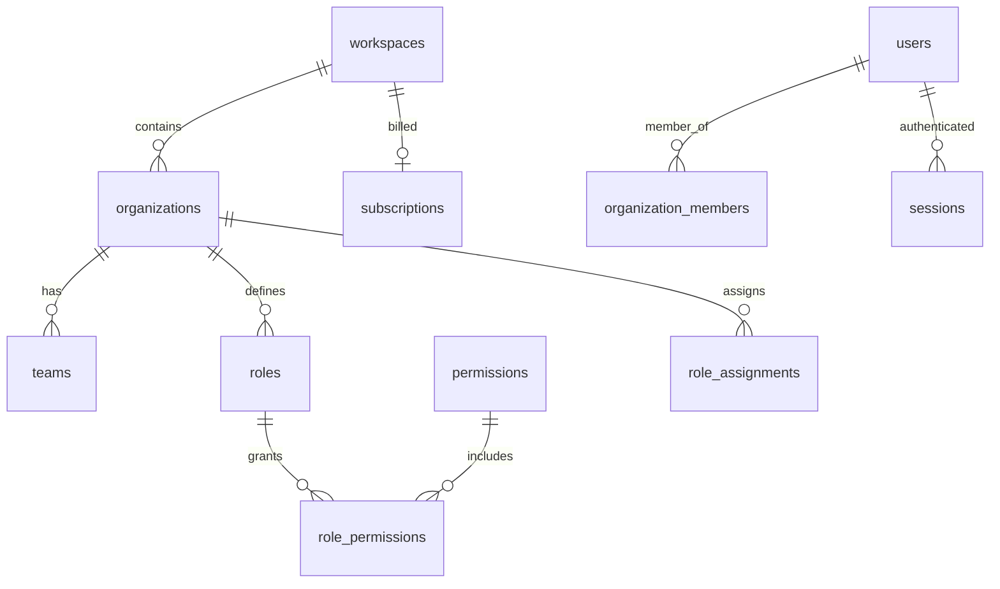
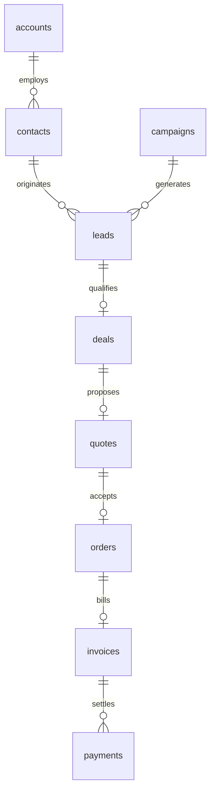
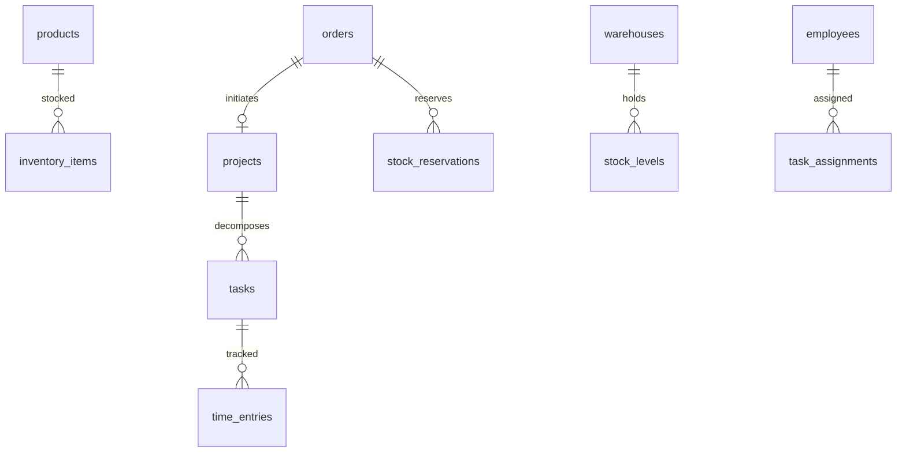
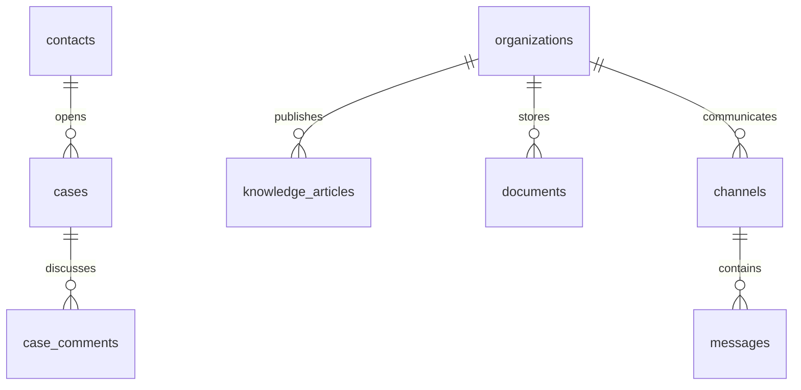
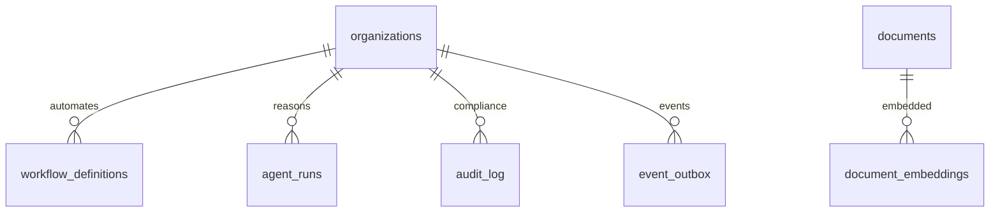

# Entity Relationship Overview

## Purpose

Provide a complete platform-level entity-relationship model for Atlas BOS. This document maps all bounded contexts, their core aggregates, cross-domain references, and cardinality rules. Domain-specific DDL lives in `02-*` through `18-*` documents; this document is the navigational map.

## Scope

- Platform-wide ERD (all 19 bounded contexts)
- Domain grouping diagrams
- Relationship cardinality legend
- Cross-domain reference table
- Foreign key ownership rules

---

## Tenancy and Hierarchy Model

Atlas implements a three-level organizational hierarchy. **Organization** is the RLS tenant boundary; **Workspace** is the billing and policy root; **Team** is the authorization scope.

```
┌──────────────────────────────────────────────────────────────────┐
│  Workspace (billing root, SSO policy, feature entitlements)      │
│  ┌────────────────────────┐  ┌────────────────────────┐         │
│  │ Organization A (tenant) │  │ Organization B (tenant) │         │
│  │  ┌──────┐  ┌──────┐    │  │  ┌──────┐              │         │
│  │  │Team 1│  │Team 2│    │  │  │Team 3│              │         │
│  │  └──────┘  └──────┘    │  │  └──────┘              │         │
│  └────────────────────────┘  └────────────────────────┘         │
└──────────────────────────────────────────────────────────────────┘
```

| Level | Primary Key Scope | RLS Key | Schema |
|-------|-------------------|---------|--------|
| Workspace | `workspace_id` | None | `atlas_core` |
| Organization | `organization_id` | **`organization_id`** | `atlas_core` + all domain schemas |
| Team | `team_id` + `organization_id` | Inherited from org | `atlas_core` |
| User | Global `user_id` | Self-access policies | `atlas_core` |

---

## Relationship Cardinality Legend

| Notation | Meaning | Example |
|----------|---------|---------|
| `\|\|--o{` | One-to-many (optional many) | Organization has zero or many Teams |
| `\|\|--\|{` | One-to-many (required many) | Order has one or more Line Items |
| `\|\|--o\|` | One-to-one (optional) | User has zero or one Profile |
| `\|\|--\|o` | One-to-zero-or-one | Organization has optional SSO config |
| `}o--o{` | Many-to-many (junction table) | Roles ↔ Permissions via `role_permissions` |
| `PK` | Primary key | `id UUID` |
| `FK` | Foreign key | `organization_id → organizations.id` |
| `UK` | Unique constraint (often partial) | `(organization_id, email) WHERE deleted_at IS NULL` |

### Cardinality Rules

| Rule | Description |
|------|-------------|
| **C-01** | All domain entities belong to exactly one `organization_id` |
| **C-02** | Users are global; membership is via junction tables |
| **C-03** | Cross-organization references are prohibited in business data |
| **C-04** | Cross-domain references use UUID FK within same `organization_id` |
| **C-05** | Polymorphic references (`resource_type` + `resource_id`) require CHECK constraints |
| **C-06** | Soft-deleted parents may retain FK from active children (application enforces integrity) |

---

## Complete Platform ERD

The diagram below covers all Atlas bounded contexts and their primary aggregates. Detailed columns are in domain documents.

```mermaid
erDiagram
    %% ═══════════════════════════════════════════════════════════
    %% PLATFORM CORE (atlas_core)
    %% ═══════════════════════════════════════════════════════════
    workspaces ||--o{ organizations : contains
    workspaces ||--o{ workspace_members : has
    organizations ||--o{ organization_members : has
    organizations ||--o{ teams : has
    organizations ||--o{ invitations : sends
    teams ||--o{ team_members : has
    users ||--o{ organization_members : joins
    users ||--o{ team_members : joins
    users ||--o{ workspace_members : joins
    users ||--o| user_profiles : has

    %% ═══════════════════════════════════════════════════════════
    %% IDENTITY & AUTH (atlas_core)
    %% ═══════════════════════════════════════════════════════════
    users ||--o{ sessions : has
    users ||--o{ refresh_tokens : has
    users ||--o{ mfa_devices : has
    users ||--o{ password_reset_tokens : has
    organizations ||--o{ sso_connections : configures
    organizations ||--o{ api_keys : issues
    users ||--o{ api_keys : owns

    %% ═══════════════════════════════════════════════════════════
    %% AUTHORIZATION (atlas_core)
    %% ═══════════════════════════════════════════════════════════
    organizations ||--o{ roles : defines
    roles ||--o{ role_permissions : grants
    permissions ||--o{ role_permissions : assigned
    organizations ||--o{ role_assignments : binds
    roles ||--o{ role_assignments : assigned_via
    organizations ||--o{ resource_grants : grants
    organizations ||--o{ policies : defines
    policies ||--o{ policy_bindings : bound

    %% ═══════════════════════════════════════════════════════════
    %% BILLING & ENTITLEMENTS (atlas_core)
    %% ═══════════════════════════════════════════════════════════
    workspaces ||--o| subscriptions : has
    plans ||--o{ subscriptions : tier
    workspaces ||--o{ usage_records : meters
    workspaces ||--o{ billing_invoices : billed

    %% ═══════════════════════════════════════════════════════════
    %% CUSTOMER / CRM (customer)
    %% ═══════════════════════════════════════════════════════════
    organizations ||--o{ accounts : owns
    organizations ||--o{ contacts : owns
    organizations ||--o{ leads : owns
    organizations ||--o{ deals : owns
    organizations ||--o{ pipelines : owns
    accounts ||--o{ contacts : employs
    accounts ||--o{ deals : involved
    contacts ||--o{ deals : primary
    pipelines ||--o{ pipeline_stages : has
    pipeline_stages ||--o{ deals : contains
    leads ||--o| deals : converts_to

    %% ═══════════════════════════════════════════════════════════
    %% COMMERCIAL / SALES (commercial)
    %% ═══════════════════════════════════════════════════════════
    organizations ||--o{ products : catalogs
    organizations ||--o{ price_books : prices
    organizations ||--o{ quotes : issues
    organizations ||--o{ orders : fulfills
    quotes ||--o{ quote_line_items : contains
    orders ||--o{ order_line_items : contains
    deals ||--o| quotes : generates
    quotes ||--o| orders : converts_to
    products ||--o{ order_line_items : referenced
    contacts ||--o{ orders : places
    accounts ||--o{ orders : billed_to

    %% ═══════════════════════════════════════════════════════════
    %% LEDGER / FINANCE (ledger)
    %% ═══════════════════════════════════════════════════════════
    organizations ||--o{ chart_of_accounts : maintains
    organizations ||--o{ fiscal_periods : defines
    organizations ||--o{ journal_entries : posts
    organizations ||--o{ invoices : issues
    organizations ||--o{ payments : receives
    chart_of_accounts ||--o{ journal_entry_lines : debits_credits
    journal_entries ||--o{ journal_entry_lines : contains
    orders ||--o| invoices : generates
    invoices ||--o{ invoice_line_items : contains
    invoices ||--o{ payments : paid_by
    payments ||--o{ payment_allocations : allocates

    %% ═══════════════════════════════════════════════════════════
    %% WORKFORCE / HR (workforce)
    %% ═══════════════════════════════════════════════════════════
    organizations ||--o{ departments : structures
    organizations ||--o{ employees : employs
    organizations ||--o{ positions : defines
    departments ||--o{ employees : contains
    users ||--o| employees : linked
    employees ||--o{ time_off_requests : requests
    employees ||--o{ employment_records : history

    %% ═══════════════════════════════════════════════════════════
    %% DELIVERY / PM (delivery)
    %% ═══════════════════════════════════════════════════════════
    organizations ||--o{ projects : manages
    projects ||--o{ milestones : has
    projects ||--o{ tasks : contains
    tasks ||--o{ task_assignments : assigned
    tasks ||--o{ time_entries : logged
    employees ||--o{ task_assignments : works_on
    orders ||--o| projects : initiates

    %% ═══════════════════════════════════════════════════════════
    %% SERVICE / SUPPORT (service)
    %% ═══════════════════════════════════════════════════════════
    organizations ||--o{ support_queues : routes
    organizations ||--o{ cases : manages
    organizations ||--o{ sla_policies : defines
    contacts ||--o{ cases : reports
    cases ||--o{ case_comments : threaded
    cases ||--o{ case_activities : audited
    sla_policies ||--o{ cases : governs

    %% ═══════════════════════════════════════════════════════════
    %% CONTENT / DOCS (content)
    %% ═══════════════════════════════════════════════════════════
    organizations ||--o{ folders : organizes
    organizations ||--o{ documents : stores
    folders ||--o{ documents : contains
    folders ||--o{ folders : nested
    documents ||--o{ document_versions : versions

    %% ═══════════════════════════════════════════════════════════
    %% COMMUNICATION / MESSAGING (communication)
    %% ═══════════════════════════════════════════════════════════
    organizations ||--o{ channels : hosts
    channels ||--o{ messages : contains
    channels ||--o{ channel_members : members
    messages ||--o{ message_reactions : reacts
    users ||--o{ channel_members : participates

    %% ═══════════════════════════════════════════════════════════
    %% CAMPAIGN / MARKETING (campaign)
    %% ═══════════════════════════════════════════════════════════
    organizations ||--o{ segments : defines
    organizations ||--o{ campaigns : runs
    organizations ||--o{ email_templates : templates
    segments ||--o{ segment_members : contains
    campaigns ||--o{ campaign_sends : dispatches
    contacts ||--o{ segment_members : included

    %% ═══════════════════════════════════════════════════════════
    %% STOCK / INVENTORY (stock)
    %% ═══════════════════════════════════════════════════════════
    organizations ||--o{ warehouses : operates
    organizations ||--o{ inventory_items : tracks
    products ||--o| inventory_items : stocked_as
    warehouses ||--o{ stock_levels : holds
    inventory_items ||--o{ stock_levels : quantity
    inventory_items ||--o{ stock_movements : moves
    orders ||--o{ stock_reservations : reserves

    %% ═══════════════════════════════════════════════════════════
    %% OBLIGATION / LEGAL (obligation)
    %% ═══════════════════════════════════════════════════════════
    organizations ||--o{ contract_templates : templates
    organizations ||--o{ contracts : executes
    contract_templates ||--o{ contracts : instantiated
    contracts ||--o{ contract_clauses : contains
    accounts ||--o{ contracts : party

    %% ═══════════════════════════════════════════════════════════
    %% ORCHESTRATION / AUTOMATION (orchestration)
    %% ═══════════════════════════════════════════════════════════
    organizations ||--o{ workflow_definitions : defines
    workflow_definitions ||--o{ workflow_instances : executes
    workflow_instances ||--o{ workflow_step_runs : steps

    %% ═══════════════════════════════════════════════════════════
    %% INTELLIGENCE / AI (intelligence)
    %% ═══════════════════════════════════════════════════════════
    organizations ||--o{ agent_runs : executes
    organizations ||--o{ document_embeddings : embeds
    organizations ||--o{ memory_entries : remembers
    documents ||--o{ document_embeddings : chunked
    agent_runs ||--o{ agent_tool_calls : invokes

    %% ═══════════════════════════════════════════════════════════
    %% INSIGHT / ANALYTICS (insight) — read models
    %% ═══════════════════════════════════════════════════════════
    organizations ||--o{ dashboards : displays
    organizations ||--o{ reports : generates
    dashboards ||--o{ dashboard_widgets : contains

    %% ═══════════════════════════════════════════════════════════
    %% AUDIT & EVENTS (atlas_audit + atlas_core)
    %% ═══════════════════════════════════════════════════════════
    organizations ||--o{ audit_log : audited
    organizations ||--o{ event_outbox : publishes
    organizations ||--o{ authz_audit_log : decisions

    %% ═══════════════════════════════════════════════════════════
    %% INTEGRATIONS (atlas_core)
    %% ═══════════════════════════════════════════════════════════
    organizations ||--o{ connectors : connects
    organizations ||--o{ webhook_endpoints : registers
    connectors ||--o{ sync_jobs : syncs
```



---

## Domain Grouping Diagrams

### Group 1: Platform Foundation

Core identity, access control, and commercial registry. All other domains depend on this group.



| Domain | Schema | Aggregate Roots |
|--------|--------|-----------------|
| Platform Core | `atlas_core` | Workspace, Organization, Team |
| Identity & Auth | `atlas_core` | User, Session, ApiKey |
| Authorization | `atlas_core` | Role, Permission, Policy |
| Billing | `atlas_core` | Subscription, UsageRecord |

### Group 2: Revenue Domain

Customer acquisition through cash collection. Primary value stream: Acquire & Convert.



| Domain | Schema | Upstream | Downstream |
|--------|--------|----------|------------|
| CRM | `customer` | Platform | Commercial |
| Sales | `commercial` | Customer | Ledger |
| Marketing | `campaign` | Customer | Customer |
| Finance | `ledger` | Commercial | Insight |

### Group 3: Operations Domain

Fulfillment, inventory, and project delivery. Primary value stream: Deliver & Bill.



| Domain | Schema | Key Cross-Refs |
|--------|--------|----------------|
| Project Management | `delivery` | `orders.id`, `employees.id` |
| Inventory | `stock` | `products.id`, `orders.id` |
| HR | `workforce` | `users.id` |

### Group 4: Engagement Domain

Customer service, knowledge, documents, and internal communications.



### Group 5: Platform Services

Automation, AI, analytics, and compliance infrastructure.



---

## Cross-Domain Reference Table

Canonical foreign key references across bounded contexts. All references require matching `organization_id` (enforced by application + composite FK where feasible).

| Source Table | Source Column | Target Table | Target Column | Cardinality | Integration Pattern |
|--------------|---------------|--------------|---------------|-------------|---------------------|
| `customer.contacts` | `account_id` | `customer.accounts` | `id` | N:1 | Same schema |
| `customer.deals` | `contact_id` | `customer.contacts` | `id` | N:1 | Same schema |
| `commercial.quotes` | `deal_id` | `customer.deals` | `id` | N:1 | Cross-schema FK |
| `commercial.orders` | `quote_id` | `commercial.quotes` | `id` | 1:1 | Same schema |
| `commercial.orders` | `contact_id` | `customer.contacts` | `id` | N:1 | Cross-schema FK |
| `ledger.invoices` | `order_id` | `commercial.orders` | `id` | 1:1 | Cross-schema FK |
| `ledger.payments` | `invoice_id` | `ledger.invoices` | `id` | N:1 | Same schema |
| `delivery.projects` | `order_id` | `commercial.orders` | `id` | 1:1 | Cross-schema FK |
| `delivery.task_assignments` | `employee_id` | `workforce.employees` | `id` | N:1 | Cross-schema FK |
| `service.cases` | `contact_id` | `customer.contacts` | `id` | N:1 | Cross-schema FK |
| `stock.inventory_items` | `product_id` | `commercial.products` | `id` | 1:1 | Cross-schema FK |
| `stock.stock_reservations` | `order_id` | `commercial.orders` | `id` | N:1 | Cross-schema FK |
| `intelligence.document_embeddings` | `document_id` | `content.documents` | `id` | N:1 | Cross-schema FK |
| `workforce.employees` | `user_id` | `atlas_core.users` | `id` | 1:1 | Platform FK |
| `atlas_core.organization_members` | `user_id` | `atlas_core.users` | `id` | N:1 | Platform FK |
| `atlas_core.role_assignments` | `role_id` | `atlas_core.roles` | `id` | N:1 | Platform FK |
| `atlas_core.sessions` | `user_id` | `atlas_core.users` | `id` | N:1 | Platform FK |
| `atlas_core.api_keys` | `organization_id` | `atlas_core.organizations` | `id` | N:1 | Platform FK |
| `atlas_core.event_outbox` | `organization_id` | `atlas_core.organizations` | `id` | N:1 | Event fabric |
| `atlas_core.resource_grants` | `resource_id` | (polymorphic) | `id` | N:1 | ABAC |

### Cross-Domain Integrity Rules

| Rule | Description |
|------|-------------|
| **XD-01** | Cross-schema FKs include `organization_id` in composite key where PostgreSQL allows |
| **XD-02** | Event-driven updates preferred for loose coupling (e.g., Insight projections) |
| **XD-03** | Anti-Corruption Layer modules translate external IDs at boundary |
| **XD-04** | No cross-organization FK — database triggers reject mismatched `organization_id` |
| **XD-05** | Soft-deleted target rows: FK remains valid; application checks `deleted_at` |

### Polymorphic Reference Pattern

Used by `resource_grants`, `policy_bindings`, and `audit_log`:

```sql
resource_type TEXT NOT NULL CHECK (resource_type IN (
    'project', 'document', 'invoice', 'contact', 'case'
)),
resource_id   UUID NOT NULL,
organization_id UUID NOT NULL,
CONSTRAINT uq_resource_grants_natural
    UNIQUE (organization_id, resource_type, resource_id, principal_type, principal_id, permission)
```

---

## Event-Driven Relationships

Not all cross-domain relationships are FK-enforced. Some are **eventual** via the event fabric:

| Relationship | Pattern | Event |
|--------------|---------|-------|
| Order → Invoice | Saga + idempotent consumer | `commercial.order.confirmed.v1` |
| Lead → Contact | Event projection | `customer.lead.converted.v1` |
| Invoice → Search Index | Outbox relay | `ledger.invoice.posted.v1` |
| Permission → Redis Cache | Cache invalidation | `platform.role_assignment.changed.v1` |
| Document → Embedding | Async pipeline | `content.document.updated.v1` |

```
┌─────────────┐    same txn     ┌──────────────┐    relay     ┌─────────────┐
│ Source      │───────────────▶│ event_outbox │─────────────▶│  Consumer   │
│ Aggregate   │  INSERT outbox │ (atlas_core) │   Kafka     │  (target)   │
└─────────────┘                └──────────────┘              └─────────────┘
```

---

## Schema-to-Module Map

| Bounded Context | PostgreSQL Schema | Phase 3 Doc | Approx. Tables |
|-----------------|-------------------|-------------|----------------|
| Tenant & Identity | `atlas_core` | `02-platform-core.md` | 8 |
| Identity & Auth | `atlas_core` | `03-identity-auth.md` | 8 |
| Authorization | `atlas_core` | `04-authorization.md` | 7 |
| Customer (CRM) | `customer` | `04-crm.md` | 10 |
| Commercial (Sales) | `commercial` | `05-sales.md` | 8 |
| Ledger (Finance) | `ledger` | `06-finance.md` | 12 |
| Workforce (HR) | `workforce` | `07-hr.md` | 8 |
| Delivery (PM) | `delivery` | `08-project-management.md` | 7 |
| Service (Support) | `service` | `09-support.md` | 6 |
| Content (Docs) | `content` | `10-documents.md` | 5 |
| Communication | `communication` | `11-messaging.md` | 5 |
| Campaign (Marketing) | `campaign` | `12-marketing.md` | 6 |
| Stock (Inventory) | `stock` | `13-inventory.md` | 6 |
| Orchestration | `orchestration` | `14-workflows.md` | 4 |
| Intelligence (AI) | `intelligence` | `15-ai-memory.md` | 5 |
| Integrations | `atlas_core` | `16-integrations.md` | 4 |
| Billing | `atlas_core` | `17-billing.md` | 5 |
| Audit & Events | `atlas_audit` | `18-audit-events.md` | 4 |

---

## Read Path Decision Tree

When joining across domains, follow this decision tree:

```
Need data from another domain?
├── Strong consistency required?
│   ├── Yes → FK reference + same-transaction read (primary DB)
│   └── No → Read replica + eventual projection
├── Write required in both domains?
│   ├── Yes → Saga orchestration + outbox events
│   └── No → Single-domain write + event notification
└── Reporting / analytics?
    └── Insight schema read model (populated by events)
```

---

## Cross-References

| Document | Content |
|----------|---------|
| [00-conventions.md](00-conventions.md) | Column standards, RLS, naming |
| [02-platform-core.md](02-platform-core.md) | Organizations, workspaces, teams |
| [03-identity-auth.md](03-identity-auth.md) | Users, sessions, SSO |
| [04-authorization.md](04-authorization.md) | Roles, permissions, policies |
| [01-business-architecture.md](../architecture/phase-1/01-business-architecture.md) | Bounded contexts |

---

*Document owner: Platform Architecture · Review cadence: Per domain addition*