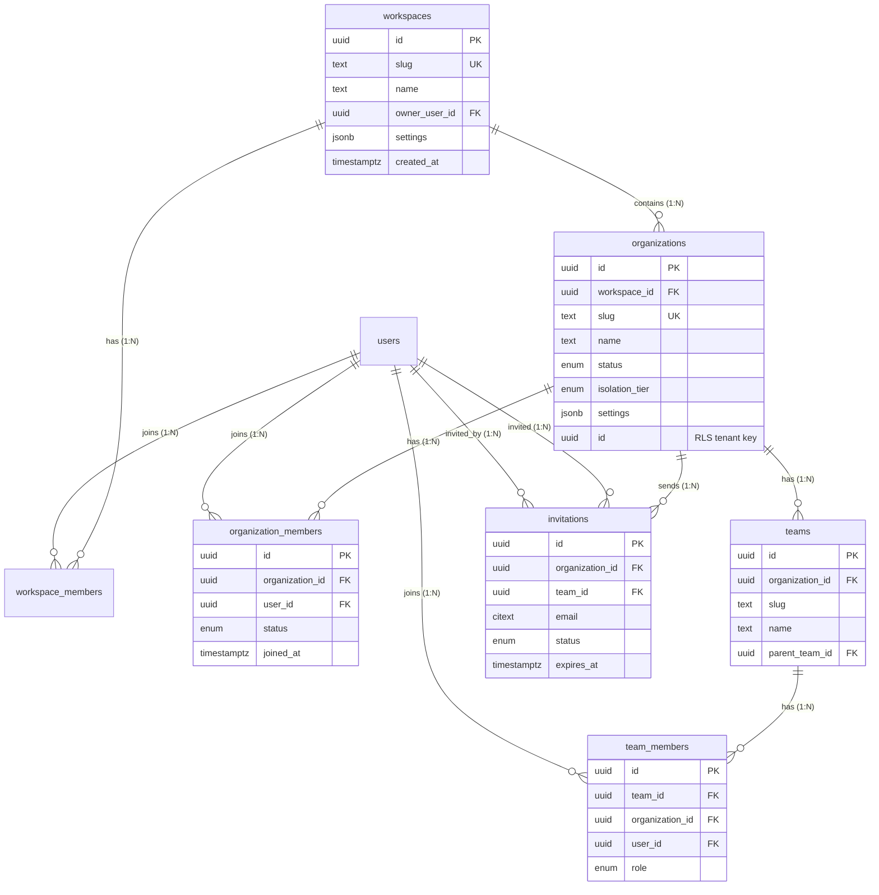

# Platform Core Schema

## Purpose

Define the database schema for Atlas platform core entities: **Workspaces**, **Organizations**, **Teams**, membership junctions, and **Invitations**. These tables establish the multi-tenancy hierarchy, billing root, and membership graph upon which all business domains depend.

## Bounded Context

**Tenant & Identity** — upstream context exposing stable identifiers and membership events to all modules.

## Entity Relationship Diagram



---

## Business Rules

| ID | Rule |
|----|------|
| **PC-01** | Every organization belongs to exactly one workspace |
| **PC-02** | Organization `slug` is unique within workspace |
| **PC-03** | Team `slug` is unique within organization |
| **PC-04** | A user may belong to multiple organizations (same or different workspaces) |
| **PC-05** | Workspace owner cannot be removed without ownership transfer |
| **PC-06** | Organization must have at least one `owner` member at all times |
| **PC-07** | Invitations expire after 7 days (configurable per workspace) |
| **PC-08** | `organization_id` is the RLS tenant key for all business data |
| **PC-09** | Workspace deletion cascades soft-delete to child organizations |
| **PC-10** | Team hierarchy depth limited to 5 levels (`parent_team_id` chain) |
| **PC-11** | Cross-organization membership requires separate `organization_members` row per org |
| **PC-12** | Billing attaches to workspace; seat counts aggregate `organization_members` |

---

## DDL: Enums and Schema Bootstrap

```sql
-- V010__platform_core_enums.sql
CREATE SCHEMA IF NOT EXISTS atlas_core;

CREATE TYPE atlas_core.organization_status AS ENUM (
    'PROVISIONING',
    'ACTIVE',
    'SUSPENDED',
    'ARCHIVED'
);

CREATE TYPE atlas_core.isolation_tier AS ENUM (
    'SHARED_RLS',
    'DEDICATED_SCHEMA',
    'DEDICATED_CLUSTER'
);

CREATE TYPE atlas_core.membership_status AS ENUM (
    'ACTIVE',
    'SUSPENDED',
    'REMOVED'
);

CREATE TYPE atlas_core.team_member_role AS ENUM (
    'LEAD',
    'MEMBER'
);

CREATE TYPE atlas_core.invitation_status AS ENUM (
    'PENDING',
    'ACCEPTED',
    'DECLINED',
    'EXPIRED',
    'REVOKED'
);
```

---

## DDL: Workspaces

Workspaces are the **billing and policy root**. They are not the RLS tenant boundary.

```sql
-- V011__create_workspaces.sql
CREATE TABLE atlas_core.workspaces (
    id                  UUID PRIMARY KEY DEFAULT gen_random_uuid(),
    slug                TEXT NOT NULL,
    name                TEXT NOT NULL,
    display_name        TEXT,
    owner_user_id       UUID NOT NULL,  -- FK added after users table
    plan_id             UUID,           -- FK to plans (billing module)
    settings            JSONB NOT NULL DEFAULT '{}',
    metadata            JSONB NOT NULL DEFAULT '{}',
    is_active           BOOLEAN NOT NULL DEFAULT true,
    created_at          TIMESTAMPTZ NOT NULL DEFAULT now(),
    updated_at          TIMESTAMPTZ NOT NULL DEFAULT now(),
    deleted_at          TIMESTAMPTZ,
    created_by_id       UUID,
    updated_by_id       UUID,
    version             INTEGER NOT NULL DEFAULT 1,

    CONSTRAINT chk_workspaces_slug_format
        CHECK (slug ~ '^[a-z0-9][a-z0-9-]{1,62}[a-z0-9]$'),
    CONSTRAINT chk_workspaces_settings_is_object
        CHECK (jsonb_typeof(settings) = 'object'),
    CONSTRAINT chk_workspaces_metadata_size
        CHECK (octet_length(metadata::text) <= 65536)
);

CREATE UNIQUE INDEX uq_workspaces_slug_active
    ON atlas_core.workspaces (slug)
    WHERE deleted_at IS NULL;

CREATE INDEX idx_workspaces_owner_user_id
    ON atlas_core.workspaces (owner_user_id)
    WHERE deleted_at IS NULL;

CREATE INDEX idx_workspaces_active
    ON atlas_core.workspaces (created_at DESC)
    WHERE deleted_at IS NULL AND is_active = true;

CREATE TRIGGER trg_workspaces_set_updated_at
    BEFORE UPDATE ON atlas_core.workspaces
    FOR EACH ROW
    EXECUTE FUNCTION atlas_core.set_updated_at();

COMMENT ON TABLE atlas_core.workspaces IS
    'Billing and policy root. Contains one or more organizations.';
```

### Workspace RLS

Workspaces use **membership-based** RLS (not `organization_id`):

```sql
ALTER TABLE atlas_core.workspaces ENABLE ROW LEVEL SECURITY;
ALTER TABLE atlas_core.workspaces FORCE ROW LEVEL SECURITY;

CREATE POLICY workspaces_select ON atlas_core.workspaces
    FOR SELECT
    USING (
        id IN (
            SELECT workspace_id FROM atlas_core.workspace_members
            WHERE user_id = NULLIF(current_setting('app.user_id', true), '')::uuid
              AND status = 'ACTIVE'
              AND deleted_at IS NULL
        )
        OR owner_user_id = NULLIF(current_setting('app.user_id', true), '')::uuid
        OR current_setting('app.is_platform_admin', true) = 'true'
    );
```

---

## DDL: Organizations

Organizations are the **RLS tenant boundary**. The `id` column is used as `organization_id` throughout all domain schemas.

```sql
-- V012__create_organizations.sql
CREATE TABLE atlas_core.organizations (
    id                  UUID PRIMARY KEY DEFAULT gen_random_uuid(),
    workspace_id        UUID NOT NULL REFERENCES atlas_core.workspaces(id),
    slug                TEXT NOT NULL,
    name                TEXT NOT NULL,
    display_name        TEXT,
    legal_name          TEXT,
    status              atlas_core.organization_status NOT NULL DEFAULT 'PROVISIONING',
    isolation_tier      atlas_core.isolation_tier NOT NULL DEFAULT 'SHARED_RLS',
    timezone            TEXT NOT NULL DEFAULT 'UTC',
    locale              TEXT NOT NULL DEFAULT 'en-US',
    currency_code       CHAR(3) NOT NULL DEFAULT 'USD',
    data_region         TEXT NOT NULL DEFAULT 'us-east-1',
    settings            JSONB NOT NULL DEFAULT '{}',
    metadata            JSONB NOT NULL DEFAULT '{}',
    provisioned_at      TIMESTAMPTZ,
    suspended_at        TIMESTAMPTZ,
    created_at          TIMESTAMPTZ NOT NULL DEFAULT now(),
    updated_at          TIMESTAMPTZ NOT NULL DEFAULT now(),
    deleted_at          TIMESTAMPTZ,
    created_by_id       UUID,
    updated_by_id       UUID,
    version             INTEGER NOT NULL DEFAULT 1,

    CONSTRAINT chk_organizations_slug_format
        CHECK (slug ~ '^[a-z0-9][a-z0-9-]{1,62}[a-z0-9]$'),
    CONSTRAINT chk_organizations_currency_valid
        CHECK (currency_code ~ '^[A-Z]{3}$'),
    CONSTRAINT chk_organizations_settings_is_object
        CHECK (jsonb_typeof(settings) = 'object')
);

CREATE UNIQUE INDEX uq_organizations_workspace_slug_active
    ON atlas_core.organizations (workspace_id, slug)
    WHERE deleted_at IS NULL;

CREATE INDEX idx_organizations_workspace_id
    ON atlas_core.organizations (workspace_id)
    WHERE deleted_at IS NULL;

CREATE INDEX idx_organizations_status
    ON atlas_core.organizations (status)
    WHERE deleted_at IS NULL;

CREATE INDEX idx_organizations_data_region
    ON atlas_core.organizations (data_region)
    WHERE deleted_at IS NULL AND status = 'ACTIVE';

CREATE TRIGGER trg_organizations_set_updated_at
    BEFORE UPDATE ON atlas_core.organizations
    FOR EACH ROW
    EXECUTE FUNCTION atlas_core.set_updated_at();

COMMENT ON TABLE atlas_core.organizations IS
    'RLS tenant boundary. All business data references organization_id = organizations.id.';
```

### Organization RLS

```sql
ALTER TABLE atlas_core.organizations ENABLE ROW LEVEL SECURITY;
ALTER TABLE atlas_core.organizations FORCE ROW LEVEL SECURITY;

CREATE POLICY organizations_select ON atlas_core.organizations
    FOR SELECT
    USING (
        id = NULLIF(current_setting('app.organization_id', true), '')::uuid
        OR id IN (
            SELECT organization_id FROM atlas_core.organization_members
            WHERE user_id = NULLIF(current_setting('app.user_id', true), '')::uuid
              AND status = 'ACTIVE'
              AND deleted_at IS NULL
        )
        OR current_setting('app.is_platform_admin', true) = 'true'
    );

CREATE POLICY organizations_update ON atlas_core.organizations
    FOR UPDATE
    USING (
        id = NULLIF(current_setting('app.organization_id', true), '')::uuid
    )
    WITH CHECK (
        id = NULLIF(current_setting('app.organization_id', true), '')::uuid
    );
```

---

## DDL: Teams

Teams are functional groups within an organization, used for authorization scoping and collaboration.

```sql
-- V013__create_teams.sql
CREATE TABLE atlas_core.teams (
    id                  UUID PRIMARY KEY DEFAULT gen_random_uuid(),
    organization_id     UUID NOT NULL REFERENCES atlas_core.organizations(id),
    parent_team_id      UUID REFERENCES atlas_core.teams(id),
    slug                TEXT NOT NULL,
    name                TEXT NOT NULL,
    description         TEXT,
    settings            JSONB NOT NULL DEFAULT '{}',
    metadata            JSONB NOT NULL DEFAULT '{}',
    is_default          BOOLEAN NOT NULL DEFAULT false,
    created_at          TIMESTAMPTZ NOT NULL DEFAULT now(),
    updated_at          TIMESTAMPTZ NOT NULL DEFAULT now(),
    deleted_at          TIMESTAMPTZ,
    created_by_id       UUID,
    updated_by_id       UUID,
    version             INTEGER NOT NULL DEFAULT 1,

    CONSTRAINT fk_teams_organization
        FOREIGN KEY (organization_id) REFERENCES atlas_core.organizations(id),
    CONSTRAINT chk_teams_slug_format
        CHECK (slug ~ '^[a-z0-9][a-z0-9-]{1,62}[a-z0-9]$'),
    CONSTRAINT chk_teams_no_self_parent
        CHECK (parent_team_id IS NULL OR parent_team_id != id)
);

CREATE UNIQUE INDEX uq_teams_org_slug_active
    ON atlas_core.teams (organization_id, slug)
    WHERE deleted_at IS NULL;

CREATE INDEX idx_teams_organization_id
    ON atlas_core.teams (organization_id)
    WHERE deleted_at IS NULL;

CREATE INDEX idx_teams_parent_team_id
    ON atlas_core.teams (parent_team_id)
    WHERE deleted_at IS NULL AND parent_team_id IS NOT NULL;

CREATE TRIGGER trg_teams_set_updated_at
    BEFORE UPDATE ON atlas_core.teams
    FOR EACH ROW
    EXECUTE FUNCTION atlas_core.set_updated_at();

-- Standard organization-scoped RLS
SELECT atlas_core.apply_standard_rls('atlas_core', 'teams');
```

---

## DDL: Workspace Members

```sql
-- V014__create_workspace_members.sql
CREATE TABLE atlas_core.workspace_members (
    id                  UUID PRIMARY KEY DEFAULT gen_random_uuid(),
    workspace_id        UUID NOT NULL REFERENCES atlas_core.workspaces(id),
    user_id             UUID NOT NULL,  -- FK to users
    status              atlas_core.membership_status NOT NULL DEFAULT 'ACTIVE',
    is_admin            BOOLEAN NOT NULL DEFAULT false,
    joined_at           TIMESTAMPTZ NOT NULL DEFAULT now(),
    removed_at          TIMESTAMPTZ,
    metadata            JSONB NOT NULL DEFAULT '{}',
    created_at          TIMESTAMPTZ NOT NULL DEFAULT now(),
    updated_at          TIMESTAMPTZ NOT NULL DEFAULT now(),
    deleted_at          TIMESTAMPTZ,
    created_by_id       UUID,
    updated_by_id       UUID,
    version             INTEGER NOT NULL DEFAULT 1,

    CONSTRAINT chk_workspace_members_removed_consistency
        CHECK (
            (status = 'REMOVED' AND removed_at IS NOT NULL)
            OR (status != 'REMOVED' AND removed_at IS NULL)
        )
);

CREATE UNIQUE INDEX uq_workspace_members_active
    ON atlas_core.workspace_members (workspace_id, user_id)
    WHERE deleted_at IS NULL AND status = 'ACTIVE';

CREATE INDEX idx_workspace_members_user_id
    ON atlas_core.workspace_members (user_id)
    WHERE deleted_at IS NULL AND status = 'ACTIVE';

CREATE INDEX idx_workspace_members_workspace_id
    ON atlas_core.workspace_members (workspace_id)
    WHERE deleted_at IS NULL;

CREATE TRIGGER trg_workspace_members_set_updated_at
    BEFORE UPDATE ON atlas_core.workspace_members
    FOR EACH ROW
    EXECUTE FUNCTION atlas_core.set_updated_at();
```

---

## DDL: Organization Members

```sql
-- V015__create_organization_members.sql
CREATE TABLE atlas_core.organization_members (
    id                  UUID PRIMARY KEY DEFAULT gen_random_uuid(),
    organization_id     UUID NOT NULL REFERENCES atlas_core.organizations(id),
    user_id             UUID NOT NULL,  -- FK to users
    status              atlas_core.membership_status NOT NULL DEFAULT 'ACTIVE',
    title               TEXT,
    department          TEXT,
    is_owner            BOOLEAN NOT NULL DEFAULT false,
    is_billing_admin    BOOLEAN NOT NULL DEFAULT false,
    joined_at           TIMESTAMPTZ NOT NULL DEFAULT now(),
    removed_at          TIMESTAMPTZ,
    last_active_at      TIMESTAMPTZ,
    metadata            JSONB NOT NULL DEFAULT '{}',
    created_at          TIMESTAMPTZ NOT NULL DEFAULT now(),
    updated_at          TIMESTAMPTZ NOT NULL DEFAULT now(),
    deleted_at          TIMESTAMPTZ,
    created_by_id       UUID,
    updated_by_id       UUID,
    version             INTEGER NOT NULL DEFAULT 1,

    CONSTRAINT chk_org_members_removed_consistency
        CHECK (
            (status = 'REMOVED' AND removed_at IS NOT NULL)
            OR (status != 'REMOVED' AND removed_at IS NULL)
        )
);

CREATE UNIQUE INDEX uq_organization_members_active
    ON atlas_core.organization_members (organization_id, user_id)
    WHERE deleted_at IS NULL AND status = 'ACTIVE';

CREATE INDEX idx_organization_members_user_id
    ON atlas_core.organization_members (user_id)
    WHERE deleted_at IS NULL AND status = 'ACTIVE';

CREATE INDEX idx_organization_members_organization_id
    ON atlas_core.organization_members (organization_id)
    WHERE deleted_at IS NULL;

CREATE INDEX idx_organization_members_owners
    ON atlas_core.organization_members (organization_id)
    WHERE deleted_at IS NULL AND is_owner = true;

CREATE TRIGGER trg_organization_members_set_updated_at
    BEFORE UPDATE ON atlas_core.organization_members
    FOR EACH ROW
    EXECUTE FUNCTION atlas_core.set_updated_at();

-- Prevent removing last owner
CREATE OR REPLACE FUNCTION atlas_core.check_org_owner_exists()
RETURNS TRIGGER AS $$
BEGIN
    IF (TG_OP = 'UPDATE' AND NEW.is_owner = false AND OLD.is_owner = true)
       OR (TG_OP = 'DELETE' AND OLD.is_owner = true)
       OR (TG_OP = 'UPDATE' AND NEW.status = 'REMOVED' AND OLD.is_owner = true) THEN
        IF NOT EXISTS (
            SELECT 1 FROM atlas_core.organization_members
            WHERE organization_id = COALESCE(NEW.organization_id, OLD.organization_id)
              AND is_owner = true
              AND status = 'ACTIVE'
              AND deleted_at IS NULL
              AND id != COALESCE(NEW.id, OLD.id)
        ) THEN
            RAISE EXCEPTION 'Organization must have at least one active owner';
        END IF;
    END IF;
    RETURN COALESCE(NEW, OLD);
END;
$$ LANGUAGE plpgsql;

CREATE TRIGGER trg_organization_members_owner_check
    BEFORE UPDATE OR DELETE ON atlas_core.organization_members
    FOR EACH ROW
    EXECUTE FUNCTION atlas_core.check_org_owner_exists();

SELECT atlas_core.apply_standard_rls('atlas_core', 'organization_members');
```

---

## DDL: Team Members

```sql
-- V016__create_team_members.sql
CREATE TABLE atlas_core.team_members (
    id                  UUID PRIMARY KEY DEFAULT gen_random_uuid(),
    organization_id     UUID NOT NULL REFERENCES atlas_core.organizations(id),
    team_id             UUID NOT NULL REFERENCES atlas_core.teams(id),
    user_id             UUID NOT NULL,  -- FK to users
    role                atlas_core.team_member_role NOT NULL DEFAULT 'MEMBER',
    joined_at           TIMESTAMPTZ NOT NULL DEFAULT now(),
    metadata            JSONB NOT NULL DEFAULT '{}',
    created_at          TIMESTAMPTZ NOT NULL DEFAULT now(),
    updated_at          TIMESTAMPTZ NOT NULL DEFAULT now(),
    deleted_at          TIMESTAMPTZ,
    created_by_id       UUID,
    updated_by_id       UUID,
    version             INTEGER NOT NULL DEFAULT 1,

    CONSTRAINT fk_team_members_team_org
        FOREIGN KEY (team_id, organization_id)
        REFERENCES atlas_core.teams (id, organization_id)
        -- Note: requires unique (id, organization_id) on teams; add below
);

-- Composite unique on teams for org-scoped FK integrity
CREATE UNIQUE INDEX uq_teams_id_organization
    ON atlas_core.teams (id, organization_id);

CREATE UNIQUE INDEX uq_team_members_active
    ON atlas_core.team_members (team_id, user_id)
    WHERE deleted_at IS NULL;

CREATE INDEX idx_team_members_organization_id
    ON atlas_core.team_members (organization_id)
    WHERE deleted_at IS NULL;

CREATE INDEX idx_team_members_user_id
    ON atlas_core.team_members (user_id)
    WHERE deleted_at IS NULL;

CREATE INDEX idx_team_members_team_id
    ON atlas_core.team_members (team_id)
    WHERE deleted_at IS NULL;

CREATE TRIGGER trg_team_members_set_updated_at
    BEFORE UPDATE ON atlas_core.team_members
    FOR EACH ROW
    EXECUTE FUNCTION atlas_core.set_updated_at();

SELECT atlas_core.apply_standard_rls('atlas_core', 'team_members');
```

---

## DDL: Invitations

```sql
-- V017__create_invitations.sql
CREATE TABLE atlas_core.invitations (
    id                  UUID PRIMARY KEY DEFAULT gen_random_uuid(),
    organization_id     UUID NOT NULL REFERENCES atlas_core.organizations(id),
    team_id             UUID REFERENCES atlas_core.teams(id),
    email               CITEXT NOT NULL,
    invited_user_id     UUID,           -- FK to users (if existing user)
    invited_by_id       UUID NOT NULL,  -- FK to users
    status              atlas_core.invitation_status NOT NULL DEFAULT 'PENDING',
    role_id             UUID,           -- FK to roles (authorization module)
    token_hash          TEXT NOT NULL,  -- SHA-256 of invitation token
    message             TEXT,
    expires_at          TIMESTAMPTZ NOT NULL DEFAULT (now() + INTERVAL '7 days'),
    accepted_at         TIMESTAMPTZ,
    declined_at         TIMESTAMPTZ,
    revoked_at          TIMESTAMPTZ,
    metadata            JSONB NOT NULL DEFAULT '{}',
    created_at          TIMESTAMPTZ NOT NULL DEFAULT now(),
    updated_at          TIMESTAMPTZ NOT NULL DEFAULT now(),
    deleted_at          TIMESTAMPTZ,
    created_by_id       UUID,
    updated_by_id       UUID,
    version             INTEGER NOT NULL DEFAULT 1,

    CONSTRAINT chk_invitations_token_hash_length
        CHECK (length(token_hash) = 64),
    CONSTRAINT chk_invitations_expires_future
        CHECK (expires_at > created_at)
);

CREATE UNIQUE INDEX uq_invitations_pending_email_org
    ON atlas_core.invitations (organization_id, email)
    WHERE deleted_at IS NULL AND status = 'PENDING';

CREATE INDEX idx_invitations_organization_id
    ON atlas_core.invitations (organization_id)
    WHERE deleted_at IS NULL;

CREATE INDEX idx_invitations_email
    ON atlas_core.invitations (email)
    WHERE deleted_at IS NULL AND status = 'PENDING';

CREATE INDEX idx_invitations_token_hash
    ON atlas_core.invitations (token_hash)
    WHERE deleted_at IS NULL AND status = 'PENDING';

CREATE INDEX idx_invitations_expires_at
    ON atlas_core.invitations (expires_at)
    WHERE deleted_at IS NULL AND status = 'PENDING';

CREATE TRIGGER trg_invitations_set_updated_at
    BEFORE UPDATE ON atlas_core.invitations
    FOR EACH ROW
    EXECUTE FUNCTION atlas_core.set_updated_at();

-- Auto-expire invitations
CREATE OR REPLACE FUNCTION atlas_core.expire_stale_invitations()
RETURNS void AS $$
BEGIN
    UPDATE atlas_core.invitations
    SET status = 'EXPIRED', updated_at = now(), version = version + 1
    WHERE status = 'PENDING'
      AND expires_at < now()
      AND deleted_at IS NULL;
END;
$$ LANGUAGE plpgsql;

SELECT atlas_core.apply_standard_rls('atlas_core', 'invitations');
```

---

## Provisioning Flow

```
1. User signs up → create users row
2. Create workspace (owner_user_id = user)
3. Create workspace_members (is_admin = true)
4. Create organization (status = PROVISIONING)
5. Create organization_members (is_owner = true)
6. Create default team (is_default = true)
7. Assign owner role (see 04-authorization.md)
8. Set organization status = ACTIVE
9. Emit tenant.organization.created.v1
```

```sql
-- Provisioning transaction (simplified)
BEGIN;
SET LOCAL app.user_id = :creator_id;

INSERT INTO atlas_core.workspaces (slug, name, owner_user_id, created_by_id)
VALUES (:ws_slug, :ws_name, :creator_id, :creator_id)
RETURNING id INTO :workspace_id;

INSERT INTO atlas_core.organizations (workspace_id, slug, name, created_by_id, provisioned_at, status)
VALUES (:workspace_id, :org_slug, :org_name, :creator_id, now(), 'ACTIVE')
RETURNING id INTO :organization_id;

SET LOCAL app.organization_id = :organization_id;

INSERT INTO atlas_core.organization_members (organization_id, user_id, is_owner, created_by_id)
VALUES (:organization_id, :creator_id, true, :creator_id);

COMMIT;
```

---

## Indexes Summary

| Table | Index | Rationale |
|-------|-------|-----------|
| `workspaces` | `uq_workspaces_slug_active` | URL routing |
| `organizations` | `uq_organizations_workspace_slug_active` | Subdomain/path routing |
| `organizations` | `idx_organizations_data_region` | Data residency routing |
| `teams` | `uq_teams_org_slug_active` | Team URL paths |
| `organization_members` | `uq_organization_members_active` | One active membership per user per org |
| `organization_members` | `idx_organization_members_owners` | Owner lookup for billing |
| `invitations` | `uq_invitations_pending_email_org` | Prevent duplicate pending invites |
| `invitations` | `idx_invitations_expires_at` | Expiry cron job |

---

## Events Published

| Event | Trigger | Payload Keys |
|-------|---------|--------------|
| `tenant.workspace.created.v1` | Workspace insert | `workspaceId`, `ownerUserId` |
| `tenant.organization.created.v1` | Org provisioned | `organizationId`, `workspaceId` |
| `tenant.organization.suspended.v1` | Status → SUSPENDED | `organizationId`, `reason` |
| `tenant.member.joined.v1` | Invitation accepted | `organizationId`, `userId` |
| `tenant.member.removed.v1` | Member removed | `organizationId`, `userId` |
| `tenant.team.created.v1` | Team insert | `organizationId`, `teamId` |

---

## Migration Notes

| Migration | Description | Lock Risk |
|-----------|-------------|-----------|
| V010 | Enums | Low |
| V011–V017 | Table creation | Low (empty DB) |
| V018 | FK from workspaces.owner_user_id → users | Low |
| V019 | Composite FK team_members → teams | Low |
| V020 | Seed system roles per organization | Batch job |

**Expand-contract:** Adding `legal_name` or `data_region` columns is safe as nullable expand. Changing `slug` format requires application-level validation first.

---

## Cross-References

| Document | Content |
|----------|---------|
| [00-conventions.md](00-conventions.md) | Standard columns, RLS templates |
| [03-identity-auth.md](03-identity-auth.md) | Users table, session context |
| [04-authorization.md](04-authorization.md) | Roles assigned at invitation |
| [prisma/models/platform.prisma](../../prisma/models/platform.prisma) | Prisma models |

---

*Document owner: Tenant & Identity Team · Review cadence: Per release*