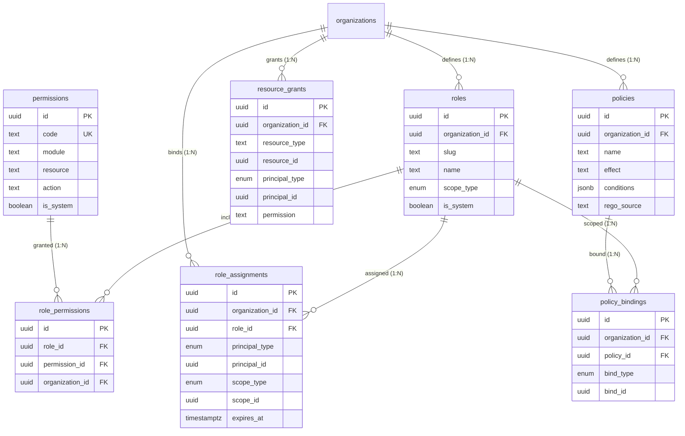

# Authorization Schema

## Purpose

Define the database schema for Atlas authorization: **Roles**, **Permissions**, **RolePermissions**, **ResourceGrants**, **Policies**, and **PolicyBindings**. Atlas implements a **RBAC + ABAC hybrid** where roles provide coarse-grained module access and policies enforce fine-grained, attribute-based constraints. Permission inheritance flows through the organization → workspace → team hierarchy.

## Bounded Context

**Tenant & Identity** (authorization subdomain) — consumed by all modules via OPA policy engine and permission cache.

## Architecture Overview

```
┌─────────────────────────────────────────────────────────────────┐
│                    Authorization Evaluation                      │
├─────────────────────────────────────────────────────────────────┤
│  1. Tenant isolation (organization_id match) — non-negotiable   │
│  2. RBAC: role_assignments → role_permissions → permissions     │
│  3. ABAC: policies + policy_bindings (OPA Rego)                  │
│  4. Resource grants (explicit per-resource overrides)           │
│  5. Default DENY                                                │
└─────────────────────────────────────────────────────────────────┘
```

## Entity Relationship Diagram



---

## Permission Model

### Naming Convention

```
{module}:{resource}:{action}

Examples:
  crm:contacts:read
  crm:contacts:write
  finance:invoices:approve
  admin:members:invite
  admin:roles:manage
  platform:settings:manage
  ai:agents:execute
```

Shorthand (module-implied): `contacts:read` resolves to `crm:contacts:read`.

### Hierarchy Inheritance

```
Organization (broadest scope)
  └── Workspace (can restrict org permissions)
       └── Team (can restrict workspace permissions)
            └── Resource Grant (explicit per-resource, additive)
```

| Scope | Inherits From | Override Behavior |
|-------|---------------|-------------------|
| Organization | — (root) | Defines baseline permissions |
| Workspace | Organization | **Restrictive** — can narrow, not expand |
| Team | Workspace + Organization | **Restrictive** — can narrow |
| Resource | None (explicit) | **Additive** — grants additional access |

**Evaluation algorithm:**

1. Collect all `role_assignments` matching principal at org, workspace, and team scopes
2. Union permissions from all assigned roles
3. Apply scope restrictions (most restrictive scope wins per permission)
4. Apply `resource_grants` (additive)
5. Evaluate ABAC `policies` via OPA (deny overrides allow)
6. Default: DENY

---

## Business Rules

| ID | Rule |
|----|------|
| **AZ-01** | System roles (`owner`, `admin`, `member`, `viewer`) seeded per organization |
| **AZ-02** | System roles cannot be deleted; permissions customizable by enterprise |
| **AZ-03** | Custom roles are organization-scoped; max 100 per organization |
| **AZ-04** | `owner` role includes all permissions; at least one owner required |
| **AZ-05** | Role assignments are immutable history; changes create new rows |
| **AZ-06** | Expired assignments (`expires_at < now()`) excluded from evaluation |
| **AZ-07** | Resource grants support user, team, and service account principals |
| **AZ-08** | ABAC policies stored as Rego source; compiled by OPA bundle server |
| **AZ-09** | Deny policies take precedence over allow (explicit deny) |
| **AZ-10** | Permission changes invalidate Redis cache within 15 seconds |
| **AZ-11** | Organization admin/owner bypasses workspace/team restrictions (configurable) |
| **AZ-12** | API key scopes must be subset of creator's permissions |

---

## DDL: Enums

```sql
-- V040__authorization_enums.sql
CREATE TYPE atlas_core.permission_effect AS ENUM (
    'ALLOW',
    'DENY'
);

CREATE TYPE atlas_core.policy_effect AS ENUM (
    'ALLOW',
    'DENY'
);
```

Note: `principal_type` and `scope_type` enums defined in `00-conventions.md` / `02-platform-core.md`.

---

## DDL: Permissions (Global Catalog)

Permissions are **platform-global** — not organization-scoped. Seeded via migration.

```sql
-- V041__create_permissions.sql
CREATE TABLE atlas_core.permissions (
    id                  UUID PRIMARY KEY DEFAULT gen_random_uuid(),
    code                TEXT NOT NULL,        -- e.g., crm:contacts:read
    module              TEXT NOT NULL,        -- e.g., crm
    resource            TEXT NOT NULL,        -- e.g., contacts
    action              TEXT NOT NULL,        -- e.g., read
    description         TEXT,
    is_system           BOOLEAN NOT NULL DEFAULT true,
    is_deprecated       BOOLEAN NOT NULL DEFAULT false,
    deprecated_at       TIMESTAMPTZ,
    replacement_code    TEXT,
    metadata            JSONB NOT NULL DEFAULT '{}',
    created_at          TIMESTAMPTZ NOT NULL DEFAULT now(),
    updated_at          TIMESTAMPTZ NOT NULL DEFAULT now(),

    CONSTRAINT uq_permissions_code UNIQUE (code),
    CONSTRAINT chk_permissions_code_format
        CHECK (code ~ '^[a-z_]+:[a-z_]+:[a-z_]+$')
);

CREATE INDEX idx_permissions_module
    ON atlas_core.permissions (module);

CREATE INDEX idx_permissions_resource
    ON atlas_core.permissions (module, resource);

CREATE INDEX idx_permissions_action
    ON atlas_core.permissions (action);

-- No RLS: global read-only catalog for application role
COMMENT ON TABLE atlas_core.permissions IS
    'Global permission catalog. Seeded by migration. Read-only for tenants.';
```

### Seed Permissions (Excerpt)

```sql
-- V042__seed_permissions.sql
INSERT INTO atlas_core.permissions (code, module, resource, action, description) VALUES
    ('platform:settings:manage', 'platform', 'settings', 'manage', 'Manage organization settings'),
    ('admin:members:invite', 'admin', 'members', 'invite', 'Invite organization members'),
    ('admin:members:remove', 'admin', 'members', 'remove', 'Remove organization members'),
    ('admin:roles:manage', 'admin', 'roles', 'manage', 'Create and assign roles'),
    ('admin:billing:manage', 'admin', 'billing', 'manage', 'Manage billing and subscriptions'),
    ('crm:contacts:read', 'crm', 'contacts', 'read', 'View contacts'),
    ('crm:contacts:write', 'crm', 'contacts', 'write', 'Create and edit contacts'),
    ('crm:contacts:delete', 'crm', 'contacts', 'delete', 'Delete contacts'),
    ('crm:deals:read', 'crm', 'deals', 'read', 'View deals'),
    ('crm:deals:write', 'crm', 'deals', 'write', 'Create and edit deals'),
    ('finance:invoices:read', 'finance', 'invoices', 'read', 'View invoices'),
    ('finance:invoices:write', 'finance', 'invoices', 'write', 'Create and edit invoices'),
    ('finance:invoices:approve', 'finance', 'invoices', 'approve', 'Approve invoices'),
    ('projects:tasks:read', 'projects', 'tasks', 'read', 'View tasks'),
    ('projects:tasks:write', 'projects', 'tasks', 'write', 'Create and edit tasks'),
    ('ai:agents:execute', 'ai', 'agents', 'execute', 'Execute AI agents')
ON CONFLICT (code) DO NOTHING;
```

---

## DDL: Roles

```sql
-- V043__create_roles.sql
CREATE TABLE atlas_core.roles (
    id                  UUID PRIMARY KEY DEFAULT gen_random_uuid(),
    organization_id     UUID NOT NULL REFERENCES atlas_core.organizations(id),
    slug                TEXT NOT NULL,
    name                TEXT NOT NULL,
    description         TEXT,
    scope_type          atlas_core.scope_type NOT NULL DEFAULT 'ORGANIZATION',
    is_system           BOOLEAN NOT NULL DEFAULT false,
    is_default          BOOLEAN NOT NULL DEFAULT false,
    priority            INTEGER NOT NULL DEFAULT 0,  -- higher = more privileged
    metadata            JSONB NOT NULL DEFAULT '{}',
    created_at          TIMESTAMPTZ NOT NULL DEFAULT now(),
    updated_at          TIMESTAMPTZ NOT NULL DEFAULT now(),
    deleted_at          TIMESTAMPTZ,
    created_by_id       UUID REFERENCES atlas_core.users(id),
    updated_by_id       UUID REFERENCES atlas_core.users(id),
    version             INTEGER NOT NULL DEFAULT 1,

    CONSTRAINT chk_roles_slug_format
        CHECK (slug ~ '^[a-z][a-z0-9_]{0,62}$'),
    CONSTRAINT chk_roles_system_slug
        CHECK (is_system = false OR slug IN ('owner', 'admin', 'member', 'viewer', 'guest', 'billing_admin'))
);

CREATE UNIQUE INDEX uq_roles_org_slug_active
    ON atlas_core.roles (organization_id, slug)
    WHERE deleted_at IS NULL;

CREATE INDEX idx_roles_organization_id
    ON atlas_core.roles (organization_id)
    WHERE deleted_at IS NULL;

CREATE INDEX idx_roles_system
    ON atlas_core.roles (organization_id, is_system)
    WHERE deleted_at IS NULL AND is_system = true;

CREATE TRIGGER trg_roles_set_updated_at
    BEFORE UPDATE ON atlas_core.roles
    FOR EACH ROW
    EXECUTE FUNCTION atlas_core.set_updated_at();

-- Audit trigger for compliance
CREATE TRIGGER trg_roles_audit
    AFTER INSERT OR UPDATE OR DELETE ON atlas_core.roles
    FOR EACH ROW
    EXECUTE FUNCTION atlas_core.audit_row_changes();

SELECT atlas_core.apply_standard_rls('atlas_core', 'roles');
```

### System Role Seeding Function

```sql
CREATE OR REPLACE FUNCTION atlas_core.seed_system_roles(p_organization_id UUID)
RETURNS void AS $$
DECLARE
    v_owner_id UUID;
    v_admin_id UUID;
    v_member_id UUID;
    v_viewer_id UUID;
BEGIN
    INSERT INTO atlas_core.roles (organization_id, slug, name, is_system, priority, scope_type)
    VALUES (p_organization_id, 'owner', 'Owner', true, 100, 'ORGANIZATION')
    RETURNING id INTO v_owner_id;

    INSERT INTO atlas_core.roles (organization_id, slug, name, is_system, priority, scope_type)
    VALUES (p_organization_id, 'admin', 'Administrator', true, 80, 'ORGANIZATION')
    RETURNING id INTO v_admin_id;

    INSERT INTO atlas_core.roles (organization_id, slug, name, is_system, priority, scope_type, is_default)
    VALUES (p_organization_id, 'member', 'Member', true, 50, 'ORGANIZATION', true)
    RETURNING id INTO v_member_id;

    INSERT INTO atlas_core.roles (organization_id, slug, name, is_system, priority, scope_type)
    VALUES (p_organization_id, 'viewer', 'Viewer', true, 10, 'ORGANIZATION')
    RETURNING id INTO v_viewer_id;

    -- Owner gets all permissions
    INSERT INTO atlas_core.role_permissions (organization_id, role_id, permission_id)
    SELECT p_organization_id, v_owner_id, p.id
    FROM atlas_core.permissions p
    WHERE p.is_deprecated = false;

    -- Admin gets all except billing
    INSERT INTO atlas_core.role_permissions (organization_id, role_id, permission_id)
    SELECT p_organization_id, v_admin_id, p.id
    FROM atlas_core.permissions p
    WHERE p.is_deprecated = false
      AND p.code != 'admin:billing:manage';

    -- Member gets read+write on core modules
    INSERT INTO atlas_core.role_permissions (organization_id, role_id, permission_id)
    SELECT p_organization_id, v_member_id, p.id
    FROM atlas_core.permissions p
    WHERE p.action IN ('read', 'write')
      AND p.module IN ('crm', 'projects', 'finance')
      AND p.is_deprecated = false;

    -- Viewer gets read only
    INSERT INTO atlas_core.role_permissions (organization_id, role_id, permission_id)
    SELECT p_organization_id, v_viewer_id, p.id
    FROM atlas_core.permissions p
    WHERE p.action = 'read'
      AND p.is_deprecated = false;
END;
$$ LANGUAGE plpgsql;
```

---

## DDL: Role Permissions

```sql
-- V044__create_role_permissions.sql
CREATE TABLE atlas_core.role_permissions (
    id                  UUID PRIMARY KEY DEFAULT gen_random_uuid(),
    organization_id     UUID NOT NULL REFERENCES atlas_core.organizations(id),
    role_id             UUID NOT NULL REFERENCES atlas_core.roles(id),
    permission_id       UUID NOT NULL REFERENCES atlas_core.permissions(id),
    effect              atlas_core.permission_effect NOT NULL DEFAULT 'ALLOW',
    conditions          JSONB,              -- optional ABAC conditions inline
    created_at          TIMESTAMPTZ NOT NULL DEFAULT now(),
    created_by_id       UUID REFERENCES atlas_core.users(id),

    CONSTRAINT fk_role_permissions_role_org
        FOREIGN KEY (role_id, organization_id)
        REFERENCES atlas_core.roles (id, organization_id)
);

-- Composite unique on roles for org-scoped FK
CREATE UNIQUE INDEX uq_roles_id_organization
    ON atlas_core.roles (id, organization_id);

CREATE UNIQUE INDEX uq_role_permissions_natural
    ON atlas_core.role_permissions (role_id, permission_id);

CREATE INDEX idx_role_permissions_organization_id
    ON atlas_core.role_permissions (organization_id);

CREATE INDEX idx_role_permissions_role_id
    ON atlas_core.role_permissions (role_id);

CREATE INDEX idx_role_permissions_permission_id
    ON atlas_core.role_permissions (permission_id);

-- Immutable audit
CREATE TRIGGER trg_role_permissions_audit
    AFTER INSERT OR UPDATE OR DELETE ON atlas_core.role_permissions
    FOR EACH ROW
    EXECUTE FUNCTION atlas_core.audit_row_changes();

SELECT atlas_core.apply_standard_rls('atlas_core', 'role_permissions');
```

---

## DDL: Role Assignments

```sql
-- V045__create_role_assignments.sql
CREATE TABLE atlas_core.role_assignments (
    id                  UUID PRIMARY KEY DEFAULT gen_random_uuid(),
    organization_id     UUID NOT NULL REFERENCES atlas_core.organizations(id),
    role_id             UUID NOT NULL REFERENCES atlas_core.roles(id),
    principal_type      atlas_core.principal_type NOT NULL,
    principal_id        UUID NOT NULL,
    scope_type          atlas_core.scope_type NOT NULL DEFAULT 'ORGANIZATION',
    scope_id            UUID,               -- NULL when scope_type = ORGANIZATION
    granted_by_id       UUID REFERENCES atlas_core.users(id),
    granted_at          TIMESTAMPTZ NOT NULL DEFAULT now(),
    expires_at          TIMESTAMPTZ,
    revoked_at          TIMESTAMPTZ,
    revoked_by_id       UUID REFERENCES atlas_core.users(id),
    revoke_reason       TEXT,
    is_active           BOOLEAN NOT NULL DEFAULT true,
    metadata            JSONB NOT NULL DEFAULT '{}',
    created_at          TIMESTAMPTZ NOT NULL DEFAULT now(),
    version             INTEGER NOT NULL DEFAULT 1,

    CONSTRAINT chk_role_assignments_scope_id
        CHECK (
            (scope_type = 'ORGANIZATION' AND scope_id IS NULL)
            OR (scope_type != 'ORGANIZATION' AND scope_id IS NOT NULL)
        ),
    CONSTRAINT chk_role_assignments_revoked_consistency
        CHECK (
            (is_active = false AND revoked_at IS NOT NULL)
            OR (is_active = true AND revoked_at IS NULL)
        )
);

CREATE INDEX idx_role_assignments_organization_id
    ON atlas_core.role_assignments (organization_id)
    WHERE is_active = true;

CREATE INDEX idx_role_assignments_principal
    ON atlas_core.role_assignments (principal_type, principal_id)
    WHERE is_active = true;

CREATE INDEX idx_role_assignments_scope
    ON atlas_core.role_assignments (scope_type, scope_id)
    WHERE is_active = true;

CREATE INDEX idx_role_assignments_role_id
    ON atlas_core.role_assignments (role_id)
    WHERE is_active = true;

CREATE INDEX idx_role_assignments_expires_at
    ON atlas_core.role_assignments (expires_at)
    WHERE is_active = true AND expires_at IS NOT NULL;

-- Prevent duplicate active assignments
CREATE UNIQUE INDEX uq_role_assignments_active
    ON atlas_core.role_assignments (
        organization_id, role_id, principal_type, principal_id, scope_type, COALESCE(scope_id, '00000000-0000-0000-0000-000000000000'::uuid)
    )
    WHERE is_active = true;

CREATE TRIGGER trg_role_assignments_audit
    AFTER INSERT OR UPDATE OR DELETE ON atlas_core.role_assignments
    FOR EACH ROW
    EXECUTE FUNCTION atlas_core.audit_row_changes();

SELECT atlas_core.apply_standard_rls('atlas_core', 'role_assignments');
```

---

## DDL: Resource Grants

Explicit per-resource permissions for collaboration and guest access.

```sql
-- V046__create_resource_grants.sql
CREATE TABLE atlas_core.resource_grants (
    id                  UUID PRIMARY KEY DEFAULT gen_random_uuid(),
    organization_id     UUID NOT NULL REFERENCES atlas_core.organizations(id),
    resource_type       TEXT NOT NULL,
    resource_id         UUID NOT NULL,
    principal_type      atlas_core.principal_type NOT NULL,
    principal_id        UUID NOT NULL,
    permission          TEXT NOT NULL,        -- e.g., projects:tasks:write
    effect              atlas_core.permission_effect NOT NULL DEFAULT 'ALLOW',
    granted_by_id       UUID REFERENCES atlas_core.users(id),
    granted_at          TIMESTAMPTZ NOT NULL DEFAULT now(),
    expires_at          TIMESTAMPTZ,
    revoked_at          TIMESTAMPTZ,
    is_active           BOOLEAN NOT NULL DEFAULT true,
    metadata            JSONB NOT NULL DEFAULT '{}',
    created_at          TIMESTAMPTZ NOT NULL DEFAULT now(),
    updated_at          TIMESTAMPTZ NOT NULL DEFAULT now(),
    deleted_at          TIMESTAMPTZ,
    version             INTEGER NOT NULL DEFAULT 1,

    CONSTRAINT chk_resource_grants_resource_type
        CHECK (resource_type IN (
            'project', 'task', 'document', 'folder', 'contact',
            'deal', 'invoice', 'case', 'channel', 'dashboard'
        )),
    CONSTRAINT chk_resource_grants_permission_format
        CHECK (permission ~ '^[a-z_]+:[a-z_]+:[a-z_]+$')
);

CREATE UNIQUE INDEX uq_resource_grants_natural
    ON atlas_core.resource_grants (
        organization_id, resource_type, resource_id,
        principal_type, principal_id, permission
    )
    WHERE deleted_at IS NULL AND is_active = true;

CREATE INDEX idx_resource_grants_organization_id
    ON atlas_core.resource_grants (organization_id)
    WHERE deleted_at IS NULL AND is_active = true;

CREATE INDEX idx_resource_grants_resource
    ON atlas_core.resource_grants (organization_id, resource_type, resource_id)
    WHERE deleted_at IS NULL AND is_active = true;

CREATE INDEX idx_resource_grants_principal
    ON atlas_core.resource_grants (principal_type, principal_id)
    WHERE deleted_at IS NULL AND is_active = true;

CREATE TRIGGER trg_resource_grants_set_updated_at
    BEFORE UPDATE ON atlas_core.resource_grants
    FOR EACH ROW
    EXECUTE FUNCTION atlas_core.set_updated_at();

SELECT atlas_core.apply_standard_rls('atlas_core', 'resource_grants');
```

---

## DDL: Policies (ABAC)

```sql
-- V047__create_policies.sql
CREATE TABLE atlas_core.policies (
    id                  UUID PRIMARY KEY DEFAULT gen_random_uuid(),
    organization_id     UUID NOT NULL REFERENCES atlas_core.organizations(id),
    name                TEXT NOT NULL,
    description         TEXT,
    effect              atlas_core.policy_effect NOT NULL DEFAULT 'DENY',
    priority            INTEGER NOT NULL DEFAULT 0,  -- higher = evaluated first
    conditions          JSONB NOT NULL DEFAULT '{}',  -- structured conditions (non-Rego)
    rego_source         TEXT,               -- optional full Rego policy
    rego_version        TEXT NOT NULL DEFAULT 'v1',
    is_system           BOOLEAN NOT NULL DEFAULT false,
    is_active           BOOLEAN NOT NULL DEFAULT true,
    metadata            JSONB NOT NULL DEFAULT '{}',
    created_at          TIMESTAMPTZ NOT NULL DEFAULT now(),
    updated_at          TIMESTAMPTZ NOT NULL DEFAULT now(),
    deleted_at          TIMESTAMPTZ,
    created_by_id       UUID REFERENCES atlas_core.users(id),
    updated_by_id       UUID REFERENCES atlas_core.users(id),
    version             INTEGER NOT NULL DEFAULT 1,

    CONSTRAINT chk_policies_conditions_is_object
        CHECK (jsonb_typeof(conditions) = 'object'),
    CONSTRAINT chk_policies_has_logic
        CHECK (conditions != '{}' OR rego_source IS NOT NULL)
);

CREATE UNIQUE INDEX uq_policies_org_name_active
    ON atlas_core.policies (organization_id, name)
    WHERE deleted_at IS NULL;

CREATE INDEX idx_policies_organization_id
    ON atlas_core.policies (organization_id)
    WHERE deleted_at IS NULL AND is_active = true;

CREATE INDEX idx_policies_priority
    ON atlas_core.policies (organization_id, priority DESC)
    WHERE deleted_at IS NULL AND is_active = true;

CREATE TRIGGER trg_policies_set_updated_at
    BEFORE UPDATE ON atlas_core.policies
    FOR EACH ROW
    EXECUTE FUNCTION atlas_core.set_updated_at();

CREATE TRIGGER trg_policies_audit
    AFTER INSERT OR UPDATE OR DELETE ON atlas_core.policies
    FOR EACH ROW
    EXECUTE FUNCTION atlas_core.audit_row_changes();

SELECT atlas_core.apply_standard_rls('atlas_core', 'policies');
```

### Example ABAC Policy (Structured Conditions)

```json
{
  "name": "Draft invoices editable only",
  "effect": "DENY",
  "priority": 100,
  "conditions": {
    "permission": "finance:invoices:write",
    "resource": {
      "type": "invoice",
      "attribute": "status",
      "not_in": ["draft"]
    },
    "unless_role": ["admin", "owner"]
  }
}
```

---

## DDL: Policy Bindings

```sql
-- V048__create_policy_bindings.sql
CREATE TYPE atlas_core.policy_bind_type AS ENUM (
    'ORGANIZATION',
    'WORKSPACE',
    'TEAM',
    'ROLE',
    'RESOURCE_TYPE'
);

CREATE TABLE atlas_core.policy_bindings (
    id                  UUID PRIMARY KEY DEFAULT gen_random_uuid(),
    organization_id     UUID NOT NULL REFERENCES atlas_core.organizations(id),
    policy_id           UUID NOT NULL REFERENCES atlas_core.policies(id),
    bind_type           atlas_core.policy_bind_type NOT NULL,
    bind_id             UUID,               -- NULL for ORGANIZATION-wide
    is_active           BOOLEAN NOT NULL DEFAULT true,
    created_at          TIMESTAMPTZ NOT NULL DEFAULT now(),
    created_by_id       UUID REFERENCES atlas_core.users(id),

    CONSTRAINT chk_policy_bindings_bind_id
        CHECK (
            (bind_type = 'ORGANIZATION' AND bind_id IS NULL)
            OR (bind_type = 'RESOURCE_TYPE' AND bind_id IS NULL)
            OR (bind_type NOT IN ('ORGANIZATION', 'RESOURCE_TYPE') AND bind_id IS NOT NULL)
        )
);

CREATE UNIQUE INDEX uq_policy_bindings_natural
    ON atlas_core.policy_bindings (
        organization_id, policy_id, bind_type, COALESCE(bind_id, '00000000-0000-0000-0000-000000000000'::uuid)
    )
    WHERE is_active = true;

CREATE INDEX idx_policy_bindings_organization_id
    ON atlas_core.policy_bindings (organization_id)
    WHERE is_active = true;

CREATE INDEX idx_policy_bindings_policy_id
    ON atlas_core.policy_bindings (policy_id)
    WHERE is_active = true;

CREATE INDEX idx_policy_bindings_bind
    ON atlas_core.policy_bindings (bind_type, bind_id)
    WHERE is_active = true;

SELECT atlas_core.apply_standard_rls('atlas_core', 'policy_bindings');
```

---

## Permission Resolution Query

Effective permissions for a user in an organization at a workspace scope:

```sql
WITH user_assignments AS (
    SELECT ra.role_id, ra.scope_type, ra.scope_id, r.priority
    FROM atlas_core.role_assignments ra
    JOIN atlas_core.roles r ON r.id = ra.role_id
    WHERE ra.organization_id = :organization_id
      AND ra.principal_type = 'USER'
      AND ra.principal_id = :user_id
      AND ra.is_active = true
      AND (ra.expires_at IS NULL OR ra.expires_at > now())
      AND (
          ra.scope_type = 'ORGANIZATION'
          OR (ra.scope_type = 'WORKSPACE' AND ra.scope_id = :workspace_id)
          OR (ra.scope_type = 'TEAM' AND ra.scope_id = ANY(:team_ids))
      )
),
role_perms AS (
    SELECT DISTINCT p.code, rp.effect, ua.scope_type, ua.priority
    FROM user_assignments ua
    JOIN atlas_core.role_permissions rp ON rp.role_id = ua.role_id
    JOIN atlas_core.permissions p ON p.id = rp.permission_id
    WHERE rp.organization_id = :organization_id
      AND p.is_deprecated = false
),
resource_perms AS (
    SELECT rg.permission AS code, rg.effect
    FROM atlas_core.resource_grants rg
    WHERE rg.organization_id = :organization_id
      AND rg.principal_type = 'USER'
      AND rg.principal_id = :user_id
      AND rg.is_active = true
      AND (rg.expires_at IS NULL OR rg.expires_at > now())
      AND rg.deleted_at IS NULL
)
SELECT code, effect FROM role_perms
UNION
SELECT code, effect FROM resource_perms;
```

---

## OPA Integration

### Policy Bundle Structure

```
policies/
├── atlas.authz.rbac.rego          # Role permission lookup
├── atlas.authz.tenant.rego        # Organization isolation
├── atlas.authz.finance.rego       # Invoice status constraints
├── atlas.authz.hr.rego            # Salary field protection
└── atlas.authz.agents.rego        # AI agent time restrictions
```

### Decision Input Schema

```json
{
  "subject": {
    "type": "user",
    "id": "uuid",
    "roles": ["member"],
    "team_ids": ["uuid"]
  },
  "resource": {
    "type": "invoice",
    "id": "uuid",
    "organization_id": "uuid",
    "attributes": { "status": "draft", "amount_cents": 50000 }
  },
  "action": "finance:invoices:write",
  "context": {
    "organization_id": "uuid",
    "workspace_id": "uuid",
    "mfa_verified": true,
    "ip_address": "203.0.113.1",
    "time": "2026-06-30T14:00:00Z"
  }
}
```

### Authz Audit Log

```sql
CREATE TABLE atlas_audit.authz_audit_log (
    id              BIGSERIAL PRIMARY KEY,
    organization_id UUID NOT NULL,
    decision        TEXT NOT NULL CHECK (decision IN ('ALLOW', 'DENY')),
    principal_type  atlas_core.principal_type NOT NULL,
    principal_id    UUID NOT NULL,
    permission      TEXT NOT NULL,
    resource_type   TEXT,
    resource_id     UUID,
    reason          TEXT,
    policy_ids      UUID[],
    input_hash      TEXT,
    occurred_at     TIMESTAMPTZ NOT NULL DEFAULT now(),
    metadata        JSONB NOT NULL DEFAULT '{}'
);

CREATE INDEX idx_authz_audit_org_time
    ON atlas_audit.authz_audit_log (organization_id, occurred_at DESC);
```

---

## Caching Strategy

| Cache Key | TTL | Invalidation Event |
|-----------|-----|-------------------|
| `authz:org:{orgId}:user:{userId}:perms` | 15 min | `role_assignment.changed` |
| `authz:org:{orgId}:role:{roleId}:perms` | 15 min | `role_permission.changed` |
| `authz:org:{orgId}:policies` | 5 min | `policy.changed` |
| `authz:resource:{type}:{id}:grants` | 10 min | `resource_grant.changed` |

---

## Events Published

| Event | Trigger |
|-------|---------|
| `platform.role.created.v1` | Custom role created |
| `platform.role_assignment.changed.v1` | Assignment created/revoked |
| `platform.role_permission.changed.v1` | Role permissions modified |
| `platform.resource_grant.created.v1` | Resource shared |
| `platform.policy.changed.v1` | ABAC policy updated |

---

## Cross-References

| Document | Content |
|----------|---------|
| [02-platform-core.md](02-platform-core.md) | Organization hierarchy |
| [03-identity-auth.md](03-identity-auth.md) | API key scopes |
| [08-authorization.md](../architecture/phase-1/08-authorization.md) | Authz architecture |
| [ADR-0005](../../adr/ADR-0005-rbac-abac-opa.md) | OPA decision |
| [prisma/models/platform.prisma](../../prisma/models/platform.prisma) | Prisma models |

---

*Document owner: Platform Security Team · Review cadence: Per release*