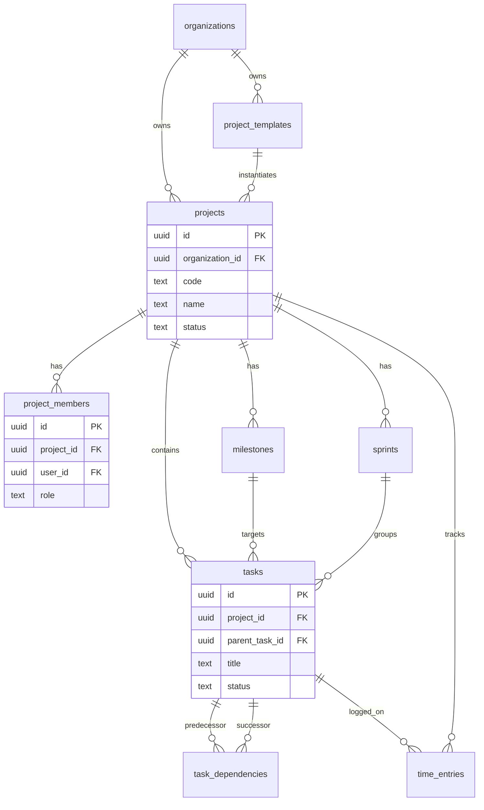

# Projects Domain Schema

## Bounded Context

**Project Management** — planning, execution, and delivery tracking for internal and client-facing work. Links to CRM opportunities, commercial orders, and HR resource allocation.

## Purpose

Stores project portfolios, team membership, task hierarchies, dependencies, milestones, sprint cadence, time tracking, and reusable project templates. All entities are tenant-isolated via `organization_id` with RLS enforcement.

## Business Rules

| Rule | Description |
|------|-------------|
| BR-PM-01 | Every project belongs to exactly one organization |
| BR-PM-02 | Project `code` is unique per organization among active records |
| BR-PM-03 | Task dependencies cannot form cycles (enforced at application layer) |
| BR-PM-04 | A task may depend on at most one predecessor per dependency type |
| BR-PM-05 | Time entries require a valid project and assignee user |
| BR-PM-06 | Soft-deleted projects cascade visibility hide; tasks remain for audit |
| BR-PM-07 | Project templates are organization-scoped or platform-global (`organization_id` NULL) |

## Entity Relationship Diagram



## Standard Columns

All tenant-scoped tables include:

| Column | Type | Notes |
|--------|------|-------|
| `id` | `UUID` | Primary key, `gen_random_uuid()` |
| `organization_id` | `UUID` | FK → `atlas_core.organizations(id)` |
| `created_at` | `TIMESTAMPTZ` | Immutable creation timestamp |
| `updated_at` | `TIMESTAMPTZ` | Auto-updated on modification |
| `created_by` | `UUID` | Actor reference (nullable for system) |
| `updated_by` | `UUID` | Last modifier |
| `deleted_at` | `TIMESTAMPTZ` | NULL = active (soft delete) |
| `version` | `INTEGER` | Optimistic concurrency, default 1 |

---

## Tables

### `projects.projects`

Portfolio and delivery container for related work.

```sql
CREATE SCHEMA IF NOT EXISTS projects;

CREATE TABLE projects.projects (
    id                  UUID PRIMARY KEY DEFAULT gen_random_uuid(),
    organization_id     UUID NOT NULL REFERENCES atlas_core.organizations(id),
    workspace_id        UUID REFERENCES atlas_core.workspaces(id),
    template_id         UUID REFERENCES projects.project_templates(id),
    opportunity_id      UUID,                    -- FK to crm.opportunities (logical)
    order_id            UUID,                    -- FK to commercial.orders (logical)
    code                TEXT NOT NULL,
    name                TEXT NOT NULL,
    description         TEXT,
    status              TEXT NOT NULL DEFAULT 'planning'
        CHECK (status IN ('planning', 'active', 'on_hold', 'completed', 'cancelled', 'archived')),
    priority            TEXT NOT NULL DEFAULT 'medium'
        CHECK (priority IN ('low', 'medium', 'high', 'critical')),
    visibility          TEXT NOT NULL DEFAULT 'team'
        CHECK (visibility IN ('private', 'team', 'organization')),
    start_date          DATE,
    target_end_date     DATE,
    actual_end_date     DATE,
    budget_hours        NUMERIC(12, 2),
    budget_amount       NUMERIC(18, 4),
    budget_currency     CHAR(3) DEFAULT 'USD',
    progress_percent    NUMERIC(5, 2) NOT NULL DEFAULT 0
        CHECK (progress_percent >= 0 AND progress_percent <= 100),
    settings            JSONB NOT NULL DEFAULT '{}',
    metadata            JSONB NOT NULL DEFAULT '{}',
    external_id         TEXT,
    created_at          TIMESTAMPTZ NOT NULL DEFAULT now(),
    updated_at          TIMESTAMPTZ NOT NULL DEFAULT now(),
    created_by          UUID,
    updated_by          UUID,
    deleted_at          TIMESTAMPTZ,
    version             INTEGER NOT NULL DEFAULT 1,
    CONSTRAINT chk_projects_dates CHECK (
        target_end_date IS NULL OR start_date IS NULL OR target_end_date >= start_date
    )
);

CREATE UNIQUE INDEX uq_projects_org_code_active
    ON projects.projects (organization_id, code)
    WHERE deleted_at IS NULL;

CREATE INDEX idx_projects_organization_id
    ON projects.projects (organization_id);

CREATE INDEX idx_projects_org_status_active
    ON projects.projects (organization_id, status)
    WHERE deleted_at IS NULL;

CREATE INDEX idx_projects_workspace_id
    ON projects.projects (workspace_id)
    WHERE deleted_at IS NULL;

CREATE INDEX idx_projects_opportunity_id
    ON projects.projects (organization_id, opportunity_id)
    WHERE opportunity_id IS NOT NULL AND deleted_at IS NULL;
```

### `projects.project_members`

Team roster and role assignments per project.

```sql
CREATE TABLE projects.project_members (
    id                  UUID PRIMARY KEY DEFAULT gen_random_uuid(),
    organization_id     UUID NOT NULL REFERENCES atlas_core.organizations(id),
    project_id          UUID NOT NULL REFERENCES projects.projects(id),
    user_id             UUID NOT NULL REFERENCES atlas_core.users(id),
    role                TEXT NOT NULL DEFAULT 'member'
        CHECK (role IN ('owner', 'manager', 'member', 'viewer', 'client')),
    allocation_percent  NUMERIC(5, 2) DEFAULT 100
        CHECK (allocation_percent >= 0 AND allocation_percent <= 100),
    hourly_rate         NUMERIC(12, 4),
    hourly_rate_currency CHAR(3) DEFAULT 'USD',
    joined_at           TIMESTAMPTZ NOT NULL DEFAULT now(),
    left_at             TIMESTAMPTZ,
    is_active           BOOLEAN NOT NULL DEFAULT true,
    permissions         JSONB NOT NULL DEFAULT '{}',
    created_at          TIMESTAMPTZ NOT NULL DEFAULT now(),
    updated_at          TIMESTAMPTZ NOT NULL DEFAULT now(),
    created_by          UUID,
    updated_by          UUID,
    deleted_at          TIMESTAMPTZ,
    version             INTEGER NOT NULL DEFAULT 1,
    CONSTRAINT fk_project_members_project
        FOREIGN KEY (project_id) REFERENCES projects.projects(id),
    CONSTRAINT chk_project_members_dates CHECK (
        left_at IS NULL OR left_at >= joined_at
    )
);

CREATE UNIQUE INDEX uq_project_members_project_user_active
    ON projects.project_members (organization_id, project_id, user_id)
    WHERE deleted_at IS NULL;

CREATE INDEX idx_project_members_user_id
    ON projects.project_members (organization_id, user_id)
    WHERE deleted_at IS NULL AND is_active = true;
```

### `projects.tasks`

Work items with optional hierarchy and sprint/milestone association.

```sql
CREATE TABLE projects.tasks (
    id                  UUID PRIMARY KEY DEFAULT gen_random_uuid(),
    organization_id     UUID NOT NULL REFERENCES atlas_core.organizations(id),
    project_id          UUID NOT NULL REFERENCES projects.projects(id),
    parent_task_id      UUID REFERENCES projects.tasks(id),
    sprint_id           UUID REFERENCES projects.sprints(id),
    milestone_id        UUID REFERENCES projects.milestones(id),
    assignee_id         UUID REFERENCES atlas_core.users(id),
    reporter_id         UUID REFERENCES atlas_core.users(id),
    title               TEXT NOT NULL,
    description         TEXT,
    status              TEXT NOT NULL DEFAULT 'todo'
        CHECK (status IN ('backlog', 'todo', 'in_progress', 'in_review', 'blocked', 'done', 'cancelled')),
    priority            TEXT NOT NULL DEFAULT 'medium'
        CHECK (priority IN ('low', 'medium', 'high', 'critical')),
    task_type           TEXT NOT NULL DEFAULT 'task'
        CHECK (task_type IN ('task', 'bug', 'story', 'epic', 'subtask')),
    sort_order          INTEGER NOT NULL DEFAULT 0,
    estimate_hours      NUMERIC(10, 2),
    actual_hours        NUMERIC(10, 2) NOT NULL DEFAULT 0,
    story_points        NUMERIC(6, 1),
    due_date            TIMESTAMPTZ,
    started_at          TIMESTAMPTZ,
    completed_at        TIMESTAMPTZ,
    labels              TEXT[] NOT NULL DEFAULT '{}',
    custom_fields       JSONB NOT NULL DEFAULT '{}',
    metadata            JSONB NOT NULL DEFAULT '{}',
    external_id         TEXT,
    created_at          TIMESTAMPTZ NOT NULL DEFAULT now(),
    updated_at          TIMESTAMPTZ NOT NULL DEFAULT now(),
    created_by          UUID,
    updated_by          UUID,
    deleted_at          TIMESTAMPTZ,
    version             INTEGER NOT NULL DEFAULT 1,
    CONSTRAINT chk_tasks_completed CHECK (
        (status = 'done' AND completed_at IS NOT NULL) OR status != 'done' OR completed_at IS NULL
    )
);

CREATE INDEX idx_tasks_project_id
    ON projects.tasks (organization_id, project_id)
    WHERE deleted_at IS NULL;

CREATE INDEX idx_tasks_assignee_id
    ON projects.tasks (organization_id, assignee_id, status)
    WHERE deleted_at IS NULL;

CREATE INDEX idx_tasks_parent_task_id
    ON projects.tasks (parent_task_id)
    WHERE deleted_at IS NULL;

CREATE INDEX idx_tasks_sprint_id
    ON projects.tasks (sprint_id)
    WHERE deleted_at IS NULL;

CREATE INDEX idx_tasks_due_date
    ON projects.tasks (organization_id, due_date)
    WHERE deleted_at IS NULL AND status NOT IN ('done', 'cancelled');
```

### `projects.task_dependencies`

Directed edges between tasks (predecessor → successor).

```sql
CREATE TABLE projects.task_dependencies (
    id                  UUID PRIMARY KEY DEFAULT gen_random_uuid(),
    organization_id     UUID NOT NULL REFERENCES atlas_core.organizations(id),
    predecessor_task_id UUID NOT NULL REFERENCES projects.tasks(id),
    successor_task_id   UUID NOT NULL REFERENCES projects.tasks(id),
    dependency_type     TEXT NOT NULL DEFAULT 'finish_to_start'
        CHECK (dependency_type IN ('finish_to_start', 'start_to_start', 'finish_to_finish', 'start_to_finish')),
    lag_days            INTEGER NOT NULL DEFAULT 0,
    created_at          TIMESTAMPTZ NOT NULL DEFAULT now(),
    updated_at          TIMESTAMPTZ NOT NULL DEFAULT now(),
    created_by          UUID,
    updated_by          UUID,
    deleted_at          TIMESTAMPTZ,
    version             INTEGER NOT NULL DEFAULT 1,
    CONSTRAINT chk_task_dependencies_distinct CHECK (predecessor_task_id != successor_task_id)
);

CREATE UNIQUE INDEX uq_task_dependencies_edge_active
    ON projects.task_dependencies (organization_id, predecessor_task_id, successor_task_id, dependency_type)
    WHERE deleted_at IS NULL;

CREATE INDEX idx_task_dependencies_successor
    ON projects.task_dependencies (successor_task_id)
    WHERE deleted_at IS NULL;
```

### `projects.milestones`

Key delivery checkpoints within a project.

```sql
CREATE TABLE projects.milestones (
    id                  UUID PRIMARY KEY DEFAULT gen_random_uuid(),
    organization_id     UUID NOT NULL REFERENCES atlas_core.organizations(id),
    project_id          UUID NOT NULL REFERENCES projects.projects(id),
    name                TEXT NOT NULL,
    description         TEXT,
    status              TEXT NOT NULL DEFAULT 'pending'
        CHECK (status IN ('pending', 'in_progress', 'completed', 'missed', 'cancelled')),
    target_date         DATE NOT NULL,
    completed_at        TIMESTAMPTZ,
    sort_order          INTEGER NOT NULL DEFAULT 0,
    metadata            JSONB NOT NULL DEFAULT '{}',
    created_at          TIMESTAMPTZ NOT NULL DEFAULT now(),
    updated_at          TIMESTAMPTZ NOT NULL DEFAULT now(),
    created_by          UUID,
    updated_by          UUID,
    deleted_at          TIMESTAMPTZ,
    version             INTEGER NOT NULL DEFAULT 1
);

CREATE INDEX idx_milestones_project_id
    ON projects.milestones (organization_id, project_id)
    WHERE deleted_at IS NULL;

CREATE INDEX idx_milestones_target_date
    ON projects.milestones (organization_id, target_date)
    WHERE deleted_at IS NULL AND status NOT IN ('completed', 'cancelled');
```

### `projects.sprints`

Time-boxed iterations for agile delivery.

```sql
CREATE TABLE projects.sprints (
    id                  UUID PRIMARY KEY DEFAULT gen_random_uuid(),
    organization_id     UUID NOT NULL REFERENCES atlas_core.organizations(id),
    project_id          UUID NOT NULL REFERENCES projects.projects(id),
    name                TEXT NOT NULL,
    goal                TEXT,
    status              TEXT NOT NULL DEFAULT 'planned'
        CHECK (status IN ('planned', 'active', 'completed', 'cancelled')),
    start_date          DATE NOT NULL,
    end_date            DATE NOT NULL,
    completed_at        TIMESTAMPTZ,
    velocity_points     NUMERIC(8, 1),
    metadata            JSONB NOT NULL DEFAULT '{}',
    created_at          TIMESTAMPTZ NOT NULL DEFAULT now(),
    updated_at          TIMESTAMPTZ NOT NULL DEFAULT now(),
    created_by          UUID,
    updated_by          UUID,
    deleted_at          TIMESTAMPTZ,
    version             INTEGER NOT NULL DEFAULT 1,
    CONSTRAINT chk_sprints_dates CHECK (end_date >= start_date)
);

CREATE INDEX idx_sprints_project_id
    ON projects.sprints (organization_id, project_id)
    WHERE deleted_at IS NULL;

CREATE UNIQUE INDEX uq_sprints_project_name_active
    ON projects.sprints (organization_id, project_id, name)
    WHERE deleted_at IS NULL;
```

### `projects.time_entries`

Billable and non-billable time logged against projects and tasks.

```sql
CREATE TABLE projects.time_entries (
    id                  UUID PRIMARY KEY DEFAULT gen_random_uuid(),
    organization_id     UUID NOT NULL REFERENCES atlas_core.organizations(id),
    project_id          UUID NOT NULL REFERENCES projects.projects(id),
    task_id             UUID REFERENCES projects.tasks(id),
    user_id             UUID NOT NULL REFERENCES atlas_core.users(id),
    description         TEXT,
    started_at          TIMESTAMPTZ NOT NULL,
    ended_at            TIMESTAMPTZ,
    duration_minutes    INTEGER NOT NULL
        CHECK (duration_minutes > 0),
    is_billable         BOOLEAN NOT NULL DEFAULT true,
    hourly_rate         NUMERIC(12, 4),
    hourly_rate_currency CHAR(3) DEFAULT 'USD',
    approval_status     TEXT NOT NULL DEFAULT 'pending'
        CHECK (approval_status IN ('pending', 'approved', 'rejected')),
    approved_by         UUID REFERENCES atlas_core.users(id),
    approved_at         TIMESTAMPTZ,
    invoice_line_id     UUID,                    -- FK to finance.invoice_lines (logical)
    metadata            JSONB NOT NULL DEFAULT '{}',
    created_at          TIMESTAMPTZ NOT NULL DEFAULT now(),
    updated_at          TIMESTAMPTZ NOT NULL DEFAULT now(),
    created_by          UUID,
    updated_by          UUID,
    deleted_at          TIMESTAMPTZ,
    version             INTEGER NOT NULL DEFAULT 1,
    CONSTRAINT chk_time_entries_range CHECK (
        ended_at IS NULL OR ended_at > started_at
    )
);

CREATE INDEX idx_time_entries_project_id
    ON projects.time_entries (organization_id, project_id, started_at DESC)
    WHERE deleted_at IS NULL;

CREATE INDEX idx_time_entries_user_id
    ON projects.time_entries (organization_id, user_id, started_at DESC)
    WHERE deleted_at IS NULL;

CREATE INDEX idx_time_entries_task_id
    ON projects.time_entries (task_id)
    WHERE deleted_at IS NULL;
```

### `projects.project_templates`

Reusable project blueprints with default structure.

```sql
CREATE TABLE projects.project_templates (
    id                  UUID PRIMARY KEY DEFAULT gen_random_uuid(),
    organization_id     UUID REFERENCES atlas_core.organizations(id),  -- NULL = platform template
    name                TEXT NOT NULL,
    description         TEXT,
    category            TEXT NOT NULL DEFAULT 'general',
    is_public           BOOLEAN NOT NULL DEFAULT false,
    is_active           BOOLEAN NOT NULL DEFAULT true,
    structure           JSONB NOT NULL DEFAULT '{}',   -- milestones, default tasks, roles
    settings            JSONB NOT NULL DEFAULT '{}',
    usage_count         INTEGER NOT NULL DEFAULT 0,
    created_at          TIMESTAMPTZ NOT NULL DEFAULT now(),
    updated_at          TIMESTAMPTZ NOT NULL DEFAULT now(),
    created_by          UUID,
    updated_by          UUID,
    deleted_at          TIMESTAMPTZ,
    version             INTEGER NOT NULL DEFAULT 1
);

CREATE UNIQUE INDEX uq_project_templates_org_name_active
    ON projects.project_templates (organization_id, name)
    WHERE deleted_at IS NULL AND organization_id IS NOT NULL;

CREATE INDEX idx_project_templates_category
    ON projects.project_templates (category)
    WHERE deleted_at IS NULL AND is_active = true;
```

---

## Indexes Summary

| Table | Index | Rationale |
|-------|-------|-----------|
| `projects` | `(organization_id, code)` unique partial | Human-readable project codes |
| `projects` | `(organization_id, status)` partial | Dashboard filtering |
| `tasks` | `(organization_id, assignee_id, status)` | My tasks inbox |
| `tasks` | `(organization_id, due_date)` partial | Overdue task alerts |
| `time_entries` | `(organization_id, user_id, started_at DESC)` | Timesheet views |
| `task_dependencies` | `(predecessor, successor, type)` unique | Prevent duplicate edges |

---

## Row-Level Security

```sql
-- Enable RLS on all tables
ALTER TABLE projects.projects ENABLE ROW LEVEL SECURITY;
ALTER TABLE projects.projects FORCE ROW LEVEL SECURITY;

CREATE POLICY org_isolation_select ON projects.projects
    FOR SELECT USING (organization_id = current_setting('app.organization_id', true)::uuid);

CREATE POLICY org_isolation_insert ON projects.projects
    FOR INSERT WITH CHECK (organization_id = current_setting('app.organization_id', true)::uuid);

CREATE POLICY org_isolation_update ON projects.projects
    FOR UPDATE
    USING (organization_id = current_setting('app.organization_id', true)::uuid)
    WITH CHECK (organization_id = current_setting('app.organization_id', true)::uuid);

CREATE POLICY org_isolation_delete ON projects.projects
    FOR DELETE USING (organization_id = current_setting('app.organization_id', true)::uuid);

-- Repeat identical policy set for:
-- project_members, tasks, task_dependencies, milestones, sprints, time_entries
-- project_templates uses: organization_id IS NULL OR organization_id = app.organization_id
```

---

## Soft Delete Strategy

- Default deletion sets `deleted_at = now()`, `updated_by = actor`
- All list queries filter `WHERE deleted_at IS NULL`
- Unique constraints use partial indexes excluding soft-deleted rows
- Restore: `UPDATE SET deleted_at = NULL, version = version + 1`
- Hard delete: GDPR erasure job only; cascades to child entities after retention window

---

## Audit Strategy

| Mechanism | Scope |
|-----------|-------|
| Standard columns | All tables — `created_by`, `updated_by`, timestamps |
| Optimistic locking | `version` incremented on every update |
| Domain audit log | `projects`, `time_entries` (approval changes) → `atlas_audit.audit_log` |
| Event outbox | `project.created`, `task.status_changed`, `time_entry.approved` |

**`updated_at` trigger:**

```sql
CREATE OR REPLACE FUNCTION projects.set_updated_at()
RETURNS TRIGGER AS $$
BEGIN
    NEW.updated_at = now();
    RETURN NEW;
END;
$$ LANGUAGE plpgsql;

CREATE TRIGGER trg_projects_updated_at
    BEFORE UPDATE ON projects.projects
    FOR EACH ROW EXECUTE FUNCTION projects.set_updated_at();
```

---

## Migration Notes

| Migration | Description |
|-----------|-------------|
| `V090__create_projects_schema.sql` | Create schema and `project_templates` first |
| `V091__create_projects_table.sql` | Projects with FK to templates |
| `V092__create_project_members.sql` | Membership table |
| `V093__create_milestones_sprints.sql` | Milestones and sprints before tasks FK |
| `V094__create_tasks.sql` | Tasks with hierarchy |
| `V095__create_task_dependencies.sql` | Dependency graph |
| `V096__create_time_entries.sql` | Time tracking |
| `V097__projects_rls_policies.sql` | RLS enablement |
| `V098__projects_updated_at_triggers.sql` | Audit triggers |

**Citus distribution:** `SELECT create_distributed_table('projects.projects', 'organization_id');` for all tables.