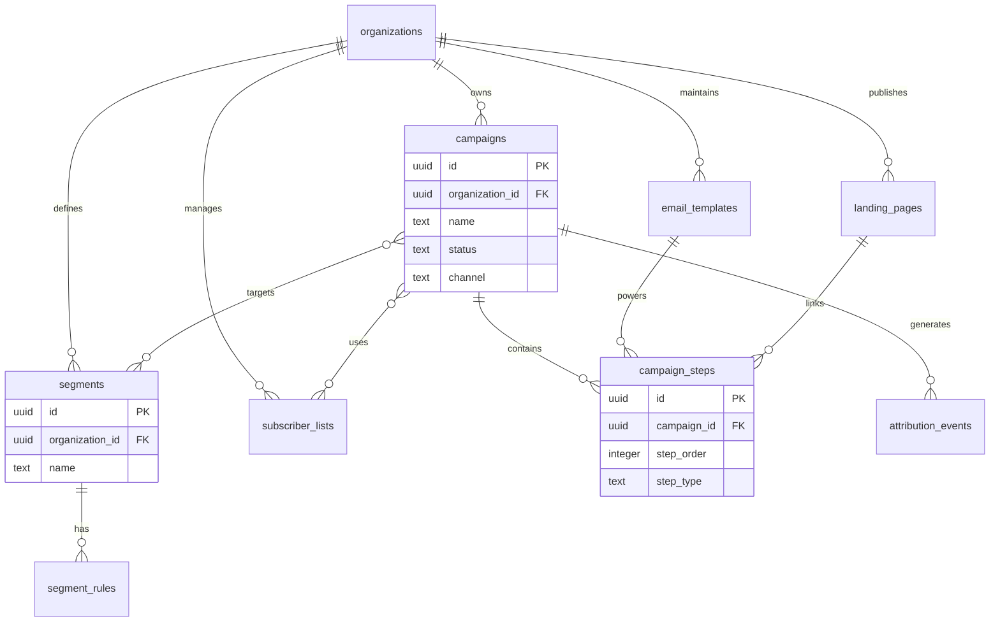

# Marketing Domain Schema

## Bounded Context

**Marketing** — campaign orchestration, audience segmentation, email and landing page assets, subscriber list management, and multi-touch attribution tracking. Integrates with CRM contacts and automation engine triggers.

## Purpose

Manages outbound marketing programs from definition through execution and measurement. Supports drip sequences, dynamic segments, template versioning, landing page publishing, and attribution event ingestion.

## Business Rules

| Rule | Description |
|------|-------------|
| BR-MKT-01 | Campaigns are organization-scoped; no cross-tenant audience sharing |
| BR-MKT-02 | Segment rules evaluate against CRM contact attributes at send time |
| BR-MKT-03 | Email templates support versioned content; sends reference template version |
| BR-MKT-04 | Landing page slugs are unique per organization |
| BR-MKT-05 | Attribution events are append-only (immutable after insert) |
| BR-MKT-06 | Subscriber lists enforce double opt-in where `require_confirmation = true` |
| BR-MKT-07 | Campaign steps execute in `step_order` sequence within a campaign |

## Entity Relationship Diagram



## Standard Columns

All tenant-scoped mutable tables include `id`, `organization_id`, `created_at`, `updated_at`, `created_by`, `updated_by`, `deleted_at`, `version` per [DB-00-conventions](00-conventions.md).

---

## Tables

### `marketing.campaigns`

Marketing program container with channel, schedule, and audience targeting.

```sql
CREATE SCHEMA IF NOT EXISTS marketing;

CREATE TABLE marketing.campaigns (
    id                  UUID PRIMARY KEY DEFAULT gen_random_uuid(),
    organization_id     UUID NOT NULL REFERENCES atlas_core.organizations(id),
    name                TEXT NOT NULL,
    description         TEXT,
    status              TEXT NOT NULL DEFAULT 'draft'
        CHECK (status IN ('draft', 'scheduled', 'active', 'paused', 'completed', 'cancelled')),
    channel             TEXT NOT NULL DEFAULT 'email'
        CHECK (channel IN ('email', 'sms', 'multi_channel', 'social', 'webinar')),
    campaign_type       TEXT NOT NULL DEFAULT 'one_time'
        CHECK (campaign_type IN ('one_time', 'drip', 'triggered', 'ab_test')),
    goal                TEXT
        CHECK (goal IN ('awareness', 'engagement', 'lead_gen', 'conversion', 'retention', 'reactivation')),
    segment_id          UUID REFERENCES marketing.segments(id),
    subscriber_list_id  UUID REFERENCES marketing.subscriber_lists(id),
    budget_amount       NUMERIC(18, 4),
    budget_currency     CHAR(3) DEFAULT 'USD',
    scheduled_at        TIMESTAMPTZ,
    started_at          TIMESTAMPTZ,
    ended_at            TIMESTAMPTZ,
    utm_source          TEXT,
    utm_medium          TEXT,
    utm_campaign        TEXT,
    settings            JSONB NOT NULL DEFAULT '{}',
    metrics_snapshot    JSONB NOT NULL DEFAULT '{}',
    metadata            JSONB NOT NULL DEFAULT '{}',
    created_at          TIMESTAMPTZ NOT NULL DEFAULT now(),
    updated_at          TIMESTAMPTZ NOT NULL DEFAULT now(),
    created_by          UUID,
    updated_by          UUID,
    deleted_at          TIMESTAMPTZ,
    version             INTEGER NOT NULL DEFAULT 1
);

CREATE INDEX idx_campaigns_organization_id
    ON marketing.campaigns (organization_id);

CREATE INDEX idx_campaigns_org_status_active
    ON marketing.campaigns (organization_id, status)
    WHERE deleted_at IS NULL;

CREATE INDEX idx_campaigns_scheduled_at
    ON marketing.campaigns (organization_id, scheduled_at)
    WHERE deleted_at IS NULL AND status = 'scheduled';
```

### `marketing.campaign_steps`

Ordered steps within a campaign (emails, waits, conditions, actions).

```sql
CREATE TABLE marketing.campaign_steps (
    id                  UUID PRIMARY KEY DEFAULT gen_random_uuid(),
    organization_id     UUID NOT NULL REFERENCES atlas_core.organizations(id),
    campaign_id         UUID NOT NULL REFERENCES marketing.campaigns(id),
    step_order          INTEGER NOT NULL,
    name                TEXT NOT NULL,
    step_type           TEXT NOT NULL
        CHECK (step_type IN ('email', 'sms', 'wait', 'condition', 'webhook', 'tag_contact', 'create_task', 'landing_page')),
    status              TEXT NOT NULL DEFAULT 'pending'
        CHECK (status IN ('pending', 'active', 'completed', 'skipped', 'failed')),
    email_template_id   UUID REFERENCES marketing.email_templates(id),
    landing_page_id     UUID REFERENCES marketing.landing_pages(id),
    delay_hours         INTEGER DEFAULT 0,
    delay_days          INTEGER DEFAULT 0,
    condition_expression TEXT,
    content_overrides   JSONB NOT NULL DEFAULT '{}',
    send_window_start   TIME,
    send_window_end     TIME,
    timezone            TEXT DEFAULT 'UTC',
    ab_variant          TEXT,
    ab_weight_percent   NUMERIC(5, 2) DEFAULT 100,
    metadata            JSONB NOT NULL DEFAULT '{}',
    created_at          TIMESTAMPTZ NOT NULL DEFAULT now(),
    updated_at          TIMESTAMPTZ NOT NULL DEFAULT now(),
    created_by          UUID,
    updated_by          UUID,
    deleted_at          TIMESTAMPTZ,
    version             INTEGER NOT NULL DEFAULT 1,
    CONSTRAINT chk_campaign_steps_delay CHECK (delay_hours >= 0 AND delay_days >= 0)
);

CREATE UNIQUE INDEX uq_campaign_steps_order_active
    ON marketing.campaign_steps (organization_id, campaign_id, step_order)
    WHERE deleted_at IS NULL;

CREATE INDEX idx_campaign_steps_campaign_id
    ON marketing.campaign_steps (campaign_id)
    WHERE deleted_at IS NULL;
```

### `marketing.segments`

Named audience definitions for campaign targeting.

```sql
CREATE TABLE marketing.segments (
    id                  UUID PRIMARY KEY DEFAULT gen_random_uuid(),
    organization_id     UUID NOT NULL REFERENCES atlas_core.organizations(id),
    name                TEXT NOT NULL,
    description         TEXT,
    segment_type        TEXT NOT NULL DEFAULT 'dynamic'
        CHECK (segment_type IN ('static', 'dynamic')),
    is_active           BOOLEAN NOT NULL DEFAULT true,
    member_count        INTEGER NOT NULL DEFAULT 0,
    last_computed_at    TIMESTAMPTZ,
    refresh_interval_hours INTEGER DEFAULT 24,
    settings            JSONB NOT NULL DEFAULT '{}',
    metadata            JSONB NOT NULL DEFAULT '{}',
    created_at          TIMESTAMPTZ NOT NULL DEFAULT now(),
    updated_at          TIMESTAMPTZ NOT NULL DEFAULT now(),
    created_by          UUID,
    updated_by          UUID,
    deleted_at          TIMESTAMPTZ,
    version             INTEGER NOT NULL DEFAULT 1
);

CREATE UNIQUE INDEX uq_segments_org_name_active
    ON marketing.segments (organization_id, name)
    WHERE deleted_at IS NULL;

CREATE INDEX idx_segments_org_active
    ON marketing.segments (organization_id)
    WHERE deleted_at IS NULL AND is_active = true;
```

### `marketing.segment_rules`

Rule predicates composing a dynamic segment (AND/OR groups).

```sql
CREATE TABLE marketing.segment_rules (
    id                  UUID PRIMARY KEY DEFAULT gen_random_uuid(),
    organization_id     UUID NOT NULL REFERENCES atlas_core.organizations(id),
    segment_id          UUID NOT NULL REFERENCES marketing.segments(id),
    rule_group          INTEGER NOT NULL DEFAULT 0,
    rule_order          INTEGER NOT NULL DEFAULT 0,
    field               TEXT NOT NULL,
    operator            TEXT NOT NULL
        CHECK (operator IN ('eq', 'neq', 'gt', 'gte', 'lt', 'lte', 'contains', 'not_contains', 'in', 'not_in', 'is_null', 'is_not_null', 'between')),
    value               JSONB,
    logical_connector   TEXT NOT NULL DEFAULT 'and'
        CHECK (logical_connector IN ('and', 'or')),
    created_at          TIMESTAMPTZ NOT NULL DEFAULT now(),
    updated_at          TIMESTAMPTZ NOT NULL DEFAULT now(),
    created_by          UUID,
    updated_by          UUID,
    deleted_at          TIMESTAMPTZ,
    version             INTEGER NOT NULL DEFAULT 1
);

CREATE INDEX idx_segment_rules_segment_id
    ON marketing.segment_rules (segment_id, rule_group, rule_order)
    WHERE deleted_at IS NULL;
```

### `marketing.email_templates`

Reusable email content with subject, body, and variable placeholders.

```sql
CREATE TABLE marketing.email_templates (
    id                  UUID PRIMARY KEY DEFAULT gen_random_uuid(),
    organization_id     UUID NOT NULL REFERENCES atlas_core.organizations(id),
    name                TEXT NOT NULL,
    description         TEXT,
    subject             TEXT NOT NULL,
    preheader           TEXT,
    html_body           TEXT NOT NULL,
    text_body           TEXT,
    template_version    INTEGER NOT NULL DEFAULT 1,
    category            TEXT NOT NULL DEFAULT 'general',
    is_active           BOOLEAN NOT NULL DEFAULT true,
    variables           JSONB NOT NULL DEFAULT '[]',
    design_json         JSONB NOT NULL DEFAULT '{}',
    metadata            JSONB NOT NULL DEFAULT '{}',
    created_at          TIMESTAMPTZ NOT NULL DEFAULT now(),
    updated_at          TIMESTAMPTZ NOT NULL DEFAULT now(),
    created_by          UUID,
    updated_by          UUID,
    deleted_at          TIMESTAMPTZ,
    version             INTEGER NOT NULL DEFAULT 1
);

CREATE UNIQUE INDEX uq_email_templates_org_name_version_active
    ON marketing.email_templates (organization_id, name, template_version)
    WHERE deleted_at IS NULL;

CREATE INDEX idx_email_templates_category
    ON marketing.email_templates (organization_id, category)
    WHERE deleted_at IS NULL AND is_active = true;
```

### `marketing.landing_pages`

Published web pages for lead capture and campaign destinations.

```sql
CREATE TABLE marketing.landing_pages (
    id                  UUID PRIMARY KEY DEFAULT gen_random_uuid(),
    organization_id     UUID NOT NULL REFERENCES atlas_core.organizations(id),
    name                TEXT NOT NULL,
    slug                TEXT NOT NULL,
    title               TEXT NOT NULL,
    description         TEXT,
    status              TEXT NOT NULL DEFAULT 'draft'
        CHECK (status IN ('draft', 'published', 'archived')),
    html_content        TEXT,
    css_content         TEXT,
    design_json         JSONB NOT NULL DEFAULT '{}',
    form_config         JSONB NOT NULL DEFAULT '{}',
    seo_meta            JSONB NOT NULL DEFAULT '{}',
    published_at        TIMESTAMPTZ,
    published_url       TEXT,
    view_count          BIGINT NOT NULL DEFAULT 0,
    conversion_count    BIGINT NOT NULL DEFAULT 0,
    metadata            JSONB NOT NULL DEFAULT '{}',
    created_at          TIMESTAMPTZ NOT NULL DEFAULT now(),
    updated_at          TIMESTAMPTZ NOT NULL DEFAULT now(),
    created_by          UUID,
    updated_by          UUID,
    deleted_at          TIMESTAMPTZ,
    version             INTEGER NOT NULL DEFAULT 1
);

CREATE UNIQUE INDEX uq_landing_pages_org_slug_active
    ON marketing.landing_pages (organization_id, slug)
    WHERE deleted_at IS NULL;

CREATE INDEX idx_landing_pages_status
    ON marketing.landing_pages (organization_id, status)
    WHERE deleted_at IS NULL;
```

### `marketing.attribution_events`

Immutable touchpoint events for multi-touch attribution analysis.

```sql
CREATE TABLE marketing.attribution_events (
    id                  UUID PRIMARY KEY DEFAULT gen_random_uuid(),
    organization_id     UUID NOT NULL REFERENCES atlas_core.organizations(id),
    campaign_id         UUID REFERENCES marketing.campaigns(id),
    campaign_step_id    UUID REFERENCES marketing.campaign_steps(id),
    contact_id          UUID,                    -- FK to crm.contacts (logical)
    session_id          TEXT,
    event_type          TEXT NOT NULL
        CHECK (event_type IN ('impression', 'click', 'open', 'conversion', 'unsubscribe', 'bounce', 'form_submit', 'page_view')),
    channel             TEXT NOT NULL,
    source              TEXT,
    medium              TEXT,
    content             TEXT,
    term                TEXT,
    revenue_amount      NUMERIC(18, 4),
    revenue_currency    CHAR(3) DEFAULT 'USD',
    occurred_at         TIMESTAMPTZ NOT NULL DEFAULT now(),
    properties          JSONB NOT NULL DEFAULT '{}',
    created_at          TIMESTAMPTZ NOT NULL DEFAULT now()
    -- No updated_at/deleted_at: append-only immutable events
);

CREATE INDEX idx_attribution_events_campaign
    ON marketing.attribution_events (organization_id, campaign_id, occurred_at DESC);

CREATE INDEX idx_attribution_events_contact
    ON marketing.attribution_events (organization_id, contact_id, occurred_at DESC)
    WHERE contact_id IS NOT NULL;

CREATE INDEX idx_attribution_events_type
    ON marketing.attribution_events (organization_id, event_type, occurred_at DESC);
```

### `marketing.subscriber_lists`

Opt-in email/SMS subscriber collections with consent tracking.

```sql
CREATE TABLE marketing.subscriber_lists (
    id                  UUID PRIMARY KEY DEFAULT gen_random_uuid(),
    organization_id     UUID NOT NULL REFERENCES atlas_core.organizations(id),
    name                TEXT NOT NULL,
    description         TEXT,
    list_type           TEXT NOT NULL DEFAULT 'email'
        CHECK (list_type IN ('email', 'sms', 'push')),
    status              TEXT NOT NULL DEFAULT 'active'
        CHECK (status IN ('active', 'archived')),
    require_confirmation BOOLEAN NOT NULL DEFAULT true,
    double_opt_in       BOOLEAN NOT NULL DEFAULT true,
    subscriber_count    INTEGER NOT NULL DEFAULT 0,
    confirmed_count     INTEGER NOT NULL DEFAULT 0,
    unsubscribe_count   INTEGER NOT NULL DEFAULT 0,
    default_from_name   TEXT,
    default_from_email  TEXT,
    default_reply_to    TEXT,
    consent_text        TEXT,
    settings            JSONB NOT NULL DEFAULT '{}',
    metadata            JSONB NOT NULL DEFAULT '{}',
    created_at          TIMESTAMPTZ NOT NULL DEFAULT now(),
    updated_at          TIMESTAMPTZ NOT NULL DEFAULT now(),
    created_by          UUID,
    updated_by          UUID,
    deleted_at          TIMESTAMPTZ,
    version             INTEGER NOT NULL DEFAULT 1
);

CREATE UNIQUE INDEX uq_subscriber_lists_org_name_active
    ON marketing.subscriber_lists (organization_id, name)
    WHERE deleted_at IS NULL;

CREATE INDEX idx_subscriber_lists_org_status
    ON marketing.subscriber_lists (organization_id, status)
    WHERE deleted_at IS NULL;
```

---

## Indexes Summary

| Table | Index | Rationale |
|-------|-------|-----------|
| `campaigns` | `(organization_id, status)` partial | Campaign dashboard |
| `campaign_steps` | `(campaign_id, step_order)` unique | Ordered execution |
| `segments` | `(organization_id, name)` unique | Named audience lookup |
| `landing_pages` | `(organization_id, slug)` unique | URL routing |
| `attribution_events` | `(organization_id, contact_id, occurred_at)` | Contact journey |
| `subscriber_lists` | `(organization_id, name)` unique | List management |

---

## Row-Level Security

```sql
ALTER TABLE marketing.campaigns ENABLE ROW LEVEL SECURITY;
ALTER TABLE marketing.campaigns FORCE ROW LEVEL SECURITY;

CREATE POLICY org_isolation_select ON marketing.campaigns
    FOR SELECT USING (organization_id = current_setting('app.organization_id', true)::uuid);

CREATE POLICY org_isolation_insert ON marketing.campaigns
    FOR INSERT WITH CHECK (organization_id = current_setting('app.organization_id', true)::uuid);

CREATE POLICY org_isolation_update ON marketing.campaigns
    FOR UPDATE
    USING (organization_id = current_setting('app.organization_id', true)::uuid)
    WITH CHECK (organization_id = current_setting('app.organization_id', true)::uuid);

CREATE POLICY org_isolation_delete ON marketing.campaigns
    FOR DELETE USING (organization_id = current_setting('app.organization_id', true)::uuid);

-- Apply identical policies to: campaign_steps, segments, segment_rules,
-- email_templates, landing_pages, subscriber_lists
-- attribution_events: SELECT/INSERT only (no UPDATE/DELETE for apps)
```

---

## Soft Delete Strategy

- Mutable entities use `deleted_at` soft delete
- `attribution_events` are **append-only** — no soft delete; retention via archival job
- Campaign cancellation sets `status = 'cancelled'` without deleting steps
- Unique indexes exclude `deleted_at IS NOT NULL` rows

---

## Audit Strategy

| Mechanism | Scope |
|-----------|-------|
| Standard audit columns | All mutable tables |
| Immutable events | `attribution_events` — insert-only |
| Domain audit log | Campaign publish, segment changes, list consent updates |
| Outbox events | `marketing.campaign.started`, `marketing.attribution.recorded` |

---

## Migration Notes

| Migration | Description |
|-----------|-------------|
| `V100__create_marketing_schema.sql` | Schema creation |
| `V101__create_segments.sql` | Segments and rules |
| `V102__create_email_templates.sql` | Templates |
| `V103__create_landing_pages.sql` | Landing pages |
| `V104__create_subscriber_lists.sql` | Subscriber lists |
| `V105__create_campaigns.sql` | Campaigns with FKs |
| `V106__create_campaign_steps.sql` | Campaign steps |
| `V107__create_attribution_events.sql` | Attribution (partitioned by month recommended) |
| `V108__marketing_rls_policies.sql` | RLS policies |

**Partitioning:** `attribution_events` partitioned by `RANGE (occurred_at)` monthly at scale.