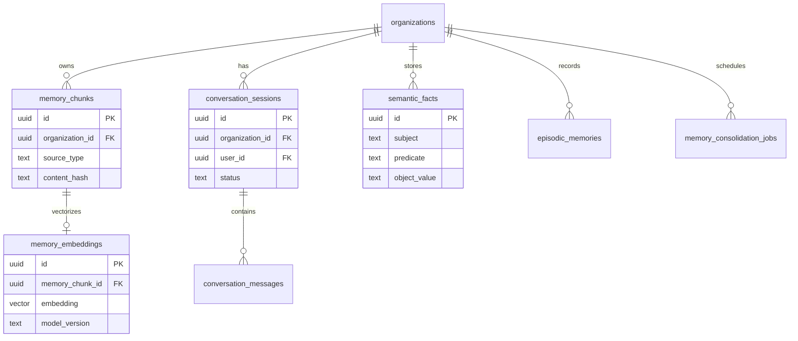

# AI Memory Domain Schema

## Bounded Context

**AI Memory** — layered cognitive storage for short-term conversation context, long-term vector embeddings, episodic action records, semantic facts, and consolidation pipelines. Implements ARCH-18 Memory System.

## Purpose

Enables AI agents and platform features to retain, retrieve, and reason over business context across time scales while enforcing tenant privacy boundaries, consent, and decay policies.

## Business Rules

| Rule | Description |
|------|-------------|
| BR-MEM-01 | All memory entities scoped to `organization_id`; vector search always filters tenant first |
| BR-MEM-02 | `memory_chunks` store text; `memory_embeddings` store vectors separately for re-embedding |
| BR-MEM-03 | Embedding model version tracked; dual-query during model migration |
| BR-MEM-04 | Semantic facts use subject-predicate-object triples with provenance |
| BR-MEM-05 | Episodic memories record actor, action, outcome, and importance score |
| BR-MEM-06 | Conversation sessions expire; snapshots may persist to PostgreSQL |
| BR-MEM-07 | Consolidation jobs are idempotent per source reference |
| BR-MEM-08 | GDPR erasure cascades across chunks, embeddings, facts, and episodes |

## Entity Relationship Diagram



## Standard Columns

Tenant-scoped mutable tables include standard audit columns. Immutable/high-churn tables may omit `deleted_at` where noted.

---

## Tables

### `ai_memory.memory_chunks`

Text chunks from documents, KB articles, CRM notes, and other ingestible sources.

```sql
CREATE SCHEMA IF NOT EXISTS ai_memory;
CREATE EXTENSION IF NOT EXISTS vector;

CREATE TABLE ai_memory.memory_chunks (
    id                  UUID PRIMARY KEY DEFAULT gen_random_uuid(),
    organization_id     UUID NOT NULL REFERENCES atlas_core.organizations(id),
    source_type         TEXT NOT NULL
        CHECK (source_type IN ('document', 'kb_article', 'email', 'meeting', 'crm_note', 'chat', 'agent_run', 'user_explicit', 'settings')),
    source_id           UUID NOT NULL,
    source_version      INTEGER NOT NULL DEFAULT 1,
    chunk_index         INTEGER NOT NULL DEFAULT 0,
    content_hash        TEXT NOT NULL,
    text_content        TEXT NOT NULL,
    token_count         INTEGER,
    language            TEXT DEFAULT 'en',
    contains_pii        BOOLEAN NOT NULL DEFAULT false,
    importance_score    NUMERIC(5, 4) NOT NULL DEFAULT 0.5
        CHECK (importance_score >= 0 AND importance_score <= 1),
    access_policy       JSONB NOT NULL DEFAULT '{}',
    entity_refs         JSONB NOT NULL DEFAULT '[]',
    metadata            JSONB NOT NULL DEFAULT '{}',
    last_accessed_at    TIMESTAMPTZ,
    expires_at          TIMESTAMPTZ,
    created_at          TIMESTAMPTZ NOT NULL DEFAULT now(),
    updated_at          TIMESTAMPTZ NOT NULL DEFAULT now(),
    created_by          UUID,
    updated_by          UUID,
    deleted_at          TIMESTAMPTZ,
    version             INTEGER NOT NULL DEFAULT 1
);

CREATE UNIQUE INDEX uq_memory_chunks_source_chunk_active
    ON ai_memory.memory_chunks (organization_id, source_type, source_id, source_version, chunk_index)
    WHERE deleted_at IS NULL;

CREATE INDEX idx_memory_chunks_organization_id
    ON ai_memory.memory_chunks (organization_id)
    WHERE deleted_at IS NULL;

CREATE INDEX idx_memory_chunks_source
    ON ai_memory.memory_chunks (organization_id, source_type, source_id)
    WHERE deleted_at IS NULL;

CREATE INDEX idx_memory_chunks_expires
    ON ai_memory.memory_chunks (organization_id, expires_at)
    WHERE deleted_at IS NULL AND expires_at IS NOT NULL;
```

### `ai_memory.memory_embeddings`

Vector embeddings for semantic similarity search (pgvector).

```sql
CREATE TABLE ai_memory.memory_embeddings (
    id                  UUID PRIMARY KEY DEFAULT gen_random_uuid(),
    organization_id     UUID NOT NULL REFERENCES atlas_core.organizations(id),
    memory_chunk_id     UUID NOT NULL REFERENCES ai_memory.memory_chunks(id),
    embedding           vector(3072) NOT NULL,
    model_version       TEXT NOT NULL DEFAULT 'text-embedding-3-large-v1',
    dimensions          INTEGER NOT NULL DEFAULT 3072,
    created_at          TIMESTAMPTZ NOT NULL DEFAULT now(),
    updated_at          TIMESTAMPTZ NOT NULL DEFAULT now(),
    deleted_at          TIMESTAMPTZ,
    version             INTEGER NOT NULL DEFAULT 1,
    CONSTRAINT fk_memory_embeddings_chunk
        FOREIGN KEY (memory_chunk_id) REFERENCES ai_memory.memory_chunks(id)
);

CREATE UNIQUE INDEX uq_memory_embeddings_chunk_model_active
    ON ai_memory.memory_embeddings (memory_chunk_id, model_version)
    WHERE deleted_at IS NULL;

CREATE INDEX idx_memory_embeddings_organization_id
    ON ai_memory.memory_embeddings (organization_id)
    WHERE deleted_at IS NULL;

-- HNSW index for cosine similarity (tenant_id filtered in query)
CREATE INDEX idx_memory_embeddings_hnsw
    ON ai_memory.memory_embeddings
    USING hnsw (embedding vector_cosine_ops)
    WITH (m = 16, ef_construction = 64);
```

### `ai_memory.conversation_sessions`

Short-term memory session containers (Redis primary; PostgreSQL snapshot).

```sql
CREATE TABLE ai_memory.conversation_sessions (
    id                  UUID PRIMARY KEY DEFAULT gen_random_uuid(),
    organization_id     UUID NOT NULL REFERENCES atlas_core.organizations(id),
    user_id             UUID REFERENCES atlas_core.users(id),
    agent_run_id        UUID,                    -- FK to ai_agents.agent_runs (logical)
    session_type        TEXT NOT NULL DEFAULT 'chat'
        CHECK (session_type IN ('chat', 'agent', 'workflow', 'support')),
    status              TEXT NOT NULL DEFAULT 'active'
        CHECK (status IN ('active', 'summarized', 'archived', 'expired')),
    title               TEXT,
    context_summary     TEXT,
    token_estimate      INTEGER NOT NULL DEFAULT 0,
    turn_count          INTEGER NOT NULL DEFAULT 0,
    metadata            JSONB NOT NULL DEFAULT '{}',
    expires_at          TIMESTAMPTZ NOT NULL,
    last_activity_at    TIMESTAMPTZ NOT NULL DEFAULT now(),
    created_at          TIMESTAMPTZ NOT NULL DEFAULT now(),
    updated_at          TIMESTAMPTZ NOT NULL DEFAULT now(),
    created_by          UUID,
    updated_by          UUID,
    deleted_at          TIMESTAMPTZ,
    version             INTEGER NOT NULL DEFAULT 1
);

CREATE INDEX idx_conversation_sessions_user
    ON ai_memory.conversation_sessions (organization_id, user_id, last_activity_at DESC)
    WHERE deleted_at IS NULL;

CREATE INDEX idx_conversation_sessions_agent_run
    ON ai_memory.conversation_sessions (agent_run_id)
    WHERE agent_run_id IS NOT NULL AND deleted_at IS NULL;

CREATE INDEX idx_conversation_sessions_expires
    ON ai_memory.conversation_sessions (expires_at)
    WHERE deleted_at IS NULL AND status = 'active';
```

### `ai_memory.conversation_messages`

Individual turns within a conversation session.

```sql
CREATE TABLE ai_memory.conversation_messages (
    id                  UUID PRIMARY KEY DEFAULT gen_random_uuid(),
    organization_id     UUID NOT NULL REFERENCES atlas_core.organizations(id),
    session_id          UUID NOT NULL REFERENCES ai_memory.conversation_sessions(id),
    sequence_number     INTEGER NOT NULL,
    role                TEXT NOT NULL
        CHECK (role IN ('user', 'assistant', 'system', 'tool')),
    content             TEXT NOT NULL,
    content_type        TEXT NOT NULL DEFAULT 'text'
        CHECK (content_type IN ('text', 'markdown', 'json', 'tool_result')),
    tool_calls          JSONB,
    tool_call_id        TEXT,
    token_count         INTEGER,
    metadata            JSONB NOT NULL DEFAULT '{}',
    created_at          TIMESTAMPTZ NOT NULL DEFAULT now(),
    deleted_at          TIMESTAMPTZ
);

CREATE UNIQUE INDEX uq_conversation_messages_session_seq
    ON ai_memory.conversation_messages (session_id, sequence_number)
    WHERE deleted_at IS NULL;

CREATE INDEX idx_conversation_messages_session
    ON ai_memory.conversation_messages (session_id, sequence_number)
    WHERE deleted_at IS NULL;
```

### `ai_memory.semantic_facts`

Structured subject-predicate-object facts about the organization.

```sql
CREATE TABLE ai_memory.semantic_facts (
    id                  UUID PRIMARY KEY DEFAULT gen_random_uuid(),
    organization_id     UUID NOT NULL REFERENCES atlas_core.organizations(id),
    subject             TEXT NOT NULL,
    subject_type        TEXT NOT NULL DEFAULT 'organization',
    predicate           TEXT NOT NULL,
    object_value        TEXT NOT NULL,
    object_type         TEXT DEFAULT 'literal',
    properties          JSONB NOT NULL DEFAULT '{}',
    category            TEXT NOT NULL DEFAULT 'general'
        CHECK (category IN ('policy', 'preference', 'relationship', 'definition', 'constraint', 'general')),
    source              TEXT NOT NULL,
    source_id           UUID,
    confidence          NUMERIC(5, 4) NOT NULL DEFAULT 1.0
        CHECK (confidence >= 0 AND confidence <= 1),
    visibility          TEXT NOT NULL DEFAULT 'tenant_wide'
        CHECK (visibility IN ('tenant_wide', 'role_restricted', 'private')),
    verified_at         TIMESTAMPTZ,
    verified_by         UUID REFERENCES atlas_core.users(id),
    expires_at          TIMESTAMPTZ,
    superseded_by_id    UUID REFERENCES ai_memory.semantic_facts(id),
    is_active           BOOLEAN NOT NULL DEFAULT true,
    created_at          TIMESTAMPTZ NOT NULL DEFAULT now(),
    updated_at          TIMESTAMPTZ NOT NULL DEFAULT now(),
    created_by          UUID,
    updated_by          UUID,
    deleted_at          TIMESTAMPTZ,
    version             INTEGER NOT NULL DEFAULT 1
);

CREATE INDEX idx_semantic_facts_lookup
    ON ai_memory.semantic_facts (organization_id, subject, predicate)
    WHERE deleted_at IS NULL AND is_active = true;

CREATE INDEX idx_semantic_facts_category
    ON ai_memory.semantic_facts (organization_id, category)
    WHERE deleted_at IS NULL AND is_active = true;

CREATE INDEX idx_semantic_facts_expires
    ON ai_memory.semantic_facts (organization_id, expires_at)
    WHERE deleted_at IS NULL AND expires_at IS NOT NULL;
```

### `ai_memory.episodic_memories`

Records of past actions and outcomes for agent learning.

```sql
CREATE TABLE ai_memory.episodic_memories (
    id                  UUID PRIMARY KEY DEFAULT gen_random_uuid(),
    organization_id     UUID NOT NULL REFERENCES atlas_core.organizations(id),
    actor_type          TEXT NOT NULL
        CHECK (actor_type IN ('user', 'agent', 'system', 'workflow')),
    actor_id            UUID,
    action              TEXT NOT NULL,
    entity_refs         JSONB NOT NULL DEFAULT '[]',
    outcome             TEXT NOT NULL
        CHECK (outcome IN ('success', 'failure', 'partial', 'rejected_by_human', 'cancelled')),
    outcome_detail      TEXT,
    user_feedback       TEXT
        CHECK (user_feedback IN ('positive', 'negative', 'neutral')),
    summary             TEXT NOT NULL,
    importance_score    NUMERIC(5, 4) NOT NULL DEFAULT 0.5
        CHECK (importance_score >= 0 AND importance_score <= 1),
    visibility          TEXT NOT NULL DEFAULT 'tenant_wide'
        CHECK (visibility IN ('tenant_wide', 'private')),
    occurred_at         TIMESTAMPTZ NOT NULL DEFAULT now(),
    metadata            JSONB NOT NULL DEFAULT '{}',
    created_at          TIMESTAMPTZ NOT NULL DEFAULT now(),
    updated_at          TIMESTAMPTZ NOT NULL DEFAULT now(),
    created_by          UUID,
    updated_by          UUID,
    deleted_at          TIMESTAMPTZ,
    version             INTEGER NOT NULL DEFAULT 1
);

CREATE INDEX idx_episodic_memories_actor
    ON ai_memory.episodic_memories (organization_id, actor_type, actor_id, occurred_at DESC)
    WHERE deleted_at IS NULL;

CREATE INDEX idx_episodic_memories_action
    ON ai_memory.episodic_memories (organization_id, action, occurred_at DESC)
    WHERE deleted_at IS NULL;

CREATE INDEX idx_episodic_memories_importance
    ON ai_memory.episodic_memories (organization_id, importance_score DESC)
    WHERE deleted_at IS NULL;
```

### `ai_memory.memory_consolidation_jobs`

Batch and real-time consolidation pipeline tracking.

```sql
CREATE TABLE ai_memory.memory_consolidation_jobs (
    id                  UUID PRIMARY KEY DEFAULT gen_random_uuid(),
    organization_id     UUID NOT NULL REFERENCES atlas_core.organizations(id),
    job_type            TEXT NOT NULL
        CHECK (job_type IN ('document_to_ltm', 'session_to_episodic', 'agent_run_to_episodic', 'fact_extraction', 'deduplication', 're_embedding', 'decay_gc')),
    status              TEXT NOT NULL DEFAULT 'pending'
        CHECK (status IN ('pending', 'running', 'completed', 'failed', 'cancelled')),
    source_type         TEXT,
    source_id           UUID,
    idempotency_key     TEXT NOT NULL,
    input_params        JSONB NOT NULL DEFAULT '{}',
    output_summary      JSONB NOT NULL DEFAULT '{}',
    items_processed     INTEGER NOT NULL DEFAULT 0,
    items_failed        INTEGER NOT NULL DEFAULT 0,
    error_message       TEXT,
    started_at          TIMESTAMPTZ,
    completed_at        TIMESTAMPTZ,
    scheduled_at        TIMESTAMPTZ NOT NULL DEFAULT now(),
    created_at          TIMESTAMPTZ NOT NULL DEFAULT now(),
    updated_at          TIMESTAMPTZ NOT NULL DEFAULT now(),
    created_by          UUID,
    updated_by          UUID,
    deleted_at          TIMESTAMPTZ,
    version             INTEGER NOT NULL DEFAULT 1
);

CREATE UNIQUE INDEX uq_consolidation_jobs_idempotency
    ON ai_memory.memory_consolidation_jobs (organization_id, idempotency_key)
    WHERE deleted_at IS NULL;

CREATE INDEX idx_consolidation_jobs_status
    ON ai_memory.memory_consolidation_jobs (status, scheduled_at)
    WHERE deleted_at IS NULL AND status IN ('pending', 'running');
```

---

## Indexes Summary

| Table | Index | Rationale |
|-------|-------|-----------|
| `memory_chunks` | `(org, source_type, source_id, version, chunk_index)` unique | Idempotent ingestion |
| `memory_embeddings` | HNSW on `embedding` | Vector similarity search |
| `conversation_sessions` | `(org, user_id, last_activity_at)` | User session history |
| `semantic_facts` | `(org, subject, predicate)` | Fact lookup |
| `episodic_memories` | `(org, action, occurred_at)` | Action history recall |
| `memory_consolidation_jobs` | `(org, idempotency_key)` unique | Pipeline deduplication |

---

## Row-Level Security

```sql
ALTER TABLE ai_memory.memory_chunks ENABLE ROW LEVEL SECURITY;
ALTER TABLE ai_memory.memory_chunks FORCE ROW LEVEL SECURITY;

CREATE POLICY org_isolation_select ON ai_memory.memory_chunks
    FOR SELECT USING (organization_id = current_setting('app.organization_id', true)::uuid);

CREATE POLICY org_isolation_insert ON ai_memory.memory_chunks
    FOR INSERT WITH CHECK (organization_id = current_setting('app.organization_id', true)::uuid);

CREATE POLICY org_isolation_update ON ai_memory.memory_chunks
    FOR UPDATE
    USING (organization_id = current_setting('app.organization_id', true)::uuid)
    WITH CHECK (organization_id = current_setting('app.organization_id', true)::uuid);

CREATE POLICY org_isolation_delete ON ai_memory.memory_chunks
    FOR DELETE USING (organization_id = current_setting('app.organization_id', true)::uuid);

-- Apply to all tables in ai_memory schema
-- conversation_messages: inherit session org scope via application layer + RLS on organization_id
```

**ABAC filter:** `access_policy` JSON on chunks evaluated at retrieval time in application layer before vector search results return.

---

## Soft Delete Strategy

- Chunks, embeddings, facts, episodes: soft delete via `deleted_at`
- GDPR erasure: hard delete job removes chunks + embeddings + related facts within 30-day SLA
- Decay GC: chunks with `effective_score < 0.1` for 90 days → soft delete → hard delete after retention
- Conversation messages: soft delete; sessions archived then purged per TTL

---

## Audit Strategy

| Mechanism | Scope |
|-----------|-------|
| Standard audit columns | All mutable tables |
| Immutable recall audit | `memory.recall` logged to `atlas_audit.audit_log` (application) |
| Consolidation tracking | Job status transitions with `output_summary` |
| Outbox events | `memory.chunk.created`, `memory.fact.pending`, `memory.erasure.requested` |

---

## Migration Notes

| Migration | Description |
|-----------|-------------|
| `V110__create_ai_memory_schema.sql` | Schema + pgvector extension |
| `V111__create_memory_chunks.sql` | Text chunks |
| `V112__create_memory_embeddings.sql` | Vectors + HNSW index |
| `V113__create_conversation_tables.sql` | Sessions and messages |
| `V114__create_semantic_facts.sql` | Structured facts |
| `V115__create_episodic_memories.sql` | Episodic storage |
| `V116__create_consolidation_jobs.sql` | Pipeline jobs |
| `V117__ai_memory_rls_policies.sql` | RLS enablement |

**Vector dimensions:** Default 3072 for `text-embedding-3-large`; migration path supports dual-model queries during re-embedding.