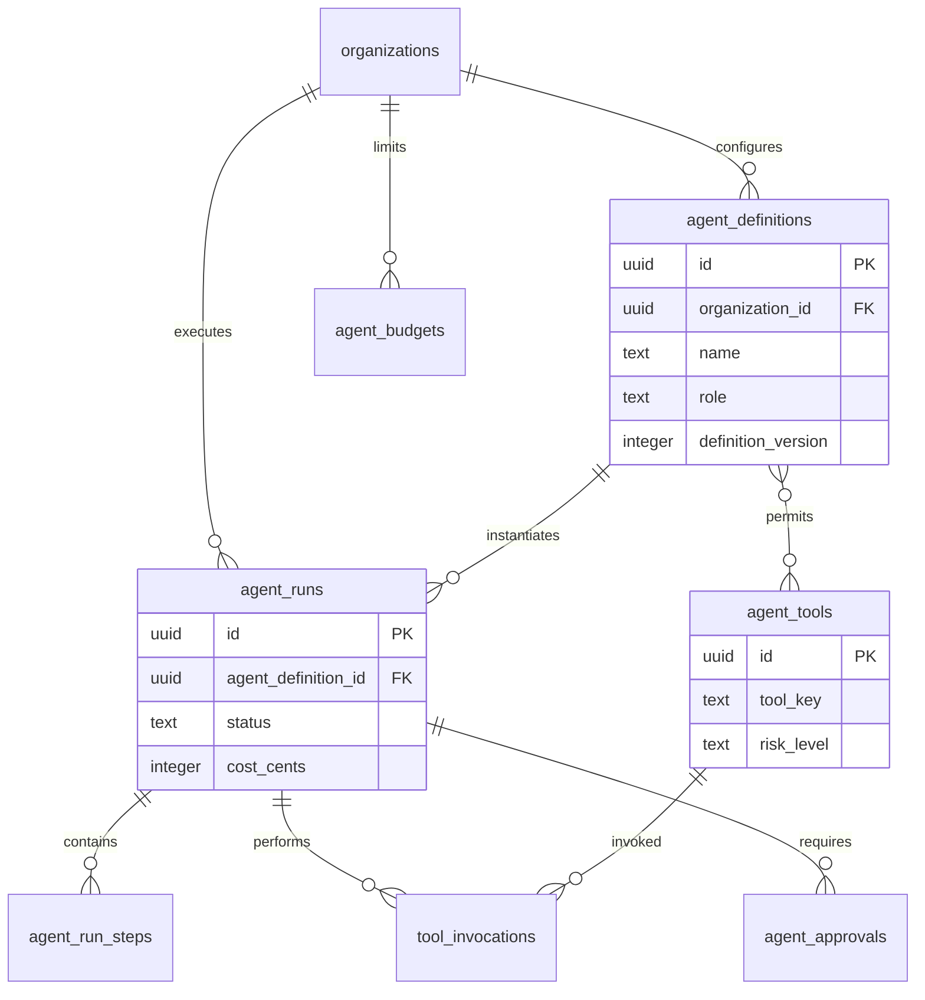

# AI Agents Domain Schema

## Bounded Context

**AI Agents** — multi-agent orchestration layer implementing agent profiles, run lifecycle, tool registry, invocations, human approval gates, and cost budgets per ARCH-17.

## Purpose

Stores durable agent execution state, tool catalog, invocation audit trail, approval requests, and budget enforcement data. Ephemeral conversation context lives in Redis; PostgreSQL holds authoritative run records.

## Business Rules

| Rule | Description |
|------|-------------|
| BR-AGT-01 | Agent effective permissions = invoker perms ∩ profile tools ∩ tenant AI policy |
| BR-AGT-02 | High/critical risk tools require human approval unless pre-approved |
| BR-AGT-03 | Agent runs have hard budget caps; exceeding terminates run |
| BR-AGT-04 | Tool invocations are append-only audit records |
| BR-AGT-05 | Agent definitions versioned; runs reference definition version at start |
| BR-AGT-06 | Approval requests expire; expired approvals terminate dependent steps |
| BR-AGT-07 | Platform tools (`organization_id` NULL) available to all tenants |

## Entity Relationship Diagram



---

## Tables

### `ai_agents.agent_definitions`

Versioned agent profiles with role, model, tools, and constraints.

```sql
CREATE SCHEMA IF NOT EXISTS ai_agents;

CREATE TABLE ai_agents.agent_definitions (
    id                  UUID PRIMARY KEY DEFAULT gen_random_uuid(),
    organization_id     UUID REFERENCES atlas_core.organizations(id),  -- NULL = platform profile
    name                TEXT NOT NULL,
    slug                TEXT NOT NULL,
    description         TEXT,
    role                TEXT NOT NULL
        CHECK (role IN ('analyst', 'executor', 'reviewer', 'planner', 'custom')),
    definition_version  INTEGER NOT NULL DEFAULT 1,
    status              TEXT NOT NULL DEFAULT 'draft'
        CHECK (status IN ('draft', 'published', 'deprecated', 'archived')),
    model_id            TEXT NOT NULL DEFAULT 'claude-sonnet-4',
    system_prompt       TEXT NOT NULL,
    system_prompt_ref   TEXT,
    allowed_tools       TEXT[] NOT NULL DEFAULT '{}',
    constraints         JSONB NOT NULL DEFAULT '{}',
    memory_config       JSONB NOT NULL DEFAULT '{}',
    risk_policy         JSONB NOT NULL DEFAULT '{}',
    is_default          BOOLEAN NOT NULL DEFAULT false,
    metadata            JSONB NOT NULL DEFAULT '{}',
    published_at        TIMESTAMPTZ,
    created_at          TIMESTAMPTZ NOT NULL DEFAULT now(),
    updated_at          TIMESTAMPTZ NOT NULL DEFAULT now(),
    created_by          UUID,
    updated_by          UUID,
    deleted_at          TIMESTAMPTZ,
    version             INTEGER NOT NULL DEFAULT 1
);

CREATE UNIQUE INDEX uq_agent_definitions_org_slug_version_active
    ON ai_agents.agent_definitions (organization_id, slug, definition_version)
    WHERE deleted_at IS NULL;

CREATE INDEX idx_agent_definitions_role
    ON ai_agents.agent_definitions (role, status)
    WHERE deleted_at IS NULL AND status = 'published';
```

### `ai_agents.agent_runs`

Runtime execution instance of an agent definition.

```sql
CREATE TABLE ai_agents.agent_runs (
    id                      UUID PRIMARY KEY DEFAULT gen_random_uuid(),
    organization_id         UUID NOT NULL REFERENCES atlas_core.organizations(id),
    agent_definition_id     UUID NOT NULL REFERENCES ai_agents.agent_definitions(id),
    definition_version      INTEGER NOT NULL,
    invoker_type            TEXT NOT NULL
        CHECK (invoker_type IN ('user', 'workflow', 'automation', 'schedule', 'system')),
    invoker_id              UUID,
    parent_run_id           UUID REFERENCES ai_agents.agent_runs(id),
    conversation_session_id UUID,
    goal                    TEXT NOT NULL,
    status                  TEXT NOT NULL DEFAULT 'init'
        CHECK (status IN ('init', 'planning', 'executing', 'review_pending', 'awaiting_human', 'completed', 'failed', 'terminated', 'cancelled')),
    status_reason           TEXT,
    orchestration_pattern   TEXT DEFAULT 'sequential'
        CHECK (orchestration_pattern IN ('sequential', 'parallel', 'hierarchical')),
    iteration_count         INTEGER NOT NULL DEFAULT 0,
    max_iterations          INTEGER NOT NULL DEFAULT 25,
    budget_cents            INTEGER NOT NULL DEFAULT 50,
    cost_cents              INTEGER NOT NULL DEFAULT 0,
    llm_input_tokens        BIGINT NOT NULL DEFAULT 0,
    llm_output_tokens       BIGINT NOT NULL DEFAULT 0,
    started_at              TIMESTAMPTZ,
    completed_at            TIMESTAMPTZ,
    timeout_at              TIMESTAMPTZ,
    result_summary          TEXT,
    result_payload          JSONB NOT NULL DEFAULT '{}',
    error_details           JSONB,
    metadata                JSONB NOT NULL DEFAULT '{}',
    created_at              TIMESTAMPTZ NOT NULL DEFAULT now(),
    updated_at              TIMESTAMPTZ NOT NULL DEFAULT now(),
    created_by              UUID,
    updated_by              UUID,
    deleted_at              TIMESTAMPTZ,
    version                 INTEGER NOT NULL DEFAULT 1
);

CREATE INDEX idx_agent_runs_organization_status
    ON ai_agents.agent_runs (organization_id, status, created_at DESC)
    WHERE deleted_at IS NULL;

CREATE INDEX idx_agent_runs_invoker
    ON ai_agents.agent_runs (organization_id, invoker_type, invoker_id)
    WHERE deleted_at IS NULL;

CREATE INDEX idx_agent_runs_parent
    ON ai_agents.agent_runs (parent_run_id)
    WHERE parent_run_id IS NOT NULL;
```

### `ai_agents.agent_run_steps`

Individual iterations/steps within an agent run (think-act-observe loop).

```sql
CREATE TABLE ai_agents.agent_run_steps (
    id                  UUID PRIMARY KEY DEFAULT gen_random_uuid(),
    organization_id     UUID NOT NULL REFERENCES atlas_core.organizations(id),
    agent_run_id        UUID NOT NULL REFERENCES ai_agents.agent_runs(id),
    step_number         INTEGER NOT NULL,
    step_type           TEXT NOT NULL
        CHECK (step_type IN ('think', 'act', 'observe', 'plan', 'review', 'finish')),
    agent_role          TEXT,
    status              TEXT NOT NULL DEFAULT 'pending'
        CHECK (status IN ('pending', 'running', 'completed', 'failed', 'skipped')),
    input_summary       TEXT,
    output_summary      TEXT,
    tool_call_id        UUID,
    llm_input_tokens    INTEGER NOT NULL DEFAULT 0,
    llm_output_tokens   INTEGER NOT NULL DEFAULT 0,
    cost_cents          INTEGER NOT NULL DEFAULT 0,
    duration_ms         INTEGER,
    started_at          TIMESTAMPTZ,
    completed_at        TIMESTAMPTZ,
    metadata            JSONB NOT NULL DEFAULT '{}',
    created_at          TIMESTAMPTZ NOT NULL DEFAULT now(),
    updated_at          TIMESTAMPTZ NOT NULL DEFAULT now(),
    deleted_at          TIMESTAMPTZ,
    version             INTEGER NOT NULL DEFAULT 1
);

CREATE UNIQUE INDEX uq_agent_run_steps_number
    ON ai_agents.agent_run_steps (agent_run_id, step_number)
    WHERE deleted_at IS NULL;

CREATE INDEX idx_agent_run_steps_run_id
    ON ai_agents.agent_run_steps (agent_run_id, step_number)
    WHERE deleted_at IS NULL;
```

### `ai_agents.agent_tools`

Central tool registry catalog.

```sql
CREATE TABLE ai_agents.agent_tools (
    id                  UUID PRIMARY KEY DEFAULT gen_random_uuid(),
    organization_id     UUID REFERENCES atlas_core.organizations(id),  -- NULL = platform tool
    tool_key            TEXT NOT NULL,
    tool_version        INTEGER NOT NULL DEFAULT 1,
    name                TEXT NOT NULL,
    description         TEXT NOT NULL,
    category            TEXT NOT NULL
        CHECK (category IN ('read', 'write', 'communicate', 'orchestrate', 'memory', 'meta')),
    risk_level          TEXT NOT NULL DEFAULT 'low'
        CHECK (risk_level IN ('low', 'medium', 'high', 'critical')),
    input_schema        JSONB NOT NULL DEFAULT '{}',
    output_schema       JSONB NOT NULL DEFAULT '{}',
    handler_type        TEXT NOT NULL DEFAULT 'internal_api'
        CHECK (handler_type IN ('internal_api', 'webhook', 'function', 'workflow', 'agent_spawn')),
    handler_config      JSONB NOT NULL DEFAULT '{}',
    permissions_required TEXT[] NOT NULL DEFAULT '{}',
    is_idempotent       BOOLEAN NOT NULL DEFAULT false,
    rate_limit_per_min  INTEGER DEFAULT 60,
    is_active           BOOLEAN NOT NULL DEFAULT true,
    metadata            JSONB NOT NULL DEFAULT '{}',
    created_at          TIMESTAMPTZ NOT NULL DEFAULT now(),
    updated_at          TIMESTAMPTZ NOT NULL DEFAULT now(),
    created_by          UUID,
    updated_by          UUID,
    deleted_at          TIMESTAMPTZ,
    version             INTEGER NOT NULL DEFAULT 1
);

CREATE UNIQUE INDEX uq_agent_tools_key_version_active
    ON ai_agents.agent_tools (COALESCE(organization_id, '00000000-0000-0000-0000-000000000000'::uuid), tool_key, tool_version)
    WHERE deleted_at IS NULL;

CREATE INDEX idx_agent_tools_category
    ON ai_agents.agent_tools (category, risk_level)
    WHERE deleted_at IS NULL AND is_active = true;
```

### `ai_agents.tool_invocations`

Append-only audit log of tool executions.

```sql
CREATE TABLE ai_agents.tool_invocations (
    id                  UUID PRIMARY KEY DEFAULT gen_random_uuid(),
    organization_id     UUID NOT NULL REFERENCES atlas_core.organizations(id),
    agent_run_id        UUID NOT NULL REFERENCES ai_agents.agent_runs(id),
    agent_run_step_id   UUID REFERENCES ai_agents.agent_run_steps(id),
    agent_tool_id       UUID NOT NULL REFERENCES ai_agents.agent_tools(id),
    tool_key            TEXT NOT NULL,
    tool_version        INTEGER NOT NULL,
    idempotency_key     TEXT NOT NULL,
    status              TEXT NOT NULL
        CHECK (status IN ('pending', 'running', 'success', 'failure', 'denied', 'timeout')),
    arguments           JSONB NOT NULL DEFAULT '{}',
    arguments_redacted  JSONB NOT NULL DEFAULT '{}',
    result              JSONB,
    result_truncated    BOOLEAN NOT NULL DEFAULT false,
    error_message       TEXT,
    permission_check    TEXT NOT NULL DEFAULT 'passed'
        CHECK (permission_check IN ('passed', 'denied', 'approval_required')),
    duration_ms         INTEGER,
    cost_cents          INTEGER NOT NULL DEFAULT 0,
    invoked_at          TIMESTAMPTZ NOT NULL DEFAULT now(),
    completed_at        TIMESTAMPTZ,
    created_at          TIMESTAMPTZ NOT NULL DEFAULT now()
    -- Append-only: no updated_at, deleted_at
);

CREATE UNIQUE INDEX uq_tool_invocations_idempotency
    ON ai_agents.tool_invocations (organization_id, idempotency_key);

CREATE INDEX idx_tool_invocations_run
    ON ai_agents.tool_invocations (agent_run_id, invoked_at);

CREATE INDEX idx_tool_invocations_tool
    ON ai_agents.tool_invocations (organization_id, tool_key, invoked_at DESC);
```

### `ai_agents.agent_approvals`

Human-in-the-loop approval requests for high-risk actions.

```sql
CREATE TABLE ai_agents.agent_approvals (
    id                  UUID PRIMARY KEY DEFAULT gen_random_uuid(),
    organization_id     UUID NOT NULL REFERENCES atlas_core.organizations(id),
    agent_run_id        UUID NOT NULL REFERENCES ai_agents.agent_runs(id),
    tool_invocation_id  UUID REFERENCES ai_agents.tool_invocations(id),
    tool_key            TEXT NOT NULL,
    status              TEXT NOT NULL DEFAULT 'pending'
        CHECK (status IN ('pending', 'approved', 'rejected', 'expired', 'cancelled')),
    reason              TEXT NOT NULL,
    arguments_preview   JSONB NOT NULL DEFAULT '{}',
    diff_preview        JSONB,
    requested_at        TIMESTAMPTZ NOT NULL DEFAULT now(),
    expires_at          TIMESTAMPTZ NOT NULL,
    resolved_at         TIMESTAMPTZ,
    resolved_by         UUID REFERENCES atlas_core.users(id),
    resolution_note     TEXT,
    created_at          TIMESTAMPTZ NOT NULL DEFAULT now(),
    updated_at          TIMESTAMPTZ NOT NULL DEFAULT now(),
    created_by          UUID,
    updated_by          UUID,
    deleted_at          TIMESTAMPTZ,
    version             INTEGER NOT NULL DEFAULT 1
);

CREATE INDEX idx_agent_approvals_pending
    ON ai_agents.agent_approvals (organization_id, status, requested_at)
    WHERE deleted_at IS NULL AND status = 'pending';

CREATE INDEX idx_agent_approvals_run
    ON ai_agents.agent_approvals (agent_run_id)
    WHERE deleted_at IS NULL;
```

### `ai_agents.agent_budgets`

Per-tenant, per-user, and per-run budget configuration and consumption tracking.

```sql
CREATE TABLE ai_agents.agent_budgets (
    id                  UUID PRIMARY KEY DEFAULT gen_random_uuid(),
    organization_id     UUID NOT NULL REFERENCES atlas_core.organizations(id),
    budget_scope        TEXT NOT NULL
        CHECK (budget_scope IN ('organization', 'user', 'agent_definition', 'agent_run')),
    scope_id            UUID,                    -- user_id, definition_id, or run_id
    period_type         TEXT NOT NULL DEFAULT 'monthly'
        CHECK (period_type IN ('daily', 'weekly', 'monthly', 'per_run', 'unlimited')),
    budget_cents        INTEGER NOT NULL,
    consumed_cents      INTEGER NOT NULL DEFAULT 0,
    warning_threshold   NUMERIC(5, 2) NOT NULL DEFAULT 0.80,
    hard_limit          BOOLEAN NOT NULL DEFAULT true,
    period_start        TIMESTAMPTZ NOT NULL,
    period_end          TIMESTAMPTZ,
    is_active           BOOLEAN NOT NULL DEFAULT true,
    metadata            JSONB NOT NULL DEFAULT '{}',
    created_at          TIMESTAMPTZ NOT NULL DEFAULT now(),
    updated_at          TIMESTAMPTZ NOT NULL DEFAULT now(),
    created_by          UUID,
    updated_by          UUID,
    deleted_at          TIMESTAMPTZ,
    version             INTEGER NOT NULL DEFAULT 1
);

CREATE UNIQUE INDEX uq_agent_budgets_scope_period_active
    ON ai_agents.agent_budgets (organization_id, budget_scope, COALESCE(scope_id, '00000000-0000-0000-0000-000000000000'::uuid), period_start)
    WHERE deleted_at IS NULL AND is_active = true;

CREATE INDEX idx_agent_budgets_org_scope
    ON ai_agents.agent_budgets (organization_id, budget_scope)
    WHERE deleted_at IS NULL AND is_active = true;
```

---

## Indexes Summary

| Table | Index | Rationale |
|-------|-------|-----------|
| `agent_runs` | `(organization_id, status, created_at)` | Run monitoring dashboard |
| `agent_tools` | `(tool_key, tool_version)` unique | Tool registry lookup |
| `tool_invocations` | `(organization_id, idempotency_key)` unique | Idempotent execution |
| `agent_approvals` | `(organization_id, status)` partial pending | Approval inbox |
| `agent_budgets` | `(organization_id, budget_scope, scope_id, period_start)` | Budget enforcement |

---

## Row-Level Security

```sql
ALTER TABLE ai_agents.agent_runs ENABLE ROW LEVEL SECURITY;
ALTER TABLE ai_agents.agent_runs FORCE ROW LEVEL SECURITY;

CREATE POLICY org_isolation_select ON ai_agents.agent_runs
    FOR SELECT USING (organization_id = current_setting('app.organization_id', true)::uuid);

CREATE POLICY org_isolation_insert ON ai_agents.agent_runs
    FOR INSERT WITH CHECK (organization_id = current_setting('app.organization_id', true)::uuid);

CREATE POLICY org_isolation_update ON ai_agents.agent_runs
    FOR UPDATE
    USING (organization_id = current_setting('app.organization_id', true)::uuid)
    WITH CHECK (organization_id = current_setting('app.organization_id', true)::uuid);

-- agent_definitions, agent_tools: organization_id IS NULL OR organization_id = app.organization_id
-- tool_invocations: append-only with organization_id RLS on SELECT/INSERT
```

---

## Soft Delete Strategy

- Definitions, runs, steps, approvals, budgets: standard soft delete
- `tool_invocations`: **append-only** — no soft delete; retention via archival
- Cancelled runs set `status = 'cancelled'` without deleting audit trail

---

## Audit Strategy

| Mechanism | Scope |
|-----------|-------|
| Standard audit columns | Mutable tables |
| Append-only invocations | Full tool call audit with redacted arguments |
| Cost tracking | Per-run and per-step `cost_cents` accumulation |
| Outbox events | `agent.run.started`, `agent.tool.invoked`, `agent.approval.requested`, `agent.budget.exceeded` |

---

## Migration Notes

| Migration | Description |
|-----------|-------------|
| `V120__create_ai_agents_schema.sql` | Schema creation |
| `V121__create_agent_tools.sql` | Platform tool seed data |
| `V122__create_agent_definitions.sql` | Agent profiles |
| `V123__create_agent_runs.sql` | Run instances |
| `V124__create_agent_run_steps.sql` | Step tracking |
| `V125__create_tool_invocations.sql` | Invocation audit |
| `V126__create_agent_approvals.sql` | Approval gates |
| `V127__create_agent_budgets.sql` | Budget config |
| `V128__ai_agents_rls_policies.sql` | RLS policies |