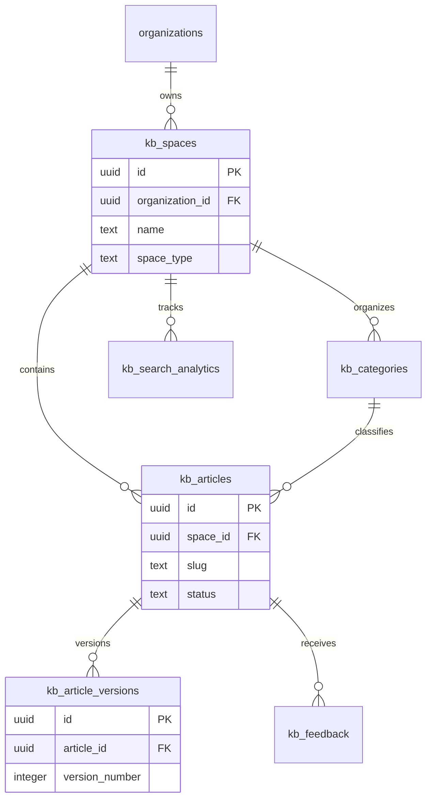

# Knowledge Base Domain Schema

## Bounded Context

**Knowledge Base** — internal and external-facing documentation spaces with versioned articles, hierarchical categories, user feedback, and search analytics. Feeds AI memory ingestion on publish events.

## Purpose

Manages organizational knowledge with draft/review/publish workflows, full version history, categorization, helpfulness ratings, and search query analytics for content improvement.

## Business Rules

| Rule | Description |
|------|-------------|
| BR-KB-01 | Each organization has one or more `kb_spaces` (internal, help center, partner) |
| BR-KB-02 | Published articles create immutable `kb_article_versions` snapshots |
| BR-KB-03 | Article slugs unique per space among active articles |
| BR-KB-04 | Category hierarchy limited to 5 levels (enforced at application layer) |
| BR-KB-05 | Feedback linked to article version for accuracy tracking |
| BR-KB-06 | Search analytics are append-only for trend analysis |
| BR-KB-07 | Publish triggers `memory.ingest.requested` for AI indexing |

## Entity Relationship Diagram



---

## Tables

### `knowledge_base.kb_spaces`

Logical documentation spaces (internal wiki, public help center).

```sql
CREATE SCHEMA IF NOT EXISTS knowledge_base;

CREATE TABLE knowledge_base.kb_spaces (
    id                  UUID PRIMARY KEY DEFAULT gen_random_uuid(),
    organization_id     UUID NOT NULL REFERENCES atlas_core.organizations(id),
    name                TEXT NOT NULL,
    slug                TEXT NOT NULL,
    description         TEXT,
    space_type          TEXT NOT NULL DEFAULT 'internal'
        CHECK (space_type IN ('internal', 'help_center', 'partner', 'api_docs')),
    visibility          TEXT NOT NULL DEFAULT 'organization'
        CHECK (visibility IN ('private', 'organization', 'public')),
    default_locale      TEXT NOT NULL DEFAULT 'en',
    supported_locales   TEXT[] NOT NULL DEFAULT '{en}',
    branding            JSONB NOT NULL DEFAULT '{}',
    settings            JSONB NOT NULL DEFAULT '{}',
    is_active           BOOLEAN NOT NULL DEFAULT true,
    article_count       INTEGER NOT NULL DEFAULT 0,
    metadata            JSONB NOT NULL DEFAULT '{}',
    created_at          TIMESTAMPTZ NOT NULL DEFAULT now(),
    updated_at          TIMESTAMPTZ NOT NULL DEFAULT now(),
    created_by          UUID,
    updated_by          UUID,
    deleted_at          TIMESTAMPTZ,
    version             INTEGER NOT NULL DEFAULT 1
);

CREATE UNIQUE INDEX uq_kb_spaces_org_slug_active
    ON knowledge_base.kb_spaces (organization_id, slug)
    WHERE deleted_at IS NULL;

CREATE INDEX idx_kb_spaces_org_type
    ON knowledge_base.kb_spaces (organization_id, space_type)
    WHERE deleted_at IS NULL AND is_active = true;
```

### `knowledge_base.kb_articles`

Article metadata and current published version pointer.

```sql
CREATE TABLE knowledge_base.kb_articles (
    id                      UUID PRIMARY KEY DEFAULT gen_random_uuid(),
    organization_id         UUID NOT NULL REFERENCES atlas_core.organizations(id),
    space_id                UUID NOT NULL REFERENCES knowledge_base.kb_spaces(id),
    category_id             UUID REFERENCES knowledge_base.kb_categories(id),
    slug                    TEXT NOT NULL,
    title                   TEXT NOT NULL,
    summary                 TEXT,
    status                  TEXT NOT NULL DEFAULT 'draft'
        CHECK (status IN ('draft', 'in_review', 'published', 'archived', 'deprecated')),
    current_version_id      UUID,
    current_version_number  INTEGER NOT NULL DEFAULT 0,
    author_id               UUID REFERENCES atlas_core.users(id),
    reviewer_id             UUID REFERENCES atlas_core.users(id),
    locale                  TEXT NOT NULL DEFAULT 'en',
    tags                    TEXT[] NOT NULL DEFAULT '{}',
    view_count              BIGINT NOT NULL DEFAULT 0,
    helpful_count           INTEGER NOT NULL DEFAULT 0,
    not_helpful_count       INTEGER NOT NULL DEFAULT 0,
    published_at            TIMESTAMPTZ,
    archived_at             TIMESTAMPTZ,
    sort_order              INTEGER NOT NULL DEFAULT 0,
    access_policy           JSONB NOT NULL DEFAULT '{}',
    metadata                JSONB NOT NULL DEFAULT '{}',
    created_at              TIMESTAMPTZ NOT NULL DEFAULT now(),
    updated_at              TIMESTAMPTZ NOT NULL DEFAULT now(),
    created_by              UUID,
    updated_by              UUID,
    deleted_at              TIMESTAMPTZ,
    version                 INTEGER NOT NULL DEFAULT 1
);

CREATE UNIQUE INDEX uq_kb_articles_space_slug_active
    ON knowledge_base.kb_articles (organization_id, space_id, slug)
    WHERE deleted_at IS NULL;

CREATE INDEX idx_kb_articles_space_status
    ON knowledge_base.kb_articles (space_id, status)
    WHERE deleted_at IS NULL;

CREATE INDEX idx_kb_articles_category
    ON knowledge_base.kb_articles (category_id)
    WHERE deleted_at IS NULL AND category_id IS NOT NULL;

CREATE INDEX idx_kb_articles_published
    ON knowledge_base.kb_articles (organization_id, published_at DESC)
    WHERE deleted_at IS NULL AND status = 'published';
```

### `knowledge_base.kb_article_versions`

Immutable content snapshots per article revision.

```sql
CREATE TABLE knowledge_base.kb_article_versions (
    id                  UUID PRIMARY KEY DEFAULT gen_random_uuid(),
    organization_id     UUID NOT NULL REFERENCES atlas_core.organizations(id),
    article_id          UUID NOT NULL REFERENCES knowledge_base.kb_articles(id),
    version_number      INTEGER NOT NULL,
    title               TEXT NOT NULL,
    summary             TEXT,
    content_markdown    TEXT NOT NULL,
    content_html        TEXT,
    change_summary      TEXT,
    author_id           UUID REFERENCES atlas_core.users(id),
    word_count          INTEGER,
    is_published        BOOLEAN NOT NULL DEFAULT false,
    published_at        TIMESTAMPTZ,
    metadata            JSONB NOT NULL DEFAULT '{}',
    created_at          TIMESTAMPTZ NOT NULL DEFAULT now(),
    created_by          UUID,
    deleted_at          TIMESTAMPTZ,
    version             INTEGER NOT NULL DEFAULT 1
);

CREATE UNIQUE INDEX uq_kb_article_versions_number
    ON knowledge_base.kb_article_versions (article_id, version_number)
    WHERE deleted_at IS NULL;

CREATE INDEX idx_kb_article_versions_article
    ON knowledge_base.kb_article_versions (article_id, version_number DESC)
    WHERE deleted_at IS NULL;

CREATE INDEX idx_kb_article_versions_published
    ON knowledge_base.kb_article_versions (organization_id, published_at DESC)
    WHERE deleted_at IS NULL AND is_published = true;
```

### `knowledge_base.kb_categories`

Hierarchical category tree within a space.

```sql
CREATE TABLE knowledge_base.kb_categories (
    id                  UUID PRIMARY KEY DEFAULT gen_random_uuid(),
    organization_id     UUID NOT NULL REFERENCES atlas_core.organizations(id),
    space_id            UUID NOT NULL REFERENCES knowledge_base.kb_spaces(id),
    parent_category_id  UUID REFERENCES knowledge_base.kb_categories(id),
    name                TEXT NOT NULL,
    slug                TEXT NOT NULL,
    description         TEXT,
    depth               INTEGER NOT NULL DEFAULT 0
        CHECK (depth >= 0 AND depth <= 5),
    sort_order          INTEGER NOT NULL DEFAULT 0,
    icon                TEXT,
    is_visible          BOOLEAN NOT NULL DEFAULT true,
    article_count       INTEGER NOT NULL DEFAULT 0,
    metadata            JSONB NOT NULL DEFAULT '{}',
    created_at          TIMESTAMPTZ NOT NULL DEFAULT now(),
    updated_at          TIMESTAMPTZ NOT NULL DEFAULT now(),
    created_by          UUID,
    updated_by          UUID,
    deleted_at          TIMESTAMPTZ,
    version             INTEGER NOT NULL DEFAULT 1
);

CREATE UNIQUE INDEX uq_kb_categories_space_slug_active
    ON knowledge_base.kb_categories (organization_id, space_id, slug)
    WHERE deleted_at IS NULL;

CREATE INDEX idx_kb_categories_parent
    ON knowledge_base.kb_categories (space_id, parent_category_id, sort_order)
    WHERE deleted_at IS NULL;
```

### `knowledge_base.kb_feedback`

User helpfulness ratings and comments on articles.

```sql
CREATE TABLE knowledge_base.kb_feedback (
    id                  UUID PRIMARY KEY DEFAULT gen_random_uuid(),
    organization_id     UUID NOT NULL REFERENCES atlas_core.organizations(id),
    article_id          UUID NOT NULL REFERENCES knowledge_base.kb_articles(id),
    article_version_id  UUID REFERENCES knowledge_base.kb_article_versions(id),
    user_id             UUID REFERENCES atlas_core.users(id),
    feedback_type       TEXT NOT NULL
        CHECK (feedback_type IN ('helpful', 'not_helpful', 'suggestion', 'correction', 'outdated')),
    rating              INTEGER
        CHECK (rating IS NULL OR (rating >= 1 AND rating <= 5)),
    comment             TEXT,
    is_resolved         BOOLEAN NOT NULL DEFAULT false,
    resolved_by         UUID REFERENCES atlas_core.users(id),
    resolved_at         TIMESTAMPTZ,
    metadata            JSONB NOT NULL DEFAULT '{}',
    created_at          TIMESTAMPTZ NOT NULL DEFAULT now(),
    updated_at          TIMESTAMPTZ NOT NULL DEFAULT now(),
    created_by          UUID,
    updated_by          UUID,
    deleted_at          TIMESTAMPTZ,
    version             INTEGER NOT NULL DEFAULT 1
);

CREATE INDEX idx_kb_feedback_article
    ON knowledge_base.kb_feedback (article_id, created_at DESC)
    WHERE deleted_at IS NULL;

CREATE INDEX idx_kb_feedback_unresolved
    ON knowledge_base.kb_feedback (organization_id, is_resolved)
    WHERE deleted_at IS NULL AND is_resolved = false;
```

### `knowledge_base.kb_search_analytics`

Append-only search query and click-through analytics.

```sql
CREATE TABLE knowledge_base.kb_search_analytics (
    id                  UUID PRIMARY KEY DEFAULT gen_random_uuid(),
    organization_id     UUID NOT NULL REFERENCES atlas_core.organizations(id),
    space_id            UUID NOT NULL REFERENCES knowledge_base.kb_spaces(id),
    user_id             UUID REFERENCES atlas_core.users(id),
    session_id          TEXT,
    query_text          TEXT NOT NULL,
    query_normalized    TEXT NOT NULL,
    result_count        INTEGER NOT NULL DEFAULT 0,
    clicked_article_id  UUID REFERENCES knowledge_base.kb_articles(id),
    click_position      INTEGER,
    search_duration_ms  INTEGER,
    source              TEXT NOT NULL DEFAULT 'search_bar'
        CHECK (source IN ('search_bar', 'ai_assistant', 'api', 'embed')),
    occurred_at         TIMESTAMPTZ NOT NULL DEFAULT now(),
    properties          JSONB NOT NULL DEFAULT '{}',
    created_at          TIMESTAMPTZ NOT NULL DEFAULT now()
);

CREATE INDEX idx_kb_search_analytics_space
    ON knowledge_base.kb_search_analytics (organization_id, space_id, occurred_at DESC);

CREATE INDEX idx_kb_search_analytics_query
    ON knowledge_base.kb_search_analytics (organization_id, query_normalized, occurred_at DESC);

CREATE INDEX idx_kb_search_analytics_zero_results
    ON knowledge_base.kb_search_analytics (organization_id, occurred_at DESC)
    WHERE result_count = 0;
```

---

## Indexes Summary

| Table | Index | Rationale |
|-------|-------|-----------|
| `kb_spaces` | `(organization_id, slug)` unique | Space routing |
| `kb_articles` | `(space_id, slug)` unique | Article URLs |
| `kb_article_versions` | `(article_id, version_number)` unique | Version history |
| `kb_categories` | `(space_id, parent_category_id, sort_order)` | Tree navigation |
| `kb_search_analytics` | `(query_normalized, occurred_at)` | Content gap analysis |

---

## Row-Level Security

```sql
ALTER TABLE knowledge_base.kb_articles ENABLE ROW LEVEL SECURITY;
ALTER TABLE knowledge_base.kb_articles FORCE ROW LEVEL SECURITY;

CREATE POLICY org_isolation_select ON knowledge_base.kb_articles
    FOR SELECT USING (organization_id = current_setting('app.organization_id', true)::uuid);

CREATE POLICY org_isolation_insert ON knowledge_base.kb_articles
    FOR INSERT WITH CHECK (organization_id = current_setting('app.organization_id', true)::uuid);

CREATE POLICY org_isolation_update ON knowledge_base.kb_articles
    FOR UPDATE
    USING (organization_id = current_setting('app.organization_id', true)::uuid)
    WITH CHECK (organization_id = current_setting('app.organization_id', true)::uuid);

-- Public help_center articles: additional policy for anonymous read via API gateway
-- kb_search_analytics: INSERT + SELECT with organization_id RLS
```

---

## Soft Delete Strategy

- Spaces, articles, categories, feedback: standard soft delete
- Article versions: soft delete only for draft versions; published versions immutable
- Search analytics: append-only, no soft delete

---

## Audit Strategy

| Mechanism | Scope |
|-----------|-------|
| Version history | `kb_article_versions` immutable snapshots |
| Publish audit | Status transitions logged to `atlas_audit.audit_log` |
| Feedback resolution | `resolved_by`, `resolved_at` tracking |
| Outbox events | `kb.article.published`, `kb.article.archived` → memory ingestion |

---

## Migration Notes

| Migration | Description |
|-----------|-------------|
| `V130__create_knowledge_base_schema.sql` | Schema creation |
| `V131__create_kb_spaces.sql` | Spaces |
| `V132__create_kb_categories.sql` | Categories |
| `V133__create_kb_articles.sql` | Articles |
| `V134__create_kb_article_versions.sql` | Versions |
| `V135__create_kb_feedback.sql` | Feedback |
| `V136__create_kb_search_analytics.sql` | Analytics |
| `V137__kb_rls_policies.sql` | RLS policies |