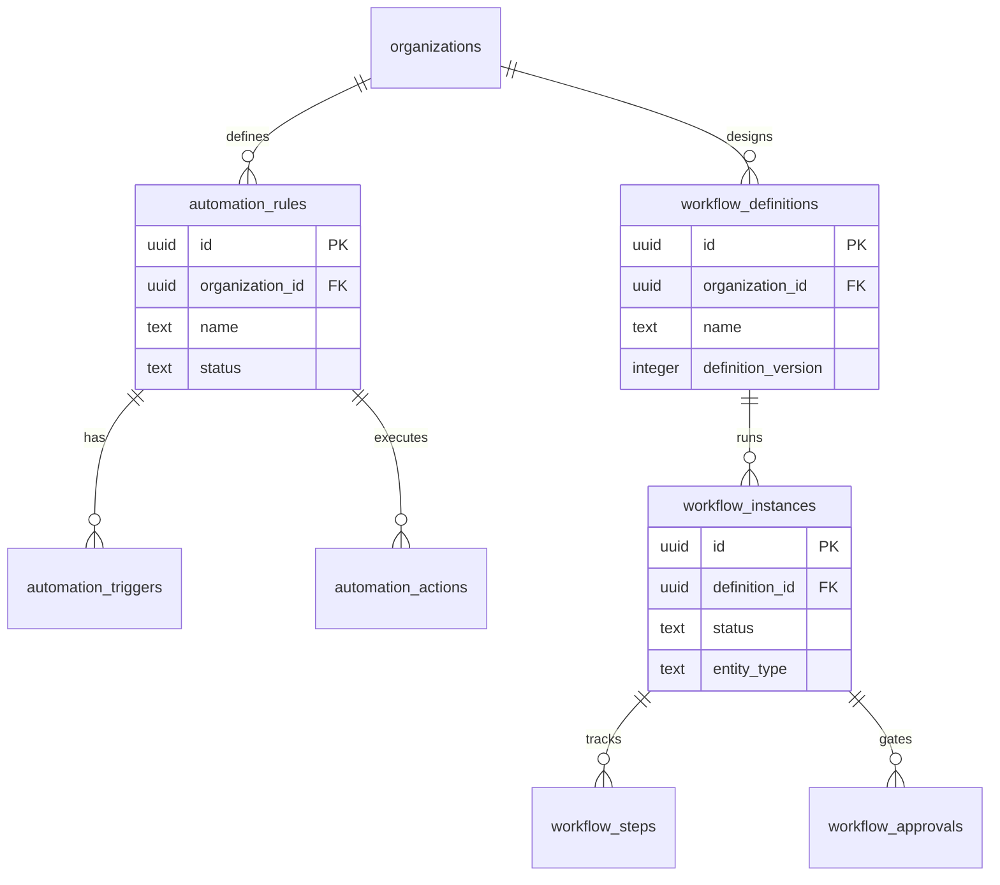

# Automation & Workflow Domain Schema

## Bounded Context

**Automation & Workflow** — combines lightweight trigger-action rules (ARCH-16 Automation Engine) with durable BPMN-inspired workflow orchestration (ARCH-15 Workflow Engine).

## Purpose

Stores automation rule definitions with triggers and actions for IFTTT-style execution, plus workflow definitions, running instances, step state, and human approval gates for long-running processes.

## Business Rules

| Rule | Description |
|------|-------------|
| BR-AUTO-01 | Automation rules execute in seconds-minutes; workflows span hours-months |
| BR-AUTO-02 | Rules with human task nodes or SLA > 24h migrate to workflow engine |
| BR-AUTO-03 | Workflow definitions are immutable once published; new version for changes |
| BR-AUTO-04 | Workflow instances bind to `entity_type` + `entity_id` for correlation |
| BR-AUTO-05 | Automation triggers support event, schedule, and webhook types |
| BR-AUTO-06 | Workflow steps track token position for parallel gateway support |
| BR-AUTO-07 | Approvals expire; workflow pauses until resolved or timeout path |

## Entity Relationship Diagram



---

## Tables

### `automation.automation_rules`

IFTTT-style rule container with settings and rate limits.

```sql
CREATE SCHEMA IF NOT EXISTS automation;

CREATE TABLE automation.automation_rules (
    id                  UUID PRIMARY KEY DEFAULT gen_random_uuid(),
    organization_id     UUID NOT NULL REFERENCES atlas_core.organizations(id),
    name                TEXT NOT NULL,
    description         TEXT,
    status              TEXT NOT NULL DEFAULT 'draft'
        CHECK (status IN ('draft', 'enabled', 'disabled', 'archived')),
    rule_version        INTEGER NOT NULL DEFAULT 1,
    template_id         TEXT,
    owner_id            UUID REFERENCES atlas_core.users(id),
    max_executions_hour INTEGER DEFAULT 100,
    max_executions_day  INTEGER DEFAULT 1000,
    concurrency_limit   INTEGER DEFAULT 5,
    retry_max_attempts  INTEGER DEFAULT 3,
    retry_backoff       TEXT DEFAULT 'exponential'
        CHECK (retry_backoff IN ('fixed', 'exponential', 'linear')),
    dry_run_available   BOOLEAN NOT NULL DEFAULT true,
    last_executed_at    TIMESTAMPTZ,
    execution_count     BIGINT NOT NULL DEFAULT 0,
    tags                TEXT[] NOT NULL DEFAULT '{}',
    settings            JSONB NOT NULL DEFAULT '{}',
    metadata            JSONB NOT NULL DEFAULT '{}',
    created_at          TIMESTAMPTZ NOT NULL DEFAULT now(),
    updated_at          TIMESTAMPTZ NOT NULL DEFAULT now(),
    created_by          UUID,
    updated_by          UUID,
    deleted_at          TIMESTAMPTZ,
    version             INTEGER NOT NULL DEFAULT 1
);

CREATE UNIQUE INDEX uq_automation_rules_org_name_version_active
    ON automation.automation_rules (organization_id, name, rule_version)
    WHERE deleted_at IS NULL;

CREATE INDEX idx_automation_rules_status
    ON automation.automation_rules (organization_id, status)
    WHERE deleted_at IS NULL;
```

### `automation.automation_triggers`

Trigger definitions attached to automation rules.

```sql
CREATE TABLE automation.automation_triggers (
    id                  UUID PRIMARY KEY DEFAULT gen_random_uuid(),
    organization_id     UUID NOT NULL REFERENCES atlas_core.organizations(id),
    rule_id             UUID NOT NULL REFERENCES automation.automation_rules(id),
    trigger_order       INTEGER NOT NULL DEFAULT 0,
    trigger_type        TEXT NOT NULL
        CHECK (trigger_type IN ('event', 'schedule', 'webhook', 'manual', 'entity_change')),
    event_type          TEXT,
    schedule_cron       TEXT,
    schedule_timezone   TEXT DEFAULT 'UTC',
    webhook_path        TEXT,
    filter_expression   TEXT,
    filter_json         JSONB NOT NULL DEFAULT '{}',
    is_active           BOOLEAN NOT NULL DEFAULT true,
    metadata            JSONB NOT NULL DEFAULT '{}',
    created_at          TIMESTAMPTZ NOT NULL DEFAULT now(),
    updated_at          TIMESTAMPTZ NOT NULL DEFAULT now(),
    created_by          UUID,
    updated_by          UUID,
    deleted_at          TIMESTAMPTZ,
    version             INTEGER NOT NULL DEFAULT 1
);

CREATE INDEX idx_automation_triggers_rule
    ON automation.automation_triggers (rule_id, trigger_order)
    WHERE deleted_at IS NULL;

CREATE INDEX idx_automation_triggers_event
    ON automation.automation_triggers (organization_id, event_type)
    WHERE deleted_at IS NULL AND trigger_type = 'event' AND is_active = true;
```

### `automation.automation_actions`

Ordered actions executed when rule triggers and conditions pass.

```sql
CREATE TABLE automation.automation_actions (
    id                  UUID PRIMARY KEY DEFAULT gen_random_uuid(),
    organization_id     UUID NOT NULL REFERENCES atlas_core.organizations(id),
    rule_id             UUID NOT NULL REFERENCES automation.automation_rules(id),
    action_order        INTEGER NOT NULL,
    action_type         TEXT NOT NULL
        CHECK (action_type IN (
            'send_notification', 'send_email', 'update_entity', 'create_entity',
            'webhook_call', 'invoke_agent', 'start_workflow', 'tag_entity',
            'delay', 'condition_branch'
        )),
    name                TEXT NOT NULL,
    config              JSONB NOT NULL DEFAULT '{}',
    condition_expression TEXT,
    on_failure          TEXT NOT NULL DEFAULT 'stop'
        CHECK (on_failure IN ('stop', 'continue', 'retry', 'compensate')),
    timeout_seconds     INTEGER DEFAULT 30,
    is_active           BOOLEAN NOT NULL DEFAULT true,
    metadata            JSONB NOT NULL DEFAULT '{}',
    created_at          TIMESTAMPTZ NOT NULL DEFAULT now(),
    updated_at          TIMESTAMPTZ NOT NULL DEFAULT now(),
    created_by          UUID,
    updated_by          UUID,
    deleted_at          TIMESTAMPTZ,
    version             INTEGER NOT NULL DEFAULT 1
);

CREATE UNIQUE INDEX uq_automation_actions_order_active
    ON automation.automation_actions (rule_id, action_order)
    WHERE deleted_at IS NULL;

CREATE INDEX idx_automation_actions_rule
    ON automation.automation_actions (rule_id, action_order)
    WHERE deleted_at IS NULL;
```

### `automation.workflow_definitions`

Versioned BPMN-inspired workflow blueprints.

```sql
CREATE TABLE automation.workflow_definitions (
    id                  UUID PRIMARY KEY DEFAULT gen_random_uuid(),
    organization_id     UUID REFERENCES atlas_core.organizations(id),  -- NULL = platform template
    name                TEXT NOT NULL,
    slug                TEXT NOT NULL,
    description         TEXT,
    definition_version  INTEGER NOT NULL DEFAULT 1,
    status              TEXT NOT NULL DEFAULT 'draft'
        CHECK (status IN ('draft', 'published', 'deprecated', 'archived')),
    category            TEXT NOT NULL DEFAULT 'general',
    graph_definition    JSONB NOT NULL DEFAULT '{}',
    sla_policies        JSONB NOT NULL DEFAULT '{}',
    compensation_handlers JSONB NOT NULL DEFAULT '{}',
    input_schema        JSONB NOT NULL DEFAULT '{}',
    output_schema       JSONB NOT NULL DEFAULT '{}',
    estimated_duration_hours INTEGER,
    is_template         BOOLEAN NOT NULL DEFAULT false,
    published_at        TIMESTAMPTZ,
    deprecated_at       TIMESTAMPTZ,
    metadata            JSONB NOT NULL DEFAULT '{}',
    created_at          TIMESTAMPTZ NOT NULL DEFAULT now(),
    updated_at          TIMESTAMPTZ NOT NULL DEFAULT now(),
    created_by          UUID,
    updated_by          UUID,
    deleted_at          TIMESTAMPTZ,
    version             INTEGER NOT NULL DEFAULT 1
);

CREATE UNIQUE INDEX uq_workflow_definitions_slug_version_active
    ON automation.workflow_definitions (COALESCE(organization_id, '00000000-0000-0000-0000-000000000000'::uuid), slug, definition_version)
    WHERE deleted_at IS NULL;

CREATE INDEX idx_workflow_definitions_status
    ON automation.workflow_definitions (status, category)
    WHERE deleted_at IS NULL AND status = 'published';
```

### `automation.workflow_instances`

Runtime workflow execution state.

```sql
CREATE TABLE automation.workflow_instances (
    id                      UUID PRIMARY KEY DEFAULT gen_random_uuid(),
    organization_id         UUID NOT NULL REFERENCES atlas_core.organizations(id),
    definition_id           UUID NOT NULL REFERENCES automation.workflow_definitions(id),
    definition_version      INTEGER NOT NULL,
    parent_instance_id      UUID REFERENCES automation.workflow_instances(id),
    status                  TEXT NOT NULL DEFAULT 'running'
        CHECK (status IN ('running', 'waiting', 'completed', 'failed', 'cancelled', 'compensating', 'suspended')),
    entity_type             TEXT,
    entity_id               UUID,
    correlation_id          TEXT,
    initiator_type          TEXT NOT NULL DEFAULT 'user'
        CHECK (initiator_type IN ('user', 'automation', 'agent', 'system', 'api')),
    initiator_id            UUID,
    current_node_id         TEXT,
    context_variables       JSONB NOT NULL DEFAULT '{}',
    input_payload           JSONB NOT NULL DEFAULT '{}',
    output_payload          JSONB,
    error_details           JSONB,
    started_at              TIMESTAMPTZ NOT NULL DEFAULT now(),
    completed_at            TIMESTAMPTZ,
    due_at                  TIMESTAMPTZ,
    sla_breach_at           TIMESTAMPTZ,
    token_count             INTEGER NOT NULL DEFAULT 1,
    metadata                JSONB NOT NULL DEFAULT '{}',
    created_at              TIMESTAMPTZ NOT NULL DEFAULT now(),
    updated_at              TIMESTAMPTZ NOT NULL DEFAULT now(),
    created_by              UUID,
    updated_by              UUID,
    deleted_at              TIMESTAMPTZ,
    version                 INTEGER NOT NULL DEFAULT 1
);

CREATE INDEX idx_workflow_instances_org_status
    ON automation.workflow_instances (organization_id, status, started_at DESC)
    WHERE deleted_at IS NULL;

CREATE INDEX idx_workflow_instances_entity
    ON automation.workflow_instances (organization_id, entity_type, entity_id)
    WHERE entity_id IS NOT NULL AND deleted_at IS NULL;

CREATE INDEX idx_workflow_instances_correlation
    ON automation.workflow_instances (organization_id, correlation_id)
    WHERE correlation_id IS NOT NULL;

CREATE INDEX idx_workflow_instances_sla
    ON automation.workflow_instances (due_at)
    WHERE deleted_at IS NULL AND status IN ('running', 'waiting');
```

### `automation.workflow_steps`

Per-node execution state within a workflow instance.

```sql
CREATE TABLE automation.workflow_steps (
    id                  UUID PRIMARY KEY DEFAULT gen_random_uuid(),
    organization_id     UUID NOT NULL REFERENCES atlas_core.organizations(id),
    instance_id         UUID NOT NULL REFERENCES automation.workflow_instances(id),
    node_id             TEXT NOT NULL,
    node_type           TEXT NOT NULL
        CHECK (node_type IN (
            'start_event', 'end_event', 'exclusive_gateway', 'parallel_gateway',
            'inclusive_gateway', 'human_task', 'service_task', 'agent_task',
            'timer_event', 'sub_workflow', 'compensation_handler'
        )),
    step_name           TEXT,
    status              TEXT NOT NULL DEFAULT 'pending'
        CHECK (status IN ('pending', 'active', 'waiting', 'completed', 'failed', 'skipped', 'compensated')),
    assignee_id         UUID REFERENCES atlas_core.users(id),
    assignee_type       TEXT
        CHECK (assignee_type IN ('user', 'role', 'team', 'agent')),
    token_id            TEXT NOT NULL,
    input_data          JSONB NOT NULL DEFAULT '{}',
    output_data         JSONB,
    agent_run_id        UUID,
    error_message       TEXT,
    retry_count         INTEGER NOT NULL DEFAULT 0,
    started_at          TIMESTAMPTZ,
    completed_at        TIMESTAMPTZ,
    due_at              TIMESTAMPTZ,
    metadata            JSONB NOT NULL DEFAULT '{}',
    created_at          TIMESTAMPTZ NOT NULL DEFAULT now(),
    updated_at          TIMESTAMPTZ NOT NULL DEFAULT now(),
    created_by          UUID,
    updated_by          UUID,
    deleted_at          TIMESTAMPTZ,
    version             INTEGER NOT NULL DEFAULT 1
);

CREATE INDEX idx_workflow_steps_instance
    ON automation.workflow_steps (instance_id, status)
    WHERE deleted_at IS NULL;

CREATE INDEX idx_workflow_steps_assignee
    ON automation.workflow_steps (organization_id, assignee_id, status)
    WHERE deleted_at IS NULL AND status IN ('active', 'waiting');

CREATE INDEX idx_workflow_steps_due
    ON automation.workflow_steps (due_at)
    WHERE deleted_at IS NULL AND status IN ('active', 'waiting');
```

### `automation.workflow_approvals`

Human approval gates within workflow instances.

```sql
CREATE TABLE automation.workflow_approvals (
    id                  UUID PRIMARY KEY DEFAULT gen_random_uuid(),
    organization_id     UUID NOT NULL REFERENCES atlas_core.organizations(id),
    instance_id         UUID NOT NULL REFERENCES automation.workflow_instances(id),
    step_id             UUID NOT NULL REFERENCES automation.workflow_steps(id),
    approval_type       TEXT NOT NULL DEFAULT 'single'
        CHECK (approval_type IN ('single', 'any_of', 'all_of', 'sequential')),
    status              TEXT NOT NULL DEFAULT 'pending'
        CHECK (status IN ('pending', 'approved', 'rejected', 'expired', 'delegated', 'cancelled')),
    title               TEXT NOT NULL,
    description         TEXT,
    assignee_ids        UUID[] NOT NULL DEFAULT '{}',
    approved_by         UUID REFERENCES atlas_core.users(id),
    rejected_by         UUID REFERENCES atlas_core.users(id),
    form_data           JSONB NOT NULL DEFAULT '{}',
    diff_preview        JSONB,
    requested_at        TIMESTAMPTZ NOT NULL DEFAULT now(),
    expires_at          TIMESTAMPTZ,
    resolved_at         TIMESTAMPTZ,
    resolution_note     TEXT,
    escalation_level    INTEGER NOT NULL DEFAULT 0,
    metadata            JSONB NOT NULL DEFAULT '{}',
    created_at          TIMESTAMPTZ NOT NULL DEFAULT now(),
    updated_at          TIMESTAMPTZ NOT NULL DEFAULT now(),
    created_by          UUID,
    updated_by          UUID,
    deleted_at          TIMESTAMPTZ,
    version             INTEGER NOT NULL DEFAULT 1
);

CREATE INDEX idx_workflow_approvals_pending
    ON automation.workflow_approvals (organization_id, status, requested_at)
    WHERE deleted_at IS NULL AND status = 'pending';

CREATE INDEX idx_workflow_approvals_instance
    ON automation.workflow_approvals (instance_id)
    WHERE deleted_at IS NULL;

CREATE INDEX idx_workflow_approvals_assignees
    ON automation.workflow_approvals USING GIN (assignee_ids)
    WHERE deleted_at IS NULL AND status = 'pending';
```

---

## Indexes Summary

| Table | Index | Rationale |
|-------|-------|-----------|
| `automation_rules` | `(organization_id, name, rule_version)` unique | Versioned rules |
| `automation_triggers` | `(organization_id, event_type)` partial | Event matcher |
| `workflow_definitions` | `(slug, definition_version)` unique | Published definitions |
| `workflow_instances` | `(entity_type, entity_id)` | Entity-bound processes |
| `workflow_steps` | `(assignee_id, status)` partial | Task inbox |
| `workflow_approvals` | GIN on `assignee_ids` | Approval inbox |

---

## Row-Level Security

```sql
ALTER TABLE automation.automation_rules ENABLE ROW LEVEL SECURITY;
ALTER TABLE automation.automation_rules FORCE ROW LEVEL SECURITY;

CREATE POLICY org_isolation_select ON automation.automation_rules
    FOR SELECT USING (organization_id = current_setting('app.organization_id', true)::uuid);

CREATE POLICY org_isolation_insert ON automation.automation_rules
    FOR INSERT WITH CHECK (organization_id = current_setting('app.organization_id', true)::uuid);

CREATE POLICY org_isolation_update ON automation.automation_rules
    FOR UPDATE
    USING (organization_id = current_setting('app.organization_id', true)::uuid)
    WITH CHECK (organization_id = current_setting('app.organization_id', true)::uuid);

-- Apply to all automation schema tables
-- workflow_definitions: organization_id IS NULL OR organization_id = app.organization_id
```

---

## Soft Delete Strategy

- Rules, triggers, actions, definitions, instances, steps, approvals: standard soft delete
- Disabled rules retain history; `status = 'disabled'` without deletion
- Completed workflow instances archived after retention period, then soft deleted

---

## Audit Strategy

| Mechanism | Scope |
|-----------|-------|
| Immutable execution log | Application-level `automation_execution_log` (separate table, Phase 3 extension) |
| Workflow step transitions | `workflow_steps.status` changes with timestamps |
| Approval audit | Full resolution trail with `approved_by`/`rejected_by` |
| Outbox events | `automation.rule.executed`, `workflow.started`, `workflow.completed`, `workflow.approval.requested` |

---

## Migration Notes

| Migration | Description |
|-----------|-------------|
| `V140__create_automation_schema.sql` | Schema creation |
| `V141__create_automation_rules.sql` | Rules container |
| `V142__create_automation_triggers.sql` | Triggers |
| `V143__create_automation_actions.sql` | Actions |
| `V144__create_workflow_definitions.sql` | Workflow blueprints |
| `V145__create_workflow_instances.sql` | Runtime instances |
| `V146__create_workflow_steps.sql` | Step state |
| `V147__create_workflow_approvals.sql` | Approval gates |
| `V148__automation_rls_policies.sql` | RLS policies |