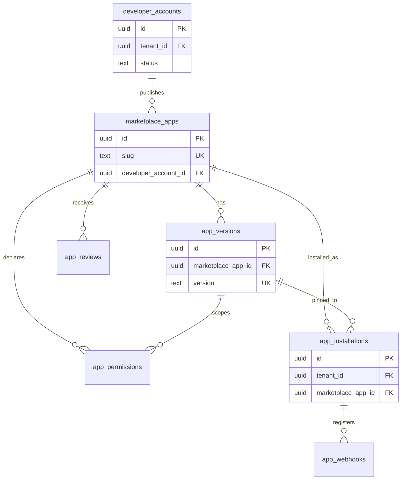

# Marketplace Schema (`marketplace`)

## Bounded Context

The **Marketplace** bounded context manages the Atlas App Store ecosystem: third-party and first-party applications, developer accounts, versioning, tenant installations, permission manifests, outbound webhooks, and user reviews. It complements the Integrations connector runtime (`integrations.*`) by owning catalog, discovery, and install lifecycle metadata.

## Purpose

| Goal | Implementation |
|------|----------------|
| Discoverability | Published apps with categories, search facets, install counts |
| Trust | Review workflow, publisher verification, permission transparency |
| Least privilege | Declarative `app_permissions` bound to OAuth scopes |
| Extensibility | Versioned manifests; semver app releases |
| Tenant isolation | Installations scoped to `tenant_id`; RLS enforced |

## Business Rules

1. **Slug uniqueness** — `marketplace_apps.slug` is globally unique and immutable after first publish.
2. **One active installation per tenant per app** — `UNIQUE (tenant_id, marketplace_app_id)` on `app_installations` where `status != 'uninstalled'`.
3. **Published apps require approved version** — `status = 'published'` requires at least one `app_versions.status = 'approved'`.
4. **Developer account required** — Every non-Atlas publisher app links to a verified `developer_accounts` row.
5. **Permission immutability on version** — Permissions are snapshotted per `app_version_id`; upgrades require re-consent.
6. **Reviews** — One review per `(tenant_id, user_id, marketplace_app_id)`; editable within 30 days.
7. **Webhooks** — App webhooks are registered per installation; secrets rotated on reinstall.

## Entity Relationship Diagram



---

## Tables

### `developer_accounts`

Publisher identity for marketplace partners. Links to a tenant (partner organization) or Atlas platform internal account.

```sql
CREATE TABLE marketplace.developer_accounts (
    id                      UUID PRIMARY KEY DEFAULT gen_random_uuid(),
    tenant_id               UUID REFERENCES atlas_core.tenants(id),
    user_id                 UUID NOT NULL REFERENCES atlas_core.users(id),
    display_name            TEXT NOT NULL,
    company_name            TEXT,
    website_url             TEXT,
    support_email           CITEXT NOT NULL,
    stripe_connect_account_id TEXT,
    verification_status     TEXT NOT NULL DEFAULT 'pending',
    verified_at             TIMESTAMPTZ,
    metadata                JSONB NOT NULL DEFAULT '{}',
    created_at              TIMESTAMPTZ NOT NULL DEFAULT now(),
    updated_at              TIMESTAMPTZ NOT NULL DEFAULT now(),
    deleted_at              TIMESTAMPTZ,
    created_by              UUID,
    updated_by              UUID,
    version                 INTEGER NOT NULL DEFAULT 1,

    CONSTRAINT developer_accounts_pkey PRIMARY KEY (id),
    CONSTRAINT chk_developer_accounts_verification_status
        CHECK (verification_status IN ('pending', 'verified', 'suspended', 'rejected')),
    CONSTRAINT chk_developer_accounts_support_email
        CHECK (support_email ~* '^[^@]+@[^@]+\.[^@]+$')
);

CREATE UNIQUE INDEX uq_developer_accounts_tenant_active
    ON marketplace.developer_accounts (tenant_id)
    WHERE deleted_at IS NULL AND tenant_id IS NOT NULL;

CREATE INDEX idx_developer_accounts_user_id
    ON marketplace.developer_accounts (user_id)
    WHERE deleted_at IS NULL;

CREATE INDEX idx_developer_accounts_verification_status
    ON marketplace.developer_accounts (verification_status)
    WHERE deleted_at IS NULL;
```

| Index | Rationale |
|-------|-----------|
| `uq_developer_accounts_tenant_active` | One developer account per partner tenant |
| `idx_developer_accounts_user_id` | Lookup by primary contact |
| `idx_developer_accounts_verification_status` | Admin review queues |

**RLS:** Platform admin read/write; partner users read own account via `user_id = current_setting('app.user_id')`.

---

### `marketplace_apps`

Global app catalog entries. Not tenant-scoped.

```sql
CREATE TABLE marketplace.marketplace_apps (
    id                      UUID PRIMARY KEY DEFAULT gen_random_uuid(),
    developer_account_id    UUID NOT NULL REFERENCES marketplace.developer_accounts(id),
    slug                    CITEXT NOT NULL,
    name                    TEXT NOT NULL,
    tagline                 TEXT,
    description             TEXT,
    long_description        TEXT,
    logo_url                TEXT,
    banner_url              TEXT,
    documentation_url       TEXT,
    privacy_policy_url      TEXT,
    terms_url               TEXT,
    categories              TEXT[] NOT NULL DEFAULT '{}',
    tags                    TEXT[] NOT NULL DEFAULT '{}',
    pricing_model           TEXT NOT NULL DEFAULT 'free',
    base_price_cents        BIGINT,
    currency                CHAR(3) DEFAULT 'USD',
    install_count           BIGINT NOT NULL DEFAULT 0,
    average_rating          NUMERIC(3,2),
    review_count            INTEGER NOT NULL DEFAULT 0,
    is_first_party          BOOLEAN NOT NULL DEFAULT false,
    is_featured             BOOLEAN NOT NULL DEFAULT false,
    status                  TEXT NOT NULL DEFAULT 'draft',
    published_at            TIMESTAMPTZ,
    deprecated_at           TIMESTAMPTZ,
    metadata                JSONB NOT NULL DEFAULT '{}',
    created_at              TIMESTAMPTZ NOT NULL DEFAULT now(),
    updated_at              TIMESTAMPTZ NOT NULL DEFAULT now(),
    deleted_at              TIMESTAMPTZ,
    created_by              UUID,
    updated_by              UUID,
    version                 INTEGER NOT NULL DEFAULT 1,

    CONSTRAINT marketplace_apps_pkey PRIMARY KEY (id),
    CONSTRAINT uq_marketplace_apps_slug UNIQUE (slug),
    CONSTRAINT chk_marketplace_apps_status
        CHECK (status IN ('draft', 'in_review', 'published', 'deprecated', 'suspended')),
    CONSTRAINT chk_marketplace_apps_pricing_model
        CHECK (pricing_model IN ('free', 'freemium', 'paid', 'usage_based', 'included')),
    CONSTRAINT chk_marketplace_apps_base_price
        CHECK (
            (pricing_model IN ('free', 'included', 'freemium') AND base_price_cents IS NULL)
            OR (pricing_model IN ('paid', 'usage_based') AND base_price_cents IS NOT NULL)
        ),
    CONSTRAINT chk_marketplace_apps_average_rating
        CHECK (average_rating IS NULL OR (average_rating >= 1.00 AND average_rating <= 5.00))
);

CREATE INDEX idx_marketplace_apps_developer_account_id
    ON marketplace.marketplace_apps (developer_account_id);

CREATE INDEX idx_marketplace_apps_status_published
    ON marketplace.marketplace_apps (status, published_at DESC)
    WHERE deleted_at IS NULL AND status = 'published';

CREATE INDEX idx_marketplace_apps_categories_gin
    ON marketplace.marketplace_apps USING GIN (categories);

CREATE INDEX idx_marketplace_apps_name_trgm
    ON marketplace.marketplace_apps USING GIN (name gin_trgm_ops);
```

| Index | Rationale |
|-------|-----------|
| `idx_marketplace_apps_status_published` | Catalog listing sort |
| `idx_marketplace_apps_categories_gin` | Category filter |
| `idx_marketplace_apps_name_trgm` | Fuzzy search |

**RLS:** Public read for `status = 'published'`; developer write on own apps; platform admin full access.

---

### `app_versions`

Semver releases with immutable manifests.

```sql
CREATE TABLE marketplace.app_versions (
    id                      UUID PRIMARY KEY DEFAULT gen_random_uuid(),
    marketplace_app_id      UUID NOT NULL REFERENCES marketplace.marketplace_apps(id),
    version                 TEXT NOT NULL,
    version_major           INTEGER NOT NULL,
    version_minor           INTEGER NOT NULL,
    version_patch           INTEGER NOT NULL,
    prerelease              TEXT,
    changelog               TEXT,
    manifest                JSONB NOT NULL,
    min_atlas_version       TEXT,
    max_atlas_version       TEXT,
    oauth_redirect_uris     TEXT[] NOT NULL DEFAULT '{}',
    webhook_event_types     TEXT[] NOT NULL DEFAULT '{}',
    status                  TEXT NOT NULL DEFAULT 'draft',
    submitted_at            TIMESTAMPTZ,
    approved_at             TIMESTAMPTZ,
    approved_by             UUID,
    rejection_reason        TEXT,
    package_url             TEXT,
    package_checksum        BYTEA,
    created_at              TIMESTAMPTZ NOT NULL DEFAULT now(),
    updated_at              TIMESTAMPTZ NOT NULL DEFAULT now(),
    deleted_at              TIMESTAMPTZ,
    created_by              UUID,
    updated_by              UUID,
    version_lock            INTEGER NOT NULL DEFAULT 1,

    CONSTRAINT app_versions_pkey PRIMARY KEY (id),
    CONSTRAINT uq_app_versions_app_version UNIQUE (marketplace_app_id, version),
    CONSTRAINT chk_app_versions_status
        CHECK (status IN ('draft', 'submitted', 'in_review', 'approved', 'rejected', 'deprecated')),
    CONSTRAINT chk_app_versions_semver
        CHECK (version ~ '^\d+\.\d+\.\d+(-[a-zA-Z0-9.]+)?$')
);

CREATE INDEX idx_app_versions_marketplace_app_id
    ON marketplace.app_versions (marketplace_app_id, version_major DESC, version_minor DESC, version_patch DESC)
    WHERE deleted_at IS NULL;

CREATE INDEX idx_app_versions_status
    ON marketplace.app_versions (status)
    WHERE deleted_at IS NULL AND status IN ('submitted', 'in_review');
```

**Manifest schema (JSONB):**

```json
{
  "scopes": ["contacts:read", "deals:read"],
  "entities": ["contact", "deal"],
  "webhooks": ["deal.stage_changed"],
  "ui_extensions": [{ "surface": "deal_sidebar", "entry_url": "https://..." }],
  "required_entitlements": ["crm.pro"]
}
```

---

### `app_permissions`

Normalized permission declarations per app version. Drives OAuth consent UI.

```sql
CREATE TABLE marketplace.app_permissions (
    id                      UUID PRIMARY KEY DEFAULT gen_random_uuid(),
    marketplace_app_id      UUID NOT NULL REFERENCES marketplace.marketplace_apps(id),
    app_version_id          UUID NOT NULL REFERENCES marketplace.app_versions(id),
    permission_key          TEXT NOT NULL,
    scope                   TEXT NOT NULL,
    resource                TEXT NOT NULL,
    action                  TEXT NOT NULL,
    description             TEXT NOT NULL,
    is_required             BOOLEAN NOT NULL DEFAULT true,
    is_sensitive            BOOLEAN NOT NULL DEFAULT false,
    risk_level              TEXT NOT NULL DEFAULT 'low',
    created_at              TIMESTAMPTZ NOT NULL DEFAULT now(),

    CONSTRAINT app_permissions_pkey PRIMARY KEY (id),
    CONSTRAINT uq_app_permissions_version_key UNIQUE (app_version_id, permission_key),
    CONSTRAINT chk_app_permissions_risk_level
        CHECK (risk_level IN ('low', 'medium', 'high', 'critical')),
    CONSTRAINT chk_app_permissions_scope_format
        CHECK (scope ~ '^[a-z_]+:[a-z_]+$')
);

CREATE INDEX idx_app_permissions_marketplace_app_id
    ON marketplace.app_permissions (marketplace_app_id);

CREATE INDEX idx_app_permissions_scope
    ON marketplace.app_permissions (scope);
```

---

### `app_installations`

Tenant-scoped install records. Junction between tenant and marketplace app.

```sql
CREATE TABLE marketplace.app_installations (
    id                      UUID PRIMARY KEY DEFAULT gen_random_uuid(),
    tenant_id               UUID NOT NULL REFERENCES atlas_core.tenants(id),
    marketplace_app_id      UUID NOT NULL REFERENCES marketplace.marketplace_apps(id),
    app_version_id          UUID NOT NULL REFERENCES marketplace.app_versions(id),
    status                  TEXT NOT NULL DEFAULT 'pending',
    config                  JSONB NOT NULL DEFAULT '{}',
    granted_scopes          TEXT[] NOT NULL DEFAULT '{}',
    oauth_client_id         UUID,
    installed_by            UUID NOT NULL REFERENCES atlas_core.users(id),
    installed_at            TIMESTAMPTZ NOT NULL DEFAULT now(),
    uninstalled_at          TIMESTAMPTZ,
    uninstalled_by          UUID,
    last_health_check_at    TIMESTAMPTZ,
    health_status           TEXT NOT NULL DEFAULT 'unknown',
    error_message           TEXT,
    metadata                JSONB NOT NULL DEFAULT '{}',
    created_at              TIMESTAMPTZ NOT NULL DEFAULT now(),
    updated_at              TIMESTAMPTZ NOT NULL DEFAULT now(),
    deleted_at              TIMESTAMPTZ,
    created_by              UUID,
    updated_by              UUID,
    version                 INTEGER NOT NULL DEFAULT 1,

    CONSTRAINT app_installations_pkey PRIMARY KEY (id),
    CONSTRAINT chk_app_installations_status
        CHECK (status IN ('pending', 'active', 'paused', 'error', 'uninstalled')),
    CONSTRAINT chk_app_installations_health_status
        CHECK (health_status IN ('healthy', 'degraded', 'unhealthy', 'unknown'))
);

CREATE UNIQUE INDEX uq_app_installations_tenant_app_active
    ON marketplace.app_installations (tenant_id, marketplace_app_id)
    WHERE deleted_at IS NULL AND status != 'uninstalled';

CREATE INDEX idx_app_installations_tenant_id
    ON marketplace.app_installations (tenant_id)
    WHERE deleted_at IS NULL;

CREATE INDEX idx_app_installations_marketplace_app_id
    ON marketplace.app_installations (marketplace_app_id);

CREATE INDEX idx_app_installations_status
    ON marketplace.app_installations (tenant_id, status)
    WHERE deleted_at IS NULL;
```

**RLS:**

```sql
ALTER TABLE marketplace.app_installations ENABLE ROW LEVEL SECURITY;
ALTER TABLE marketplace.app_installations FORCE ROW LEVEL SECURITY;

CREATE POLICY tenant_isolation ON marketplace.app_installations
    USING (tenant_id = current_setting('app.tenant_id', true)::uuid)
    WITH CHECK (tenant_id = current_setting('app.tenant_id', true)::uuid);
```

---

### `app_webhooks`

Per-installation webhook endpoint registrations.

```sql
CREATE TABLE marketplace.app_webhooks (
    id                      UUID PRIMARY KEY DEFAULT gen_random_uuid(),
    tenant_id               UUID NOT NULL REFERENCES atlas_core.tenants(id),
    app_installation_id     UUID NOT NULL REFERENCES marketplace.app_installations(id),
    url                     TEXT NOT NULL,
    secret_hash             BYTEA NOT NULL,
    secret_prefix           CHAR(8) NOT NULL,
    event_types             TEXT[] NOT NULL,
    is_active               BOOLEAN NOT NULL DEFAULT true,
    failure_count           INTEGER NOT NULL DEFAULT 0,
    last_delivered_at       TIMESTAMPTZ,
    last_failure_at         TIMESTAMPTZ,
    disabled_at             TIMESTAMPTZ,
    metadata                JSONB NOT NULL DEFAULT '{}',
    created_at              TIMESTAMPTZ NOT NULL DEFAULT now(),
    updated_at              TIMESTAMPTZ NOT NULL DEFAULT now(),
    deleted_at              TIMESTAMPTZ,
    created_by              UUID,
    updated_by              UUID,
    version                 INTEGER NOT NULL DEFAULT 1,

    CONSTRAINT app_webhooks_pkey PRIMARY KEY (id),
    CONSTRAINT chk_app_webhooks_url
        CHECK (url ~ '^https://'),
    CONSTRAINT chk_app_webhooks_event_types_nonempty
        CHECK (cardinality(event_types) > 0)
);

CREATE INDEX idx_app_webhooks_tenant_installation
    ON marketplace.app_webhooks (tenant_id, app_installation_id)
    WHERE deleted_at IS NULL;

CREATE INDEX idx_app_webhooks_active
    ON marketplace.app_webhooks (app_installation_id)
    WHERE deleted_at IS NULL AND is_active = true;
```

**Security:** `secret_hash` stores HMAC-SHA256 of webhook signing secret; plaintext shown once at creation.

---

### `app_reviews`

Tenant user reviews for published apps.

```sql
CREATE TABLE marketplace.app_reviews (
    id                      UUID PRIMARY KEY DEFAULT gen_random_uuid(),
    tenant_id               UUID NOT NULL REFERENCES atlas_core.tenants(id),
    marketplace_app_id      UUID NOT NULL REFERENCES marketplace.marketplace_apps(id),
    app_installation_id     UUID REFERENCES marketplace.app_installations(id),
    user_id                 UUID NOT NULL REFERENCES atlas_core.users(id),
    rating                  SMALLINT NOT NULL,
    title                   TEXT,
    body                    TEXT,
    is_verified_install     BOOLEAN NOT NULL DEFAULT false,
    status                  TEXT NOT NULL DEFAULT 'published',
    moderated_by            UUID,
    moderated_at            TIMESTAMPTZ,
    helpful_count           INTEGER NOT NULL DEFAULT 0,
    created_at              TIMESTAMPTZ NOT NULL DEFAULT now(),
    updated_at              TIMESTAMPTZ NOT NULL DEFAULT now(),
    deleted_at              TIMESTAMPTZ,
    created_by              UUID,
    updated_by              UUID,
    version                 INTEGER NOT NULL DEFAULT 1,

    CONSTRAINT app_reviews_pkey PRIMARY KEY (id),
    CONSTRAINT chk_app_reviews_rating CHECK (rating BETWEEN 1 AND 5),
    CONSTRAINT chk_app_reviews_status
        CHECK (status IN ('published', 'hidden', 'flagged', 'removed'))
);

CREATE UNIQUE INDEX uq_app_reviews_tenant_user_app
    ON marketplace.app_reviews (tenant_id, user_id, marketplace_app_id)
    WHERE deleted_at IS NULL;

CREATE INDEX idx_app_reviews_marketplace_app_id
    ON marketplace.app_reviews (marketplace_app_id, created_at DESC)
    WHERE deleted_at IS NULL AND status = 'published';
```

**Trigger:** `marketplace.refresh_app_rating()` updates `marketplace_apps.average_rating` and `review_count` on review insert/update/delete.

---

## Soft Delete Strategy

| Table | Soft Delete | Notes |
|-------|-------------|-------|
| `developer_accounts` | Yes | Suspend instead of delete when apps published |
| `marketplace_apps` | Yes | Deprecate before soft delete |
| `app_versions` | Yes | Immutable after approval; deprecate only |
| `app_permissions` | No | Append-only per version |
| `app_installations` | Yes | `status = uninstalled` + `uninstalled_at` |
| `app_webhooks` | Yes | Disable before delete |
| `app_reviews` | Yes | Moderation may hide without delete |

## Audit Strategy

- **Application audit:** Install, uninstall, permission grant, webhook secret rotation → `atlas_audit.audit_log_entries`
- **Domain events:** `marketplace.app.installed.v1`, `marketplace.app.uninstalled.v1`
- **Immutable:** `app_permissions`, approved `app_versions.manifest`

## Migration Notes

| Migration | Description |
|-----------|-------------|
| `V150__create_marketplace_schema.sql` | Create schema + extensions (`citext`, `pg_trgm`) |
| `V151__create_developer_accounts.sql` | Developer accounts table |
| `V152__create_marketplace_apps.sql` | Catalog + indexes |
| `V153__create_app_versions_permissions.sql` | Versions and permissions |
| `V154__create_app_installations.sql` | Installations + RLS |
| `V155__create_app_webhooks_reviews.sql` | Webhooks, reviews, rating trigger |
| `R__marketplace_seed_first_party.sql` | Seed Atlas first-party apps (QuickBooks, Slack, etc.) |

**Citus:** Distribute `app_installations`, `app_webhooks`, `app_reviews` by `tenant_id`. Reference tables: `marketplace_apps`, `app_versions`, `developer_accounts`.

## Cross-References

- [11-integrations.md](../architecture/phase-1/11-integrations.md) — Connector runtime, OAuth framework
- [05-database-architecture.md](../architecture/phase-1/05-database-architecture.md) — RLS, multi-tenant patterns
- [prisma/models/marketplace.prisma](../../prisma/models/marketplace.prisma) — Prisma models