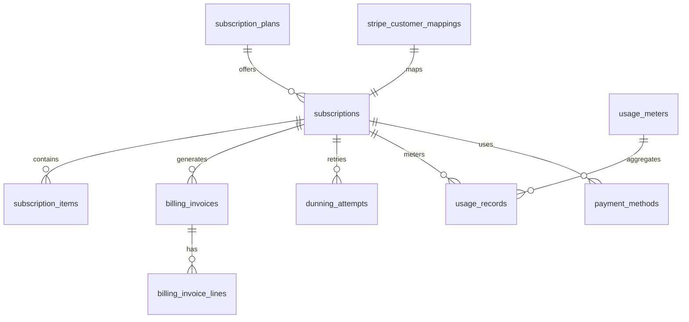

# Billing & Subscription Schema (`billing`)

## Bounded Context

**Billing & Subscription** manages Atlas platform SaaS billing (Plane A): plan catalog, tenant subscriptions, usage metering, invoices, payment methods, dunning, and Stripe identity mappings. Tenant commerce (Plane B) invoices live in the Ledger module; this schema owns Atlas-to-tenant billing only.

## Purpose

| Capability | Tables |
|------------|--------|
| Plan catalog | `subscription_plans` |
| Active subscriptions | `subscriptions`, `subscription_items` |
| Usage-based billing | `usage_meters`, `usage_records` |
| Platform invoices | `billing_invoices`, `billing_invoice_lines` |
| Payment instruments | `payment_methods` |
| Failed payment recovery | `dunning_attempts` |
| Stripe sync | `stripe_customer_mappings` |

## Business Rules

1. **One active subscription per tenant** — `UNIQUE (tenant_id)` on `subscriptions` where `status NOT IN ('canceled', 'incomplete_expired')`.
2. **Stripe is authoritative for payment state** — Local rows updated via webhooks; reconciliation job detects drift.
3. **Plans are immutable pricing** — Price changes create new `subscription_plans` row; existing subscriptions grandfathered until migration.
4. **Usage idempotency** — `usage_records.idempotency_key` prevents duplicate metering events.
5. **Meter aggregation** — Raw events aggregated hourly; Stripe submission daily.
6. **Invoice immutability** — Posted invoices (`status = 'open' | 'paid'`) are append-only; corrections via credit notes (future).
7. **Dunning stages** — Automated progression per `12-payments.md` schedule; manual override for enterprise.

## Entity Relationship Diagram



---

## Tables

### `subscription_plans`

Global plan catalog synchronized with Stripe Products/Prices.

```sql
CREATE TABLE billing.subscription_plans (
    id                      UUID PRIMARY KEY DEFAULT gen_random_uuid(),
    code                    CITEXT NOT NULL,
    name                    TEXT NOT NULL,
    description             TEXT,
    tier                    TEXT NOT NULL,
    billing_interval        TEXT NOT NULL,
    base_amount_cents       BIGINT NOT NULL,
    currency                CHAR(3) NOT NULL DEFAULT 'USD',
    included_seats          INTEGER NOT NULL DEFAULT 1,
    stripe_product_id       TEXT NOT NULL,
    stripe_price_id         TEXT NOT NULL,
    trial_days              INTEGER NOT NULL DEFAULT 14,
    is_active               BOOLEAN NOT NULL DEFAULT true,
    is_public               BOOLEAN NOT NULL DEFAULT true,
    entitlements            JSONB NOT NULL DEFAULT '{}',
    metadata                JSONB NOT NULL DEFAULT '{}',
    effective_from          TIMESTAMPTZ NOT NULL DEFAULT now(),
    effective_to            TIMESTAMPTZ,
    created_at              TIMESTAMPTZ NOT NULL DEFAULT now(),
    updated_at              TIMESTAMPTZ NOT NULL DEFAULT now(),
    version                 INTEGER NOT NULL DEFAULT 1,

    CONSTRAINT subscription_plans_pkey PRIMARY KEY (id),
    CONSTRAINT uq_subscription_plans_code UNIQUE (code),
    CONSTRAINT uq_subscription_plans_stripe_price UNIQUE (stripe_price_id),
    CONSTRAINT chk_subscription_plans_tier
        CHECK (tier IN ('starter', 'professional', 'business', 'enterprise')),
    CONSTRAINT chk_subscription_plans_interval
        CHECK (billing_interval IN ('month', 'year', 'week', 'day')),
    CONSTRAINT chk_subscription_plans_base_amount
        CHECK (base_amount_cents >= 0)
);

CREATE INDEX idx_subscription_plans_active
    ON billing.subscription_plans (tier, billing_interval)
    WHERE is_active = true AND is_public = true;
```

---

### `stripe_customer_mappings`

Maps Atlas tenants to Stripe Customer IDs. One canonical mapping per tenant.

```sql
CREATE TABLE billing.stripe_customer_mappings (
    id                      UUID PRIMARY KEY DEFAULT gen_random_uuid(),
    tenant_id               UUID NOT NULL REFERENCES atlas_core.tenants(id),
    stripe_customer_id      TEXT NOT NULL,
    stripe_account_id       TEXT,
    default_currency        CHAR(3) NOT NULL DEFAULT 'USD',
    tax_exempt              TEXT NOT NULL DEFAULT 'none',
    billing_email           CITEXT,
    metadata                JSONB NOT NULL DEFAULT '{}',
    synced_at               TIMESTAMPTZ NOT NULL DEFAULT now(),
    created_at              TIMESTAMPTZ NOT NULL DEFAULT now(),
    updated_at              TIMESTAMPTZ NOT NULL DEFAULT now(),

    CONSTRAINT stripe_customer_mappings_pkey PRIMARY KEY (id),
    CONSTRAINT uq_stripe_customer_mappings_tenant UNIQUE (tenant_id),
    CONSTRAINT uq_stripe_customer_mappings_stripe_customer UNIQUE (stripe_customer_id),
    CONSTRAINT chk_stripe_customer_mappings_tax_exempt
        CHECK (tax_exempt IN ('none', 'exempt', 'reverse'))
);
```

---

### `subscriptions`

Tenant subscription state. Authoritative for entitlements; synced with Stripe.

```sql
CREATE TABLE billing.subscriptions (
    id                      UUID PRIMARY KEY DEFAULT gen_random_uuid(),
    tenant_id               UUID NOT NULL REFERENCES atlas_core.tenants(id),
    subscription_plan_id    UUID NOT NULL REFERENCES billing.subscription_plans(id),
    stripe_customer_mapping_id UUID NOT NULL REFERENCES billing.stripe_customer_mappings(id),
    stripe_subscription_id  TEXT,
    status                  TEXT NOT NULL DEFAULT 'incomplete',
    quantity                INTEGER NOT NULL DEFAULT 1,
    current_period_start    TIMESTAMPTZ,
    current_period_end      TIMESTAMPTZ,
    trial_start             TIMESTAMPTZ,
    trial_end               TIMESTAMPTZ,
    cancel_at_period_end    BOOLEAN NOT NULL DEFAULT false,
    canceled_at             TIMESTAMPTZ,
    ended_at                TIMESTAMPTZ,
    pause_collection        JSONB,
    collection_method       TEXT NOT NULL DEFAULT 'charge_automatically',
    default_payment_method_id UUID,
    metadata                JSONB NOT NULL DEFAULT '{}',
    created_at              TIMESTAMPTZ NOT NULL DEFAULT now(),
    updated_at              TIMESTAMPTZ NOT NULL DEFAULT now(),
    deleted_at              TIMESTAMPTZ,
    created_by              UUID,
    updated_by              UUID,
    version                 INTEGER NOT NULL DEFAULT 1,

    CONSTRAINT subscriptions_pkey PRIMARY KEY (id),
    CONSTRAINT uq_subscriptions_stripe_subscription UNIQUE (stripe_subscription_id),
    CONSTRAINT chk_subscriptions_status
        CHECK (status IN (
            'incomplete', 'incomplete_expired', 'trialing', 'active',
            'past_due', 'canceled', 'unpaid', 'paused'
        )),
    CONSTRAINT chk_subscriptions_collection_method
        CHECK (collection_method IN ('charge_automatically', 'send_invoice'))
);

CREATE UNIQUE INDEX uq_subscriptions_tenant_active
    ON billing.subscriptions (tenant_id)
    WHERE deleted_at IS NULL
      AND status NOT IN ('canceled', 'incomplete_expired');

CREATE INDEX idx_subscriptions_tenant_id
    ON billing.subscriptions (tenant_id)
    WHERE deleted_at IS NULL;

CREATE INDEX idx_subscriptions_status
    ON billing.subscriptions (status)
    WHERE deleted_at IS NULL AND status IN ('past_due', 'unpaid');

CREATE INDEX idx_subscriptions_period_end
    ON billing.subscriptions (current_period_end)
    WHERE deleted_at IS NULL AND status = 'active';
```

**RLS:** Full tenant isolation on `tenant_id`.

---

### `subscription_items`

Line items on a subscription (base plan, add-ons, metered components).

```sql
CREATE TABLE billing.subscription_items (
    id                      UUID PRIMARY KEY DEFAULT gen_random_uuid(),
    tenant_id               UUID NOT NULL REFERENCES atlas_core.tenants(id),
    subscription_id         UUID NOT NULL REFERENCES billing.subscriptions(id),
    stripe_subscription_item_id TEXT,
    item_type               TEXT NOT NULL,
    subscription_plan_id    UUID REFERENCES billing.subscription_plans(id),
    usage_meter_id          UUID REFERENCES billing.usage_meters(id),
    quantity                INTEGER NOT NULL DEFAULT 1,
    unit_amount_cents       BIGINT,
    currency                CHAR(3) NOT NULL DEFAULT 'USD',
    metadata                JSONB NOT NULL DEFAULT '{}',
    created_at              TIMESTAMPTZ NOT NULL DEFAULT now(),
    updated_at              TIMESTAMPTZ NOT NULL DEFAULT now(),
    deleted_at              TIMESTAMPTZ,

    CONSTRAINT subscription_items_pkey PRIMARY KEY (id),
    CONSTRAINT uq_subscription_items_stripe_item UNIQUE (stripe_subscription_item_id),
    CONSTRAINT chk_subscription_items_type
        CHECK (item_type IN ('plan', 'addon', 'metered'))
);

CREATE INDEX idx_subscription_items_subscription_id
    ON billing.subscription_items (subscription_id)
    WHERE deleted_at IS NULL;

CREATE INDEX idx_subscription_items_tenant_id
    ON billing.subscription_items (tenant_id)
    WHERE deleted_at IS NULL;
```

---

### `usage_meters`

Meter definitions for usage-based billing dimensions.

```sql
CREATE TABLE billing.usage_meters (
    id                      UUID PRIMARY KEY DEFAULT gen_random_uuid(),
    code                    CITEXT NOT NULL,
    name                    TEXT NOT NULL,
    description             TEXT,
    aggregation_type        TEXT NOT NULL,
    stripe_meter_id         TEXT,
    stripe_price_id         TEXT,
    unit_label              TEXT NOT NULL,
    event_name              TEXT NOT NULL,
    is_active               BOOLEAN NOT NULL DEFAULT true,
    metadata                JSONB NOT NULL DEFAULT '{}',
    created_at              TIMESTAMPTZ NOT NULL DEFAULT now(),
    updated_at              TIMESTAMPTZ NOT NULL DEFAULT now(),

    CONSTRAINT usage_meters_pkey PRIMARY KEY (id),
    CONSTRAINT uq_usage_meters_code UNIQUE (code),
    CONSTRAINT chk_usage_meters_aggregation
        CHECK (aggregation_type IN ('sum', 'max', 'last_during_period', 'count'))
);

CREATE INDEX idx_usage_meters_active
    ON billing.usage_meters (code)
    WHERE is_active = true;
```

**Seed meters:** `api_requests`, `storage_gb_hours`, `ai_tokens`, `sms_segments`, `seat_usage`.

---

### `usage_records`

Raw and aggregated usage events. Partitioned by `recorded_at` (monthly).

```sql
CREATE TABLE billing.usage_records (
    id                      UUID NOT NULL DEFAULT gen_random_uuid(),
    tenant_id               UUID NOT NULL REFERENCES atlas_core.tenants(id),
    subscription_id         UUID NOT NULL REFERENCES billing.subscriptions(id),
    usage_meter_id          UUID NOT NULL REFERENCES billing.usage_meters(id),
    idempotency_key         TEXT NOT NULL,
    quantity                NUMERIC(20,6) NOT NULL,
    unit                    TEXT NOT NULL,
    recorded_at             TIMESTAMPTZ NOT NULL,
    aggregation_window_start TIMESTAMPTZ,
    aggregation_window_end  TIMESTAMPTZ,
    is_aggregated           BOOLEAN NOT NULL DEFAULT false,
    stripe_usage_record_id  TEXT,
    submitted_to_stripe_at  TIMESTAMPTZ,
    source                  TEXT NOT NULL DEFAULT 'api',
    metadata                JSONB NOT NULL DEFAULT '{}',
    created_at              TIMESTAMPTZ NOT NULL DEFAULT now(),

    CONSTRAINT usage_records_pkey PRIMARY KEY (id, recorded_at),
    CONSTRAINT chk_usage_records_quantity CHECK (quantity >= 0),
    CONSTRAINT chk_usage_records_source
        CHECK (source IN ('api', 'worker', 'backfill', 'reconciliation'))
) PARTITION BY RANGE (recorded_at);

CREATE UNIQUE INDEX uq_usage_records_idempotency
    ON billing.usage_records (tenant_id, usage_meter_id, idempotency_key, recorded_at);

CREATE INDEX idx_usage_records_tenant_meter_window
    ON billing.usage_records (tenant_id, usage_meter_id, aggregation_window_start)
    WHERE is_aggregated = true;

CREATE INDEX idx_usage_records_unsubmitted
    ON billing.usage_records (recorded_at)
    WHERE submitted_to_stripe_at IS NULL AND is_aggregated = true;
```

**Partitioning:** `usage_records_2026_06`, etc. Auto-created via pg_partman.

---

### `payment_methods`

Tokenized payment methods (Stripe PaymentMethod IDs only — no PAN).

```sql
CREATE TABLE billing.payment_methods (
    id                      UUID PRIMARY KEY DEFAULT gen_random_uuid(),
    tenant_id               UUID NOT NULL REFERENCES atlas_core.tenants(id),
    stripe_customer_mapping_id UUID NOT NULL REFERENCES billing.stripe_customer_mappings(id),
    stripe_payment_method_id TEXT NOT NULL,
    type                    TEXT NOT NULL,
    card_brand              TEXT,
    card_last4              CHAR(4),
    card_exp_month          SMALLINT,
    card_exp_year           SMALLINT,
    bank_name               TEXT,
    bank_last4              CHAR(4),
    is_default              BOOLEAN NOT NULL DEFAULT false,
    billing_details         JSONB NOT NULL DEFAULT '{}',
    status                  TEXT NOT NULL DEFAULT 'active',
    created_at              TIMESTAMPTZ NOT NULL DEFAULT now(),
    updated_at              TIMESTAMPTZ NOT NULL DEFAULT now(),
    deleted_at              TIMESTAMPTZ,

    CONSTRAINT payment_methods_pkey PRIMARY KEY (id),
    CONSTRAINT uq_payment_methods_stripe_pm UNIQUE (stripe_payment_method_id),
    CONSTRAINT chk_payment_methods_type
        CHECK (type IN ('card', 'us_bank_account', 'sepa_debit', 'link', 'apple_pay', 'google_pay')),
    CONSTRAINT chk_payment_methods_status
        CHECK (status IN ('active', 'expired', 'failed', 'detached'))
);

CREATE INDEX idx_payment_methods_tenant_id
    ON billing.payment_methods (tenant_id)
    WHERE deleted_at IS NULL;

CREATE UNIQUE INDEX uq_payment_methods_tenant_default
    ON billing.payment_methods (tenant_id)
    WHERE deleted_at IS NULL AND is_default = true;
```

---

### `billing_invoices`

Atlas platform invoices (mirrors Stripe Invoice state).

```sql
CREATE TABLE billing.billing_invoices (
    id                      UUID PRIMARY KEY DEFAULT gen_random_uuid(),
    tenant_id               UUID NOT NULL REFERENCES atlas_core.tenants(id),
    subscription_id         UUID NOT NULL REFERENCES billing.subscriptions(id),
    stripe_invoice_id       TEXT,
    invoice_number          TEXT NOT NULL,
    status                  TEXT NOT NULL DEFAULT 'draft',
    currency                CHAR(3) NOT NULL,
    subtotal_cents          BIGINT NOT NULL DEFAULT 0,
    tax_cents               BIGINT NOT NULL DEFAULT 0,
    total_cents             BIGINT NOT NULL DEFAULT 0,
    amount_paid_cents       BIGINT NOT NULL DEFAULT 0,
    amount_due_cents        BIGINT NOT NULL DEFAULT 0,
    period_start            TIMESTAMPTZ NOT NULL,
    period_end              TIMESTAMPTZ NOT NULL,
    due_date                TIMESTAMPTZ,
    paid_at                 TIMESTAMPTZ,
    voided_at               TIMESTAMPTZ,
    hosted_invoice_url      TEXT,
    invoice_pdf_url         TEXT,
    metadata                JSONB NOT NULL DEFAULT '{}',
    created_at              TIMESTAMPTZ NOT NULL DEFAULT now(),
    updated_at              TIMESTAMPTZ NOT NULL DEFAULT now(),

    CONSTRAINT billing_invoices_pkey PRIMARY KEY (id),
    CONSTRAINT uq_billing_invoices_stripe UNIQUE (stripe_invoice_id),
    CONSTRAINT uq_billing_invoices_number UNIQUE (tenant_id, invoice_number),
    CONSTRAINT chk_billing_invoices_status
        CHECK (status IN ('draft', 'open', 'paid', 'void', 'uncollectible')),
    CONSTRAINT chk_billing_invoices_amounts
        CHECK (total_cents >= 0 AND amount_paid_cents >= 0 AND amount_due_cents >= 0)
);

CREATE INDEX idx_billing_invoices_tenant_status
    ON billing.billing_invoices (tenant_id, status, created_at DESC);

CREATE INDEX idx_billing_invoices_subscription_id
    ON billing.billing_invoices (subscription_id);
```

---

### `billing_invoice_lines`

Invoice line items.

```sql
CREATE TABLE billing.billing_invoice_lines (
    id                      UUID PRIMARY KEY DEFAULT gen_random_uuid(),
    tenant_id               UUID NOT NULL REFERENCES atlas_core.tenants(id),
    billing_invoice_id      UUID NOT NULL REFERENCES billing.billing_invoices(id),
    stripe_invoice_line_id  TEXT,
    line_type               TEXT NOT NULL,
    description             TEXT NOT NULL,
    quantity                NUMERIC(12,4) NOT NULL DEFAULT 1,
    unit_amount_cents       BIGINT NOT NULL,
    amount_cents            BIGINT NOT NULL,
    currency                CHAR(3) NOT NULL,
    period_start            TIMESTAMPTZ,
    period_end              TIMESTAMPTZ,
    usage_meter_id          UUID REFERENCES billing.usage_meters(id),
    subscription_item_id    UUID REFERENCES billing.subscription_items(id),
    metadata                JSONB NOT NULL DEFAULT '{}',
    created_at              TIMESTAMPTZ NOT NULL DEFAULT now(),

    CONSTRAINT billing_invoice_lines_pkey PRIMARY KEY (id),
    CONSTRAINT chk_billing_invoice_lines_type
        CHECK (line_type IN ('subscription', 'usage', 'addon', 'credit', 'tax', 'discount'))
);

CREATE INDEX idx_billing_invoice_lines_invoice_id
    ON billing.billing_invoice_lines (billing_invoice_id);

CREATE INDEX idx_billing_invoice_lines_tenant_id
    ON billing.billing_invoice_lines (tenant_id);
```

---

### `dunning_attempts`

Failed payment retry tracking.

```sql
CREATE TABLE billing.dunning_attempts (
    id                      UUID PRIMARY KEY DEFAULT gen_random_uuid(),
    tenant_id               UUID NOT NULL REFERENCES atlas_core.tenants(id),
    subscription_id         UUID NOT NULL REFERENCES billing.subscriptions(id),
    billing_invoice_id      UUID REFERENCES billing.billing_invoices(id),
    attempt_number          INTEGER NOT NULL,
    stage                   INTEGER NOT NULL,
    stripe_invoice_id       TEXT,
    stripe_payment_intent_id TEXT,
    status                  TEXT NOT NULL,
    failure_code            TEXT,
    failure_message         TEXT,
    next_retry_at           TIMESTAMPTZ,
    notification_sent_at    TIMESTAMPTZ,
    resolved_at             TIMESTAMPTZ,
    metadata                JSONB NOT NULL DEFAULT '{}',
    created_at              TIMESTAMPTZ NOT NULL DEFAULT now(),
    updated_at              TIMESTAMPTZ NOT NULL DEFAULT now(),

    CONSTRAINT dunning_attempts_pkey PRIMARY KEY (id),
    CONSTRAINT chk_dunning_attempts_status
        CHECK (status IN ('pending', 'retrying', 'succeeded', 'failed', 'exhausted', 'canceled')),
    CONSTRAINT chk_dunning_attempts_stage CHECK (stage BETWEEN 1 AND 5)
);

CREATE INDEX idx_dunning_attempts_subscription
    ON billing.dunning_attempts (subscription_id, created_at DESC);

CREATE INDEX idx_dunning_attempts_next_retry
    ON billing.dunning_attempts (next_retry_at)
    WHERE status IN ('pending', 'retrying');
```

---

## RLS Policies

```sql
-- Template applied to all tenant-scoped tables
ALTER TABLE billing.subscriptions ENABLE ROW LEVEL SECURITY;
ALTER TABLE billing.subscriptions FORCE ROW LEVEL SECURITY;

CREATE POLICY tenant_isolation ON billing.subscriptions
    USING (tenant_id = current_setting('app.tenant_id', true)::uuid)
    WITH CHECK (tenant_id = current_setting('app.tenant_id', true)::uuid);
```

Global tables (`subscription_plans`, `usage_meters`) — read-only for application role; write restricted to `atlas_platform_admin`.

## Soft Delete

| Table | Soft Delete |
|-------|-------------|
| `subscriptions` | Yes — `deleted_at`; canceled subscriptions retained |
| `subscription_items` | Yes |
| `payment_methods` | Yes — `status = detached` |
| `billing_invoices` | No — financial immutability |
| `usage_records` | No — append-only |

## Audit Strategy

- All money mutations → `atlas_audit.audit_log_entries` with field-level diff
- Webhook processing logged with `stripe_event_id` in metadata
- Domain events: `billing.subscription.updated.v1`, `billing.invoice.paid.v1`

## Migration Notes

| Migration | Description |
|-----------|-------------|
| `V160__create_billing_schema.sql` | Schema + enums |
| `V161__create_subscription_plans_meters.sql` | Global catalog |
| `V162__create_stripe_customer_mappings.sql` | Stripe mappings |
| `V163__create_subscriptions_items.sql` | Subscriptions + RLS |
| `V164__create_usage_records_partitioned.sql` | Partitioned usage |
| `V165__create_invoices_payment_methods.sql` | Invoices, PMs |
| `V166__create_dunning_attempts.sql` | Dunning |
| `R__billing_seed_plans.sql` | Starter/Business/Enterprise plans |

**Citus:** Distribute all tenant-scoped tables by `tenant_id`. Reference: `subscription_plans`, `usage_meters`.

## Cross-References

- [12-payments.md](../architecture/phase-1/12-payments.md)
- [ADR-0008-stripe-payments.md](../adr/ADR-0008-stripe-payments.md)
- [prisma/models/billing.prisma](../../prisma/models/billing.prisma)