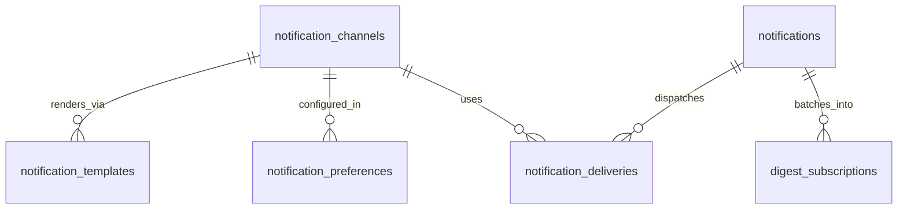

# Notifications Schema (`notifications`)

## Bounded Context

The **Notifications** bounded context delivers multi-channel messages (email, push, SMS, in-app, Slack, Teams) triggered by domain events or explicit API calls. It owns template versioning, user/org preferences, delivery tracking, channel configuration, and digest batching.

## Purpose

| Entity | Role |
|--------|------|
| `notification_channels` | Channel type registry and provider config |
| `notification_templates` | Versioned, localized message templates |
| `notification_preferences` | Per-user channel preferences |
| `notifications` | Notification intent/inbox records |
| `notification_deliveries` | Per-channel delivery attempts |
| `digest_subscriptions` | Digest schedule enrollment |

## Business Rules

1. **Idempotent delivery** — `notification_deliveries.idempotency_key` prevents duplicate sends.
2. **Transactional override** — Alerts with `legal_basis = 'contract'` bypass user opt-out (with audit).
3. **Template immutability** — Active templates are versioned; edits create new version row.
4. **Quiet hours** — Org-level quiet hours suppress non-critical channels; critical alerts bypass.
5. **Digest eligibility** — Only `digest_eligible` definitions may enroll in digest subscriptions.
6. **Retention** — `rendered_snapshot` retained 7 years for transactional; 90 days for operational.
7. **Suppression check** — Delivery blocked if email/phone in global suppression list (separate table, future).

## Entity Relationship Diagram



---

## Tables

### `notification_channels`

Global channel registry with provider configuration schema.

```sql
CREATE TABLE notifications.notification_channels (
    id                      UUID PRIMARY KEY DEFAULT gen_random_uuid(),
    code                    CITEXT NOT NULL,
    name                    TEXT NOT NULL,
    description             TEXT,
    channel_type            TEXT NOT NULL,
    provider                TEXT NOT NULL,
    default_priority        SMALLINT NOT NULL DEFAULT 3,
    max_retries             SMALLINT NOT NULL DEFAULT 5,
    retry_backoff_seconds   INTEGER NOT NULL DEFAULT 60,
    rate_limit_per_minute   INTEGER,
    config_schema           JSONB NOT NULL DEFAULT '{}',
    is_active               BOOLEAN NOT NULL DEFAULT true,
    created_at              TIMESTAMPTZ NOT NULL DEFAULT now(),
    updated_at              TIMESTAMPTZ NOT NULL DEFAULT now(),

    CONSTRAINT notification_channels_pkey PRIMARY KEY (id),
    CONSTRAINT uq_notification_channels_code UNIQUE (code),
    CONSTRAINT chk_notification_channels_type
        CHECK (channel_type IN ('email', 'push', 'sms', 'in_app', 'slack', 'teams', 'webhook')),
    CONSTRAINT chk_notification_channels_priority
        CHECK (default_priority BETWEEN 1 AND 5)
);

CREATE INDEX idx_notification_channels_type
    ON notifications.notification_channels (channel_type)
    WHERE is_active = true;
```

**Seed channels:** `email_sendgrid`, `push_fcm`, `push_apns`, `sms_twilio`, `in_app_sse`, `slack_bot`, `teams_webhook`.

---

### `notification_templates`

Versioned templates per notification definition, channel, and locale.

```sql
CREATE TABLE notifications.notification_templates (
    id                      UUID PRIMARY KEY DEFAULT gen_random_uuid(),
    definition_id           TEXT NOT NULL,
    notification_channel_id UUID NOT NULL REFERENCES notifications.notification_channels(id),
    locale                  TEXT NOT NULL DEFAULT 'en-US',
    version                 INTEGER NOT NULL,
    subject_template        TEXT,
    body_template           TEXT NOT NULL,
    mjml_source             TEXT,
    plain_text_template     TEXT,
    variables_schema        JSONB NOT NULL DEFAULT '{}',
    status                  TEXT NOT NULL DEFAULT 'draft',
    activated_at            TIMESTAMPTZ,
    deprecated_at           TIMESTAMPTZ,
    created_at              TIMESTAMPTZ NOT NULL DEFAULT now(),
    updated_at              TIMESTAMPTZ NOT NULL DEFAULT now(),
    created_by              UUID,
    updated_by              UUID,

    CONSTRAINT notification_templates_pkey PRIMARY KEY (id),
    CONSTRAINT uq_notification_templates_def_channel_locale_version
        UNIQUE (definition_id, notification_channel_id, locale, version),
    CONSTRAINT chk_notification_templates_status
        CHECK (status IN ('draft', 'active', 'deprecated')),
    CONSTRAINT chk_notification_templates_locale
        CHECK (locale ~ '^[a-z]{2}(-[A-Z]{2})?$')
);

CREATE UNIQUE INDEX uq_notification_templates_active
    ON notifications.notification_templates (definition_id, notification_channel_id, locale)
    WHERE status = 'active';

CREATE INDEX idx_notification_templates_definition
    ON notifications.notification_templates (definition_id, status);
```

---

### `notification_preferences`

Per-user, per-tenant, per-definition channel preferences.

```sql
CREATE TABLE notifications.notification_preferences (
    id                      UUID PRIMARY KEY DEFAULT gen_random_uuid(),
    tenant_id               UUID NOT NULL REFERENCES atlas_core.tenants(id),
    user_id                 UUID NOT NULL REFERENCES atlas_core.users(id),
    definition_id           TEXT NOT NULL,
    notification_channel_id UUID NOT NULL REFERENCES notifications.notification_channels(id),
    enabled                 BOOLEAN NOT NULL DEFAULT true,
    digest_mode             TEXT,
    quiet_hours_override    JSONB,
    metadata                JSONB NOT NULL DEFAULT '{}',
    created_at              TIMESTAMPTZ NOT NULL DEFAULT now(),
    updated_at              TIMESTAMPTZ NOT NULL DEFAULT now(),
    version                 INTEGER NOT NULL DEFAULT 1,

    CONSTRAINT notification_preferences_pkey PRIMARY KEY (id),
    CONSTRAINT uq_notification_preferences_user_def_channel
        UNIQUE (tenant_id, user_id, definition_id, notification_channel_id),
    CONSTRAINT chk_notification_preferences_digest_mode
        CHECK (digest_mode IS NULL OR digest_mode IN ('instant', 'hourly', 'daily', 'weekly'))
);

CREATE INDEX idx_notification_preferences_user
    ON notifications.notification_preferences (tenant_id, user_id);

CREATE INDEX idx_notification_preferences_definition
    ON notifications.notification_preferences (tenant_id, definition_id);
```

---

### `notifications`

Notification intent records — the logical notification before channel dispatch.

```sql
CREATE TABLE notifications.notifications (
    id                      UUID PRIMARY KEY DEFAULT gen_random_uuid(),
    tenant_id               UUID NOT NULL REFERENCES atlas_core.tenants(id),
    definition_id           TEXT NOT NULL,
    category                TEXT NOT NULL,
    priority                SMALLINT NOT NULL DEFAULT 3,
    recipient_user_id       UUID NOT NULL REFERENCES atlas_core.users(id),
    actor_user_id           UUID REFERENCES atlas_core.users(id),
    actor_type              TEXT NOT NULL DEFAULT 'user',
    title                   TEXT NOT NULL,
    body                    TEXT,
    action_url              TEXT,
    entity_type             TEXT,
    entity_id               UUID,
    payload                 JSONB NOT NULL DEFAULT '{}',
    locale                  TEXT NOT NULL DEFAULT 'en-US',
    status                  TEXT NOT NULL DEFAULT 'pending',
    idempotency_key         TEXT NOT NULL,
    scheduled_for           TIMESTAMPTZ,
    expires_at              TIMESTAMPTZ,
    read_at                 TIMESTAMPTZ,
    dismissed_at            TIMESTAMPTZ,
    created_at              TIMESTAMPTZ NOT NULL DEFAULT now(),
    updated_at              TIMESTAMPTZ NOT NULL DEFAULT now(),

    CONSTRAINT notifications_pkey PRIMARY KEY (id),
    CONSTRAINT uq_notifications_idempotency UNIQUE (tenant_id, idempotency_key),
    CONSTRAINT chk_notifications_category
        CHECK (category IN ('transactional', 'operational', 'digest', 'alert', 'marketing')),
    CONSTRAINT chk_notifications_status
        CHECK (status IN ('pending', 'processing', 'delivered', 'partial', 'failed', 'suppressed', 'expired')),
    CONSTRAINT chk_notifications_actor_type
        CHECK (actor_type IN ('user', 'system', 'api_key', 'agent', 'workflow'))
);

CREATE INDEX idx_notifications_recipient_inbox
    ON notifications.notifications (tenant_id, recipient_user_id, created_at DESC)
    WHERE read_at IS NULL;

CREATE INDEX idx_notifications_entity
    ON notifications.notifications (tenant_id, entity_type, entity_id)
    WHERE entity_type IS NOT NULL;

CREATE INDEX idx_notifications_scheduled
    ON notifications.notifications (scheduled_for)
    WHERE status = 'pending' AND scheduled_for IS NOT NULL;
```

---

### `notification_deliveries`

Per-channel delivery attempts with provider tracking.

```sql
CREATE TABLE notifications.notification_deliveries (
    id                      UUID PRIMARY KEY DEFAULT gen_random_uuid(),
    tenant_id               UUID NOT NULL REFERENCES atlas_core.tenants(id),
    notification_id         UUID NOT NULL REFERENCES notifications.notifications(id),
    notification_channel_id UUID NOT NULL REFERENCES notifications.notification_channels(id),
    notification_template_id UUID REFERENCES notifications.notification_templates(id),
    idempotency_key         TEXT NOT NULL,
    status                  TEXT NOT NULL DEFAULT 'pending',
    attempt_count           SMALLINT NOT NULL DEFAULT 0,
    provider_message_id     TEXT,
    provider_response       JSONB,
    rendered_snapshot       JSONB,
    error_code              TEXT,
    error_message           TEXT,
    sent_at                 TIMESTAMPTZ,
    delivered_at            TIMESTAMPTZ,
    opened_at               TIMESTAMPTZ,
    clicked_at              TIMESTAMPTZ,
    failed_at               TIMESTAMPTZ,
    next_retry_at           TIMESTAMPTZ,
    created_at              TIMESTAMPTZ NOT NULL DEFAULT now(),
    updated_at              TIMESTAMPTZ NOT NULL DEFAULT now(),

    CONSTRAINT notification_deliveries_pkey PRIMARY KEY (id),
    CONSTRAINT uq_notification_deliveries_idempotency UNIQUE (idempotency_key),
    CONSTRAINT chk_notification_deliveries_status
        CHECK (status IN ('pending', 'queued', 'sent', 'delivered', 'failed', 'suppressed', 'bounced'))
);

CREATE INDEX idx_notification_deliveries_notification
    ON notifications.notification_deliveries (notification_id);

CREATE INDEX idx_notification_deliveries_tenant_status
    ON notifications.notification_deliveries (tenant_id, status, created_at DESC);

CREATE INDEX idx_notification_deliveries_retry
    ON notifications.notification_deliveries (next_retry_at)
    WHERE status = 'failed' AND next_retry_at IS NOT NULL;
```

---

### `digest_subscriptions`

User enrollment in digest schedules for eligible notification definitions.

```sql
CREATE TABLE notifications.digest_subscriptions (
    id                      UUID PRIMARY KEY DEFAULT gen_random_uuid(),
    tenant_id               UUID NOT NULL REFERENCES atlas_core.tenants(id),
    user_id                 UUID NOT NULL REFERENCES atlas_core.users(id),
    definition_id           TEXT NOT NULL,
    digest_frequency        TEXT NOT NULL,
    timezone                TEXT NOT NULL DEFAULT 'UTC',
    delivery_hour           SMALLINT NOT NULL DEFAULT 8,
    delivery_day_of_week    SMALLINT,
    last_sent_at            TIMESTAMPTZ,
    next_scheduled_at       TIMESTAMPTZ NOT NULL,
    pending_count           INTEGER NOT NULL DEFAULT 0,
    is_active               BOOLEAN NOT NULL DEFAULT true,
    metadata                JSONB NOT NULL DEFAULT '{}',
    created_at              TIMESTAMPTZ NOT NULL DEFAULT now(),
    updated_at              TIMESTAMPTZ NOT NULL DEFAULT now(),

    CONSTRAINT digest_subscriptions_pkey PRIMARY KEY (id),
    CONSTRAINT uq_digest_subscriptions_user_def
        UNIQUE (tenant_id, user_id, definition_id),
    CONSTRAINT chk_digest_subscriptions_frequency
        CHECK (digest_frequency IN ('hourly', 'daily', 'weekly')),
    CONSTRAINT chk_digest_subscriptions_hour
        CHECK (delivery_hour BETWEEN 0 AND 23),
    CONSTRAINT chk_digest_subscriptions_dow
        CHECK (delivery_day_of_week IS NULL OR delivery_day_of_week BETWEEN 0 AND 6)
);

CREATE INDEX idx_digest_subscriptions_next_scheduled
    ON notifications.digest_subscriptions (next_scheduled_at)
    WHERE is_active = true;

CREATE INDEX idx_digest_subscriptions_user
    ON notifications.digest_subscriptions (tenant_id, user_id);
```

---

## RLS Policies

```sql
ALTER TABLE notifications.notifications ENABLE ROW LEVEL SECURITY;
ALTER TABLE notifications.notifications FORCE ROW LEVEL SECURITY;

CREATE POLICY tenant_isolation ON notifications.notifications
    USING (tenant_id = current_setting('app.tenant_id', true)::uuid)
    WITH CHECK (tenant_id = current_setting('app.tenant_id', true)::uuid);

CREATE POLICY recipient_read ON notifications.notifications
    FOR SELECT
    USING (
        tenant_id = current_setting('app.tenant_id', true)::uuid
        AND recipient_user_id = current_setting('app.user_id', true)::uuid
    );
```

Applied similarly to: `notification_preferences`, `notification_deliveries`, `digest_subscriptions`.

Global tables (`notification_channels`, `notification_templates`) — read for all; write platform admin.

## Soft Delete

Notifications use status-based lifecycle, not `deleted_at`. Preferences and digest subscriptions use hard delete on user request (GDPR).

## Audit Strategy

- Delivery snapshots immutable in `rendered_snapshot`
- Suppression events → `atlas_audit.audit_log_entries`
- Domain events: `notifications.delivery.completed.v1`, `notifications.delivery.failed.v1`

## Migration Notes

| Migration | Description |
|-----------|-------------|
| `V170__create_notifications_schema.sql` | Schema creation |
| `V171__create_notification_channels.sql` | Channel registry + seed |
| `V172__create_notification_templates.sql` | Templates |
| `V173__create_notification_preferences.sql` | Preferences + RLS |
| `V174__create_notifications_deliveries.sql` | Notifications + deliveries |
| `V175__create_digest_subscriptions.sql` | Digest scheduler |
| `R__notifications_seed_definitions.sql` | Core definition templates |

**Partitioning:** `notification_deliveries` partitioned monthly by `created_at` when > 100M rows.

**Citus:** Distribute tenant-scoped tables by `tenant_id`.

## Cross-References

- [10-notifications.md](../architecture/phase-1/10-notifications.md)
- [prisma/models/notifications.prisma](../../prisma/models/notifications.prisma)