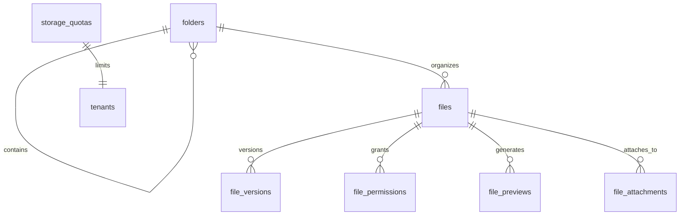

# Documents & Storage Schema (`storage`)

## Bounded Context

**Documents & Storage** manages file metadata in PostgreSQL while binary content lives in S3-compatible object storage. It provides folder hierarchy, versioning, permissions, quotas, previews, and polymorphic entity attachments across all Atlas modules.

## Purpose

| Entity | Role |
|--------|------|
| `folders` | Hierarchical document organization |
| `files` | File metadata and S3 object references |
| `file_versions` | Immutable version history |
| `file_permissions` | Explicit ACL beyond entity-derived permissions |
| `storage_quotas` | Per-tenant storage limits and usage |
| `file_previews` | Generated thumbnails and preview derivatives |
| `file_attachments` | Polymorphic links to domain entities |

## Business Rules

1. **Blob/metadata separation** — PostgreSQL stores metadata only; blobs in S3.
2. **Content addressing** — `content_hash` (SHA-256) enables deduplication within tenant.
3. **One latest version** — Exactly one `file_versions.is_latest = true` per file.
4. **Polymorphic attachments** — `(entity_type, entity_id)` links files to any domain entity.
5. **Quota enforcement** — Upload blocked when `storage_quotas` exceeded.
6. **Scan gate** — Files remain `status = 'scanning'` until virus scan completes.
7. **Legal hold** — Files with `legal_hold = true` exempt from lifecycle purge.
8. **Permission inheritance** — Entity attachment inherits entity ReBAC; `file_permissions` adds explicit grants.

## Entity Relationship Diagram



---

## Tables

### `folders`

Hierarchical folder structure per tenant workspace.

```sql
CREATE TABLE storage.folders (
    id                      UUID PRIMARY KEY DEFAULT gen_random_uuid(),
    tenant_id               UUID NOT NULL REFERENCES atlas_core.tenants(id),
    workspace_id            UUID REFERENCES atlas_core.workspaces(id),
    parent_folder_id        UUID REFERENCES storage.folders(id),
    name                    TEXT NOT NULL,
    slug                    TEXT NOT NULL,
    path                    LTREE NOT NULL,
    depth                   SMALLINT NOT NULL DEFAULT 0,
    description             TEXT,
    color                   CHAR(7),
    is_system               BOOLEAN NOT NULL DEFAULT false,
    metadata                JSONB NOT NULL DEFAULT '{}',
    created_at              TIMESTAMPTZ NOT NULL DEFAULT now(),
    updated_at              TIMESTAMPTZ NOT NULL DEFAULT now(),
    deleted_at              TIMESTAMPTZ,
    created_by              UUID NOT NULL,
    updated_by              UUID,
    version                 INTEGER NOT NULL DEFAULT 1,

    CONSTRAINT folders_pkey PRIMARY KEY (id),
    CONSTRAINT chk_folders_depth CHECK (depth >= 0 AND depth <= 20),
    CONSTRAINT chk_folders_color CHECK (color IS NULL OR color ~ '^#[0-9A-Fa-f]{6}$')
);

CREATE UNIQUE INDEX uq_folders_tenant_parent_slug
    ON storage.folders (tenant_id, parent_folder_id, slug)
    WHERE deleted_at IS NULL;

CREATE INDEX idx_folders_tenant_path
    ON storage.folders USING GIST (path);

CREATE INDEX idx_folders_tenant_workspace
    ON storage.folders (tenant_id, workspace_id)
    WHERE deleted_at IS NULL;

CREATE INDEX idx_folders_parent
    ON storage.folders (parent_folder_id)
    WHERE deleted_at IS NULL;
```

**Path convention:** `root.{workspace_id}.{folder_slug}...` using PostgreSQL `ltree`.

---

### `files`

Primary file metadata record.

```sql
CREATE TABLE storage.files (
    id                      UUID PRIMARY KEY DEFAULT gen_random_uuid(),
    tenant_id               UUID NOT NULL REFERENCES atlas_core.tenants(id),
    folder_id               UUID REFERENCES storage.folders(id),
    name                    TEXT NOT NULL,
    original_name           TEXT NOT NULL,
    mime_type               TEXT NOT NULL,
    extension               TEXT,
    size_bytes              BIGINT NOT NULL,
    content_hash            BYTEA NOT NULL,
    bucket                  TEXT NOT NULL,
    object_key              TEXT NOT NULL,
    encryption_key_id       TEXT NOT NULL,
    status                  TEXT NOT NULL DEFAULT 'pending',
    current_version_number  INTEGER NOT NULL DEFAULT 1,
    is_starred              BOOLEAN NOT NULL DEFAULT false,
    sensitivity_class       TEXT NOT NULL DEFAULT 'standard',
    legal_hold              BOOLEAN NOT NULL DEFAULT false,
    retention_until         TIMESTAMPTZ,
    scanned_at              TIMESTAMPTZ,
    scan_result             TEXT,
    metadata                JSONB NOT NULL DEFAULT '{}',
    created_at              TIMESTAMPTZ NOT NULL DEFAULT now(),
    updated_at              TIMESTAMPTZ NOT NULL DEFAULT now(),
    deleted_at              TIMESTAMPTZ,
    created_by              UUID NOT NULL,
    updated_by              UUID,
    version                 INTEGER NOT NULL DEFAULT 1,

    CONSTRAINT files_pkey PRIMARY KEY (id),
    CONSTRAINT chk_files_status
        CHECK (status IN ('pending', 'uploading', 'scanning', 'clean', 'infected', 'quarantined', 'rejected', 'deleted')),
    CONSTRAINT chk_files_sensitivity
        CHECK (sensitivity_class IN ('public', 'standard', 'restricted', 'confidential')),
    CONSTRAINT chk_files_size CHECK (size_bytes >= 0)
);

CREATE UNIQUE INDEX uq_files_tenant_object_key
    ON storage.files (tenant_id, bucket, object_key)
    WHERE deleted_at IS NULL;

CREATE INDEX idx_files_tenant_folder
    ON storage.files (tenant_id, folder_id)
    WHERE deleted_at IS NULL;

CREATE INDEX idx_files_tenant_status
    ON storage.files (tenant_id, status)
    WHERE deleted_at IS NULL;

CREATE INDEX idx_files_content_hash
    ON storage.files (tenant_id, content_hash)
    WHERE deleted_at IS NULL AND status = 'clean';

CREATE INDEX idx_files_retention
    ON storage.files (retention_until)
    WHERE deleted_at IS NULL AND legal_hold = false;
```

---

### `file_versions`

Immutable version history with S3 object references.

```sql
CREATE TABLE storage.file_versions (
    id                      UUID PRIMARY KEY DEFAULT gen_random_uuid(),
    tenant_id               UUID NOT NULL REFERENCES atlas_core.tenants(id),
    file_id                 UUID NOT NULL REFERENCES storage.files(id),
    version_number          INTEGER NOT NULL,
    is_latest               BOOLEAN NOT NULL DEFAULT false,
    size_bytes              BIGINT NOT NULL,
    content_hash            BYTEA NOT NULL,
    bucket                  TEXT NOT NULL,
    object_key              TEXT NOT NULL,
    mime_type               TEXT NOT NULL,
    change_summary          TEXT,
    created_by              UUID NOT NULL,
    created_at              TIMESTAMPTZ NOT NULL DEFAULT now(),

    CONSTRAINT file_versions_pkey PRIMARY KEY (id),
    CONSTRAINT uq_file_versions_file_version UNIQUE (file_id, version_number),
    CONSTRAINT chk_file_versions_number CHECK (version_number >= 1)
);

CREATE UNIQUE INDEX uq_file_versions_latest
    ON storage.file_versions (file_id)
    WHERE is_latest = true;

CREATE INDEX idx_file_versions_file_id
    ON storage.file_versions (file_id, version_number DESC);

CREATE INDEX idx_file_versions_tenant_id
    ON storage.file_versions (tenant_id);
```

**Trigger:** `storage.enforce_single_latest_version()` — ensures one `is_latest` per file.

---

### `file_permissions`

Explicit file-level ACL beyond entity-derived permissions.

```sql
CREATE TABLE storage.file_permissions (
    id                      UUID PRIMARY KEY DEFAULT gen_random_uuid(),
    tenant_id               UUID NOT NULL REFERENCES atlas_core.tenants(id),
    file_id                 UUID NOT NULL REFERENCES storage.files(id),
    grantee_type            TEXT NOT NULL,
    grantee_id              UUID NOT NULL,
    permission              TEXT NOT NULL,
    granted_by              UUID NOT NULL,
    expires_at              TIMESTAMPTZ,
    created_at              TIMESTAMPTZ NOT NULL DEFAULT now(),
    updated_at              TIMESTAMPTZ NOT NULL DEFAULT now(),
    deleted_at              TIMESTAMPTZ,

    CONSTRAINT file_permissions_pkey PRIMARY KEY (id),
    CONSTRAINT uq_file_permissions_grantee
        UNIQUE (file_id, grantee_type, grantee_id, permission),
    CONSTRAINT chk_file_permissions_grantee_type
        CHECK (grantee_type IN ('user', 'team', 'role', 'workspace')),
    CONSTRAINT chk_file_permissions_permission
        CHECK (permission IN ('read', 'write', 'delete', 'share', 'admin'))
);

CREATE INDEX idx_file_permissions_file_id
    ON storage.file_permissions (file_id)
    WHERE deleted_at IS NULL;

CREATE INDEX idx_file_permissions_grantee
    ON storage.file_permissions (tenant_id, grantee_type, grantee_id)
    WHERE deleted_at IS NULL;
```

---

### `storage_quotas`

Per-tenant storage limits and current usage.

```sql
CREATE TABLE storage.storage_quotas (
    id                      UUID PRIMARY KEY DEFAULT gen_random_uuid(),
    tenant_id               UUID NOT NULL REFERENCES atlas_core.tenants(id),
    max_storage_bytes       BIGINT NOT NULL,
    max_file_count          BIGINT NOT NULL,
    max_single_upload_bytes BIGINT NOT NULL DEFAULT 524288000,
    used_storage_bytes      BIGINT NOT NULL DEFAULT 0,
    used_file_count         BIGINT NOT NULL DEFAULT 0,
    warning_threshold_pct   SMALLINT NOT NULL DEFAULT 80,
    hard_limit_enforced     BOOLEAN NOT NULL DEFAULT true,
    last_reconciled_at      TIMESTAMPTZ,
    metadata                JSONB NOT NULL DEFAULT '{}',
    created_at              TIMESTAMPTZ NOT NULL DEFAULT now(),
    updated_at              TIMESTAMPTZ NOT NULL DEFAULT now(),

    CONSTRAINT storage_quotas_pkey PRIMARY KEY (id),
    CONSTRAINT uq_storage_quotas_tenant UNIQUE (tenant_id),
    CONSTRAINT chk_storage_quotas_usage
        CHECK (used_storage_bytes >= 0 AND used_file_count >= 0),
    CONSTRAINT chk_storage_quotas_threshold
        CHECK (warning_threshold_pct BETWEEN 50 AND 99)
);

CREATE INDEX idx_storage_quotas_usage_pct
    ON storage.storage_quotas ((used_storage_bytes::numeric / NULLIF(max_storage_bytes, 0)))
    WHERE hard_limit_enforced = true;
```

**Reconciliation:** Nightly job compares S3 inventory with `used_storage_bytes`.

---

### `file_previews`

Generated preview derivatives (thumbnails, PDF previews).

```sql
CREATE TABLE storage.file_previews (
    id                      UUID PRIMARY KEY DEFAULT gen_random_uuid(),
    tenant_id               UUID NOT NULL REFERENCES atlas_core.tenants(id),
    file_id                 UUID NOT NULL REFERENCES storage.files(id),
    file_version_id         UUID NOT NULL REFERENCES storage.file_versions(id),
    preview_type            TEXT NOT NULL,
    mime_type               TEXT NOT NULL,
    width                   INTEGER,
    height                  INTEGER,
    size_bytes              BIGINT NOT NULL,
    bucket                  TEXT NOT NULL,
    object_key              TEXT NOT NULL,
    status                  TEXT NOT NULL DEFAULT 'pending',
    generated_at            TIMESTAMPTZ,
    error_message           TEXT,
    created_at              TIMESTAMPTZ NOT NULL DEFAULT now(),

    CONSTRAINT file_previews_pkey PRIMARY KEY (id),
    CONSTRAINT uq_file_previews_version_type UNIQUE (file_version_id, preview_type),
    CONSTRAINT chk_file_previews_type
        CHECK (preview_type IN ('thumbnail_sm', 'thumbnail_md', 'thumbnail_lg', 'pdf_preview', 'video_poster')),
    CONSTRAINT chk_file_previews_status
        CHECK (status IN ('pending', 'processing', 'ready', 'failed', 'skipped'))
);

CREATE INDEX idx_file_previews_file_id
    ON storage.file_previews (file_id);

CREATE INDEX idx_file_previews_pending
    ON storage.file_previews (created_at)
    WHERE status = 'pending';
```

---

### `file_attachments`

Polymorphic entity links — attaches files to any domain entity.

```sql
CREATE TABLE storage.file_attachments (
    id                      UUID PRIMARY KEY DEFAULT gen_random_uuid(),
    tenant_id               UUID NOT NULL REFERENCES atlas_core.tenants(id),
    file_id                 UUID NOT NULL REFERENCES storage.files(id),
    entity_type             TEXT NOT NULL,
    entity_id               UUID NOT NULL,
    attachment_role         TEXT NOT NULL DEFAULT 'supporting',
    display_name            TEXT,
    display_order           INTEGER NOT NULL DEFAULT 0,
    is_primary              BOOLEAN NOT NULL DEFAULT false,
    metadata                JSONB NOT NULL DEFAULT '{}',
    created_at              TIMESTAMPTZ NOT NULL DEFAULT now(),
    updated_at              TIMESTAMPTZ NOT NULL DEFAULT now(),
    deleted_at              TIMESTAMPTZ,
    created_by              UUID NOT NULL,
    updated_by              UUID,

    CONSTRAINT file_attachments_pkey PRIMARY KEY (id),
    CONSTRAINT uq_file_attachments_entity_file_role
        UNIQUE (tenant_id, file_id, entity_type, entity_id, attachment_role),
    CONSTRAINT chk_file_attachments_role
        CHECK (attachment_role IN ('primary', 'supporting', 'signature', 'export', 'cover', 'inline')),
    CONSTRAINT chk_file_attachments_entity_type
        CHECK (entity_type ~ '^[a-z][a-z0-9_]*$')
);

CREATE INDEX idx_file_attachments_entity
    ON storage.file_attachments (tenant_id, entity_type, entity_id)
    WHERE deleted_at IS NULL;

CREATE INDEX idx_file_attachments_file_id
    ON storage.file_attachments (file_id)
    WHERE deleted_at IS NULL;

CREATE UNIQUE INDEX uq_file_attachments_primary
    ON storage.file_attachments (tenant_id, entity_type, entity_id)
    WHERE deleted_at IS NULL AND is_primary = true;
```

**Supported entity types:** `contact`, `account`, `deal`, `invoice`, `ticket`, `project`, `task`, `employee`, `contract`, `message`, `knowledge_article`, etc.

---

## RLS Policies

```sql
ALTER TABLE storage.files ENABLE ROW LEVEL SECURITY;
ALTER TABLE storage.files FORCE ROW LEVEL SECURITY;

CREATE POLICY tenant_isolation ON storage.files
    USING (tenant_id = current_setting('app.tenant_id', true)::uuid)
    WITH CHECK (tenant_id = current_setting('app.tenant_id', true)::uuid);
```

All tenant-scoped tables use identical RLS. `file_permissions` evaluated in application layer via OPA.

## Soft Delete

| Table | Strategy |
|-------|----------|
| `folders` | `deleted_at`; cascade soft-delete children |
| `files` | `deleted_at` + `status = 'deleted'`; S3 trash prefix |
| `file_versions` | No soft delete — immutable |
| `file_permissions` | `deleted_at` |
| `file_attachments` | `deleted_at`; unlink only, file may persist |

## Audit Strategy

- Upload, download, permission grant → `atlas_audit.audit_log_entries`
- Domain events: `storage.file.uploaded.v1`, `storage.file.deleted.v1`, `storage.file.scanned.v1`

## Migration Notes

| Migration | Description |
|-----------|-------------|
| `V180__create_storage_schema.sql` | Schema + `ltree` extension |
| `V181__create_folders.sql` | Folder hierarchy |
| `V182__create_files_versions.sql` | Files + versions + latest trigger |
| `V183__create_file_permissions.sql` | ACL |
| `V184__create_storage_quotas.sql` | Quotas |
| `V185__create_file_previews_attachments.sql` | Previews + polymorphic attachments |
| `V186__create_storage_rls.sql` | RLS policies |

**Citus:** Distribute all tables by `tenant_id`.

## Cross-References

- [09-storage.md](../architecture/phase-1/09-storage.md)
- [prisma/models/documents.prisma](../../prisma/models/documents.prisma)