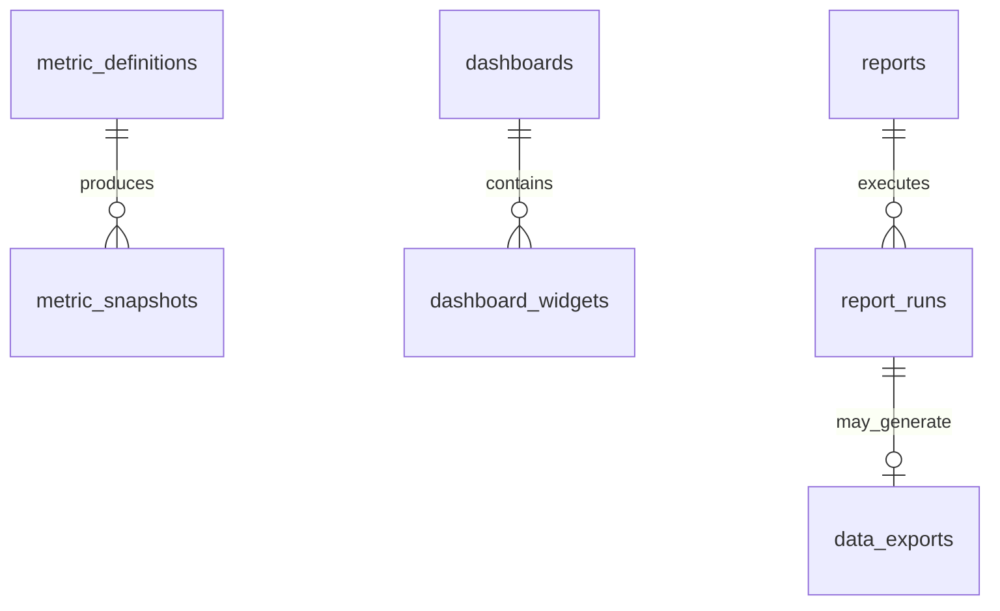

# Analytics Schema (`analytics`)

## Bounded Context

**Analytics** provides tenant-scoped business intelligence: metric definitions, time-series snapshots, customizable dashboards, scheduled reports, and data exports. Raw event streams live in Kafka/OpenSearch; this schema stores aggregated, queryable analytics state.

## Purpose

| Entity | Role |
|--------|------|
| `metric_definitions` | Canonical metric catalog with computation rules |
| `metric_snapshots` | Pre-aggregated time-series data points |
| `dashboards` | User/tenant dashboard configurations |
| `dashboard_widgets` | Individual visualization tiles |
| `reports` | Scheduled report definitions |
| `report_runs` | Report execution history |
| `data_exports` | Async export job tracking |

## Business Rules

1. **Metric immutability** — `metric_definitions.code` immutable after first snapshot; changes create new definition version.
2. **Snapshot granularity** — Supports `hour`, `day`, `week`, `month` rollups; no duplicate `(tenant, metric, period, granularity)`.
3. **Dashboard sharing** — Dashboards may be `private`, `team`, or `tenant` visibility.
4. **Report scheduling** — Cron expressions validated at insert; timezone-aware execution.
5. **Export TTL** — Completed exports expire after 7 days; S3 object lifecycle aligned.
6. **PII separation** — Aggregated metrics only; no raw PII in snapshots.
7. **Platform metrics** — Some `metric_definitions` are global (platform health); tenant metrics always scoped.

## Entity Relationship Diagram



---

## Tables

### `metric_definitions`

Global metric catalog.

```sql
CREATE TABLE analytics.metric_definitions (
    id                      UUID PRIMARY KEY DEFAULT gen_random_uuid(),
    code                    CITEXT NOT NULL,
    name                    TEXT NOT NULL,
    description             TEXT,
    category                TEXT NOT NULL,
    unit                    TEXT NOT NULL,
    aggregation_method      TEXT NOT NULL,
    value_type              TEXT NOT NULL DEFAULT 'numeric',
    computation_rule        JSONB NOT NULL,
    source_event_types      TEXT[] NOT NULL DEFAULT '{}',
    is_tenant_scoped        BOOLEAN NOT NULL DEFAULT true,
    is_active               BOOLEAN NOT NULL DEFAULT true,
    refresh_interval        TEXT NOT NULL DEFAULT 'hourly',
    retention_days          INTEGER NOT NULL DEFAULT 365,
    metadata                JSONB NOT NULL DEFAULT '{}',
    created_at              TIMESTAMPTZ NOT NULL DEFAULT now(),
    updated_at              TIMESTAMPTZ NOT NULL DEFAULT now(),
    version                 INTEGER NOT NULL DEFAULT 1,

    CONSTRAINT metric_definitions_pkey PRIMARY KEY (id),
    CONSTRAINT uq_metric_definitions_code UNIQUE (code),
    CONSTRAINT chk_metric_definitions_category
        CHECK (category IN ('sales', 'finance', 'support', 'hr', 'projects', 'marketing', 'platform', 'ai', 'custom')),
    CONSTRAINT chk_metric_definitions_aggregation
        CHECK (aggregation_method IN ('sum', 'avg', 'count', 'min', 'max', 'last', 'distinct_count')),
    CONSTRAINT chk_metric_definitions_value_type
        CHECK (value_type IN ('numeric', 'currency', 'percentage', 'duration', 'count')),
    CONSTRAINT chk_metric_definitions_refresh
        CHECK (refresh_interval IN ('realtime', 'hourly', 'daily', 'weekly'))
);

CREATE INDEX idx_metric_definitions_category
    ON analytics.metric_definitions (category)
    WHERE is_active = true;
```

**Example computation_rule:**

```json
{
  "type": "event_aggregation",
  "event": "commercial.order.confirmed.v1",
  "field": "payload.total_amount_cents",
  "filter": { "status": "confirmed" }
}
```

---

### `metric_snapshots`

Pre-computed metric values per tenant and time period. Partitioned by `period_start`.

```sql
CREATE TABLE analytics.metric_snapshots (
    id                      UUID NOT NULL DEFAULT gen_random_uuid(),
    tenant_id               UUID NOT NULL REFERENCES atlas_core.tenants(id),
    metric_definition_id    UUID NOT NULL REFERENCES analytics.metric_definitions(id),
    granularity             TEXT NOT NULL,
    period_start            TIMESTAMPTZ NOT NULL,
    period_end              TIMESTAMPTZ NOT NULL,
    value_numeric           NUMERIC(20,6),
    value_json              JSONB,
    dimensions              JSONB NOT NULL DEFAULT '{}',
    sample_count            BIGINT NOT NULL DEFAULT 1,
    computed_at             TIMESTAMPTZ NOT NULL DEFAULT now(),
    source                  TEXT NOT NULL DEFAULT 'aggregator',

    CONSTRAINT metric_snapshots_pkey PRIMARY KEY (id, period_start),
    CONSTRAINT chk_metric_snapshots_granularity
        CHECK (granularity IN ('hour', 'day', 'week', 'month', 'quarter', 'year')),
    CONSTRAINT chk_metric_snapshots_source
        CHECK (source IN ('aggregator', 'backfill', 'manual', 'import'))
) PARTITION BY RANGE (period_start);

CREATE UNIQUE INDEX uq_metric_snapshots_tenant_metric_period
    ON analytics.metric_snapshots (tenant_id, metric_definition_id, granularity, period_start, dimensions);

CREATE INDEX idx_metric_snapshots_tenant_metric_range
    ON analytics.metric_snapshots (tenant_id, metric_definition_id, period_start DESC);

CREATE INDEX idx_metric_snapshots_dimensions_gin
    ON analytics.metric_snapshots USING GIN (dimensions);
```

**Dimensions example:** `{ "pipeline_id": "...", "owner_id": "...", "region": "us-east" }`

---

### `dashboards`

Tenant dashboard configurations.

```sql
CREATE TABLE analytics.dashboards (
    id                      UUID PRIMARY KEY DEFAULT gen_random_uuid(),
    tenant_id               UUID NOT NULL REFERENCES atlas_core.tenants(id),
    owner_user_id           UUID NOT NULL REFERENCES atlas_core.users(id),
    name                    TEXT NOT NULL,
    description             TEXT,
    visibility              TEXT NOT NULL DEFAULT 'private',
    layout_config           JSONB NOT NULL DEFAULT '{}',
    filter_defaults         JSONB NOT NULL DEFAULT '{}',
    is_default              BOOLEAN NOT NULL DEFAULT false,
    is_system               BOOLEAN NOT NULL DEFAULT false,
    refresh_interval_sec    INTEGER NOT NULL DEFAULT 300,
    metadata                JSONB NOT NULL DEFAULT '{}',
    created_at              TIMESTAMPTZ NOT NULL DEFAULT now(),
    updated_at              TIMESTAMPTZ NOT NULL DEFAULT now(),
    deleted_at              TIMESTAMPTZ,
    created_by              UUID NOT NULL,
    updated_by              UUID,
    version                 INTEGER NOT NULL DEFAULT 1,

    CONSTRAINT dashboards_pkey PRIMARY KEY (id),
    CONSTRAINT chk_dashboards_visibility
        CHECK (visibility IN ('private', 'team', 'tenant', 'public')),
    CONSTRAINT chk_dashboards_refresh CHECK (refresh_interval_sec >= 60)
);

CREATE INDEX idx_dashboards_tenant_owner
    ON analytics.dashboards (tenant_id, owner_user_id)
    WHERE deleted_at IS NULL;

CREATE UNIQUE INDEX uq_dashboards_tenant_default
    ON analytics.dashboards (tenant_id, owner_user_id)
    WHERE deleted_at IS NULL AND is_default = true;
```

---

### `dashboard_widgets`

Individual visualization tiles on a dashboard.

```sql
CREATE TABLE analytics.dashboard_widgets (
    id                      UUID PRIMARY KEY DEFAULT gen_random_uuid(),
    tenant_id               UUID NOT NULL REFERENCES atlas_core.tenants(id),
    dashboard_id            UUID NOT NULL REFERENCES analytics.dashboards(id),
    metric_definition_id    UUID REFERENCES analytics.metric_definitions(id),
    widget_type             TEXT NOT NULL,
    title                   TEXT NOT NULL,
    position_x              SMALLINT NOT NULL DEFAULT 0,
    position_y              SMALLINT NOT NULL DEFAULT 0,
    width                   SMALLINT NOT NULL DEFAULT 4,
    height                  SMALLINT NOT NULL DEFAULT 3,
    query_config            JSONB NOT NULL DEFAULT '{}',
    visualization_config    JSONB NOT NULL DEFAULT '{}',
    display_order           INTEGER NOT NULL DEFAULT 0,
    created_at              TIMESTAMPTZ NOT NULL DEFAULT now(),
    updated_at              TIMESTAMPTZ NOT NULL DEFAULT now(),
    deleted_at              TIMESTAMPTZ,

    CONSTRAINT dashboard_widgets_pkey PRIMARY KEY (id),
    CONSTRAINT chk_dashboard_widgets_type
        CHECK (widget_type IN ('kpi', 'line_chart', 'bar_chart', 'pie_chart', 'table', 'funnel', 'gauge', 'map', 'text')),
    CONSTRAINT chk_dashboard_widgets_dimensions
        CHECK (width BETWEEN 1 AND 12 AND height BETWEEN 1 AND 12)
);

CREATE INDEX idx_dashboard_widgets_dashboard
    ON analytics.dashboard_widgets (dashboard_id, display_order)
    WHERE deleted_at IS NULL;
```

---

### `reports`

Scheduled report definitions.

```sql
CREATE TABLE analytics.reports (
    id                      UUID PRIMARY KEY DEFAULT gen_random_uuid(),
    tenant_id               UUID NOT NULL REFERENCES atlas_core.tenants(id),
    owner_user_id           UUID NOT NULL REFERENCES atlas_core.users(id),
    name                    TEXT NOT NULL,
    description             TEXT,
    report_type             TEXT NOT NULL,
    query_definition        JSONB NOT NULL,
    output_format           TEXT NOT NULL DEFAULT 'pdf',
    schedule_cron           TEXT,
    schedule_timezone       TEXT NOT NULL DEFAULT 'UTC',
    recipients              JSONB NOT NULL DEFAULT '[]',
    is_active               BOOLEAN NOT NULL DEFAULT true,
    last_run_at             TIMESTAMPTZ,
    next_run_at             TIMESTAMPTZ,
    metadata                JSONB NOT NULL DEFAULT '{}',
    created_at              TIMESTAMPTZ NOT NULL DEFAULT now(),
    updated_at              TIMESTAMPTZ NOT NULL DEFAULT now(),
    deleted_at              TIMESTAMPTZ,
    created_by              UUID NOT NULL,
    updated_by              UUID,
    version                 INTEGER NOT NULL DEFAULT 1,

    CONSTRAINT reports_pkey PRIMARY KEY (id),
    CONSTRAINT chk_reports_type
        CHECK (report_type IN ('standard', 'custom', 'compliance', 'executive')),
    CONSTRAINT chk_reports_output
        CHECK (output_format IN ('pdf', 'csv', 'xlsx', 'json'))
);

CREATE INDEX idx_reports_tenant_active
    ON analytics.reports (tenant_id)
    WHERE deleted_at IS NULL AND is_active = true;

CREATE INDEX idx_reports_next_run
    ON analytics.reports (next_run_at)
    WHERE deleted_at IS NULL AND is_active = true AND schedule_cron IS NOT NULL;
```

---

### `report_runs`

Report execution history.

```sql
CREATE TABLE analytics.report_runs (
    id                      UUID PRIMARY KEY DEFAULT gen_random_uuid(),
    tenant_id               UUID NOT NULL REFERENCES atlas_core.tenants(id),
    report_id               UUID NOT NULL REFERENCES analytics.reports(id),
    status                  TEXT NOT NULL DEFAULT 'pending',
    triggered_by            TEXT NOT NULL DEFAULT 'schedule',
    triggered_by_user_id    UUID REFERENCES atlas_core.users(id),
    started_at              TIMESTAMPTZ,
    completed_at            TIMESTAMPTZ,
    row_count               BIGINT,
    file_size_bytes         BIGINT,
    error_message           TEXT,
    parameters              JSONB NOT NULL DEFAULT '{}',
    data_export_id          UUID REFERENCES analytics.data_exports(id),
    created_at              TIMESTAMPTZ NOT NULL DEFAULT now(),

    CONSTRAINT report_runs_pkey PRIMARY KEY (id),
    CONSTRAINT chk_report_runs_status
        CHECK (status IN ('pending', 'running', 'completed', 'failed', 'canceled')),
    CONSTRAINT chk_report_runs_triggered_by
        CHECK (triggered_by IN ('schedule', 'manual', 'api', 'workflow'))
);

CREATE INDEX idx_report_runs_report
    ON analytics.report_runs (report_id, created_at DESC);

CREATE INDEX idx_report_runs_tenant_status
    ON analytics.report_runs (tenant_id, status)
    WHERE status IN ('pending', 'running');
```

---

### `data_exports`

Async data export job tracking.

```sql
CREATE TABLE analytics.data_exports (
    id                      UUID PRIMARY KEY DEFAULT gen_random_uuid(),
    tenant_id               UUID NOT NULL REFERENCES atlas_core.tenants(id),
    requested_by            UUID NOT NULL REFERENCES atlas_core.users(id),
    export_type             TEXT NOT NULL,
    entity_type             TEXT,
    query_filter            JSONB NOT NULL DEFAULT '{}',
    output_format           TEXT NOT NULL,
    status                  TEXT NOT NULL DEFAULT 'pending',
    row_count               BIGINT,
    file_size_bytes         BIGINT,
    bucket                  TEXT,
    object_key              TEXT,
    download_url            TEXT,
    expires_at              TIMESTAMPTZ,
    started_at              TIMESTAMPTZ,
    completed_at            TIMESTAMPTZ,
    error_message           TEXT,
    metadata                JSONB NOT NULL DEFAULT '{}',
    created_at              TIMESTAMPTZ NOT NULL DEFAULT now(),
    updated_at              TIMESTAMPTZ NOT NULL DEFAULT now(),

    CONSTRAINT data_exports_pkey PRIMARY KEY (id),
    CONSTRAINT chk_data_exports_type
        CHECK (export_type IN ('report', 'entity_dump', 'analytics', 'audit', 'custom')),
    CONSTRAINT chk_data_exports_format
        CHECK (output_format IN ('csv', 'xlsx', 'json', 'parquet', 'pdf')),
    CONSTRAINT chk_data_exports_status
        CHECK (status IN ('pending', 'processing', 'completed', 'failed', 'expired', 'canceled'))
);

CREATE INDEX idx_data_exports_tenant_user
    ON analytics.data_exports (tenant_id, requested_by, created_at DESC);

CREATE INDEX idx_data_exports_expires
    ON analytics.data_exports (expires_at)
    WHERE status = 'completed';
```

---

## RLS Policies

```sql
ALTER TABLE analytics.dashboards ENABLE ROW LEVEL SECURITY;
ALTER TABLE analytics.dashboards FORCE ROW LEVEL SECURITY;

CREATE POLICY tenant_isolation ON analytics.dashboards
    USING (tenant_id = current_setting('app.tenant_id', true)::uuid)
    WITH CHECK (tenant_id = current_setting('app.tenant_id', true)::uuid);

CREATE POLICY visibility_private ON analytics.dashboards
    FOR SELECT
    USING (
        visibility = 'tenant'
        OR owner_user_id = current_setting('app.user_id', true)::uuid
        OR visibility = 'team'  -- team membership checked in application layer
    );
```

## Soft Delete

`dashboards`, `dashboard_widgets`, `reports` use `deleted_at`. `metric_snapshots`, `report_runs`, `data_exports` are append-only.

## Audit Strategy

- Report/export of sensitive data → `atlas_audit.audit_log_entries`
- Domain events: `analytics.export.completed.v1`, `analytics.report.generated.v1`

## Migration Notes

| Migration | Description |
|-----------|-------------|
| `V190__create_analytics_schema.sql` | Schema creation |
| `V191__create_metric_definitions.sql` | Metric catalog + seed |
| `V192__create_metric_snapshots_partitioned.sql` | Partitioned snapshots |
| `V193__create_dashboards_widgets.sql` | Dashboards |
| `V194__create_reports_runs_exports.sql` | Reports + exports |
| `V195__create_analytics_rls.sql` | RLS policies |
| `R__analytics_seed_metrics.sql` | Core business metrics |

**Citus:** Distribute tenant-scoped tables by `tenant_id`. Reference: `metric_definitions`.

## Cross-References

- [prisma/models/analytics.prisma](../../prisma/models/analytics.prisma)