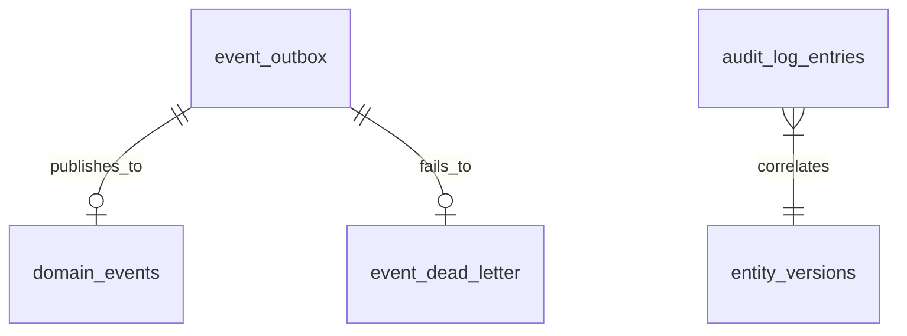

# Audit & Events Schema (`atlas_audit`)

## Bounded Context

**Audit & Events** provides compliance-grade audit logging, domain event storage, transactional outbox relay, dead-letter handling, and temporal entity versioning for point-in-time reconstruction. This schema is append-only and optimized for high write throughput.

## Purpose

| Entity | Role |
|--------|------|
| `audit_log_entries` | Immutable field-level change audit trail |
| `domain_events` | Published domain event archive |
| `event_outbox` | Transactional outbox for reliable publishing |
| `event_dead_letter` | Failed event processing queue |
| `entity_versions` | System-versioned temporal entity snapshots |

## Business Rules

1. **Immutability** — No UPDATE or DELETE on audit/event tables (except outbox `published_at` marker).
2. **Append-only audit** — `audit_log_entries` never modified; retention via partition drop.
3. **Outbox atomicity** — Outbox insert in same transaction as business mutation.
4. **At-least-once delivery** — Consumers must be idempotent; `event_id` deduplication.
5. **Dead letter threshold** — Events move to `event_dead_letter` after 10 publish attempts or 72h.
6. **Temporal validity** — `entity_versions.valid_to = 'infinity'` for current version; closed on update.
7. **Tenant isolation** — RLS on tenant-scoped rows; platform events use `tenant_id IS NULL`.

## Entity Relationship Diagram



---

## Tables

### `audit_log_entries`

Immutable compliance audit trail. Partitioned monthly by `occurred_at`.

```sql
CREATE TABLE atlas_audit.audit_log_entries (
    id                      BIGSERIAL,
    tenant_id               UUID,
    entity_type             TEXT NOT NULL,
    entity_id               UUID NOT NULL,
    action                  TEXT NOT NULL,
    actor_id                UUID,
    actor_type              TEXT NOT NULL DEFAULT 'user',
    changes                 JSONB,
    previous_state          JSONB,
    new_state               JSONB,
    metadata                JSONB NOT NULL DEFAULT '{}',
    correlation_id          TEXT,
    request_id              TEXT,
    ip_address              INET,
    user_agent              TEXT,
    occurred_at             TIMESTAMPTZ NOT NULL DEFAULT now(),

    CONSTRAINT audit_log_entries_pkey PRIMARY KEY (id, occurred_at),
    CONSTRAINT chk_audit_log_entries_action
        CHECK (action IN ('CREATE', 'UPDATE', 'DELETE', 'RESTORE', 'ACCESS', 'EXPORT', 'PERMISSION_CHANGE')),
    CONSTRAINT chk_audit_log_entries_actor_type
        CHECK (actor_type IN ('user', 'system', 'api_key', 'agent', 'workflow', 'platform_admin'))
) PARTITION BY RANGE (occurred_at);

CREATE INDEX idx_audit_log_entries_tenant_entity
    ON atlas_audit.audit_log_entries (tenant_id, entity_type, entity_id, occurred_at DESC);

CREATE INDEX idx_audit_log_entries_actor
    ON atlas_audit.audit_log_entries (tenant_id, actor_id, occurred_at DESC)
    WHERE actor_id IS NOT NULL;

CREATE INDEX idx_audit_log_entries_correlation
    ON atlas_audit.audit_log_entries (correlation_id)
    WHERE correlation_id IS NOT NULL;

CREATE INDEX idx_audit_log_entries_occurred
    ON atlas_audit.audit_log_entries (occurred_at DESC);
```

**Changes JSONB format:**

```json
{
  "status": { "old": "draft", "new": "open" },
  "total_cents": { "old": 10000, "new": 15000 }
}
```

**Retention:** 2 years hot; 7 years warm (archived partitions to S3 Parquet).

---

### `domain_events`

Archive of published domain events for replay and compliance.

```sql
CREATE TABLE atlas_audit.domain_events (
    id                      UUID NOT NULL DEFAULT gen_random_uuid(),
    tenant_id               UUID,
    event_type              TEXT NOT NULL,
    event_version           INTEGER NOT NULL DEFAULT 1,
    aggregate_type          TEXT NOT NULL,
    aggregate_id            UUID NOT NULL,
    payload                 JSONB NOT NULL,
    metadata                JSONB NOT NULL DEFAULT '{}',
    correlation_id          TEXT,
    causation_id            TEXT,
    actor_id                UUID,
    actor_type              TEXT NOT NULL DEFAULT 'system',
    occurred_at             TIMESTAMPTZ NOT NULL DEFAULT now(),
    published_at            TIMESTAMPTZ NOT NULL DEFAULT now(),
    sequence_number         BIGINT NOT NULL,

    CONSTRAINT domain_events_pkey PRIMARY KEY (id, occurred_at),
    CONSTRAINT chk_domain_events_actor_type
        CHECK (actor_type IN ('user', 'system', 'api_key', 'agent', 'workflow'))
) PARTITION BY RANGE (occurred_at);

CREATE INDEX idx_domain_events_tenant_aggregate
    ON atlas_audit.domain_events (tenant_id, aggregate_type, aggregate_id, occurred_at DESC);

CREATE INDEX idx_domain_events_type
    ON atlas_audit.domain_events (event_type, occurred_at DESC);

CREATE UNIQUE INDEX uq_domain_events_sequence
    ON atlas_audit.domain_events (tenant_id, aggregate_type, aggregate_id, sequence_number, occurred_at);
```

**Sequence:** Per-aggregate monotonic `sequence_number` for event sourcing projections.

---

### `event_outbox`

Transactional outbox for reliable Kafka/NATS publishing.

```sql
CREATE TABLE atlas_audit.event_outbox (
    id                      UUID PRIMARY KEY DEFAULT gen_random_uuid(),
    tenant_id               UUID,
    aggregate_type          TEXT NOT NULL,
    aggregate_id            UUID NOT NULL,
    event_type              TEXT NOT NULL,
    event_version           INTEGER NOT NULL DEFAULT 1,
    payload                 JSONB NOT NULL,
    metadata                JSONB NOT NULL DEFAULT '{}',
    correlation_id          TEXT,
    causation_id            TEXT,
    priority                SMALLINT NOT NULL DEFAULT 3,
    created_at              TIMESTAMPTZ NOT NULL DEFAULT now(),
    published_at            TIMESTAMPTZ,
    publish_attempts        INTEGER NOT NULL DEFAULT 0,
    last_attempt_at         TIMESTAMPTZ,
    last_error              TEXT,
    locked_by               TEXT,
    locked_at               TIMESTAMPTZ,

    CONSTRAINT event_outbox_pkey PRIMARY KEY (id),
    CONSTRAINT chk_event_outbox_priority CHECK (priority BETWEEN 1 AND 5)
);

CREATE INDEX idx_event_outbox_unpublished
    ON atlas_audit.event_outbox (created_at)
    WHERE published_at IS NULL;

CREATE INDEX idx_event_outbox_priority_unpublished
    ON atlas_audit.event_outbox (priority, created_at)
    WHERE published_at IS NULL;

CREATE INDEX idx_event_outbox_tenant_aggregate
    ON atlas_audit.event_outbox (tenant_id, aggregate_type, aggregate_id);
```

**Relay query:**

```sql
SELECT id FROM atlas_audit.event_outbox
WHERE published_at IS NULL
ORDER BY priority ASC, created_at ASC
LIMIT 1000
FOR UPDATE SKIP LOCKED;
```

---

### `event_dead_letter`

Failed events after exhausting retries.

```sql
CREATE TABLE atlas_audit.event_dead_letter (
    id                      UUID PRIMARY KEY DEFAULT gen_random_uuid(),
    tenant_id               UUID,
    source_table            TEXT NOT NULL,
    source_id               UUID NOT NULL,
    event_type              TEXT NOT NULL,
    payload                 JSONB NOT NULL,
    metadata                JSONB NOT NULL DEFAULT '{}',
    failure_reason          TEXT NOT NULL,
    failure_count           INTEGER NOT NULL DEFAULT 1,
    first_failed_at         TIMESTAMPTZ NOT NULL,
    last_failed_at          TIMESTAMPTZ NOT NULL DEFAULT now(),
    resolved_at             TIMESTAMPTZ,
    resolved_by             UUID,
    resolution_action       TEXT,
    created_at              TIMESTAMPTZ NOT NULL DEFAULT now(),

    CONSTRAINT event_dead_letter_pkey PRIMARY KEY (id),
    CONSTRAINT chk_event_dead_letter_source
        CHECK (source_table IN ('event_outbox', 'domain_events', 'webhook_delivery')),
    CONSTRAINT chk_event_dead_letter_resolution
        CHECK (resolution_action IS NULL OR resolution_action IN ('replayed', 'discarded', 'manual_fix'))
);

CREATE INDEX idx_event_dead_letter_unresolved
    ON atlas_audit.event_dead_letter (last_failed_at DESC)
    WHERE resolved_at IS NULL;

CREATE INDEX idx_event_dead_letter_tenant
    ON atlas_audit.event_dead_letter (tenant_id, event_type)
    WHERE resolved_at IS NULL;

CREATE UNIQUE INDEX uq_event_dead_letter_source
    ON atlas_audit.event_dead_letter (source_table, source_id)
    WHERE resolved_at IS NULL;
```

---

### `entity_versions`

System-versioned temporal table for point-in-time entity reconstruction.

```sql
CREATE TABLE atlas_audit.entity_versions (
    id                      UUID NOT NULL DEFAULT gen_random_uuid(),
    tenant_id               UUID NOT NULL,
    entity_type             TEXT NOT NULL,
    entity_id               UUID NOT NULL,
    version_number          INTEGER NOT NULL,
    valid_from              TIMESTAMPTZ NOT NULL DEFAULT now(),
    valid_to                TIMESTAMPTZ NOT NULL DEFAULT 'infinity',
    state                   JSONB NOT NULL,
    change_reason           TEXT,
    changed_by              UUID,
    changed_at              TIMESTAMPTZ NOT NULL DEFAULT now(),
    is_current              BOOLEAN NOT NULL DEFAULT true,

    CONSTRAINT entity_versions_pkey PRIMARY KEY (id, valid_from),
    CONSTRAINT chk_entity_versions_valid_range CHECK (valid_from < valid_to),
    CONSTRAINT chk_entity_versions_number CHECK (version_number >= 1)
);

CREATE UNIQUE INDEX uq_entity_versions_current
    ON atlas_audit.entity_versions (tenant_id, entity_type, entity_id)
    WHERE is_current = true;

CREATE INDEX idx_entity_versions_temporal
    ON atlas_audit.entity_versions (tenant_id, entity_type, entity_id, valid_from DESC);

CREATE INDEX idx_entity_versions_as_of
    ON atlas_audit.entity_versions (tenant_id, entity_type, entity_id, valid_from, valid_to);
```

**As-of query:**

```sql
SELECT state FROM atlas_audit.entity_versions
WHERE tenant_id = $1 AND entity_type = $2 AND entity_id = $3
  AND valid_from <= $as_of AND valid_to > $as_of;
```

**Trigger:** `atlas_audit.close_entity_version()` sets `valid_to = now()`, `is_current = false` on previous version when new version inserted.

**Eligible entities:** `subscription_plan`, `contract`, `tax_config`, `org_structure`, `pricing_rule`, `role_permission`.

---

## RLS Policies

```sql
ALTER TABLE atlas_audit.audit_log_entries ENABLE ROW LEVEL SECURITY;
ALTER TABLE atlas_audit.audit_log_entries FORCE ROW LEVEL SECURITY;

CREATE POLICY tenant_isolation ON atlas_audit.audit_log_entries
    FOR SELECT
    USING (
        tenant_id IS NULL
        OR tenant_id = current_setting('app.tenant_id', true)::uuid
    );

-- Platform admin bypass via atlas_platform_admin role (BYPASSRLS)
```

Tenant-scoped: `entity_versions`. Platform-wide read: `domain_events` (tenant-filtered), `event_outbox` (worker service account).

## Soft Delete

None. Append-only with partition-based retention and archival.

## Audit Strategy (Meta)

The audit schema **is** the audit system. Additional safeguards:

- Database triggers prevent UPDATE/DELETE on `audit_log_entries` and `domain_events`
- Platform admin access logged to separate `platform_admin_audit` (future)
- SOC 2 CC7.2 — audit log integrity verified via monthly checksum job

## Migration Notes

| Migration | Description |
|-----------|-------------|
| `V200__create_atlas_audit_schema.sql` | Schema creation |
| `V201__create_audit_log_entries_partitioned.sql` | Partitioned audit log |
| `V202__create_domain_events_partitioned.sql` | Domain events archive |
| `V203__create_event_outbox.sql` | Transactional outbox |
| `V204__create_event_dead_letter.sql` | Dead letter queue |
| `V205__create_entity_versions.sql` | Temporal versions + trigger |
| `V206__create_audit_immutability_triggers.sql` | Prevent mutation triggers |
| `R__audit_partition_maintenance.sql` | pg_partman config |

**Partitioning:** Monthly partitions for `audit_log_entries`, `domain_events`. Auto-create 3 months ahead.

**Citus:** `event_outbox` distributed by `tenant_id` (nullable → coordinator). `audit_log_entries` distributed by `tenant_id`.

## Cross-References

- [05-database-architecture.md](../architecture/phase-1/05-database-architecture.md)
- [ADR-0003-event-driven-kafka.md](../adr/ADR-0003-event-driven-kafka.md)
- [prisma/models/audit.prisma](../../prisma/models/audit.prisma)