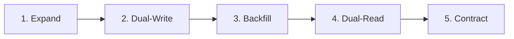
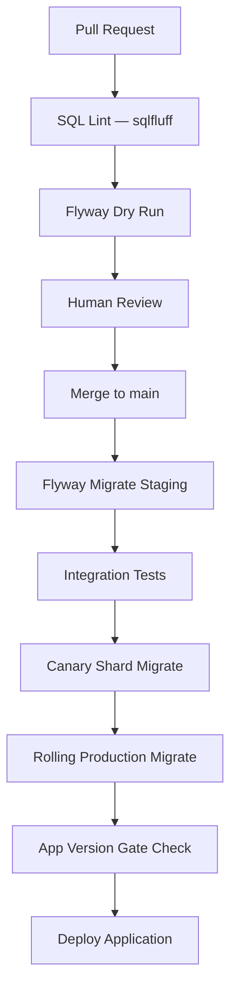

# Database Migration Strategy

## Purpose

Define the authoritative migration, versioning, seeding, and rollback strategy for Atlas BOS PostgreSQL schemas. All schema changes are forward-only SQL migrations managed by **Flyway**, with Prisma Client generated from the canonical schema for application access.

## Principles

| Principle | Rule |
|-----------|------|
| Forward-only | No `U__` undo migrations; corrective forward migrations only |
| Zero-downtime | Expand-contract pattern for breaking changes |
| Plain SQL | Migrations are reviewable `.sql` files in `db/migrations/` |
| Idempotent seeds | Repeatable migrations (`R__`) for reference data |
| Version gate | Application deploy blocked if DB version < required |
| Tenant parity | Enterprise schema-per-tenant stays in sync via orchestrator |

---

## Flyway Naming Convention

### Versioned Migrations (`V`)

```
V{version}__{description}.sql
```

| Component | Rule | Example |
|-----------|------|---------|
| Prefix | `V` (uppercase) | `V` |
| Version | Sequential integer, zero-padded to 3+ digits | `001`, `150`, `1200` |
| Separator | Double underscore `__` | `__` |
| Description | `snake_case`, verb-first | `create_contacts_table` |

**Examples:**

```
V001__create_atlas_core_schema.sql
V150__create_marketplace_schema.sql
V160__create_billing_schema.sql
V170__create_notifications_schema.sql
V180__create_storage_schema.sql
V190__create_analytics_schema.sql
V200__create_atlas_audit_schema.sql
V201__add_contacts_email_index_concurrently.sql
```

### Repeatable Migrations (`R`)

```
R__{description}.sql
```

Executed on every migrate when checksum changes. Used for:

- Reference data seeds (`R__billing_seed_plans.sql`)
- View/materialized view refresh (`R__refresh_reporting_views.sql`)
- RLS policy updates that are safe to re-apply

### Undo Migrations

**Not used.** Industry best practice for zero-downtime deployments. Rollback = deploy previous application version + forward corrective migration if schema advanced.

---

## Repository Structure

```
db/
├── migrations/
│   ├── V001__create_extensions.sql
│   ├── V002__create_atlas_core_schema.sql
│   ├── ...
│   ├── V150__create_marketplace_schema.sql
│   └── V2xx__create_audit_schema.sql
├── repeatable/
│   ├── R__seed_subscription_plans.sql
│   ├── R__seed_notification_channels.sql
│   ├── R__seed_metric_definitions.sql
│   └── R__seed_marketplace_first_party_apps.sql
├── callbacks/
│   ├── beforeMigrate.sql          -- SET statement_timeout, lock_timeout
│   └── afterMigrate.sql           -- ANALYZE, notify metrics
├── enterprise/
│   └── tenant_migration_orchestrator.yaml
└── seeds/
    ├── development/
    │   └── S001__dev_tenant_fixture.sql
    └── staging/
        └── S001__staging_smoke_data.sql
```

**Prisma (application ORM):**

```
prisma/
├── schema.prisma              -- Generator + datasource
└── models/
    ├── marketplace.prisma
    ├── billing.prisma
    ├── notifications.prisma
    ├── documents.prisma
    ├── analytics.prisma
    └── audit.prisma
```

Flyway is the **source of truth** for DDL. Prisma models mirror deployed schema; `prisma db pull` validates drift in CI.

---

## Version Numbering Scheme

| Range | Domain |
|-------|--------|
| `V001–V099` | Platform core (`atlas_core`) — tenants, users, workspaces |
| `V100–V149` | Identity, auth, authorization |
| `V150–V159` | Marketplace |
| `V160–V169` | Billing & subscription |
| `V170–V179` | Notifications |
| `V180–V189` | Documents & storage |
| `V190–V199` | Analytics |
| `V200–V219` | Audit & events |
| `V220–V299` | CRM, sales, finance modules |
| `V300+` | Additional bounded contexts |

Gap numbering reserved for insertions: `V153a` not allowed — use next integer.

---

## Expand-Contract Pattern

Zero-downtime schema evolution in five phases:



### Phase 1: Expand

Add new schema elements without breaking existing code.

```sql
-- V210__expand_contacts_add_normalized_email.sql
ALTER TABLE atlas_core.contacts
    ADD COLUMN normalized_email CITEXT;

CREATE INDEX CONCURRENTLY idx_contacts_normalized_email
    ON atlas_core.contacts (tenant_id, normalized_email)
    WHERE deleted_at IS NULL;
```

| Allowed | Prohibited |
|---------|------------|
| `ADD COLUMN` (nullable or with default) | `DROP COLUMN` |
| `CREATE TABLE` | `ALTER COLUMN TYPE` (in-place) |
| `CREATE INDEX CONCURRENTLY` | `ADD NOT NULL` without default on large tables |
| New tables, new FKs (nullable) | Table rewrites |

### Phase 2: Dual-Write

Application writes to both old and new columns/tables.

```typescript
// Application writes both fields during transition
await repo.update(contactId, {
  email: newEmail,
  normalizedEmail: normalize(newEmail), // dual-write
});
```

### Phase 3: Backfill

Background job populates new column for existing rows.

```sql
-- Batched backfill (application or SQL job)
UPDATE atlas_core.contacts
SET normalized_email = lower(trim(email))
WHERE normalized_email IS NULL
  AND id > $cursor
LIMIT 10000;
```

### Phase 4: Dual-Read

Application reads from new column, falls back to old.

### Phase 5: Contract

Remove old column after verification gate.

```sql
-- V215__contract_contacts_drop_email_display.sql
-- Precondition: monitoring confirms 0 reads of old column for 7 days
ALTER TABLE atlas_core.contacts DROP COLUMN email_display;
```

---

## Zero-Downtime Rules

### Lock Time Budget

| Operation | Max Lock Hold | Technique |
|-----------|---------------|-----------|
| Add column (nullable) | < 1s | Standard `ALTER` |
| Add column (NOT NULL) | < 1s | Add nullable → backfill → `SET NOT NULL` |
| Create index | 0 (no lock) | `CREATE INDEX CONCURRENTLY` |
| Drop index | 0 | `DROP INDEX CONCURRENTLY` |
| Add FK | < 1s | `NOT VALID` → `VALIDATE CONSTRAINT` |
| Table rewrite | Prohibited | New table + copy + swap |

### Prohibited Operations (Production)

- `DROP COLUMN` without expand-contract
- `ALTER COLUMN ... TYPE` on tables > 1M rows
- `ADD CONSTRAINT ... NOT NULL` without backfill on large tables
- Non-concurrent index creation on tables > 100K rows
- `LOCK TABLE` in migrations
- `TRUNCATE` without maintenance window approval

### Safe FK Addition

```sql
ALTER TABLE billing.subscriptions
    ADD CONSTRAINT fk_subscriptions_plan
    FOREIGN KEY (subscription_plan_id)
    REFERENCES billing.subscription_plans(id)
    NOT VALID;

ALTER TABLE billing.subscriptions
    VALIDATE CONSTRAINT fk_subscriptions_plan;
```

---

## Rollback Strategy

Flyway does not support automatic rollback. Atlas uses **application-level rollback**:

```
┌──────────────┐     ┌──────────────────┐     ┌─────────────────────┐
│ Detect issue │────▶│ Rollback app to  │────▶│ Forward corrective  │
│ (monitoring) │     │ previous version │     │ migration if needed │
└──────────────┘     └──────────────────┘     └─────────────────────┘
```

| Scenario | Action |
|----------|--------|
| App bug, schema unchanged | Rollback deployment only |
| Bad migration (caught in staging) | Fix migration file before prod apply |
| Bad migration (applied to prod) | Forward migration `V2xx__fix_...sql` |
| Data corruption | Point-in-time recovery (see DR doc) |

**Corrective migration example:**

```sql
-- V216__fix_contacts_normalized_email_backfill.sql
UPDATE atlas_core.contacts
SET normalized_email = lower(trim(email))
WHERE normalized_email IS NULL;
```

---

## Seeding Strategy

### Seed Categories

| Type | File Pattern | When Applied | Idempotent |
|------|--------------|--------------|------------|
| Reference data | `R__seed_*.sql` | Every migrate (checksum change) | Yes (`ON CONFLICT`) |
| Environment fixtures | `seeds/{env}/S*.sql` | Manual / CI setup | Per-environment |
| Test fixtures | Code factories | Unit/integration tests | N/A |

### Reference Data Seeds

```sql
-- R__seed_subscription_plans.sql
INSERT INTO billing.subscription_plans (
    id, code, name, tier, billing_interval,
    base_amount_cents, currency, stripe_product_id, stripe_price_id
) VALUES
    (gen_random_uuid(), 'starter_monthly', 'Starter', 'starter', 'month',
     2900, 'USD', 'prod_xxx', 'price_xxx'),
    (gen_random_uuid(), 'business_monthly', 'Business', 'business', 'month',
     9900, 'USD', 'prod_yyy', 'price_yyy')
ON CONFLICT (code) DO UPDATE SET
    updated_at = now(),
    is_active = EXCLUDED.is_active;
```

### Development Fixtures

- **Never** in production migration path
- Applied via `make seed-dev` → `psql -f db/seeds/development/`
- Synthetic tenant `00000000-0000-4000-8000-000000000001` with sample data

### Seeding Rules

| Rule | Description |
|------|-------------|
| S1 | All seeds idempotent (`ON CONFLICT DO NOTHING/UPDATE`) |
| S2 | No PII in committed seed files |
| S3 | Stripe IDs from test mode only in seeds |
| S4 | Seed order: global reference → tenant fixtures |
| S5 | Repeatable migrations for data that evolves with schema |

---

## Schema Versioning

### Version Gate

Application health check verifies:

```sql
SELECT MAX(version) FROM flyway_schema_history WHERE success = true;
-- Must be >= ATLAS_REQUIRED_MIGRATION_VERSION (env var)
```

Deploy pipeline:

```
CI lint → Staging migrate → Integration tests → Canary migrate → Production rolling migrate
```

### Flyway Configuration

```properties
flyway.url=jdbc:postgresql://${ATLAS_DB_HOST}:${ATLAS_DB_PORT}/${ATLAS_DB_NAME}
flyway.user=atlas_migration
flyway.password=${ATLAS_DB_MIGRATION_PASSWORD}
flyway.schemas=atlas_core,marketplace,billing,notifications,storage,analytics,atlas_audit
flyway.locations=filesystem:db/migrations,filesystem:db/repeatable
flyway.validateOnMigrate=true
flyway.outOfOrder=false
flyway.baselineOnMigrate=false
flyway.connectRetries=3
flyway.lockRetryCount=10
```

### Multi-Schema Enterprise Tenants

```sql
CREATE TABLE atlas_core.tenant_schema_versions (
    tenant_id         UUID PRIMARY KEY REFERENCES atlas_core.tenants(id),
    current_version   INTEGER NOT NULL,
    target_version    INTEGER NOT NULL,
    last_migrated_at  TIMESTAMPTZ,
    status            TEXT NOT NULL DEFAULT 'current',
    error_message     TEXT,
    CONSTRAINT chk_tenant_schema_status
        CHECK (status IN ('current', 'migrating', 'failed', 'behind'))
);
```

Orchestrator applies migrations to `tenant_<uuid>` schemas in batches of 50/hour.

---

## Prisma Integration

| Concern | Approach |
|---------|----------|
| DDL authority | Flyway SQL migrations |
| Application types | Prisma Client generated from `prisma/models/*.prisma` |
| Drift detection | CI: `prisma migrate diff` against live staging schema |
| Multi-schema | `multiSchema` preview; `@@schema("billing")` per model |
| Migrations | **Do not** use `prisma migrate` for production DDL |

```bash
# Validate Prisma schema matches database
npx prisma validate
npx prisma generate
npx prisma db pull --force  # Compare in CI; fail on unexpected drift
```

---

## Index Migration Checklist

1. Create index in migration: `CREATE INDEX CONCURRENTLY IF NOT EXISTS ...`
2. Flyway transaction: `SET flyway.postgresql.transactional.lock=false` for concurrent index migrations
3. Verify index used: `EXPLAIN` on representative queries
4. Drop old index in separate migration after 7-day soak

---

## Partition Management

Tables partitioned by time (`audit_log_entries`, `domain_events`, `usage_records`, `metric_snapshots`, `notification_deliveries`):

```sql
-- pg_partman extension
SELECT partman.create_parent(
    p_parent_table := 'atlas_audit.audit_log_entries',
    p_control := 'occurred_at',
    p_type := 'range',
    p_interval := 'monthly',
    p_premake := 3
);
```

Retention job drops partitions past retention policy (not `DELETE`).

---

## CI/CD Pipeline



### Migration Review Checklist

- [ ] Zero-downtime compatible?
- [ ] `CONCURRENTLY` for indexes on large tables?
- [ ] RLS policies included for new tenant-scoped tables?
- [ ] Audit columns present?
- [ ] Citus distribution key (`tenant_id`) noted?
- [ ] Prisma models updated?
- [ ] Repeatable seeds updated if reference data changed?
- [ ] Rollback plan documented in PR description?

---

## Monitoring & Alerts

| Metric | Alert Threshold |
|--------|-----------------|
| Migration duration | > 60s per migration |
| Flyway failed migration | Any failure |
| Schema version lag (enterprise) | > 5 versions behind |
| Outbox unpublished backlog | > 10K rows for 15 min |
| Dead letter queue depth | > 100 unresolved |

---

## Cross-References

- [05-database-architecture.md](../architecture/phase-1/05-database-architecture.md) — Architecture decisions
- [naming-standards.md](../standards/naming-standards.md) — Naming conventions
- [Flyway Documentation](https://flywaydb.org/documentation/)