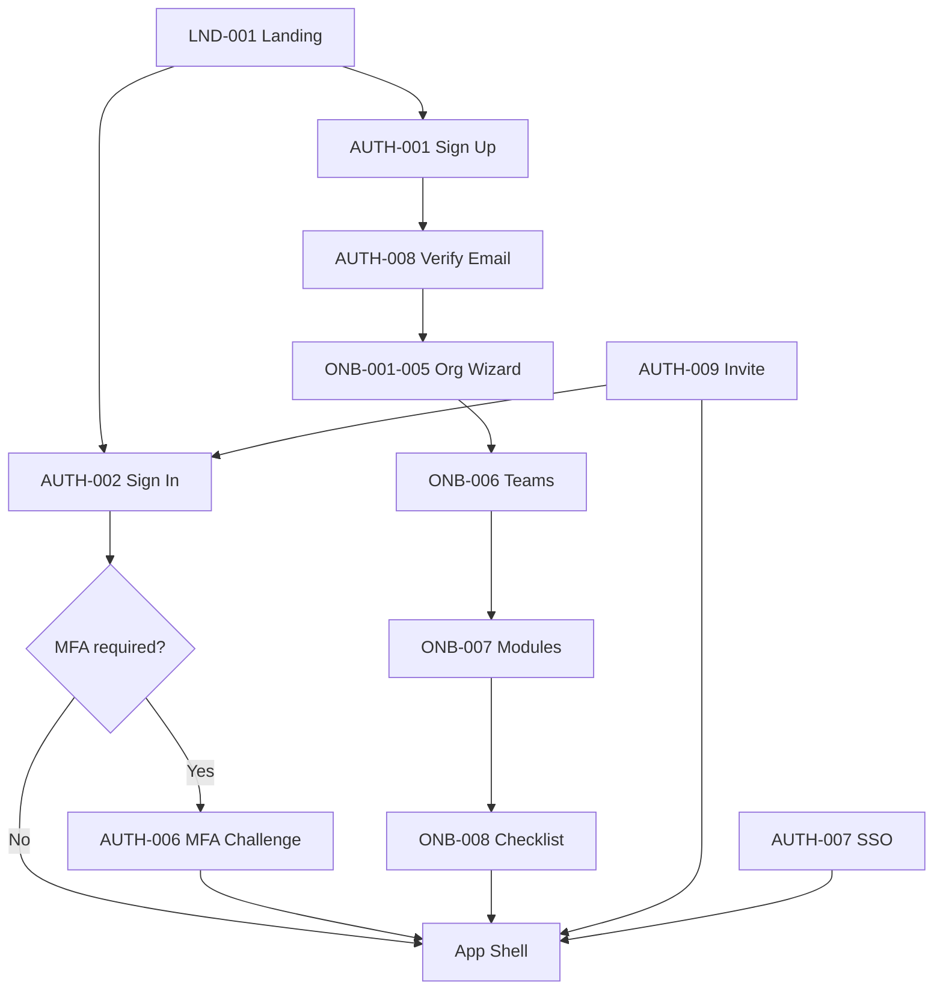

# Atlas Authentication & Onboarding UI

## Purpose

Specify every unauthenticated and onboarding screen, modal, validation state, and responsive layout for user acquisition, identity verification, organization provisioning, and first-value activation.

## Shared Auth Layout

All `/auth/*` and `/onboarding/*` routes use `<AuthLayout />`:

```
Desktop/Tablet:
┌────────────────────────────────────────────────────────────┐
│  LEFT PANEL (40%)          │  RIGHT PANEL (60%)            │
│  Brand + value prop        │  Form / wizard content        │
│  Testimonial carousel      │  Max-width 440px centered     │
│  (hidden on mobile)        │                               │
└────────────────────────────────────────────────────────────┘

Mobile:
┌─────────────────────────┐
│  [Atlas Logo]           │
│  Form content (100%)    │
│  Footer links           │
└─────────────────────────┘
```

**Components:** `<AuthLayout />`, `<AuthCard />`, `<SocialLoginButtons />`, `<PasswordStrengthMeter />`, `<StepIndicator />`

---

## LND-001: Marketing Landing

| Field | Value |
|-------|-------|
| **Screen ID** | LND-001 |
| **Route** | `/` |
| **Purpose** | Public marketing page; drive sign-up conversion |
| **Personas** | Prospective P1, P2 |
| **Tier** | Public |

#### Wireframe (Desktop)

```
┌──────────────────────────────────────────────────────────────┐
│ [Logo]  Product  Pricing  Modules  Docs    [Sign in] [Start] │
├──────────────────────────────────────────────────────────────┤
│                                                              │
│     The operating system for your business                   │
│     CRM, Finance, Projects, AI — unified.                    │
│              [Start free trial]  [Book demo]                 │
│                                                              │
├──────────────────────────────────────────────────────────────┤
│  [Module icons grid: 17 modules]                             │
├──────────────────────────────────────────────────────────────┤
│  Pricing tiers: Starter | Growth | Business | Enterprise     │
├──────────────────────────────────────────────────────────────┤
│  Footer: Legal, Privacy, Security, Status                    │
└──────────────────────────────────────────────────────────────┘
```

#### Components

- `<MarketingHeader />`, `<Hero />`, `<ModuleGrid />`, `<PricingTable />`, `<Footer />`
- `<Button variant="primary" />`, `<Button variant="secondary" />`

#### Actions & Permissions

| Action | Control | Permission | Notes |
|--------|---------|------------|-------|
| Start free trial | Hero CTA | — | → `/auth/signup` |
| Sign in | Header | — | → `/auth/signin` |
| Book demo | Hero secondary | — | External Calendly |
| View pricing | Nav / section | — | Anchor scroll |

#### States

| State | Behavior |
|-------|----------|
| Default | Static content |
| Authenticated visit | Redirect to `/app/{lastOrg}` |

#### Mobile Variant

Hamburger nav; stacked hero; horizontal scroll pricing cards; sticky bottom CTA bar "Start free trial".

#### Tablet Variant

2-column module grid; full pricing table.

#### Related Modals

None.

---

## AUTH-001: Sign Up

| Field | Value |
|-------|-------|
| **Screen ID** | AUTH-001 |
| **Route** | `/auth/signup` |
| **Purpose** | Create new user account |
| **Tier** | Public |

#### Wireframe

```
┌─────────────────────────────────┐
│  Create your Atlas account      │
│                                 │
│  [Continue with Google    ]     │
│  [Continue with Microsoft ]     │
│  ─────── or email ───────       │
│  Work email    [____________]   │
│  Password      [____________]   │
│  [████████░░] Strength: Good    │
│  ☐ I agree to Terms & Privacy   │
│  [Create account]               │
│  Already have an account? Sign in│
└─────────────────────────────────┘
```

#### Components

- `<AuthCard />`, `<Input />`, `<PasswordStrengthMeter />`, `<Checkbox />`, `<SocialLoginButtons />`, `<Button />`

#### Actions & Permissions

| Action | Control | Permission |
|--------|---------|------------|
| Create account | Submit | — |
| Google OAuth | Social button | — |
| Microsoft OAuth | Social button | — |
| Sign in link | Text link | — |

#### Validation States

| Field | Rule | Error Message |
|-------|------|---------------|
| Email | Valid email format | "Enter a valid email address" |
| Email | Not disposable domain | "Please use a work email address" |
| Email | Unique (on submit) | Generic: "Check your email to continue" (no enumeration) |
| Password | Min 12 chars | "Password must be at least 12 characters" |
| Password | Not in HIBP breach | "This password appeared in a data breach" |
| Password | Not in blocklist | "Choose a less common password" |
| Terms | Must be checked | "You must accept the Terms of Service" |

#### Form States

| State | UI |
|-------|-----|
| Pristine | Submit disabled until valid |
| Submitting | Button loading; fields disabled |
| Success | Redirect to AUTH-008 (verify email) or ONB-001 if social pre-verified |
| Error (network) | Banner: "Unable to connect. Try again." |
| Rate limited | "Too many attempts. Wait {n} minutes." |

#### Mobile Variant

Social buttons full-width stacked; password strength below field; keyboard pushes CTA into view.

#### Tablet Variant

Same as desktop right panel; left brand panel visible.

#### Related Modals

- **AUTH-001-M01: Social Account Link Confirm** — When Google email matches existing password account.

```
┌─────────────────────────────────────┐
│  Link your Google account?          │
│  An account exists for {email}.     │
│  Sign in with password to link.     │
│  [Sign in to link]  [Cancel]        │
└─────────────────────────────────────┘
```

---

## AUTH-002: Sign In

| Field | Value |
|-------|-------|
| **Screen ID** | AUTH-002 |
| **Route** | `/auth/signin` |
| **Purpose** | Authenticate returning users |
| **Tier** | Public |

#### Wireframe

```
┌─────────────────────────────────┐
│  Welcome back                   │
│  [Continue with Google    ]     │
│  [Continue with Microsoft ]     │
│  [Sign in with passkey  🔑]     │
│  ─────── or email ───────       │
│  Email         [____________]   │
│  Password      [____________]   │
│  Forgot password?               │
│  [Sign in]                      │
│  Don't have an account? Sign up │
└─────────────────────────────────┘
```

#### Components

- `<AuthCard />`, `<Input />`, `<SocialLoginButtons />`, `<PasskeyButton />`, `<Button />`

#### Actions & Permissions

| Action | Control | Notes |
|--------|---------|-------|
| Sign in | Submit | → MFA challenge if required |
| Passkey sign-in | WebAuthn button | Conditional UI autofill when supported |
| Forgot password | Link | → AUTH-003 |
| SSO auto-detect | On email blur | Domain lookup → AUTH-002-M01 |

#### Validation States

| Field | Rule | Error Message |
|-------|------|---------------|
| Email | Required | "Email is required" |
| Password | Required | "Password is required" |
| Credentials | Invalid | "Invalid email or password" (generic) |
| Account locked | 5+ failures | "Account temporarily locked. Try again in {n} minutes." |
| SSO enforced | Tenant policy | Redirect to AUTH-007; hide password fields |

#### Form States

| State | UI |
|-------|-----|
| SSO domain detected | Password fields hidden; show "Continue with SSO" |
| MFA required | Redirect AUTH-006 |
| Success | Redirect to `returnUrl` or `/app/{org}` |
| Session exists | Redirect to app immediately |

#### Mobile Variant

Passkey button prominent on supported devices; biometric prompt native.

#### Tablet Variant

Same as desktop.

#### Related Modals

- **AUTH-002-M01: SSO Domain Detected**

```
┌─────────────────────────────────────┐
│  SSO required for @{domain}         │
│  Your organization uses single      │
│  sign-on.                           │
│  [Continue with SSO]  [Use another] │
└─────────────────────────────────────┘
```

---

## AUTH-003: Forgot Password

| Field | Value |
|-------|-------|
| **Screen ID** | AUTH-003 |
| **Route** | `/auth/forgot-password` |
| **Purpose** | Initiate password reset email |
| **Tier** | Public |

#### Wireframe

```
┌─────────────────────────────────┐
│  Reset your password            │
│  Enter your email and we'll     │
│  send a reset link.             │
│  Email    [________________]    │
│  [Send reset link]              │
│  ← Back to sign in              │
└─────────────────────────────────┘
```

#### Validation

| Field | Rule | Error |
|-------|------|-------|
| Email | Valid format | "Enter a valid email" |

#### States

| State | UI |
|-------|-----|
| Submitted | Success screen (always, anti-enumeration): "If an account exists, we sent a link to {email}" |
| Rate limited | "Too many requests. Try again later." |

#### Mobile / Tablet

Single column; same layout.

#### Related Modals

None.

---

## AUTH-004: Reset Password

| Field | Value |
|-------|-------|
| **Screen ID** | AUTH-004 |
| **Route** | `/auth/reset-password?token={token}` |
| **Purpose** | Set new password via email token |
| **Tier** | Public |

#### Wireframe

```
┌─────────────────────────────────┐
│  Set a new password             │
│  New password  [____________]   │
│  Confirm       [____________]   │
│  [████████████] Strong          │
│  [Reset password]               │
└─────────────────────────────────┘
```

#### Validation

| Field | Rule | Error |
|-------|------|-------|
| Password | Min 12, HIBP, blocklist | Same as AUTH-001 |
| Confirm | Must match | "Passwords do not match" |
| Token | Valid, not expired | Full-page error: "Link expired" + CTA to AUTH-003 |

#### States

| State | UI |
|-------|-----|
| Invalid token | Error page with illustration |
| Success | Toast + redirect AUTH-002: "Password updated. Sign in." |
| Success side effect | All sessions revoked (mention in copy) |

#### Mobile / Tablet

Same layout.

#### Related Modals

None.

---

## AUTH-005: MFA Setup

| Field | Value |
|-------|-------|
| **Screen ID** | AUTH-005 |
| **Route** | `/auth/mfa/setup` |
| **Purpose** | Enroll MFA during onboarding or settings |
| **Tier** | All (required Business+ per policy) |

#### Wireframe

```
┌─────────────────────────────────┐
│  Secure your account            │
│  Step 1 of 2: Choose method     │
│                                 │
│  ○ Passkey (recommended) 🔑       │
│    Face ID, Touch ID, security  │
│    key                          │
│  ○ Authenticator app            │
│  ○ SMS (backup only)            │
│                                 │
│  [Continue]        [Skip for now]│
└─────────────────────────────────┘
```

**TOTP sub-step:**

```
│  Scan QR code    [QR IMAGE]     │
│  Or enter key: JBSWY3DPEHPK3PXP │
│  Verification code [______]     │
```

#### Components

- `<StepIndicator />`, `<RadioGroup />`, `<QRCode />`, `<Input />`, `<WebAuthnPrompt />`

#### Actions

| Action | Control | Notes |
|--------|---------|-------|
| Register passkey | WebAuthn | Preferred path |
| Setup TOTP | QR + verify | 6-digit code |
| Setup SMS | Phone input + OTP | Backup only |
| Skip | Secondary button | Hidden if tenant `mfa_required=true` |

#### Validation

| Field | Rule | Error |
|-------|------|-------|
| TOTP code | 6 digits, valid | "Invalid code. Try again." |
| SMS phone | E.164 format | "Enter a valid phone number" |

#### States

| State | UI |
|-------|-----|
| Success | Show AUTH-005-M01 recovery codes → continue onboarding |
| WebAuthn unsupported | Auto-select TOTP; info banner |

#### Mobile Variant

Passkey uses device biometrics; QR shown with "Can't scan?" manual key expander.

#### Tablet Variant

QR and instructions side-by-side.

#### Related Modals

- **AUTH-005-M01: Recovery Codes Display** (blocking until acknowledged)

```
┌─────────────────────────────────────┐
│  ⚠️ Save your recovery codes        │
│  ┌─────────────────────────────┐   │
│  │ ABCD-1234  EFGH-5678        │   │
│  │ ...                         │   │
│  └─────────────────────────────┘   │
│  [Copy] [Download]                  │
│  ☐ I have saved these codes         │
│  [Continue] (disabled until checked)│
└─────────────────────────────────────┘
```

---

## AUTH-006: MFA Challenge

| Field | Value |
|-------|-------|
| **Screen ID** | AUTH-006 |
| **Route** | `/auth/mfa/challenge` |
| **Purpose** | Verify second factor at login |
| **Tier** | All enrolled users |

#### Wireframe

```
┌─────────────────────────────────┐
│  Verify it's you                │
│  [Use passkey]                  │
│  ─── or enter code ───          │
│  Code from authenticator        │
│  [______]                       │
│  [Verify]                       │
│  Use recovery code · Try SMS    │
└─────────────────────────────────┘
```

#### Validation

| Field | Rule | Error |
|-------|------|-------|
| TOTP | 6 digits | "Invalid code" |
| Recovery code | Single-use match | "Invalid or used recovery code" |
| Attempts | 5 failures | Lock 15 min |

#### States

| State | UI |
|-------|-----|
| Partial session expired | Redirect AUTH-002 with message |
| Success | Issue full session → app |
| Remember device | AUTH-006-M01 checkbox after success |

#### Mobile / Tablet

Passkey first; auto-trigger WebAuthn on page load if available.

#### Related Modals

- **AUTH-006-M01: Remember Device**

```
☐ Trust this device for 30 days
```

Shown inline below verify button (not separate modal).

---

## AUTH-007: SSO Redirect / SAML

| Field | Value |
|-------|-------|
| **Screen ID** | AUTH-007 |
| **Route** | `/auth/sso`, `/auth/sso/{tenantSlug}`, `/saml/{tenant}/acs` |
| **Purpose** | Enterprise SSO handoff and callback |
| **Tier** | Enterprise / Business SSO |

#### Wireframe (Entry)

```
┌─────────────────────────────────┐
│  Sign in with SSO               │
│  Work email  [________________] │
│  [Continue]                     │
│  ← Other sign-in options        │
└─────────────────────────────────┘
```

#### Wireframe (Redirect State)

```
┌─────────────────────────────────┐
│  [Spinner]                      │
│  Redirecting to your identity   │
│  provider...                    │
└─────────────────────────────────┘
```

#### States

| State | UI |
|-------|-----|
| Redirecting | Spinner + message (no user action) |
| SAML error | "SSO failed: {reason}" + support link + retry |
| JIT provisioning | Create user → assign default role → onboarding |
| Success | Redirect to app or ONB-001 if new user |

#### Mobile / Tablet

Same; external IdP may have own responsive UI.

#### Related Modals

None.

---

## AUTH-008: Email Verification

| Field | Value |
|-------|-------|
| **Screen ID** | AUTH-008 |
| **Route** | `/auth/verify-email`, `/auth/verify-email?token={token}` |
| **Purpose** | Confirm email ownership |
| **Tier** | All new registrations |

#### Wireframe (Pending)

```
┌─────────────────────────────────┐
│  ✉️ Verify your email           │
│  We sent a link to {email}      │
│  [Resend email]  [Change email] │
│  Wrong inbox? Check spam.         │
└─────────────────────────────────┘
```

#### Wireframe (Success)

```
┌─────────────────────────────────┐
│  ✓ Email verified               │
│  [Continue to Atlas →]          │
└─────────────────────────────────┘
```

#### Actions

| Action | Control | Rate limit |
|--------|---------|------------|
| Resend | Button | 1 per 60 seconds |
| Change email | Link | Requires re-entry + re-send |
| Continue | Button | → ONB-001 |

#### States

| State | UI |
|-------|-----|
| Token invalid/expired | Error + resend CTA |
| Already verified | Auto-redirect ONB-001 |

#### Mobile / Tablet

Same.

#### Related Modals

None.

---

## AUTH-009: Invite Accept

| Field | Value |
|-------|-------|
| **Screen ID** | AUTH-009 |
| **Route** | `/auth/invite/{token}` |
| **Purpose** | Accept organization invitation |
| **Tier** | Invited users |

#### Wireframe (Authenticated)

```
┌─────────────────────────────────┐
│  Join {Org Name}                │
│  {Inviter} invited you to       │
│  {Team Name} as {Role}          │
│  [Accept invitation]            │
│  [Decline]                      │
└─────────────────────────────────┘
```

#### Wireframe (Unauthenticated)

```
┌─────────────────────────────────┐
│  Join {Org Name} on Atlas       │
│  Create account or sign in to   │
│  accept.                        │
│  [Create account]  [Sign in]    │
└─────────────────────────────────┘
```

#### Actions

| Action | Control | Permission |
|--------|---------|------------|
| Accept | Primary button | Valid token |
| Decline | Secondary | — |

#### States

| State | UI |
|-------|-----|
| Expired token | AUTH-009-M01 |
| Already member | "You're already a member" → app |
| Success | Toast + redirect `/app/{org}` |
| Wrong email | "Sign in as {invited_email}" |

#### Mobile / Tablet

Same card layout.

#### Related Modals

- **AUTH-009-M01: Invite Expired**

```
┌─────────────────────────────────────┐
│  Invitation expired                 │
│  Ask {inviter} to send a new invite.│
│  [Request new invite]  [Go home]    │
└─────────────────────────────────────┘
```

---

## AUTH-010: OAuth Consent

| Field | Value |
|-------|-------|
| **Screen ID** | AUTH-010 |
| **Route** | `/oauth/authorize` |
| **Purpose** | Third-party app authorization consent |
| **Tier** | Authenticated users |

#### Wireframe

```
┌─────────────────────────────────┐
│  [App Icon] ERP Connector         │
│  wants to access your Atlas       │
│  account                          │
│  This app will be able to:        │
│  ✓ Read contacts                  │
│  ✓ Read and write invoices        │
│  Org: Acme US Inc. ▾              │
│  [Authorize]  [Deny]              │
└─────────────────────────────────┘
```

#### Actions

| Action | Permission |
|--------|------------|
| Authorize | User must hold requested scopes |
| Deny | — |

Elevated `admin:*` scopes require org admin role; show approval workflow banner if non-admin.

#### Mobile / Tablet

Full-screen card.

---

## AUTH-011: Session Expired

| Field | Value |
|-------|-------|
| **Screen ID** | AUTH-011 |
| **Route** | `/auth/session-expired` |
| **Purpose** | Inform user session ended; prompt re-auth |
| **Tier** | All |

#### Wireframe

```
┌─────────────────────────────────┐
│  Session expired                │
│  Sign in again to continue.       │
│  [Sign in]                      │
└─────────────────────────────────┘
```

Preserves `returnUrl` query param.

---

## ONB-001 – ONB-005: Organization Creation Wizard

Five-step wizard with persistent `<StepIndicator steps={5} />`. Progress saved to `onboarding_state` server-side.

### ONB-001: Step 1 — Your Profile

| Field | Value |
|-------|-------|
| **Route** | `/onboarding/org/1` |
| **Purpose** | Collect user display name and avatar |

#### Wireframe

```
│  Step 1 of 5: Your profile      │
│  [Avatar upload]                │
│  First name  [________]         │
│  Last name   [________]         │
│  [Continue]                     │
```

#### Validation

| Field | Rule | Error |
|-------|------|-------|
| First name | 1–50 chars | Required |
| Last name | 1–50 chars | Required |
| Avatar | Optional; max 5MB; jpg/png | "Image too large" |

---

### ONB-002: Step 2 — Company Details

| Field | Value |
|-------|-------|
| **Route** | `/onboarding/org/2` |
| **Purpose** | Organization name and legal entity setup |

#### Wireframe

```
│  Step 2 of 5: Your company      │
│  Company name [______________]  │
│  URL slug     [acme-inc    ] ✓  │
│  Country      [United States ▾] │
│  Timezone     [Auto-detected ▾] │
│  [← Back]  [Continue]           │
```

#### Validation

| Field | Rule | Error |
|-------|------|-------|
| Company name | 2–100 chars | Required |
| Slug | Unique, lowercase, hyphenated | "Slug taken" / "Invalid characters" |
| Country | ISO country | Required for data residency hint |

---

### ONB-003: Step 3 — Industry

| Field | Value |
|-------|-------|
| **Route** | `/onboarding/org/3` |
| **Purpose** | Industry selection for templates and defaults |

#### Wireframe

```
│  Step 3 of 5: Industry          │
│  [Grid of industry cards]         │
│  Professional Services | Retail  │
│  Healthcare | Technology | ...    │
│  [Other: ____________]            │
```

#### Behavior

Selection pre-configures: COA template (Finance), project templates (PM), CRM fields.

---

### ONB-004: Step 4 — Team Size

| Field | Value |
|-------|-------|
| **Route** | `/onboarding/org/4` |
| **Purpose** | Company size for plan recommendation |

#### Wireframe

```
│  Step 4 of 5: Team size         │
│  ○ Just me                      │
│  ○ 2–10                         │
│  ○ 11–50                        │
│  ○ 51–200                       │
│  ○ 201+                         │
```

---

### ONB-005: Step 5 — Plan Selection

| Field | Value |
|-------|-------|
| **Route** | `/onboarding/org/5` |
| **Purpose** | Select subscription tier; enter payment if paid |

#### Wireframe

```
│  Step 5 of 5: Choose your plan  │
│  ┌────────┐ ┌────────┐ ┌──────┐ │
│  │Starter │ │ Growth │ │ Bus. │ │
│  │ $29/mo │ │ $49/seat│ │ ... │ │
│  └────────┘ └────────┘ └──────┘ │
│  [Stripe Payment Element]       │
│  14-day free trial · Cancel anytime│
│  [Start trial]                  │
```

#### Actions

| Action | Permission | Notes |
|--------|------------|-------|
| Start trial | — | Creates workspace + org + subscription |
| Contact sales | — | Enterprise CTA |
| Compare features | Link | Expandable comparison table |

#### Validation

| Field | Rule | Error |
|-------|------|-------|
| Payment method | Required for paid tiers | Stripe validation errors inline |
| Plan | One selected | "Select a plan" |

#### Wizard Navigation Rules

- Back preserves entered data
- Skip payment for Starter if no CC required (TBD per GTM)
- On complete → ONB-006

#### Mobile Variant (All Steps)

Single column; step indicator dots; sticky footer with Back/Continue.

#### Tablet Variant

Form max-width 480px centered; industry grid 2 columns.

---

## ONB-006: Team Setup

| Field | Value |
|-------|-------|
| **Screen ID** | ONB-006 |
| **Route** | `/onboarding/teams` |
| **Purpose** | Create initial teams and invite colleagues |
| **Tier** | All new orgs |

#### Wireframe

```
┌─────────────────────────────────────────┐
│  Invite your team                       │
│  Team name  [Sales        ] [+ Add]     │
│  ┌─────────────────────────────────┐   │
│  │ email@company.com  Role: Member ▾│   │
│  │ colleague@co.com   Role: Admin ▾│   │
│  │ [+ Add another]                 │   │
│  └─────────────────────────────────┘   │
│  [Send invites]        [Skip for now]   │
└─────────────────────────────────────────┘
```

#### Components

- `<Input />`, `<MultiEmailInput />`, `<Select />`, `<TeamChip />`

#### Actions

| Action | Control | Permission |
|--------|---------|------------|
| Add team | Button | `admin:teams:manage` (owner has) |
| Send invites | Primary | `admin:members:invite` |
| Skip | Ghost | — |

#### Validation

| Field | Rule | Error |
|-------|------|-------|
| Email | Valid, not duplicate in list | "Invalid email" / "Already added" |
| Team name | Unique in org | "Team name exists" |
| Seat limit | Within plan seats | "Upgrade to add more seats" |

#### States

| State | UI |
|-------|-----|
| Empty invites | Allow skip |
| Partial send failure | Toast per failure; retry failed |
| Success | → ONB-007 |

#### Mobile Variant

Email rows stack vertically; role select full-width.

#### Tablet Variant

Two-column email + role on wide tablet.

#### Related Modals

None.

---

## ONB-007: Module Selection

| Field | Value |
|-------|-------|
| **Screen ID** | ONB-007 |
| **Route** | `/onboarding/modules` |
| **Purpose** | Activate modules aligned with plan and use case |
| **Tier** | All |

#### Wireframe

```
┌─────────────────────────────────────────┐
│  Choose your modules                    │
│  Based on {industry}, we recommend:     │
│  ☑ CRM          ☑ Scheduling            │
│  ☑ Docs         ☑ Messaging             │
│  ☐ Finance      ☐ Projects   [Trial]    │
│  ☐ Support      ☐ Marketing  [Trial]    │
│  [Activate selected]     [Skip]         │
└─────────────────────────────────────────┘
```

#### Actions

| Action | Control | Permission |
|--------|---------|------------|
| Toggle module | Checkbox | `admin:billing:manage` for paid modules |
| Start trial | Trial badge click | Opens ONB-007-M01 |
| Activate | Primary | Enables entitlements |

#### States

| State | UI |
|-------|-----|
| Plan includes module | Pre-checked, disabled |
| Trial available | Unchecked + "14-day trial" badge |
| Not available on tier | Locked + upgrade link |

#### Mobile Variant

Module cards in single column list with toggle switches.

#### Tablet Variant

2-column module grid.

#### Related Modals

- **ONB-007-M01: Module Trial Confirm**

```
┌─────────────────────────────────────┐
│  Start Finance trial?               │
│  14 days free, then $X/seat/mo      │
│  [Start trial]  [Cancel]            │
└─────────────────────────────────────┘
```

---

## ONB-008: Onboarding Checklist

| Field | Value |
|-------|-------|
| **Screen ID** | ONB-008 |
| **Route** | `/onboarding/checklist` (also embedded on Home dashboard) |
| **Purpose** | Guide users to first value actions (activation OKR) |
| **Tier** | All; dismissible after 100% |

#### Wireframe

```
┌─────────────────────────────────────────┐
│  Get started with Atlas    3/7 complete │
│  [████████░░░░░░░░] 43%                 │
│  ✓ Create your account                  │
│  ✓ Verify email                         │
│  ✓ Set up organization                  │
│  ○ Import your contacts                 │
│  ○ Connect Google Calendar              │
│  ○ Send your first invoice              │
│  ○ Invite a teammate                    │
│  [Dismiss checklist]                    │
└─────────────────────────────────────────┘
```

#### Checklist Items (Configurable per Industry)

| Item | Deep Link | Completion Event |
|------|-----------|------------------|
| Import contacts | `/app/{org}/crm/contacts/import` | `crm.import.completed` |
| Connect calendar | `/settings/integrations` | `scheduling.calendar.connected` |
| First invoice | `/app/{org}/finance/invoices/new` | `finance.invoice.created` |
| Invite teammate | `/settings/members` | `admin.member.invited` |
| Create project | `/app/{org}/projects/new` | `projects.project.created` |
| First message | `/app/{org}/messages` | `messaging.message.sent` |

#### Actions

| Action | Control | Permission |
|--------|---------|------------|
| Click item | Navigate to deep link | Per target |
| Dismiss | Button | — (reopen from Help menu) |

#### States

| State | UI |
|-------|-----|
| In progress | Shown on dashboard + dedicated page |
| Complete | Confetti animation (respect reduced motion); auto-hide after 3s |
| Dismissed | Hidden; progress preserved |

#### Mobile Variant

Collapsible card on home; full page at route.

#### Tablet Variant

Right column widget on home dashboard.

#### Related Modals

None.

---

## Auth Flow Diagram



---

## Security UI Requirements

| Requirement | Implementation |
|-------------|----------------|
| No tokens in localStorage | Session via httpOnly cookies only |
| CSRF | Token in meta tag for form posts |
| Password managers | `autocomplete` attributes correct |
| CAPTCHA | hCaptcha on signup after 3 failures |
| Rate limit feedback | Countdown timer on lockout screens |
| SSO enforced | Password fields not rendered (not just hidden) |

---

## Revision History

| Version | Date | Changes |
|---------|------|---------|
| 1.0.0 | 2026-06-30 | Initial auth and onboarding UI specification |

---

*Document owner: UX Architecture*