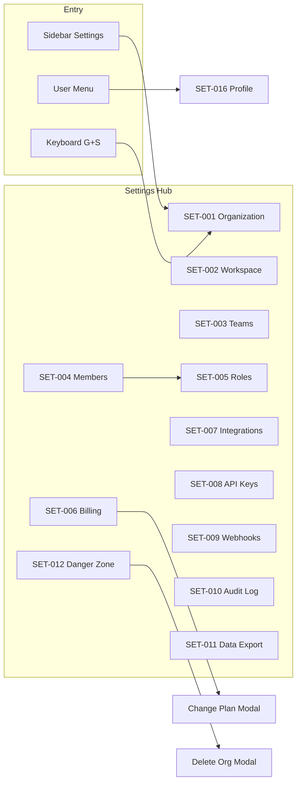

# Atlas Platform Settings UI

## Purpose

Specify all platform administration screens for organization governance, workspace management, team/member administration, RBAC, billing, integrations, developer tools (API keys, webhooks), compliance (audit log, data export), and destructive operations.

## Settings Layout

All `/settings/*` routes render inside authenticated shell with **settings sub-nav** (see [01-navigation-layout.md](./01-navigation-layout.md)).

```
┌────────┬──────────────────────────────────────────────────┐
│ SETTINGS│  PAGE HEADER                                    │
│ SUB-NAV │  Title + description + primary action           │
│ 220px   ├──────────────────────────────────────────────────┤
│        │  TAB BAR (if applicable)                         │
│        ├──────────────────────────────────────────────────┤
│        │  CONTENT (forms, tables, cards)                  │
│        │                                                  │
└────────┴──────────────────────────────────────────────────┘
```

**Mobile:** Sub-nav becomes horizontal scroll tabs below header.
**Tablet:** Sub-nav collapses to dropdown "Settings section".

---

## SET-001: Organization Settings

| Field | Value |
|-------|-------|
| **Screen ID** | SET-001 |
| **Route** | `/settings/organization` |
| **Purpose** | Manage org profile, regional settings, data residency |
| **Personas** | P2 Enterprise Admin |
| **Tier** | All |

#### Wireframe (Desktop)

```
┌──────────────────────────────────────────────────────────────┐
│ Organization settings                    [Save changes]      │
│ Manage your legal entity and regional configuration.         │
├──────────────────────────────────────────────────────────────┤
│ GENERAL                                                      │
│ Organization name    [Acme US Inc.____________]              │
│ Slug (read-only)     acme-us                                 │
│ Legal name           [Acme US Inc.____________]              │
│ Tax ID / VAT         [________________]                      │
│ Logo                 [Upload]                                │
├──────────────────────────────────────────────────────────────┤
│ REGIONAL                                                     │
│ Default currency     [USD ▾]                                 │
│ Fiscal year start    [January ▾]                             │
│ Date format          [MM/DD/YYYY ▾]                          │
│ Data residency       [United States ▾]  🔒 Enterprise        │
├──────────────────────────────────────────────────────────────┤
│ STATUS                                                       │
│ ● Active                          Provisioned: Jun 1, 2026     │
└──────────────────────────────────────────────────────────────┘
```

#### Components

- `<PageHeader />`, `<Card />`, `<Input />`, `<Select />`, `<FileUpload />`, `<Badge />`, `<Button />`

#### Actions & Permissions

| Action | Control | Permission | Tier |
|--------|---------|------------|------|
| Save changes | Primary | `platform:settings:manage` | All |
| Upload logo | File upload | `platform:settings:manage` | All |
| Change data residency | Select | `platform:settings:manage` + `admin:data_residency:manage` | Enterprise |
| View only | — | `platform:settings:read` | All |

#### Validation

| Field | Rule | Error |
|-------|------|-------|
| Org name | 2–100 chars | Required |
| Tax ID | Country-specific format | "Invalid tax ID format" |
| Logo | SVG/PNG, max 2MB | "File too large" |
| Data residency | Cannot change if data exists (ABAC) | "Contact support to migrate region" |

#### States

| State | Behavior |
|-------|----------|
| Loading | Form skeleton |
| Dirty form | Unsaved changes bar sticky bottom |
| Save success | Toast "Organization updated" |
| Save error | Field-level + banner |
| Read-only | All fields disabled; banner "View only access" |

#### Mobile Variant

Stacked fields; sticky save bar; logo upload full-width.

#### Tablet Variant

2-column grid for regional fields.

#### Related Modals

None.

---

## SET-002: Workspace Settings

| Field | Value |
|-------|-------|
| **Screen ID** | SET-002 |
| **Route** | `/settings/workspace` |
| **Purpose** | Manage workspace (billing root) settings and child organizations |
| **Personas** | P2 |
| **Tier** | All |

#### Wireframe

```
┌──────────────────────────────────────────────────────────────┐
│ Workspace settings              [+ Create workspace]         │
├──────────────────────────────────────────────────────────────┤
│ CURRENT WORKSPACE                                            │
│ Name              [Acme Holdings________]                    │
│ Owner             Jane Doe (transfer)                        │
│ Default org       [Acme US Inc. ▾]                           │
├──────────────────────────────────────────────────────────────┤
│ ORGANIZATIONS IN WORKSPACE                                   │
│ ┌────────────────────────────────────────────────────────┐   │
│ │ Acme US Inc.     Active    42 members    [Manage →]   │   │
│ │ Acme EU GmbH     Active    18 members    [Manage →]   │   │
│ └────────────────────────────────────────────────────────┘   │
├──────────────────────────────────────────────────────────────┤
│ PREFERENCES                                                  │
│ ☐ Allow members to create organizations                    │
│ Default role for new members  [Member ▾]                     │
└──────────────────────────────────────────────────────────────┘
```

#### Actions & Permissions

| Action | Control | Permission |
|--------|---------|------------|
| Save workspace | Primary | `admin:workspace:manage` |
| Create workspace | Button | `admin:workspace:create` |
| Transfer ownership | Link | `admin:workspace:transfer` → SET-012-M01 |
| Manage org | Row link | `platform:settings:read` |

#### States

| State | UI |
|-------|-----|
| Single org workspace | Org table still shown (1 row) |
| Multi-org | Org switcher context applies |

#### Mobile Variant

Org list as cards; create workspace in overflow menu.

#### Tablet Variant

Same as desktop with narrower table.

#### Related Modals

- **SET-002-M01: Create Workspace**

```
┌─────────────────────────────────────┐
│  Create workspace                   │
│  Name     [________________]        │
│  Slug     [________________]        │
│  [Cancel]  [Create]                 │
└─────────────────────────────────────┘
```

---

## SET-003: Team Management

| Field | Value |
|-------|-------|
| **Screen ID** | SET-003 |
| **Route** | `/settings/teams` |
| **Purpose** | CRUD teams; manage hierarchy and membership |
| **Personas** | P2, team leads |
| **Tier** | All |

#### Wireframe

```
┌──────────────────────────────────────────────────────────────┐
│ Teams                                    [+ Create team]     │
│ [Search teams...]                    [List view | Tree view] │
├──────────────────────────────────────────────────────────────┤
│ TREE VIEW                                                    │
│ ▼ Sales (12 members)                    [Edit] [⋯]          │
│   ├─ Sales EMEA (5)                     [Edit] [⋯]          │
│   └─ Sales Americas (7)                 [Edit] [⋯]          │
│ ▼ Engineering (28 members)              [Edit] [⋯]          │
│ ▼ Finance (8 members)                   [Edit] [⋯]          │
└──────────────────────────────────────────────────────────────┘
```

#### Components

- `<DataTable />`, `<TreeView />`, `<SearchInput />`, `<DropdownMenu />`, `<AvatarGroup />`

#### Actions & Permissions

| Action | Control | Permission |
|--------|---------|------------|
| Create team | Primary | `admin:teams:manage` |
| Edit team | Row action | `admin:teams:manage` |
| Delete team | Overflow | `admin:teams:manage` |
| View teams | — | `admin:teams:read` |
| Manage members in team | Edit modal tab | `admin:teams:manage` or team `LEAD` |

#### States

| State | UI |
|-------|-----|
| Empty | "No teams yet" + create CTA |
| Max depth (5) | Disable "Add sub-team" with tooltip |
| Loading | Tree skeleton |

#### Mobile Variant

List view only (no tree); tap team → detail page with members.

#### Tablet Variant

Tree view with smaller indent; edit opens drawer.

#### Related Modals

- **SET-003-M01: Create Team** — Name, slug, parent team (optional), description
- **SET-003-M02: Edit Team** — Same fields + members tab with add/remove
- **SET-003-M03: Delete Team Confirm** — Type team name to confirm; warns about member role impact

---

## SET-004: Member Management

| Field | Value |
|-------|-------|
| **Screen ID** | SET-004 |
| **Route** | `/settings/members` |
| **Purpose** | Invite, manage, suspend, remove organization members |
| **Personas** | P2 |
| **Tier** | All |

#### Wireframe

```
┌──────────────────────────────────────────────────────────────┐
│ Members                                  [Invite member]     │
│ [Search...] [Role ▾] [Team ▾] [Status ▾]                    │
├──────────────────────────────────────────────────────────────┤
│ ☐ │ Name          │ Email           │ Role    │ Status │ ⋯ │
│ ☐ │ Jane Doe      │ jane@acme.com   │ Owner   │ Active │ ⋯ │
│ ☐ │ Bob Smith     │ bob@acme.com    │ Admin   │ Active │ ⋯ │
│ ☐ │ (pending)     │ new@acme.com    │ Member  │ Invited│ ⋯ │
├──────────────────────────────────────────────────────────────┤
│ Bulk: [Change role ▾] [Remove]     Seats: 12/15 used        │
└──────────────────────────────────────────────────────────────┘
```

#### Tabs

`Active` | `Invited` | `Suspended`

#### Actions & Permissions

| Action | Control | Permission |
|--------|---------|------------|
| Invite member | Primary | `admin:members:invite` |
| Edit roles | Row ⋯ | `admin:members:manage` |
| Suspend | Row ⋯ | `admin:members:manage` |
| Remove | Row ⋯ | `admin:members:manage` |
| Resend invite | Row ⋯ | `admin:members:invite` |
| Bulk remove | Bulk bar | `admin:members:manage` |
| Export CSV | Secondary | `admin:members:read` |

**ABAC rules:**
- Cannot remove sole owner
- Cannot demote self if sole admin
- Cannot assign role with permissions user doesn't hold

#### States

| State | UI |
|-------|-----|
| Seat limit reached | Invite disabled; upgrade CTA |
| Empty | Illustration + invite CTA |
| SCIM enabled | Banner "Members managed by SCIM"; invite disabled |

#### Mobile Variant

Card list per member; bulk actions via long-press.

#### Tablet Variant

Table with hidden email column on narrow tablet.

#### Related Modals

- **SET-004-M01: Invite Member**

```
┌─────────────────────────────────────┐
│  Invite team members                │
│  Emails  [email1@, email2@...]     │
│  Role    [Member ▾]                 │
│  Team    [Sales ▾] (optional)       │
│  Message [optional personal note]   │
│  [Cancel]  [Send invites]           │
└─────────────────────────────────────┘
```

- **SET-004-M02: Edit Member Roles** — Role select, team assignments, workspace scope
- **SET-004-M03: Remove Member Confirm** — Destructive; shows data ownership transfer options
- **SET-004-M04: Resend Invitation** — Confirm email; rate limited

---

## SET-005: Roles & Permissions

| Field | Value |
|-------|-------|
| **Screen ID** | SET-005 |
| **Route** | `/settings/roles` |
| **Purpose** | Manage system and custom roles; edit permission matrix |
| **Personas** | P2 |
| **Tier** | Business+ (custom roles); all tiers view system roles |

#### Wireframe

```
┌──────────────────────────────────────────────────────────────┐
│ Roles & permissions              [+ Create role] [Simulator] │
├──────────────────┬───────────────────────────────────────────┤
│ ROLES LIST       │ PERMISSION MATRIX                         │
│ ● Owner (system) │ Module    │ Read │ Write │ Delete │ Admin│
│ ● Admin (system) │ CRM       │  ✓   │   ✓   │   ✓    │      │
│ ● Member         │ Finance   │  ✓   │   ○   │   ○    │      │
│ ● Viewer         │ Projects  │  ✓   │   ✓   │   ○    │      │
│ ○ Sales Manager  │ HR        │  ✓   │   ○   │   ○    │      │
│   (custom)       │ ...       │      │       │        │      │
│                  │ [Save permissions]                        │
└──────────────────┴───────────────────────────────────────────┘
```

#### Components

- `<SplitPane />`, `<PermissionMatrix />`, `<Checkbox />`, `<Badge />`, `<Tabs />`

#### Actions & Permissions

| Action | Control | Permission | Tier |
|--------|---------|------------|------|
| View roles | — | `admin:roles:read` | All |
| Create custom role | Button | `admin:roles:manage` | Business+ |
| Edit permissions | Matrix toggles | `admin:roles:manage` | Business+ |
| Delete custom role | Overflow | `admin:roles:manage` | Business+ |
| Open simulator | Button | `admin:roles:read` | Business+ |
| Customize system role | Enterprise only | `admin:roles:manage` | Enterprise |

#### States

| State | UI |
|-------|-----|
| System role selected | Matrix read-only except Enterprise |
| Unsaved matrix changes | Sticky save bar |
| Role has members | Delete disabled with member count |

#### Mobile Variant

Roles list full screen → tap role → matrix full screen with horizontal scroll.

#### Tablet Variant

Collapsible roles list drawer; matrix takes 70% width.

#### Related Modals

- **SET-005-M01: Create Role** — Name, description, clone from existing (optional)
- **SET-005-M02: Edit Permissions Matrix** — Full-screen on mobile; module tabs + resource rows
- **SET-005-M03: Delete Role Confirm** — Reassign members dropdown required
- **SET-005-M04: Policy Simulator** — "Can {user} {action} on {resource}?" → ALLOW/DENY + reason

```
┌─────────────────────────────────────┐
│  Policy simulator                   │
│  User      [Bob Smith ▾]            │
│  Action    [finance:invoices:write] │
│  Resource  [Invoice #1042 ▾]        │
│  [Evaluate]                         │
│  Result: DENY — invoice status sent │
└─────────────────────────────────────┘
```

---

## SET-006: Billing Overview

| Field | Value |
|-------|-------|
| **Screen ID** | SET-006 |
| **Route** | `/settings/billing` |
| **Purpose** | Subscription, usage, payment methods, invoices |
| **Personas** | P1, P2 |
| **Tier** | All |

#### Wireframe

```
┌──────────────────────────────────────────────────────────────┐
│ Billing                              [Change plan]           │
├──────────────────────────────────────────────────────────────┤
│ CURRENT PLAN                                                 │
│ Growth · $49/seat/mo · 15 seats · Renews Jul 30, 2026       │
│ [Manage seats]                                               │
├──────────────────────────────────────────────────────────────┤
│ USAGE THIS PERIOD                                            │
│ API calls    ████████░░  82K / 100K                          │
│ Storage      ███░░░░░░░  12 GB / 50 GB                       │
│ AI tokens    ██████████  95% — upgrade or overage applies    │
├──────────────────────────────────────────────────────────────┤
│ PAYMENT METHOD                                               │
│ Visa •••• 4242  exp 12/28         [Update] [+ Add]           │
├──────────────────────────────────────────────────────────────┤
│ INVOICES                                                     │
│ Jun 1, 2026  $735.00  Paid    [Download PDF]                 │
│ May 1, 2026  $735.00  Paid    [Download PDF]                 │
├──────────────────────────────────────────────────────────────┤
│ [Cancel subscription]                                        │
└──────────────────────────────────────────────────────────────┘
```

#### Components

- `<StatCard />`, `<Progress />`, `<DataTable />`, `<StripePaymentElement />`, `<Badge />`

#### Actions & Permissions

| Action | Control | Permission |
|--------|---------|------------|
| Change plan | Button | `admin:billing:manage` |
| Manage seats | Link | `admin:billing:manage` |
| Add/update payment | Button | `admin:billing:manage` |
| Download invoice | Row | `admin:billing:read` |
| Cancel subscription | Destructive link | `admin:billing:manage` |
| View billing | — | `admin:billing:read` |

#### States

| State | UI |
|-------|-----|
| Trial active | Banner with days remaining |
| Past due | Error banner + update payment CTA |
| Dunning | Warning banner with stage info |
| Loading | Stripe elements skeleton |

#### Mobile Variant

Usage meters stacked; invoices as cards.

#### Tablet Variant

2-column: plan + usage left, payment + invoices right.

#### Related Modals

- **SET-006-M01: Change Plan** — Tier comparison; proration preview; confirm
- **SET-006-M02: Add Payment Method** — Stripe Payment Element modal
- **SET-006-M03: Cancel Subscription** — Multi-step: reason survey → confirm → effective date

---

## SET-007: Integration Settings

| Field | Value |
|-------|-------|
| **Screen ID** | SET-007 |
| **Route** | `/settings/integrations` |
| **Purpose** | Connect third-party services (calendar, payroll, Stripe, etc.) |
| **Personas** | P2, P1 |
| **Tier** | Growth+ |

#### Wireframe

```
┌──────────────────────────────────────────────────────────────┐
│ Integrations                                                 │
│ [Search integrations...]     [Connected | Available | All]    │
├──────────────────────────────────────────────────────────────┤
│ ┌──────────────┐ ┌──────────────┐ ┌──────────────┐           │
│ │ Google Cal   │ │ Microsoft 365│ │ Stripe       │           │
│ │ ● Connected  │ │ ○ Available  │ │ ● Connected  │           │
│ │ [Configure]  │ │ [Connect]    │ │ [Configure]  │           │
│ └──────────────┘ └──────────────┘ └──────────────┘           │
│ ┌──────────────┐ ┌──────────────┐                            │
│ │ Gusto Payroll│ │ Slack        │                            │
│ │ ○ Available  │ │ ○ Available  │                            │
│ └──────────────┘ └──────────────┘                            │
└──────────────────────────────────────────────────────────────┘
```

#### Actions & Permissions

| Action | Control | Permission |
|--------|---------|------------|
| Connect | Card CTA | `platform:integrations:manage` |
| Configure | Button | `platform:integrations:manage` |
| Disconnect | Configure page | `platform:integrations:manage` |
| View | — | `platform:integrations:read` |

#### States

| State | UI |
|-------|-----|
| OAuth in progress | Redirect spinner |
| Connection error | Card error badge + retry |
| Re-auth required | Warning badge on connected card |

#### Mobile Variant

Single column integration cards.

#### Tablet Variant

2-column grid.

#### Related Modals

- **SET-007-M01: Connect Integration** — OAuth explainer + permissions list + [Authorize]
- **SET-007-M02: Disconnect Integration** — Warn about dependent features; type integration name

---

## SET-008: API Keys

| Field | Value |
|-------|-------|
| **Screen ID** | SET-008 |
| **Route** | `/settings/api-keys` |
| **Purpose** | Manage service account API keys and scopes |
| **Personas** | P2, developers |
| **Tier** | Growth+ |

#### Wireframe

```
┌──────────────────────────────────────────────────────────────┐
│ API keys                                 [+ Create API key]  │
│ Service accounts for programmatic access.                    │
├──────────────────────────────────────────────────────────────┤
│ Name            │ Key prefix   │ Scopes        │ Last used │⋯│
│ ERP Integration │ ak_live_•••• │ contacts R/W  │ 2h ago    │⋯│
│ CI Pipeline     │ ak_live_•••• │ admin:read    │ 1d ago    │⋯│
└──────────────────────────────────────────────────────────────┘
```

#### Actions & Permissions

| Action | Control | Permission |
|--------|---------|------------|
| Create key | Primary | `platform:api_keys:manage` |
| Revoke key | Row ⋯ | `platform:api_keys:manage` |
| Rotate key | Row ⋯ | `platform:api_keys:manage` |
| View keys | — | `platform:api_keys:read` |

#### States

| State | UI |
|-------|-----|
| Empty | Security best practices illustration + CTA |
| Key created | SET-008-M03 one-time secret display |

#### Mobile Variant

Card per key; scopes as badge wrap.

#### Tablet Variant

Full table with horizontal scroll for scopes.

#### Related Modals

- **SET-008-M01: Create API Key** — Name, expiration, scope multi-select (grouped by module)
- **SET-008-M02: Revoke API Key** — Destructive confirm; shows last used timestamp
- **SET-008-M03: API Key Created** — Full secret shown once; copy button; "I've saved this key" checkbox required to close

---

## SET-009: Webhooks

| Field | Value |
|-------|-------|
| **Screen ID** | SET-009 |
| **Route** | `/settings/webhooks` |
| **Purpose** | Configure outbound webhook endpoints and monitor deliveries |
| **Personas** | P2, developers |
| **Tier** | Growth+ |

#### Wireframe

```
┌──────────────────────────────────────────────────────────────┐
│ Webhooks                                 [+ Create webhook]  │
├──────────────────────────────────────────────────────────────┤
│ Endpoint                    │ Events      │ Status  │ Success│
│ https://api.example.com/hook│ 12 events   │ Active  │ 99.2%  │
│ https://hooks.zapier.com/.. │ 3 events    │ Paused  │ —      │
└──────────────────────────────────────────────────────────────┘
```

**Detail view** (`/settings/webhooks/{id}`):

```
│ URL: https://...                                             │
│ Signing secret: whsec_••••••  [Rotate]                       │
│ Events: ☑ lead.created ☑ invoice.paid ☐ ...                  │
│ Recent deliveries table → SET-009-M02                        │
```

#### Actions & Permissions

| Action | Control | Permission |
|--------|---------|------------|
| Create webhook | Primary | `platform:webhooks:manage` |
| Edit events | Detail form | `platform:webhooks:manage` |
| Pause/resume | Toggle | `platform:webhooks:manage` |
| View delivery log | Link | `platform:webhooks:read` |
| Rotate secret | Button | `platform:webhooks:manage` |
| Send test event | Secondary | `platform:webhooks:manage` |

#### States

| State | UI |
|-------|-----|
| Delivery failures | Row warning badge; auto-pause after 10 consecutive failures |
| Empty | Webhook explainer + CTA |

#### Mobile Variant

List cards; detail as full page.

#### Tablet Variant

Table + side detail panel.

#### Related Modals

- **SET-009-M01: Create Webhook** — URL (HTTPS required), event checkboxes, description
- **SET-009-M02: Webhook Delivery Log** — Request/response payload viewer (JSON monospace)
- **SET-009-M03: Rotate Webhook Secret** — New secret one-time display; 24h grace period note

---

## SET-010: Audit Log Viewer

| Field | Value |
|-------|-------|
| **Screen ID** | SET-010 |
| **Route** | `/settings/audit-log` |
| **Purpose** | Search and export immutable audit trail |
| **Personas** | P2, P4 |
| **Tier** | Growth+ (90 days); Business+ (1 year); Enterprise (7 years) |

#### Wireframe

```
┌──────────────────────────────────────────────────────────────┐
│ Audit log                              [Export CSV]          │
│ [Search actor, action, resource...]                          │
│ [Date range ▾] [Actor ▾] [Action ▾] [Module ▾] [Result ▾]   │
├──────────────────────────────────────────────────────────────┤
│ Timestamp        │ Actor      │ Action              │ Result │
│ Jun 30 14:02:11  │ jane@acme  │ finance:invoices:write │ ALLOW │
│ Jun 30 14:01:55  │ bob@acme   │ admin:members:invite   │ ALLOW │
│ Jun 30 13:58:00  │ api:erp    │ contacts:read          │ DENY  │
├──────────────────────────────────────────────────────────────┤
│ ◄ 1 2 3 ... 42 ►                                            │
└──────────────────────────────────────────────────────────────┘
```

**Detail drawer** (row click):

```
│ Event ID: audit_uuid                                         │
│ Decision: DENY                                               │
│ Reason: abac:invoice_status_sent                             │
│ Resource: invoice:uuid                                       │
│ IP: 203.0.113.1 · User-Agent: ...                            │
│ Evaluation: rbac=ALLOW abac=DENY (2ms)                       │
```

#### Actions & Permissions

| Action | Control | Permission |
|--------|---------|------------|
| Search/filter | Filters | `admin:audit:read` |
| View detail | Row click | `admin:audit:read` |
| Export CSV | Button | `admin:audit:export` |
| Export SIEM | Enterprise | `admin:audit:export` |

#### States

| State | UI |
|-------|-----|
| Loading | Table skeleton |
| Empty filters | "No events match filters" |
| Retention limit | Banner "Showing last 90 days per plan" |

#### Mobile Variant

Card list; filters in bottom sheet drawer.

#### Tablet Variant

Table with fewer columns; detail in drawer.

#### Related Modals

None (detail uses drawer).

---

## SET-011: Data Export

| Field | Value |
|-------|-------|
| **Screen ID** | SET-011 |
| **Route** | `/settings/data-export` |
| **Purpose** | GDPR-compliant full organization data export |
| **Personas** | P2 |
| **Tier** | Growth+ |

#### Wireframe

```
┌──────────────────────────────────────────────────────────────┐
│ Data export                                                  │
│ Export all organization data for backup or migration.          │
│ GDPR right to portability supported.                         │
├──────────────────────────────────────────────────────────────┤
│ EXPORT SCOPE                                                 │
│ ○ Full organization export                                   │
│ ○ Select modules: ☑ CRM ☑ Finance ☐ HR ...                    │
│ Format: [JSON ▾]  [CSV bundle]                               │
├──────────────────────────────────────────────────────────────┤
│ RECENT EXPORTS                                               │
│ Jun 15, 2026  Full  Completed  [Download] (expires 7d)     │
│ May 1, 2026   CRM   Completed  Expired                       │
├──────────────────────────────────────────────────────────────┤
│ [Request export]                                             │
└──────────────────────────────────────────────────────────────┘
```

#### Actions & Permissions

| Action | Control | Permission |
|--------|---------|------------|
| Request export | Primary | `admin:data_export:manage` |
| Download | Row link | `admin:data_export:read` |
| View status | — | `admin:data_export:read` |

#### States

| State | UI |
|-------|-----|
| Export in progress | Progress bar; email on completion |
| Failed | Error reason + retry |
| Concurrent export | Disabled with "Export in progress" |

#### Mobile / Tablet

Same layout; download opens signed URL.

#### Related Modals

- **SET-011-M01: Request Data Export** — Confirm scope; estimated size; email notification opt-in; MFA step-up for full export

---

## SET-012: Danger Zone

| Field | Value |
|-------|-------|
| **Screen ID** | SET-012 |
| **Route** | `/settings/danger-zone` |
| **Purpose** | Irreversible workspace/org operations |
| **Personas** | P2 (owner only) |
| **Tier** | All |

#### Wireframe

```
┌──────────────────────────────────────────────────────────────┐
│ ⚠️ Danger zone                                               │
│ Irreversible actions. Proceed with caution.                  │
├──────────────────────────────────────────────────────────────┤
│ TRANSFER OWNERSHIP                                           │
│ Transfer org ownership to another member.                    │
│ [Transfer ownership]                                         │
├──────────────────────────────────────────────────────────────┤
│ DELETE ORGANIZATION                                          │
│ Permanently delete this organization and all its data.       │
│ Type organization name to confirm.                           │
│ [Delete organization]                                        │
├──────────────────────────────────────────────────────────────┤
│ DELETE WORKSPACE                                             │
│ Deletes all organizations in workspace. Billing ends.        │
│ [Delete workspace]                                           │
└──────────────────────────────────────────────────────────────┘
```

#### Actions & Permissions

| Action | Control | Permission |
|--------|---------|------------|
| Transfer ownership | Button | `admin:ownership:transfer` (owner) |
| Delete organization | Destructive | `admin:org:delete` (owner) |
| Delete workspace | Destructive | `admin:workspace:delete` (workspace owner) |

**ABAC:**
- Cannot delete org with active legal hold
- Cannot delete if sole org in workspace without workspace delete
- MFA step-up required for all actions

#### States

| State | UI |
|-------|-----|
| Legal hold active | Delete disabled with explanation |
| Pending export | Warn "Export data first" |

#### Mobile Variant

Full-width destructive buttons; confirm modals full-screen.

#### Tablet Variant

Same as desktop with warning cards.

#### Related Modals

- **SET-012-M01: Transfer Ownership** — Select member dropdown; MFA verify; confirm
- **SET-012-M02: Delete Organization** — Type-to-confirm `{orgName}`; checklist acknowledgments; MFA; 48h grace period option (Enterprise)
- **SET-012-M03: Delete Workspace** — Type `{workspaceName}`; lists all orgs to delete; MFA

---

## SET-013: SSO Configuration

| Field | Value |
|-------|-------|
| **Screen ID** | SET-013 |
| **Route** | `/settings/security/sso` |
| **Purpose** | Configure SAML/OIDC enterprise SSO |
| **Tier** | Business+ |

#### Wireframe

```
┌──────────────────────────────────────────────────────────────┐
│ Single sign-on (SSO)                                         │
│ [SAML 2.0 | OIDC]                                            │
├──────────────────────────────────────────────────────────────┤
│ ☐ Enable SSO                                                 │
│ ☐ Enforce SSO (disable password login)                       │
│ ☐ JIT provisioning                                           │
│ IdP Entity ID    [________________________]                  │
│ SSO URL          [________________________]                  │
│ Certificate      [Upload PEM]  [View current]                │
│ Default role     [Member ▾]                                  │
├──────────────────────────────────────────────────────────────┤
│ SP Metadata    [Download XML]  ACS URL: https://auth...      │
│ Domain verification: acme.com ✓ Verified                     │
│ [Save]  [Test SSO]                                           │
└──────────────────────────────────────────────────────────────┘
```

#### Actions & Permissions

| Action | Permission |
|--------|------------|
| Configure SSO | `admin:security:manage` |
| Test SSO | `admin:security:manage` |
| Enforce SSO | `admin:security:manage` + MFA on admin account |

#### Related Modals

- **SET-013-M01: Upload SAML Certificate** — PEM paste or file upload; expiry date warning

---

## SET-014: Security Policies

| Field | Value |
|-------|-------|
| **Screen ID** | SET-014 |
| **Route** | `/settings/security/policies` |
| **Purpose** | Tenant security policies (MFA, session, IP) |
| **Tier** | Business+ |

#### Wireframe

```
│ MFA POLICY                                                   │
│ Require MFA    [All users ▾]                                 │
│ Allowed methods  ☑ Passkey ☑ TOTP ☐ SMS                      │
│ SESSION POLICY                                               │
│ Max concurrent sessions  [10]                                │
│ Idle timeout (minutes)   [30]                                │
│ IP RESTRICTIONS (Enterprise)                                 │
│ Allowlist  [+ Add CIDR]                                      │
```

#### Actions

| Action | Permission |
|--------|------------|
| Save policies | `admin:security:manage` |

---

## SET-015: Notification Preferences

| Field | Value |
|-------|-------|
| **Screen ID** | SET-015 |
| **Route** | `/settings/notifications` |
| **Purpose** | Per-user and org-default notification channels |
| **Tier** | All |

#### Wireframe

```
│ CHANNELS                                                     │
│ Email  ☑  Push  ☑  In-app  ☑  SMS  ☐                        │
│ CATEGORIES                                                   │
│ Mentions        [All ▾]  Email ✓ Push ✓                      │
│ Approvals       [All ▾]  Email ✓ Push ✓                      │
│ Billing alerts  [Admin only]  Email ✓                        │
│ Digest          [Daily ▾]  [Off | Daily | Weekly]            │
```

---

## SET-016: Profile & Account

| Field | Value |
|-------|-------|
| **Screen ID** | SET-016 |
| **Route** | `/settings/profile` |
| **Purpose** | User profile, password, MFA, sessions, preferences |
| **Tier** | All |

#### Wireframe

```
│ Tabs: [Profile] [Security] [Sessions] [Preferences]          │
├──────────────────────────────────────────────────────────────┤
│ PROFILE                                                      │
│ Avatar  [Upload]   Name  [Jane Doe]                          │
│ Email   jane@acme.com (verified)  [Change]                   │
│ Locale  [English ▾]  Timezone [Pacific ▾]                    │
├──────────────────────────────────────────────────────────────┤
│ SECURITY                                                     │
│ Password  [Change password]                                  │
│ MFA       ● Enabled (Passkey)  [Manage → AUTH-005]           │
│ Passkeys  [MacBook] [iPhone]  [+ Add]                        │
├──────────────────────────────────────────────────────────────┤
│ ACTIVE SESSIONS                                              │
│ Chrome on MacBook · SF, US · Current    [Revoke others]      │
│ Safari on iPhone  · SF, US · 2h ago     [Revoke]             │
```

#### Actions

| Action | Permission |
|--------|------------|
| Edit own profile | — (authenticated) |
| Change password | — |
| Manage MFA | — |
| Revoke sessions | — |

---

## Settings Permission Summary

| Permission | Screens |
|------------|---------|
| `platform:settings:read` | All settings (read-only mode) |
| `platform:settings:manage` | SET-001, SET-002 |
| `admin:teams:read` | SET-003 view |
| `admin:teams:manage` | SET-003 mutate |
| `admin:members:invite` | SET-004 invite |
| `admin:members:manage` | SET-004 edit/remove |
| `admin:roles:manage` | SET-005 |
| `admin:billing:manage` | SET-006 mutate |
| `admin:billing:read` | SET-006 view |
| `platform:integrations:manage` | SET-007 |
| `platform:api_keys:manage` | SET-008 |
| `platform:webhooks:manage` | SET-009 |
| `admin:audit:read` | SET-010 |
| `admin:data_export:manage` | SET-011 |
| `admin:org:delete` | SET-012 |
| `admin:security:manage` | SET-013, SET-014 |

---

## Settings Navigation Flow



---

## Revision History

| Version | Date | Changes |
|---------|------|---------|
| 1.0.0 | 2026-06-30 | Initial platform settings UI specification |

---

*Document owner: UX Architecture*